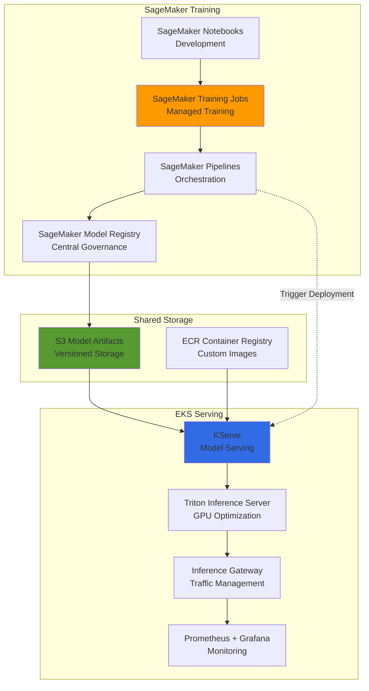
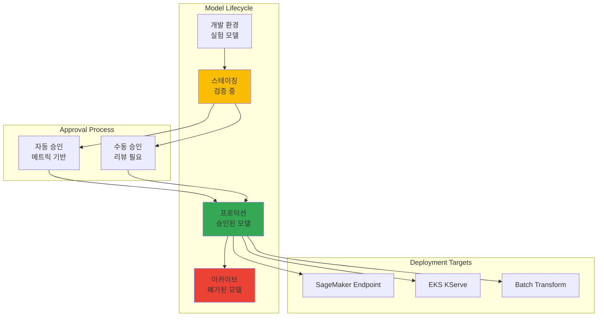
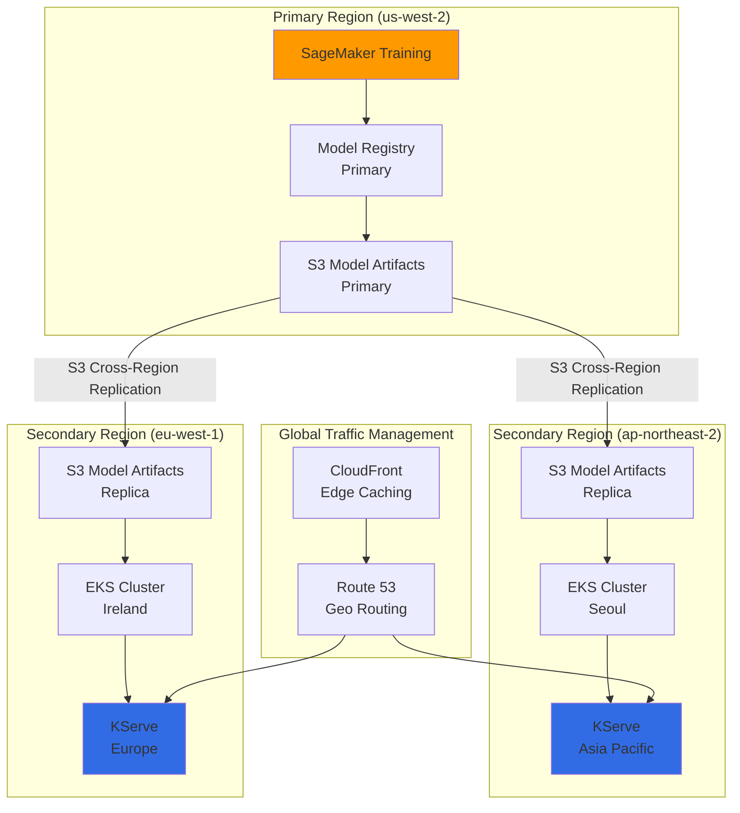
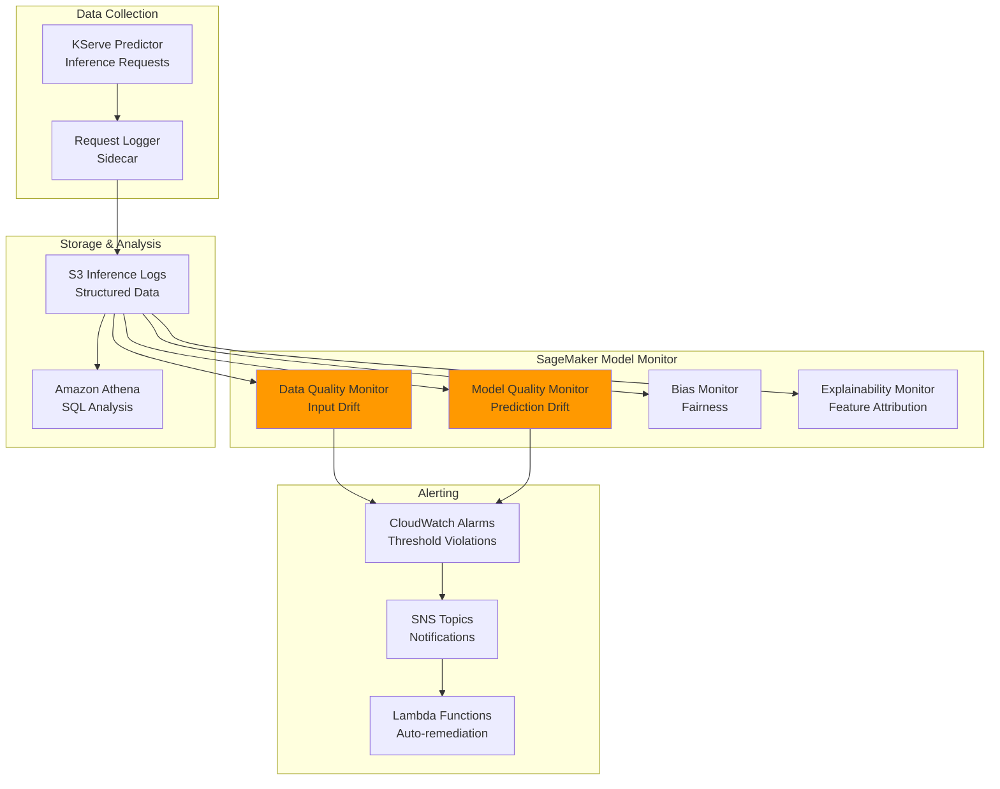

import SpecificationTable from '@site/src/components/tables/SpecificationTable';
import { HybridComparison, CostOptimization } from '@site/src/components/SagemakerTables';

# SageMaker-EKS 하이브리드 ML 아키텍처

> 📅 **작성일**: 2026-02-13 | ⏱️ **읽는 시간**: 약 22분

## 개요

SageMaker의 관리형 학습 환경과 EKS의 유연한 서빙 인프라를 결합한 하이브리드 ML 아키텍처를 설계합니다. 이 접근 방식은 각 플랫폼의 강점을 활용하여 비용 효율성과 운영 유연성을 동시에 달성합니다.

### 하이브리드 아키텍처의 장점

<HybridComparison />


## 하이브리드 아키텍처 패턴

### 전체 아키텍처 개요



### 패턴 1: SageMaker 학습 → EKS 서빙

가장 일반적인 하이브리드 패턴으로, SageMaker에서 모델을 학습하고 EKS에서 서빙합니다.

**사용 사례:**
- 대규모 분산 학습이 필요한 경우
- 학습 인프라 관리 부담을 줄이고 싶은 경우
- 서빙 환경에서 세밀한 제어가 필요한 경우


### 패턴 2: EKS 학습 → SageMaker 서빙

특수한 학습 환경이 필요하지만 서빙은 관리형으로 운영하고 싶은 경우입니다.

**사용 사례:**
- 커스텀 학습 프레임워크 사용
- Kubernetes 네이티브 학습 도구 활용 (Kubeflow, Ray)
- 서빙 인프라 관리 부담을 줄이고 싶은 경우

### 패턴 3: 하이브리드 서빙

SageMaker Endpoint와 EKS 서빙을 동시에 운영하여 워크로드를 분산합니다.

**사용 사례:**
- 고가용성이 중요한 프로덕션 환경
- 멀티 리전 배포
- A/B 테스팅 및 카나리 배포

---

## SageMaker Pipelines 통합

### SageMaker Components for Kubeflow Pipelines

AWS는 Kubeflow Pipelines에서 SageMaker를 호출할 수 있는 공식 컴포넌트를 제공합니다.

```python
# sagemaker_kubeflow_pipeline.py
import kfp
from kfp import dsl
from kfp.aws import use_aws_secret
import sagemaker
from sagemaker.workflow.pipeline_context import PipelineSession

@dsl.component(
    base_image="public.ecr.aws/sagemaker/sagemaker-distribution:latest",
    packages_to_install=["sagemaker>=2.200.0"]
)
def sagemaker_training_component(
    training_image: str,
    role_arn: str,
    instance_type: str,
    instance_count: int,
    s3_input_data: str,
    s3_output_path: str,
    hyperparameters: dict
) -> str:
    """SageMaker Training Job 실행 컴포넌트"""
    import boto3
    import sagemaker
    from sagemaker.estimator import Estimator
    
    session = sagemaker.Session()
    
    estimator = Estimator(
        image_uri=training_image,
        role=role_arn,
        instance_count=instance_count,
        instance_type=instance_type,
        output_path=s3_output_path,
        sagemaker_session=session,
        hyperparameters=hyperparameters
    )
    
    estimator.fit({"training": s3_input_data}, wait=True)
    
    # 모델 아티팩트 경로 반환
    return estimator.model_data


@dsl.component(
    base_image="public.ecr.aws/sagemaker/sagemaker-distribution:latest",
    packages_to_install=["sagemaker>=2.200.0"]
)
def register_model_to_registry(
    model_data: str,
    model_package_group_name: str,
    inference_image: str,
    role_arn: str
) -> str:
    """SageMaker Model Registry에 모델 등록"""
    import boto3
    import sagemaker
    from sagemaker.model import Model
    
    session = sagemaker.Session()
    
    model = Model(
        image_uri=inference_image,
        model_data=model_data,
        role=role_arn,
        sagemaker_session=session
    )
    
    # Model Registry에 등록
    model_package = model.register(
        content_types=["application/json"],
        response_types=["application/json"],
        inference_instances=["ml.g5.xlarge"],
        transform_instances=["ml.g5.xlarge"],
        model_package_group_name=model_package_group_name,
        approval_status="PendingManualApproval"
    )
    
    return model_package.model_package_arn


@dsl.component(
    base_image="python:3.10",
    packages_to_install=["kubernetes", "boto3"]
)
def deploy_to_kserve(
    model_package_arn: str,
    model_name: str,
    namespace: str = "kserve-inference"
) -> str:
    """KServe InferenceService 배포"""
    import boto3
    from kubernetes import client, config
    
    # SageMaker Model Registry에서 모델 정보 조회
    sm_client = boto3.client('sagemaker')
    model_package = sm_client.describe_model_package(
        ModelPackageName=model_package_arn
    )
    
    model_data_url = model_package['InferenceSpecification']['Containers'][0]['ModelDataUrl']
    
    # KServe InferenceService 생성
    config.load_incluster_config()
    custom_api = client.CustomObjectsApi()
    
    inference_service = {
        "apiVersion": "serving.kserve.io/v1beta1",
        "kind": "InferenceService",
        "metadata": {
            "name": model_name,
            "namespace": namespace
        },
        "spec": {
            "predictor": {
                "pytorch": {
                    "storageUri": model_data_url,
                    "resources": {
                        "requests": {
                            "nvidia.com/gpu": "1",
                            "memory": "8Gi"
                        },
                        "limits": {
                            "nvidia.com/gpu": "1",
                            "memory": "16Gi"
                        }
                    }
                }
            },
            "minReplicas": 2,
            "maxReplicas": 10
        }
    }
    
    custom_api.create_namespaced_custom_object(
        group="serving.kserve.io",
        version="v1beta1",
        namespace=namespace,
        plural="inferenceservices",
        body=inference_service
    )
    
    return f"Deployed {model_name} to KServe"


@dsl.pipeline(
    name="SageMaker to EKS Hybrid Pipeline",
    description="Train on SageMaker, deploy to EKS"
)
def hybrid_ml_pipeline(
    training_image: str = "763104351884.dkr.ecr.us-west-2.amazonaws.com/pytorch-training:2.1.0-gpu-py310",
    inference_image: str = "763104351884.dkr.ecr.us-west-2.amazonaws.com/pytorch-inference:2.1.0-gpu-py310",
    role_arn: str = "arn:aws:iam::123456789012:role/SageMakerExecutionRole",
    instance_type: str = "ml.g5.2xlarge",
    s3_input_data: str = "s3://my-bucket/training-data/",
    s3_output_path: str = "s3://my-bucket/models/",
    model_package_group: str = "fraud-detection-models"
):
    # 1. SageMaker에서 학습
    training_task = sagemaker_training_component(
        training_image=training_image,
        role_arn=role_arn,
        instance_type=instance_type,
        instance_count=2,
        s3_input_data=s3_input_data,
        s3_output_path=s3_output_path,
        hyperparameters={
            "epochs": "50",
            "batch-size": "64",
            "learning-rate": "0.001"
        }
    )
    training_task.apply(use_aws_secret('aws-secret', 'AWS_ACCESS_KEY_ID', 'AWS_SECRET_ACCESS_KEY'))
    
    # 2. Model Registry에 등록
    registry_task = register_model_to_registry(
        model_data=training_task.output,
        model_package_group_name=model_package_group,
        inference_image=inference_image,
        role_arn=role_arn
    )
    registry_task.apply(use_aws_secret('aws-secret', 'AWS_ACCESS_KEY_ID', 'AWS_SECRET_ACCESS_KEY'))
    
    # 3. EKS KServe에 배포
    deploy_task = deploy_to_kserve(
        model_package_arn=registry_task.output,
        model_name="fraud-detection-v1",
        namespace="kserve-inference"
    )
    
    return deploy_task.output
```


---

## SageMaker Model Registry 거버넌스

### 중앙 집중식 모델 관리

SageMaker Model Registry는 모든 모델의 중앙 저장소 역할을 하며, EKS 서빙 환경에서도 동일한 거버넌스를 적용할 수 있습니다.



### Model Registry 설정

```python
# model_registry_setup.py
import boto3
import sagemaker
from sagemaker.model_package import ModelPackageGroup

sm_client = boto3.client('sagemaker')
session = sagemaker.Session()

# Model Package Group 생성
model_package_group_name = "fraud-detection-models"

try:
    sm_client.create_model_package_group(
        ModelPackageGroupName=model_package_group_name,
        ModelPackageGroupDescription="Fraud detection models for production",
        Tags=[
            {"Key": "Team", "Value": "ml-platform"},
            {"Key": "Environment", "Value": "production"}
        ]
    )
except sm_client.exceptions.ResourceInUse:
    print(f"Model package group {model_package_group_name} already exists")

# 모델 승인 정책 설정
model_approval_policy = {
    "Rules": [
        {
            "Name": "AutoApproveHighAccuracy",
            "Condition": {
                "MetricName": "accuracy",
                "Operator": "GreaterThanOrEqualTo",
                "Value": 0.95
            },
            "Action": "Approve"
        },
        {
            "Name": "RejectLowAccuracy",
            "Condition": {
                "MetricName": "accuracy",
                "Operator": "LessThan",
                "Value": 0.85
            },
            "Action": "Reject"
        }
    ]
}
```

### EKS에서 Model Registry 조회

```python
# eks_model_loader.py
import boto3
from kubernetes import client, config

def get_approved_model_from_registry(model_package_group_name: str) -> str:
    """Model Registry에서 승인된 최신 모델 조회"""
    sm_client = boto3.client('sagemaker')
    
    # 승인된 모델 패키지 조회
    response = sm_client.list_model_packages(
        ModelPackageGroupName=model_package_group_name,
        ModelApprovalStatus='Approved',
        SortBy='CreationTime',
        SortOrder='Descending',
        MaxResults=1
    )
    
    if not response['ModelPackageSummaryList']:
        raise ValueError(f"No approved models found in {model_package_group_name}")
    
    model_package_arn = response['ModelPackageSummaryList'][0]['ModelPackageArn']
    
    # 모델 상세 정보 조회
    model_package = sm_client.describe_model_package(
        ModelPackageName=model_package_arn
    )
    
    model_data_url = model_package['InferenceSpecification']['Containers'][0]['ModelDataUrl']
    
    return model_data_url


def update_kserve_with_latest_model(model_name: str, namespace: str):
    """KServe InferenceService를 최신 승인 모델로 업데이트"""
    config.load_incluster_config()
    custom_api = client.CustomObjectsApi()
    
    # Model Registry에서 최신 모델 조회
    model_url = get_approved_model_from_registry("fraud-detection-models")
    
    # InferenceService 업데이트
    patch_body = {
        "spec": {
            "predictor": {
                "pytorch": {
                    "storageUri": model_url
                }
            }
        }
    }
    
    custom_api.patch_namespaced_custom_object(
        group="serving.kserve.io",
        version="v1beta1",
        namespace=namespace,
        plural="inferenceservices",
        name=model_name,
        body=patch_body
    )
    
    print(f"Updated {model_name} with model from {model_url}")
```


---

## 비용 최적화 전략

### 학습 vs 서빙 비용 분석

<CostOptimization />

### 비용 최적화 체크리스트

```yaml
# cost-optimization-config.yaml
training:
  # SageMaker Managed Spot Training (최대 90% 절감)
  use_spot_instances: true
  max_wait_time_seconds: 86400  # 24시간
  max_run_time_seconds: 43200   # 12시간
  
  # 체크포인트 활성화 (Spot 중단 대비)
  checkpoint_s3_uri: s3://my-bucket/checkpoints/
  checkpoint_local_path: /opt/ml/checkpoints
  
  # 인스턴스 타입 최적화
  instance_type: ml.g5.2xlarge  # GPU 학습
  instance_count: 2
  
  # 학습 완료 후 자동 종료
  auto_terminate: true

serving:
  # Karpenter Spot 인스턴스 (최대 70% 절감)
  capacity_type: spot
  
  # 오토스케일링 설정
  min_replicas: 1
  max_replicas: 10
  target_utilization: 70
  
  # 유휴 시간 스케일 다운
  scale_down_delay: 300  # 5분
  
  # GPU 공유 (MIG 또는 MPS)
  enable_gpu_sharing: true
  max_shared_clients: 4

storage:
  # S3 Intelligent-Tiering
  s3_storage_class: INTELLIGENT_TIERING
  
  # 오래된 모델 아카이브
  lifecycle_policy:
    archive_after_days: 90
    delete_after_days: 365
```

### 비용 모니터링 대시보드

```python
# cost_monitoring.py
import boto3
from datetime import datetime, timedelta

def get_sagemaker_training_costs(days=30):
    """SageMaker 학습 비용 조회"""
    ce_client = boto3.client('ce')
    
    end_date = datetime.now().date()
    start_date = end_date - timedelta(days=days)
    
    response = ce_client.get_cost_and_usage(
        TimePeriod={
            'Start': start_date.strftime('%Y-%m-%d'),
            'End': end_date.strftime('%Y-%m-%d')
        },
        Granularity='DAILY',
        Metrics=['UnblendedCost'],
        Filter={
            'Dimensions': {
                'Key': 'SERVICE',
                'Values': ['Amazon SageMaker']
            }
        },
        GroupBy=[
            {'Type': 'DIMENSION', 'Key': 'USAGE_TYPE'}
        ]
    )
    
    return response


def get_eks_serving_costs(cluster_name: str, days=30):
    """EKS 서빙 비용 조회"""
    ce_client = boto3.client('ce')
    
    end_date = datetime.now().date()
    start_date = end_date - timedelta(days=days)
    
    response = ce_client.get_cost_and_usage(
        TimePeriod={
            'Start': start_date.strftime('%Y-%m-%d'),
            'End': end_date.strftime('%Y-%m-%d')
        },
        Granularity='DAILY',
        Metrics=['UnblendedCost'],
        Filter={
            'And': [
                {
                    'Dimensions': {
                        'Key': 'SERVICE',
                        'Values': ['Amazon Elastic Compute Cloud - Compute']
                    }
                },
                {
                    'Tags': {
                        'Key': 'kubernetes.io/cluster/' + cluster_name,
                        'Values': ['owned']
                    }
                }
            ]
        }
    )
    
    return response
```


---

## 멀티 리전 배포 패턴

### 글로벌 모델 배포 아키텍처



### S3 Cross-Region Replication 설정

```json
{
  "Role": "arn:aws:iam::123456789012:role/S3ReplicationRole",
  "Rules": [
    {
      "ID": "ReplicateModelsToAPNE2",
      "Status": "Enabled",
      "Priority": 1,
      "Filter": {
        "Prefix": "models/"
      },
      "Destination": {
        "Bucket": "arn:aws:s3:::my-models-ap-northeast-2",
        "ReplicationTime": {
          "Status": "Enabled",
          "Time": {
            "Minutes": 15
          }
        },
        "Metrics": {
          "Status": "Enabled",
          "EventThreshold": {
            "Minutes": 15
          }
        }
      }
    },
    {
      "ID": "ReplicateModelsToEUW1",
      "Status": "Enabled",
      "Priority": 2,
      "Filter": {
        "Prefix": "models/"
      },
      "Destination": {
        "Bucket": "arn:aws:s3:::my-models-eu-west-1",
        "ReplicationTime": {
          "Status": "Enabled",
          "Time": {
            "Minutes": 15
          }
        }
      }
    }
  ]
}
```

### 멀티 리전 배포 자동화

```python
# multi_region_deployment.py
import boto3
from typing import List, Dict

class MultiRegionDeployer:
    def __init__(self, regions: List[str]):
        self.regions = regions
        self.sm_clients = {
            region: boto3.client('sagemaker', region_name=region)
            for region in regions
        }
    
    def deploy_model_to_all_regions(
        self,
        model_package_arn: str,
        model_name: str,
        namespace: str = "kserve-inference"
    ):
        """모든 리전에 모델 배포"""
        deployment_results = {}
        
        for region in self.regions:
            try:
                # 리전별 S3 버킷에서 모델 로드
                model_url = self._get_regional_model_url(model_package_arn, region)
                
                # 리전별 EKS 클러스터에 배포
                result = self._deploy_to_eks(
                    region=region,
                    model_url=model_url,
                    model_name=model_name,
                    namespace=namespace
                )
                
                deployment_results[region] = {
                    "status": "success",
                    "model_url": model_url,
                    "endpoint": result
                }
                
            except Exception as e:
                deployment_results[region] = {
                    "status": "failed",
                    "error": str(e)
                }
        
        return deployment_results
    
    def _get_regional_model_url(self, model_package_arn: str, region: str) -> str:
        """리전별 모델 URL 조회"""
        sm_client = self.sm_clients[region]
        
        # Model Registry에서 모델 정보 조회
        model_package = sm_client.describe_model_package(
            ModelPackageName=model_package_arn
        )
        
        # 리전별 S3 버킷으로 변환
        original_url = model_package['InferenceSpecification']['Containers'][0]['ModelDataUrl']
        regional_url = original_url.replace('us-west-2', region)
        
        return regional_url
    
    def _deploy_to_eks(
        self,
        region: str,
        model_url: str,
        model_name: str,
        namespace: str
    ) -> str:
        """리전별 EKS 클러스터에 배포"""
        from kubernetes import client, config
        
        # 리전별 kubeconfig 로드
        config.load_kube_config(context=f"eks-{region}")
        
        custom_api = client.CustomObjectsApi()
        
        inference_service = {
            "apiVersion": "serving.kserve.io/v1beta1",
            "kind": "InferenceService",
            "metadata": {
                "name": f"{model_name}-{region}",
                "namespace": namespace
            },
            "spec": {
                "predictor": {
                    "pytorch": {
                        "storageUri": model_url,
                        "resources": {
                            "requests": {"nvidia.com/gpu": "1"},
                            "limits": {"nvidia.com/gpu": "1"}
                        }
                    }
                },
                "minReplicas": 2,
                "maxReplicas": 10
            }
        }
        
        custom_api.create_namespaced_custom_object(
            group="serving.kserve.io",
            version="v1beta1",
            namespace=namespace,
            plural="inferenceservices",
            body=inference_service
        )
        
        return f"https://{model_name}-{region}.{namespace}.svc.cluster.local"


# 사용 예시
deployer = MultiRegionDeployer(
    regions=["us-west-2", "ap-northeast-2", "eu-west-1"]
)

results = deployer.deploy_model_to_all_regions(
    model_package_arn="arn:aws:sagemaker:us-west-2:123456789012:model-package/fraud-detection/1",
    model_name="fraud-detection-v1"
)

print(results)
```


---

## 모델 모니터링 및 드리프트 탐지

### 통합 모니터링 아키텍처



### KServe Logger Sidecar 설정

```yaml
apiVersion: serving.kserve.io/v1beta1
kind: InferenceService
metadata:
  name: fraud-detection-monitored
  namespace: kserve-inference
spec:
  predictor:
    pytorch:
      storageUri: s3://my-models/fraud-detection/model.tar.gz
      resources:
        requests:
          nvidia.com/gpu: 1
        limits:
          nvidia.com/gpu: 1
    
    # Logger Sidecar 추가
    logger:
      mode: all  # request, response, all
      url: http://logger-service.monitoring.svc.cluster.local:8080/log
  
  minReplicas: 2
  maxReplicas: 10
---
apiVersion: v1
kind: Service
metadata:
  name: logger-service
  namespace: monitoring
spec:
  selector:
    app: inference-logger
  ports:
    - port: 8080
      targetPort: 8080
---
apiVersion: apps/v1
kind: Deployment
metadata:
  name: inference-logger
  namespace: monitoring
spec:
  replicas: 2
  selector:
    matchLabels:
      app: inference-logger
  template:
    metadata:
      labels:
        app: inference-logger
    spec:
      serviceAccountName: inference-logger-sa
      containers:
        - name: logger
          image: my-registry/inference-logger:latest
          ports:
            - containerPort: 8080
          env:
            - name: S3_BUCKET
              value: "my-inference-logs"
            - name: S3_PREFIX
              value: "fraud-detection/"
            - name: AWS_REGION
              value: "us-west-2"
          resources:
            requests:
              cpu: "500m"
              memory: "1Gi"
            limits:
              cpu: "1"
              memory: "2Gi"
```

### SageMaker Model Monitor 통합

```python
# sagemaker_model_monitor.py
import boto3
from sagemaker.model_monitor import (
    DataCaptureConfig,
    DataQualityMonitor,
    ModelQualityMonitor
)
from sagemaker import Session

session = Session()
sm_client = boto3.client('sagemaker')

# Data Quality Monitor 설정
data_quality_monitor = DataQualityMonitor(
    role='arn:aws:iam::123456789012:role/SageMakerModelMonitorRole',
    instance_count=1,
    instance_type='ml.m5.xlarge',
    volume_size_in_gb=20,
    max_runtime_in_seconds=3600,
    sagemaker_session=session
)

# 베이스라인 생성 (학습 데이터 기반)
baseline_job = data_quality_monitor.suggest_baseline(
    baseline_dataset='s3://my-bucket/training-data/baseline.csv',
    dataset_format={'csv': {'header': True}},
    output_s3_uri='s3://my-bucket/model-monitor/baseline',
    wait=True
)

# 모니터링 스케줄 생성
monitoring_schedule = data_quality_monitor.create_monitoring_schedule(
    monitor_schedule_name='fraud-detection-data-quality',
    endpoint_input='s3://my-inference-logs/fraud-detection/',  # EKS 로그
    output_s3_uri='s3://my-bucket/model-monitor/reports',
    statistics=baseline_job.baseline_statistics(),
    constraints=baseline_job.suggested_constraints(),
    schedule_cron_expression='cron(0 * * * ? *)',  # 매시간
    enable_cloudwatch_metrics=True
)

print(f"Monitoring schedule created: {monitoring_schedule.monitoring_schedule_name}")
```

### 드리프트 탐지 및 자동 재학습

```python
# drift_detection_handler.py
import boto3
import json
from datetime import datetime

def lambda_handler(event, context):
    """CloudWatch Alarm 트리거 시 자동 재학습"""
    
    # Alarm 정보 파싱
    message = json.loads(event['Records'][0]['Sns']['Message'])
    alarm_name = message['AlarmName']
    
    if 'DataQualityViolation' in alarm_name:
        print(f"Data quality violation detected: {alarm_name}")
        
        # SageMaker Training Job 트리거
        sm_client = boto3.client('sagemaker')
        
        training_job_name = f"fraud-detection-retrain-{datetime.now().strftime('%Y%m%d%H%M%S')}"
        
        response = sm_client.create_training_job(
            TrainingJobName=training_job_name,
            RoleArn='arn:aws:iam::123456789012:role/SageMakerExecutionRole',
            AlgorithmSpecification={
                'TrainingImage': '763104351884.dkr.ecr.us-west-2.amazonaws.com/pytorch-training:2.1.0-gpu-py310',
                'TrainingInputMode': 'File'
            },
            InputDataConfig=[
                {
                    'ChannelName': 'training',
                    'DataSource': {
                        'S3DataSource': {
                            'S3DataType': 'S3Prefix',
                            'S3Uri': 's3://my-bucket/training-data/',
                            'S3DataDistributionType': 'FullyReplicated'
                        }
                    }
                }
            ],
            OutputDataConfig={
                'S3OutputPath': 's3://my-bucket/models/'
            },
            ResourceConfig={
                'InstanceType': 'ml.g5.2xlarge',
                'InstanceCount': 2,
                'VolumeSizeInGB': 50
            },
            StoppingCondition={
                'MaxRuntimeInSeconds': 43200  # 12시간
            },
            Tags=[
                {'Key': 'Trigger', 'Value': 'AutoRetraining'},
                {'Key': 'Reason', 'Value': 'DataDrift'}
            ]
        )
        
        print(f"Retraining job started: {training_job_name}")
        
        return {
            'statusCode': 200,
            'body': json.dumps({
                'message': 'Retraining triggered',
                'training_job': training_job_name
            })
        }
    
    return {
        'statusCode': 200,
        'body': json.dumps({'message': 'No action required'})
    }
```


---

## 요약

SageMaker-EKS 하이브리드 아키텍처는 관리형 학습과 유연한 서빙의 장점을 결합합니다.

### 핵심 포인트

1. **하이브리드 패턴**: SageMaker 학습 + EKS 서빙으로 각 플랫폼의 강점 활용
2. **중앙 거버넌스**: SageMaker Model Registry로 모든 모델 통합 관리
3. **비용 최적화**: Spot 인스턴스와 오토스케일링으로 비용 절감
4. **멀티 리전**: S3 Cross-Region Replication으로 글로벌 배포
5. **모니터링**: SageMaker Model Monitor와 EKS 로깅 통합

### 권장 사항

- 대규모 분산 학습은 SageMaker에서 수행하여 인프라 관리 부담 감소
- 서빙 환경은 EKS에서 운영하여 세밀한 제어와 비용 최적화
- Model Registry를 중앙 저장소로 활용하여 거버넌스 강화
- 드리프트 탐지 시 자동 재학습 파이프라인 구축

### 다음 단계

- [EKS 기반 MLOps 파이프라인](./mlops-pipeline-eks.md) - Kubeflow + MLflow + KServe
- [GPU 리소스 관리](./gpu-resource-management.md) - GPU 클러스터 최적화
- [모델 모니터링](./agent-monitoring.md) - 프로덕션 모델 관찰성

---

## 참고 자료

- [SageMaker Components for Kubeflow Pipelines](https://docs.aws.amazon.com/sagemaker/latest/dg/kubernetes-sagemaker-components-for-kubeflow-pipelines.html)
- [SageMaker Model Registry](https://docs.aws.amazon.com/sagemaker/latest/dg/model-registry.html)
- [SageMaker Model Monitor](https://docs.aws.amazon.com/sagemaker/latest/dg/model-monitor.html)
- [KServe Documentation](https://kserve.github.io/website/)
- [AWS Multi-Region Architecture](https://aws.amazon.com/solutions/implementations/multi-region-application-architecture/)

