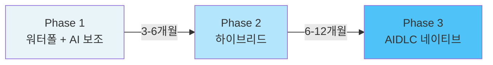
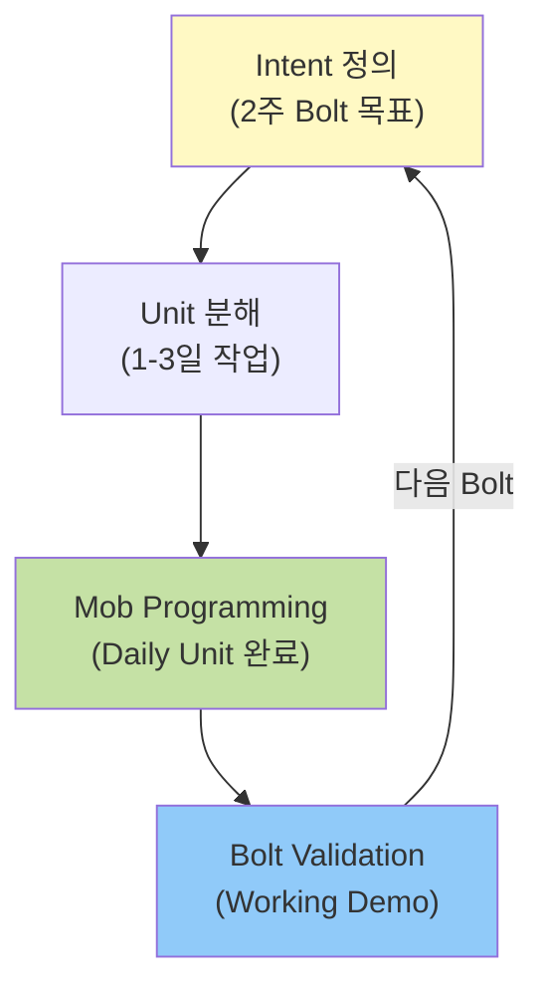
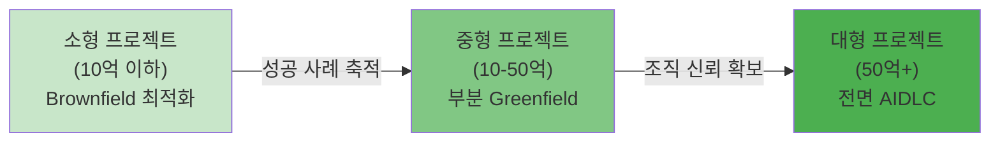
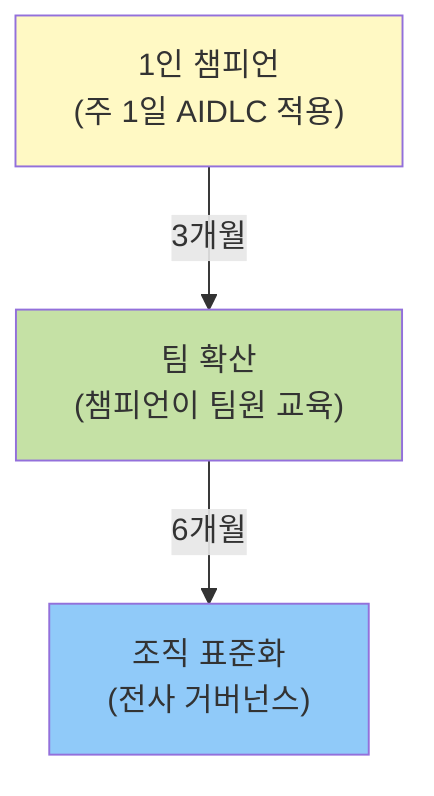

# 엔터프라이즈 AIDLC 도입 전략

엔터프라이즈 SI 환경에서 워터폴 중심 개발 문화를 AIDLC로 전환하기 위한 실전 도입 전략을 제시한다.

---

## 엔터프라이즈 AIDLC 도입의 현실

### 워터폴 SI 시장의 구조적 제약

대형 SI 프로젝트는 다음과 같은 이유로 AIDLC 직접 도입이 어렵다:

| 제약 요소 | 설명 | AIDLC 충돌 지점 |
|----------|------|---------------|
| **고정 프로세스** | ISO 9001, CMMI 인증 프로세스 | Intent/Bolt 주기가 문서 템플릿과 불일치 |
| **RFP 문화** | 요구사항 명세 → 고정가 계약 | Adaptive Elaboration이 범위 변경으로 해석됨 |
| **역할 경직성** | 기획자/개발자/QA 분리 | Mob Programming이 역할 경계를 흐림 |
| **산출물 중심** | 계약서, 요구사항 명세서, 설계서, 테스트 계획서 | Working software over documentation 충돌 |
| **검수 단계** | 완료 시점 일괄 검수 | Continuous Validation과 리듬 충돌 |

#### VP 압력과 현장 저항의 딜레마

- **경영진**: "AI 활용률 80% 달성" 같은 정량적 목표 선언
- **현장**: 기존 방식 고수 ("일정 내에 배울 시간 없음", "고객이 요구하지 않음")
- **중간 관리자**: 혁신 압력과 프로젝트 납기 사이에서 갈등

→ **점진적 전환 모델 없이는 조직 전체가 표면적 도입에 그침**

---

## 3단계 전환 모델

AIDLC를 한 번에 도입하지 않고, 기존 워터폴 프레임 안에서 점진적으로 적용한다.

### Phase 1: 워터폴 + AI 보조 (3-6개월)

기존 프로세스를 유지하되, 개발 단계에서만 AI를 코딩 보조로 활용한다.

#### 적용 범위

- 요구사항 분석: 기존 방식 유지
- 설계: 기존 방식 유지
- **개발**: Claude Code, GitHub Copilot 등 코딩 보조 도구 허용
- 테스트: 기존 QA 프로세스 유지

#### 성과 지표

- 개발 속도 개선: 20-30%
- 버그 밀도: 유지 또는 소폭 개선
- 팀원 만족도: AI 도구 사용 경험 축적

#### 조직 변화

- 없음 (역할, 프로세스, 산출물 변화 없음)
- AI 도구 교육 프로그램 운영 (주 1회, 2시간)

---

### Phase 2: 하이브리드 (6-12개월)

워터폴 프레임을 유지하되, 개발 단계에서 **Bolt 주기**와 **Mob Programming**을 도입한다.

#### 적용 범위

- 요구사항 분석: 워터폴 (산출물 형식 유지)
- 설계: 워터폴 + **Mob Elaboration** (핵심 모듈만)
- **개발**: **Bolt 주기** (2주 단위 Working Software 산출)
- 테스트: **Continuous Validation** (Bolt마다 시연)

#### Bolt 주기 구조

#### 성과 지표

- 개발 속도 개선: 40-60%
- 요구사항 변경 대응 시간: 50% 단축
- 고객 만족도: Bolt 시연으로 가시성 증가

#### 조직 변화

- **역할 유연화**: 개발자가 설계 일부 참여, QA가 Bolt 시연 참여
- **Mob 세션**: 주 2-3회, 핵심 로직에 한정
- **산출물 간소화**: Bolt 종료 보고서 = 시연 영상 + 코드

---

### Phase 3: AIDLC 네이티브 (12개월+)

Intent → Unit → Bolt 풀사이클을 적용하고, 온톨로지/하네스를 전면 활용한다.

#### 적용 범위

- **Intent Driven**: 고객 요구를 Intent로 직접 변환
- **Mob Elaboration**: 전체 설계를 Mob으로 진행
- **Bolt 주기**: 1-2주 단위 Intent 완료
- **하네스 자동화**: Unit 테스트, 통합 테스트, 배포 자동화
- **온톨로지**: 도메인 지식을 명시적으로 관리

#### 조직 구조

- **역할 재정의**: [역할 재정의](./role-composition.md) 참조
  - Facilitator: Intent 정제, Mob 진행
  - Domain Expert: 온톨로지 관리
  - Infrastructure Engineer: 하네스 관리
- **프로젝트 구조**: 10-15명 → 5-7명 Mob 단위로 분할
- **계약 방식**: 고정가 → Time & Material 또는 Bolt 단위 검수

#### 성과 지표

- 개발 속도 개선: 60-80%
- 요구사항 변경 비용: 80% 감소
- 배포 빈도: 주 1회 → 일 1회
- 품질: 운영 버그 50% 감소

---

## Brownfield-First 전략

신규 프로젝트가 아닌 **기존 시스템 최적화**부터 시작한다.

### 왜 Brownfield인가?

| 요소 | Greenfield (신규) | Brownfield (기존) |
|------|------------------|------------------|
| **리스크** | 높음 (전체 실패 시 책임 명확) | 낮음 (부분 개선, 현 상태보다 나쁠 수 없음) |
| **학습 곡선** | 가파름 (모든 것을 새로 결정) | 완만함 (기존 코드베이스 이해 필요) |
| **가시성** | 낮음 (완료 시점까지 산출물 없음) | 높음 (개선 전후 비교 가능) |
| **고객 신뢰** | 불확실 (최종 결과에 의존) | 높음 (빠른 피드백) |

### 3단계 확산 경로

#### Stage 1: 소형 프로젝트 (10억 이하)

- **대상**: 레거시 시스템 유지보수, 기능 추가
- **목표**: AIDLC 적용 경험 축적
- **기간**: 3-6개월
- **성과**: Bolt 주기, Mob 세션, 하네스 자동화 검증

#### Stage 2: 중형 프로젝트 (10-50억)

- **대상**: 기존 시스템 일부 재작성 + 신규 기능
- **목표**: 하이브리드 모델 검증
- **기간**: 6-12개월
- **성과**: 온톨로지 적용, 역할 재정의, 계약 모델 실험

#### Stage 3: 대형 프로젝트 (50억+)

- **대상**: 전사 시스템 전면 재구축
- **목표**: AIDLC 네이티브 적용
- **기간**: 12개월+
- **성과**: 조직 전체 프로세스 전환, 고객사 확산

---

## 챔피언 모델

조직 내 AIDLC 확산은 **1인 챔피언**에서 시작해 **팀**, **조직**으로 확산한다.

### 3단계 확산 구조

### Stage 1: 1인 챔피언 (0-3개월)

#### 챔피언 선정 기준

- **기술 역량**: 코딩 경험, 도구 학습 능력
- **소프트 스킬**: 팀 내 영향력, 교육 의지
- **시간 확보**: 주 1일 (금요일) AIDLC 적용 허용

#### 챔피언 활동

- 주 1일 AIDLC 적용 (개인 프로젝트 또는 소형 태스크)
- [10대 원칙](../methodology/principles-and-model.md) 학습
- Mob 세션 주도 (팀원 초대)
- 성공 사례 문서화 (스티어링 파일, Bolt 보고서)

#### 조직 지원

- 실패 허용 (챔피언 활동은 평가에서 제외)
- 외부 교육 지원 (컨퍼런스, 워크숍)
- 주간 리뷰 미팅 (VP 또는 부서장 참여)

---

### Stage 2: 팀 확산 (3-6개월)

#### 확산 메커니즘

- 챔피언이 **주 1회 Mob 세션** 주최
- 팀원이 순차적으로 Mob 참여 (관찰 → 보조 → 주도)
- 프로젝트별 AIDLC 적용률 목표 설정 (20% → 50% → 80%)

#### 팀 레벨 산출물

- **스티어링 파일 표준**: 프로젝트별 스티어링 파일 템플릿 작성
- **Bolt 보고서 형식**: 시연 영상 + 코드 + 회고 요약
- **온톨로지 초안**: 도메인 용어 정의, 핵심 엔티티 모델

#### 성과 지표

- 팀원 AIDLC 적용률: 50% 이상
- Mob 세션 참여율: 80% 이상
- 프로젝트 속도 개선: 30% 이상

---

### Stage 3: 조직 표준화 (6-12개월)

#### 거버넌스 프레임워크

- **스티어링 파일 표준**: [거버넌스](./governance-framework.md) 참조
- **Bolt 주기 정책**: 길이(1-2주), 검수 기준, 시연 형식
- **Mob 세션 가이드**: 역할, 시간, 도구, 회고 형식
- **온톨로지 관리**: 도메인별 온톨로지 레지스트리, 버전 관리

#### 조직 구조 변화

- **AIDLC CoE** (Center of Excellence) 설립
  - 챔피언 네트워크 운영
  - 교육 프로그램 개발
  - 도구 표준화 (Claude Code, GitHub, Slack)
- **프로젝트 평가 기준** 변경
  - 산출물 수 → Working Software 빈도
  - 계획 준수율 → 고객 만족도

#### 성과 지표

- 조직 AIDLC 적용률: 70% 이상
- 프로젝트 성공률: 90% 이상
- 직원 만족도: NPS 50+ (기존 대비 +20)

---

## 타임라인 템플릿

### 3개월 목표

| 주차 | 활동 | 산출물 | 담당 |
|------|------|--------|------|
| 1-2주 | 챔피언 선정 (1-2명) | 챔피언 명단, 활동 계획 | VP/부서장 |
| 3-4주 | AIDLC 교육 (8시간) | [10대 원칙](../methodology/principles-and-model.md) 학습 완료 | 챔피언 |
| 5-8주 | 파일럿 프로젝트 1 (Brownfield) | Bolt 1-2개 완료, 시연 | 챔피언 + 팀원 2명 |
| 9-12주 | 파일럿 프로젝트 2 (소형 Greenfield) | Bolt 3-4개 완료, 회고 | 챔피언 + 팀 전체 |

**성과**: 챔피언 1-2명, 프로젝트 2개, Bolt 4-6개 완료

---

### 6개월 목표

| 월 | 활동 | 산출물 | 담당 |
|----|------|--------|------|
| 1-3개월 | 3개월 목표 달성 | 챔피언 1-2명 | VP/부서장 |
| 4개월 | 팀 확산 (3-5팀) | 팀별 스티어링 파일 | 챔피언 + 팀장 |
| 5개월 | Mob 세션 정례화 | 주 1회 Mob, 녹화 영상 | 챔피언 + 팀 |
| 6개월 | 스티어링 파일 표준화 | 조직 표준 템플릿 | AIDLC CoE |

**성과**: 팀 3-5개, 챔피언 3-5명, 스티어링 파일 표준 완성

---

### 12개월 목표

| 분기 | 활동 | 산출물 | 담당 |
|------|------|--------|------|
| Q1-Q2 | 6개월 목표 달성 | 팀 3-5개 | VP/부서장 |
| Q3 | 거버넌스 프레임워크 수립 | [거버넌스](./governance-framework.md) | AIDLC CoE |
| Q4 | 조직 표준 적용 (전체 프로젝트) | 온톨로지 레지스트리, Bolt 정책 | AIDLC CoE |

**성과**: 조직 AIDLC 적용률 70%, 프로젝트 성공률 90%

---

## 성숙도 모델

조직의 AIDLC 적용 수준을 4단계로 평가한다.

### Level 0: Pilot (파일럿)

| 요소 | 상태 |
|------|------|
| **챔피언** | 1-2명 |
| **프로젝트** | 1-2개 (Brownfield) |
| **Bolt 주기** | 비공식 (챔피언 개인 실험) |
| **Mob 세션** | 없음 또는 비정기 |
| **온톨로지** | 없음 |
| **하네스** | 수동 테스트 |

---

### Level 1: Team (팀)

| 요소 | 상태 |
|------|------|
| **챔피언** | 3-5명 |
| **프로젝트** | 3-5개 (Brownfield + 소형 Greenfield) |
| **Bolt 주기** | 팀별 표준 (2주) |
| **Mob 세션** | 주 1회 정례화 |
| **온톨로지** | 팀별 초안 |
| **하네스** | 자동 테스트 일부 |

---

### Level 2: Division (부서)

| 요소 | 상태 |
|------|------|
| **챔피언** | 10명+ (부서별 1-2명) |
| **프로젝트** | 전체 프로젝트의 50% |
| **Bolt 주기** | 부서 표준 (1-2주) |
| **Mob 세션** | 주 2-3회, 녹화 공유 |
| **온톨로지** | 부서 레지스트리 |
| **하네스** | CI/CD 파이프라인 |

---

### Level 3: Enterprise (전사)

| 요소 | 상태 |
|------|------|
| **챔피언** | 전사 네트워크 (50명+) |
| **프로젝트** | 전체 프로젝트의 80% |
| **Bolt 주기** | 전사 표준 + [거버넌스](./governance-framework.md) |
| **Mob 세션** | 일일 Mob (핵심 프로젝트) |
| **온톨로지** | 전사 레지스트리, 버전 관리 |
| **하네스** | 완전 자동화 (배포 포함) |

---

## 안티패턴

### 1. 빅뱅 도입

**증상**: "다음 프로젝트부터 전사 AIDLC 적용" 선언

**위험**:
- 전체 조직이 학습 곡선에 동시 진입 → 초기 생산성 급락
- 실패 시 AIDLC 전체가 신뢰 상실
- 챔피언 없이 표면적 적용 → "AI 도구만 쓰면 AIDLC"로 오해

**대안**: 챔피언 모델 + Brownfield-First

---

### 2. 도구만 도입하고 방법론 무시

**증상**: "Claude Code 라이선스 전사 배포" → "AIDLC 도입 완료"

**위험**:
- Mob Programming, Bolt 주기 없이 도구만 사용 → 생산성 개선 미미
- Intent/Unit 분해 없이 코딩 보조로만 활용 → 설계 품질 저하
- 온톨로지/하네스 무시 → 유지보수성 악화

**대안**: [10대 원칙](../methodology/principles-and-model.md) 교육 선행

---

### 3. 측정 없는 확산

**증상**: "팀 5개가 AIDLC 적용 중" (실제 적용률, 성과 불명)

**위험**:
- 형식적 적용 (Mob 세션은 하되, 기존 코드 리뷰 병행 → 이중 작업)
- 성과 가시화 실패 → 경영진 지원 중단
- 실패 사례 학습 불가 → 동일 실수 반복

**대안**: [비용 효과](./cost-estimation.md) 지표 추적

---

### 4. 경영진 지원 없는 바텀업

**증상**: 현장 개발자가 자발적으로 AIDLC 적용 시도, 관리자 반대

**위험**:
- 프로젝트 일정 압박 시 AIDLC 중단 압력
- 역할 경계 침범 (Mob 시 기획자/QA 참여 거부)
- 예산 부족 (도구 라이선스, 교육 프로그램 미지원)

**대안**: VP/부서장 스폰서십 확보 필수

---

### 5. 고객사 설득 실패

**증상**: SI 팀은 AIDLC 적용하되, 고객사는 워터폴 산출물 요구

**위험**:
- 이중 작업 (AIDLC로 개발 + 워터폴 산출물 별도 작성)
- Bolt 검수 거부 → 프로젝트 종료 시점 일괄 검수로 회귀
- 고객사 불신 ("산출물 없으면 진행 상황을 어떻게 아나?")

**대안**: Bolt 시연을 계약서에 명시, 산출물 간소화 협상

---

## 실행 체크리스트

### 조직 준비도 평가

- [ ] VP/부서장 스폰서십 확보
- [ ] 챔피언 후보 선정 (1-2명)
- [ ] 파일럿 프로젝트 선정 (Brownfield 우선)
- [ ] 실패 허용 정책 수립

### 3개월 목표

- [ ] 챔피언 교육 완료 ([10대 원칙](../methodology/principles-and-model.md))
- [ ] 파일럿 프로젝트 1-2개 완료
- [ ] Bolt 4-6개 산출, 시연 영상 확보
- [ ] 팀 레벨 스티어링 파일 초안

### 6개월 목표

- [ ] 팀 3-5개 확산
- [ ] 스티어링 파일 표준화
- [ ] 온톨로지 초안 (도메인별)
- [ ] [비용 효과](./cost-estimation.md) 지표 측정

### 12개월 목표

- [ ] 조직 AIDLC 적용률 70%
- [ ] [거버넌스](./governance-framework.md) 프레임워크 완성
- [ ] 온톨로지 레지스트리 운영
- [ ] 프로젝트 성공률 90%

---

## 다음 단계

- [역할 재정의](./role-composition.md): AIDLC 팀 구조와 역할 변화
- [비용 효과](./cost-estimation.md): ROI 측정 및 경영진 보고
- [거버넌스](./governance-framework.md): 전사 표준 수립
- [10대 원칙](../methodology/principles-and-model.md): AIDLC 방법론 기초

**핵심 메시지**: 워터폴→AIDLC 전환은 빅뱅이 아닌 3단계 점진적 전환(워터폴+AI → 하이브리드 → 네이티브)과 챔피언 모델(1인 → 팀 → 조직)로 실행한다. Brownfield-First로 신뢰를 구축하고, 측정 가능한 성과로 확산한다.
