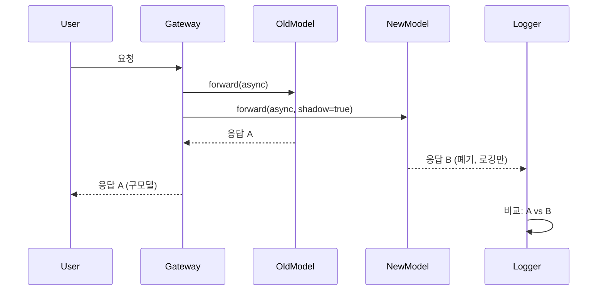
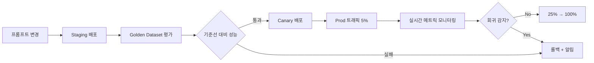

# Agent 변경 관리

## 왜 Agent Change Management가 필요한가

### 전통적 소프트웨어 변경과의 차이

전통적 소프트웨어에서 변경 관리는 코드, 설정, 인프라 변경을 대상으로 삼는다. Agent 시스템은 여기에 **확률적 구성요소**가 추가된다:

| 변경 유형 | 전통적 시스템 | Agentic 시스템 |
|-----------|--------------|---------------|
| **출력 결정성** | 동일 입력 → 동일 출력 | 동일 입력 → 확률 분포 |
| **회귀 감지** | 단위 테스트, 통합 테스트 | 통계적 평가(BLEU, Exact Match, LLM-as-Judge) |
| **롤백 기준** | 기능 장애, 성능 저하 | 정확도 하락, 환각 증가, latency P99 |
| **변경 단위** | 코드 커밋, 바이너리 | 프롬프트 버전, 모델 교체, 파라미터 조정 |

### Prompt와 Model을 코드처럼 관리해야 하는 이유

1. **Prompt는 로직의 핵심**  
   "당신은 금융 분석 전문가입니다" → "당신은 보수적 투자 자문가입니다"로 한 줄 변경하면 출력 패턴 전체가 변한다.

2. **모델 교체는 런타임 교체**  
   GPT-4 → Claude 3.5 Sonnet 전환 시 동일 프롬프트도 응답 스타일, 토큰 사용량, latency가 달라진다.

3. **변경 추적 없이는 롤백 불가**  
   "어제까지 잘 됐는데 오늘 이상해요"라는 신고를 받았을 때, 누가 어떤 프롬프트를 언제 바꿨는지 모르면 복구할 수 없다.

4. **규제 요구사항**  
   금융권, 의료, 공공 부문에서는 "이 답변은 어느 프롬프트 버전, 어느 모델 버전으로 생성되었는가"를 감사(Audit) 기록으로 남겨야 한다.

---

## 프롬프트 레지스트리

### Langfuse Prompt

[Langfuse](https://langfuse.com/)는 self-hosted 가능한 LLMOps 플랫폼이다. 프롬프트 레지스트리 기능:

- **버전 관리**: 매 변경마다 자동 버전 증가(`v1`, `v2`, ...)
- **라벨**: `production`, `staging`, `canary`로 환경별 라벨 부여
- **Rollout 관리**: 특정 라벨을 특정 버전에 붙이면 애플리케이션은 라벨만 참조(`get_prompt("financial-analysis", label="production")`)
- **Diff 보기**: 버전 간 변경 내용 시각화
- **Access Log**: 어떤 세션이 어떤 프롬프트 버전을 사용했는지 추적

```python
from langfuse import Langfuse

client = Langfuse()

# 프롬프트 버전 조회
prompt = client.get_prompt("financial-analysis", label="production")
print(prompt.version)  # 예: 5
print(prompt.prompt)   # 실제 텍스트

# 새 버전 배포
client.create_prompt(
    name="financial-analysis",
    prompt="당신은 보수적 투자 자문가입니다...",
    labels=["staging"]  # 먼저 staging에 배포
)
# 검증 후
client.update_prompt_label("financial-analysis", version=6, label="production")
```

**장점**:
- Self-hosted, RBAC, S3+KMS 백엔드 가능
- Observability와 통합(trace에서 프롬프트 버전 자동 기록)

**단점**:
- Python SDK 중심(TypeScript SDK는 있지만 기능 제한적)
- UI는 단순(diff는 보이지만 승인 워크플로 없음)

### PromptLayer

[PromptLayer](https://promptlayer.com/)는 SaaS 프롬프트 레지스트리다.

- **버전 태깅**: Git 스타일 태그(`v1.0`, `v1.1-alpha`)
- **Visual Diff**: 두 버전 간 단어 단위 변경 강조
- **A/B 실험**: 두 버전을 동시 배포하고 성능 비교
- **Analytics**: 버전별 latency, 토큰 사용, 에러율 대시보드

**장점**:
- 설치 없이 즉시 사용
- 팀 협업 기능(댓글, 승인 워크플로)

**단점**:
- SaaS 전용(온프레미스 불가)
- 데이터 주권 이슈(프롬프트가 외부 서버에 저장)

### Braintrust Prompts

[Braintrust](https://www.braintrust.dev/)는 평가(Evaluation) 플랫폼이지만 프롬프트 관리 기능도 제공한다.

- **Playground**: 프롬프트 작성 → 즉시 테스트 세트로 평가
- **Versioning**: 자동 버전 증가 + commit message
- **Datasets 연동**: 프롬프트 변경 시 자동으로 evaluation run 트리거
- **Experimentation**: 두 프롬프트 버전을 side-by-side 비교

**장점**:
- 평가와 프롬프트 관리가 하나의 플랫폼
- 매 변경마다 자동으로 품질 회귀 체크

**단점**:
- 런타임 배포보다는 개발·테스트 단계에 강점
- Production rollout 기능은 약함(직접 구현 필요)

### AWS Bedrock Prompt Management

AWS Bedrock는 [Prompt Management](https://docs.aws.amazon.com/bedrock/latest/userguide/prompt-management.html) 기능을 제공한다(2024년 11월 GA).

- **Prompt 버전**: `CreatePromptVersion` API로 immutable 버전 생성
- **Alias**: `PROD`, `STAGING` 같은 alias를 버전에 연결
- **IAM 통합**: 특정 버전만 사용 가능하도록 정책 설정
- **CloudTrail**: 누가 언제 어떤 버전을 배포했는지 감사 로그

```python
import boto3

bedrock = boto3.client('bedrock-agent')

# 새 버전 생성
response = bedrock.create_prompt_version(
    promptIdentifier='arn:aws:bedrock:us-east-1:123456789012:prompt/fin-analysis',
    description='보수적 투자 자문 스타일로 변경'
)
version_id = response['version']

# 프로덕션 alias 업데이트
bedrock.update_prompt_alias(
    promptIdentifier='arn:aws:bedrock:us-east-1:123456789012:prompt/fin-analysis',
    aliasIdentifier='PROD',
    promptVersion=version_id
)
```

**장점**:
- AWS 네이티브, IAM/CloudTrail/KMS 통합
- Lambda, Step Functions에서 직접 참조 가능

**단점**:
- Bedrock 모델 사용 전제(Claude, Llama 등)
- self-hosted LLM(vLLM, llm-d)과는 별도 구성 필요

### 비교표

| 기능 | Langfuse | PromptLayer | Braintrust | Bedrock PM |
|------|----------|-------------|------------|------------|
| **배포 방식** | Self-hosted | SaaS | SaaS | AWS Managed |
| **버전 관리** | ✅ | ✅ | ✅ | ✅ |
| **라벨/Alias** | ✅ | ✅ | ❌ | ✅ |
| **Visual Diff** | 기본 | ✅ | ✅ | ❌ |
| **승인 워크플로** | ❌ | ✅ | ❌ | ❌(IAM으로 구현) |
| **A/B 실험** | 수동 | ✅ | ✅ | 수동 |
| **자동 평가 연동** | 가능(trace 기반) | ❌ | ✅ | 가능(Lambda) |
| **데이터 주권** | ✅ | ❌ | ❌ | ✅(리전 내) |
| **AIDLC 적합성** | **⭐ 높음** | 중간(SaaS) | 높음(Eval 중심) | 높음(Bedrock 전용) |

**AIDLC 권장**: **Langfuse**(self-hosted 요구사항) 또는 **AWS Bedrock PM**(Bedrock 사용 시). PromptLayer/Braintrust는 SaaS 허용 시.

---

## 모델 교체 전략

### Shadow Testing

**개념**: 신모델이 실제 프로덕션 트래픽을 받되, 응답은 사용자에게 전달하지 않는다. 구모델의 응답만 반환하고, 신모델 출력은 로그/평가용으로만 수집한다.



**언제 사용**:
- 신모델의 latency, 에러율, 출력 품질을 **리스크 없이** 검증하고 싶을 때
- 비용 부담 가능(요청당 2배 비용)

**구현 예시(Python, LiteLLM)**: LiteLLM은 native shadow 기능이 없으므로 직접 구현:

```python
import asyncio
from litellm import acompletion

async def shadow_call(user_request):
    # 구모델(production)
    old_task = acompletion(model="gpt-4", messages=user_request)
    # 신모델(shadow)
    new_task = acompletion(model="claude-3-5-sonnet-20241022", messages=user_request)
    
    old_resp, new_resp = await asyncio.gather(old_task, new_task, return_exceptions=True)
    
    # 로깅: 두 응답 비교
    log_to_langfuse(user_request, old_resp, new_resp, shadow=True)
    
    # 사용자에게는 구모델 응답만 반환
    return old_resp
```

**장점**:
- 사용자 경험에 영향 없음
- 실제 트래픽 패턴으로 테스트

**단점**:
- 비용 2배
- 사용자 피드백 수집 불가(shadow 응답은 사용자가 보지 못함)

### Canary Rollout

**개념**: 소수 트래픽(5%)부터 시작해 단계적으로 비율을 높여간다.

```
5% → 관찰(24h) → 문제 없으면 25% → 50% → 100%
```

**언제 사용**:
- 신모델이 충분히 검증되었지만, 프로덕션 전체 교체는 리스크가 클 때
- 회귀 감지 시 빠른 롤백 필요

**구현 예시(LaunchDarkly)**: Feature Flag로 모델 선택 제어

```python
from ldclient import LDClient, Context

ld_client = LDClient(sdk_key="your-key")

def get_model_for_user(user_id: str):
    context = Context.builder(user_id).kind("user").build()
    model = ld_client.variation("llm-model-selection", context, default="gpt-4")
    return model

# LaunchDarkly 콘솔에서 "llm-model-selection" flag를 5% claude-3-5-sonnet, 95% gpt-4로 설정
```

**모니터링 기준**:
- Canary 그룹 vs Control 그룹의 **성공률**(200 응답 비율)
- **Latency P50/P99** 차이
- **사용자 피드백**(thumbs up/down) 비율
- **비용**(토큰 사용량)

**자동 롤백 트리거**:
```yaml
# 예시: Prometheus AlertManager 규칙
- alert: CanaryRegressionDetected
  expr: |
    (rate(llm_success_total{model="claude-3-5-sonnet"}[5m]) 
     / rate(llm_requests_total{model="claude-3-5-sonnet"}[5m]))
    < 0.95
  for: 10m
  annotations:
    summary: "Canary 성공률 95% 미만, 롤백 필요"
```

**장점**:
- 점진적 리스크 분산
- 실제 사용자 피드백 수집 가능

**단점**:
- 배포 기간 길어짐(수일~수주)
- 모니터링 인프라 필수

### A/B Testing

**개념**: 트래픽을 두 그룹(A: 구모델, B: 신모델)으로 **랜덤 분할**하고, 비즈니스 메트릭(conversion rate, 사용자 만족도 등)을 통계적으로 비교한다.

**언제 사용**:
- "신모델이 정말 더 나은가?"를 **통계적 유의성**으로 증명해야 할 때
- 마케팅, UX 최적화(프롬프트 톤 변경 등)

**실험 설계**:
1. **귀무가설**: "신모델과 구모델의 성능 차이가 없다"
2. **대립가설**: "신모델이 conversion rate를 5% 이상 개선한다"
3. **샘플 크기 계산**: [AB Test Calculator](https://www.evanmiller.org/ab-testing/sample-size.html)  
   예: 베이스라인 10%, 5%p 개선 감지, 80% power → 그룹당 2,348명 필요
4. **실험 기간**: 충분한 샘플 확보될 때까지(보통 1-4주)

**구현 예시(Unleash)**:

```typescript
import { UnleashClient } from 'unleash-client';

const unleash = new UnleashClient({
  url: 'https://unleash.example.com/api',
  appName: 'agent-service',
  customHeaders: { Authorization: 'your-token' }
});

function selectModel(userId: string): string {
  const context = { userId };
  // 'ab-test-claude-vs-gpt' variant: 50% 'A', 50% 'B'
  const variant = unleash.getVariant('ab-test-claude-vs-gpt', context);
  return variant.name === 'B' ? 'claude-3-5-sonnet-20241022' : 'gpt-4';
}
```

**분석**: 실험 종료 후 chi-square test로 유의성 검증

```python
from scipy.stats import chi2_contingency

# A: gpt-4, B: claude-3-5-sonnet
# 성공/실패 contingency table
obs = [[2100, 300],   # A: 2100 성공, 300 실패
       [2200, 200]]   # B: 2200 성공, 200 실패

chi2, p, dof, ex = chi2_contingency(obs)
print(f"p-value: {p}")  # p < 0.05 → B가 통계적으로 유의하게 우수
```

**장점**:
- 비즈니스 임팩트를 수치로 증명
- 마케팅, 경영진 설득에 유리

**단점**:
- 긴 실험 기간
- 통계 전문성 필요
- 트래픽 충분해야 유의성 확보 가능

### Blue-Green Deployment

**개념**: 구환경(Blue)과 신환경(Green)을 동시에 운영하다가, 트래픽을 **한 번에** Green으로 전환. 문제 발생 시 즉시 Blue로 되돌린다.

**언제 사용**:
- 모델 서빙 인프라 자체를 교체할 때(vLLM 0.5 → 0.6)
- 프롬프트 변경보다는 런타임 변경

**구현 예시(Kubernetes Service + Ingress)**:

```yaml
# blue-deployment.yaml
apiVersion: apps/v1
kind: Deployment
metadata:
  name: llm-blue
spec:
  replicas: 3
  selector:
    matchLabels:
      app: llm
      version: blue
  template:
    metadata:
      labels:
        app: llm
        version: blue
    spec:
      containers:
      - name: vllm
        image: vllm/vllm-openai:v0.5.4
        args: ["--model", "meta-llama/Llama-3.1-8B-Instruct"]
---
# green-deployment.yaml (신버전)
apiVersion: apps/v1
kind: Deployment
metadata:
  name: llm-green
spec:
  replicas: 3
  selector:
    matchLabels:
      app: llm
      version: green
  template:
    metadata:
      labels:
        app: llm
        version: green
    spec:
      containers:
      - name: vllm
        image: vllm/vllm-openai:v0.6.3
        args: ["--model", "meta-llama/Llama-3.1-8B-Instruct"]
---
# service.yaml (처음엔 blue 가리킴)
apiVersion: v1
kind: Service
metadata:
  name: llm-service
spec:
  selector:
    app: llm
    version: blue  # ← 여기를 'green'으로 바꾸면 전환
  ports:
  - port: 8000
```

**전환 절차**:
1. Green 배포 완료 → Health check 확인
2. `kubectl patch svc llm-service -p '{"spec":{"selector":{"version":"green"}}}'`
3. 5분 모니터링 → 문제 없으면 Blue 삭제
4. 문제 발생 시 `version: blue`로 즉시 롤백

**장점**:
- 롤백 속도 가장 빠름(초 단위)
- 전환 과정 단순

**단점**:
- 2배 인프라 비용(전환 기간 중)
- 점진적 검증 없음(all-or-nothing)

---

## Feature Flag 기반 프롬프트 전개

### LaunchDarkly

[LaunchDarkly](https://launchdarkly.com/)는 엔터프라이즈급 Feature Flag 플랫폼이다.

**프롬프트 전개 예시**:

```python
from ldclient import LDClient, Context

ld_client = LDClient(sdk_key="sdk-key")

def get_prompt_version(user_id: str, org_id: str) -> int:
    context = Context.builder(user_id) \
        .kind("user") \
        .set("org_id", org_id) \
        .build()
    
    # flag 'prompt-version-financial': 조직별 타게팅 가능
    # 예: org_id='acme-corp' → version=5, 나머지 → version=4
    version = ld_client.variation("prompt-version-financial", context, default=4)
    return version
```

**Kill Switch**: 긴급 상황 시 모든 사용자를 안전한 버전으로 되돌리기

```python
# LaunchDarkly 콘솔에서 'prompt-version-financial' flag를 강제로 4로 설정
# 코드 변경 없이 즉시 모든 사용자에게 적용됨
```

**타게팅 규칙 예시**:
- **베타 사용자**: `user.beta == true` → 신버전
- **특정 리전**: `user.region == "us-east-1"` → 카나리 버전
- **조직 티어**: `user.tier == "enterprise"` → 최신 버전 우선 제공

### Unleash

[Unleash](https://www.getunleash.io/)는 오픈소스 Feature Flag 플랫폼이다.

**장점**:
- Self-hosted 가능
- Postgres 백엔드, RBAC, audit log 기본 제공

**프롬프트 전개**:

```typescript
import { Unleash } from 'unleash-client';

const unleash = new Unleash({
  url: 'https://unleash.internal.corp/api',
  appName: 'agent-gateway',
  customHeaders: { Authorization: 'token' }
});

function getPromptVariant(userId: string): string {
  const context = { userId, properties: { region: 'us-west-2' } };
  const variant = unleash.getVariant('prompt-experiment-2026-04', context);
  // variant.name: 'control', 'treatment-A', 'treatment-B'
  return variant.payload.value;  // 실제 프롬프트 텍스트 or 버전 번호
}
```

### AWS AppConfig

[AWS AppConfig](https://docs.aws.amazon.com/appconfig/latest/userguide/what-is-appconfig.html)는 Feature Flag와 동적 설정을 지원한다.

**장점**:
- AWS 네이티브, Lambda/ECS/EKS와 통합
- Deployment strategy: Linear, Canary, All-at-once
- CloudWatch 알람 기반 자동 롤백

**예시**:

```python
import boto3
import json

appconfig = boto3.client('appconfigdata')

session = appconfig.start_configuration_session(
    ApplicationIdentifier='agent-app',
    EnvironmentIdentifier='production',
    ConfigurationProfileIdentifier='prompt-config'
)
session_token = session['InitialConfigurationToken']

config = appconfig.get_latest_configuration(ConfigurationToken=session_token)
prompt_config = json.loads(config['Configuration'].read())

print(prompt_config['version'])  # 예: 5
print(prompt_config['text'])
```

**배포 전략**:
```json
{
  "DeploymentStrategyId": "AppConfig.Canary10Percent20Minutes",
  "Description": "10% 사용자에게 20분간 배포 후 확대"
}
```

CloudWatch 알람(`LLMErrorRate > threshold`) 발생 시 자동 롤백.

---

## 회귀 감지 연동

### Evaluation Framework와 연결

[AIDLC Evaluation Framework](../toolchain/evaluation-framework.md)에서 정의한 **Golden Dataset**을 사용해 신버전 배포 전 회귀를 감지한다.

**Workflow**:



### Baseline vs New 통계 비교

**메트릭**:
- **정확도**: Exact Match, F1, BLEU(번역)
- **품질**: LLM-as-Judge 점수(0-1)
- **Latency**: P50, P99
- **비용**: 토큰 사용량

**통계 검정**:

```python
from scipy.stats import ttest_ind

# baseline: 구버전 100개 샘플의 Exact Match 점수
baseline_scores = [...]  # 예: 평균 0.82

# new: 신버전 100개 샘플
new_scores = [...]  # 예: 평균 0.85

t_stat, p_value = ttest_ind(baseline_scores, new_scores)

if p_value < 0.05 and mean(new_scores) > mean(baseline_scores):
    print("신버전이 통계적으로 유의하게 우수 → 배포 승인")
elif mean(new_scores) < mean(baseline_scores) * 0.95:
    print("신버전이 5% 이상 저하 → 롤백")
else:
    print("유의미한 차이 없음 → 추가 검증 필요")
```

### 자동 롤백 트리거

**조건**:
1. **정확도 절대 하락**: `new_exact_match < baseline_exact_match - 0.05`
2. **Latency 회귀**: `new_p99_latency > baseline_p99_latency * 1.5`
3. **에러율 증가**: `new_error_rate > 5%`
4. **사용자 피드백**: `thumbs_down_rate > 20%`

**구현**:

```yaml
# Prometheus Alert
- alert: PromptRegressionDetected
  expr: |
    langfuse_eval_exact_match{prompt_version="6"} 
    < langfuse_eval_exact_match{prompt_version="5"} - 0.05
  for: 30m
  annotations:
    summary: "프롬프트 v6 정확도 저하 → 자동 롤백"
  # Webhook → Lambda → Langfuse API (production 라벨을 v5로 되돌림)
```

---

## 운영 거버넌스

### 변경 승인 워크플로

**AIDLC Checkpoints** 적용:

| 단계 | Checkpoint | 승인자 | 기준 |
|------|-----------|-------|------|
| 1. 프롬프트 변경 제안 | `[Answer]:` | 도메인 전문가 | 의도와 리스크 평가 명시 |
| 2. Staging 평가 결과 | 회귀 감지 통과 | Lead Engineer | Exact Match ≥ 베이스라인 - 2% |
| 3. Canary 5% 배포 | 실시간 메트릭 검토 | SRE | 에러율 < 1%, P99 latency ≤ 1.2x |
| 4. Prod 100% 전환 | 최종 승인 | Product Owner | 비즈니스 메트릭 개선 확인 |

**승인 자동화(GitHub Actions + Langfuse)**:

```yaml
# .github/workflows/prompt-approval.yml
name: Prompt Approval
on:
  pull_request:
    paths:
      - 'prompts/**'
jobs:
  evaluate:
    runs-on: ubuntu-latest
    steps:
      - uses: actions/checkout@v4
      - name: Run Golden Dataset Eval
        run: |
          python scripts/eval_prompt.py --new-version ${{ github.sha }}
      - name: Post Results
        uses: actions/github-script@v7
        with:
          script: |
            const results = require('./eval_results.json');
            if (results.exact_match < results.baseline - 0.02) {
              core.setFailed('회귀 감지: Exact Match 저하');
            }
            github.rest.issues.createComment({
              issue_number: context.issue.number,
              body: `### 평가 결과\n- Baseline: ${results.baseline}\n- New: ${results.exact_match}\n- 판정: ${results.pass ? '✅ 승인' : '❌ 반려'}`
            });
```

### 변경 기록(Audit Log)

**Langfuse**: 모든 프롬프트 변경은 자동으로 버전 히스토리에 기록됨. 추가로:

```python
# 변경 시 메타데이터 기록
client.create_prompt(
    name="financial-analysis",
    prompt="...",
    labels=["production"],
    metadata={
        "changed_by": "jane@example.com",
        "jira_ticket": "AIDLC-1234",
        "approval": "approved_by_john_2026-04-17",
        "rollback_plan": "revert to v5 if error_rate > 5%"
    }
)
```

**AWS CloudTrail**: Bedrock Prompt Management 사용 시

```json
{
  "eventName": "UpdatePromptAlias",
  "userIdentity": {
    "principalId": "AIDAI...",
    "arn": "arn:aws:iam::123456789012:user/jane"
  },
  "requestParameters": {
    "promptIdentifier": "fin-analysis",
    "aliasIdentifier": "PROD",
    "promptVersion": "6"
  },
  "eventTime": "2026-04-17T14:30:00Z"
}
```

### 롤백 계획 필수

모든 변경 요청에 **Rollback Plan** 첨부:

```markdown
## Rollback Plan

**Trigger**: 배포 후 30분 이내 에러율 > 3%

**Steps**:
1. Langfuse에서 `production` 라벨을 v5로 되돌림
2. Gateway 재시작(pod restart 불필요, Langfuse SDK는 30초마다 폴링)
3. Slack #incident 채널에 알림
4. PostMortem 작성(원인, 재발 방지책)

**Validation**:
- 에러율 < 1% 복구 확인
- 5분간 모니터링 후 incident close
```

### 감사 증빙

금융권, 의료 등에서 요구하는 **감사 증빙**:

| 항목 | 기록 위치 | 보관 기간 |
|------|----------|----------|
| 프롬프트 버전 | Langfuse DB (S3+KMS) | 7년 |
| 모델 버전 | 추론 로그(trace) | 7년 |
| 승인 기록 | GitHub PR + JIRA | 7년 |
| 평가 결과 | Braintrust/Langfuse Eval | 3년 |
| 사용자 세션 | Langfuse Trace | 1년 |
| 롤백 이벤트 | CloudTrail + PagerDuty | 7년 |

**예시 쿼리(감사관 요청 대응)**:

```sql
-- "2026년 4월 17일 14시에 프롬프트 v6을 누가 배포했나?"
SELECT version, metadata->>'changed_by', metadata->>'jira_ticket', created_at
FROM langfuse_prompts
WHERE name = 'financial-analysis'
  AND created_at BETWEEN '2026-04-17 14:00:00' AND '2026-04-17 15:00:00';
```

---

## AIDLC 단계별 활용

### Construction Phase

**프롬프트도 코드와 함께 Code Review**:

```
repo/
  src/
    agents/
      financial_analyst.py
  prompts/
    financial_analysis_v5.txt  # ← 프롬프트도 버전 관리
  tests/
    test_financial_analyst.py  # Golden Dataset 평가
```

**PR 템플릿**:

```markdown
## 변경 내용
- 프롬프트 v5 → v6: "보수적 투자 자문" 톤 강화

## 평가 결과
- Exact Match: 0.82 → 0.85 (+3%p)
- LLM-as-Judge: 0.78 → 0.81 (+3%p)
- Latency P99: 1.2s → 1.3s (10% 증가, 허용 범위 내)

## 롤백 계획
- Trigger: 에러율 > 3%
- Action: Langfuse production 라벨 → v5 복구

## Approval
- [x] 도메인 전문가 (jane@) 승인
- [x] Golden Dataset 평가 통과
- [ ] SRE 승인 대기
```

### Operations Phase

**점진 Rollout + 실시간 회귀 감지**:

| 시간 | 배포 비율 | 모니터링 |
|------|----------|----------|
| D+0 14:00 | Canary 5% 시작 | CloudWatch 대시보드 실시간 |
| D+0 16:00 | 에러율 0.8% ✅ | 25%로 확대 |
| D+0 20:00 | 에러율 1.2% ✅ | 50%로 확대 |
| D+1 10:00 | 에러율 0.9% ✅ | 100% 전환 |
| D+1 14:00 | **에러율 5.2% ❌** | **자동 롤백 트리거** |
| D+1 14:05 | 롤백 완료, v5 복구 | Incident PostMortem 작성 |

**실시간 대시보드(Grafana)**:

```promql
# Canary vs Control 에러율
rate(llm_errors_total{prompt_version="6"}[5m]) 
/ rate(llm_requests_total{prompt_version="6"}[5m])

# Latency P99
histogram_quantile(0.99, 
  rate(llm_latency_bucket{prompt_version="6"}[5m])
)
```

---

## 참고 자료

### 프롬프트 레지스트리

- **Langfuse Prompts**: [langfuse.com/docs/prompts](https://langfuse.com/docs/prompts)
- **PromptLayer**: [promptlayer.com](https://promptlayer.com/)
- **Braintrust Prompts**: [braintrust.dev/docs/guides/prompts](https://www.braintrust.dev/docs/guides/prompts)
- **AWS Bedrock Prompt Management**: [AWS 문서](https://docs.aws.amazon.com/bedrock/latest/userguide/prompt-management.html)

### Feature Flag 플랫폼

- **LaunchDarkly**: [launchdarkly.com](https://launchdarkly.com/)
  - [AI/ML 관련 게시물](https://launchdarkly.com/blog/category/ai/)
- **Unleash**: [getunleash.io](https://www.getunleash.io/)
- **AWS AppConfig**: [AWS 문서](https://docs.aws.amazon.com/appconfig/latest/userguide/what-is-appconfig.html)

### 배포 전략

- **Canary Deployment 패턴**: [martinfowler.com/bliki/CanaryRelease.html](https://martinfowler.com/bliki/CanaryRelease.html)
- **Blue-Green Deployment**: [martinfowler.com/bliki/BlueGreenDeployment.html](https://martinfowler.com/bliki/BlueGreenDeployment.html)
- **Shadow Testing**: [Google SRE Workbook - Canarying Releases](https://sre.google/workbook/canarying-releases/)

### 통계 검정

- **A/B Test Calculator**: [evanmiller.org/ab-testing](https://www.evanmiller.org/ab-testing/sample-size.html)
- **scipy.stats**: [docs.scipy.org/doc/scipy/reference/stats.html](https://docs.scipy.org/doc/scipy/reference/stats.html)

### AIDLC 연관 문서

- [Evaluation Framework](../toolchain/evaluation-framework.md)
- [CI/CD 전략](../toolchain/cicd-strategy.md)
- [Agent 모니터링](../../agentic-ai-platform/operations-mlops/agent-monitoring.md)

---

## 다음 단계

변경 관리 프로세스를 수립했다면:

1. **[Agent 모니터링](../../agentic-ai-platform/operations-mlops/agent-monitoring.md)** — 실시간 회귀 감지를 위한 observability 구축
2. **[Evaluation Framework](../toolchain/evaluation-framework.md)** — Golden Dataset과 자동 평가 파이프라인 설계
3. **[CI/CD 전략](../toolchain/cicd-strategy.md)** — 프롬프트·모델 변경을 자동화된 파이프라인에 통합
