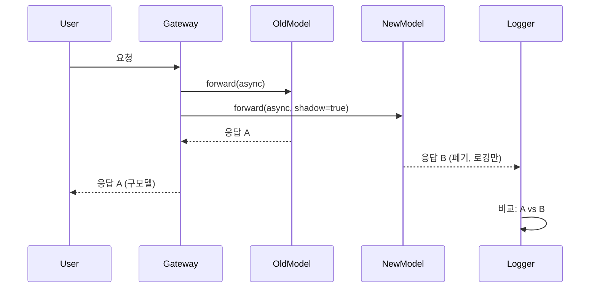

# 배포 전략

## 모델 교체 전략

### Shadow Testing

**개념**: 신모델이 실제 프로덕션 트래픽을 받되, 응답은 사용자에게 전달하지 않는다. 구모델의 응답만 반환하고, 신모델 출력은 로그/평가용으로만 수집한다.



**언제 사용**:
- 신모델의 latency, 에러율, 출력 품질을 **리스크 없이** 검증하고 싶을 때
- 비용 부담 가능(요청당 2배 비용)

**구현 예시(Python, LiteLLM)**: LiteLLM은 native shadow 기능이 없으므로 직접 구현:

```python
import asyncio
from litellm import acompletion

async def shadow_call(user_request):
    # 구모델(production)
    old_task = acompletion(model="gpt-4", messages=user_request)
    # 신모델(shadow)
    new_task = acompletion(model="claude-3-5-sonnet-20241022", messages=user_request)
    
    old_resp, new_resp = await asyncio.gather(old_task, new_task, return_exceptions=True)
    
    # 로깅: 두 응답 비교
    log_to_langfuse(user_request, old_resp, new_resp, shadow=True)
    
    # 사용자에게는 구모델 응답만 반환
    return old_resp
```

**장점**:
- 사용자 경험에 영향 없음
- 실제 트래픽 패턴으로 테스트

**단점**:
- 비용 2배
- 사용자 피드백 수집 불가(shadow 응답은 사용자가 보지 못함)

---

### Canary Rollout

**개념**: 소수 트래픽(5%)부터 시작해 단계적으로 비율을 높여간다.

```
5% → 관찰(24h) → 문제 없으면 25% → 50% → 100%
```

**언제 사용**:
- 신모델이 충분히 검증되었지만, 프로덕션 전체 교체는 리스크가 클 때
- 회귀 감지 시 빠른 롤백 필요

**구현 예시(LaunchDarkly)**: Feature Flag로 모델 선택 제어

```python
from ldclient import LDClient, Context

ld_client = LDClient(sdk_key="your-key")

def get_model_for_user(user_id: str):
    context = Context.builder(user_id).kind("user").build()
    model = ld_client.variation("llm-model-selection", context, default="gpt-4")
    return model

# LaunchDarkly 콘솔에서 "llm-model-selection" flag를 5% claude-3-5-sonnet, 95% gpt-4로 설정
```

**모니터링 기준**:
- Canary 그룹 vs Control 그룹의 **성공률**(200 응답 비율)
- **Latency P50/P99** 차이
- **사용자 피드백**(thumbs up/down) 비율
- **비용**(토큰 사용량)

**자동 롤백 트리거**:
```yaml
# 예시: Prometheus AlertManager 규칙
- alert: CanaryRegressionDetected
  expr: |
    (rate(llm_success_total{model="claude-3-5-sonnet"}[5m]) 
     / rate(llm_requests_total{model="claude-3-5-sonnet"}[5m]))
    < 0.95
  for: 10m
  annotations:
    summary: "Canary 성공률 95% 미만, 롤백 필요"
```

**장점**:
- 점진적 리스크 분산
- 실제 사용자 피드백 수집 가능

**단점**:
- 배포 기간 길어짐(수일~수주)
- 모니터링 인프라 필수

---

### A/B Testing

**개념**: 트래픽을 두 그룹(A: 구모델, B: 신모델)으로 **랜덤 분할**하고, 비즈니스 메트릭(conversion rate, 사용자 만족도 등)을 통계적으로 비교한다.

**언제 사용**:
- "신모델이 정말 더 나은가?"를 **통계적 유의성**으로 증명해야 할 때
- 마케팅, UX 최적화(프롬프트 톤 변경 등)

**실험 설계**:
1. **귀무가설**: "신모델과 구모델의 성능 차이가 없다"
2. **대립가설**: "신모델이 conversion rate를 5% 이상 개선한다"
3. **샘플 크기 계산**: [AB Test Calculator](https://www.evanmiller.org/ab-testing/sample-size.html)  
   예: 베이스라인 10%, 5%p 개선 감지, 80% power → 그룹당 2,348명 필요
4. **실험 기간**: 충분한 샘플 확보될 때까지(보통 1-4주)

**구현 예시(Unleash)**:

```typescript
import { UnleashClient } from 'unleash-client';

const unleash = new UnleashClient({
  url: 'https://unleash.example.com/api',
  appName: 'agent-service',
  customHeaders: { Authorization: 'your-token' }
});

function selectModel(userId: string): string {
  const context = { userId };
  // 'ab-test-claude-vs-gpt' variant: 50% 'A', 50% 'B'
  const variant = unleash.getVariant('ab-test-claude-vs-gpt', context);
  return variant.name === 'B' ? 'claude-3-5-sonnet-20241022' : 'gpt-4';
}
```

**분석**: 실험 종료 후 chi-square test로 유의성 검증

```python
from scipy.stats import chi2_contingency

# A: gpt-4, B: claude-3-5-sonnet
# 성공/실패 contingency table
obs = [[2100, 300],   # A: 2100 성공, 300 실패
       [2200, 200]]   # B: 2200 성공, 200 실패

chi2, p, dof, ex = chi2_contingency(obs)
print(f"p-value: {p}")  # p < 0.05 → B가 통계적으로 유의하게 우수
```

**장점**:
- 비즈니스 임팩트를 수치로 증명
- 마케팅, 경영진 설득에 유리

**단점**:
- 긴 실험 기간
- 통계 전문성 필요
- 트래픽 충분해야 유의성 확보 가능

---

### Blue-Green Deployment

**개념**: 구환경(Blue)과 신환경(Green)을 동시에 운영하다가, 트래픽을 **한 번에** Green으로 전환. 문제 발생 시 즉시 Blue로 되돌린다.

**언제 사용**:
- 모델 서빙 인프라 자체를 교체할 때(vLLM 0.5 → 0.6)
- 프롬프트 변경보다는 런타임 변경

**구현 예시(Kubernetes Service + Ingress)**:

```yaml
# blue-deployment.yaml
apiVersion: apps/v1
kind: Deployment
metadata:
  name: llm-blue
spec:
  replicas: 3
  selector:
    matchLabels:
      app: llm
      version: blue
  template:
    metadata:
      labels:
        app: llm
        version: blue
    spec:
      containers:
      - name: vllm
        image: vllm/vllm-openai:v0.5.4
        args: ["--model", "meta-llama/Llama-3.1-8B-Instruct"]
---
# green-deployment.yaml (신버전)
apiVersion: apps/v1
kind: Deployment
metadata:
  name: llm-green
spec:
  replicas: 3
  selector:
    matchLabels:
      app: llm
      version: green
  template:
    metadata:
      labels:
        app: llm
        version: green
    spec:
      containers:
      - name: vllm
        image: vllm/vllm-openai:v0.6.3
        args: ["--model", "meta-llama/Llama-3.1-8B-Instruct"]
---
# service.yaml (처음엔 blue 가리킴)
apiVersion: v1
kind: Service
metadata:
  name: llm-service
spec:
  selector:
    app: llm
    version: blue  # ← 여기를 'green'으로 바꾸면 전환
  ports:
  - port: 8000
```

**전환 절차**:
1. Green 배포 완료 → Health check 확인
2. `kubectl patch svc llm-service -p '{"spec":{"selector":{"version":"green"}}}'`
3. 5분 모니터링 → 문제 없으면 Blue 삭제
4. 문제 발생 시 `version: blue`로 즉시 롤백

**장점**:
- 롤백 속도 가장 빠름(초 단위)
- 전환 과정 단순

**단점**:
- 2배 인프라 비용(전환 기간 중)
- 점진적 검증 없음(all-or-nothing)

---

## Feature Flag 기반 프롬프트 전개

### LaunchDarkly

[LaunchDarkly](https://launchdarkly.com/)는 엔터프라이즈급 Feature Flag 플랫폼이다.

**프롬프트 전개 예시**:

```python
from ldclient import LDClient, Context

ld_client = LDClient(sdk_key="sdk-key")

def get_prompt_version(user_id: str, org_id: str) -> int:
    context = Context.builder(user_id) \
        .kind("user") \
        .set("org_id", org_id) \
        .build()
    
    # flag 'prompt-version-financial': 조직별 타게팅 가능
    # 예: org_id='acme-corp' → version=5, 나머지 → version=4
    version = ld_client.variation("prompt-version-financial", context, default=4)
    return version
```

**Kill Switch**: 긴급 상황 시 모든 사용자를 안전한 버전으로 되돌리기

```python
# LaunchDarkly 콘솔에서 'prompt-version-financial' flag를 강제로 4로 설정
# 코드 변경 없이 즉시 모든 사용자에게 적용됨
```

**타게팅 규칙 예시**:
- **베타 사용자**: `user.beta == true` → 신버전
- **특정 리전**: `user.region == "us-east-1"` → 카나리 버전
- **조직 티어**: `user.tier == "enterprise"` → 최신 버전 우선 제공

---

### Unleash

[Unleash](https://www.getunleash.io/)는 오픈소스 Feature Flag 플랫폼이다.

**장점**:
- Self-hosted 가능
- Postgres 백엔드, RBAC, audit log 기본 제공

**프롬프트 전개**:

```typescript
import { Unleash } from 'unleash-client';

const unleash = new Unleash({
  url: 'https://unleash.internal.corp/api',
  appName: 'agent-gateway',
  customHeaders: { Authorization: 'token' }
});

function getPromptVariant(userId: string): string {
  const context = { userId, properties: { region: 'us-west-2' } };
  const variant = unleash.getVariant('prompt-experiment-2026-04', context);
  // variant.name: 'control', 'treatment-A', 'treatment-B'
  return variant.payload.value;  // 실제 프롬프트 텍스트 or 버전 번호
}
```

---

### AWS AppConfig

[AWS AppConfig](https://docs.aws.amazon.com/appconfig/latest/userguide/what-is-appconfig.html)는 Feature Flag와 동적 설정을 지원한다.

**장점**:
- AWS 네이티브, Lambda/ECS/EKS와 통합
- Deployment strategy: Linear, Canary, All-at-once
- CloudWatch 알람 기반 자동 롤백

**예시**:

```python
import boto3
import json

appconfig = boto3.client('appconfigdata')

session = appconfig.start_configuration_session(
    ApplicationIdentifier='agent-app',
    EnvironmentIdentifier='production',
    ConfigurationProfileIdentifier='prompt-config'
)
session_token = session['InitialConfigurationToken']

config = appconfig.get_latest_configuration(ConfigurationToken=session_token)
prompt_config = json.loads(config['Configuration'].read())

print(prompt_config['version'])  # 예: 5
print(prompt_config['text'])
```

**배포 전략**:
```json
{
  "DeploymentStrategyId": "AppConfig.Canary10Percent20Minutes",
  "Description": "10% 사용자에게 20분간 배포 후 확대"
}
```

CloudWatch 알람(`LLMErrorRate > threshold`) 발생 시 자동 롤백.

---

## 배포 전략 비교

| 전략 | 리스크 | 검증 속도 | 비용 | 사용자 피드백 | 롤백 속도 |
|------|-------|----------|------|-------------|----------|
| **Shadow** | 없음 | 빠름 | 2배 | 불가 | N/A |
| **Canary** | 낮음 | 중간 | 1x | 가능 | 빠름(분) |
| **A/B** | 중간 | 느림 | 1x | 가능 | 중간(시간) |
| **Blue-Green** | 높음 | 빠름 | 2배(전환 중) | 가능 | 매우 빠름(초) |

**선택 가이드**:
- **초기 검증**: Shadow → Canary 5%
- **비즈니스 임팩트 측정**: A/B Testing
- **인프라 교체**: Blue-Green
- **긴급 롤백 필요**: Blue-Green + Canary 조합

---

## 참고 자료

### Feature Flag 플랫폼
- **LaunchDarkly**: [launchdarkly.com](https://launchdarkly.com/)
  - [AI/ML 관련 게시물](https://launchdarkly.com/blog/category/ai/)
- **Unleash**: [getunleash.io](https://www.getunleash.io/)
- **AWS AppConfig**: [AWS 문서](https://docs.aws.amazon.com/appconfig/latest/userguide/what-is-appconfig.html)

### 배포 전략
- **Canary Deployment 패턴**: [martinfowler.com/bliki/CanaryRelease.html](https://martinfowler.com/bliki/CanaryRelease.html)
- **Blue-Green Deployment**: [martinfowler.com/bliki/BlueGreenDeployment.html](https://martinfowler.com/bliki/BlueGreenDeployment.html)
- **Shadow Testing**: [Google SRE Workbook - Canarying Releases](https://sre.google/workbook/canarying-releases/)

### 통계 검정
- **A/B Test Calculator**: [evanmiller.org/ab-testing](https://www.evanmiller.org/ab-testing/sample-size.html)
- **scipy.stats**: [docs.scipy.org/doc/scipy/reference/stats.html](https://docs.scipy.org/doc/scipy/reference/stats.html)

---

## 다음 단계

배포 전략을 선택했다면:

1. **[거버넌스·자동화](./governance-automation.md)** — 자동 회귀 감지 및 롤백 체계 구축
2. **[프롬프트·모델 레지스트리](./prompt-model-registry.md)** — 버전 관리 체계 구축
3. **[Agent 모니터링](../../../agentic-ai-platform/operations-mlops/agent-monitoring.md)** — 실시간 observability 구축
