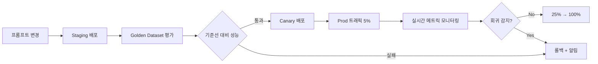

# 거버넌스·자동화

## 회귀 감지 연동

### Evaluation Framework와 연결

[AIDLC Evaluation Framework](../../toolchain/evaluation-framework.md)에서 정의한 **Golden Dataset**을 사용해 신버전 배포 전 회귀를 감지한다.

**Workflow**:



---

### Baseline vs New 통계 비교

**메트릭**:
- **정확도**: Exact Match, F1, BLEU(번역)
- **품질**: LLM-as-Judge 점수(0-1)
- **Latency**: P50, P99
- **비용**: 토큰 사용량

**통계 검정**:

```python
from scipy.stats import ttest_ind

# baseline: 구버전 100개 샘플의 Exact Match 점수
baseline_scores = [...]  # 예: 평균 0.82

# new: 신버전 100개 샘플
new_scores = [...]  # 예: 평균 0.85

t_stat, p_value = ttest_ind(baseline_scores, new_scores)

if p_value < 0.05 and mean(new_scores) > mean(baseline_scores):
    print("신버전이 통계적으로 유의하게 우수 → 배포 승인")
elif mean(new_scores) < mean(baseline_scores) * 0.95:
    print("신버전이 5% 이상 저하 → 롤백")
else:
    print("유의미한 차이 없음 → 추가 검증 필요")
```

---

### 자동 롤백 트리거

**조건**:
1. **정확도 절대 하락**: `new_exact_match < baseline_exact_match - 0.05`
2. **Latency 회귀**: `new_p99_latency > baseline_p99_latency * 1.5`
3. **에러율 증가**: `new_error_rate > 5%`
4. **사용자 피드백**: `thumbs_down_rate > 20%`

**구현**:

```yaml
# Prometheus Alert
- alert: PromptRegressionDetected
  expr: |
    langfuse_eval_exact_match{prompt_version="6"} 
    < langfuse_eval_exact_match{prompt_version="5"} - 0.05
  for: 30m
  annotations:
    summary: "프롬프트 v6 정확도 저하 → 자동 롤백"
  # Webhook → Lambda → Langfuse API (production 라벨을 v5로 되돌림)
```

---

## 운영 거버넌스

### 변경 승인 워크플로

**AIDLC Checkpoints** 적용:

| 단계 | Checkpoint | 승인자 | 기준 |
|------|-----------|-------|------|
| 1. 프롬프트 변경 제안 | `[Answer]:` | 도메인 전문가 | 의도와 리스크 평가 명시 |
| 2. Staging 평가 결과 | 회귀 감지 통과 | Lead Engineer | Exact Match ≥ 베이스라인 - 2% |
| 3. Canary 5% 배포 | 실시간 메트릭 검토 | SRE | 에러율 < 1%, P99 latency ≤ 1.2x |
| 4. Prod 100% 전환 | 최종 승인 | Product Owner | 비즈니스 메트릭 개선 확인 |

**승인 자동화(GitHub Actions + Langfuse)**:

```yaml
# .github/workflows/prompt-approval.yml
name: Prompt Approval
on:
  pull_request:
    paths:
      - 'prompts/**'
jobs:
  evaluate:
    runs-on: ubuntu-latest
    steps:
      - uses: actions/checkout@v4
      - name: Run Golden Dataset Eval
        run: |
          python scripts/eval_prompt.py --new-version ${{ github.sha }}
      - name: Post Results
        uses: actions/github-script@v7
        with:
          script: |
            const results = require('./eval_results.json');
            if (results.exact_match < results.baseline - 0.02) {
              core.setFailed('회귀 감지: Exact Match 저하');
            }
            github.rest.issues.createComment({
              issue_number: context.issue.number,
              body: `### 평가 결과\n- Baseline: ${results.baseline}\n- New: ${results.exact_match}\n- 판정: ${results.pass ? '✅ 승인' : '❌ 반려'}`
            });
```

---

### 변경 기록(Audit Log)

**Langfuse**: 모든 프롬프트 변경은 자동으로 버전 히스토리에 기록됨. 추가로:

```python
# 변경 시 메타데이터 기록
client.create_prompt(
    name="financial-analysis",
    prompt="...",
    labels=["production"],
    metadata={
        "changed_by": "jane@example.com",
        "jira_ticket": "AIDLC-1234",
        "approval": "approved_by_john_2026-04-17",
        "rollback_plan": "revert to v5 if error_rate > 5%"
    }
)
```

**AWS CloudTrail**: Bedrock Prompt Management 사용 시

```json
{
  "eventName": "UpdatePromptAlias",
  "userIdentity": {
    "principalId": "AIDAI...",
    "arn": "arn:aws:iam::123456789012:user/jane"
  },
  "requestParameters": {
    "promptIdentifier": "fin-analysis",
    "aliasIdentifier": "PROD",
    "promptVersion": "6"
  },
  "eventTime": "2026-04-17T14:30:00Z"
}
```

---

### 롤백 계획 필수

모든 변경 요청에 **Rollback Plan** 첨부:

```markdown
## Rollback Plan

**Trigger**: 배포 후 30분 이내 에러율 > 3%

**Steps**:
1. Langfuse에서 `production` 라벨을 v5로 되돌림
2. Gateway 재시작(pod restart 불필요, Langfuse SDK는 30초마다 폴링)
3. Slack #incident 채널에 알림
4. PostMortem 작성(원인, 재발 방지책)

**Validation**:
- 에러율 < 1% 복구 확인
- 5분간 모니터링 후 incident close
```

---

### 감사 증빙

금융권, 의료 등에서 요구하는 **감사 증빙**:

| 항목 | 기록 위치 | 보관 기간 |
|------|----------|----------|
| 프롬프트 버전 | Langfuse DB (S3+KMS) | 7년 |
| 모델 버전 | 추론 로그(trace) | 7년 |
| 승인 기록 | GitHub PR + JIRA | 7년 |
| 평가 결과 | Braintrust/Langfuse Eval | 3년 |
| 사용자 세션 | Langfuse Trace | 1년 |
| 롤백 이벤트 | CloudTrail + PagerDuty | 7년 |

**예시 쿼리(감사관 요청 대응)**:

```sql
-- "2026년 4월 17일 14시에 프롬프트 v6을 누가 배포했나?"
SELECT version, metadata->>'changed_by', metadata->>'jira_ticket', created_at
FROM langfuse_prompts
WHERE name = 'financial-analysis'
  AND created_at BETWEEN '2026-04-17 14:00:00' AND '2026-04-17 15:00:00';
```

---

## AIDLC 단계별 활용

### Construction Phase

**프롬프트도 코드와 함께 Code Review**:

```
repo/
  src/
    agents/
      financial_analyst.py
  prompts/
    financial_analysis_v5.txt  # ← 프롬프트도 버전 관리
  tests/
    test_financial_analyst.py  # Golden Dataset 평가
```

**PR 템플릿**:

```markdown
## 변경 내용
- 프롬프트 v5 → v6: "보수적 투자 자문" 톤 강화

## 평가 결과
- Exact Match: 0.82 → 0.85 (+3%p)
- LLM-as-Judge: 0.78 → 0.81 (+3%p)
- Latency P99: 1.2s → 1.3s (10% 증가, 허용 범위 내)

## 롤백 계획
- Trigger: 에러율 > 3%
- Action: Langfuse production 라벨 → v5 복구

## Approval
- [x] 도메인 전문가 (jane@) 승인
- [x] Golden Dataset 평가 통과
- [ ] SRE 승인 대기
```

---

### Operations Phase

**점진 Rollout + 실시간 회귀 감지**:

| 시간 | 배포 비율 | 모니터링 |
|------|----------|----------|
| D+0 14:00 | Canary 5% 시작 | CloudWatch 대시보드 실시간 |
| D+0 16:00 | 에러율 0.8% ✅ | 25%로 확대 |
| D+0 20:00 | 에러율 1.2% ✅ | 50%로 확대 |
| D+1 10:00 | 에러율 0.9% ✅ | 100% 전환 |
| D+1 14:00 | **에러율 5.2% ❌** | **자동 롤백 트리거** |
| D+1 14:05 | 롤백 완료, v5 복구 | Incident PostMortem 작성 |

**실시간 대시보드(Grafana)**:

```promql
# Canary vs Control 에러율
rate(llm_errors_total{prompt_version="6"}[5m]) 
/ rate(llm_requests_total{prompt_version="6"}[5m])

# Latency P99
histogram_quantile(0.99, 
  rate(llm_latency_bucket{prompt_version="6"}[5m])
)
```

---

## 자동화 도구 통합

### Langfuse + Prometheus + Alertmanager

```yaml
# prometheus-rules.yaml
groups:
  - name: langfuse_regression
    interval: 1m
    rules:
      - alert: PromptVersionRegressionDetected
        expr: |
          langfuse_exact_match{prompt_version=~"v6"} 
          < on(prompt_name) langfuse_exact_match{prompt_version="v5"} - 0.05
        for: 30m
        labels:
          severity: critical
        annotations:
          summary: "프롬프트 v6 회귀 감지"
          description: "{{ $labels.prompt_name }} v6 Exact Match가 v5 대비 5%p 이상 하락"
          
      - alert: LatencyRegressionDetected
        expr: |
          histogram_quantile(0.99, 
            rate(llm_latency_bucket{prompt_version="v6"}[10m])
          ) > 
          histogram_quantile(0.99, 
            rate(llm_latency_bucket{prompt_version="v5"}[10m])
          ) * 1.5
        for: 15m
        labels:
          severity: warning
        annotations:
          summary: "P99 Latency 1.5배 초과"
```

### Lambda 자동 롤백

```python
# lambda_rollback.py
import boto3
from langfuse import Langfuse

def lambda_handler(event, context):
    """
    Alertmanager Webhook → Lambda → Langfuse 롤백
    """
    alert = event['alerts'][0]
    prompt_name = alert['labels']['prompt_name']
    current_version = alert['labels']['prompt_version']
    
    # Langfuse에서 이전 버전 조회
    client = Langfuse()
    versions = client.list_prompt_versions(prompt_name)
    previous_version = int(current_version.replace('v', '')) - 1
    
    # Production 라벨을 이전 버전으로 롤백
    client.update_prompt_label(
        prompt_name, 
        version=previous_version, 
        label="production"
    )
    
    # Slack 알림
    slack_webhook(
        f"🔴 자동 롤백 실행: {prompt_name} v{previous_version}로 복구"
    )
    
    return {"status": "rolled_back", "version": previous_version}
```

---

## 참고 자료

### AIDLC 연관 문서
- [Evaluation Framework](../../toolchain/evaluation-framework.md) — Golden Dataset 기반 회귀 감지
- [Agent 모니터링](../../../agentic-ai-platform/operations-mlops/agent-monitoring.md) — 실시간 observability

### 모니터링·알림
- **Prometheus**: [prometheus.io](https://prometheus.io/)
- **Grafana**: [grafana.com](https://grafana.com/)
- **Alertmanager**: [prometheus.io/docs/alerting](https://prometheus.io/docs/alerting/latest/alertmanager/)

### 통계 검정
- **scipy.stats**: [docs.scipy.org/doc/scipy/reference/stats.html](https://docs.scipy.org/doc/scipy/reference/stats.html)
- **Statsmodels**: [statsmodels.org](https://www.statsmodels.org/)

---

## 다음 단계

거버넌스 체계를 구축했다면:

1. **[프롬프트·모델 레지스트리](./prompt-model-registry.md)** — 버전 관리 시스템 구축
2. **[배포 전략](./deployment-strategies.md)** — Canary/Shadow 전략 구현
3. **[Agent 모니터링](../../../agentic-ai-platform/operations-mlops/agent-monitoring.md)** — Langfuse + Prometheus 통합 observability 구축
