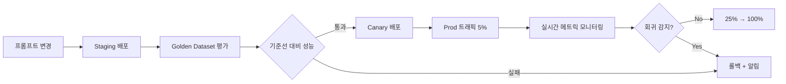

## 회귀 감지 연동

### Evaluation Framework와 연결

[AIDLC Evaluation Framework](../../toolchain/evaluation-framework.md)의 **Golden Dataset**으로 기존 버전과 새 버전을 비교합니다. 같은 문제에서 정확도·지연·비용이 어떻게 달라졌는지 확인한 뒤 배포 여부를 판단합니다.

**Workflow**:


```mermaid
graph LR
    A[프롬프트 변경] --> B[Staging 배포]
    B --> C[Golden Dataset 평가]
    C --> D{기준선 대비 성능}
    D -->|통과| E[Canary 배포]
    D -->|실패| F[롤백 + 알림]
    E --> G[Prod 트래픽 5%]
    G --> H[실시간 메트릭 모니터링]
    H --> I{회귀 감지?}
    I -->|No| J[25% → 100%]
    I -->|Yes| F
```

---

### Baseline vs New 통계 비교

**메트릭**:
- **정확도**: Exact Match, F1, BLEU(번역)
- **품질**: LLM-as-Judge 점수(0-1)
- **Latency**: P50, P99
- **비용**: 토큰 사용량

**통계 검정**:

같은 데이터셋의 같은 문제를 두 버전에서 풀었다면 각 문제의 결과를 짝지어 비교합니다. 이를 쌍체 설계라고 합니다. 아래 **정확 McNemar 검정**은 문제마다 정답·오답(1·0) 결과가 있고, 문제들이 서로 독립인 경우에 사용합니다.

같은 문제의 반복 실행이나 비슷한 문제군은 서로 영향을 줄 수 있으므로 독립 표본으로 세지 않습니다. 이런 경우에는 문제군을 묶어 분석하는 방법을 미리 정해야 합니다. 연속형 점수에는 가정에 맞는 `ttest_rel`을, 서로 독립인 두 표본에는 `ttest_ind(..., equal_var=False)` 같은 검정을 검토합니다.

```python
# paired-exact-match.py — independent cases, paired by stable case ID
from math import comb
from statistics import mean

def compare_exact_match(baseline, candidate):
    # Inputs: nonempty {case_id: 0 or 1} mappings from the same dataset revision.
    if (not isinstance(baseline, dict) or not isinstance(candidate, dict)
            or not baseline or baseline.keys() != candidate.keys()):
        raise ValueError("Both versions must contain the same nonempty case IDs")
    for results in (baseline, candidate):
        for case_id, score in results.items():
            if (not isinstance(case_id, str) or not case_id
                    or type(score) not in (int, float) or score not in (0, 1)):
                raise ValueError("Exact Match requires a case ID and a binary score")
    lost = sum(baseline[k] == 1 and candidate[k] == 0 for k in baseline)
    gained = sum(baseline[k] == 0 and candidate[k] == 1 for k in baseline)
    discordant = lost + gained
    # Exact two-sided McNemar test: conditional binomial test of discordant pairs.
    p_value = (1.0 if discordant == 0 else min(
        1.0, 2 * sum(comb(discordant, k)
                     for k in range(min(lost, gained) + 1)) / (1 << discordant)))
    old_mean, new_mean = mean(baseline.values()), mean(candidate.values())
    return {"baseline": old_mean, "exact_match": new_mean,
            "delta_percentage_points": 100 * (new_mean - old_mean),
            "paired_p_value": p_value, "sample_count": len(baseline)}
```

`paired_p_value`는 동등한 성공 확률 가설에 관한 보조 증거이며 배포 승인 값이 아닙니다. 효과 크기와 불확실성, 안전·비용 검증, 사람 승인을 함께 검토합니다. 이 문서의 정책안은 staging에서 **절대 0.02(2%p)**까지의 하락을 허용하고, 운영 회귀 경보는 **절대 0.05(5%p)를 초과한 하락**에 사용합니다. 두 목적과 단위를 구분합니다.

---

### 자동 롤백 트리거

**조건**:
1. **정확도 절대 하락**: `new_exact_match < baseline_exact_match - 0.05`
2. **Latency 회귀**: `new_p99_latency > baseline_p99_latency * 1.5`
3. **에러율 증가**: `new_error_rate > 5%`
4. **사용자 피드백**: `thumbs_down_rate > 20%`

**구현**:

다음 메트릭은 이 문서가 제안하는 exporter 계약입니다. `langfuse_eval_exact_match`는 `(project, prompt_name, dataset_id, prompt_version)`별로 같은 평가 revision의 완료된 0–1 점수를 내보냅니다. 버전 라벨은 `"6"`, `"5"`처럼 숫자 문자열로 통일합니다. 중복 수집 replica는 같은 논리 점수를 제공해야 하며 `max by`는 그 중복만 제거합니다. 서로 다른 run이나 표본 집단의 평균을 합치는 용도로 사용하지 않습니다.

```yaml
# Proposed rule fragment; use inside a Prometheus rule group's rules list.
- alert: PromptRegressionDetected
  # 1e-12 is a numerical boundary tolerance for finite scores in [0, 1].
  expr: |
    max by (project, prompt_name, dataset_id) (
      langfuse_eval_exact_match{prompt_version="5"}
    )
    - on (project, prompt_name, dataset_id)
    max by (project, prompt_name, dataset_id) (
      langfuse_eval_exact_match{prompt_version="6"}
    ) > (0.05 + 1e-12)
  for: 30m
  labels:
    prompt_version: "6"
  annotations:
    summary: "Candidate Exact Match is more than five percentage points below baseline"
  # Alertmanager routes a request to the authenticated rollback controller.
```

경보가 없거나 비교 결과가 빈 벡터인 상태는 통과가 아닙니다. 별도 상태 점검으로 기대 cohort의 양쪽 버전 존재, 최소 표본 수, 평가 시각의 유효성, 유한한 점수, replica 간 일치를 확인하고 누락·불일치 시 승격을 보류합니다. `for: 30m`는 조건이 연속 유지되어야 하는 시간이며 롤백 실행 시간이나 성공 보장이 아닙니다.

---

## 운영 거버넌스

### 변경 승인 워크플로

아래 역할·임계값은 공식 AI-DLC 단계 정의가 아닌 **조직별 운영 정책안**입니다. 공식 승인 체크포인트는 유지하되 실제 reviewer 권한과 예외 승인자를 별도로 지정합니다. 확인한 [v0.1.7 Operations 규칙](https://raw.githubusercontent.com/awslabs/aidlc-workflows/v0.1.7/aidlc-rules/aws-aidlc-rule-details/operations/operations.md)은 향후 운영 단계의 placeholder입니다.

| 단계 | Checkpoint | 승인자 | 기준 |
|------|-----------|-------|------|
| 1. 프롬프트 변경 제안 | `[Answer]:` | 도메인 전문가 | 의도와 리스크 평가 명시 |
| 2. Staging 평가 결과 | 회귀 감지 통과 | Lead Engineer | Exact Match ≥ 베이스라인 - 0.02(2%p) |
| 3. Canary 5% 배포 | 실시간 메트릭 검토 | SRE | 에러율 < 1%, P99 latency ≤ 1.2x |
| 4. Prod 100% 전환 | 최종 승인 | Product Owner | 비즈니스 메트릭 개선 확인 |

**승인 자동화(GitHub Actions + Langfuse)**:

프로젝트에서 `eval_prompt.py`와 의존성을 준비합니다. 결과 JSON에는 `schema_version: 1`, 평가한 commit의 `evaluated_sha`, `complete: true`, 유한한 0–1 점수 `baseline`·`exact_match`, 정수 `sample_count`가 필요합니다. 최소 100개 문제와 0.02 허용 차이는 이 예제의 정책입니다.

checkout·`--new-version`·`EXPECTED_SHA`는 같은 PR head SHA를 사용합니다. 평가기는 실제 checkout이 이 SHA와 일치하는지 확인하고, 실행한 데이터셋 manifest의 불변 ID·hash와 문제 수·누락 여부도 기록해야 합니다. 인자를 결과에 그대로 복사하는 것만으로는 검증이 되지 않습니다. 아래 보고 단계는 JSON을 검사할 뿐 데이터셋이나 실행 결과를 독립적으로 재계산하지 않습니다.

```yaml
# .github/workflows/prompt-approval.yml — project integration scaffold
name: Prompt Approval
on:
  pull_request:
    paths:
      - 'prompts/**'
permissions:
  contents: read
jobs:
  evaluate:
    runs-on: ubuntu-latest
    steps:
      - uses: actions/checkout@v4
        with:
          ref: ${{ github.event.pull_request.head.sha }}
      - name: Run Golden Dataset Eval
        run: python scripts/eval_prompt.py --new-version "${{ github.event.pull_request.head.sha }}"
      - uses: actions/upload-artifact@v4
        if: ${{ always() }}
        with:
          name: prompt-evaluation
          path: eval_results.json
          if-no-files-found: error
  report:
    needs: evaluate
    if: ${{ !cancelled() }}
    runs-on: ubuntu-latest
    permissions:
      contents: read
      issues: write
    steps:
      - uses: actions/download-artifact@v4
        continue-on-error: true
        with:
          name: prompt-evaluation
          path: eval-artifact
      - name: Validate and report
        id: gate
        uses: actions/github-script@v7
        env:
          EXPECTED_SHA: ${{ github.event.pull_request.head.sha }}
          EVALUATION_JOB_RESULT: ${{ needs.evaluate.result }}
        with:
          script: |
            // approval-gate.js — trusted reporting code; parse artifacts as data only
            const fs = require('node:fs');
            let decision = 'REJECTED';
            let reason = 'Evaluation results are unavailable or invalid';
            let summary = '';
            try {
              const file = 'eval-artifact/eval_results.json';
              const stat = fs.statSync(file);
              if (!stat.isFile() || stat.size > 65536) throw new Error('Invalid artifact size');
              const r = JSON.parse(fs.readFileSync(file, 'utf8'));
              const score = value => typeof value === 'number'
                && Number.isFinite(value) && value >= 0 && value <= 1;
              if (!/^[0-9a-f]{40}$/.test(process.env.EXPECTED_SHA || '')
                  || !r || Array.isArray(r) || r.schema_version !== 1
                  || r.complete !== true || !score(r.baseline) || !score(r.exact_match)
                  || !Number.isSafeInteger(r.sample_count) || r.sample_count < 100
                  || r.evaluated_sha !== process.env.EXPECTED_SHA
                  || process.env.EVALUATION_JOB_RESULT !== 'success') {
                throw new Error('Invalid, incomplete, stale, or failed evaluation');
              }
              // One local policy: at most a two-percentage-point staging degradation.
              const drop = r.baseline - r.exact_match;
              const passes = drop <= 0.02 + 4 * Number.EPSILON;
              decision = passes ? 'METRIC_GATE_PASSED' : 'REJECTED';
              reason = passes ? 'Staging metric policy met; human approval remains required'
                              : 'Exact Match degradation exceeds two percentage points';
              summary = `\n- Baseline: ${r.baseline}\n- New: ${r.exact_match}`;
            } catch (error) {
              // Do not echo untrusted artifact contents or treat parsing errors as a pass.
              reason = 'Missing, malformed, incomplete, or failed evaluation; inspect artifacts';
            }
            if (decision !== 'METRIC_GATE_PASSED') core.setFailed(reason);
            core.setOutput('decision', decision);
            try {
              await github.rest.issues.createComment({
                owner: context.repo.owner,
                repo: context.repo.repo,
                issue_number: context.issue.number,
                body: `### Evaluation Results\n- Decision: ${decision}\n- ${reason}${summary}`
              });
            } catch (error) {
              core.setFailed('Evaluation report could not be posted; promotion remains blocked');
            }
```

평가 job은 읽기 권한만 받고, 결과 보고 job은 PR 코드를 checkout하거나 실행하지 않고 JSON만 읽습니다. 보고 로직은 신뢰하는 기준 브랜치/필수 workflow로 보호해야 합니다. fork PR처럼 쓰기 권한이 없는 실행에서는 댓글 실패를 통과로 숨기지 말고, 승인된 별도 보고 경로를 사용합니다. 실제 승격은 `report` job 성공과 동일한 판정, 보호된 environment의 지정 reviewer 승인 및 SHA 일치를 모두 요구해야 합니다. environment·branch 보호는 저장소 설정으로 구현하고 검증해야 하며 이 YAML이나 댓글이 대신하지 않습니다. 이 예시는 배포를 실행하지 않습니다.

---

### 변경 기록(Audit Log)

**Langfuse**: 아래는 2026-09-19에 읽은 [Python SDK 소스의 `create_prompt` 계약](https://raw.githubusercontent.com/langfuse/langfuse-python/main/langfuse/_client/client.py)을 사용하는 후보 버전 생성 예시입니다. `metadata` 대신 지원되는 `config`와 `commit_message`를 사용하고, 설치할 SDK 버전에서 해당 signature를 확인해 고정합니다. 프롬프트 버전 기록과 production 승격 승인 기록은 구분합니다.

```python
# prompt-candidate.py — supply an authenticated, project-scoped client
candidate = client.create_prompt(
    name="financial-analysis",
    type="text",
    prompt="...",
    labels=["staging"],
    config={
        "change_request": "AIDLC-1234",
        "approval_record_ref": "pending",
        "rollback_policy_ref": "financial-analysis-policy-v1"
    },
    commit_message="AIDLC-1234: candidate for evaluation"
)
candidate_version = candidate.version  # Persist the returned version; do not guess it.
```

`approval_record_ref` 같은 문자열은 승인 권한이 아닙니다. 인증된 주체·project·변경 SHA에 묶인 별도 승인 기록을 검증한 뒤에만 production 라벨을 이동합니다.

**AWS CloudTrail**: Bedrock Prompt Management의 [CreatePromptVersion](https://docs.aws.amazon.com/bedrock/latest/APIReference/API_agent_CreatePromptVersion.html)은 프롬프트의 정적 버전 snapshot을 만듭니다. 확인한 `bedrock-agent` API 모델에는 `UpdatePromptAlias`가 없습니다. 아래 JSON은 문서화된 operation 이름·입력 식별자를 사용한 **설명용 CloudTrail 이벤트 발췌**이며 실제 수집 로그나 전체 CloudTrail 스키마를 검증한 기록은 아닙니다.

```json
{
  "eventSource": "bedrock.amazonaws.com",
  "eventName": "CreatePromptVersion",
  "userIdentity": {
    "principalId": "EXAMPLE-PRINCIPAL",
    "arn": "arn:aws:iam::123456789012:role/example-prompt-publisher"
  },
  "requestParameters": {
    "promptIdentifier": "ABCDEFGHIJ",
    "description": "Candidate snapshot for AIDLC-1234"
  },
  "eventTime": "2026-04-17T14:30:00Z"
}
```

호출 결과의 버전 ARN을 보존합니다. 애플리케이션의 production→버전 ARN 매핑은 실제 사용하는 설정 저장소에서 변경하고 해당 저장소의 변경 이벤트로 별도 감사합니다. 버전 생성만으로 트래픽이 전환되지는 않습니다.

---

### 롤백 계획 필수

모든 변경 요청에 **Rollback Plan** 첨부:

```markdown
## Rollback Plan

**Trigger**: 배포 후 30분 이내 에러율 > 3%

**Steps**:
1. Langfuse에서 `production` 라벨을 v5로 되돌림
2. 배포한 SDK의 cache TTL·갱신·fallback 정책에 따라 새 버전을 전파하고 각 client의 실제 prompt version을 확인
3. Slack #incident 채널에 알림
4. PostMortem 작성(원인, 재발 방지책)

**Validation**:
- 에러율 < 1% 복구 확인
- 최소 5분은 예시 관찰 구간이며, 충분한 요청 수·모든 client의 버전·in-flight 작업과 fallback·오류/지연 회복을 확인한 담당자가 종료 판단
```

[Langfuse caching 문서](https://langfuse.com/docs/prompt-management/features/caching)의 조회 시점 기본 TTL은 60초입니다. 만료 후 요청은 stale 값을 제공하면서 비동기 재검증할 수 있으므로 무조건 30초 주기 polling이나 일정 시간 내 전체 client 갱신을 보장하지 않습니다. Registry 확인에는 지원되는 `cache_ttl_seconds=0`을 사용할 수 있지만 다른 프로세스의 캐시를 지우지는 않습니다.

---

### 감사 증빙

**감사 증빙 정책안**: 아래 7년·3년·1년은 검토용 보존 기간 예시이며 법정 의무로 검증되지 않았습니다. 실제 관할·기록 유형·승인된 조직 정책에 따라 근거, 접근·삭제·legal hold 절차와 비용을 확정해야 합니다. 이 문서는 새로운 법률 판단을 제공하지 않습니다.

| 항목 | 기록 위치 | 보관 기간 |
|------|----------|----------|
| 프롬프트 버전 | Langfuse DB + 별도 구성한 보관 저장소 | 7년 |
| 모델 버전 | 추론 로그(trace) | 7년 |
| 승인 기록 | GitHub PR + JIRA | 7년 |
| 평가 결과 | Braintrust/Langfuse Eval | 3년 |
| 사용자 세션 | Langfuse Trace | 1년 |
| 롤백 이벤트 | CloudTrail + PagerDuty | 7년 |

**예시 쿼리(감사관 요청 대응)**:

다음은 **애플리케이션이 별도로 구현하는 이벤트 저장소**의 최소 스키마입니다. Langfuse 내부 테이블 이름을 가정하지 않습니다. 인증된 actor와 승인 참조는 서버가 기록하며, 라벨 변경 확인 시각을 UTC로 저장합니다. 프롬프트 생성 시각을 승격 시각으로 대신하지 않고, 라벨 확인과 전체 트래픽 회복도 구분합니다.

```sql
-- Application-owned append-only event schema, NOT Langfuse's internal schema.
CREATE TABLE prompt_deployment_events (
    event_id text PRIMARY KEY,
    project_id text NOT NULL,
    prompt_name text NOT NULL,
    to_version integer NOT NULL,
    label text NOT NULL,
    event_type text NOT NULL,
    actor_subject text NOT NULL,
    approval_record_ref text NOT NULL,
    occurred_at timestamptz NOT NULL
);

SELECT to_version, actor_subject, approval_record_ref, occurred_at
FROM prompt_deployment_events
WHERE project_id = 'financial-demo'
  AND prompt_name = 'financial-analysis'
  AND to_version = 6 AND label = 'production'
  AND event_type = 'label_promotion_verified'
  AND occurred_at >= TIMESTAMPTZ '2026-04-17 14:00:00+00'
  AND occurred_at <  TIMESTAMPTZ '2026-04-17 15:00:00+00'
ORDER BY occurred_at, event_id;
```

---

## AIDLC 단계별 활용

### Construction Phase

**프롬프트도 코드와 함께 Code Review**:

```
repo/
  src/
    agents/
      financial_analyst.py
  prompts/
    financial_analysis_v5.txt  # ← 프롬프트도 버전 관리
  tests/
    test_financial_analyst.py  # Golden Dataset 평가
```

**PR 템플릿(가상 측정값과 체크 상태 예시)**:

```markdown
## 변경 내용
- 프롬프트 v5 → v6: "보수적 투자 자문" 톤 강화

## 평가 결과
- Exact Match: 0.82 → 0.85 (+3%p)
- LLM-as-Judge: 0.78 → 0.81 (0–1 점수에서 +0.03)
- Latency P99: 1.2s → 1.3s (약 8.33% 증가, 예시 1.2배 기준 이내)

## 롤백 계획
- Trigger: 에러율 > 3%
- Action: Langfuse production 라벨 → v5 복구

## Approval
- [x] 도메인 전문가 (jane@) 승인
- [x] Golden Dataset 평가 통과
- [ ] SRE 승인 대기
```

---

### Operations Phase

**점진 Rollout + 실시간 회귀 감지(가상 시나리오)**: 시각만으로 승격하지 않고 각 gate의 요청 수·P99·오류율·사람 승인을 함께 확인합니다. 아래 3%/5% 오류율과 15분/30분 지속 조건은 서로 다른 정책이며, 오류율 경로의 detector·라우팅은 별도 구현 사항입니다.

| 시간 | 배포 비율 | 모니터링 |
|------|----------|----------|
| D+0 14:00 | Canary 5% 시작 | CloudWatch 대시보드 실시간 |
| D+0 16:00 | 에러율 0.8% ✅ | 25%로 확대 |
| D+0 20:00 | 에러율 1.2% — gate 미달 | 25% 유지, 원인 조사 |
| D+1 10:00 | 에러율 0.9% — 오류율 조건만 통과 | 나머지 gate·승인 확인 후 50%, 이후 100% 검토 |
| D+1 14:00 | **에러율 5.2% — 회복 조치 필요** | 구성한 오류율 detector의 조건·권한 확인 후 롤백 요청 |
| D+1 14:05 | 예시 확인 시점 — 복구 완료 미확인 | 라벨·client 전파·트래픽 회복 확인, incident 유지 |

**실시간 대시보드(Grafana)**:

```promql
# Candidate error rate: aggregate matching counters across instances.
(
  sum by (project, prompt_name) (rate(llm_errors_total{prompt_version="6"}[5m]))
  / sum by (project, prompt_name) (rate(llm_requests_total{prompt_version="6"}[5m]))
) and on (project, prompt_name)
(
  sum by (project, prompt_name) (rate(llm_requests_total{prompt_version="6"}[5m])) > 0
)

# Service-wide P99: preserve le until histogram_quantile.
histogram_quantile(0.99,
  sum by (le, project, prompt_name) (
    rate(llm_latency_bucket{prompt_version="6"}[5m])
  )
)
```

---

## 자동화 도구 통합

### Langfuse + Prometheus + Alertmanager

```yaml
# prometheus-rules.yaml — apply the exporter/cardinality contract in the text
groups:
  - name: langfuse_regression
    interval: 1m
    rules:
      - alert: PromptVersionRegressionDetected
        # 1e-12 is a numerical boundary tolerance for finite scores in [0, 1].
        expr: |
          max by (project, prompt_name, dataset_id) (
            langfuse_eval_exact_match{prompt_version="5"}
          )
          - on (project, prompt_name, dataset_id)
          max by (project, prompt_name, dataset_id) (
            langfuse_eval_exact_match{prompt_version="6"}
          ) > (0.05 + 1e-12)
        for: 30m
        labels:
          severity: critical
          prompt_version: "6"
        annotations:
          summary: "Candidate Exact Match regression"
          description: "{{ $labels.prompt_name }}: decrease exceeds five percentage points"

      - alert: LatencyRegressionDetected
        expr: |
          histogram_quantile(0.99,
            sum by (le, project, prompt_name) (
              rate(llm_latency_bucket{prompt_version="6"}[10m])
            )
          ) > on (project, prompt_name)
          histogram_quantile(0.99,
            sum by (le, project, prompt_name) (
              rate(llm_latency_bucket{prompt_version="5"}[10m])
            )
          ) * 1.5
        for: 15m
        labels:
          severity: warning
          prompt_version: "6"
        annotations:
          summary: "Candidate P99 exceeds 1.5 times baseline"
```

### Lambda 자동 롤백

아래는 **단일 alert를 처리하는 controller scaffold**입니다. 인증된 수신 adapter가 batch의 각 alert를 검증해 전달해야 하며 첫 번째 alert만 처리해서는 안 됩니다. `control.claim()`은 프로젝트가 구현할 필수 경계입니다: webhook 인증, project 권한, firing 상태·신선도와 배포 revision 확인, 모든 승격 writer가 공유하는 직렬화/lease, durable event 중복 방지, 승인된 last-known-good target 로드와 실패 후 reconciliation을 담당합니다. 해당 구현이 없으면 이 예시는 실행할 수 없습니다.

```python
# rollback-controller.py — project control-plane hooks are mandatory
def rollback_prompt(alert, *, client, control):
    if (not isinstance(alert, dict) or alert.get("status") != "firing"
            or not isinstance(alert.get("labels"), dict)):
        return {"status": "ignored"}
    labels = alert["labels"]
    if not all(isinstance(labels.get(k), str) and labels[k]
               for k in ("project", "prompt_name", "prompt_version")):
        raise ValueError("Missing rollback identity")
    version_text = labels["prompt_version"]
    if not version_text.isascii() or not version_text.isdecimal():
        raise ValueError("Expected a numeric prompt version")
    expected = int(version_text)
    if expected < 1:
        raise ValueError("Invalid prompt version")

    # claim() authenticates the event, checks tenant/active-alert freshness,
    # and serializes ALL production-label writers for this project/prompt.
    # It durably deduplicates events and loads the approved recovery plan.
    with control.claim(alert) as attempt:
        if attempt.completed_result is not None:
            return attempt.completed_result
        if (attempt.project != labels["project"]
                or attempt.prompt_name != labels["prompt_name"]
                or attempt.expected_version != expected
                or type(attempt.target_version) is not int
                or attempt.target_version < 1
                or attempt.target_version == expected
                or not attempt.approval_record_ref):
            raise ValueError("Recovery plan does not match the authorized event")
        current = client.get_prompt(
            labels["prompt_name"], label="production", cache_ttl_seconds=0)
        if current.version != expected:
            return attempt.record({"status": "stale_event"})
        target = client.get_prompt(
            labels["prompt_name"], version=attempt.target_version,
            cache_ttl_seconds=0)
        if target.version != attempt.target_version:
            raise ValueError("Approved recovery target is unavailable")
        attempt.record_intent()  # Durable before the external write.
        try:
            client.update_prompt(
                name=labels["prompt_name"], version=attempt.target_version,
                new_labels=["production"])
            observed = client.get_prompt(
                labels["prompt_name"], label="production", cache_ttl_seconds=0)
            if observed.version != attempt.target_version:
                raise RuntimeError("Registry label verification failed")
        except Exception:
            # Timeouts can occur after a successful write: reconcile the intent.
            attempt.mark_uncertain()
            raise
        return attempt.record({
            "status": "registry_label_verified",
            "version": attempt.target_version,
            "traffic_recovery": "pending"})
```

SDK 호출은 확인한 [`get_prompt`/`update_prompt` 계약](https://raw.githubusercontent.com/langfuse/langfuse-python/main/langfuse/_client/client.py)에 한정합니다. client는 검증된 project 자격 증명에 묶고, target 승인도 불변 artifact/정책에 연결합니다. SDK 라벨 변경은 저장소 전체의 compare-and-swap을 제공하지 않으므로 다른 writer가 같은 제어 경계를 우회하면 동시성 안전을 보장할 수 없습니다. timeout 후에는 현재 라벨과 intent를 조정한 뒤 재시도 여부를 결정합니다. 반환값은 registry 라벨 확인만 뜻하며, 실제 client 전파·에러율 회복·알림 성공은 별도 기록합니다.

---

## 참고 자료

### AIDLC 연관 문서
- [Evaluation Framework](../../toolchain/evaluation-framework.md) — Golden Dataset 기반 회귀 감지
- [Agent 모니터링](../../../agentic-ai-platform/operations-mlops/observability/agent-monitoring.md) — 실시간 observability

### 모니터링·알림
- **Prometheus**: [prometheus.io](https://prometheus.io/)
- **Grafana**: [grafana.com](https://grafana.com/)
- **Alertmanager**: [prometheus.io/docs/alerting](https://prometheus.io/docs/alerting/latest/alertmanager/)

### 통계 검정
- **scipy.stats**: [docs.scipy.org/doc/scipy/reference/stats.html](https://docs.scipy.org/doc/scipy/reference/stats.html)
- **Statsmodels**: [statsmodels.org](https://www.statsmodels.org/)

---

## 다음 단계

거버넌스 체계를 구축했다면:

1. **[프롬프트·모델 레지스트리](./prompt-model-registry.md)** — 버전 관리 시스템 구축
2. **[배포 전략](./deployment-strategies.md)** — Canary/Shadow 전략 구현
3. **[Agent 모니터링](../../../agentic-ai-platform/operations-mlops/observability/agent-monitoring.md)** — Langfuse + Prometheus 통합 observability 구축
