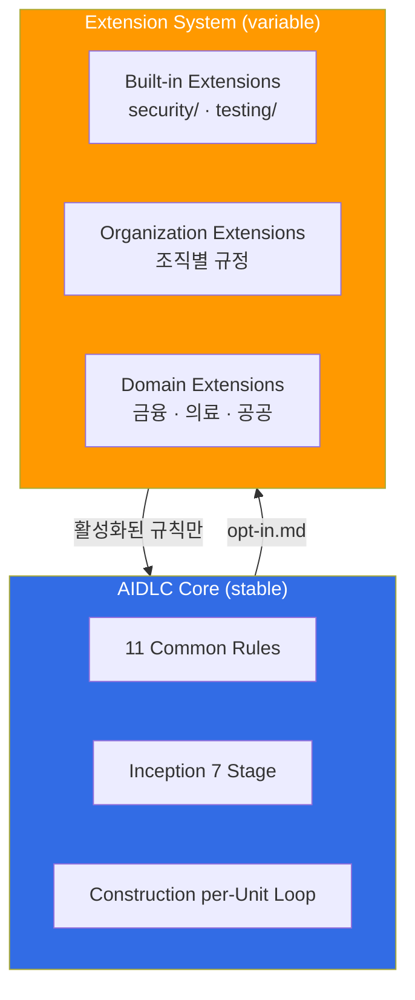
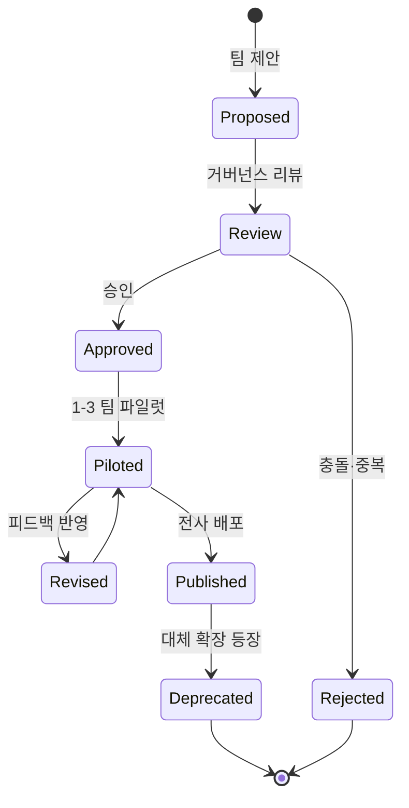

# Extension System

> 📅 **작성일**: 2026-04-18 | ⏱️ **읽는 시간**: 약 15분

AWS Labs [AIDLC Workflows](https://github.com/awslabs/aidlc-workflows) 는 공식 5대 원칙과 11개 Common Rules 외에, **조직별 규제·도메인 특화 규칙을 추가**할 수 있는 **Extension System** 을 제공합니다. 본 문서는 Extension 아키텍처, Built-in 확장, opt-in 작동 메커니즘, 그리고 한국 엔터프라이즈(ISMS-P · 금융감독규정) 적용 예시를 다룹니다.

---

## 1. 개요: 왜 Extension 인가

### 1.1 Core vs Extension 분리 원칙

AIDLC 는 **방법론 코어(stable)** 와 **조직 규칙(variable)** 을 명확히 분리합니다.



**핵심 원칙:**
- Core 는 **모든 조직·산업에 공통** 으로 적용되는 최소 규칙
- Extension 은 **조직·산업·프로젝트별로 선택적 적용**
- **`opt-in.md` 파일의 존재·내용이 활성화 여부를 결정**

### 1.2 Extension 도입 효과

| 효과 | 설명 | 예시 |
|------|------|------|
| **규제 대응** | 산업별 법·규제를 AIDLC 워크플로에 내장 | 금융권 전자금융감독규정 반영 |
| **조직 표준화** | 팀별 표준 템플릿·체크리스트를 재사용 가능한 모듈로 분리 | 아키텍처 결정 기록(ADR) 템플릿 |
| **점진적 도입** | 코어 방법론 먼저 도입, 조직 특화는 나중에 확장 | MVP 출시 후 Compliance 추가 |
| **도구 독립성** | Extension 은 Markdown + YAML 로 표현되어 모든 AIDLC 플랫폼에서 동작 | Kiro · Claude Code · Cursor |

---

## 2. Built-in Extensions

AWS Labs 저장소는 2개의 **Built-in Extension** 을 기본 제공합니다: `security/` 와 `testing/`.

### 2.1 security/ 확장

**목적**: 보안 관련 요구사항 추출·검증·강제를 AIDLC 워크플로에 통합.

**주요 규칙:**
```yaml
# extensions/security/rules.yaml
security_extension:
  version: 0.1.0
  applies_to_stages:
    - requirements_analysis
    - application_design
    - construction.code_generation
    - construction.build_and_test

  rules:
    - id: SEC-001
      name: "Threat Modeling Required"
      stage: application_design
      action: "STRIDE 기반 위협 모델링 문서 생성 필수"

    - id: SEC-002
      name: "Secrets Scanning"
      stage: construction.build_and_test
      action: "git-secrets + truffleHog 자동 실행, 하드코딩 크레덴셜 차단"

    - id: SEC-003
      name: "SAST Integration"
      stage: construction.build_and_test
      action: "Semgrep / Snyk / Checkov 중 하나 이상 실행"

    - id: SEC-004
      name: "Dependency Vulnerability Check"
      stage: construction.build_and_test
      action: "OSV-Scanner or Trivy 실행, Critical 취약점은 병합 차단"

    - id: SEC-005
      name: "Least Privilege IAM"
      stage: construction.infrastructure_design
      action: "IAM Policy 는 wildcard Resource 사용 금지 (특수 케이스 정당화 필요)"
```

### 2.2 testing/ 확장

**목적**: 테스트 자동 생성·커버리지 관리·품질 게이트 강제.

**주요 규칙:**
```yaml
# extensions/testing/rules.yaml
testing_extension:
  version: 0.1.0
  applies_to_stages:
    - construction.functional_design
    - construction.code_generation
    - construction.build_and_test

  rules:
    - id: TEST-001
      name: "TDD First"
      stage: construction.code_generation
      action: "테스트 코드를 프로덕션 코드보다 먼저 생성"

    - id: TEST-002
      name: "Minimum Coverage"
      stage: construction.build_and_test
      action: "단위 테스트 커버리지 ≥ 80%, 실패 시 Checkpoint Approval 차단"

    - id: TEST-003
      name: "Integration Test Required"
      stage: construction.build_and_test
      action: "외부 의존성(DB, API)에 대한 통합 테스트 필수"

    - id: TEST-004
      name: "Acceptance Test Linkage"
      stage: construction.functional_design
      action: "각 Functional Requirement 에 대응하는 Acceptance Test 매핑"
```

---

## 3. Opt-in 메커니즘

### 3.1 opt-in.md 파일 구조

Extension 활성화는 프로젝트 루트의 **`opt-in.md`** 파일로 제어합니다.

**위치**: `<project-root>/.aidlc/opt-in.md`

**파일 구조:**
```markdown
# AIDLC Opt-in Extensions

**Project**: payment-service
**Updated**: 2026-04-18

## Enabled Extensions

### Built-in
- [x] security (version 0.1.0)
- [x] testing (version 0.1.0)

### Organization
- [x] org-lg-security (version 1.2.0) — LG CNS 내부 보안 표준
- [x] org-compliance-ismsp (version 2.1.0) — ISMS-P 인증기준

### Domain
- [x] finance-korea (version 1.0.0) — 전자금융감독규정

## Disabled Extensions (명시적 거부)

- [ ] healthcare-hipaa — 해당 없음 (금융 서비스)
- [ ] public-sector-korea — 해당 없음
```

### 3.2 Requirements Analysis 단계의 opt-in 질문

AIDLC 의 Requirements Analysis stage 는 `opt-in.md` 파일을 읽어 활성화된 확장을 확인합니다. **파일이 없거나 확장이 지정되지 않은 경우**, Common Rules 규칙 1 (Question Format) 에 따라 사용자에게 질문합니다:

```markdown
Q. 본 프로젝트에 적용할 Extension 을 선택하세요 (복수 선택 가능):

A. security 만 (기본값, 모든 프로젝트 권장)
B. security + testing (표준, 일반 프로덕션 프로젝트)
C. security + testing + 조직 규정 (엔터프라이즈)
D. C + 산업 규제 (금융/의료/공공)
E. None (데모·PoC 용, 프로덕션 금지)

[Answer]:
```

**응답 후 자동 생성:**
- `[Answer]: C` → AIDLC 가 `opt-in.md` 에 security, testing, 조직 확장 추가

### 3.3 Extension 우선순위

여러 확장에서 **충돌하는 규칙** 이 있을 경우 우선순위:

```
1. Common Rules (최우선, 공식 규격)
2. Domain Extensions (산업 규제)
3. Organization Extensions (조직 표준)
4. Built-in Extensions (security, testing)
5. Project-local overrides (최하위)
```

**예시 충돌 해결:**
```
Common Rules 11: Reproducible — Temperature = 0 권장
Organization Extension (금융): Temperature = 0.1 허용 (창의성 일부 허용)

→ Common Rules 우선 → Temperature = 0 강제
→ 조직이 정말 필요하면 Common Rules 의 waiver 프로세스 실행 필요
```

---

## 4. 조직 컴플라이언스 확장 예시

### 4.1 한국 ISMS-P 확장

**배경**: ISMS-P (정보보호 및 개인정보보호 관리체계) 는 한국 정보보호 관련 법규 준수를 요구하는 민간 인증. 공공 계약·금융 서비스 진출 시 사실상 필수.

**확장 디렉터리 구조:**
```
extensions/org-compliance-ismsp/
  rules.yaml
  templates/
    pia-template.md           # 개인정보 영향평가(PIA)
    access-control-matrix.md
    incident-response-plan.md
  audit-mappings/
    ismsp-2.1.yaml           # ISMS-P 2.1 관리적 조치
    ismsp-2.8.yaml           # 개인정보 처리단계별 요구사항
```

**rules.yaml 예시:**
```yaml
extension:
  name: org-compliance-ismsp
  version: 2.1.0
  description: ISMS-P 2.1 인증기준 AIDLC 통합
  applies_to:
    industries: [finance, public, healthcare]
    regions: [KR]

  rules:
    - id: ISMSP-2.5.1
      name: "사용자 계정 관리"
      stage: application_design
      common_rules_mapping: [checkpoint_approval, audit_logging]
      action: |
        사용자 인증·인가 설계 시 다음 의무:
        - 패스워드 정책 (9자 이상, 3종 이상 조합)
        - 세션 타임아웃 (10분 이상 비활성 시 자동 로그아웃)
        - 로그인 실패 5회 연속 시 계정 잠금

    - id: ISMSP-2.8.2
      name: "개인정보 처리단계별 요구사항"
      stage: requirements_analysis
      action: |
        개인정보 수집·이용·제공·파기 전 단계에 대해 요구사항 명시:
        - 수집 항목 최소화 원칙
        - 목적 외 이용 금지
        - 암호화 저장 (AES-256 이상)
        - 보관기간 초과 시 자동 파기

    - id: ISMSP-2.9.1
      name: "침해사고 대응"
      stage: operations.observability
      action: |
        침해사고 감지 시 24시간 이내 신고 체계 구축:
        - KISA 신고 연동
        - 관련자 통지
        - 포렌식 증거 보존
```

### 4.2 한국 금융감독규정 확장

**배경**: 전자금융감독규정 (금융감독원) 및 망분리·ISMS-P 의무화.

**rules.yaml 일부:**
```yaml
extension:
  name: finance-korea
  version: 1.0.0
  description: 한국 전자금융감독규정 AIDLC 통합
  applies_to:
    industries: [finance]
    regions: [KR]

  rules:
    - id: EFSR-8
      name: "망분리 의무"
      stage: application_design
      action: |
        개발망·업무망·운영망 논리적·물리적 분리 설계 필수:
        - EKS 클러스터 별도 VPC
        - 인터넷 직접 접근 금지 (Egress 프록시 경유)
        - Bastion Host 경유 접근만 허용

    - id: EFSR-13
      name: "민감 정보 암호화"
      stage: construction.infrastructure_design
      action: |
        카드정보·주민번호·계좌번호는 다음 기준 준수:
        - 저장 시: AES-256 + KMS 키 분리
        - 전송 시: TLS 1.3 이상
        - 로그: 마스킹 필수 (6자리 이상)

    - id: EFSR-DR
      name: "재해복구 의무"
      stage: application_design
      action: |
        재해복구 센터 구축 필수 (RTO ≤ 3시간, RPO ≤ 24시간):
        - Multi-AZ 배포
        - Cross-Region 백업
        - 연 1회 이상 DR 훈련
```

---

## 5. 커스텀 Extension 작성 가이드

### 5.1 디렉터리 구조

```
extensions/<extension-name>/
  metadata.yaml          # 확장 메타데이터 (필수)
  rules.yaml             # 적용할 규칙 (필수)
  templates/             # 산출물 템플릿 (선택)
    <template-name>.md
  audit-mappings/        # 감사·규제 매핑 (선택)
    <regulation>.yaml
  scripts/               # 자동화 스크립트 (선택)
    validate.sh
  README.md              # 사용 가이드 (필수)
```

### 5.2 metadata.yaml 규격

```yaml
extension:
  name: org-lg-security
  version: 1.2.0
  description: "LG CNS 내부 보안 표준 AIDLC 통합"
  author: security-team@lgcns.com
  license: Proprietary
  created: 2026-02-15
  updated: 2026-04-10

  dependencies:
    - name: security        # Built-in security 확장에 의존
      version: ">=0.1.0"

  conflicts: []             # 충돌하는 확장 목록

  applies_to:
    stages: [requirements_analysis, application_design, construction, operations]
    industries: []          # 빈 배열 = 모든 산업
    regions: [KR]

  checksum: sha256:abc123... # 변조 방지
```

### 5.3 rules.yaml 규격

```yaml
rules:
  - id: <UNIQUE-ID>
    name: "<사람이 읽을 수 있는 이름>"
    description: "<규칙 상세 설명>"
    severity: [low | medium | high | critical]
    stage: <target stage>
    common_rules_mapping:
      - <common rule name>  # 예: checkpoint_approval
    action: |
      <구체적 실행 지침, 여러 줄 가능>
    validation:
      command: <자동 검증 명령어>
      expected_exit_code: 0
    references:
      - url: https://example.com/regulation
        title: "관련 규제 문서"
```

### 5.4 Extension 테스트

새 Extension 을 배포하기 전 다음 테스트 필수:

```bash
# 1. 문법 검증
aidlc extension validate extensions/<extension-name>/

# 2. 충돌 검사
aidlc extension check-conflicts --existing opt-in.md --new <extension-name>

# 3. 파일럿 실행
aidlc run --pilot --extensions <extension-name> --input sample-request.md

# 4. 결과 비교 (확장 없이 실행한 결과와 diff)
diff .aidlc/baseline/ .aidlc/pilot/
```

---

## 6. Extension 거버넌스

### 6.1 Extension Lifecycle



### 6.2 Extension 레지스트리

조직은 내부 Extension Registry 를 운영하여 확장을 관리합니다:

```yaml
# internal-registry.yaml
registry:
  url: https://extensions.lgcns.internal/aidlc/
  extensions:
    - name: org-lg-security
      version: 1.2.0
      status: published
      owner: security-team
      reviewed_at: 2026-04-10

    - name: org-compliance-ismsp
      version: 2.1.0
      status: published
      owner: compliance-team
      reviewed_at: 2026-03-20

    - name: domain-banking-kr
      version: 0.5.0-beta
      status: piloted
      owner: banking-domain-team
      reviewed_at: 2026-04-05
```

### 6.3 Extension 모니터링 지표

Extension 이 실제로 가치를 제공하는지 측정:

| 지표 | 측정 방법 | 목표 |
|------|----------|------|
| 적용률 | Extension 활성화된 프로젝트 수 / 전체 프로젝트 | >80% |
| 규칙 발동 빈도 | 월별 규칙별 warning·error 발생 수 | 팀별 vs 조직 평균 비교 |
| 규제 대응 성공률 | Extension 적용 프로젝트의 감사 통과율 | 100% |
| 개발 속도 영향 | Extension 적용 전후 리드타임 | ≤ 15% 저하 허용 |

---

## 7. 참고 자료

### 공식 저장소
- [AWS Labs AIDLC Extensions](https://github.com/awslabs/aidlc-workflows/tree/main/aws-aidlc-rule-details/extensions) — Built-in extension 원문
- [AWS Labs AIDLC Common Rules](https://github.com/awslabs/aidlc-workflows/tree/main/aws-aidlc-rule-details/common) — Extension 과 상호작용하는 공통 규칙

### 관련 문서
- [Common Rules](../methodology/common-rules.md) — Extension 과 함께 적용되는 11개 공통 규칙
- [거버넌스 프레임워크](./governance-framework.md) — 조직 확장의 거버넌스 통합
- [도입 전략](./adoption-strategy.md) — 확장 도입 순서 (Phase 1-4)
- [Audit & Governance Logging](../operations/audit-governance.md) — Extension 규칙 발동 이력 감사

### 규제 참고 자료
- [KISA ISMS-P 인증기준](https://isms.kisa.or.kr/) — ISMS-P 2.1/2.8/2.9 관리적 조치
- [전자금융감독규정 (금융감독원)](https://fss.or.kr/) — 망분리·암호화·재해복구 의무
- [개인정보 보호법 시행령](https://law.go.kr/) — 개인정보 처리 의무 조항
