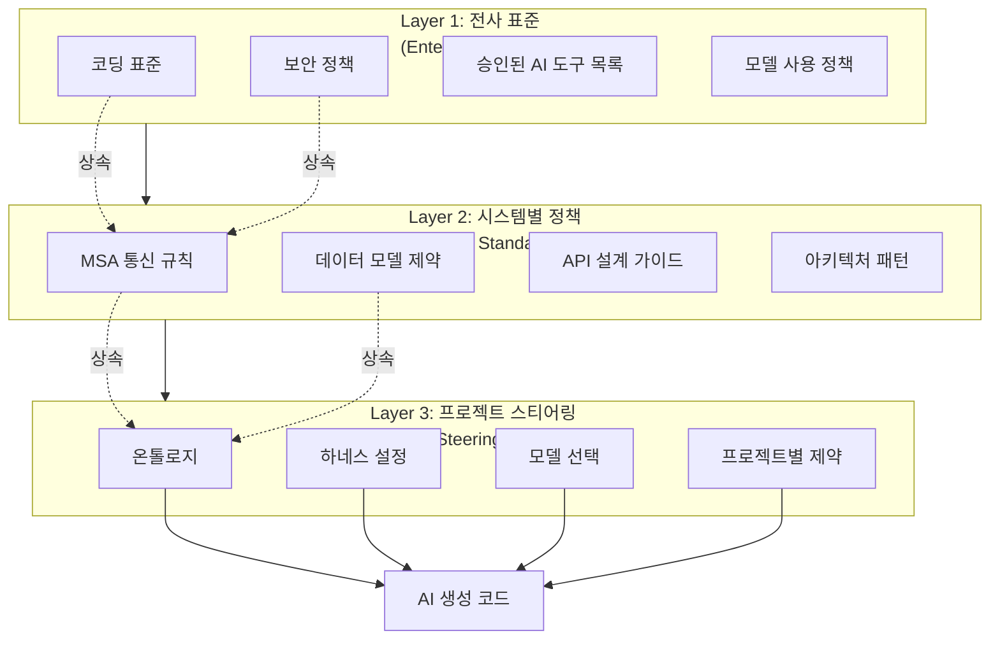
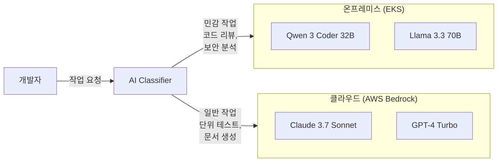

# 거버넌스 프레임워크

AIDLC가 전사로 확산될 때 AI 생성 코드의 품질, 보안, 컴플라이언스를 체계적으로 관리하는 거버넌스 프레임워크를 제시합니다.

## 거버넌스의 필요성

### AI 코딩 에이전트 확산의 과제

AI 코딩 에이전트가 개발 워크플로우의 핵심 도구가 되면서 조직은 새로운 거버넌스 과제에 직면합니다:

**품질 일관성 문제**
- 프로젝트마다 다른 프롬프트, 다른 품질 기준 적용
- 생성 코드의 품질이 프롬프트 작성자 역량에 의존
- 전사 코딩 표준 준수 여부를 자동 검증할 수단 부재

**보안 리스크 증가**
- AI가 생성한 코드의 보안 취약점 자동 탐지 필요
- 민감한 코드/데이터가 외부 AI 서비스로 유출될 위험
- 승인되지 않은 AI 도구의 무분별한 사용

**컴플라이언스 요구사항**
- AI 기본법(한국, 2026), EU AI Act 등 규제 대응 필요
- AI 생성 코드의 추적 가능성(traceability) 확보
- 감사(audit) 시 AI 사용 이력 제출 요구

**확장성 한계**
- 프로젝트별로 독립적인 AI 도구 도입 시 중복 투자
- 학습 성과가 조직 전체로 확산되지 않음
- 전사 표준과 프로젝트 특성 간 균형 필요

### 거버넌스 프레임워크의 역할

체계적인 거버넌스 프레임워크는 다음을 가능하게 합니다:

1. **자동화된 정책 적용**: 스티어링 파일을 통해 전사 표준을 자동 주입
2. **위험 최소화**: 데이터 주권 정책으로 민감 정보 보호
3. **규제 준수**: AI 기본법 등 법적 요구사항 체계적 대응
4. **지속적 개선**: 감사 추적 데이터 기반 정책 고도화

## 3층 거버넌스 모델

AIDLC는 전사-시스템-프로젝트 3층 거버넌스 모델을 채택합니다.



### Layer 1: 전사 표준 (Enterprise Policy)

모든 프로젝트에 공통 적용되는 최상위 정책입니다.

**코딩 표준**
- 언어별 스타일 가이드 (예: Google Java Style Guide)
- 네이밍 컨벤션, 주석 정책
- 코드 복잡도 상한선 (Cyclomatic Complexity ≤ 15)

**보안 정책**
- OWASP Top 10 취약점 금지 (SQL Injection, XSS 등)
- 인증/인가 구현 필수 패턴
- 민감 정보 로깅 금지
- 하드코딩된 자격 증명 금지

**승인된 AI 도구 목록**
- 사용 가능한 코딩 에이전트 (Aider, Continue, Cursor 등)
- 승인된 LLM 제공자 (AWS Bedrock, Azure OpenAI 등)
- 데이터 분류별 사용 가능 모델 매트릭스

**모델 사용 정책**
- 코드 생성: GPT-4.1 / Claude 4.6 Sonnet / Qwen 3 Coder
- 보안 리뷰: 온프레미스 오픈 웨이트 모델
- 문서 생성: GPT-4.1-mini 등 경량 모델

### Layer 2: 시스템별 정책 (System Architecture Standards)

특정 시스템이나 도메인의 아키텍처 패턴을 정의합니다.

**MSA 통신 규칙**
```yaml
# 예시: 마이크로서비스 아키텍처 표준
communication:
  sync: gRPC (internal), REST (external)
  async: Kafka (event-driven), SNS/SQS (cloud-native)
  circuit-breaker: Istio 기본 활성화
  timeout: 3초 (default), 30초 (batch)
```

**데이터 모델 제약**
- 도메인별 엔티티 정의 (주문, 결제, 배송 등)
- 필수 속성 (created_at, updated_at, tenant_id)
- 외래 키 네이밍 규칙

**API 설계 가이드**
- RESTful 리소스 네이밍 (/orders/\{orderId\}/items)
- HTTP 메서드 사용 (GET: 조회, POST: 생성, PUT/PATCH: 수정, DELETE: 삭제)
- 페이징 파라미터 (page, size, sort)
- 에러 응답 포맷 (RFC 9457 Problem Details)

**아키텍처 패턴**
- Repository 패턴 (데이터 액세스 계층)
- CQRS (읽기/쓰기 분리)
- Saga 패턴 (분산 트랜잭션)

### Layer 3: 프로젝트별 스티어링 (Project Steering Files)

프로젝트 고유의 AI 지시사항을 담는 스티어링 파일입니다.

**온톨로지**
- 프로젝트의 도메인 용어 사전
- 엔티티 간 관계 (예: Order → OrderItem → Product)
- 금지된 용어 (예: "slave" 대신 "replica" 사용)

[온톨로지](../methodology/ontology-engineering.md) 상세 참조.

**하네스 설정**
- Quality Gate 임계값 (코드 커버리지 ≥ 80%, 중복 코드 ≤ 3%)
- 필수 리뷰어 (시니어 개발자 1명 이상)
- 배포 승인 정책 (스테이징 → 프로덕션 단계적 배포)

[하네스](../methodology/harness-engineering.md) 상세 참조.

**모델 선택**
```yaml
# 예시: 프로젝트별 모델 라우팅
models:
  code_generation: Claude Sonnet 4.6  # 복잡한 비즈니스 로직
  code_review: qwen3-coder-32b-instruct         # 온프레미스 보안 리뷰
  test_generation: gpt-4o-mini                  # 단위 테스트 생성
  documentation: Claude Haiku 4.5      # API 문서 자동 생성
```

**프로젝트별 제약**
```yaml
# 예시: 레거시 연동 제약
legacy_integration:
  - 금지: JPA N+1 쿼리 (반드시 fetch join 사용)
  - 필수: 트랜잭션 타임아웃 5초 이내
  - 금지: 동기 HTTP 호출 (비동기 메시징 사용)
```

## 스티어링 파일 기반 거버넌스 자동화

### 스티어링 파일이란

스티어링 파일(Steering File)은 AI 코딩 에이전트에 주입되는 프로젝트별 제약 파일입니다.

**구조**
```
project-root/
  .aidlc/
    steering.yaml          # 프로젝트 스티어링 (Layer 3)
    system-standards.yaml  # 시스템 표준 상속 (Layer 2)
    enterprise-policy.yaml # 전사 표준 상속 (Layer 1)
  .aider/
    AIDLC-context.md       # Aider 전용 컨텍스트
  .continue/
    config.json            # Continue 전용 설정
  CLAUDE.md                # Claude Code 전용 지시사항
```

**steering.yaml 예시**
```yaml
project: order-management-service
version: 2.1.0

# Layer 1: 전사 표준 상속
inherits:
  - /enterprise/coding-standards/java-style-guide.yaml
  - /enterprise/security/owasp-top10-prevention.yaml

# Layer 2: 시스템 표준 상속
system_standards:
  - /systems/msa-communication-rules.yaml
  - /systems/data-model-constraints.yaml

# Layer 3: 프로젝트별 설정
ontology:
  domain: e-commerce
  entities:
    - Order: 주문 엔티티 (ID, customer, items, total, status)
    - OrderItem: 주문 항목 (ID, product, quantity, price)
  forbidden_terms:
    - master/slave → leader/follower
    - blacklist/whitelist → denylist/allowlist

harness:
  quality_gate:
    code_coverage: 80
    duplication: 3
    cognitive_complexity: 15
  mandatory_reviewers:
    - team: senior-backend
      min_approvals: 1

model_routing:
  code_generation: Claude Sonnet 4.6
  code_review: qwen3-coder-32b-instruct  # on-premises
  test_generation: gpt-4.1-mini

constraints:
  - no_jpa_n_plus_1_query
  - transaction_timeout_5s
  - async_messaging_only
```

### 멀티 LLM 스티어링

서로 다른 LLM 제공자에 맞춰 스티어링 형식을 최적화합니다.

**Claude Code (CLAUDE.md)**
```markdown
# Project Instructions

## Domain Model
- Order: 주문 엔티티
- OrderItem: 주문 항목

## Constraints
- JPA N+1 쿼리 금지 (반드시 fetch join 사용)
- 트랜잭션 타임아웃 5초 이내
```

**Aider (.aider/AIDLC-context.md)**
```markdown
# AIDLC Context

You are working on an e-commerce order management service.

## Key Entities
- Order, OrderItem, Product

## Rules
- Always use fetch join to prevent N+1 queries
- Transaction timeout: 5 seconds
```

**Continue (.continue/config.json)**
```json
{
  "systemMessage": "You are an AI assistant for order-management-service. Follow JPA N+1 prevention rules and 5-second transaction timeout.",
  "models": [
    {
      "title": "Claude 3.7 Sonnet",
      "provider": "anthropic",
      "model": "Claude Sonnet 4.6"
    }
  ]
}
```

### 거버넌스 as Code

스티어링 파일을 Git 저장소에서 관리하여 변경 이력을 추적하고 PR 리뷰를 적용합니다.

**Git 워크플로우**
```bash
# 스티어링 파일 수정
git checkout -b update-steering-file
vim .aidlc/steering.yaml

# 변경 사항 커밋
git add .aidlc/steering.yaml
git commit -m "feat: add async messaging constraint"

# PR 생성 → 시니어 개발자 리뷰 → 승인 후 병합
gh pr create --title "Update steering file with async messaging rule"
```

**자동 검증 CI/CD**
```yaml
# .github/workflows/steering-validation.yml
name: Validate Steering File
on: [pull_request]
jobs:
  validate:
    runs-on: ubuntu-latest
    steps:
      - uses: actions/checkout@v4
      - name: Validate steering.yaml schema
        run: |
          yamllint .aidlc/steering.yaml
          python scripts/validate-steering-schema.py
      - name: Check policy inheritance
        run: |
          python scripts/check-policy-inheritance.py
```

**버전 관리**
- 스티어링 파일에 `version` 필드 명시
- 호환되지 않는 변경 시 메이저 버전 증가
- AI 코딩 에이전트는 호환 버전만 사용

## 데이터 주권 & 레지던시

### 민감 코드/데이터 보호 요구사항

엔터프라이즈 환경에서 다음 데이터는 외부 AI 서비스로 전송할 수 없습니다:

- **소스 코드**: 핵심 비즈니스 로직, 알고리즘
- **데이터베이스 스키마**: 고객 정보, 금융 거래 구조
- **API 키/자격 증명**: 클라우드 리소스 접근 토큰
- **개인정보**: GDPR, PIPA 대상 데이터

### 하이브리드 모델 아키텍처

민감 작업은 온프레미스 오픈 웨이트 모델로, 일반 작업은 클라우드 API로 처리합니다.



**민감 작업 (온프레미스)**
- 코드 보안 리뷰 (SAST 결과 분석)
- 개인정보 포함 가능성이 있는 로그 분석
- 데이터베이스 마이그레이션 스크립트 생성

**일반 작업 (클라우드)**
- 단위 테스트 생성
- API 문서 자동 생성
- 리팩터링 제안 (민감 정보 제거 후)

### 데이터 분류 체계

조직의 데이터 분류 정책에 따라 AI 도구 사용을 제한합니다.

| 데이터 분류 | 정의 | 허용 AI 도구 | 예시 |
|------------|------|-------------|------|
| **공개** | 외부 공개 가능 | 모든 클라우드 AI | 오픈 소스 라이브러리 코드 |
| **내부** | 직원 공개 가능 | 클라우드 AI (데이터 처리 계약 체결 업체) | 내부 유틸리티 함수 |
| **기밀** | 특정 팀만 접근 | 온프레미스 오픈 웨이트 모델 | 비즈니스 로직, DB 스키마 |
| **극비** | 경영진/보안팀만 접근 | AI 사용 금지 (수동 개발) | 암호화 키, 인증 로직 |

**스티어링 파일 적용**
```yaml
data_classification:
  level: confidential  # 기밀
  allowed_models:
    - qwen3-coder-32b-instruct  # 온프레미스
    - llama-3-3-70b-instruct    # 온프레미스
  forbidden_models:
    - claude-*   # 클라우드 AI 금지
    - gpt-*      # 클라우드 AI 금지
```

### 레지던시 정책

데이터 레지던시 규제가 있는 국가(예: EU, 중국)에서는 데이터가 해당 지역을 벗어나지 않도록 보장합니다.

**지역별 모델 라우팅**
```yaml
# 예시: EU 프로젝트
region: eu-west-1
residency_policy:
  - 모든 AI 추론은 EU 리전에서 실행
  - 사용 가능 모델: AWS Bedrock eu-west-1, Azure OpenAI Europe
  - 사용 불가 모델: 미국 기반 API (OpenAI, Anthropic Direct)
```

## AI 기본법 컴플라이언스 (한국)

### 2026 AI 기본법 핵심 요구사항

한국의 인공지능 기본법(2026년 시행)은 다음을 요구합니다:

**투명성 (Transparency)**
- AI가 생성한 콘텐츠임을 명시
- 사용된 모델과 학습 데이터 출처 공개

**설명가능성 (Explainability)**
- AI 의사결정 과정 추적 가능
- 사용자 요청 시 설명 제공

**안전성 (Safety)**
- AI 시스템의 오작동 방지 메커니즘
- 지속적인 품질 모니터링

**책임 (Accountability)**
- AI 시스템 운영 주체 명확화
- 피해 발생 시 책임 소재 규정

### AIDLC에서의 대응

**투명성: AI 생성 코드 표시**
```python
# 코드 상단에 자동 주석 삽입
# AI-GENERATED: Claude 3.7 Sonnet (2026-04-07)
# PROMPT: "주문 생성 API 엔드포인트 구현"
# REVIEW: @senior-developer (2026-04-07)

@app.post("/orders")
def create_order(order: OrderCreate):
    # 생성된 코드...
```

**설명가능성: 의사결정 추적**
```yaml
# .aidlc/audit-log.yaml
- timestamp: 2026-04-07T10:30:00Z
  action: code_generation
  model: Claude Sonnet 4.6
  prompt: "주문 생성 API 엔드포인트 구현"
  input_files:
    - src/models/order.py
    - src/schemas/order.py
  output_file: src/api/orders.py
  reviewer: @senior-developer
  approved: true
```

**안전성: 하네스 기반 검증**
- Quality Gate에서 AI 생성 코드 자동 검증
- 보안 취약점 스캐너 (Bandit, Semgrep) 실행
- 코드 커버리지 임계값 미달 시 배포 차단

[하네스](../methodology/harness-engineering.md) 상세 참조.

**책임: 리뷰 프로세스 강제**
- AI 생성 코드는 반드시 시니어 개발자 리뷰 필수
- 리뷰 없는 코드는 자동 병합 불가
- 리뷰 이력을 감사 로그에 기록

### EU AI Act 대응

EU AI Act는 고위험 AI 시스템에 엄격한 규제를 적용합니다. 코드 생성 AI는 중위험으로 분류됩니다.

**요구사항**
- 위험 평가 문서 작성
- 기술 문서 유지 (모델 카드, 학습 데이터, 평가 결과)
- CE 마킹 (고위험 시스템)

**AIDLC 대응**
```yaml
# .aidlc/compliance/eu-ai-act.yaml
risk_assessment:
  category: limited-risk  # 중위험
  transparency_required: true
  documentation:
    - model-card-claude-3-7.pdf
    - risk-assessment-report.pdf
    - audit-log-2026-Q1.csv
```

## 감사 추적 & 보고

### AI 생성 코드의 감사 추적 체계

모든 AI 작업을 추적 가능하도록 로깅합니다.

**감사 로그 구조**
```json
{
  "timestamp": "2026-04-07T10:30:00Z",
  "user": "devfloor9",
  "action": "code_generation",
  "model": "Claude Sonnet 4.6",
  "prompt": "주문 생성 API 엔드포인트 구현",
  "input_files": ["src/models/order.py", "src/schemas/order.py"],
  "output_file": "src/api/orders.py",
  "lines_generated": 87,
  "reviewer": "@senior-developer",
  "review_status": "approved",
  "quality_gate": {
    "passed": true,
    "code_coverage": 85.3,
    "duplication": 2.1,
    "vulnerabilities": 0
  }
}
```

**로그 저장소**
- 로컬: `.aidlc/audit-log.jsonl` (Git에 커밋)
- 중앙: Elasticsearch / CloudWatch Logs
- 보관 기간: 최소 3년 (규제 요구사항)

### 품질 메트릭 대시보드

Grafana/Kibana로 AI 생성 코드 품질을 실시간 모니터링합니다.

**핵심 지표**
- **Quality Gate 통과율**: AI 생성 코드 중 품질 기준 통과 비율
- **보안 취약점 감지율**: SAST 스캐너가 탐지한 취약점 수
- **리뷰 소요 시간**: AI 생성 코드 리뷰에 걸린 평균 시간
- **재작업률**: 리뷰 후 수정이 필요한 비율
- **모델별 성능**: 모델별 코드 품질 비교

**대시보드 예시**
```yaml
# Grafana 대시보드
panels:
  - title: Quality Gate 통과율
    query: |
      SELECT 
        COUNT(CASE WHEN quality_gate.passed = true THEN 1 END) * 100.0 / COUNT(*) AS pass_rate
      FROM audit_log
      WHERE timestamp > now() - interval '30 days'
    target: 95%
  
  - title: 보안 취약점 트렌드
    query: |
      SELECT 
        date_trunc('day', timestamp) AS day,
        SUM(quality_gate.vulnerabilities) AS total_vulns
      FROM audit_log
      GROUP BY day
      ORDER BY day
  
  - title: 모델별 코드 품질
    query: |
      SELECT 
        model,
        AVG(quality_gate.code_coverage) AS avg_coverage,
        AVG(quality_gate.duplication) AS avg_duplication
      FROM audit_log
      GROUP BY model
```

### 주기적 보고

경영진/규제 기관에 제출할 보고서를 자동 생성합니다.

**월간 거버넌스 리포트**
- AI 코드 생성 건수
- Quality Gate 통과율
- 보안 취약점 감지 및 조치 현황
- 모델별 사용 통계
- 컴플라이언스 이슈 요약

**자동 생성 스크립트**
```python
# scripts/generate-governance-report.py
import json
from datetime import datetime, timedelta

def generate_monthly_report():
    logs = load_audit_logs(last_30_days=True)
    
    report = {
        "period": f"{datetime.now().strftime('%Y-%m')}",
        "total_generations": len(logs),
        "quality_gate_pass_rate": calculate_pass_rate(logs),
        "vulnerabilities_detected": sum(log["quality_gate"]["vulnerabilities"] for log in logs),
        "models_used": count_by_model(logs),
        "compliance_status": "COMPLIANT"
    }
    
    with open(f"reports/governance-{datetime.now().strftime('%Y-%m')}.json", "w") as f:
        json.dump(report, f, indent=2)

if __name__ == "__main__":
    generate_monthly_report()
```

## 거버넌스 도입 체크리스트

조직에 AIDLC 거버넌스를 단계적으로 도입하는 체크리스트입니다.

### Phase 1: 정책 수립 (2주)

- [ ] 전사 코딩 표준 문서화 (coding-standards.yaml)
- [ ] 보안 정책 정의 (security-policy.yaml)
- [ ] 승인된 AI 도구 목록 작성 (approved-tools.yaml)
- [ ] 데이터 분류 체계 수립 (공개/내부/기밀/극비)
- [ ] 스티어링 파일 스키마 설계 (steering.yaml template)

### Phase 2: 인프라 구축 (4주)

- [ ] 온프레미스 오픈 웨이트 모델 배포 (Qwen 3 Coder, Llama 3.3)
  - [오픈 웨이트](../toolchain/open-weight-models.md) 참조
- [ ] AI Classifier 구축 (민감/일반 작업 자동 분류)
- [ ] 감사 로그 저장소 구축 (Elasticsearch / S3)
- [ ] 품질 메트릭 대시보드 구축 (Grafana)
- [ ] CI/CD 파이프라인에 Quality Gate 통합

### Phase 3: 파일럿 프로젝트 (4주)

- [ ] 1개 프로젝트 선정 (중요도 중간, 팀 규모 5~10명)
- [ ] 프로젝트별 스티어링 파일 작성 (steering.yaml)
- [ ] 온톨로지 및 하네스 설정
- [ ] 개발자 교육 (스티어링 파일 작성법, AI 도구 사용법)
- [ ] 4주간 실행 후 피드백 수집

### Phase 4: 전사 확산 (12주)

- [ ] 파일럿 결과 분석 및 정책 개선
- [ ] 스티어링 파일 템플릿 배포
- [ ] 전사 개발자 교육 프로그램 실시
- [ ] 시스템별 표준 (Layer 2) 문서화
- [ ] 거버넌스 위원회 구성 (정책 유지보수)

### Phase 5: 지속적 개선 (진행 중)

- [ ] 월간 거버넌스 리포트 자동 생성
- [ ] 품질 메트릭 기반 정책 고도화
- [ ] 새로운 AI 도구 평가 및 승인 프로세스
- [ ] 규제 변화 모니터링 (AI 기본법, EU AI Act)
- [ ] 모델 성능 벤치마크 (분기별)

## 참고 자료

- [하네스](../methodology/harness-engineering.md): 자동화된 품질 검증 파이프라인
- [온톨로지](../methodology/ontology-engineering.md): 도메인 지식 구조화
- [오픈 웨이트](../toolchain/open-weight-models.md): 온프레미스 LLM 배포
- [도입 전략](./adoption-strategy.md): 조직별 AIDLC 도입 로드맵
