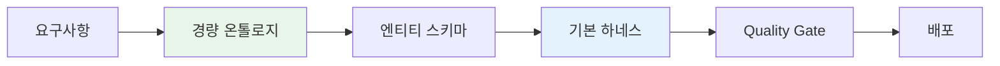
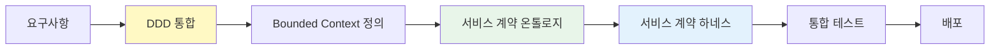
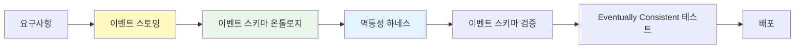
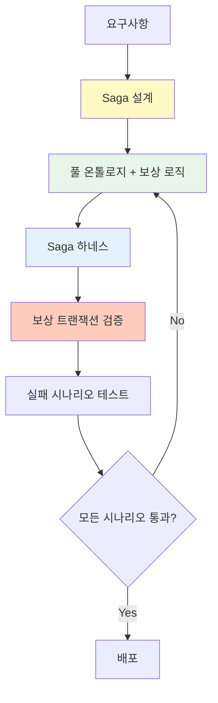
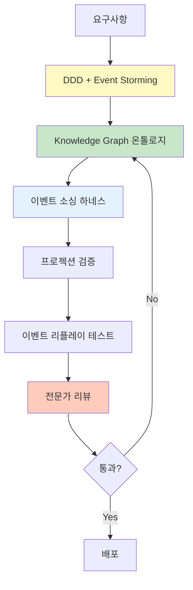
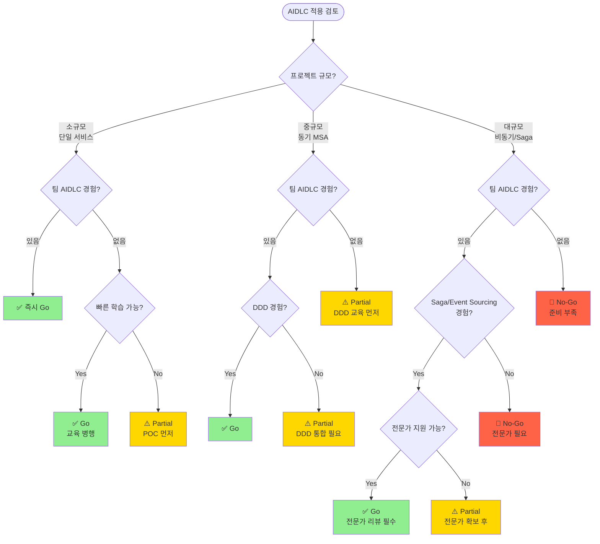

# MSA 복잡도 평가

AIDLC(AI-Driven Development Life Cycle)의 프로젝트 적합성을 평가하고, MSA 난이도에 따른 온톨로지·하네스 전략을 결정하는 가이드입니다.

## 왜 MSA 복잡도가 중요한가

### 단순 CRUD vs 복잡 MSA

AIDLC는 모든 프로젝트에 동일하게 적용되지 않습니다. 프로젝트의 기술 복잡도와 조직 준비도에 따라 적용 방법이 달라져야 합니다.

**단순 CRUD 프로젝트의 특징:**
- 단일 서비스, 단일 데이터베이스
- 동기식 요청-응답 패턴
- 명확한 트랜잭션 경계
- 롤백이 단순함 (DB 트랜잭션으로 충분)

**복잡 MSA 프로젝트의 특징:**
- 다수의 독립 서비스, 분산 데이터
- 비동기 이벤트 기반 통신
- 분산 트랜잭션 (Saga, 보상 트랜잭션)
- Eventually Consistent 데이터 모델
- 서비스 간 복잡한 의존성

### AIDLC 적용의 차이점

| 복잡도 | AIDLC 적용 방법 | 온톨로지 수준 | 하네스 수준 |
|--------|----------------|--------------|------------|
| **단순 CRUD** | 즉시 전면 적용 가능 | 경량 스키마 | 기본 Quality Gate |
| **동기 MSA** | DDD 통합 필수 | 표준 온톨로지 | 서비스 계약 검증 |
| **비동기 이벤트** | 이벤트 스키마 온톨로지 필수 | 풀 온톨로지 | 이벤트 스키마 + 멱등성 |
| **Saga/CQRS** | 풀 AIDLC + 전문가 필요 | Knowledge Graph | 보상 트랜잭션 검증 |

**핵심 원칙:**
- 복잡도가 높을수록 온톨로지와 하네스의 정교함이 중요
- 조직 준비도가 낮으면 단계적 도입 필요
- 기술 복잡도와 조직 준비도의 불균형은 프로젝트 실패 위험

## AIDLC 난이도 매트릭스

프로젝트의 **기술 복잡도**와 **조직 준비도**를 2축으로 평가하여 AIDLC 적용 전략을 결정합니다.

### 축 1: 기술 복잡도 (Technical Complexity)

| Level | 설명 | 특징 | 예시 |
|-------|------|------|------|
| **L1** | 단일 서비스 CRUD | - 단일 DB<br/>- 동기 API<br/>- 단순 트랜잭션 | 사용자 관리 서비스 |
| **L2** | 동기 MSA | - 다수 서비스<br/>- REST/gRPC 오케스트레이션<br/>- 분산 DB | 주문-재고-결제 MSA |
| **L3** | 비동기 이벤트 기반 | - 이벤트 버스<br/>- Eventually Consistent<br/>- 도메인 이벤트 | 이벤트 소싱 주문 시스템 |
| **L4** | Saga + 보상 트랜잭션 | - 분산 트랜잭션<br/>- 보상 로직<br/>- 오케스트레이션/코레오그래피 | 여행 예약 Saga |
| **L5** | 분산 트랜잭션 + CQRS + Event Sourcing | - 읽기/쓰기 분리<br/>- 이벤트 저장소<br/>- 복잡한 프로젝션 | 금융 거래 플랫폼 |

### 축 2: 조직 준비도 (Organizational Readiness)

| Level | 설명 | 특징 | 체크리스트 |
|-------|------|------|-----------|
| **A** | 챔피언 없음 | - AIDLC 경험 없음<br/>- DDD 경험 없음<br/>- 온톨로지 이해 없음 | ☐ AIDLC 교육 필요<br/>☐ POC 프로젝트 필요 |
| **B** | 챔피언 1명 | - 1명의 AIDLC 전문가<br/>- 팀 교육 필요<br/>- 가이드 의존 | ☐ 챔피언 역량 확인<br/>☐ 팀 온보딩 계획 |
| **C** | 팀 경험 | - 팀 내 AIDLC 경험자 다수<br/>- DDD 실전 경험<br/>- 온톨로지 설계 가능 | ☐ 팀 리뷰 프로세스<br/>☐ 베스트 프랙티스 공유 |
| **D** | 조직 표준 | - 조직 전체 AIDLC 표준<br/>- 온톨로지 재사용 라이브러리<br/>- 하네스 템플릿 | ☐ 조직 표준 문서<br/>☐ 재사용 가능 자산 |

### 난이도 매트릭스 (권장 적용 전략)

```mermaid
graph TB
    subgraph "난이도 매트릭스"
        style L1A fill:#90EE90
        style L1B fill:#90EE90
        style L1C fill:#90EE90
        style L1D fill:#90EE90
        
        style L2A fill:#FFD700
        style L2B fill:#90EE90
        style L2C fill:#90EE90
        style L2D fill:#90EE90
        
        style L3A fill:#FF6347
        style L3B fill:#FFD700
        style L3C fill:#90EE90
        style L3D fill:#90EE90
        
        style L4A fill:#FF0000
        style L4B fill:#FF6347
        style L4C fill:#FFD700
        style L4D fill:#90EE90
        
        style L5A fill:#FF0000
        style L5B fill:#FF0000
        style L5C fill:#FF6347
        style L5D fill:#FFD700
        
        L1A["L1-A<br/>🟢 즉시 가능"]
        L1B["L1-B<br/>🟢 즉시 가능"]
        L1C["L1-C<br/>🟢 즉시 가능"]
        L1D["L1-D<br/>🟢 즉시 가능"]
        
        L2A["L2-A<br/>🟡 POC 필요"]
        L2B["L2-B<br/>🟢 교육 후 가능"]
        L2C["L2-C<br/>🟢 즉시 가능"]
        L2D["L2-D<br/>🟢 즉시 가능"]
        
        L3A["L3-A<br/>🔴 리스크 높음"]
        L3B["L3-B<br/>🟡 전문가 필요"]
        L3C["L3-C<br/>🟢 팀 리뷰"]
        L3D["L3-D<br/>🟢 즉시 가능"]
        
        L4A["L4-A<br/>⛔ 권장 않음"]
        L4B["L4-B<br/>🔴 고위험"]
        L4C["L4-C<br/>🟡 신중히 진행"]
        L4D["L4-D<br/>🟢 가능"]
        
        L5A["L5-A<br/>⛔ 권장 않음"]
        L5B["L5-B<br/>⛔ 권장 않음"]
        L5C["L5-C<br/>🔴 전문가 필수"]
        L5D["L5-D<br/>🟡 신중히 진행"]
    end
```



**색상 해석:**
- 🟢 **녹색 (즉시 가능):** Full AIDLC 적용 권장
- 🟡 **노란색 (주의):** 단계적 도입 또는 전문가 지원 필요
- 🔴 **빨간색 (고위험):** 리스크 높음, 충분한 준비 후 진행
- ⛔ **빨간색 (권장 않음):** 조직 준비도 향상 후 재시도

## 패턴별 AIDLC 적용 가이드

### Level 1: 단순 서비스 CRUD

**특징:**
- 단일 서비스, 단일 데이터베이스
- REST API (CRUD 엔드포인트)
- 명확한 트랜잭션 경계
- 롤백이 단순 (DB 트랜잭션)

**AIDLC 적용 방법:**



**온톨로지 수준:**
- **경량 스키마:** 엔티티 정의, 속성, 기본 관계만
- YAML/JSON 스키마 파일
- 복잡한 도메인 모델링 불필요

**하네스 체크리스트:**
- ✅ API 계약 검증
- ✅ 데이터 검증 (입력/출력)
- ✅ 기본 단위 테스트
- ✅ 통합 테스트 (DB 포함)
- ⬜ 분산 트랜잭션 검증 (불필요)

**예시 온톨로지 (경량):**

```yaml
# ontology/user-service.yaml
entities:
  User:
    attributes:
      - id: string (UUID)
      - name: string
      - email: string (unique)
      - createdAt: timestamp
    invariants:
      - email must be valid format
      - name length 2-50 characters

  Role:
    attributes:
      - id: string
      - name: string
      - permissions: list<string>

relationships:
  - User hasMany Role
```

**적용 전략:**
- Full AIDLC 즉시 적용 가능
- Agent 기반 코드 생성 활용
- 온톨로지는 스키마 정의 수준으로 충분
- 하네스는 기본 Quality Gate로 시작

### Level 2: 동기 MSA 오케스트레이션

**특징:**
- 다수의 독립 서비스
- REST/gRPC 동기 호출
- 오케스트레이터 패턴 (주문 서비스가 재고/결제 호출)
- 분산 DB, 하지만 동기 트랜잭션

**AIDLC 적용 방법:**



**온톨로지 수준:**
- **표준 온톨로지:** 엔티티 + 관계 + 불변조건
- Bounded Context별 온톨로지 분리
- 서비스 간 계약 (API 스펙) 명시

**하네스 체크리스트:**
- ✅ 서비스 계약 검증 (OpenAPI/gRPC)
- ✅ 서비스 간 통합 테스트
- ✅ 타임아웃 + 재시도 정책
- ✅ 서킷 브레이커 검증
- ⬜ 보상 트랜잭션 (아직 불필요)

**예시 온톨로리 (서비스 계약):**

```yaml
# ontology/order-service.yaml
boundedContext: OrderManagement

entities:
  Order:
    attributes:
      - orderId: string
      - userId: string
      - items: list<OrderItem>
      - status: OrderStatus (PENDING, CONFIRMED, CANCELLED)
    invariants:
      - total amount must match sum of item prices
      - order must have at least 1 item

serviceContracts:
  - name: CreateOrder
    input: CreateOrderRequest
    output: OrderResponse
    dependencies:
      - InventoryService.checkStock
      - PaymentService.processPayment
    timeout: 5s
    retryPolicy: exponentialBackoff(3)
```

**적용 전략:**
- DDD 통합 필수 (Bounded Context 정의)
- 서비스 계약 온톨로지 명시
- 하네스에 타임아웃/재시도/서킷브레이커 추가
- Contract Testing 도입 (Pact, Spring Cloud Contract)

### Level 3: 비동기 이벤트 기반 MSA

**특징:**
- 이벤트 버스 (Kafka, RabbitMQ, EventBridge)
- Eventually Consistent 데이터 모델
- 도메인 이벤트 발행/구독
- 비동기 통신, 느슨한 결합

**AIDLC 적용 방법:**



**온톨로지 수준:**
- **풀 온톨로지:** 엔티티 + 관계 + 이벤트 스키마 + 불변조건
- 이벤트 계약 명시 (스키마 레지스트리)
- 이벤트 순서/의존성 정의

**하네스 체크리스트:**
- ✅ 이벤트 스키마 검증 (Avro, Protobuf)
- ✅ 멱등성 하네스 (중복 이벤트 처리)
- ✅ 이벤트 순서 검증
- ✅ Eventually Consistent 테스트 (Eventual 상태 검증)
- ✅ Dead Letter Queue 처리

**예시 온톨로지 (이벤트 스키마):**

```yaml
# ontology/order-events.yaml
events:
  OrderCreated:
    schema:
      orderId: string
      userId: string
      items: list<OrderItem>
      createdAt: timestamp
    producers:
      - OrderService
    consumers:
      - InventoryService (재고 차감)
      - NotificationService (알림 발송)
    idempotencyKey: orderId
    ordering: strict (orderId 기준)

  OrderConfirmed:
    schema:
      orderId: string
      confirmedAt: timestamp
    producers:
      - PaymentService
    consumers:
      - ShippingService
    idempotencyKey: orderId

invariants:
  - OrderCreated must precede OrderConfirmed
  - OrderCancelled cannot follow OrderShipped
```

**적용 전략:**
- 이벤트 스토밍으로 이벤트 정의
- 이벤트 스키마 온톨로지 필수
- 멱등성 하네스 (중복 이벤트 대응)
- 이벤트 스키마 레지스트리 (Schema Registry) 연동
- Eventual Consistency 테스트 자동화

### Level 4: Saga + 보상 트랜잭션

**특징:**
- 분산 트랜잭션 (Saga 패턴)
- 보상 트랜잭션 (Compensating Transaction)
- 오케스트레이션 Saga 또는 코레오그래피 Saga
- 복잡한 실패 시나리오

**AIDLC 적용 방법:**



**온톨로지 수준:**
- **풀 온톨로지 + Saga 명세:** 엔티티 + 이벤트 + Saga 단계 + 보상 로직
- Saga 단계별 상태 전이 정의
- 보상 로직 명시 (롤백 시나리오)

**하네스 체크리스트:**
- ✅ Saga 단계별 검증
- ✅ 보상 트랜잭션 검증 (롤백 시나리오)
- ✅ 타임아웃 하네스 (무한 대기 방지)
- ✅ 재시도 정책 검증
- ✅ 서킷 브레이커
- ✅ 분산 추적 (OpenTelemetry)

**예시 온톨로지 (Saga):**

```yaml
# ontology/travel-booking-saga.yaml
saga:
  name: TravelBookingSaga
  type: orchestration
  orchestrator: BookingService

  steps:
    - name: ReserveFlight
      service: FlightService
      action: reserveFlight
      compensation: cancelFlightReservation
      timeout: 10s
      retryPolicy: exponentialBackoff(3)

    - name: ReserveHotel
      service: HotelService
      action: reserveHotel
      compensation: cancelHotelReservation
      timeout: 10s
      retryPolicy: exponentialBackoff(3)

    - name: ChargePayment
      service: PaymentService
      action: chargeCard
      compensation: refundPayment
      timeout: 5s
      retryPolicy: none

  failureScenarios:
    - scenario: FlightReservationFailed
      compensations:
        - (none, 첫 단계 실패)
    
    - scenario: HotelReservationFailed
      compensations:
        - cancelFlightReservation
    
    - scenario: PaymentFailed
      compensations:
        - cancelHotelReservation
        - cancelFlightReservation

  invariants:
    - All compensations must be idempotent
    - Compensation order is reverse of execution order
    - Saga timeout = sum of step timeouts + buffer
```

**적용 전략:**
- Saga 설계 필수 (오케스트레이션 vs 코레오그래피)
- 보상 로직 온톨로지 명시
- 하네스에 보상 트랜잭션 검증 추가
- 실패 시나리오 전체 테스트 (Chaos Engineering)
- 전문가 리뷰 필수

### Level 5: 분산 트랜잭션 + CQRS + Event Sourcing

**특징:**
- 읽기/쓰기 분리 (CQRS)
- 이벤트 저장소 (Event Store)
- 복잡한 프로젝션 (Read Model)
- 이벤트 리플레이

**AIDLC 적용 방법:**



**온톨로지 수준:**
- **Knowledge Graph:** SemanticForge 패턴
- 이벤트 저장소 스키마
- 프로젝션 로직 명시
- 이벤트 버전 관리

**하네스 체크리스트:**
- ✅ 이벤트 스키마 검증 (버전 관리)
- ✅ 프로젝션 검증 (Read Model 일관성)
- ✅ 이벤트 리플레이 테스트
- ✅ Snapshot 전략 검증
- ✅ 이벤트 마이그레이션 하네스
- ✅ 멱등성 하네스
- ✅ 분산 추적

**예시 온톨로지 (Event Sourcing):**

```yaml
# ontology/banking-account.yaml
aggregateRoot: BankAccount

events:
  AccountOpened:
    version: v1
    schema:
      accountId: string
      customerId: string
      initialBalance: decimal
      openedAt: timestamp
  
  MoneyDeposited:
    version: v1
    schema:
      accountId: string
      amount: decimal
      transactionId: string
      depositedAt: timestamp
  
  MoneyWithdrawn:
    version: v1
    schema:
      accountId: string
      amount: decimal
      transactionId: string
      withdrawnAt: timestamp

eventStore:
  partitionKey: accountId
  snapshotStrategy: every 100 events
  retentionPolicy: 7 years

projections:
  AccountBalanceView:
    source: [AccountOpened, MoneyDeposited, MoneyWithdrawn]
    target: read_db.account_balance
    updateStrategy: eventually_consistent
  
  TransactionHistoryView:
    source: [MoneyDeposited, MoneyWithdrawn]
    target: read_db.transaction_history
    updateStrategy: eventually_consistent

invariants:
  - Balance cannot be negative
  - Events must be ordered by timestamp
  - TransactionId must be unique (idempotency)
```

**적용 전략:**
- DDD + Event Storming 필수
- Knowledge Graph 수준 온톨로지
- 이벤트 버전 관리 전략
- 프로젝션 로직 검증 자동화
- 이벤트 리플레이 테스트 필수
- 전문가 팀 구성 권장

## 온톨로지 깊이 가이드

복잡도별 권장 온톨로지 수준을 정리합니다.

### 레벨별 온톨로지 수준

| 복잡도 | 온톨로지 수준 | 포함 요소 | 예시 파일 |
|--------|--------------|-----------|----------|
| **L1** | 경량 스키마 | - 엔티티 정의<br/>- 속성<br/>- 기본 불변조건 | `ontology/user-schema.yaml` |
| **L2** | 표준 온톨로지 | - 엔티티 + 관계<br/>- 서비스 계약<br/>- Bounded Context | `ontology/order-service.yaml` |
| **L3** | 풀 온톨로지 | - 이벤트 스키마<br/>- 이벤트 순서<br/>- 멱등성 키 | `ontology/order-events.yaml` |
| **L4** | 풀 온톨로지 + Saga | - Saga 단계<br/>- 보상 로직<br/>- 실패 시나리오 | `ontology/booking-saga.yaml` |
| **L5** | Knowledge Graph | - 이벤트 저장소<br/>- 프로젝션<br/>- 이벤트 버전 관리 | `ontology/banking-kg.yaml` |

### 온톨로지 작성 가이드라인

#### Level 1-2: 경량~표준 온톨로지

**포커스:** 엔티티와 관계 정의

```yaml
# 엔티티 정의
entities:
  Order:
    attributes:
      - orderId: string
      - customerId: string
      - items: list<OrderItem>
    invariants:
      - orderId must be unique
      - items must not be empty

# 관계 정의
relationships:
  - Customer hasMany Order
  - Order hasMany OrderItem
```

**작성 원칙:**
- 명확한 엔티티 경계
- 필수 속성 명시
- 기본 불변조건 정의

#### Level 3-4: 풀 온톨로지 + Saga

**포커스:** 이벤트 스키마 + 보상 로직

```yaml
# 이벤트 계약
events:
  OrderCreated:
    schema: {...}
    producers: [OrderService]
    consumers: [InventoryService, NotificationService]
    idempotencyKey: orderId

# Saga 정의
saga:
  steps:
    - action: reserveInventory
      compensation: releaseInventory
      timeout: 5s
```

**작성 원칙:**
- 이벤트 계약 명시
- 보상 로직 정의
- 타임아웃/재시도 정책

#### Level 5: Knowledge Graph

**포커스:** 이벤트 소싱 + 프로젝션

```yaml
# 이벤트 저장소
eventStore:
  aggregateRoot: BankAccount
  snapshotStrategy: every 100 events

# 프로젝션
projections:
  AccountBalanceView:
    source: [AccountOpened, MoneyDeposited]
    target: read_db.account_balance
```

**작성 원칙:**
- 이벤트 버전 관리
- 프로젝션 로직 명시
- 이벤트 리플레이 전략

### SemanticForge 패턴 (L5 전용)

Level 5 프로젝트는 [온톨로지 엔지니어링](../methodology/ontology-engineering.md)의 SemanticForge 패턴을 적용합니다.

**핵심 특징:**
- 이벤트 = 도메인 지식의 원자 단위
- Knowledge Graph로 이벤트 간 관계 표현
- 프로젝션 = Knowledge Graph 쿼리

**참고:** [온톨로지 엔지니어링](../methodology/ontology-engineering.md)에서 세부 가이드 확인

## 하네스 체크리스트

패턴별 필수 하네스와 선택 하네스를 정리합니다.

### 패턴별 필수 하네스

| 패턴 | 필수 하네스 | 선택 하네스 | 우선순위 |
|------|-----------|-----------|---------|
| **L1: CRUD** | - API 계약 검증<br/>- 기본 단위 테스트<br/>- 통합 테스트 | - 성능 테스트<br/>- 보안 스캔 | P0 |
| **L2: 동기 MSA** | - 서비스 계약 검증<br/>- 타임아웃/재시도<br/>- 서킷 브레이커<br/>- Contract Testing | - 카오스 엔지니어링<br/>- 부하 테스트 | P1 |
| **L3: 비동기 이벤트** | - 이벤트 스키마 검증<br/>- 멱등성 하네스<br/>- 이벤트 순서 검증<br/>- Eventually Consistent 테스트 | - 이벤트 리플레이<br/>- Dead Letter Queue | P1 |
| **L4: Saga** | - Saga 단계 검증<br/>- 보상 트랜잭션 검증<br/>- 실패 시나리오 테스트<br/>- 타임아웃 하네스 | - 분산 추적<br/>- 카오스 엔지니어링 | P0 |
| **L5: Event Sourcing** | - 이벤트 스키마 검증<br/>- 프로젝션 검증<br/>- 이벤트 리플레이<br/>- 이벤트 마이그레이션 | - Snapshot 전략<br/>- 성능 테스트 | P0 |

### 하네스 구현 예시

#### 멱등성 하네스 (L3+)

```python
# harness/idempotency_test.py
def test_duplicate_event_handling():
    """동일 이벤트를 여러 번 받아도 결과가 동일한지 검증"""
    event = OrderCreatedEvent(orderId="123", ...)
    
    # 첫 번째 처리
    result1 = event_handler.handle(event)
    state1 = get_order_state("123")
    
    # 두 번째 처리 (중복)
    result2 = event_handler.handle(event)
    state2 = get_order_state("123")
    
    # 결과가 동일해야 함
    assert result1 == result2
    assert state1 == state2
```

#### 보상 트랜잭션 하네스 (L4+)

```python
# harness/saga_compensation_test.py
def test_saga_compensation():
    """Saga 실패 시 보상 로직이 정확히 동작하는지 검증"""
    saga = TravelBookingSaga()
    
    # 1. Flight 예약 성공
    saga.execute_step("ReserveFlight")
    assert flight_service.is_reserved("flight123")
    
    # 2. Hotel 예약 성공
    saga.execute_step("ReserveHotel")
    assert hotel_service.is_reserved("hotel456")
    
    # 3. Payment 실패 시뮬레이션
    with pytest.raises(PaymentFailedException):
        saga.execute_step("ChargePayment")
    
    # 4. 보상 트랜잭션 검증
    saga.compensate()
    assert not hotel_service.is_reserved("hotel456")  # 취소됨
    assert not flight_service.is_reserved("flight123")  # 취소됨
```

#### 프로젝션 검증 하네스 (L5)

```python
# harness/projection_test.py
def test_projection_consistency():
    """이벤트 소싱 프로젝션이 정확한지 검증"""
    # 1. 이벤트 생성
    events = [
        AccountOpenedEvent(accountId="A1", balance=1000),
        MoneyDepositedEvent(accountId="A1", amount=500),
        MoneyWithdrawnEvent(accountId="A1", amount=200),
    ]
    
    # 2. 이벤트 저장
    for event in events:
        event_store.append(event)
    
    # 3. 프로젝션 업데이트
    projection_service.rebuild("AccountBalanceView")
    
    # 4. Read Model 검증
    balance_view = read_db.get_account_balance("A1")
    assert balance_view.balance == 1300  # 1000 + 500 - 200
    assert balance_view.version == 3
```

### 하네스 우선순위 가이드

**P0 (필수):**
- 프로젝트 실패 시 데이터 손실 또는 심각한 비즈니스 영향
- 예: 보상 트랜잭션 검증, 이벤트 스키마 검증

**P1 (강력 권장):**
- 프로젝트 실패 시 서비스 장애 또는 사용자 경험 저하
- 예: 타임아웃/재시도, 멱등성 검증

**P2 (선택):**
- 품질 향상 또는 운영 편의성
- 예: 성능 테스트, 카오스 엔지니어링

## Go/No-Go 의사결정 트리

프로젝트에 AIDLC를 적용할지 결정하는 플로우차트입니다.



### 의사결정 기준

#### ✅ Go (즉시 진행)

**조건:**
- 기술 복잡도 ≤ L3 AND 조직 준비도 ≥ B
- 또는 기술 복잡도 = L4-5 AND 조직 준비도 ≥ C AND 전문가 지원 가능

**액션:**
- Full AIDLC 적용
- 온톨로지/하네스 작성
- 에이전트 기반 코드 생성

#### ⚠️ Partial (단계적 진행)

**조건:**
- 기술 복잡도 ≤ L2 AND 조직 준비도 = A
- 또는 기술 복잡도 = L3 AND 조직 준비도 ≤ B
- 또는 기술 복잡도 ≥ L4 AND 전문가 없음

**액션:**
- POC 프로젝트 먼저 진행
- 교육 프로그램 이수
- 전문가 지원 확보
- 단계적 AIDLC 도입

#### 🛑 No-Go (진행 불가)

**조건:**
- 기술 복잡도 ≥ L4 AND 조직 준비도 ≤ A
- 또는 기술 복잡도 = L5 AND 조직 준비도 ≤ B

**액션:**
- 조직 준비도 향상 (교육, POC)
- 전문가 채용 또는 컨설팅
- 준비 완료 후 재평가

### 리스크 평가 매트릭스

| 리스크 요인 | 높음 🔴 | 중간 🟡 | 낮음 🟢 |
|-----------|---------|---------|---------|
| **기술 복잡도** | L4-5 | L2-3 | L1 |
| **조직 준비도** | A (경험 없음) | B-C (일부 경험) | D (조직 표준) |
| **데이터 민감도** | 금융, 의료 | 개인정보 | 비민감 |
| **프로젝트 규모** | 20+ 서비스 | 5-20 서비스 | 1-5 서비스 |
| **일정 압박** | 3개월 이내 | 3-6개월 | 6개월 이상 |

**총합 리스크 판단:**
- 🔴 3개 이상: No-Go
- 🔴 1-2개: Partial (단계적 진행)
- 🔴 0개: Go

## 검증 방법론

복잡 MSA에서 AIDLC 적용 시 품질을 보장하는 방법입니다.

### 검증 체크리스트

#### 온톨로지 검증

- [ ] **완전성:** 모든 엔티티/이벤트가 온톨로지에 정의되어 있는가?
- [ ] **일관성:** Bounded Context 간 온톨로지가 일관된가?
- [ ] **정확성:** 불변조건이 비즈니스 규칙과 일치하는가?
- [ ] **추적성:** 온톨로지와 코드가 동기화되어 있는가?

#### 하네스 검증

- [ ] **커버리지:** 모든 필수 하네스가 구현되어 있는가?
- [ ] **자동화:** 하네스가 CI/CD에 통합되어 있는가?
- [ ] **실패 시나리오:** 모든 실패 시나리오를 테스트하는가?
- [ ] **성능:** 하네스 실행 시간이 합리적인가?

#### 배포 검증

- [ ] **Canary 배포:** 점진적 롤아웃 전략이 있는가?
- [ ] **롤백 계획:** 문제 발생 시 롤백 가능한가?
- [ ] **모니터링:** 배포 후 실시간 모니터링 가능한가?
- [ ] **경보:** 이상 징후 탐지 경보가 설정되어 있는가?

### 검증 자동화

**CI/CD 파이프라인:**

```yaml
# .github/workflows/aidlc-validation.yml
name: AIDLC Validation

on: [push, pull_request]

jobs:
  validate-ontology:
    runs-on: ubuntu-latest
    steps:
      - uses: actions/checkout@v2
      - name: Validate Ontology
        run: |
          aidlc-cli validate-ontology --path ontology/
  
  run-harness:
    runs-on: ubuntu-latest
    steps:
      - uses: actions/checkout@v2
      - name: Run Harness Tests
        run: |
          aidlc-cli run-harness --suite saga
          aidlc-cli run-harness --suite idempotency
  
  quality-gate:
    runs-on: ubuntu-latest
    needs: [validate-ontology, run-harness]
    steps:
      - name: Check Quality Gate
        run: |
          aidlc-cli quality-gate --threshold 80
```

### 전문가 리뷰

**복잡도 L4-5는 전문가 리뷰 필수:**

**리뷰 체크리스트:**
- [ ] Saga 설계가 적절한가?
- [ ] 보상 로직이 모든 실패 시나리오를 커버하는가?
- [ ] 이벤트 스키마 버전 관리 전략이 있는가?
- [ ] 프로젝션 로직이 정확한가?
- [ ] 성능/확장성 고려사항이 반영되어 있는가?

## 다음 단계

- [DDD 통합](../methodology/ddd-integration.md): Domain-Driven Design과 AIDLC 통합 방법
- [온톨로지 엔지니어링](../methodology/ontology-engineering.md): 온톨로지 설계 세부 가이드
- [하네스 엔지니어링](../methodology/harness-engineering.md): 하네스 구현 베스트 프랙티스
- [도입 전략](./adoption-strategy.md): 조직 전체 AIDLC 도입 로드맵

## 참고 자료

- [MSA 패턴 카탈로그](https://microservices.io/patterns/)
- [Saga 패턴 가이드](https://microservices.io/patterns/data/saga.html)
- [Event Sourcing 패턴](https://martinfowler.com/eaaDev/EventSourcing.html)
- [CQRS 패턴](https://martinfowler.com/bliki/CQRS.html)
