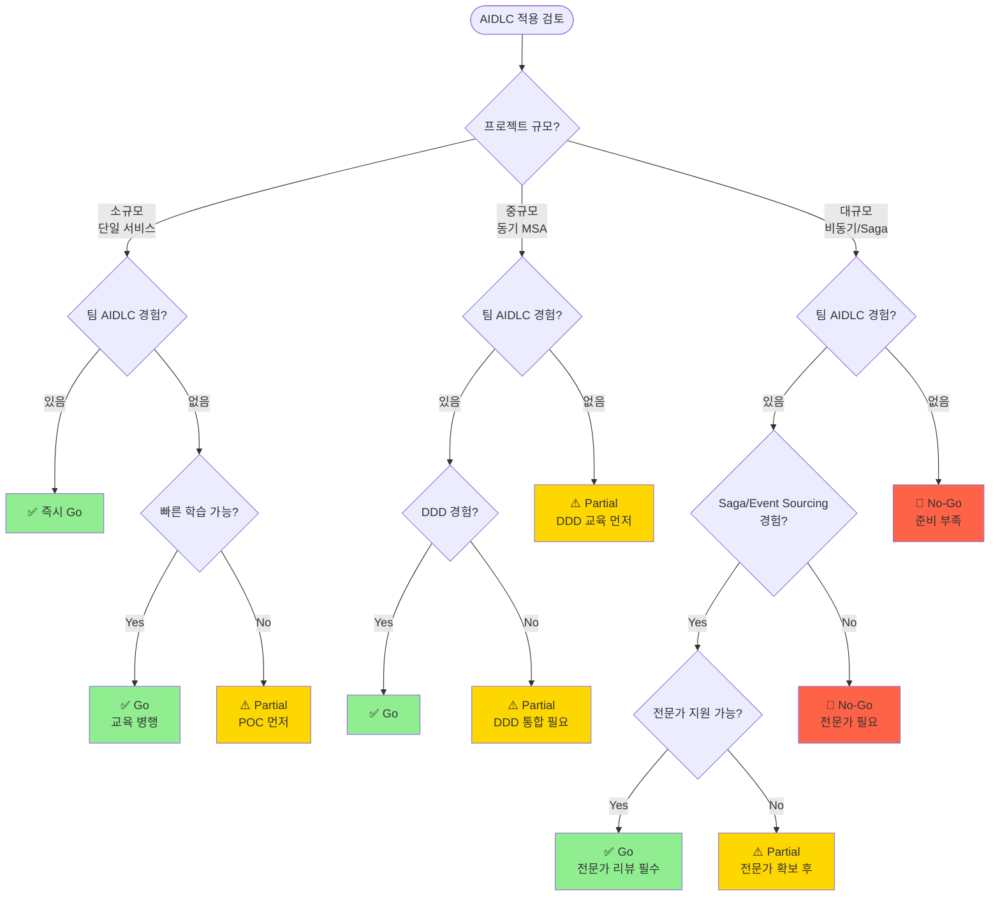

# MSA 복잡도 가이드

AIDLC(AI-Driven Development Life Cycle)의 프로젝트 적합성을 평가하고, MSA 난이도에 따른 온톨로지·하네스 전략을 결정하는 가이드입니다.

## 왜 MSA 복잡도가 중요한가

### 단순 CRUD vs 복잡 MSA

AIDLC는 모든 프로젝트에 동일하게 적용되지 않습니다. 프로젝트의 기술 복잡도와 조직 준비도에 따라 적용 방법이 달라져야 합니다.

**단순 CRUD 프로젝트의 특징:**
- 단일 서비스, 단일 데이터베이스
- 동기식 요청-응답 패턴
- 명확한 트랜잭션 경계
- 롤백이 단순함 (DB 트랜잭션으로 충분)

**복잡 MSA 프로젝트의 특징:**
- 다수의 독립 서비스, 분산 데이터
- 비동기 이벤트 기반 통신
- 분산 트랜잭션 (Saga, 보상 트랜잭션)
- Eventually Consistent 데이터 모델
- 서비스 간 복잡한 의존성

### AIDLC 적용의 차이점

| 복잡도 | AIDLC 적용 방법 | 온톨로지 수준 | 하네스 수준 |
|--------|----------------|--------------|------------|
| **단순 CRUD** | 즉시 전면 적용 가능 | 경량 스키마 | 기본 Quality Gate |
| **동기 MSA** | DDD 통합 필수 | 표준 온톨로지 | 서비스 계약 검증 |
| **비동기 이벤트** | 이벤트 스키마 온톨로지 필수 | 풀 온톨로지 | 이벤트 스키마 + 멱등성 |
| **Saga/CQRS** | 풀 AIDLC + 전문가 필요 | Knowledge Graph | 보상 트랜잭션 검증 |

**핵심 원칙:**
- 복잡도가 높을수록 온톨로지와 하네스의 정교함이 중요
- 조직 준비도가 낮으면 단계적 도입 필요
- 기술 복잡도와 조직 준비도의 불균형은 프로젝트 실패 위험

## AIDLC 난이도 매트릭스

프로젝트의 **기술 복잡도**와 **조직 준비도**를 2축으로 평가하여 AIDLC 적용 전략을 결정합니다.

### 축 1: 기술 복잡도 (Technical Complexity)

| Level | 설명 | 특징 | 예시 |
|-------|------|------|------|
| **L1** | 단일 서비스 CRUD | - 단일 DB - 동기 API - 단순 트랜잭션 | 사용자 관리 서비스 |
| **L2** | 동기 MSA | - 다수 서비스 - REST/gRPC 오케스트레이션 - 분산 DB | 주문-재고-결제 MSA |
| **L3** | 비동기 이벤트 기반 | - 이벤트 버스 - Eventually Consistent - 도메인 이벤트 | 이벤트 소싱 주문 시스템 |
| **L4** | Saga + 보상 트랜잭션 | - 분산 트랜잭션 - 보상 로직 - 오케스트레이션/코레오그래피 | 여행 예약 Saga |
| **L5** | 분산 트랜잭션 + CQRS + Event Sourcing | - 읽기/쓰기 분리 - 이벤트 저장소 - 복잡한 프로젝션 | 금융 거래 플랫폼 |

### 축 2: 조직 준비도 (Organizational Readiness)

| Level | 설명 | 특징 | 체크리스트 |
|-------|------|------|-----------|
| **A** | 챔피언 없음 | - AIDLC 경험 없음 - DDD 경험 없음 - 온톨로지 이해 없음 | ☐ AIDLC 교육 필요 ☐ POC 프로젝트 필요 |
| **B** | 챔피언 1명 | - 1명의 AIDLC 전문가 - 팀 교육 필요 - 가이드 의존 | ☐ 챔피언 역량 확인 ☐ 팀 온보딩 계획 |
| **C** | 팀 경험 | - 팀 내 AIDLC 경험자 다수 - DDD 실전 경험 - 온톨로지 설계 가능 | ☐ 팀 리뷰 프로세스 ☐ 베스트 프랙티스 공유 |
| **D** | 조직 표준 | - 조직 전체 AIDLC 표준 - 온톨로지 재사용 라이브러리 - 하네스 템플릿 | ☐ 조직 표준 문서 ☐ 재사용 가능 자산 |

### 난이도 매트릭스 (권장 적용 전략)

```mermaid
graph TB
    subgraph "난이도 매트릭스"
        style L1A fill:#90EE90
        style L1B fill:#90EE90
        style L1C fill:#90EE90
        style L1D fill:#90EE90
        
        style L2A fill:#FFD700
        style L2B fill:#90EE90
        style L2C fill:#90EE90
        style L2D fill:#90EE90
        
        style L3A fill:#FF6347
        style L3B fill:#FFD700
        style L3C fill:#90EE90
        style L3D fill:#90EE90
        
        style L4A fill:#FF0000
        style L4B fill:#FF6347
        style L4C fill:#FFD700
        style L4D fill:#90EE90
        
        style L5A fill:#FF0000
        style L5B fill:#FF0000
        style L5C fill:#FF6347
        style L5D fill:#FFD700
        
        L1A["L1-A<br/>🟢 즉시 가능"]
        L1B["L1-B<br/>🟢 즉시 가능"]
        L1C["L1-C<br/>🟢 즉시 가능"]
        L1D["L1-D<br/>🟢 즉시 가능"]
        
        L2A["L2-A<br/>🟡 POC 필요"]
        L2B["L2-B<br/>🟢 교육 후 가능"]
        L2C["L2-C<br/>🟢 즉시 가능"]
        L2D["L2-D<br/>🟢 즉시 가능"]
        
        L3A["L3-A<br/>🔴 리스크 높음"]
        L3B["L3-B<br/>🟡 전문가 필요"]
        L3C["L3-C<br/>🟢 팀 리뷰"]
        L3D["L3-D<br/>🟢 즉시 가능"]
        
        L4A["L4-A<br/>⛔ 권장 않음"]
        L4B["L4-B<br/>🔴 고위험"]
        L4C["L4-C<br/>🟡 신중히 진행"]
        L4D["L4-D<br/>🟢 가능"]
        
        L5A["L5-A<br/>⛔ 권장 않음"]
        L5B["L5-B<br/>⛔ 권장 않음"]
        L5C["L5-C<br/>🔴 전문가 필수"]
        L5D["L5-D<br/>🟡 신중히 진행"]
    end
```

**색상 해석:**
- 🟢 **녹색 (즉시 가능):** Full AIDLC 적용 권장
- 🟡 **노란색 (주의):** 단계적 도입 또는 전문가 지원 필요
- 🔴 **빨간색 (고위험):** 리스크 높음, 충분한 준비 후 진행
- ⛔ **빨간색 (권장 않음):** 조직 준비도 향상 후 재시도

## Go/No-Go 의사결정 트리

프로젝트에 AIDLC를 적용할지 결정하는 플로우차트입니다.

### 의사결정 기준

#### ✅ Go (즉시 진행)

**조건:**
- 기술 복잡도 ≤ L3 AND 조직 준비도 ≥ B
- 또는 기술 복잡도 = L4-5 AND 조직 준비도 ≥ C AND 전문가 지원 가능

**액션:**
- Full AIDLC 적용
- 온톨로지/하네스 작성
- 에이전트 기반 코드 생성

#### ⚠️ Partial (단계적 진행)

**조건:**
- 기술 복잡도 ≤ L2 AND 조직 준비도 = A
- 또는 기술 복잡도 = L3 AND 조직 준비도 ≤ B
- 또는 기술 복잡도 ≥ L4 AND 전문가 없음

**액션:**
- POC 프로젝트 먼저 진행
- 교육 프로그램 이수
- 전문가 지원 확보
- 단계적 AIDLC 도입

#### 🛑 No-Go (진행 불가)

**조건:**
- 기술 복잡도 ≥ L4 AND 조직 준비도 ≤ A
- 또는 기술 복잡도 = L5 AND 조직 준비도 ≤ B

**액션:**
- 조직 준비도 향상 (교육, POC)
- 전문가 채용 또는 컨설팅
- 준비 완료 후 재평가

### 리스크 평가 매트릭스

| 리스크 요인 | 높음 🔴 | 중간 🟡 | 낮음 🟢 |
|-----------|---------|---------|---------|
| **기술 복잡도** | L4-5 | L2-3 | L1 |
| **조직 준비도** | A (경험 없음) | B-C (일부 경험) | D (조직 표준) |
| **데이터 민감도** | 금융, 의료 | 개인정보 | 비민감 |
| **프로젝트 규모** | 20+ 서비스 | 5-20 서비스 | 1-5 서비스 |
| **일정 압박** | 3개월 이내 | 3-6개월 | 6개월 이상 |

**총합 리스크 판단:**
- 🔴 3개 이상: No-Go
- 🔴 1-2개: Partial (단계적 진행)
- 🔴 0개: Go

## 세부 가이드

import DocCardList from '@theme/DocCardList';

<DocCardList />

## 다음 단계

- [DDD 통합](../../methodology/ddd-integration.md): Domain-Driven Design과 AIDLC 통합 방법
- [온톨로지 엔지니어링](../../methodology/ontology-engineering.md): 온톨로지 설계 세부 가이드
- [하네스 엔지니어링](../../methodology/harness-engineering.md): 하네스 구현 베스트 프랙티스
- [도입 전략](../adoption-strategy.md): 조직 전체 AIDLC 도입 로드맵

## 참고 자료

- [MSA 패턴 카탈로그](https://microservices.io/patterns/)
- [Saga 패턴 가이드](https://microservices.io/patterns/data/saga.html)
- [Event Sourcing 패턴](https://martinfowler.com/eaaDev/EventSourcing.html)
- [CQRS 패턴](https://martinfowler.com/bliki/CQRS.html)
