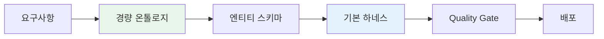
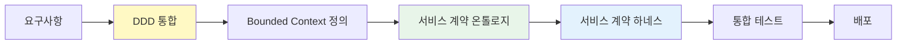

# Level 1-2: 단순 CRUD & 동기 MSA

단순 서비스부터 동기 MSA까지, 상대적으로 낮은 복잡도의 AIDLC 적용 가이드입니다.

## Level 1: 단순 서비스 CRUD

**특징:**
- 단일 서비스, 단일 데이터베이스
- REST API (CRUD 엔드포인트)
- 명확한 트랜잭션 경계
- 롤백이 단순 (DB 트랜잭션)

**AIDLC 적용 방법:**



### 온톨로지 수준

**경량 스키마:** 엔티티 정의, 속성, 기본 관계만
- YAML/JSON 스키마 파일
- 복잡한 도메인 모델링 불필요

**예시 온톨로지:**

```yaml
# ontology/user-service.yaml
entities:
  User:
    attributes:
      - id: string (UUID)
      - name: string
      - email: string (unique)
      - createdAt: timestamp
    invariants:
      - email must be valid format
      - name length 2-50 characters

  Role:
    attributes:
      - id: string
      - name: string
      - permissions: list<string>

relationships:
  - User hasMany Role
```

### 하네스 체크리스트

- ✅ API 계약 검증
- ✅ 데이터 검증 (입력/출력)
- ✅ 기본 단위 테스트
- ✅ 통합 테스트 (DB 포함)
- ⬜ 분산 트랜잭션 검증 (불필요)

### 적용 전략

- Full AIDLC 즉시 적용 가능
- Agent 기반 코드 생성 활용
- 온톨로지는 스키마 정의 수준으로 충분
- 하네스는 기본 Quality Gate로 시작

## Level 2: 동기 MSA 오케스트레이션

**특징:**
- 다수의 독립 서비스
- REST/gRPC 동기 호출
- 오케스트레이터 패턴 (주문 서비스가 재고/결제 호출)
- 분산 DB, 하지만 동기 트랜잭션

**AIDLC 적용 방법:**



### 온톨로지 수준

**표준 온톨로지:** 엔티티 + 관계 + 불변조건
- Bounded Context별 온톨로지 분리
- 서비스 간 계약 (API 스펙) 명시

**예시 온톨로지 (서비스 계약):**

```yaml
# ontology/order-service.yaml
boundedContext: OrderManagement

entities:
  Order:
    attributes:
      - orderId: string
      - userId: string
      - items: list<OrderItem>
      - status: OrderStatus (PENDING, CONFIRMED, CANCELLED)
    invariants:
      - total amount must match sum of item prices
      - order must have at least 1 item

serviceContracts:
  - name: CreateOrder
    input: CreateOrderRequest
    output: OrderResponse
    dependencies:
      - InventoryService.checkStock
      - PaymentService.processPayment
    timeout: 5s
    retryPolicy: exponentialBackoff(3)
```

### 하네스 체크리스트

- ✅ 서비스 계약 검증 (OpenAPI/gRPC)
- ✅ 서비스 간 통합 테스트
- ✅ 타임아웃 + 재시도 정책
- ✅ 서킷 브레이커 검증
- ⬜ 보상 트랜잭션 (아직 불필요)

### 적용 전략

- DDD 통합 필수 (Bounded Context 정의)
- 서비스 계약 온톨로지 명시
- 하네스에 타임아웃/재시도/서킷브레이커 추가
- Contract Testing 도입 (Pact, Spring Cloud Contract)

## 다음 단계

더 복잡한 비동기 패턴과 Saga 패턴을 다루는 가이드:

- [Level 3-4: 비동기 이벤트 & Saga](./l3-l4-async-saga.md)
- [Level 5: Event Sourcing](./l5-event-sourcing.md)
