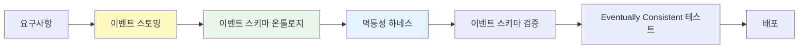
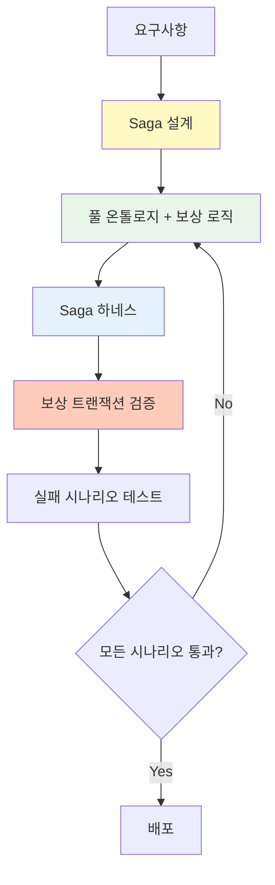

# Level 3-4: 비동기 이벤트 & Saga

이벤트 기반 아키텍처와 분산 트랜잭션을 다루는 중급~고급 복잡도 패턴입니다.

## Level 3: 비동기 이벤트 기반 MSA

**특징:**
- 이벤트 버스 (Kafka, RabbitMQ, EventBridge)
- Eventually Consistent 데이터 모델
- 도메인 이벤트 발행/구독
- 비동기 통신, 느슨한 결합

**AIDLC 적용 방법:**



### 온톨로지 수준

**풀 온톨로지:** 엔티티 + 관계 + 이벤트 스키마 + 불변조건
- 이벤트 계약 명시 (스키마 레지스트리)
- 이벤트 순서/의존성 정의

**예시 온톨로지 (이벤트 스키마):**

```yaml
# ontology/order-events.yaml
events:
  OrderCreated:
    schema:
      orderId: string
      userId: string
      items: list<OrderItem>
      createdAt: timestamp
    producers:
      - OrderService
    consumers:
      - InventoryService (재고 차감)
      - NotificationService (알림 발송)
    idempotencyKey: orderId
    ordering: strict (orderId 기준)

  OrderConfirmed:
    schema:
      orderId: string
      confirmedAt: timestamp
    producers:
      - PaymentService
    consumers:
      - ShippingService
    idempotencyKey: orderId

invariants:
  - OrderCreated must precede OrderConfirmed
  - OrderCancelled cannot follow OrderShipped
```

### 하네스 체크리스트

- ✅ 이벤트 스키마 검증 (Avro, Protobuf)
- ✅ 멱등성 하네스 (중복 이벤트 처리)
- ✅ 이벤트 순서 검증
- ✅ Eventually Consistent 테스트 (Eventual 상태 검증)
- ✅ Dead Letter Queue 처리

### 적용 전략

- 이벤트 스토밍으로 이벤트 정의
- 이벤트 스키마 온톨로지 필수
- 멱등성 하네스 (중복 이벤트 대응)
- 이벤트 스키마 레지스트리 (Schema Registry) 연동
- Eventual Consistency 테스트 자동화

## Level 4: Saga + 보상 트랜잭션

**특징:**
- 분산 트랜잭션 (Saga 패턴)
- 보상 트랜잭션 (Compensating Transaction)
- 오케스트레이션 Saga 또는 코레오그래피 Saga
- 복잡한 실패 시나리오

**AIDLC 적용 방법:**



### 온톨로지 수준

**풀 온톨로지 + Saga 명세:** 엔티티 + 이벤트 + Saga 단계 + 보상 로직
- Saga 단계별 상태 전이 정의
- 보상 로직 명시 (롤백 시나리오)

**예시 온톨로지 (Saga):**

```yaml
# ontology/travel-booking-saga.yaml
saga:
  name: TravelBookingSaga
  type: orchestration
  orchestrator: BookingService

  steps:
    - name: ReserveFlight
      service: FlightService
      action: reserveFlight
      compensation: cancelFlightReservation
      timeout: 10s
      retryPolicy: exponentialBackoff(3)

    - name: ReserveHotel
      service: HotelService
      action: reserveHotel
      compensation: cancelHotelReservation
      timeout: 10s
      retryPolicy: exponentialBackoff(3)

    - name: ChargePayment
      service: PaymentService
      action: chargeCard
      compensation: refundPayment
      timeout: 5s
      retryPolicy: none

  failureScenarios:
    - scenario: FlightReservationFailed
      compensations:
        - (none, 첫 단계 실패)
    
    - scenario: HotelReservationFailed
      compensations:
        - cancelFlightReservation
    
    - scenario: PaymentFailed
      compensations:
        - cancelHotelReservation
        - cancelFlightReservation

  invariants:
    - All compensations must be idempotent
    - Compensation order is reverse of execution order
    - Saga timeout = sum of step timeouts + buffer
```

### 하네스 체크리스트

- ✅ Saga 단계별 검증
- ✅ 보상 트랜잭션 검증 (롤백 시나리오)
- ✅ 타임아웃 하네스 (무한 대기 방지)
- ✅ 재시도 정책 검증
- ✅ 서킷 브레이커
- ✅ 분산 추적 (OpenTelemetry)

### 하네스 구현 예시

#### 보상 트랜잭션 하네스

```python
# harness/saga_compensation_test.py
def test_saga_compensation():
    """Saga 실패 시 보상 로직이 정확히 동작하는지 검증"""
    saga = TravelBookingSaga()
    
    # 1. Flight 예약 성공
    saga.execute_step("ReserveFlight")
    assert flight_service.is_reserved("flight123")
    
    # 2. Hotel 예약 성공
    saga.execute_step("ReserveHotel")
    assert hotel_service.is_reserved("hotel456")
    
    # 3. Payment 실패 시뮬레이션
    with pytest.raises(PaymentFailedException):
        saga.execute_step("ChargePayment")
    
    # 4. 보상 트랜잭션 검증
    saga.compensate()
    assert not hotel_service.is_reserved("hotel456")  # 취소됨
    assert not flight_service.is_reserved("flight123")  # 취소됨
```

### 적용 전략

- Saga 설계 필수 (오케스트레이션 vs 코레오그래피)
- 보상 로직 온톨로지 명시
- 하네스에 보상 트랜잭션 검증 추가
- 실패 시나리오 전체 테스트 (Chaos Engineering)
- 전문가 리뷰 필수

## 다음 단계

최고 복잡도의 Event Sourcing 패턴:

- [Level 5: Event Sourcing](./l5-event-sourcing.md)
- [온톨로지 작성 가이드](../implementation/ontology-guide.md)
- [하네스 체크리스트](../implementation/harness-checklist.md)
