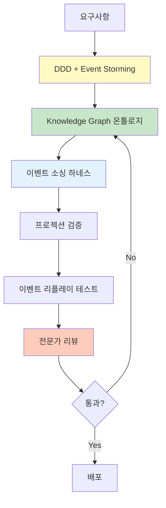

# Level 5: Event Sourcing & CQRS

가장 높은 복잡도의 아키텍처 패턴으로, 전문가 지원과 정교한 온톨로지가 필수입니다.

## 특징

- 읽기/쓰기 분리 (CQRS)
- 이벤트 저장소 (Event Store)
- 복잡한 프로젝션 (Read Model)
- 이벤트 리플레이

## AIDLC 적용 방법



## 온톨로지 수준

**Knowledge Graph:** SemanticForge 패턴
- 이벤트 저장소 스키마
- 프로젝션 로직 명시
- 이벤트 버전 관리

**예시 온톨로지 (Event Sourcing):**

```yaml
# ontology/banking-account.yaml
aggregateRoot: BankAccount

events:
  AccountOpened:
    version: v1
    schema:
      accountId: string
      customerId: string
      initialBalance: decimal
      openedAt: timestamp
  
  MoneyDeposited:
    version: v1
    schema:
      accountId: string
      amount: decimal
      transactionId: string
      depositedAt: timestamp
  
  MoneyWithdrawn:
    version: v1
    schema:
      accountId: string
      amount: decimal
      transactionId: string
      withdrawnAt: timestamp

eventStore:
  partitionKey: accountId
  snapshotStrategy: every 100 events
  retentionPolicy: 7 years

projections:
  AccountBalanceView:
    source: [AccountOpened, MoneyDeposited, MoneyWithdrawn]
    target: read_db.account_balance
    updateStrategy: eventually_consistent
  
  TransactionHistoryView:
    source: [MoneyDeposited, MoneyWithdrawn]
    target: read_db.transaction_history
    updateStrategy: eventually_consistent

invariants:
  - Balance cannot be negative
  - Events must be ordered by timestamp
  - TransactionId must be unique (idempotency)
```

## 하네스 체크리스트

- ✅ 이벤트 스키마 검증 (버전 관리)
- ✅ 프로젝션 검증 (Read Model 일관성)
- ✅ 이벤트 리플레이 테스트
- ✅ Snapshot 전략 검증
- ✅ 이벤트 마이그레이션 하네스
- ✅ 멱등성 하네스
- ✅ 분산 추적

## 하네스 구현 예시

### 프로젝션 검증 하네스

```python
# harness/projection_test.py
def test_projection_consistency():
    """이벤트 소싱 프로젝션이 정확한지 검증"""
    # 1. 이벤트 생성
    events = [
        AccountOpenedEvent(accountId="A1", balance=1000),
        MoneyDepositedEvent(accountId="A1", amount=500),
        MoneyWithdrawnEvent(accountId="A1", amount=200),
    ]
    
    # 2. 이벤트 저장
    for event in events:
        event_store.append(event)
    
    # 3. 프로젝션 업데이트
    projection_service.rebuild("AccountBalanceView")
    
    # 4. Read Model 검증
    balance_view = read_db.get_account_balance("A1")
    assert balance_view.balance == 1300  # 1000 + 500 - 200
    assert balance_view.version == 3
```

### 멱등성 하네스

```python
# harness/idempotency_test.py
def test_duplicate_event_handling():
    """동일 이벤트를 여러 번 받아도 결과가 동일한지 검증"""
    event = OrderCreatedEvent(orderId="123", ...)
    
    # 첫 번째 처리
    result1 = event_handler.handle(event)
    state1 = get_order_state("123")
    
    # 두 번째 처리 (중복)
    result2 = event_handler.handle(event)
    state2 = get_order_state("123")
    
    # 결과가 동일해야 함
    assert result1 == result2
    assert state1 == state2
```

## 적용 전략

- DDD + Event Storming 필수
- Knowledge Graph 수준 온톨로지
- 이벤트 버전 관리 전략
- 프로젝션 로직 검증 자동화
- 이벤트 리플레이 테스트 필수
- 전문가 팀 구성 권장

## SemanticForge 패턴

Level 5 프로젝트는 [온톨로지 엔지니어링](../../../methodology/ontology-engineering.md)의 SemanticForge 패턴을 적용합니다.

**핵심 특징:**
- 이벤트 = 도메인 지식의 원자 단위
- Knowledge Graph로 이벤트 간 관계 표현
- 프로젝션 = Knowledge Graph 쿼리

**참고:** [온톨로지 엔지니어링](../../../methodology/ontology-engineering.md)에서 세부 가이드 확인

## 다음 단계

- [온톨로지 작성 가이드](../implementation/ontology-guide.md)
- [하네스 체크리스트](../implementation/harness-checklist.md)
- [검증 방법론](../implementation/verification.md)
