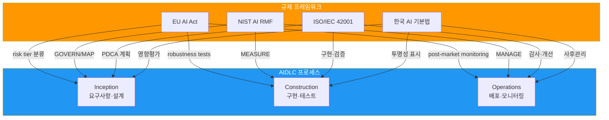
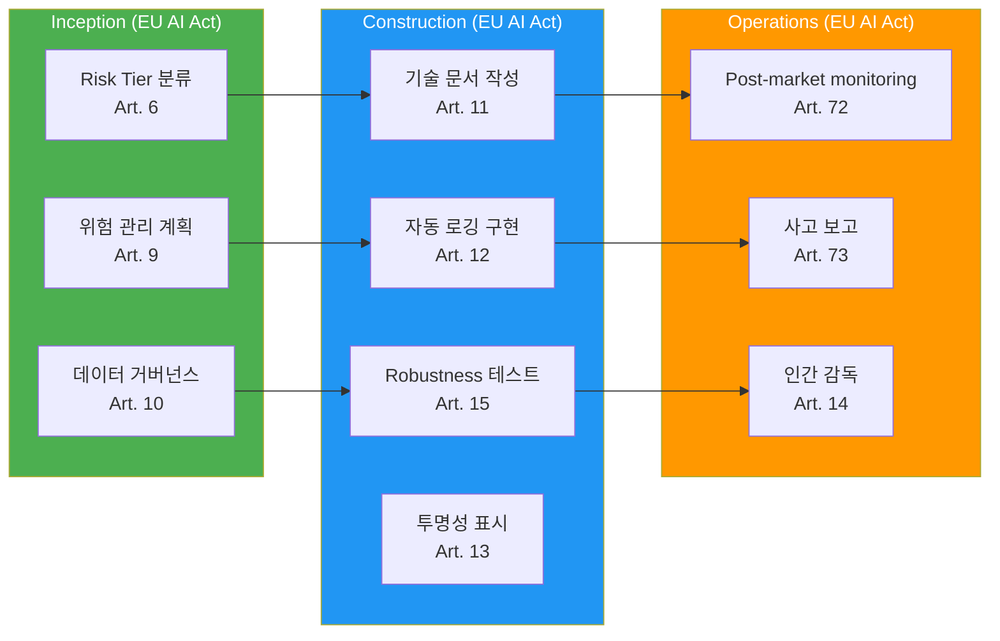
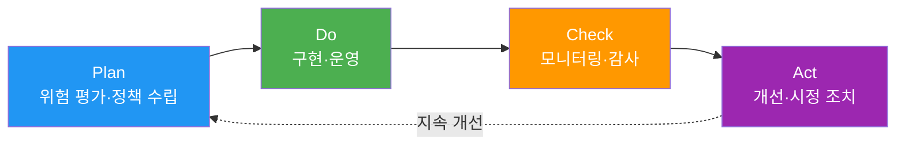

# AI 규제 프레임워크 매핑

> 📅 **작성일**: 2026-04-18 | ⏱️ **읽는 시간**: 약 25분

---

## 1. 왜 AI 규제 매핑이 필요한가

### 동시 다발적 규제 환경

2026년 현재, 글로벌 기업은 **여러 지역의 AI 규제를 동시에 준수**해야 하는 복잡한 환경에 직면했습니다:

- **EU**: AI Act (2024 채택, 2026-2027 단계적 적용 시작)
- **미국**: NIST AI RMF 1.1 (연방 조달 요구사항), 주별 개별 규제
- **한국**: AI 기본법 (2026 시행 예정)
- **국제 표준**: ISO/IEC 42001:2023 (AI Management System 인증)

**직면하는 과제:**
- 각 규제의 요구사항이 **서로 다른 용어**로 정의됨
- 중복되는 통제 요소를 **개별적으로 구현**하면 비용 낭비
- 감사(audit) 시 **여러 보고서를 별도 작성**해야 함
- 규제 변화에 대응하는 **업데이트 비용** 증가

### AIDLC 워크플로 통합의 이점

규제 요구사항을 **AIDLC 프로세스 단계에 직접 매핑**하면:

1. **자동 준수**: 각 단계에서 필요한 controls를 자동 실행
2. **통합 감사 로그**: 단일 감사 추적 체계로 모든 규제 대응
3. **효율적 업데이트**: 규제 변화 시 AIDLC 단계 정의만 수정
4. **증거 자동 수집**: 컴플라이언스 보고서 자동 생성



---

## 2. EU AI Act (2024-2027)

### 개요

**EU AI Act**는 2024년 5월 채택되어 **2026년부터 단계적으로 적용**되는 세계 최초의 포괄적 AI 규제입니다.

**시행 타임라인:**
- 2025년 2월: 금지된 AI 시스템 적용 (Prohibited AI)
- 2026년 8월: 범용 AI (GPAI) 제공자 의무 적용
- 2027년 8월: 고위험 AI (High-risk) 시스템 의무 전면 적용

### Risk Tier 분류

EU AI Act는 AI 시스템을 **4단계 위험도**로 분류합니다:

| Risk Tier | 정의 | 예시 | 규제 수준 |
|-----------|------|------|----------|
| **Prohibited** | 용인 불가능한 위험 | 사회적 신용 점수, 실시간 원격 생체인식 (법 집행 제외) | **금지** |
| **High-risk** | 높은 위험 | 채용 도구, 신용 평가, 중요 인프라 관리 | **엄격한 의무사항** |
| **Limited risk** | 제한적 위험 | 챗봇, 감정 인식 | **투명성 의무** |
| **Minimal risk** | 최소 위험 | 스팸 필터, AI 게임 | **자율 규제** |

**코드 생성 AI (AIDLC 대상) 분류:**
- **Limited risk**: 개발자가 AI 생성 코드임을 인지 → 투명성 의무
- **High-risk** (조건부): 중요 인프라 (의료, 금융, 전력) 코드 자동 생성 시

### High-risk AI 의무사항

**Article 9-15 핵심 요구사항:**

1. **위험 관리 시스템** (Art. 9)
   - 전체 생명주기 위험 평가
   - 식별·분석·완화·모니터링

2. **데이터 거버넌스** (Art. 10)
   - 학습 데이터 품질 보증
   - 편향(bias) 최소화

3. **기술 문서** (Art. 11)
   - 시스템 설계·개발·테스트 문서화
   - 감사 기관 제출 가능해야 함

4. **자동 로깅** (Art. 12)
   - 모든 의사결정 추적 가능
   - 로그 보존 기간: 최소 6개월

5. **투명성** (Art. 13)
   - 사용자에게 AI 사용 사실 고지
   - 설명 가능한 출력

6. **인간 감독 (HITL)** (Art. 14)
   - 중요 결정은 사람이 최종 승인
   - Override 권한 보장

7. **정확성·견고성·사이버보안** (Art. 15)
   - 성능 메트릭 정의
   - Adversarial attack 방어

### GPAI (General Purpose AI) 제공자 의무

**Article 52-53**: Claude, GPT-4 등 범용 모델 제공자 의무

- **투명성 보고서**: 학습 데이터, 에너지 소비량 공개
- **저작권 준수**: 학습 데이터 출처 명시
- **Systemic risk** (고급 GPAI, 10^25 FLOP 초과): 위험 평가 및 완화 의무

### 위반 과태료

| 위반 유형 | 과태료 |
|----------|--------|
| 금지된 AI 사용 | **35M€** 또는 **전 세계 매출의 7%** (더 큰 금액) |
| High-risk AI 의무 위반 | **15M€** 또는 **매출의 3%** |
| 부정확한 정보 제공 | **7.5M€** 또는 **매출의 1.5%** |

### AIDLC 매핑



**Inception 단계 체크리스트:**
- [ ] Risk Tier 분류 (Limited/High-risk 판정)
- [ ] 위험 관리 계획 수립 (위험 식별·완화 전략)
- [ ] 데이터 거버넌스 정책 정의 (학습 데이터 출처, 편향 완화)

**Construction 단계 체크리스트:**
- [ ] 기술 문서 자동 생성 (설계·개발·테스트 문서)
- [ ] 감사 로그 구현 (모든 AI 의사결정 기록)
- [ ] Robustness 테스트 (Adversarial attack, 경계 케이스)
- [ ] AI 생성 코드에 투명성 표시 (`# AI-GENERATED: Claude 3.7 Sonnet`)

**Operations 단계 체크리스트:**
- [ ] Post-market monitoring (프로덕션 성능 지속 추적)
- [ ] 심각한 사고 발생 시 15일 이내 보고 (Art. 73)
- [ ] 인간 감독 프로세스 운영 (중요 결정 승인)

---

## 3. NIST AI RMF 1.1 (Risk Management Framework)

### 개요

**NIST AI RMF (Risk Management Framework)**는 미국 국립표준기술연구소(NIST)가 2023년 발표한 AI 위험 관리 프레임워크입니다.

**특징:**
- **자발적 준수** (Voluntary) — 법적 강제력 없음
- **연방 조달 요구사항**: 미국 정부 계약 시 NIST AI RMF 준수 필수 (EO 14110)
- **국제 호환**: ISO/IEC 42001과 상호 매핑 가능

**버전 이력:**
- v1.0 (2023.01): 최초 발표
- v1.1 (2024.12): Generative AI 섹션 추가, 투명성 강화

### 4 Functions — GOVERN, MAP, MEASURE, MANAGE


#### 1. GOVERN

**목적**: AI 시스템 거버넌스 정책·문화·책임 수립

**핵심 하위 카테고리:**
- **GOVERN-1.1**: AI 위험 관리 전략 수립
- **GOVERN-1.2**: 책임 소재 명확화 (AI 시스템 소유자)
- **GOVERN-1.3**: 법적·규제적·윤리적 고려사항 통합
- **GOVERN-1.4**: 조직 전체 AI 리스크 문화 조성

**AIDLC 매핑**: [거버넌스 프레임워크](./governance-framework.md) — 3층 거버넌스 모델

#### 2. MAP

**목적**: AI 시스템 맥락 이해, 위험 식별

**핵심 하위 카테고리:**
- **MAP-1.1**: 비즈니스 맥락 파악 (사용 사례, 이해관계자)
- **MAP-1.2**: AI 시스템 범위 정의 (입력, 출력, 의존성)
- **MAP-2.1**: 데이터 품질 평가
- **MAP-3.1**: 위험 식별 (편향, 프라이버시, 보안)
- **MAP-5.1**: 임팩트 평가

**AIDLC 매핑**: Inception → Requirements Analysis, Reverse Engineering

#### 3. MEASURE

**목적**: AI 시스템 성능·신뢰성·공정성 측정

**핵심 하위 카테고리:**
- **MEASURE-1.1**: 성능 메트릭 정의 (정확도, F1, AUC)
- **MEASURE-2.1**: 설명 가능성 평가
- **MEASURE-2.2**: 편향 테스트 (demographic parity, equalized odds)
- **MEASURE-2.3**: 견고성 테스트 (adversarial robustness)
- **MEASURE-3.1**: 프라이버시 영향 평가

**AIDLC 매핑**: Construction → Build & Test, [하네스 엔지니어링](../methodology/harness-engineering.md) Quality Gates

#### 4. MANAGE

**목적**: AI 위험 대응·모니터링·지속 개선

**핵심 하위 카테고리:**
- **MANAGE-1.1**: 위험 완화 전략 실행
- **MANAGE-2.1**: 사고 대응 계획
- **MANAGE-3.1**: 지속적 모니터링
- **MANAGE-4.1**: 피드백 루프 (위험 재평가)

**AIDLC 매핑**: Operations → Post-market monitoring, 사고 대응

### NIST AI RMF 1.0 → 1.1 주요 변경사항

| 항목 | v1.0 (2023.01) | v1.1 (2024.12) |
|------|---------------|---------------|
| **Generative AI** | 간략한 언급 | 전용 섹션 추가 (Appendix B) |
| **투명성** | MEASURE-2.1 | 강화 (Model Card, Data Sheet 예시) |
| **Red Teaming** | - | MEASURE-2.3 추가 (적대적 테스트) |
| **Supply Chain** | GOVERN-1.5 | 확장 (오픈소스 모델 위험) |

### 미국 연방 조달 요구사항 (EO 14110)

**Executive Order 14110 (2023.10.30)**: "Safe, Secure, and Trustworthy AI"

**핵심 내용:**
- 연방 기관은 AI 도입 시 **NIST AI RMF 준수 필수**
- 10^26 FLOP 초과 모델 개발 시 **정부에 보고** 의무
- 연방 조달 계약에 **AI 위험 관리 조항 포함**

**AIDLC 대응**: 미국 연방 계약 프로젝트는 NIST AI RMF 매핑 필수

---

## 4. ISO/IEC 42001:2023 (AI Management System)

### 개요

**ISO/IEC 42001:2023**는 2023년 12월 발표된 **AI 관리 시스템(AIMS) 국제 표준**입니다.

**특징:**
- **인증 가능**: ISO 9001 (품질), ISO 27001 (정보보안)과 동일한 구조
- **PDCA 기반**: Plan-Do-Check-Act 사이클
- **통합 가능**: ISMS (ISO 27001), QMS (ISO 9001)와 통합 운영 가능

### PDCA 구조



### Annex A Controls (9개 카테고리)

| 카테고리 | Controls 수 | 주요 내용 |
|----------|-------------|----------|
| **A.5 정책** | 3 | AI 정책 문서화, 경영진 승인 |
| **A.6 조직** | 7 | 역할·책임, 리소스 할당 |
| **A.7 데이터** | 12 | 데이터 품질, 출처, 편향 완화 |
| **A.8 정보** | 8 | 투명성, 설명 가능성, 문서화 |
| **A.9 인적 자원** | 6 | AI 역량, 윤리 교육 |
| **A.10 운영** | 15 | AI 생명주기 관리, 모니터링 |
| **A.11 성능** | 5 | 성능 메트릭, 지속 개선 |
| **A.12 보안** | 10 | Adversarial attack 방어, 프라이버시 |
| **A.13 타사** | 6 | 공급망 관리, 오픈소스 모델 |

**AIDLC 매핑:**
- **A.7 데이터**: Inception → 데이터 거버넌스 정책
- **A.10 운영**: Construction → 하네스 Quality Gates
- **A.11 성능**: Operations → 지속적 모니터링

### 인증 절차

**ISO/IEC 42001 인증 3단계:**

1. **Gap Analysis**: 현재 상태 vs ISO 42001 요구사항 차이 분석
2. **Stage 1 Audit**: 문서 심사 (정책, 절차, 기술 문서)
3. **Stage 2 Audit**: 현장 심사 (실제 구현 확인)
4. **인증 발급**: 유효기간 3년 (연간 surveillance audit)

**AIDLC 대응**: [거버넌스 프레임워크](./governance-framework.md) 스티어링 파일 → ISO 42001 Controls 자동 매핑

### ISMS/QMS 통합

**ISO 42001 + ISO 27001 통합 시너지:**
- **A.12 보안** (ISO 42001) ↔ **A.8 자산 관리** (ISO 27001)
- **A.10 운영** (ISO 42001) ↔ **A.12 운영 보안** (ISO 27001)
- 단일 감사로 두 인증 동시 갱신 가능

---

## 5. 한국 AI 기본법 (2026 시행 예정)

### 개요

**인공지능 기본법**은 한국 최초의 포괄적 AI 규제법으로, **2026년 상반기 시행 예정**입니다.

**입법 배경:**
- 과학기술정보통신부 주도
- 2025년 국회 통과 (예정)
- EU AI Act를 참고하되 한국 실정에 맞게 조정

### 핵심 조항

#### 1. 고영향 AI 시스템 지정

**정의**: 사람의 생명·안전·권리에 중대한 영향을 미치는 AI

**예시:**
- 채용·승진 결정 지원 시스템
- 신용 평가·대출 심사
- 의료 진단 보조
- 범죄 예측·양형 지원

**의무사항:**
- 사전 영향 평가 실시
- 사용자에게 AI 사용 사실 고지
- 의사결정 과정 설명 의무

#### 2. 생성형 AI 표시 의무

**대상**: 텍스트·이미지·동영상·코드 생성 AI

**의무 내용:**
- AI가 생성한 콘텐츠임을 **명확히 표시**
- 워터마크 또는 메타데이터 삽입 권장

**AIDLC 대응:**
```python
# AI-GENERATED: Claude 3.7 Sonnet (2026-04-18)
# PROMPT: "사용자 인증 API 엔드포인트 구현"
# REVIEW: @senior-developer (2026-04-18)

@app.post("/auth/login")
def login(credentials: LoginRequest):
    # 생성된 코드...
```

#### 3. 영향 평가

**대상**: 고영향 AI 시스템 도입 전

**평가 항목:**
- 위험 요인 (편향, 프라이버시 침해)
- 완화 조치
- 대체 수단 검토
- 사후 모니터링 계획

**AIDLC 매핑**: Inception → Requirements Analysis (NFR 충족 여부)

#### 4. 사후 관리

**의무 내용:**
- 배포 후 **지속적 모니터링**
- 오작동·편향 발견 시 **즉시 시정**
- 중대 사고 발생 시 **과기정통부에 보고**

**AIDLC 매핑**: Operations → Post-market monitoring

### 개인정보보호법(PIPA)과의 교차

**PIPA (Personal Information Protection Act)**와 AI 기본법은 **상호 보완**:

| 항목 | PIPA | AI 기본법 |
|------|------|-----------|
| **적용 대상** | 개인정보 처리 전반 | AI 시스템 특화 |
| **프로파일링** | 동의 필요 (Art. 15) | 고영향 AI 시 영향 평가 추가 |
| **자동화 결정** | 거부권 보장 (Art. 37-2) | 설명 의무 (AI 기본법) |
| **책임** | 정보 주체 권리 중심 | AI 시스템 안전성 중심 |

**AIDLC 대응**: 개인정보 처리 시 PIPA + AI 기본법 **동시 준수** 필요

### ISMS-P와의 연계

**ISMS-P (정보보호 및 개인정보보호 관리체계)** 인증 보유 조직:
- AI 기본법 요구사항을 **ISMS-P 관리체계에 통합** 가능
- 인증 심사 시 AI 시스템 관리 항목 추가 예정 (2026년 이후)

---

## 6. 교차 매핑 표 (Comparative Matrix)

### 통제 요소별 규제 매핑

| 통제 요소 | EU AI Act | NIST AI RMF | ISO/IEC 42001 | 한국 AI 기본법 |
|----------|-----------|-------------|---------------|---------------|
| **리스크 평가** | Art. 6, 9 (위험 관리) | MAP-3.1 | A.5.1 (정책), A.10.2 (위험 관리) | 영향 평가 (고영향 AI) |
| **데이터 거버넌스** | Art. 10 (데이터 품질) | MAP-2.1 | A.7.* (데이터 12개 controls) | PIPA 준수 |
| **투명성·설명가능성** | Art. 13 (투명성) | MEASURE-2.1 | A.8.2 (투명성), A.8.3 (설명) | 생성형 AI 표시 의무 |
| **인간 감독 (HITL)** | Art. 14 (인간 감독) | MANAGE-3.1 | A.10.5 (인간 개입) | - |
| **기술 문서** | Art. 11 (문서화) | GOVERN-1.4 | A.8.1 (문서), A.10.6 (기록) | - |
| **성능 모니터링** | Art. 15 (정확성) | MEASURE-1.1 | A.11.1 (성능 메트릭) | - |
| **사후 모니터링** | Art. 72 (post-market) | MANAGE-3.1 | A.10.10 (지속 모니터링) | 사후 관리 의무 |
| **사고 보고** | Art. 73 (15일 이내) | MANAGE-2.1 | A.10.11 (사고 대응) | 중대 사고 보고 |
| **보안** | Art. 15 (사이버보안) | MEASURE-2.3 | A.12.* (보안 10개) | ISMS-P 연계 |
| **공급망 관리** | - | GOVERN-1.5 | A.13.* (타사 6개) | - |

### AIDLC 단계별 규제 요구사항 집계

```mermaid
graph TB
    subgraph Inception["Inception 단계"]
        I1["EU AI Act: Risk Tier 분류 (Art. 6)"]
        I2["NIST: GOVERN + MAP"]
        I3["ISO 42001: Plan (PDCA)"]
        I4["한국: 영향 평가"]
    end
    
    subgraph Construction["Construction 단계"]
        C1["EU AI Act: 문서화 (Art. 11), 로깅 (Art. 12)"]
        C2["NIST: MEASURE"]
        C3["ISO 42001: Do + Check (PDCA)"]
        C4["한국: 생성 표시 의무"]
    end
    
    subgraph Operations["Operations 단계"]
        O1["EU AI Act: Post-market monitoring (Art. 72)"]
        O2["NIST: MANAGE"]
        O3["ISO 42001: Act (PDCA)"]
        O4["한국: 사후 관리"]
    end
    
    I1 -.공통 목표: 위험 식별.-> I2
    I2 -.공통 목표: 위험 식별.-> I3
    I3 -.공통 목표: 위험 식별.-> I4
    
    C1 -.공통 목표: 안전성 검증.-> C2
    C2 -.공통 목표: 안전성 검증.-> C3
    C3 -.공통 목표: 안전성 검증.-> C4
    
    O1 -.공통 목표: 지속 모니터링.-> O2
    O2 -.공통 목표: 지속 모니터링.-> O3
    O3 -.공통 목표: 지속 모니터링.-> O4
    
    style Inception fill:#4caf50,color:#fff
    style Construction fill:#2196f3,color:#fff
    style Operations fill:#ff9800,color:#fff
```



---

## 7. AIDLC 프로세스 통합 예시

### Inception 단계 체크리스트 (Risk Classification)

**목적**: 모든 규제의 리스크 평가 요구사항 통합 충족

```yaml
# .aidlc/compliance/risk-assessment.yaml
project: payment-service-v2
assessment_date: 2026-04-18
assessed_by: devfloor9

# EU AI Act: Risk Tier
eu_ai_act:
  risk_tier: limited-risk  # AI 생성 코드는 Limited risk
  rationale: "코드 생성 AI 사용, 개발자 검토 필수화로 위험 완화"
  transparency_required: true

# NIST AI RMF: MAP
nist_ai_rmf:
  map_1_1_business_context: "결제 서비스 신규 기능 개발"
  map_3_1_identified_risks:
    - "SQL Injection 취약점"
    - "PII 노출 위험"
    - "Incorrect 비즈니스 로직"
  map_5_1_impact: "Medium (금융 거래 영향)"

# ISO/IEC 42001: A.10.2 위험 관리
iso_42001:
  risk_id: RISK-2026-04-001
  controls:
    - A.7.3: "데이터 품질 검증"
    - A.12.5: "보안 코드 리뷰"

# 한국 AI 기본법: 영향 평가
korea_ai_law:
  high_impact: false  # 고영향 AI 아님
  privacy_impact: "PIPA 준수 (개인정보 암호화)"
```

### Construction 단계 Control 구현 (Guardrails 스택)

**목적**: 모든 규제의 안전성 요구사항을 아키텍처적으로 강제

```yaml
# .aidlc/harness/quality-gates.yaml
quality_gates:
  # EU AI Act: Art. 15 (정확성·견고성)
  - gate: code_quality
    enabled: true
    thresholds:
      code_coverage: 80  # 80% 이상
      duplication: 3     # 3% 이하
      cognitive_complexity: 15
    failure_action: block_merge
  
  # NIST AI RMF: MEASURE-2.3 (보안)
  - gate: security_scan
    enabled: true
    tools:
      - bandit  # Python SAST
      - semgrep  # Multi-language
    severity_threshold: medium
    failure_action: block_merge
  
  # ISO/IEC 42001: A.12.5 (보안 코드 리뷰)
  - gate: independent_review
    enabled: true
    reviewers:
      - @senior-developer
    min_approvals: 1
    failure_action: block_merge
  
  # 한국 AI 기본법: 생성 표시 의무
  - gate: ai_generated_marker
    enabled: true
    marker_format: |
      # AI-GENERATED: {model} ({date})
      # PROMPT: {prompt_summary}
      # REVIEW: {reviewer} ({review_date})
    failure_action: warning
```

**하네스 패턴 구현:**

```python
# src/harness/circuit_breaker.py
from typing import Callable
import time

class CircuitBreaker:
    """EU AI Act Art. 15 + NIST MANAGE-1.1 준수"""
    
    def __init__(self, failure_threshold: int = 5, timeout: int = 60):
        self.failure_threshold = failure_threshold
        self.timeout = timeout
        self.failures = 0
        self.last_failure_time = None
        self.state = "CLOSED"  # CLOSED, OPEN, HALF_OPEN
    
    def call(self, func: Callable, *args, **kwargs):
        if self.state == "OPEN":
            if time.time() - self.last_failure_time > self.timeout:
                self.state = "HALF_OPEN"
            else:
                raise Exception("Circuit breaker is OPEN")
        
        try:
            result = func(*args, **kwargs)
            if self.state == "HALF_OPEN":
                self.state = "CLOSED"
                self.failures = 0
            return result
        except Exception as e:
            self.failures += 1
            self.last_failure_time = time.time()
            if self.failures >= self.failure_threshold:
                self.state = "OPEN"
            raise e
```

### Operations 단계 요구 (Post-market Monitoring)

**목적**: 배포 후 지속적 모니터링 및 사고 대응

```yaml
# .aidlc/monitoring/post-market.yaml
post_market_monitoring:
  # EU AI Act: Art. 72
  eu_ai_act:
    monitoring_frequency: daily
    performance_metrics:
      - accuracy: "> 95%"
      - latency_p99: "< 500ms"
    alert_threshold: 0.90  # 90% 미만 시 알림
    incident_report_sla: 15d  # 15일 이내 보고 (Art. 73)
  
  # NIST AI RMF: MANAGE-3.1
  nist_ai_rmf:
    continuous_monitoring:
      - metric: "error_rate"
        target: "< 1%"
      - metric: "bias_score"
        target: "< 0.05 (demographic parity)"
    feedback_loop: monthly  # 월간 위험 재평가
  
  # ISO/IEC 42001: A.10.10
  iso_42001:
    kpis:
      - "AI 생성 코드 품질 메트릭"
      - "보안 취약점 탐지율"
    audit_frequency: quarterly
  
  # 한국 AI 기본법: 사후 관리
  korea_ai_law:
    monitoring_responsible: "AI Governance Team"
    corrective_action_sla: 7d  # 오작동 발견 시 7일 이내 시정
    reporting_authority: "과학기술정보통신부"
```

**Grafana 대시보드 예시:**

```yaml
# grafana/dashboards/compliance-dashboard.json
panels:
  - title: "EU AI Act: Post-market Performance"
    metrics:
      - accuracy: query: "ai_model_accuracy{model='claude-3-7-sonnet'}"
      - latency: query: "http_request_duration_seconds{quantile='0.99'}"
    alert_rule: "accuracy < 0.95"
  
  - title: "NIST AI RMF: Bias Monitoring"
    metrics:
      - demographic_parity: query: "ai_bias_score{metric='demographic_parity'}"
    alert_rule: "demographic_parity > 0.05"
  
  - title: "ISO 42001: Audit Trail"
    logs:
      - source: "elasticsearch"
        query: "action:code_generation AND quality_gate.passed:false"
  
  - title: "한국 AI 기본법: 사고 로그"
    logs:
      - source: "cloudwatch"
        query: "severity:CRITICAL AND ai_incident:true"
```

---

## 8. 실전 Adoption 로드맵

조직에서 규제 준수 체계를 단계적으로 도입하는 로드맵:

### Tier-1: 코어 준수 (3-6개월)

**목표**: 법적 의무사항 최소 충족

**대상 규제:**
- EU AI Act (EU 시장 진출 조직)
- 한국 AI 기본법 (한국 사업장)

**구현 항목:**
- [ ] Risk Tier 분류 자동화 (Inception 단계)
- [ ] AI 생성 코드 투명성 표시 (Construction 단계)
- [ ] 감사 로그 자동 수집 (전 단계)
- [ ] Post-market monitoring 대시보드 (Operations 단계)

**예상 비용**: 엔지니어 2명 × 3개월 = 6 man-months

### Tier-2: 확장 (6-12개월)

**목표**: 경쟁 우위 확보

**대상 규제:**
- NIST AI RMF (미국 연방 계약 대응)
- PIPA/ISMS-P (한국 개인정보보호 통합)

**구현 항목:**
- [ ] NIST AI RMF 4 Functions 매핑 (GOVERN/MAP/MEASURE/MANAGE)
- [ ] PIPA + AI 기본법 통합 감사 로그
- [ ] 편향 테스트 자동화 (MEASURE-2.2)
- [ ] Adversarial robustness 테스트 (MEASURE-2.3)

**예상 비용**: 엔지니어 3명 × 6개월 = 18 man-months

### Tier-3: 인증 (12-24개월)

**목표**: 글로벌 시장 신뢰 확보

**대상 인증:**
- ISO/IEC 42001:2023 (AI Management System)

**구현 항목:**
- [ ] Gap Analysis (현재 상태 vs ISO 42001)
- [ ] Annex A Controls 구현 (9개 카테고리, 72개 controls)
- [ ] PDCA 사이클 운영 (Plan-Do-Check-Act)
- [ ] Stage 1/2 Audit 대응
- [ ] 인증 취득 및 유지

**예상 비용**: 엔지니어 2명 + 컨설턴트 + 인증 비용 = 30 man-months + $50k

---

## 9. 참고 자료

### 공식 문서

**EU AI Act:**
- [Regulation (EU) 2024/1689 (Official Text)](https://eur-lex.europa.eu/legal-content/EN/TXT/?uri=CELEX:32024R1689)
- [EU AI Act Timeline (European Commission)](https://digital-strategy.ec.europa.eu/en/policies/regulatory-framework-ai)

**NIST AI RMF:**
- [NIST AI RMF 1.1 (2024.12)](https://www.nist.gov/itl/ai-risk-management-framework)
- [Executive Order 14110 (White House)](https://www.whitehouse.gov/briefing-room/presidential-actions/2023/10/30/executive-order-on-the-safe-secure-and-trustworthy-development-and-use-of-artificial-intelligence/)

**ISO/IEC 42001:**
- [ISO/IEC 42001:2023 (ISO Store)](https://www.iso.org/standard/81230.html)
- [ISO 42001 Implementation Guide (BSI)](https://www.bsigroup.com/en-GB/iso-42001-artificial-intelligence-management-system/)

**한국 AI 기본법:**
- [과학기술정보통신부 AI 정책](https://www.msit.go.kr/bbs/list.do?sCode=user&mId=113&mPid=112) (공식 발표 시 업데이트 필요)
- [개인정보보호법 (PIPA)](https://www.pipc.go.kr/np/default/page.do?mCode=D030010000)

### AWS 관련 자료

- [AWS Artifact (Compliance Reports)](https://aws.amazon.com/artifact/) — EU AI Act, ISO 42001 대응 보고서
- [AWS Compliance Center](https://aws.amazon.com/compliance/programs/) — 지역별 규제 매핑
- [Amazon Bedrock Guardrails](https://docs.aws.amazon.com/bedrock/latest/userguide/guardrails.html) — 런타임 가드레일 구현

### 관련 AIDLC 문서

- [거버넌스 프레임워크](./governance-framework.md) — 3층 거버넌스 모델, 스티어링 파일
- [하네스 엔지니어링](../methodology/harness-engineering.md) — Quality Gates, 독립 검증 원칙
- [Adaptive Execution](../methodology/adaptive-execution.md) — AIDLC 단계별 실행 조건
- [도입 전략](./adoption-strategy.md) — 조직별 AIDLC 도입 로드맵
