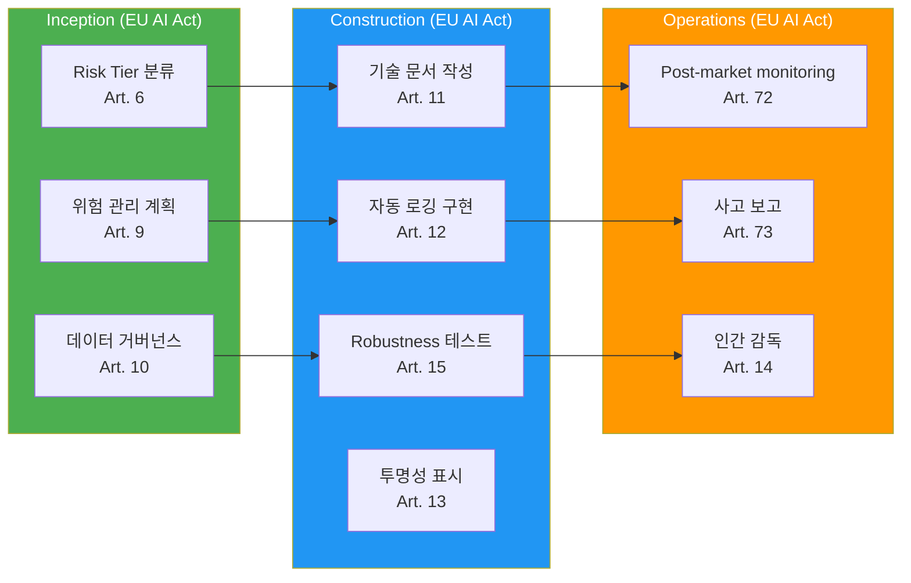

# EU AI Act (2024-2027)

> 📅 **작성일**: 2026-04-18 | ⏱️ **읽는 시간**: 약 6분

---

## 개요

**EU AI Act**는 2024년 5월 채택되어 **2026년부터 단계적으로 적용**되는 세계 최초의 포괄적 AI 규제입니다.

**시행 타임라인:**
- **2025년 2월**: 금지된 AI 시스템 적용 (Prohibited AI)
- **2026년 8월**: 범용 AI (GPAI) 제공자 의무 적용
- **2027년 8월**: 고위험 AI (High-risk) 시스템 의무 전면 적용

---

## Risk Tier 분류

EU AI Act는 AI 시스템을 **4단계 위험도**로 분류합니다:

| Risk Tier | 정의 | 예시 | 규제 수준 |
|-----------|------|------|----------|
| **Prohibited** | 용인 불가능한 위험 | 사회적 신용 점수, 실시간 원격 생체인식 (법 집행 제외) | **금지** |
| **High-risk** | 높은 위험 | 채용 도구, 신용 평가, 중요 인프라 관리 | **엄격한 의무사항** |
| **Limited risk** | 제한적 위험 | 챗봇, 감정 인식 | **투명성 의무** |
| **Minimal risk** | 최소 위험 | 스팸 필터, AI 게임 | **자율 규제** |

**코드 생성 AI (AIDLC 대상) 분류:**
- **Limited risk**: 개발자가 AI 생성 코드임을 인지 → 투명성 의무
- **High-risk** (조건부): 중요 인프라 (의료, 금융, 전력) 코드 자동 생성 시

---

## High-risk AI 의무사항

**Article 9-15 핵심 요구사항:**

### 1. 위험 관리 시스템 (Art. 9)
- 전체 생명주기 위험 평가
- 식별·분석·완화·모니터링

### 2. 데이터 거버넌스 (Art. 10)
- 학습 데이터 품질 보증
- 편향(bias) 최소화

### 3. 기술 문서 (Art. 11)
- 시스템 설계·개발·테스트 문서화
- 감사 기관 제출 가능해야 함

### 4. 자동 로깅 (Art. 12)
- 모든 의사결정 추적 가능
- 로그 보존 기간: 최소 6개월

### 5. 투명성 (Art. 13)
- 사용자에게 AI 사용 사실 고지
- 설명 가능한 출력

### 6. 인간 감독 (HITL) (Art. 14)
- 중요 결정은 사람이 최종 승인
- Override 권한 보장

### 7. 정확성·견고성·사이버보안 (Art. 15)
- 성능 메트릭 정의
- Adversarial attack 방어

---

## GPAI (General Purpose AI) 제공자 의무

**Article 52-53**: Claude, GPT-4 등 범용 모델 제공자 의무

- **투명성 보고서**: 학습 데이터, 에너지 소비량 공개
- **저작권 준수**: 학습 데이터 출처 명시
- **Systemic risk** (고급 GPAI, 10^25 FLOP 초과): 위험 평가 및 완화 의무

---

## 위반 과태료

| 위반 유형 | 과태료 |
|----------|--------|
| 금지된 AI 사용 | **35M€** 또는 **전 세계 매출의 7%** (더 큰 금액) |
| High-risk AI 의무 위반 | **15M€** 또는 **매출의 3%** |
| 부정확한 정보 제공 | **7.5M€** 또는 **매출의 1.5%** |

---

## AIDLC 매핑

### Inception 단계 체크리스트

- [ ] Risk Tier 분류 (Limited/High-risk 판정)
- [ ] 위험 관리 계획 수립 (위험 식별·완화 전략)
- [ ] 데이터 거버넌스 정책 정의 (학습 데이터 출처, 편향 완화)

### Construction 단계 체크리스트

- [ ] 기술 문서 자동 생성 (설계·개발·테스트 문서)
- [ ] 감사 로그 구현 (모든 AI 의사결정 기록)
- [ ] Robustness 테스트 (Adversarial attack, 경계 케이스)
- [ ] AI 생성 코드에 투명성 표시 (`# AI-GENERATED: Claude 3.7 Sonnet`)

### Operations 단계 체크리스트

- [ ] Post-market monitoring (프로덕션 성능 지속 추적)
- [ ] 심각한 사고 발생 시 15일 이내 보고 (Art. 73)
- [ ] 인간 감독 프로세스 운영 (중요 결정 승인)

---

## 참고 자료

**공식 문서:**
- [Regulation (EU) 2024/1689 (Official Text)](https://eur-lex.europa.eu/legal-content/EN/TXT/?uri=CELEX:32024R1689)
- [EU AI Act Timeline (European Commission)](https://digital-strategy.ec.europa.eu/en/policies/regulatory-framework-ai)

**관련 문서:**
- [규제 컴플라이언스 개요](../index.md)
- [거버넌스 프레임워크](../../governance-framework.md)
- [하네스 엔지니어링](../../../methodology/harness-engineering.md)
