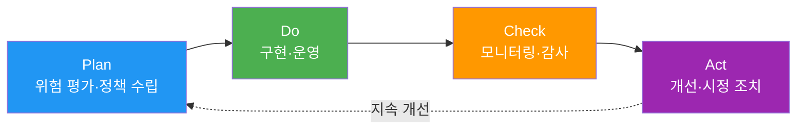

# ISO/IEC 42001:2023 (AI Management System)

> 📅 **작성일**: 2026-04-18 | ⏱️ **읽는 시간**: 약 5분

---

## 개요

**ISO/IEC 42001:2023**는 2023년 12월 발표된 **AI 관리 시스템(AIMS) 국제 표준**입니다.

**특징:**
- **인증 가능**: ISO 9001 (품질), ISO 27001 (정보보안)과 동일한 구조
- **PDCA 기반**: Plan-Do-Check-Act 사이클
- **통합 가능**: ISMS (ISO 27001), QMS (ISO 9001)와 통합 운영 가능

---

## PDCA 구조



### Plan (계획)
- AI 관리 시스템 범위 정의
- 위험 및 기회 평가
- AI 정책 수립
- 목표 설정

### Do (실행)
- AI 시스템 개발 및 배포
- 운영 통제 구현
- 역량 및 인식 교육
- 문서화

### Check (점검)
- 성능 모니터링
- 내부 감사
- 경영진 검토
- 준수 평가

### Act (개선)
- 부적합 사항 시정
- 지속적 개선
- 피드백 루프
- 교훈 학습

---

## Annex A Controls (9개 카테고리)

| 카테고리 | Controls 수 | 주요 내용 |
|----------|-------------|----------|
| **A.5 정책** | 3 | AI 정책 문서화, 경영진 승인 |
| **A.6 조직** | 7 | 역할·책임, 리소스 할당 |
| **A.7 데이터** | 12 | 데이터 품질, 출처, 편향 완화 |
| **A.8 정보** | 8 | 투명성, 설명 가능성, 문서화 |
| **A.9 인적 자원** | 6 | AI 역량, 윤리 교육 |
| **A.10 운영** | 15 | AI 생명주기 관리, 모니터링 |
| **A.11 성능** | 5 | 성능 메트릭, 지속 개선 |
| **A.12 보안** | 10 | Adversarial attack 방어, 프라이버시 |
| **A.13 타사** | 6 | 공급망 관리, 오픈소스 모델 |

**AIDLC 매핑:**
- **A.7 데이터**: Inception → 데이터 거버넌스 정책
- **A.10 운영**: Construction → 하네스 Quality Gates
- **A.11 성능**: Operations → 지속적 모니터링

---

## 인증 절차

**ISO/IEC 42001 인증 4단계:**

### 1. Gap Analysis
- 현재 상태 vs ISO 42001 요구사항 차이 분석
- 부족한 Controls 식별
- 구현 로드맵 수립

### 2. Stage 1 Audit (문서 심사)
- 정책, 절차, 기술 문서 검토
- AI 관리 시스템 설계 적절성 평가
- Stage 2 Audit 준비 사항 확인

### 3. Stage 2 Audit (현장 심사)
- 실제 구현 확인
- 운영 증거 검토
- 인터뷰 및 관찰
- 부적합 사항 지적

### 4. 인증 발급 및 유지
- 유효기간: 3년
- 연간 surveillance audit (유지 심사)
- 3년마다 재인증 심사

**AIDLC 대응**: [거버넌스 프레임워크](../../governance-framework.md) 스티어링 파일 → ISO 42001 Controls 자동 매핑

---

## ISMS/QMS 통합

**ISO 42001 + ISO 27001 통합 시너지:**
- **A.12 보안** (ISO 42001) ↔ **A.8 자산 관리** (ISO 27001)
- **A.10 운영** (ISO 42001) ↔ **A.12 운영 보안** (ISO 27001)
- 단일 감사로 두 인증 동시 갱신 가능

**ISO 42001 + ISO 9001 통합:**
- **A.11 성능** (ISO 42001) ↔ **8. 운영** (ISO 9001)
- **A.5 정책** (ISO 42001) ↔ **5. 리더십** (ISO 9001)
- 품질 관리 시스템과 AI 관리 시스템 통합 운영

---

## AIDLC 통합 예시

### Inception 단계: A.7 데이터 거버넌스

```yaml
# .aidlc/compliance/iso-42001-data-governance.yaml
data_governance:
  # A.7.1: 데이터 수집
  collection:
    sources:
      - "GitHub public repositories"
      - "Stack Overflow"
    licensing: "MIT, Apache 2.0"
    
  # A.7.3: 데이터 품질
  quality:
    validation_rules:
      - "syntax correctness"
      - "no PII/credentials"
    rejection_criteria:
      - "license violation"
      - "malicious code"
  
  # A.7.5: 편향 완화
  bias_mitigation:
    strategy: "다양한 언어/프레임워크 균형"
    monitoring: "생성 코드 언어 분포 추적"
```

### Construction 단계: A.10 운영 통제

```yaml
# .aidlc/harness/iso-42001-controls.yaml
operational_controls:
  # A.10.2: 위험 관리
  - control_id: A.10.2
    name: "AI 시스템 위험 관리"
    implementation: "Quality Gates (SAST, 독립 리뷰)"
    
  # A.10.5: 인간 개입
  - control_id: A.10.5
    name: "인간 감독"
    implementation: "Senior Developer 코드 리뷰 필수"
    
  # A.10.10: 지속 모니터링
  - control_id: A.10.10
    name: "지속적 모니터링"
    implementation: "Grafana 대시보드 (성능 메트릭)"
```

### Operations 단계: A.11 성능 측정

```yaml
# .aidlc/monitoring/iso-42001-performance.yaml
performance_kpis:
  # A.11.1: 성능 메트릭
  - metric: "code_quality"
    target: "코드 커버리지 >= 80%"
    measurement: "SonarQube"
    
  - metric: "security_compliance"
    target: "중대 취약점 0건"
    measurement: "Bandit, Semgrep"
    
  # A.11.3: 지속 개선
  improvement_process:
    frequency: "quarterly"
    review: "경영진 검토 회의"
    actions:
      - "메트릭 미달 시 프로세스 개선"
      - "Best practice 업데이트"
```

---

## 참고 자료

**공식 문서:**
- [ISO/IEC 42001:2023 (ISO Store)](https://www.iso.org/standard/81230.html)
- [ISO 42001 Implementation Guide (BSI)](https://www.bsigroup.com/en-GB/iso-42001-artificial-intelligence-management-system/)

**인증 기관:**
- [BSI (British Standards Institution)](https://www.bsigroup.com/)
- [DNV (Det Norske Veritas)](https://www.dnv.com/)
- [TÜV SÜD](https://www.tuvsud.com/)

**관련 문서:**
- [규제 컴플라이언스 개요](../index.md)
- [거버넌스 프레임워크](../../governance-framework.md)
- [하네스 엔지니어링](../../../methodology/harness-engineering.md)
