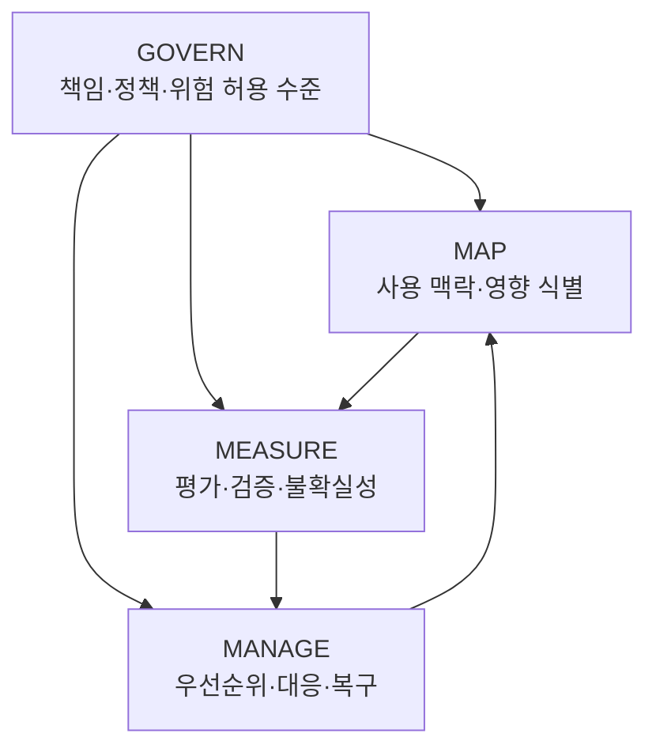

## 개요

**NIST AI RMF (AI Risk Management Framework)**는 AI 시스템의 설계·개발·배포·사용 과정에서 위험을 관리하기 위한 자발적 프레임워크입니다. 이 문서는 **AI RMF 1.0 (NIST AI 100-1, 2023년 1월)**과 **Generative AI Profile (NIST AI 600-1, 2024년 7월)**을 기준으로 AIDLC 활동을 연결합니다.

- **적용 범위:** 특정 산업이나 연방 조달에 한정되지 않습니다. 적용할 활동은 시스템의 사용 맥락, 위험 허용 수준, 조직의 책임에 따라 정합니다.
- **법적 요건과 구분:** 프레임워크의 자발적 성격과 개별 법률·기관 정책·계약의 의무는 구분합니다. AI RMF 매핑만으로 법규나 계약 준수가 증명되지는 않습니다.
- **증거 중심 운영:** 위험, 책임자, 평가 방법, 판단 근거와 잔여 위험을 연결해 기록합니다.

## 4 Functions — GOVERN, MAP, MEASURE, MANAGE

GOVERN은 나머지 세 기능에 걸쳐 적용됩니다. MAP·MEASURE·MANAGE는 순서가 고정된 인증 절차가 아니라 시스템의 수명주기 동안 반복하는 활동입니다.



아래 식별자는 [AI RMF Core의 공식 하위 항목](https://airc.nist.gov/airmf-resources/airmf/5-sec-core/) 중 일부입니다. 설명은 요약이며, AIDLC 연결은 이 문서의 적용 예시입니다.

### 1. GOVERN

**목적:** 위험 관리의 정책·책임·조직적 기반을 수립합니다.

- **GOVERN 1.1:** AI와 관련된 법률·규제 요건을 이해하고 관리·문서화합니다.
- **GOVERN 1.2:** 신뢰할 수 있는 AI의 특성을 조직 정책·절차·관행에 반영합니다.
- **GOVERN 1.3:** 조직의 위험 허용 수준에 따라 필요한 위험 관리 활동을 정합니다.
- **GOVERN 2.1:** 위험 관리 역할·책임·의사소통 경로를 명확히 기록합니다.

**AIDLC 연결:** [거버넌스 프레임워크](../../governance-framework.md)의 책임자, 검토 기준, 예외 승인 기록에 연결합니다.

### 2. MAP

**목적:** AI 시스템의 사용 맥락과 예상 영향을 이해합니다.

- **MAP 1.1:** 사용 목적·사용자·배포 환경·관련 기대와 제한을 기록합니다.
- **MAP 1.6:** 관련 이해관계자로부터 시스템 요구사항을 도출하고 이해합니다.
- **MAP 2.1:** 시스템이 지원할 과제와 구현 방법을 정의합니다.
- **MAP 4.1:** 제3자 데이터·소프트웨어를 포함한 구성요소의 기술적·법적 위험을 식별합니다.
- **MAP 5.1:** 식별한 영향의 발생 가능성과 크기를 기록합니다.

**AIDLC 연결:** Inception의 Requirements Analysis와 Reverse Engineering에서 사용 맥락, 의존성, 실패 영향을 명시합니다.

### 3. MEASURE

**목적:** 식별한 위험과 신뢰성 특성을 평가하고 측정의 한계도 기록합니다.

- **MEASURE 1.1:** 우선순위가 높은 위험의 측정 방법을 정하고 측정하지 못하는 위험을 기록합니다.
- **MEASURE 2.1:** 테스트 데이터·지표·도구 등 평가 조건을 문서화합니다.
- **MEASURE 2.3:** 배포 환경과 유사한 조건에서 성능·보증 기준을 평가합니다.
- **MEASURE 2.7:** 보안과 복원력을 평가합니다.
- **MEASURE 2.9 / 2.10 / 2.11:** 각각 설명·해석 가능성, 프라이버시 위험, 공정성·편향을 평가합니다.

**AIDLC 연결:** Construction의 Build & Test와 [하네스 엔지니어링](../../../methodology/harness-engineering.md)의 품질 게이트에 연결합니다. 코드 커버리지나 SAST 통과는 AI의 공정성·신뢰성 평가를 대신하지 않습니다.

### 4. MANAGE

**목적:** 평가 결과에 따라 위험 대응 자원을 배분하고 운영 중 개선합니다.

- **MANAGE 1.1:** 시스템이 목적을 충족하는지, 개발·배포를 진행할지 판단합니다.
- **MANAGE 1.2:** 영향·가능성·가용 자원에 따라 대응 우선순위를 정합니다.
- **MANAGE 2.3 / 2.4:** 새 위험에 대응·복구하고 필요하면 시스템을 중단·대체합니다.
- **MANAGE 3.1:** 제3자 자원의 위험과 이익을 계속 감시합니다.
- **MANAGE 4.1 / 4.3:** 배포 후 모니터링·변경·복구 계획을 실행하고 사고를 관련 당사자에게 전달합니다.

**AIDLC 연결:** Operations의 모니터링, 사고 대응, 롤백과 위험 재평가에 연결합니다.

## AI RMF 1.0과 Generative AI Profile의 관계 {#nist-ai-rmf-10--11-주요-변경사항}

| 자료 | 역할 | 활용 |
|---|---|---|
| AI RMF 1.0, 2023년 1월 | 네 기능·범주·하위 항목을 정의하는 기본 프레임워크 | 시스템별 위험 관리 활동과 증거 구조 설계 |
| NIST AI 600-1, 2024년 7월 | AI RMF 1.0의 생성형 AI용 교차 산업 프로파일 | 생성형 AI 위험과 권고 활동을 사용 맥락에 맞게 선택 |
| AI RMF Playbook | 기능별 적용을 돕는 보조 자료 | 구현 활동과 검토 질문 참고 |

Generative AI Profile은 **AI RMF 1.1이라는 별도 개정판이 아닙니다**. 이 가이드는 위에 명시한 발행본을 기준으로 하며, 도입 시에는 NIST의 발행 이력을 다시 확인합니다.

## 미국 연방 조달과 정책 이력 {#미국-연방-조달-요구사항-eo-14110}

EO 14110은 2023년 10월 30일 발행됐지만, **2025년 1월 20일 EO 14148로 철회됐습니다**. 따라서 이를 현재의 일률적인 “모든 연방 계약에 AI RMF 준수 필수” 또는 모델 학습량 보고 의무의 근거로 제시하지 않습니다. 철회 이후 개별 규정·기관 조치의 상태는 각각 확인해야 합니다.

2025년 4월 발행된 OMB M-25-21과 M-25-22는 연방 AI 사용·조달 정책을 다룹니다. 이 문서는 특정 계약의 적용 여부를 판정하지 않습니다. 프로젝트는 적용 시점의 OMB 지침·기관별 정책·조달 공고·계약 조항을 확인하고, 필요한 통제와 AI RMF 활동을 매핑합니다.

**남겨야 할 기록:** 적용 문서와 버전, 기관·계약 범위, 요구사항 식별자, 통제 책임자, 증거 위치, 검토일입니다.

## AIDLC 통합 예시

아래 YAML은 **프로젝트 내부 기록 형식의 예시**입니다. NIST 표준 스키마나 AIDLC 도구가 자동 실행하는 설정이 아닙니다. 임계값과 테스트는 해당 사용 사례에 맞게 검증하고 결정해야 합니다.

### Inception 단계: GOVERN + MAP

```yaml
project: federal-contract-ai-tool
assessment_date: "2026-09-18"
framework: "NIST AI RMF 1.0"
governance:
  references: ["GOVERN 1.1", "GOVERN 2.1"]
  responsible_team: "AI Governance Team"
  applicable_requirements: [] # Populate from the applicable contract and policy review.
context:
  references: ["MAP 1.1", "MAP 2.1", "MAP 4.1"]
  intended_use: "Generate draft backend code for human review"
  autonomous_deployment: false
  dependencies: ["model-provider", "code-repository"]
risks:
  - id: RISK-001
    description: "Generated code introduces vulnerabilities"
    planned_controls: ["security testing", "human review"]
  - id: RISK-002
    description: "Prompts disclose restricted information"
    planned_controls: ["data minimization", "access controls"]
```

### Construction 단계: MEASURE

```yaml
evaluation_plan:
  references: ["MEASURE 1.1", "MEASURE 2.1", "MEASURE 2.3"]
  dataset_revision: "replace-with-reviewed-revision"
  model_revision: "replace-with-pinned-revision"
  task_success:
    minimum_rate: 0.95 # Illustrative project threshold, not a NIST requirement.
    uncertainty: "Record sample size and a confidence interval"
  security:
    reference: "MEASURE 2.7"
    checks: ["SAST", "dependency review", "prompt injection tests"]
  privacy:
    reference: "MEASURE 2.10"
    checks: ["prompt data review", "output disclosure tests"]
  fairness:
    reference: "MEASURE 2.11"
    decision: "Define relevant groups and metrics, or document non-applicability"
  unmeasured_risks: [] # Record limitations before a release decision.
```

### Operations 단계: MANAGE

```yaml
operations_plan:
  references: ["MANAGE 2.4", "MANAGE 4.1", "MANAGE 4.3"]
  task_failure_rate:
    unit: "fraction of evaluated tasks"
    observation_window: "1h"
    warning_threshold: 0.008 # 0.8%; illustrative.
    release_limit: 0.01 # 1%; illustrative.
    minimum_evaluated_tasks: 1000 # Choose using a workload-specific sample plan.
    missing_evaluations: "Track coverage separately; do not treat as success"
  incident_response:
    owner: "on-call platform team"
    actions: ["pause automated actions", "review impact", "restore approved revision"]
    communication: "Follow the applicable incident notification plan"
  risk_review:
    triggers: ["model change", "material incident", "new use case", "scheduled review"]
```

## 참고 자료

**공식 프레임워크:**

- [NIST AI RMF 1.0](https://nvlpubs.nist.gov/nistpubs/ai/NIST.AI.100-1.pdf)
- [AI RMF Core — 기능·범주·하위 항목](https://airc.nist.gov/airmf-resources/airmf/5-sec-core/)
- [Generative AI Profile, NIST AI 600-1](https://nvlpubs.nist.gov/nistpubs/ai/NIST.AI.600-1.pdf)
- [NIST AI RMF 발행 자료](https://www.nist.gov/itl/ai-risk-management-framework)

**정책 이력·조달 참고:**

- [EO 14148 — EO 14110 철회](https://www.whitehouse.gov/presidential-actions/2025/01/initial-rescissions-of-harmful-executive-orders-and-actions/)
- [OMB M-25-21·M-25-22 발행 안내](https://www.whitehouse.gov/fact-sheets/2025/04/fact-sheet-eliminating-barriers-for-federal-artificial-intelligence-use-and-procurement/)

**관련 문서:**

- [규제 컴플라이언스 개요](../index.md)
- [거버넌스 프레임워크](../../governance-framework.md)
- [하네스 엔지니어링](../../../methodology/harness-engineering.md)
