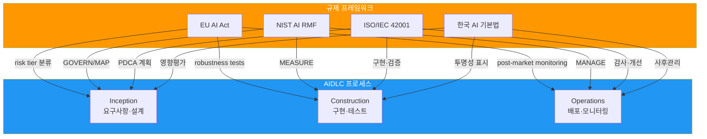

# AI 규제 프레임워크 매핑

> 📅 **작성일**: 2026-04-18 | ⏱️ **읽는 시간**: 약 8분

---

## 개요

2026년 현재, 글로벌 기업은 **여러 지역의 AI 규제를 동시에 준수**해야 하는 복잡한 환경에 직면했습니다:

- **EU**: AI Act (2024 채택, 2026-2027 단계적 적용 시작)
- **미국**: NIST AI RMF 1.1 (연방 조달 요구사항), 주별 개별 규제
- **한국**: AI 기본법 (2026 시행 예정)
- **국제 표준**: ISO/IEC 42001:2023 (AI Management System 인증)

### 왜 AIDLC 통합이 필요한가

규제 요구사항을 **AIDLC 프로세스 단계에 직접 매핑**하면:

1. **자동 준수**: 각 단계에서 필요한 controls를 자동 실행
2. **통합 감사 로그**: 단일 감사 추적 체계로 모든 규제 대응
3. **효율적 업데이트**: 규제 변화 시 AIDLC 단계 정의만 수정
4. **증거 자동 수집**: 컴플라이언스 보고서 자동 생성

---

## 4개 프레임워크 요약

### EU AI Act (2024-2027)

**핵심 특징:**
- 세계 최초 포괄적 AI 규제 (법적 구속력)
- 4단계 위험도 분류 (Prohibited/High-risk/Limited/Minimal)
- 고위험 AI 시스템 엄격한 의무 (위험 관리, 데이터 거버넌스, 기술 문서, 자동 로깅, 투명성, 인간 감독, 견고성)
- 위반 과태료: 최대 35M€ 또는 전 세계 매출의 7%

**AIDLC 적용:**
- **Inception**: Risk Tier 분류, 위험 관리 계획
- **Construction**: 기술 문서 자동 생성, 감사 로그, Robustness 테스트
- **Operations**: Post-market monitoring, 사고 보고 (15일 이내)

[상세 가이드 →](./frameworks/eu-ai-act.md)

### NIST AI RMF 1.1

**핵심 특징:**
- 미국 NIST 발표 (자발적 준수, 연방 조달 필수)
- 4 Functions: GOVERN, MAP, MEASURE, MANAGE
- Generative AI 전용 섹션 (v1.1, 2024.12)
- 국제 호환 (ISO/IEC 42001 상호 매핑 가능)

**AIDLC 적용:**
- **Inception**: GOVERN + MAP (거버넌스·위험 식별)
- **Construction**: MEASURE (성능·편향·견고성 평가)
- **Operations**: MANAGE (위험 대응·지속 모니터링)

[상세 가이드 →](./frameworks/nist-ai-rmf.md)

### ISO/IEC 42001:2023

**핵심 특징:**
- 국제 표준 AI 관리 시스템 (인증 가능)
- PDCA 기반 (Plan-Do-Check-Act 사이클)
- 9개 카테고리 72개 Controls (Annex A)
- ISMS (ISO 27001), QMS (ISO 9001)와 통합 운영 가능

**AIDLC 적용:**
- **Inception**: Plan (위험 평가·정책 수립)
- **Construction**: Do + Check (구현·검증·모니터링)
- **Operations**: Act (개선·시정 조치)

[상세 가이드 →](./frameworks/iso-42001.md)

### 한국 AI 기본법 (2026)

**핵심 특징:**
- 2026년 상반기 시행 예정
- 고영향 AI 시스템 사전 영향 평가 의무
- 생성형 AI 표시 의무 (워터마크/메타데이터 권장)
- PIPA/ISMS-P와 교차 준수

**AIDLC 적용:**
- **Inception**: 영향 평가 (고영향 AI 판정)
- **Construction**: AI 생성 코드 투명성 표시
- **Operations**: 사후 관리 (오작동 시정, 중대 사고 보고)

[상세 가이드 →](./frameworks/korea-ai-law.md)

---

## 교차 매핑 표 (Comparative Matrix)

### 통제 요소별 규제 매핑

| 통제 요소 | EU AI Act | NIST AI RMF | ISO/IEC 42001 | 한국 AI 기본법 |
|----------|-----------|-------------|---------------|---------------|
| **리스크 평가** | Art. 6, 9 (위험 관리) | MAP-3.1 | A.5.1 (정책), A.10.2 (위험 관리) | 영향 평가 (고영향 AI) |
| **데이터 거버넌스** | Art. 10 (데이터 품질) | MAP-2.1 | A.7.* (데이터 12개 controls) | PIPA 준수 |
| **투명성·설명가능성** | Art. 13 (투명성) | MEASURE-2.1 | A.8.2 (투명성), A.8.3 (설명) | 생성형 AI 표시 의무 |
| **인간 감독 (HITL)** | Art. 14 (인간 감독) | MANAGE-3.1 | A.10.5 (인간 개입) | - |
| **기술 문서** | Art. 11 (문서화) | GOVERN-1.4 | A.8.1 (문서), A.10.6 (기록) | - |
| **성능 모니터링** | Art. 15 (정확성) | MEASURE-1.1 | A.11.1 (성능 메트릭) | - |
| **사후 모니터링** | Art. 72 (post-market) | MANAGE-3.1 | A.10.10 (지속 모니터링) | 사후 관리 의무 |
| **사고 보고** | Art. 73 (15일 이내) | MANAGE-2.1 | A.10.11 (사고 대응) | 중대 사고 보고 |
| **보안** | Art. 15 (사이버보안) | MEASURE-2.3 | A.12.* (보안 10개) | ISMS-P 연계 |
| **공급망 관리** | - | GOVERN-1.5 | A.13.* (타사 6개) | - |

### AIDLC 단계별 규제 요구사항 집계

```mermaid
graph TB
    subgraph Inception["Inception 단계"]
        I1["EU AI Act: Risk Tier 분류 (Art. 6)"]
        I2["NIST: GOVERN + MAP"]
        I3["ISO 42001: Plan (PDCA)"]
        I4["한국: 영향 평가"]
    end
    
    subgraph Construction["Construction 단계"]
        C1["EU AI Act: 문서화 (Art. 11), 로깅 (Art. 12)"]
        C2["NIST: MEASURE"]
        C3["ISO 42001: Do + Check (PDCA)"]
        C4["한국: 생성 표시 의무"]
    end
    
    subgraph Operations["Operations 단계"]
        O1["EU AI Act: Post-market monitoring (Art. 72)"]
        O2["NIST: MANAGE"]
        O3["ISO 42001: Act (PDCA)"]
        O4["한국: 사후 관리"]
    end
    
    I1 -.공통 목표: 위험 식별.-> I2
    I2 -.공통 목표: 위험 식별.-> I3
    I3 -.공통 목표: 위험 식별.-> I4
    
    C1 -.공통 목표: 안전성 검증.-> C2
    C2 -.공통 목표: 안전성 검증.-> C3
    C3 -.공통 목표: 안전성 검증.-> C4
    
    O1 -.공통 목표: 지속 모니터링.-> O2
    O2 -.공통 목표: 지속 모니터링.-> O3
    O3 -.공통 목표: 지속 모니터링.-> O4
    
    style Inception fill:#4caf50,color:#fff
    style Construction fill:#2196f3,color:#fff
    style Operations fill:#ff9800,color:#fff
```

---

## 다음 단계

import DocCardList from '@theme/DocCardList';

<DocCardList />

---

## 참고 자료

### 공식 문서

**EU AI Act:**
- [Regulation (EU) 2024/1689 (Official Text)](https://eur-lex.europa.eu/legal-content/EN/TXT/?uri=CELEX:32024R1689)
- [EU AI Act Timeline (European Commission)](https://digital-strategy.ec.europa.eu/en/policies/regulatory-framework-ai)

**NIST AI RMF:**
- [NIST AI RMF 1.1 (2024.12)](https://www.nist.gov/itl/ai-risk-management-framework)
- [Executive Order 14110 (White House)](https://www.whitehouse.gov/briefing-room/presidential-actions/2023/10/30/executive-order-on-the-safe-secure-and-trustworthy-development-and-use-of-artificial-intelligence/)

**ISO/IEC 42001:**
- [ISO/IEC 42001:2023 (ISO Store)](https://www.iso.org/standard/81230.html)
- [ISO 42001 Implementation Guide (BSI)](https://www.bsigroup.com/en-GB/iso-42001-artificial-intelligence-management-system/)

**한국 AI 기본법:**
- [과학기술정보통신부 AI 정책](https://www.msit.go.kr/bbs/list.do?sCode=user&mId=113&mPid=112)
- [개인정보보호법 (PIPA)](https://www.pipc.go.kr/np/default/page.do?mCode=D030010000)

### AWS 관련 자료

- [AWS Artifact (Compliance Reports)](https://aws.amazon.com/artifact/) — EU AI Act, ISO 42001 대응 보고서
- [AWS Compliance Center](https://aws.amazon.com/compliance/programs/) — 지역별 규제 매핑
- [Amazon Bedrock Guardrails](https://docs.aws.amazon.com/bedrock/latest/userguide/guardrails.html) — 런타임 가드레일 구현

### 관련 AIDLC 문서

- [거버넌스 프레임워크](../governance-framework.md) — 3층 거버넌스 모델, 스티어링 파일
- [하네스 엔지니어링](../../methodology/harness-engineering.md) — Quality Gates, 독립 검증 원칙
- [Adaptive Execution](../../methodology/adaptive-execution.md) — AIDLC 단계별 실행 조건
- [도입 전략](../adoption-strategy.md) — 조직별 AIDLC 도입 로드맵
