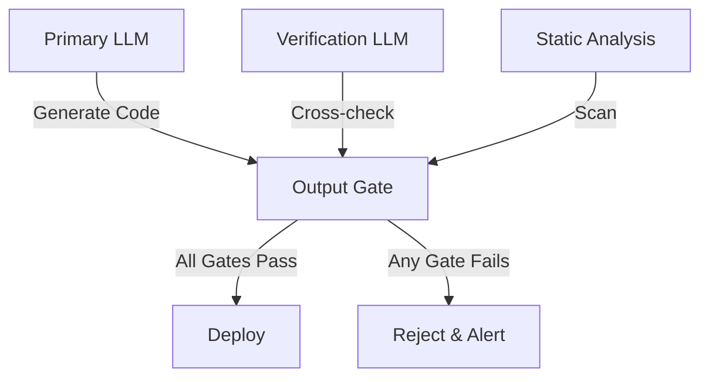
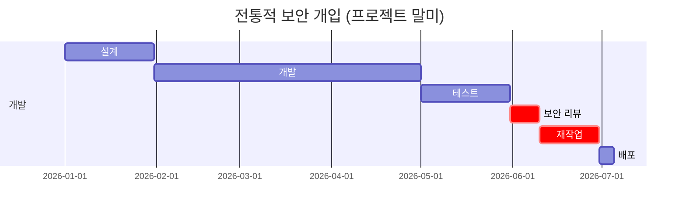
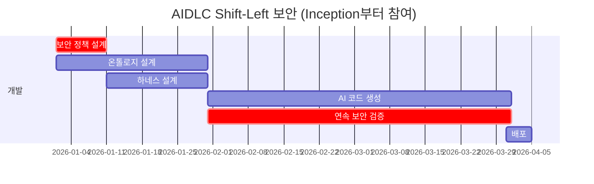
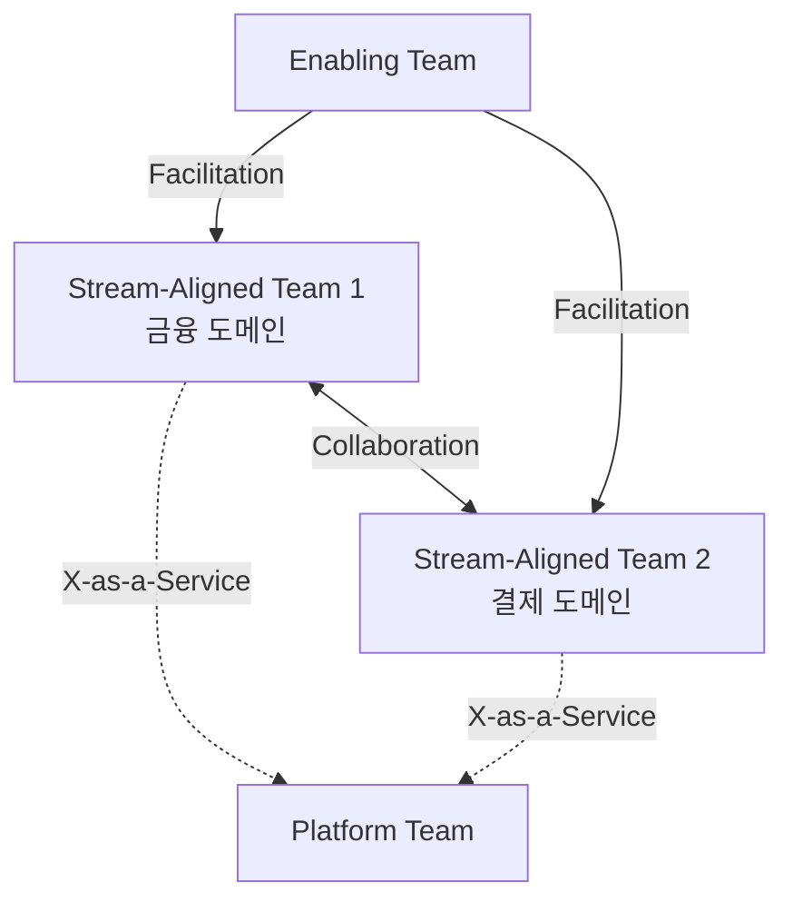

# 역할 재정의

AIDLC는 코드 생성 자동화를 통해 전통적인 SI 팀 구조를 근본적으로 변화시킨다. 핵심 통찰은 **AI가 코드 생성을 담당하면, 인간은 하네스 설계, 온톨로지 관리, AI 출력 검증으로 전환**한다는 것이다.

## 전통적 SI 역할 모델

전통적인 SI 프로젝트는 순차적 핸드오프 구조로 운영된다:


### 역할별 책임

- **프로젝트 매니저**: 범위 정의, 일정 관리, 고객 커뮤니케이션
- **설계자**: 아키텍처 설계, 기술 스택 선정, 인터페이스 정의
- **개발자**: 코드 작성, 단위 테스트, 통합 개발 (팀의 60~70%)
- **QA**: 테스트 케이스 작성, 수동 테스트, 결함 추적 (팀의 15~20%)
- **보안 담당자**: 프로젝트 말미에 취약점 스캔, 보안 리뷰 (프로젝트당 1~2명)

### 문제점

1. **순차적 핸드오프**: 각 단계에서 컨텍스트 손실 발생
2. **늦은 보안 개입**: 프로젝트 끝에서 취약점 발견 시 재작업 비용 급증
3. **개발자 병목**: 전체 팀의 대부분이 코드 작성에 투입되지만 생산성은 개인 역량에 의존
4. **테스트 지연**: QA가 개발 완료 후 시작되어 피드백 사이클 길어짐

## AIDLC 역할 전환

AIDLC 방법론에서는 역할이 근본적으로 재정의된다:

| 전통적 역할 | AIDLC 역할 | 변화 내용 |
|------------|-----------|---------|
| 프로젝트 매니저 | Intent Architect | 비즈니스 의도를 AI가 이해할 수 있는 구조화된 명세로 정의 |
| 설계자 | 온톨로지 스튜어드 | 도메인 온톨로지 설계·진화 관리, 지식 그래프 큐레이션 |
| 개발자 | 하네스 엔지니어 | 코드 작성 → 하네스 설계로 전환 (서킷 브레이커, 품질 게이트) |
| QA | AI 검증자 | 수동 테스트 → AI 생성 테스트의 품질 검증, 하네스 효과성 측정 |
| 보안 담당자 | Shift-Left 보안 | 프로젝트 끝 → Inception 단계로 이동, 하네스 보안 정책 설계 |

### Intent Architect

**전통적 PM**은 범위와 일정을 관리했지만, **Intent Architect**는 비즈니스 의도를 AI가 실행 가능한 구조로 변환한다.

#### 핵심 역량
- 고객 요구사항을 도메인 온톨로지 엔티티로 매핑
- 의도 명세 작성 (structured intent specification)
- AI 생성 결과가 비즈니스 의도와 일치하는지 검증
- 변경 요청을 온톨로지 패치로 표현

#### 도구
- 온톨로지 시각화 도구 (Neo4j Bloom, GraphXR)
- 의도 명세 템플릿 (YAML/JSON schema)
- 비즈니스 룰 엔진 (Drools, DMN)

### 온톨로지 스튜어드

**전통적 설계자**는 기술 아키텍처를 설계했지만, **온톨로지 스튜어드**는 도메인 지식 구조를 설계하고 진화시킨다.

#### 핵심 역량
- 도메인 온톨로지 설계 (엔티티, 관계, 제약 조건)
- 온톨로지 버전 관리 및 마이그레이션
- 다중 도메인 온톨로지 통합 (금융+결제, 의료+보험)
- 온톨로지 품질 검증 (일관성, 완전성, 모호성 제거)

#### 도구
- 온톨로지 편집기 (Protégé, WebVOWL)
- 그래프 데이터베이스 (Neo4j, Amazon Neptune)
- RDF/OWL 변환 도구

#### 전통적 설계자와의 차이

| 측면 | 전통적 설계자 | 온톨로지 스튜어드 |
|-----|------------|----------------|
| 산출물 | API 명세, ERD | 온톨로지 스키마, 지식 그래프 |
| 도구 | UML, Swagger | Protégé, Neo4j |
| 검증 방법 | 기술 리뷰 | 추론 엔진 검증 (reasoning) |
| 변경 관리 | 버전 관리 (Git) | 온톨로지 패치 (semantic diff) |

자세한 내용은 [온톨로지 엔지니어링](../methodology/ontology-engineering.md)을 참고한다.

## 하네스 엔지니어 역할 상세

### 패러다임 전환: "코드 생성은 AI, 인간은 하네스 설계자"

OpenAI Codex 사례에서 100만 줄 이상의 코드가 AI로 생성되었지만, **인간 엔지니어는 하네스 설계에 집중**하여 품질과 안정성을 보장했다.

> "We don't write code anymore. We design guardrails and circuit breakers that keep AI-generated code safe and aligned with business intent."  
> — Production Engineering Team, OpenAI (2024)

### 핵심 역량

#### 1. 서킷 브레이커 설계

AI 생성 코드가 예상치 못한 동작을 할 때 자동으로 중단하는 메커니즘 설계:

```yaml
# 예시: API 호출 서킷 브레이커
circuit_breaker:
  failure_threshold: 5
  timeout_seconds: 30
  fallback_strategy: cached_response
  monitoring:
    - metric: error_rate
      threshold: 0.05
      window: 5m
```

#### 2. 재시도 예산 관리

AI 에이전트의 재시도 횟수와 비용을 제한:

```yaml
# 예시: LLM 호출 재시도 예산
retry_budget:
  max_attempts: 3
  backoff_strategy: exponential
  cost_limit_usd: 0.50
  circuit_breaker:
    - condition: token_count > 8000
      action: switch_to_smaller_model
```

#### 3. 출력 게이트 정의

AI 생성 결과가 프로덕션으로 배포되기 전에 통과해야 하는 검증 게이트:

```yaml
# 예시: 코드 생성 출력 게이트
output_gates:
  - name: security_scan
    tools: [semgrep, bandit]
    blocking: true
  - name: unit_test_coverage
    threshold: 0.85
    blocking: true
  - name: performance_regression
    baseline: p95_latency_100ms
    blocking: false
    alert: slack_channel
```

#### 4. 독립 검증 구조

AI 생성 결과를 다른 AI 모델이나 독립적인 도구로 교차 검증:



### 전통적 개발자와의 차이

| 측면 | 전통적 개발자 | 하네스 엔지니어 |
|-----|------------|--------------|
| 주요 활동 | 코드 작성 (80%) | 하네스 설계 (70%), 검증 (30%) |
| 생산성 지표 | 커밋 수, LOC | 하네스 적중률, 결함 방지율 |
| 기술 스택 | 프로그래밍 언어 | YAML/JSON DSL, 모니터링 도구 |
| 디버깅 방식 | 코드 읽기 | 하네스 로그 분석, AI 의사결정 추적 |
| 협업 방식 | 코드 리뷰 | 하네스 리뷰, 온톨로지 싱크 |

자세한 내용은 [하네스 엔지니어링](../methodology/harness-engineering.md)을 참고한다.

## AI 검증자

**전통적 QA**는 수동 테스트를 실행했지만, **AI 검증자**는 AI가 생성한 테스트의 품질을 검증하고, 하네스가 실제로 결함을 방지하는지 측정한다.

### 핵심 역량

#### 1. AI 생성 테스트 품질 검증
- 테스트 케이스 커버리지 분석 (엣지 케이스 누락 확인)
- 테스트 데이터 다양성 검증 (boundary, negative, fuzzing)
- 플레이키 테스트 식별 및 제거

#### 2. 하네스 효과성 측정
- 서킷 브레이커 적중률 (false positive/negative 비율)
- 출력 게이트 블록률 (어떤 게이트가 가장 많은 결함을 방지하는가)
- 재시도 예산 소진 패턴 (어떤 시나리오에서 재시도가 빈번한가)

#### 3. 독립 검증 설계
- Primary LLM과 다른 모델로 교차 검증
- 정적 분석 도구와 AI 판단의 일치도 측정
- 프로덕션 데이터와 생성 데이터의 분포 비교

### 전통적 QA와의 차이

| 측면 | 전통적 QA | AI 검증자 |
|-----|---------|---------|
| 테스트 작성 | 수동 작성 (80%) | AI 생성 검증 (90%) |
| 결함 발견 방식 | 수동 실행 | 하네스 로그 분석 |
| 커버리지 목표 | 라인 커버리지 | 의도 커버리지 (intent coverage) |
| 회귀 테스트 | 전체 실행 | 하네스가 자동 선별 |

## 팀 구성 비율 변화

AIDLC 도입으로 팀 구성 비율이 근본적으로 변화한다.

### 소형 프로젝트 (5명)

| 전통적 비율 | AIDLC 비율 |
|-----------|----------|
| PM 1명 (20%) | Intent Architect 1명 (20%) |
| 개발자 3명 (60%) | 하네스 엔지니어 2명 (40%) |
| QA 1명 (20%) | AI 검증자 1명 (20%) |
| - | 온톨로지 스튜어드 1명 (20%) |

**변화 해석**: 개발자 3명 → 하네스 엔지니어 2명으로 축소 가능. 하네스 엔지니어 1명이 AI를 활용하여 전통적 개발자 1.5명분의 산출물을 생성한다.

### 중형 프로젝트 (15명)

| 전통적 비율 | AIDLC 비율 |
|-----------|----------|
| PM 2명 (13%) | Intent Architect 2명 (13%) |
| 설계자 2명 (13%) | 온톨로지 스튜어드 2명 (13%) |
| 개발자 8명 (53%) | 하네스 엔지니어 6명 (40%) |
| QA 2명 (13%) | AI 검증자 3명 (20%) |
| 보안 1명 (7%) | Shift-Left 보안 2명 (13%) |

**변화 해석**:
- 개발자 8명 → 하네스 엔지니어 6명: AI가 코드 생성 담당, 인간은 하네스 설계
- QA 2명 → AI 검증자 3명: 수동 테스트 감소, 하네스 검증 증가
- 보안 1명 → 2명: Shift-Left로 Inception 단계부터 투입

### 대형 프로젝트 (50명)

| 전통적 비율 | AIDLC 비율 |
|-----------|----------|
| PM 5명 (10%) | Intent Architect 5명 (10%) |
| 설계자 5명 (10%) | 온톨로지 스튜어드 6명 (12%) |
| 개발자 30명 (60%) | 하네스 엔지니어 20명 (40%) |
| QA 7명 (14%) | AI 검증자 10명 (20%) |
| 보안 3명 (6%) | Shift-Left 보안 9명 (18%) |

**변화 해석**:
- 개발자 30명 → 하네스 엔지니어 20명: **33% 인력 감축** 또는 **동일 인력으로 50% 더 많은 기능 개발**
- 보안 3명 → 9명: Shift-Left로 인력 3배 증가, 하지만 프로젝트 말미 재작업 비용 90% 감축
- 온톨로지 스튜어드 6명: 복잡한 도메인 온톨로지 관리 (금융, 의료, 물류 통합)

### 비용 효과

| 프로젝트 규모 | 전통적 비용 | AIDLC 비용 | 절감 효과 |
|------------|----------|-----------|---------|
| 소형 (5명) | 100% | 85% | 15% 절감 |
| 중형 (15명) | 100% | 75% | 25% 절감 |
| 대형 (50명) | 100% | 67% | 33% 절감 |

자세한 비용 분석은 [비용 효과](./cost-estimation.md)를 참고한다.

## 보안 Shift-Left

전통적으로 보안 담당자는 **프로젝트 말미**에 투입되어 취약점 스캔을 수행했다. 문제 발견 시 대규모 재작업이 발생하고, 일정 지연과 비용 증가를 초래했다.

### 전통적 보안 개입 타이밍



**문제점**:
- 보안 취약점을 개발 완료 후 발견 → 재작업 비용 10배 증가
- 보안 리뷰가 배포 블로커로 작용 → 일정 지연
- 보안 담당자와 개발자 간 컨텍스트 미스매치

### AIDLC Shift-Left 보안



**효과**:
- 보안 정책이 하네스에 내장 → 코드 생성 시점부터 보안 규칙 적용
- 연속 보안 검증 → 취약점을 즉시 발견하고 자동 수정
- 재작업 비용 **90% 감축** (NIST 연구: Shift-Left 효과)

### Shift-Left 보안 역할

#### Inception 단계
- 도메인 온톨로지에 보안 제약 조건 정의
- 보안 정책을 하네스 YAML로 작성
- 위협 모델링 (STRIDE, DREAD)

#### 개발 단계
- 하네스가 AI 생성 코드를 실시간 검증
- 취약점 발견 시 자동 알림 및 수정 제안
- 보안 게이트 모니터링 (SAST, DAST, SCA)

#### 배포 단계
- 프로덕션 하네스 정책 최종 검증
- 런타임 보안 모니터링 설정 (RASP, WAF)

### 보안 하네스 예시

```yaml
# 예시: SQL Injection 방어 하네스
security_harness:
  - name: sql_injection_guard
    trigger: ai_generates_sql_query
    checks:
      - type: static_analysis
        tools: [semgrep, sqlmap]
      - type: parameterized_query_validation
        enforce: true
      - type: input_sanitization
        allowed_patterns: [alphanumeric, underscore]
    action_on_failure: block_and_alert
    fallback: use_orm_instead
```

## 팀 토폴로지 패턴

AIDLC 조직은 Team Topologies (Matthew Skelton, Manuel Pais) 패턴을 따른다:

### Stream-Aligned Team

**목적**: 특정 비즈니스 도메인의 end-to-end 가치 흐름 구현

**구성**:
- Intent Architect 1명
- 온톨로지 스튜어드 1명
- 하네스 엔지니어 3~5명
- AI 검증자 1~2명
- Shift-Left 보안 1명 (겸직 가능)

**책임**:
- 도메인 온톨로지 소유
- 하네스 설계 및 구현
- AI 생성 코드 검증 및 배포

### Platform Team

**목적**: 하네스 인프라, AI 모델 서빙, 온톨로지 저장소 운영

**구성**:
- Platform Engineer 3~5명
- MLOps Engineer 2~3명
- 온톨로지 아키텍트 1~2명

**책임**:
- 하네스 프레임워크 개발 및 유지보수
- AI 모델 배포 파이프라인 관리
- 온톨로지 저장소 (Neo4j, Amazon Neptune) 운영
- 공통 하네스 라이브러리 제공

### Enabling Team

**목적**: Stream-Aligned Team의 AIDLC 역량 강화

**구성**:
- AIDLC 코치 2~3명
- 온톨로지 트레이너 1~2명
- 하네스 베스트 프랙티스 큐레이터 1명

**책임**:
- AIDLC 방법론 교육
- 온톨로지 설계 워크샵 운영
- 하네스 패턴 라이브러리 큐레이션
- 팀 간 지식 공유 촉진

### 팀 상호작용 모드



- **X-as-a-Service**: Platform Team이 하네스 인프라를 서비스로 제공
- **Facilitation**: Enabling Team이 일시적으로 Stream-Aligned Team 지원
- **Collaboration**: 온톨로지 통합 시 Stream-Aligned Team 간 협업

## 도입 전략

역할 전환은 점진적으로 진행한다. 자세한 로드맵은 [도입 전략](./adoption-strategy.md)을 참고한다.

### Phase 1: 파일럿 (1개 팀, 3개월)
- 전통적 개발자 중 자원자 선발 → 하네스 엔지니어 교육
- 소규모 프로젝트에 AIDLC 적용
- 하네스 패턴 라이브러리 초기 구축

### Phase 2: 확장 (3~5개 팀, 6개월)
- Platform Team 구성 → 하네스 인프라 표준화
- Enabling Team 구성 → 조직 전체 교육 시작
- 온톨로지 스튜어드 역할 정립 (도메인별)

### Phase 3: 전사 도입 (전체 조직, 12개월)
- Stream-Aligned Team 재편 (도메인별)
- Shift-Left 보안 조직 확대
- AIDLC CoE (Center of Excellence) 운영

## 성공 지표

역할 전환 성공 여부를 측정하는 지표:

### 팀 수준
- **하네스 적중률**: 하네스가 실제 결함을 방지한 비율 (목표: 80% 이상)
- **AI 코드 생성 비율**: 전체 코드 중 AI가 생성한 비율 (목표: 70% 이상)
- **온톨로지 재사용률**: 기존 온톨로지 엔티티 재사용 비율 (목표: 60% 이상)

### 조직 수준
- **개발 인력 효율성**: 동일 인력으로 구현 가능한 기능 수 (목표: 50% 증가)
- **보안 재작업 비율**: 보안 취약점 수정에 소요되는 시간 비율 (목표: 5% 이하)
- **프로젝트 일정 준수율**: 계획 대비 일정 준수 비율 (목표: 90% 이상)

## 참고 자료

- [하네스 엔지니어링](../methodology/harness-engineering.md) — 하네스 설계 가이드
- [온톨로지 엔지니어링](../methodology/ontology-engineering.md) — 온톨로지 스튜어드 역할 상세
- [도입 전략](./adoption-strategy.md) — 점진적 역할 전환 로드맵
- [비용 효과](./cost-estimation.md) — 팀 구성 비율 변화의 비용 영향
- Team Topologies (Matthew Skelton, Manuel Pais, 2019)
- "The Cost of Fixing Bugs: Shift-Left vs Shift-Right" (NIST, 2023)
