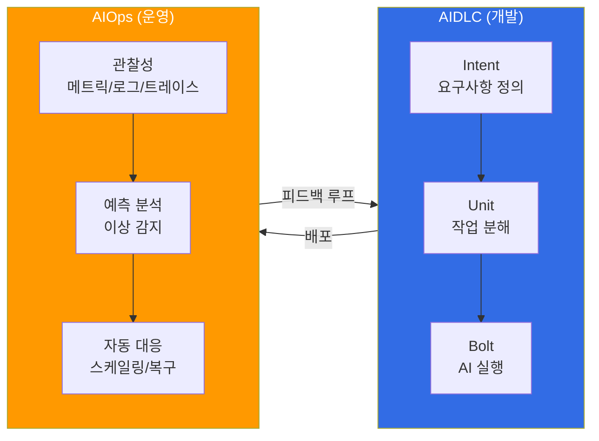

# AIDLC: AI-Driven Development Lifecycle

> **읽는 시간**: 약 3분

AIDLC(AI-Driven Development Lifecycle)는 AI가 소프트웨어 개발의 전 과정을 주도하는 새로운 개발 방법론입니다. 기존 SDLC(Software Development Lifecycle)가 사람 중심의 프로세스였다면, AIDLC는 **Intent → Unit → Bolt** 모델을 통해 AI가 요구사항 분석부터 설계, 구현, 테스트까지 개발 주기 전체를 가속합니다.

## 핵심 개념

AIDLC는 세 가지 핵심 축으로 구성됩니다:

- **Intent(의도)**: 사람이 자연어로 요구사항과 비즈니스 의도를 정의합니다. Kiro의 Spec-driven 개발(requirements → design → tasks → 코드)이 이 단계를 지원합니다.
- **Unit(단위)**: AI가 의도를 실행 가능한 단위 작업으로 분해합니다. DDD(Domain-Driven Design)와 BDD/TDD를 결합하여 품질을 보장합니다.
- **Bolt(실행)**: AI가 코드 생성, 테스트 작성, 배포 파이프라인 구성까지 자동으로 실행합니다.

## 신뢰성 듀얼 축: 온톨로지 × 하네스

AI 생성 코드의 신뢰성을 체계적으로 보장하기 위해 AIDLC는 두 축의 신뢰성 프레임워크를 도입합니다:

- **온톨로지(WHAT + WHEN)**: 도메인 지식을 형식화한 typed world model. 자체 피드백 루프(Inner/Middle/Outer)를 통해 지속적으로 진화하는 살아있는 모델로, AI 환각을 방지합니다.
- **하네스 엔지니어링(HOW)**: 온톨로지가 정의한 제약을 아키텍처적으로 검증/강제하는 구조

## AIDLC 10가지 원칙

AIDLC 프레임워크는 AI 기반 개발을 체계화하는 10가지 원칙을 정의합니다. 상세 내용은 [AIDLC 프레임워크](./aidlc-framework.md)에서 다룹니다.

## 개발 이후: 운영과 피드백 루프

AIDLC로 소프트웨어를 개발한 이후, 실제 운영 환경에서의 **지속적 개선과 피드백 루프**가 필요합니다. 이를 위한 접근 방법으로 [AIOps](/docs/aidlc/agentic-ops)를 참조하세요. AIOps는 AI를 활용하여 운영 관찰성, 예측 스케일링, 자동 복구 등 운영 효율화를 위한 피드백 루프를 체계적으로 구축하는 방법론입니다.

:::info 학습 경로
1. [AIDLC 프레임워크](./aidlc-framework.md) — 10가지 원칙, Intent→Unit→Bolt 모델, DDD 통합, EKS 역량 매핑
2. [AIOps](/docs/aidlc/agentic-ops) — 개발 이후 운영 피드백 루프 구축
:::

## 참고 자료

- [AWS AI-Driven Development Life Cycle](https://aws.amazon.com/blogs/devops/ai-driven-development-life-cycle/)
- [AWS Labs AIDLC Workflows (GitHub)](https://github.com/awslabs/aidlc-workflows)
