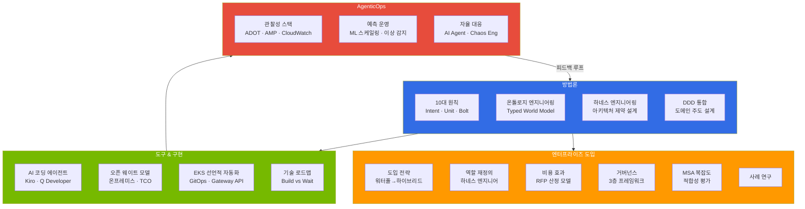

# AIDLC: AI-Driven Development Lifecycle

> **읽는 시간**: 약 3분

:::info 공식 AIDLC 레퍼런스
본 섹션은 [AWS Labs AIDLC Workflows](https://github.com/awslabs/aidlc-workflows) (v0.1.7, 2026-04-02) 를 기반으로 DDD·Ontology·Harness 확장을 덧붙였습니다. 공식 용어(User Request/Requirements, Unit of Work)와 engineering-playbook 용어(Intent, Unit, Bolt)의 매핑은 [10대 원칙과 실행 모델](./methodology/principles-and-model.md#12-aws-labs-aidlc-공식-용어-매핑) 에서 확인하세요.
:::

AIDLC(AI-Driven Development Lifecycle)는 AI가 소프트웨어 개발의 전 과정을 주도하는 새로운 개발 방법론입니다. 기존 SDLC가 사람 중심의 프로세스였다면, AIDLC는 **Intent → Unit → Bolt** 모델을 통해 AI가 요구사항 분석부터 설계, 구현, 테스트까지 개발 주기 전체를 가속합니다.

**AIDLC 정의 & SDLC 비교 상세**: [10대 원칙과 실행 모델](/docs/aidlc/methodology/principles-and-model) 참조

## 4개 트랙

AIDLC 가이드는 독자의 역할과 관심사에 따라 4개 트랙으로 구성됩니다.

## 독자별 학습 경로

| 역할 | 추천 경로 |
|------|----------|
| **경영진 · PM** | [엔터프라이즈 도입](/docs/aidlc/enterprise) → [비용 효과](/docs/aidlc/enterprise/cost-estimation) → [사례 연구](/docs/aidlc/enterprise/case-studies) |
| **아키텍트** | [방법론](/docs/aidlc/methodology) → [온톨로지](/docs/aidlc/methodology/ontology-engineering) → [하네스](/docs/aidlc/methodology/harness-engineering) → [MSA 복잡도](/docs/aidlc/enterprise/msa-complexity) |
| **개발자** | [10대 원칙](/docs/aidlc/methodology/principles-and-model) → [DDD 통합](/docs/aidlc/methodology/ddd-integration) → [AI 코딩 에이전트](/docs/aidlc/toolchain/ai-coding-agents) |
| **운영팀 · SRE** | [AgenticOps](/docs/aidlc/operations) → [관찰성](/docs/aidlc/operations/observability-stack) → [자율 대응](/docs/aidlc/operations/autonomous-response) |
| **보안 · 컴플라이언스** | [거버넌스](/docs/aidlc/enterprise/governance-framework) → [하네스 엔지니어링](/docs/aidlc/methodology/harness-engineering) → [오픈 웨이트 모델](/docs/aidlc/toolchain/open-weight-models) |

## 핵심 개념

### 신뢰성 듀얼 축: 온톨로지 × 하네스

AI 생성 코드의 신뢰성을 체계적으로 보장하기 위해 AIDLC는 두 축의 프레임워크를 도입합니다. 온톨로지가 "무엇을 검증할지"를 정의하면, 하네스가 "어떻게 검증할지"를 구현하는 상호보완 구조입니다.

→ 상세는 [온톨로지 엔지니어링](/docs/aidlc/methodology/ontology-engineering) · [하네스 엔지니어링](/docs/aidlc/methodology/harness-engineering)

## 참고 자료

### 공식 레퍼런스
- [AWS Labs AIDLC Workflows](https://github.com/awslabs/aidlc-workflows) — 공식 저장소 (v0.1.7)
- [AWS Labs Common Rules](https://github.com/awslabs/aidlc-workflows/tree/main/aws-aidlc-rule-details/common) — 11개 공통 규칙
- [AWS Labs Inception Stages](https://github.com/awslabs/aidlc-workflows/tree/main/aws-aidlc-rule-details/inception) — 7 stage Adaptive Execution
- [AWS Labs Extensions](https://github.com/awslabs/aidlc-workflows/tree/main/aws-aidlc-rule-details/extensions) — opt-in 확장 메커니즘
- [AWS AI-Driven Development Life Cycle Blog](https://aws.amazon.com/blogs/devops/ai-driven-development-life-cycle/)
- [Open-Sourcing Adaptive Workflows for AI-DLC](https://aws.amazon.com/blogs/devops/open-sourcing-adaptive-workflows-for-ai-driven-development-life-cycle-ai-dlc/)
