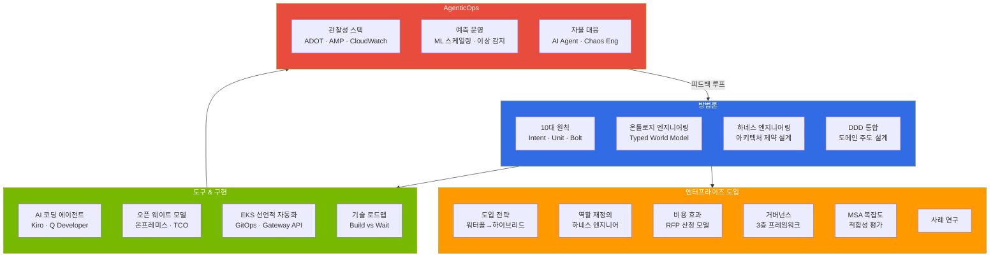

# AIDLC: AI-Driven Development Lifecycle

:::info 공식 AIDLC 레퍼런스
본 섹션은 [AWS Labs AIDLC Workflows](https://github.com/awslabs/aidlc-workflows) (v0.1.7, 2026-04-02) 를 기반으로 DDD·Ontology·Harness 확장을 덧붙였습니다. 공식 용어(User Request/Requirements, Unit of Work)와 engineering-playbook 용어(Intent, Unit, Bolt)의 매핑은 [10대 원칙과 실행 모델](./methodology/principles-and-model.md#12-aws-labs-aidlc-공식-용어-매핑) 에서 확인하세요.
:::

AIDLC(AI-Driven Development Lifecycle)는 **Intent → Unit → Bolt** 모델로 AI를 활용한 요구사항 분석, 설계, 구현, 테스트를 구성합니다. Intent는 달성할 업무 목표이고, Unit은 그 목표를 나눈 작업 단위이며, Bolt는 작업을 수행하는 짧은 반복 주기입니다. AI가 계획과 산출물을 제안하면 사람이 프로젝트의 요구사항과 제약에 맞는지 검토합니다.

**AIDLC 정의 & SDLC 비교 상세**: [10대 원칙과 실행 모델](/docs/aidlc/methodology/principles-and-model) 참조

## 4개 트랙

AIDLC 가이드는 독자의 역할과 관심사에 따라 4개 트랙으로 구성됩니다.

```mermaid
flowchart TB
    subgraph METHOD["방법론"]
        direction TB
        P["10대 원칙<br/>Intent · Unit · Bolt"]
        O["온톨로지 엔지니어링<br/>Typed World Model"]
        H["하네스 엔지니어링<br/>아키텍처 제약 설계"]
        D["DDD 통합<br/>도메인 주도 설계"]
    end

    subgraph ENTER["엔터프라이즈 도입"]
        direction TB
        A["도입 전략<br/>워터폴→하이브리드"]
        R["역할 재정의<br/>하네스 엔지니어"]
        C["비용 효과<br/>RFP 산정 모델"]
        G["거버넌스<br/>3층 프레임워크"]
        M["MSA 복잡도<br/>적합성 평가"]
        CS["사례 연구"]
    end

    subgraph TOOL["도구 & 구현"]
        direction TB
        AI["AI 코딩 에이전트<br/>Kiro · Q Developer"]
        OW["오픈 웨이트 모델<br/>온프레미스 · TCO"]
        EKS["EKS 선언적 자동화<br/>GitOps · Gateway API"]
        TR["기술 로드맵<br/>Build vs Wait"]
    end

    subgraph OPS["AgenticOps"]
        direction TB
        OB["관찰성 스택<br/>ADOT · AMP · CloudWatch"]
        PR["예측 운영<br/>ML 스케일링 · 이상 감지"]
        AR["자율 대응<br/>AI Agent · Chaos Eng"]
    end

    METHOD --> TOOL
    METHOD --> ENTER
    TOOL --> OPS
    OPS -->|"피드백 루프"| METHOD

    style METHOD fill:#326ce5,color:#fff
    style ENTER fill:#ff9900,color:#fff
    style TOOL fill:#76b900,color:#fff
    style OPS fill:#e74c3c,color:#fff
```

## 독자별 학습 경로

| 역할 | 추천 경로 |
|------|----------|
| **경영진 · PM** | [엔터프라이즈 도입](/docs/aidlc/enterprise) → [비용 효과](/docs/aidlc/enterprise/cost-estimation) → [사례 연구](/docs/aidlc/enterprise/case-studies) |
| **아키텍트** | [방법론](/docs/aidlc/methodology) → [온톨로지](/docs/aidlc/methodology/ontology-engineering) → [하네스](/docs/aidlc/methodology/harness-engineering) → [MSA 복잡도](/docs/aidlc/enterprise/msa-complexity) |
| **개발자** | [10대 원칙](/docs/aidlc/methodology/principles-and-model) → [DDD 통합](/docs/aidlc/methodology/ddd-integration) → [AI 코딩 에이전트](/docs/aidlc/toolchain/ai-coding-agents) |
| **운영팀 · SRE** | [AgenticOps](/docs/aidlc/operations) → [관찰성](/docs/aidlc/operations/observability-stack) → [자율 대응](/docs/aidlc/operations/autonomous-response) |
| **보안 · 컴플라이언스** | [거버넌스](/docs/aidlc/enterprise/governance-framework) → [하네스 엔지니어링](/docs/aidlc/methodology/harness-engineering) → [오픈 웨이트 모델](/docs/aidlc/toolchain/open-weight-models) |

## 핵심 개념

### 신뢰성 듀얼 축: 온톨로지 × 하네스

이 플레이북의 선택적 신뢰성 프레임워크는 업무 규칙의 정의와 그 규칙을 검사하는 실행 제어를 구분합니다. [온톨로지](/docs/aidlc/methodology/ontology-engineering)는 개념·관계·제약을 스키마로 정리하고, Inner/Middle/Outer 피드백 루프에서 얻은 정보를 정의를 갱신하는 데 사용합니다. [하네스 엔지니어링](/docs/aidlc/methodology/harness-engineering)은 circuit breaker, 재시도 예산, 출력 게이트 같은 검사와 실행 한도를 구현합니다. 신뢰성은 어떤 규칙을 실제로 적용하고, 그 제어를 어떻게 검증했는지에 따라 달라집니다.

## 참고 자료

### 공식 레퍼런스
- [AWS Labs AIDLC Workflows](https://github.com/awslabs/aidlc-workflows) — 공식 저장소 (v0.1.7)
- [AWS Labs Common Rules](https://github.com/awslabs/aidlc-workflows/tree/v0.1.7/aidlc-rules/aws-aidlc-rule-details/common) — 11개 공통 규칙
- [AWS Labs Inception Stages](https://github.com/awslabs/aidlc-workflows/tree/v0.1.7/aidlc-rules/aws-aidlc-rule-details/inception) — 7 stage Adaptive Execution
- [AWS Labs Extensions](https://github.com/awslabs/aidlc-workflows/tree/v0.1.7/aidlc-rules/aws-aidlc-rule-details/extensions) — opt-in 확장 메커니즘
- [AWS AI-Driven Development Life Cycle Blog](https://aws.amazon.com/blogs/devops/ai-driven-development-life-cycle/)
- [Open-Sourcing Adaptive Workflows for AI-DLC](https://aws.amazon.com/blogs/devops/open-sourcing-adaptive-workflows-for-ai-driven-development-life-cycle-ai-dlc/)
