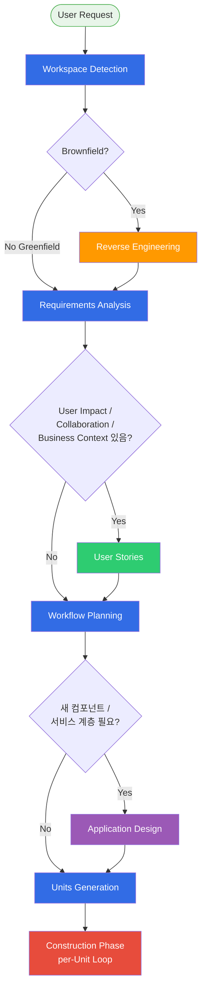
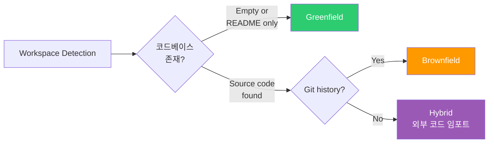
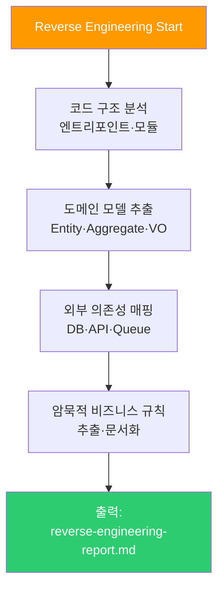
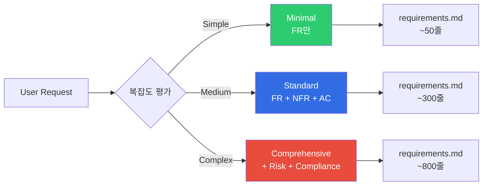
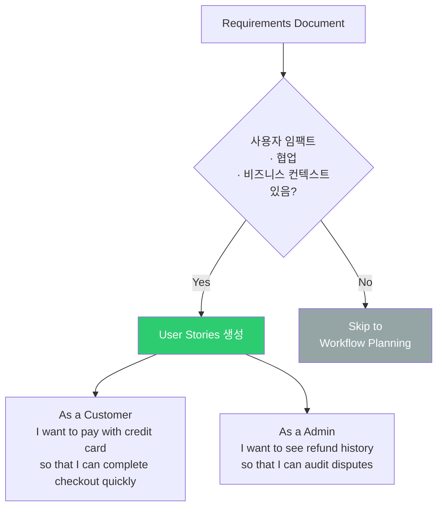
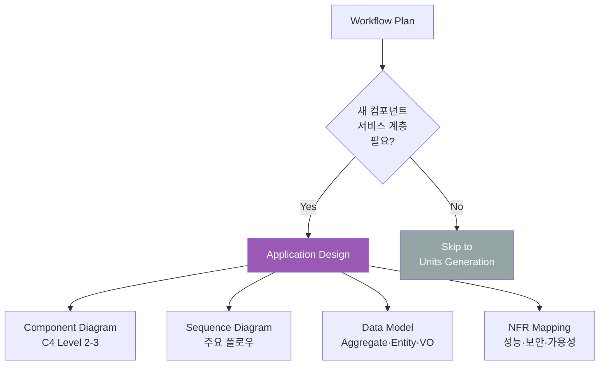
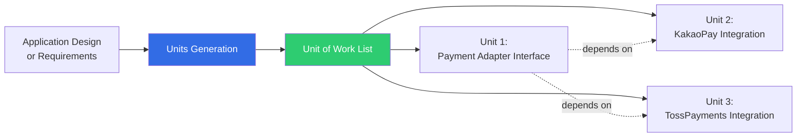
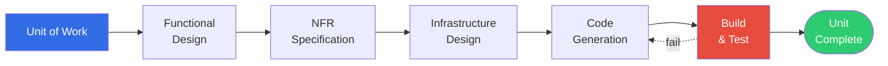
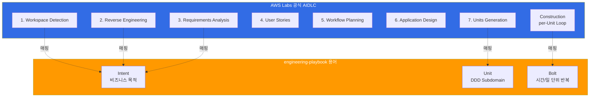

# AIDLC Adaptive Execution

> 📅 **작성일**: 2026-04-18 | ⏱️ **읽는 시간**: 약 20분

---

## 1. 개요: 왜 Adaptive 인가

AWS Labs [AIDLC Workflows](https://github.com/awslabs/aidlc-workflows) 는 **고정 워크플로가 아닌 조건부(adaptive) 실행**을 기본으로 합니다. 전통적 SDLC 의 단계가 "항상 순차 실행" 이었다면, AIDLC 는 프로젝트 특성·코드베이스 상태·요구사항 복잡도에 따라 **필요한 stage 만 선택·재정렬**합니다.



**핵심 메시지:**
- **Workspace Detection** 과 **Workflow Planning** 은 **필수** (항상 실행)
- **Reverse Engineering · User Stories · Application Design** 은 **조건부** (프로젝트 특성에 따라 실행/스킵)
- **Requirements Analysis** 와 **Units Generation** 은 거의 항상 실행되나 **깊이(Minimal/Standard/Comprehensive)** 가 조정됨

:::info AWS Labs 공식 설명
> "AIDLC is adaptive rather than prescriptive. Each stage's execution is conditional on the workspace state and user needs, allowing teams to skip stages that aren't relevant to their specific project."
>
> — [AWS Labs AIDLC Workflows, v0.1.7](https://github.com/awslabs/aidlc-workflows)
:::

---

## 2. Inception Phase: 7개 Stage Decision Tree

### 2.1 Stage 1: Workspace Detection (필수)

**목적**: 현재 워크스페이스가 **Greenfield**(신규) 인지 **Brownfield**(기존 코드베이스 존재) 인지 판별.



**실행 조건**: 항상 실행 (모든 AIDLC 세션의 시작점)

**산출물**: `.aidlc/workspace.md`
```markdown
## Workspace Detection Result

**Type**: Brownfield
**Primary Language**: TypeScript (72%), Go (18%), YAML (10%)
**Framework**: Next.js 14 (detected from package.json)
**Infrastructure**: EKS 1.35 (detected from k8s/ directory)
**Git**: main branch, 847 commits
**Test Coverage**: 68% (jest coverage report 발견)
```

### 2.2 Stage 2: Reverse Engineering (Brownfield 조건)

**목적**: 기존 코드베이스에서 **암묵적 요구사항·도메인 모델·아키텍처 제약**을 역공학으로 추출.

**실행 조건**:
- Workspace Detection 이 **Brownfield** 또는 **Hybrid** 인 경우
- 사용자가 "기존 시스템 확장" 을 명시한 경우

**스킵 조건**:
- Greenfield (코드 없음)
- 사용자가 "새로 작성, 기존 무시" 를 명시한 경우



**산출물**: `.aidlc/reverse-engineering-report.md`

### 2.3 Stage 3: Requirements Analysis (거의 항상 실행, 깊이 조정)

**목적**: User Request 를 **구조화된 Requirements Document** 로 정제.

**실행 깊이 3가지 레벨:**

| 레벨 | 적용 조건 | 포함 요소 | 예상 소요 |
|------|----------|----------|----------|
| **Minimal** | 버그 수정 · 단순 리팩터링 | FR 목록, 영향 범위 | 10-20분 |
| **Standard** | 신규 기능 · 기존 기능 확장 | FR, NFR, Acceptance Criteria, 의존성 | 1-3시간 |
| **Comprehensive** | 신규 서비스 · 아키텍처 변경 | Standard + Risk Analysis, Compliance, Performance Model | 반나절-1일 |



**스킵 조건**:
- User Request 가 이미 FR/NFR 구조로 제공된 경우 (Content Validation 만 실행)

### 2.4 Stage 4: User Stories (조건부)

**목적**: Requirements 를 **사용자 관점의 시나리오 (As a X, I want Y, so that Z)** 로 변환.

**실행 조건**:
- 요구사항에 **사용자 임팩트** 가 명시된 경우 (UX 변화, 워크플로 변화)
- **협업 컨텍스트** 가 중요한 경우 (여러 팀·역할이 관여)
- **비즈니스 맥락** 을 명확히 해야 하는 경우 (이해관계자 설명 필요)

**스킵 조건**:
- 순수 인프라·백엔드 변경 (사용자가 직접 인지하지 않음)
- DevOps 자동화 (CI/CD 파이프라인 개선 등)
- 데이터 마이그레이션



### 2.5 Stage 5: Workflow Planning (필수)

**목적**: **이번 세션에서 실행할 stage 목록** 과 **Unit of Work 목록 초안** 을 결정.

**실행 조건**: 항상 실행 (Adaptive 의 핵심)

**산출물**: `.aidlc/workflow-plan.md`
```markdown
## Workflow Plan

**Scope**: Payment Service 결제 수단 확장 (신용카드 → + 간편결제)

**Stages to Execute**:
- [x] workspace_detection (완료)
- [x] reverse_engineering (완료, brownfield)
- [x] requirements_analysis (Standard 레벨)
- [x] user_stories (완료, 4개 스토리)
- [ ] **workflow_planning** (현재)
- [ ] application_design (새 결제 어댑터 서비스 계층 필요 → 실행)
- [ ] units_generation
- [ ] construction (per-unit loop)

**Estimated Units**: 3
1. Payment Adapter Interface
2. KakaoPay Integration
3. TossPayments Integration

**Estimated Duration**: 3-5 day
```

### 2.6 Stage 6: Application Design (조건부)

**목적**: **새 컴포넌트·서비스 계층·아키텍처 패턴** 이 필요한 경우 설계 문서 생성.

**실행 조건**:
- 새 마이크로서비스 · 새 Bounded Context 필요
- 기존 아키텍처의 계층 변경 (예: 모놀리식 → 모듈러 모놀리식 → MSA)
- 크로스커팅 관심사 추가 (예: 인증 계층, Audit 계층)

**스킵 조건**:
- 기존 서비스 내 기능 추가 (Workflow Planning 에서 기존 Bounded Context 확장 확인)
- UI 변경만
- 설정 변경



### 2.7 Stage 7: Units Generation (조건부)

**목적**: Application Design 또는 Requirements 를 **여러 Unit of Work (독립 작업 단위)** 로 분해.

**실행 조건**:
- Scope 가 1개의 원자적 변경(< 100줄) 이상인 경우
- 여러 서비스·여러 파일에 걸친 변경
- 병렬 실행 가능한 작업이 존재

**스킵 조건**:
- 단일 함수 · 단일 파일 수정 → 즉시 Construction 진입 (1개 Unit 자동 생성)



**산출물**: `.aidlc/units/` 디렉터리
```
.aidlc/units/
  unit-001-payment-adapter-interface.md
  unit-002-kakaopay-integration.md
  unit-003-tosspayments-integration.md
  dependencies.md  ← Unit 간 의존 그래프
```

---

## 3. Construction Phase: Per-Unit Loop

각 Unit of Work 는 **5 sub-stage 를 순차 실행**하는 내부 루프를 가집니다.



### 3.1 Sub-stage 1: Functional Design

**목적**: Unit 의 **입력·출력·비즈니스 규칙** 을 명세.

**산출물 예시:**
```markdown
## Unit-002: KakaoPay Integration — Functional Design

### Inputs
- OrderID (string, UUID v4)
- Amount (int, KRW, min 100, max 10_000_000)
- UserID (string, UUID v4)

### Outputs
- Success: PaymentToken (string), RedirectURL (string)
- Failure: ErrorCode (enum), ErrorMessage (string)

### Business Rules
- KakaoPay 세션은 15분 내 완료 필요
- 중복 결제 방지: OrderID 기반 idempotency key 사용
- 금액은 KRW 원 단위 정수
```

### 3.2 Sub-stage 2: NFR Specification

**목적**: 해당 Unit 의 **비기능 요구사항** 을 측정 가능한 형태로 정의.

**산출물 예시:**
```markdown
## Unit-002 NFR

| ID | NFR | 지표 | 타겟 |
|----|-----|------|------|
| KP-NFR-001 | 성능 | API latency P99 | < 500ms |
| KP-NFR-002 | 가용성 | 월 가용성 | 99.9% |
| KP-NFR-003 | 보안 | 카드 정보 로깅 | 절대 금지 |
| KP-NFR-004 | 관찰성 | 결제 실패율 대시보드 | Grafana 실시간 |
```

### 3.3 Sub-stage 3: Infrastructure Design

**목적**: Unit 실행에 필요한 **인프라 리소스** (EKS Deployment, SQS Queue, Secret 등) 설계.

**산출물 예시:**
```yaml
## Unit-002 Infrastructure

resources:
  - type: eks.Deployment
    name: kakaopay-adapter
    replicas: 2
    hpa:
      min: 2
      max: 10
      cpu_target: 70
  - type: ack.SecretsManager.Secret
    name: kakaopay-api-key
    rotation: 90d
  - type: ack.SQS.Queue
    name: kakaopay-retry-dlq
    visibility_timeout: 300
```

### 3.4 Sub-stage 4: Code Generation

**목적**: 위 3 sub-stage 산출물을 입력으로 **실제 코드** 생성.

- TDD 원칙 적용: 테스트 먼저, 구현 나중
- Harness Engineering 제약 준수
- Onthology 용어 일관성 검증

### 3.5 Sub-stage 5: Build & Test

**목적**: 생성된 코드를 **자동 빌드 + 단위 테스트 + 통합 테스트** 실행.

**Loss Function 역할:**
- Build 실패 → Sub-stage 4 재시도
- Unit Test 실패 → 코드 수정 or 테스트 수정
- Integration Test 실패 → Infrastructure Design 재검토

---

## 4. Stage 별 실행 조건·스킵 조건 요약표

| Stage | 필수 여부 | 실행 조건 | 스킵 조건 | 평균 소요 |
|-------|----------|----------|----------|----------|
| **Workspace Detection** | 필수 | 모든 세션 | - | 1-2분 |
| **Reverse Engineering** | 조건부 | Brownfield | Greenfield | 30분-2시간 |
| **Requirements Analysis** | 거의 필수 | 항상 (깊이 조정) | User Request 가 이미 FR/NFR 구조 | 10분-1일 |
| **User Stories** | 조건부 | 사용자 임팩트·협업·비즈니스 맥락 | 순수 인프라·DevOps 변경 | 30분-3시간 |
| **Workflow Planning** | 필수 | 모든 세션 | - | 15-30분 |
| **Application Design** | 조건부 | 새 컴포넌트·서비스 계층 | 기존 서비스 내 변경 | 1시간-1일 |
| **Units Generation** | 조건부 | Multi-file · Multi-service | 단일 원자 변경 | 15분-2시간 |
| **Construction (per Unit)** | 필수 | 모든 Unit | - | Unit 당 1시간-1일 |

---

## 5. engineering-playbook Intent/Unit/Bolt 와의 매핑

| engineering-playbook 용어 | 공식 AIDLC 상 위치 | 매핑 설명 |
|---------------------------|---------------------|----------|
| **Intent** | Stage 1-3 (Workspace Detection → Requirements Analysis) 의 입력 + 산출물 | Intent 는 User Request + Requirements Document 의 종합 |
| **Unit** | Stage 7 (Units Generation) 의 산출물 | Unit of Work 와 1:1 대응 |
| **Bolt** | Construction Phase 전체 (5 sub-stage) 1회 실행 | Sprint 를 대체하는 짧은 반복 |

**시각적 매핑:**



---

## 6. 실전 시나리오별 워크플로 예시

### 6.1 시나리오 A: 신규 마이크로서비스 (Greenfield)

```
workspace_detection (1min) → [SKIP reverse_engineering]
  → requirements_analysis (Comprehensive, 반나절)
  → user_stories (2시간)
  → workflow_planning (30min)
  → application_design (1일)
  → units_generation (1시간) → 5 Units
  → construction x 5 (Units 병렬 실행, Unit 당 1일)

총 소요: 5-7일
```

### 6.2 시나리오 B: 기존 서비스 버그 수정

```
workspace_detection (1min)
  → reverse_engineering (Minimal, 버그 주변 코드만 30min)
  → requirements_analysis (Minimal, 10min)
  → [SKIP user_stories]
  → workflow_planning (10min)
  → [SKIP application_design]
  → [SKIP units_generation, 단일 Unit 자동 생성]
  → construction (2-4시간)

총 소요: 3-5시간
```

### 6.3 시나리오 C: 레거시 시스템 마이그레이션

```
workspace_detection (5min, 레거시 복잡도 분석)
  → reverse_engineering (Comprehensive, 2-3일)
  → requirements_analysis (Comprehensive, 1일)
  → user_stories (1일, 기존 사용자 워크플로 매핑)
  → workflow_planning (반나절, 마이그레이션 로드맵)
  → application_design (2일, Strangler Fig 패턴)
  → units_generation (반나절, 20+ Units)
  → construction x 20 (점진적 실행, 수개월)

총 소요: 3-6개월
```

### 6.4 시나리오 D: DevOps 자동화 (CI/CD 개선)

```
workspace_detection (1min)
  → [SKIP reverse_engineering]
  → requirements_analysis (Standard, 1시간)
  → [SKIP user_stories, 개발자 내부 도구]
  → workflow_planning (20min)
  → [SKIP application_design, 기존 파이프라인 개선]
  → units_generation (30min, 3-5 Units)
  → construction x 3-5 (각 Unit 1-2시간)

총 소요: 1-2일
```

---

## 7. Adaptive Execution 구현 체크리스트

조직에서 AIDLC Adaptive Execution 을 도입할 때 확인할 항목:

- [ ] **Workspace Detection 자동화**: 코드베이스 분석 도구 통합 (예: `cloc`, `git log`, AST 파서)
- [ ] **Complexity Scorer**: Requirements 의 Minimal/Standard/Comprehensive 자동 분류
- [ ] **User Stories Trigger**: 사용자 임팩트 키워드 사전 정의
- [ ] **Application Design Trigger**: 새 Bounded Context 여부 판단 규칙
- [ ] **Units Generation Splitter**: Unit 분해 기준 정의 (파일 수, LOC, 팀 소유권)
- [ ] **Stage Skip Logging**: 스킵된 stage 에 대한 **감사 로그** 기록 (Audit Logging 규칙과 연동)
- [ ] **Checkpoint Approval Gates**: 각 stage 간 승인 게이트 구현
- [ ] **Session Continuity**: 세션 중단·재개 시 다음 실행할 stage 복원

---

## 8. 참고 자료

### 공식 저장소
- [AWS Labs AIDLC Inception Stages](https://github.com/awslabs/aidlc-workflows/tree/main/aws-aidlc-rule-details/inception) — 7 stage 상세 규칙
- [AWS Labs AIDLC Construction](https://github.com/awslabs/aidlc-workflows/tree/main/aws-aidlc-rule-details/construction) — per-Unit loop 규격
- [Open-Sourcing Adaptive Workflows for AI-DLC (AWS Blog)](https://aws.amazon.com/blogs/devops/open-sourcing-adaptive-workflows-for-ai-driven-development-life-cycle-ai-dlc/) — Adaptive 컨셉 원문

### 관련 문서
- [10대 원칙과 실행 모델](./principles-and-model.md) — Intent/Unit/Bolt 개요 및 공식 용어 매핑
- [Common Rules](./common-rules.md) — 11개 공통 규칙 (Workflow Changes, Checkpoint Approval 포함)
- [DDD 통합](./ddd-integration.md) — Unit 을 DDD Bounded Context 로 매핑하는 방법
- [AI 코딩 에이전트](../toolchain/ai-coding-agents.md) — Construction Phase 도구 선택
