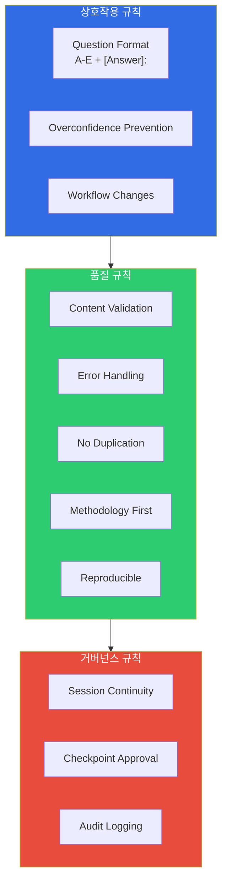
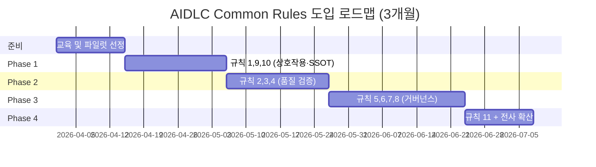

# AIDLC Common Rules

> 📅 **작성일**: 2026-04-18 | ⏱️ **읽는 시간**: 약 18분

AWS Labs [AIDLC Workflows](https://github.com/awslabs/aidlc-workflows) 의 `aws-aidlc-rule-details/common/` 디렉터리는 **모든 stage 가 공통으로 준수해야 하는 11개 규칙**을 정의합니다. 이 규칙들은 Inception → Construction → Operations 전 단계에서 AI 에이전트와 사람이 협업하는 방식을 규정하며, **결과물의 재현성·감사 가능성·안전성을 담보**합니다.

본 문서는 각 규칙을 "무엇(What) / 왜(Why) / 어떻게(How)" 3단 구조로 해설하고, 엔터프라이즈 환경에서의 적용 팁을 덧붙입니다.

---

## 1. 개요: 11개 Common Rules



| # | 규칙 | 범주 | 핵심 가치 |
|---|------|------|----------|
| 1 | Question Format | 상호작용 | 구조화된 질문·답변 포맷 강제 |
| 2 | Content Validation | 품질 | 요구사항·응답 검증 |
| 3 | Error Handling | 품질 | 예외 상황 표준 처리 |
| 4 | Overconfidence Prevention | 상호작용 | AI 확신도 제어 |
| 5 | Session Continuity | 거버넌스 | 세션 간 컨텍스트 보존 |
| 6 | Workflow Changes | 상호작용 | 워크플로 변경 명시적 승인 |
| 7 | Checkpoint Approval | 거버넌스 | Stage 전환 게이트 |
| 8 | Audit Logging | 거버넌스 | ISO 8601 타임스탬프 감사 로그 |
| 9 | No Duplication | 품질 | 단일 진실 원천(SSOT) |
| 10 | Methodology First | 품질 | 도구 독립성 |
| 11 | Reproducible | 품질 | 모델 간 결과 일관성 |

:::info 왜 Common Rules 가 중요한가
AIDLC 는 **Kiro · Q Developer · Cursor · Cline · Claude Code · GitHub Copilot · AGENTS.md** 7개 플랫폼에서 동일하게 동작해야 합니다. Common Rules 는 이 플랫폼·모델 차이에도 불구하고 **같은 입력에 대해 같은 품질의 산출물**을 보장하는 공통 계약입니다.
:::

---

## 2. 규칙 1: Question Format

### 무엇
AI 에이전트가 사람에게 질문할 때 **항상 A-E 5지선다 + `[Answer]:` 태그** 포맷을 강제합니다.

### 왜
- **재현성**: 자유 형식 답변은 모델별·세션별로 해석이 달라짐. 5지선다는 해석 모호성 제거
- **속도**: 사람이 긴 자유 응답을 작성할 필요 없음. 한 글자 선택으로 진행
- **감사**: 질문·답변 쌍이 구조화되어 감사 로그·재실행에 활용 가능

### 어떻게

**질문 템플릿:**
```markdown
Q1. Payment Service 의 인증 방식을 어떻게 설정하시겠습니까?

A. OAuth2 + JWT (Refresh Token 포함)
B. API Key (헤더 기반)
C. mTLS (서비스 간 인증)
D. AWS IAM + SigV4
E. Other (please specify)

[Answer]:
```

**사람이 작성하는 응답:**
```markdown
[Answer]: A
```

또는 자유 기술이 필요한 경우:
```markdown
[Answer]: E - Cognito User Pool + JWT (기존 조직 표준 준수)
```

### 엔터프라이즈 적용 팁
- 질문당 **5개 이하 옵션** 유지. 너무 많으면 의사결정 피로 유발
- 옵션 D 는 "가장 일반적인 기본값", 옵션 E 는 "Other" 로 표준화
- PR 본문·Slack 채널에 질문 블록을 복사해 **팀 합의 후 `[Answer]:` 작성**하는 패턴 권장

---

## 3. 규칙 2: Content Validation

### 무엇
AI 가 생성한 모든 산출물(Requirements Document, Design Document, Code 등)에 대해 **자체 검증 체크리스트**를 실행하고, 실패 항목이 있으면 **사람에게 명시적으로 보고**합니다.

### 왜
- AI 는 종종 누락·모순·hallucination 을 생성함
- 사람이 모든 산출물을 전수 검토하기엔 시간 부족
- AI 자체 검증을 1차 필터로 두면 사람 리뷰 부담 감소

### 어떻게

**자체 검증 체크리스트 예시 (Requirements Document):**
```markdown
## Content Validation Report

- [x] 모든 기능 요구사항에 Acceptance Criteria 포함
- [x] 비기능 요구사항(NFR)에 측정 가능한 지표 명시 (P99 latency, 가용성 등)
- [ ] **FAIL**: FR-004 의 에러 처리 경로가 명시되지 않음
- [x] 용어가 온톨로지/Ubiquitous Language 와 일치
- [x] 외부 의존성(DB, SQS 등) 명시
- [ ] **FAIL**: NFR-002 에서 "충분히 빠름" 이라는 모호한 표현 발견

**Failed Checks**: 2
**Action Required**: 사용자 확인 후 재작성 필요
```

### 엔터프라이즈 적용 팁
- 각 산출물 유형별 **검증 체크리스트를 온톨로지 또는 조직 확장(extensions)** 에 저장
- CI 파이프라인에 `aidlc-validate` 단계 추가해 리포트를 PR 코멘트로 자동 게시
- 실패 항목은 GitHub Issue 자동 생성 후 해결 전까지 Checkpoint Approval 차단

---

## 4. 규칙 3: Error Handling

### 무엇
AIDLC 실행 중 발생한 모든 예외(파일 누락, 도구 오류, 사용자 응답 없음 등)를 **구조화된 에러 리포트**로 기록하고, **재시도 또는 사용자 개입 여부**를 명시적으로 결정합니다.

### 왜
- Silent failure 는 감사 추적을 불가능하게 만듦
- 에러 발생 시점에 따라 **자동 재시도 / 사용자 개입 / 세션 종료** 중 적절한 대응 필요
- 에러 패턴 분석으로 AIDLC 자체를 개선

### 어떻게

**에러 리포트 포맷:**
```yaml
error:
  id: ERR-2026-04-18-001
  timestamp: 2026-04-18T10:23:45Z
  stage: inception.requirements_analysis
  type: missing_context
  message: "Workspace Detection 결과가 세션에 없음"
  severity: medium
  recovery:
    auto_retry: false
    user_action_required: true
    suggested_fix: "Workspace Detection stage 를 먼저 실행하세요"
  context:
    session_id: sess-20260418-abc123
    prior_stage: workspace_detection
```

**에러 분류:**
| Severity | 예시 | 대응 |
|----------|------|------|
| Low | 옵션 응답 외 자유 기술 | AI 가 자동 해석 후 확인 질문 |
| Medium | 필수 선행 stage 미실행 | 사용자에게 stage 역순 실행 안내 |
| High | 도구 호출 실패 (MCP 서버 다운 등) | 세션 일시 중지, 로그 수집 |
| Critical | 온톨로지 계약 위반 (예: 허용되지 않은 도메인 용어 사용) | 즉시 중단, 사람 개입 |

### 엔터프라이즈 적용 팁
- 에러 리포트를 **CloudWatch Logs Insights** 로 전송해 패턴 분석
- High/Critical 에러는 PagerDuty 연동
- 월 1회 에러 리뷰 미팅으로 AIDLC 자체 개선

---

## 5. 규칙 4: Overconfidence Prevention

### 무엇
AI 응답에 **확신도(confidence)** 를 명시하고, 확신도가 낮은 경우 **사용자에게 추가 컨텍스트를 요청**하도록 강제합니다.

### 왜
- LLM 은 종종 잘못된 답을 매우 자신 있는 어조로 생성함 (hallucination)
- 확신도 표기는 사용자가 **어디를 집중 검토할지** 판단하는 신호
- 조직 내 AI 의사결정 신뢰 수준을 투명하게 관리

### 어떻게

**확신도 표기:**
```markdown
## 제안: Payment Service 인증 아키텍처

**Confidence**: High (90%)

Cognito User Pool + JWT 를 권장합니다. 이유는...

---

## 제안: DynamoDB 테이블 설계

**Confidence**: Medium (60%)
**Reason for lower confidence**: Payment 도메인의 읽기/쓰기 비율 정보가 없어 
GSI 설계가 최적이 아닐 수 있습니다.

**Additional Context Needed**:
- 일일 트랜잭션 수?
- 조회 패턴 (사용자별? 시간대별?)

[Answer]:
```

### 엔터프라이즈 적용 팁
- **Low confidence (< 50%) 응답은 자동으로 Checkpoint Approval 게이트에서 일시 중지**
- Confidence 분포를 통계로 관리해 AI 개선 우선순위 식별
- 금융·의료 등 규제 산업은 High confidence 만 자동 채택, Medium/Low 는 사람 승인 필수

---

## 6. 규칙 5: Session Continuity

### 무엇
AIDLC 세션이 중단·재개되더라도 **이전 컨텍스트(질문·답변·산출물)를 완전히 복원**할 수 있도록 상태를 영속화합니다.

### 왜
- 엔터프라이즈 프로젝트는 여러 날·여러 팀에 걸쳐 실행됨
- 세션 종료 시 컨텍스트 유실 = 중복 질문 · 재작업 · 정보 손실
- 팀원 간 핸드오프 시 "어디까지 했지?" 파악 가능해야 함

### 어떻게

**세션 상태 파일 (`.aidlc/session.md`):**
```markdown
# AIDLC Session State

**Session ID**: sess-20260418-payment-service
**Started**: 2026-04-17T09:00:00Z
**Last Active**: 2026-04-18T10:30:00Z
**Owner**: yjeong@example.com

## Progress

| Stage | Status | Artifacts | Approved By | Approved At |
|-------|--------|-----------|-------------|-------------|
| workspace_detection | complete | `.aidlc/workspace.md` | yjeong | 2026-04-17T09:15:00Z |
| requirements_analysis | complete | `requirements.md` | yjeong | 2026-04-17T11:00:00Z |
| user_stories | complete | `user-stories.md` | yjeong | 2026-04-17T14:00:00Z |
| workflow_planning | in_progress | - | - | - |

## Pending Questions

Q3. Authentication 방식 (A-E) — 2026-04-18T10:30:00Z 에 질문, 답변 대기 중
```

### 엔터프라이즈 적용 팁
- 세션 상태는 **Git 으로 버전 관리** (PR 기반 협업 가능)
- S3 + Versioning 으로 세션 상태 백업 (감사용)
- 30일 이상 비활성 세션은 자동 아카이브

---

## 7. 규칙 6: Workflow Changes

### 무엇
AI 가 **워크플로 순서를 임의로 추가·건너뛰기·수정하지 못하도록** 합니다. 변경은 **반드시 사용자의 명시적 승인** 을 거쳐야 합니다.

### 왜
- AI 가 "효율적이라고 판단해" stage 를 건너뛰면 감사 추적 붕괴
- 조직 규제(예: 금융 감독 규정)는 특정 stage 의무 실행 요구
- 워크플로 변경 이력은 조직 학습 자산

### 어떻게

**워크플로 변경 요청 템플릿:**
```markdown
## Workflow Change Request

**Current Workflow**: workspace_detection → requirements_analysis → user_stories → workflow_planning

**Proposed Change**: user_stories 를 건너뛰고 바로 workflow_planning 으로 진행

**Reason**: 이미 `user-stories.md` 가 존재하며, 재검토 불필요

**Impact**:
- Session 소요 시간 1시간 단축
- 단, 최신 요구사항 변경 반영 누락 리스크

**Approval Required**: A. 승인 / B. 거부 / C. 조건부 승인 (추가 검토 후)

[Answer]:
```

### 엔터프라이즈 적용 팁
- **Skip 불가 stage 목록** 을 조직 확장(extensions)에 정의 (예: 금융은 security-review 건너뛰기 금지)
- 변경 이력을 월별 거버넌스 리뷰에서 검토
- "이례적 변경(outlier)" 패턴은 워크플로 개선 시그널

---

## 8. 규칙 7: Checkpoint Approval

### 무엇
각 stage 전환(예: requirements_analysis → user_stories) 시점에 **사람의 명시적 승인** 을 요구합니다.

### 왜
- Stage 전환 후에는 이전 산출물로 되돌리기 어려움 (비가역적)
- 승인은 **품질 게이트 + 거버넌스 증거** 로 동시에 기능
- Human in the loop 원칙의 구체적 구현

### 어떻게

**승인 템플릿:**
```markdown
## Checkpoint Approval Gate

**Completing Stage**: requirements_analysis
**Next Stage**: user_stories

**Artifacts Produced**:
- `requirements.md` (1,234 lines)
- `.aidlc/validation-report.md` (Content Validation 통과)
- `.aidlc/audit/stage-requirements-analysis.md`

**Review Checklist**:
- [x] 모든 비즈니스 요구사항 포함
- [x] NFR 측정 가능
- [x] 이해관계자 리뷰 완료

**Approver**: yjeong@example.com
**Approval Decision**:

A. Approve (다음 stage 진행)
B. Reject (현재 stage 재작업 필요)
C. Approve with comments

[Answer]:
```

### 엔터프라이즈 적용 팁
- **다중 승인자 패턴**: 아키텍트 + 보안 + PM 3인 승인 필수인 경우 멀티시그 게이트 구현
- 승인 기록은 **감사 로그(규칙 8)** 와 자동 연동
- 승인 없이 다음 stage 실행 시도 시 에러 발생 (규칙 3 에 의해 처리)

---

## 9. 규칙 8: Audit Logging

### 무엇
AIDLC 실행 중 발생한 모든 이벤트(질문, 답변, 승인, 에러)를 **ISO 8601 타임스탬프 + 원본 텍스트 보존** 형식으로 감사 로그에 기록합니다.

### 왜
- 금융·의료 등 규제 산업은 의사결정 근거의 완전한 재현 가능성 요구
- 사고 발생 시 원인 분석
- AIDLC 자체 개선을 위한 데이터 축적

### 어떻게

**감사 로그 포맷 (`audit.md`):**
```markdown
## Event: Checkpoint Approval Granted

**Event ID**: evt-2026-04-18-042
**Timestamp**: 2026-04-18T10:45:12.345Z
**Session**: sess-20260418-payment-service
**Actor**: yjeong@example.com
**Stage Transition**: requirements_analysis → user_stories

**Original User Response** (원본 보존):
```
[Answer]: A
```

**AI Interpretation**: Approve (다음 stage 진행)

**Artifacts Hash**:
- requirements.md: sha256:abc123...
- validation-report.md: sha256:def456...

---

## Event: Question Asked

**Event ID**: evt-2026-04-18-041
**Timestamp**: 2026-04-18T10:42:00.000Z
**Session**: sess-20260418-payment-service
**Stage**: requirements_analysis
**Question Text** (원본 보존):
```
Q15. Payment Service 의 데이터 저장소로 무엇을 선택하시겠습니까?
A. DynamoDB
B. Aurora PostgreSQL
...
```
```

**감사 로그 원칙:**
1. **Append-only**: 기존 로그는 절대 수정 불가
2. **원본 보존**: AI 의 해석/요약이 아닌 사용자·AI 의 **원본 텍스트** 저장
3. **ISO 8601 타임스탬프**: 밀리초 precision + UTC 표기
4. **Artifact Hashing**: 산출물 SHA-256 로 무결성 검증

### 엔터프라이즈 적용 팁
- 감사 로그는 **S3 + Object Lock** (WORM) 로 저장해 변조 방지
- 금융권은 최소 7년, 의료는 10년 보관 정책 적용
- 상세 규격은 [Audit & Governance Logging](../operations/audit-governance.md) 참조

---

## 10. 규칙 9: No Duplication

### 무엇
AIDLC 산출물 간에 **동일 정보를 중복 생성하지 않습니다**. 한 곳(Single Source of Truth, SSOT)에만 정보를 두고, 다른 곳에서는 참조합니다.

### 왜
- 중복은 불일치로 이어짐 (한쪽만 업데이트되면 산출물 간 모순 발생)
- AI 에이전트가 중복된 정보를 학습하면 환각 증가
- 유지보수 비용 폭증

### 어떻게

**중복 예시 (잘못된 패턴):**
```markdown
# requirements.md
- API latency P99 < 200ms

# design.md
- API latency P99 < 200ms
- 추가로 P95 < 100ms 필요

# nfr.md
- API P99 latency < 150ms  ← 불일치!
```

**올바른 패턴 (SSOT):**
```markdown
# nfr.md (SSOT)
- PAY-NFR-001: API latency P99 < 200ms, P95 < 100ms

# requirements.md
- 성능 요구사항: PAY-NFR-001 참조

# design.md
- 성능 목표: PAY-NFR-001 참조, HPA 임계값은 이 목표에서 역산
```

### 엔터프라이즈 적용 팁
- 모든 요구사항·NFR·결정에 **고유 ID 부여** (`PAY-NFR-001`)
- 산출물 간 참조는 **ID 기반 링크** 만 허용
- CI 에서 중복 문자열 검출 (>20 단어 동일 문장 발견 시 경고)

---

## 11. 규칙 10: Methodology First

### 무엇
AIDLC 는 **특정 도구·플랫폼에 종속되지 않는 방법론**으로 동작해야 합니다. 같은 산출물이 Kiro, Claude Code, Cursor 등 어디서든 생성 가능해야 합니다.

### 왜
- 도구 lock-in 은 조직의 민첩성을 저해
- 방법론 > 도구 순서여야 장기적 자산화 가능
- 산업 표준화(7개 지원 플랫폼)의 기반

### 어떻게

**도구 독립적 설계 원칙:**
1. 산출물은 **평문 Markdown + YAML** 만 사용
2. 특정 IDE 기능(예: Kiro 의 Spec 파일) 의존 금지 — Generic 템플릿 제공
3. MCP 서버 등 도구별 통합은 **별도 확장**으로 분리

**Bad (도구 종속):**
```markdown
# design.md
Kiro 의 `.kiro/spec/design.md` 참조
```

**Good (도구 독립):**
```markdown
# design.md
자세한 MCP 통합은 본 저장소의 `extensions/kiro-mcp/` 참조 (Kiro 사용 시에만)
```

### 엔터프라이즈 적용 팁
- 조직 표준 템플릿은 **모든 플랫폼에서 동작** 하도록 검증 (최소 2개 플랫폼 테스트)
- 팀별 도구 선호도 차이를 허용하되, 산출물 포맷은 통일
- 플랫폼 교체 시 산출물 마이그레이션이 **단순 파일 복사** 수준이어야 함

---

## 12. 규칙 11: Reproducible

### 무엇
동일한 입력(Workspace 상태 · Requirements · 질문 응답)에 대해, **동일 모델 + 동일 프롬프트**라면 **거의 동일한 산출물**을 생성해야 합니다.

### 왜
- 재현 불가능한 시스템은 감사·디버깅·개선 불가
- 팀 간 지식 전수 (같은 입력을 주면 같은 결과) 가능
- AIDLC 자체를 **신뢰 가능한 프로세스**로 만듦

### 어떻게

**재현성 확보 메커니즘:**
1. **구조화된 질문 포맷 (규칙 1)** — 답변 해석 일관성
2. **Temperature 0 또는 낮은 값** — LLM 출력 안정화
3. **Frozen model version** — `claude-opus-4-7` 처럼 명시적 버전 고정
4. **Seed 고정** (지원 모델) — 동일 seed 시 동일 출력

**재현성 테스트:**
```bash
# 동일 입력으로 3회 실행 후 산출물 diff
aidlc run --input requirements.md --session test-1
aidlc run --input requirements.md --session test-2
aidlc run --input requirements.md --session test-3

diff .aidlc/test-1/requirements.md .aidlc/test-2/requirements.md
# 기대: 90% 이상 동일
```

### 엔터프라이즈 적용 팁
- **모델 업그레이드 시 재현성 회귀 테스트** 필수 (골든 입력 세트 유지)
- 모델 교체로 인한 **산출물 drift > 20%** 시 롤백
- 규제 산업은 모델 버전을 3-5년 고정 유지 (NIST SP 800-218A 권장)

---

## 13. 엔터프라이즈 적용 통합 가이드

### 13.1 Common Rules → 거버넌스 매핑

| 규칙 | ISO 27001 관련 | SOC 2 관련 | 한국 ISMS-P 관련 |
|------|----------------|-------------|------------------|
| Checkpoint Approval (7) | A.5.15 Access Control | CC6.2 | 2.8.3 변경관리 |
| Audit Logging (8) | A.8.15 Logging | CC7.2 | 2.9.4 로그관리 |
| Content Validation (2) | A.8.29 Security Testing | CC8.1 | 2.11.2 소프트웨어 검증 |
| Error Handling (3) | A.5.24 Incident Management | CC7.3 | 2.10.4 침해사고 대응 |

### 13.2 적용 로드맵



### 13.3 도구·플랫폼별 구현 상태 (2026.04 기준)

| 플랫폼 | 규칙 1-4 | 규칙 5-8 | 규칙 9-11 | 비고 |
|--------|---------|---------|-----------|------|
| **Kiro** | Full | Full | Full | Spec-Driven 기본 탑재 |
| **Claude Code** | Full | Full | Partial | reproducibility 는 seed 미지원 |
| **Cursor** | Partial | Partial | Partial | 확장 필요 |
| **Q Developer** | Full | Full | Full | AWS 통합 우수 |
| **Cline** | Partial | Partial | Full | CLI 중심 |
| **Copilot** | Partial | Limited | Limited | 상호작용 제한 |
| **AGENTS.md** | Full | Full | Full | 문서 기반 |

---

## 14. 참고 자료

### 공식 저장소
- [AWS Labs AIDLC Common Rules](https://github.com/awslabs/aidlc-workflows/tree/main/aws-aidlc-rule-details/common) — 11개 규칙 원문
- [AWS Labs AIDLC Workflows (v0.1.7)](https://github.com/awslabs/aidlc-workflows) — 전체 저장소

### 관련 문서
- [10대 원칙과 실행 모델](./principles-and-model.md) — engineering-playbook 의 10대 원칙 (공식 5대 원칙 + 확장)
- [Adaptive Execution](./adaptive-execution.md) — 조건부 stage 실행 (규칙 6 Workflow Changes 와 연계)
- [Audit & Governance Logging](../operations/audit-governance.md) — 규칙 7, 8 의 운영 구현
- [하네스 엔지니어링](./harness-engineering.md) — 규칙 2 (Content Validation) 의 아키텍처적 강제

### 규제 매핑
- [ISO/IEC 27001:2022](https://www.iso.org/standard/27001)
- [AICPA SOC 2 Trust Services Criteria](https://www.aicpa-cima.com/)
- [KISA ISMS-P 인증기준](https://isms.kisa.or.kr/)
