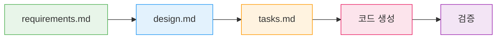
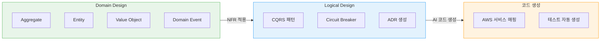
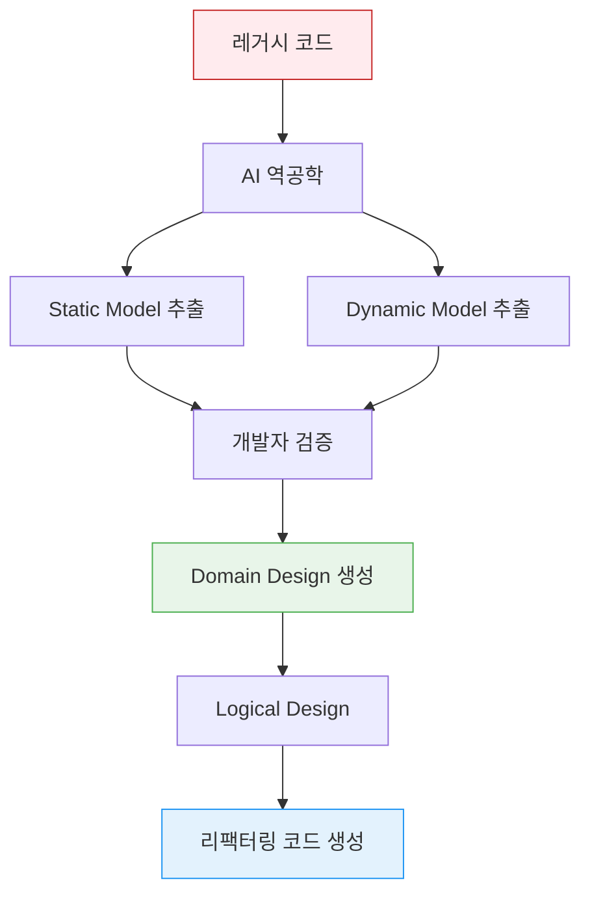

# DDD 통합 — AI 주도 개발에서의 필수 코어

> **핵심 메시지**: AIDLC에서 DDD는 선택사항이 아닌 방법론의 내장 요소입니다. AI가 비즈니스 로직을 자동으로 DDD 원칙에 따라 모델링하고, 팀이 이를 검증·조정합니다.

---

## 1. DDD가 AIDLC의 필수 코어인 이유

전통적인 Scrum에서 DDD(Domain-Driven Design)는 **팀 선택사항**이었습니다. 아키텍트가 DDD를 선호하면 도입하고, 그렇지 않으면 트랜잭션 스크립트나 레이어드 아키텍처로 진행했습니다. 설계 기법의 선택은 팀의 역량과 선호에 달려 있었습니다.

AIDLC에서는 상황이 근본적으로 다릅니다.

```
전통적 SDLC                          AIDLC
━━━━━━━━━━━━━━                      ━━━━━━━━━━━━━━━━━━━
설계 기법은 팀 선택                     DDD/BDD/TDD를 방법론에 내장
아키텍트가 수동 모델링                  AI가 자동 모델링, 팀이 검증
설계 문서는 코드와 점진적 이탈           Spec → Code 일관성 자동 유지
도메인 지식이 사람 머리에만 존재         온톨로지로 형식화되어 AI가 이해
```

### 1.1 왜 DDD가 내장되는가

AI는 구조화된 패턴에서 최고의 성능을 발휘합니다. DDD는 비즈니스 로직을 **Aggregate, Entity, Value Object, Domain Event**로 체계화하는 명확한 어휘와 규칙을 제공합니다. 이는 AI가 요구사항을 코드로 변환할 때 일관된 가이드레일 역할을 합니다.

```
비구조화된 요구사항 + AI = 임의적 구현 (매번 다른 스타일)
DDD 패턴 + AI = 예측 가능한 구현 (Aggregate-first, Event-driven)
```

### 1.2 Scrum vs AIDLC: DDD의 위치 변화

| 측면 | Scrum + DDD (선택) | AIDLC + DDD (필수) |
|------|-------------------|-------------------|
| **도입 여부** | 아키텍트 재량 | 방법론 내장 |
| **모델링 주체** | 아키텍트 + 개발자 | AI 초안 → 팀 검증 |
| **유지보수** | 수동 문서 동기화 | Spec 파일 자동 반영 |
| **학습 곡선** | 높음 (Red/Blue Book) | 낮음 (AI가 패턴 적용) |
| **적용 범위** | 핵심 도메인만 | 전체 Unit에 일관 적용 |

---

## 2. Inception 단계: 요구사항에서 설계까지

DDD 통합은 **Inception 단계**에서 시작됩니다. 이 단계의 핵심 리추얼은 **Mob Elaboration**이며, AI가 요구사항을 DDD 패턴으로 자동 모델링하고 팀이 이를 검증합니다.

### 2.1 Mob Elaboration 리추얼

Mob Elaboration은 Product Owner, 개발자, QA가 한 방에 모여 AI와 협업하는 요구사항 정제 세션입니다.

```
┌──────────────────────────────────────────────────┐
│              Mob Elaboration 리추얼                │
├──────────────────────────────────────────────────┤
│                                                   │
│  [AI] Intent를 User Story + Unit으로 분해 제안     │
│    ↓                                              │
│  [PO + Dev + QA] 검토 · 과잉/부족 설계 조정        │
│    ↓                                              │
│  [AI] 수정 반영 → NFR · Risk 추가 생성             │
│    ↓                                              │
│  [팀] 최종 검증 → Bolt 계획 확정                    │
│                                                   │
├──────────────────────────────────────────────────┤
│  산출물:                                          │
│  PRFAQ · User Stories · NFR 정의                  │
│  Risk Register · 측정 기준 · Bolt 계획             │
└──────────────────────────────────────────────────┘
```

**시간 압축 효과**: 기존 방법론에서 **수 주~수 개월** 걸리던 순차적 요구사항 분석을 AI가 초안을 생성하고 팀이 동시에 검토함으로써 **수 시간**으로 압축합니다.

### 2.2 Kiro Spec-Driven Inception

Kiro는 Mob Elaboration의 산출물을 **Spec 파일**로 체계화합니다. 자연어 요구사항에서 코드까지의 전체 과정을 구조화합니다.



#### 2.2.1 Payment Service 예시

**requirements.md**:

```markdown
# Payment Service 배포 요구사항

## 기능 요구사항
- REST API 엔드포인트: /api/v1/payments
- DynamoDB 테이블과 연동
- SQS를 통한 비동기 이벤트 처리

## 비기능 요구사항
- P99 레이턴시: < 200ms
- 가용성: 99.95%
- 자동 스케일링: 2-20 Pod
- EKS 1.35+ 호환
```

**design.md**:

```markdown
# Payment Service 아키텍처

## 도메인 모델 (DDD)
- Aggregate: Payment (transactionId, amount, status)
- Entity: PaymentMethod, Customer
- Value Object: Money, Currency
- Domain Event: PaymentCreated, PaymentCompleted, PaymentFailed

## 인프라 구성
- EKS Deployment (3 replicas min)
- ACK DynamoDB Table (on-demand)
- ACK SQS Queue (FIFO)
- HPA (CPU 70%, Memory 80%)
- Karpenter NodePool (graviton, spot)

## 관찰성
- ADOT sidecar (traces → X-Ray)
- Application Signals (SLI/SLO 자동)
- CloudWatch Logs (/eks/payment-service)

## 보안
- Pod Identity (IRSA 대체)
- NetworkPolicy (namespace 격리)
- Secrets Manager CSI Driver
```

**tasks.md**:

```markdown
# 구현 태스크

## Bolt 1: 도메인 모델
- [ ] Payment Aggregate 구현
- [ ] Value Object 정의 (Money, Currency)
- [ ] Domain Event 정의
- [ ] Repository interface 정의

## Bolt 2: 인프라
- [ ] ACK DynamoDB Table CRD 작성
- [ ] ACK SQS Queue CRD 작성
- [ ] Karpenter NodePool 설정

## Bolt 3: 애플리케이션
- [ ] Go REST API 구현
- [ ] DynamoDB Repository 구현
- [ ] SQS Event Publisher 구현
- [ ] Dockerfile + multi-stage build

## Bolt 4: 배포 & 관찰성
- [ ] Helm chart 작성
- [ ] ADOT sidecar 설정
- [ ] Application Signals annotation
```

:::tip Spec-Driven의 핵심 가치
**디렉팅 방식**: "DynamoDB 만들어줘" → "SQS도 필요해" → "이제 배포해줘" → 매번 수동 지시, 맥락 유실 위험

**Spec-Driven**: Kiro가 requirements.md를 분석 → design.md 생성 → tasks.md 분해 → 코드 자동 생성 → 검증까지 일관된 Context Memory로 연결
:::

### 2.3 MCP 기반 실시간 컨텍스트 수집

Kiro는 MCP 네이티브로, Inception 단계에서 AWS Hosted MCP 서버를 통해 실시간 인프라 상태를 수집합니다.

```
[Kiro + MCP 상호작용]

Kiro: "EKS 클러스터 상태 확인"
  → EKS MCP Server: get_cluster_status()
  → 응답: { version: "1.35", nodes: 5, status: "ACTIVE" }

Kiro: "비용 분석"
  → Cost Analysis MCP Server: analyze_cost(service="EKS")
  → 응답: { monthly: "$450", recommendations: [...] }

Kiro: "현재 워크로드 분석"
  → EKS MCP Server: list_deployments(namespace="payment")
  → 응답: { deployments: [...], resource_usage: {...} }
```

이를 통해 design.md 생성 시 **현재 클러스터 상태와 비용을 반영한 설계**가 가능합니다.

---

## 3. Construction 단계: DDD 패턴 구현

Construction 단계에서 AI는 Inception에서 정의한 도메인 모델을 **실제 코드**로 변환합니다. 이 과정에서 DDD 패턴이 AWS 서비스 및 Kubernetes 리소스로 매핑됩니다.

### 3.1 Domain Design에서 Logical Design까지



#### 3.1.1 Payment Service 구현 단계

**1단계: Domain Design** — AI가 비즈니스 로직 모델링

```go
// Aggregate
type Payment struct {
    TransactionID string
    Amount        Money
    Status        PaymentStatus
    Customer      Customer
    Method        PaymentMethod
    Events        []DomainEvent
}

// Value Object
type Money struct {
    Amount   decimal.Decimal
    Currency Currency
}

// Domain Event
type PaymentCreated struct {
    TransactionID string
    Timestamp     time.Time
}
```

**2단계: Logical Design** — NFR 적용 + 아키텍처 패턴 선택

- **CQRS 패턴**: 결제 생성(Command) / 조회(Query) 분리
  - Command: POST /api/v1/payments → DynamoDB 쓰기 + SQS 발행
  - Query: GET /api/v1/payments/\{id\} → DynamoDB Streams → ElastiCache 읽기
- **Circuit Breaker**: 외부 결제 게이트웨이 호출 시 Envoy sidecar + Istio
- **ADR (Architecture Decision Record)**: "DynamoDB on-demand vs provisioned" 의사결정 기록

**3단계: 코드 생성** — AWS 서비스 매핑

| DDD 요소 | AWS/Kubernetes 매핑 |
|---------|-------------------|
| **Aggregate (Payment)** | EKS Deployment + DynamoDB Table |
| **Domain Event** | SQS FIFO Queue |
| **Repository** | DynamoDB SDK with ACK CRDs |
| **Circuit Breaker** | Envoy sidecar (Istio) |
| **Event Publisher** | SQS SDK with retry logic |

### 3.2 AWS 서비스 매핑 상세

#### 3.2.1 DynamoDB Table (Aggregate 영속화)

AI가 design.md의 Aggregate 정의를 분석하여 ACK CRD를 자동 생성합니다.

```yaml
apiVersion: dynamodb.services.k8s.aws/v1alpha1
kind: Table
metadata:
  name: payment-table
spec:
  tableName: payment-service
  attributeDefinitions:
    - attributeName: transactionId
      attributeType: S
  keySchema:
    - attributeName: transactionId
      keyType: HASH
  billingMode: PAY_PER_REQUEST  # ADR에서 결정
  tags:
    - key: DomainAggregate
      value: Payment
```

#### 3.2.2 SQS Queue (Domain Event 발행)

```yaml
apiVersion: sqs.services.k8s.aws/v1alpha1
kind: Queue
metadata:
  name: payment-events
spec:
  queueName: payment-service-events.fifo
  fifoQueue: true
  contentBasedDeduplication: true
  tags:
    DomainEvent: PaymentCreated,PaymentCompleted,PaymentFailed
```

#### 3.2.3 Repository 구현

AI가 DDD Repository 패턴을 DynamoDB SDK로 구현합니다.

```go
type PaymentRepository interface {
    Save(ctx context.Context, payment *Payment) error
    FindByID(ctx context.Context, id string) (*Payment, error)
}

type DynamoDBPaymentRepository struct {
    client *dynamodb.Client
}

func (r *DynamoDBPaymentRepository) Save(ctx context.Context, p *Payment) error {
    item, _ := attributevalue.MarshalMap(p)
    _, err := r.client.PutItem(ctx, &dynamodb.PutItemInput{
        TableName: aws.String("payment-service"),
        Item:      item,
    })
    
    // Domain Event 발행
    for _, event := range p.Events {
        publishToSQS(event)
    }
    
    return err
}
```

### 3.3 NFR 적용: CQRS, Circuit Breaker, ADR

#### 3.3.1 CQRS 패턴

AI가 NFR (P99 < 200ms)를 분석하여 Command/Query 분리를 제안합니다.

```
Command Side (Write):
  POST /api/v1/payments
    → Aggregate.CreatePayment()
    → DynamoDB.PutItem()
    → SQS.SendMessage(PaymentCreated)

Query Side (Read):
  GET /api/v1/payments/\{id\}
    → ElastiCache.Get(id)  # DynamoDB Streams → Cache
    → Fallback: DynamoDB.GetItem()
```

#### 3.3.2 Circuit Breaker (외부 게이트웨이)

결제 게이트웨이 호출 시 장애 격리를 위해 Istio Circuit Breaker를 자동 설정합니다.

```yaml
apiVersion: networking.istio.io/v1beta1
kind: DestinationRule
metadata:
  name: payment-gateway-circuit-breaker
spec:
  host: external-payment-gateway.com
  trafficPolicy:
    outlierDetection:
      consecutiveErrors: 5
      interval: 30s
      baseEjectionTime: 60s
```

#### 3.3.3 ADR 자동 생성

AI가 design.md 작성 시 아키텍처 결정을 ADR 형식으로 기록합니다.

```markdown
# ADR-001: DynamoDB On-Demand 선택

## Context
Payment Service는 트래픽 패턴이 불규칙하고 예측 불가능합니다.

## Decision
Provisioned Capacity 대신 On-Demand를 선택합니다.

## Consequences
- 비용: 예측 가능한 트래픽 대비 15% 더 비쌈
- 장점: 스파이크 트래픽 대응 자동, 스케일링 운영 불필요
- 단점: 비용 최적화 한계
```

---

## 4. Mob Construction 리추얼

Construction의 핵심 리추얼은 **Mob Construction**입니다. 팀이 한 방에 모여 각자의 Unit을 개발하며, Domain Design 단계에서 생성한 통합 사양(Integration Specification)을 교환합니다.

```
[Mob Construction 흐름]

Team A: Payment Unit        Team B: Notification Unit
  │                            │
  ├─ Domain Design 완료        ├─ Domain Design 완료
  │                            │
  └────── 통합 사양 교환 ──────┘
          (Domain Event 계약)
  │                            │
  ├─ Logical Design            ├─ Logical Design
  ├─ 코드 생성                  ├─ 코드 생성
  ├─ 테스트                    ├─ 테스트
  └─ Bolt 전달                 └─ Bolt 전달
```

### 4.1 Domain Event 기반 통합

각 Unit은 느슨하게 결합되어 **병렬 개발**이 가능하며, Domain Event를 통해 통합됩니다.

**통합 사양 (Integration Specification)**:

```yaml
# payment-unit-events.yaml
events:
  - name: PaymentCompleted
    schema:
      transactionId: string
      amount: decimal
      currency: string
      timestamp: ISO8601
    consumers:
      - notification-unit  # Notification팀이 구독
      - analytics-unit     # Analytics팀이 구독
```

AI가 이 사양을 기반으로 통합 테스트를 자동 생성합니다.

```go
func TestPaymentNotificationIntegration(t *testing.T) {
    // Payment Unit이 PaymentCompleted 이벤트 발행
    payment := CreatePayment(amount)
    payment.Complete()
    
    // SQS에서 이벤트 수신 확인
    event := sqsClient.ReceiveMessage("payment-events.fifo")
    assert.Equal(t, "PaymentCompleted", event.Type)
    
    // Notification Unit이 이메일 발송했는지 확인
    notification := notificationClient.GetLastNotification()
    assert.Contains(t, notification.Body, payment.TransactionID)
}
```

### 4.2 Pair Programming의 AI 확장

Mob Construction은 전통적인 Pair Programming을 AI로 확장한 것입니다.

| 측면 | Pair Programming | Mob Construction (AI) |
|------|-----------------|----------------------|
| **참여자** | 2명 (Driver + Navigator) | N명 + AI Agent |
| **역할** | 1명 코딩, 1명 리뷰 | N명 검증, AI가 코딩 |
| **속도** | 1x (사람 속도) | 10-50x (AI 속도) |
| **병렬성** | 순차 작업 | 다중 Unit 병렬 |
| **지식 전파** | 2명만 학습 | 전체 팀 동시 학습 |

---

## 5. Brownfield (기존 시스템) 접근

기존 시스템에 기능 추가나 리팩터링을 수행하는 경우, Construction 단계에 **추가 스텝**이 필요합니다.

:::warning Brownfield 전략: 최적화 우선
새로 만들기보다 **기존 시스템 최적화**를 우선합니다. AI가 레거시 코드를 DDD 모델로 역공학하여 점진적 리팩터링을 수행합니다.
:::

### 5.1 역공학 프로세스



**1단계: AI가 기존 코드를 시맨틱 모델로 역공학** (코드 → 모델 승격)

- **Static Model**: 컴포넌트, 책임, 관계
  ```
  [PaymentController] → [PaymentService] → [PaymentDAO]
  - PaymentService의 책임: 비즈니스 로직 + 트랜잭션 관리
  - PaymentDAO의 책임: 데이터 접근
  ```

- **Dynamic Model**: 주요 유스케이스의 컴포넌트 상호작용
  ```
  결제 생성 Flow:
  Controller.createPayment() 
    → Service.processPayment()
    → DAO.insertPayment()
    → DAO.insertPaymentEvent()
  ```

**2단계: 개발자가 역공학된 모델을 검증·수정**

AI가 추출한 모델이 실제 비즈니스 의도를 정확히 반영하는지 확인합니다.

**3단계: 이후 Green-field와 동일한 Construction 흐름 진행**

역공학된 모델을 DDD Aggregate/Entity/Value Object로 재설계하고, AI가 리팩터링 코드를 생성합니다.

### 5.2 점진적 리팩터링 전략

한 번에 전체 시스템을 리팩터링하지 않고, **Bolt 단위로 점진적 전환**을 수행합니다.

```
Bolt 1: Payment Aggregate 추출
  - 기존: PaymentService (God Object 900줄)
  - 신규: Payment Aggregate + PaymentRepository

Bolt 2: Domain Event 도입
  - 기존: 결제 완료 시 직접 Notification 호출
  - 신규: PaymentCompleted 이벤트 발행 → SQS → Notification 구독

Bolt 3: CQRS 분리
  - 기존: 단일 Service에서 읽기/쓰기 혼재
  - 신규: PaymentCommandService / PaymentQueryService 분리
```

---

## 6. 온톨로지로의 확장: DDD에서 형식 온톨로지로

> "프롬프트 엔지니어링은 온톨로지 엔지니어링이다" — 2026 AI 커뮤니티 컨센서스

DDD의 Ubiquitous Language는 팀 내 소통을 위한 **비형식적 합의**입니다. AI 시대에는 이를 **형식 온톨로지(typed world model)**로 격상하여 AI가 기계적으로 이해하고 준수할 수 있게 만들어야 합니다.

### 6.1 DDD vs 온톨로지

| 측면 | DDD (Ubiquitous Language) | 형식 온톨로지 |
|------|--------------------------|-------------|
| **정의** | 자연어 합의 | 기계 해석 가능 스키마 |
| **주 대상** | 사람 (팀 내 소통) | AI + 사람 |
| **검증** | 코드 리뷰 시 수동 | 자동 검증 (프롬프트 시점) |
| **진화** | 문서화 지연 | 스키마 버전 관리 |
| **예시** | "결제는 생성, 완료, 실패 상태를 가진다" | `Payment.status: enum(CREATED, COMPLETED, FAILED)` |

### 6.2 온톨로지 엔지니어링 워크플로우

```
1. DDD 모델 정의 (requirements.md, design.md)
   ↓
2. AI가 온톨로지 스키마 생성 (JSON Schema/OWL)
   ↓
3. 온톨로지 검증 (팀 리뷰)
   ↓
4. AI가 온톨로지 기반 코드 생성
   ↓
5. 런타임 검증 (온톨로지 ↔ 실제 동작 일치)
```

이 과정은 [온톨로지 엔지니어링](./ontology-engineering.md) 문서에서 상세히 다룹니다.

---

## 7. Quality Gates: DDD 패턴 검증

Construction 단계에서 AI가 생성한 코드가 DDD 원칙을 준수하는지 자동 검증합니다.

### 7.1 Harness Engineering 통합

[하네스 엔지니어링](./harness-engineering.md)에서 정의한 Quality Gates가 DDD 패턴을 검증합니다.

```yaml
# quality-gates.yaml
gates:
  - name: DDD Pattern Compliance
    rules:
      - check: "Aggregate는 단일 트랜잭션 경계를 유지하는가?"
        tool: static-analysis
      - check: "Domain Event는 과거형으로 명명되었는가?"
        tool: naming-convention
      - check: "Value Object는 불변성을 보장하는가?"
        tool: immutability-checker
      - check: "Repository는 Aggregate만 영속화하는가?"
        tool: dependency-analysis
```

### 7.2 자동 검증 예시

```go
// ❌ Anti-pattern: Aggregate가 다른 Aggregate를 직접 참조
type Order struct {
    OrderID  string
    Customer Customer  // ❌ Customer Aggregate 직접 참조
}

// ✅ Best practice: ID로만 참조
type Order struct {
    OrderID    string
    CustomerID string  // ✅ ID만 저장, 필요 시 Repository로 조회
}
```

AI가 이러한 패턴을 자동 검출하고 수정 제안을 생성합니다.

---

## 8. AI 코딩 에이전트: DDD 구현 자동화

AIDLC Construction 단계에서 활용하는 AI 코딩 에이전트들은 DDD 패턴을 자동 적용합니다.

### 8.1 Kiro의 DDD 자동화

**Kiro**는 AWS Labs가 개발한 AI 코딩 에이전트로, **Spec-Driven DDD 구현**을 수행합니다.

```
Kiro 워크플로우:

1. requirements.md 분석 → 도메인 개념 추출
2. design.md 생성 → Aggregate/Entity/Value Object 식별
3. tasks.md 분해 → Bolt 단위 구현 계획
4. 코드 자동 생성 → DDD 패턴 적용
5. 테스트 자동 생성 → 도메인 로직 검증
```

### 8.2 Amazon Q Developer의 실시간 검증

**Amazon Q Developer**는 2025년 2월 발표된 **실시간 코드 실행 기능**을 통해 DDD 구현을 즉시 검증합니다.

```
전통 방식:
  AI가 코드 생성 → 개발자가 수동 빌드 → 테스트 실패 발견 → 수정 반복

Q Developer:
  AI가 코드 생성 → 자동 빌드 → 자동 테스트 → 실패 시 즉시 재생성
```

이는 AIDLC의 **Loss Function**을 Construction 단계에서 조기 작동시켜 오류를 하류로 전파하지 않는 핵심 메커니즘입니다.

상세 비교는 [AI 코딩 에이전트](../toolchain/ai-coding-agents.md) 문서를 참조하세요.

---

## 9. MSA 환경에서의 DDD 적용

복잡한 Microservices Architecture(MSA) 환경에서 DDD는 서비스 경계 설정과 통합 전략의 핵심입니다.

### 9.1 Bounded Context와 서비스 경계

DDD의 **Bounded Context**는 MSA의 **서비스 경계**와 자연스럽게 매핑됩니다.

```
Payment Bounded Context → Payment Service
Notification Bounded Context → Notification Service
Analytics Bounded Context → Analytics Service
```

AI가 requirements.md를 분석하여 Bounded Context를 자동 식별하고, 각 Context를 독립적인 EKS Deployment로 매핑합니다.

### 9.2 Context Mapping 패턴

여러 서비스가 상호작용할 때 DDD Context Mapping 패턴을 적용합니다.

| 패턴 | 설명 | 구현 |
|------|------|------|
| **Customer-Supplier** | 한 팀이 다른 팀에 API 제공 | REST API + API Gateway |
| **Conformist** | 하위 팀이 상위 팀의 모델을 그대로 수용 | 공통 Proto/Schema |
| **Anticorruption Layer** | 레거시 시스템으로부터 격리 | Adapter 패턴 |
| **Shared Kernel** | 공통 도메인 모델 공유 | Shared Library (최소화) |
| **Published Language** | 표준 이벤트 포맷 | CloudEvents + SQS |

복잡한 MSA 환경에서의 DDD 적용 전략은 [MSA 복잡도](../enterprise/msa-complexity/index.md) 문서를 참조하세요.

---

## 10. 핵심 요약

### 10.1 왜 DDD가 AIDLC의 필수 코어인가

1. **AI는 구조화된 패턴에서 최고 성능** — DDD는 명확한 어휘와 규칙 제공
2. **Spec → Code 자동 변환** — requirements.md → design.md → tasks.md → 코드
3. **팀 검증이 Loss Function** — AI 초안 → 팀 조정 → AI 개선 → 반복
4. **온톨로지로 진화** — 비형식 언어 → 형식 스키마 → AI 기계적 이해

### 10.2 핵심 리추얼

- **Mob Elaboration** (Inception): 요구사항 → DDD 모델, 수 주 → 수 시간 압축
- **Mob Construction**: 병렬 Unit 개발, Domain Event 기반 통합

### 10.3 자동화 범위

| 단계 | AI 자동화 | 사람 역할 |
|------|----------|----------|
| **Domain Design** | Aggregate/Entity/VO 초안 | 비즈니스 정확성 검증 |
| **Logical Design** | CQRS/Circuit Breaker 적용 | NFR 우선순위 결정 |
| **코드 생성** | DDD 패턴 구현 | 코드 리뷰 |
| **테스트 생성** | 도메인 로직 테스트 | 시나리오 검증 |
| **ADR 작성** | 아키텍처 결정 기록 | 의사결정 승인 |

---

## 11. 다음 단계

- **[온톨로지 엔지니어링](./ontology-engineering.md)** — DDD에서 형식 온톨로지로의 확장
- **[하네스 엔지니어링](./harness-engineering.md)** — Quality Gates에서 DDD 패턴 검증
- **[AI 코딩 에이전트](../toolchain/ai-coding-agents.md)** — Kiro, Q Developer 상세
- **[MSA 복잡도](../enterprise/msa-complexity/index.md)** — 복잡한 MSA에서의 DDD 적용

---

**📚 참고 자료**

- AWS Labs AI-DLC Research: [arxiv.org/abs/2501.03604](https://arxiv.org/abs/2501.03604)
- Eric Evans, "Domain-Driven Design" (2003)
- Vaughn Vernon, "Implementing Domain-Driven Design" (2013)
- Chris Richardson, "Microservices Patterns" (2018)
