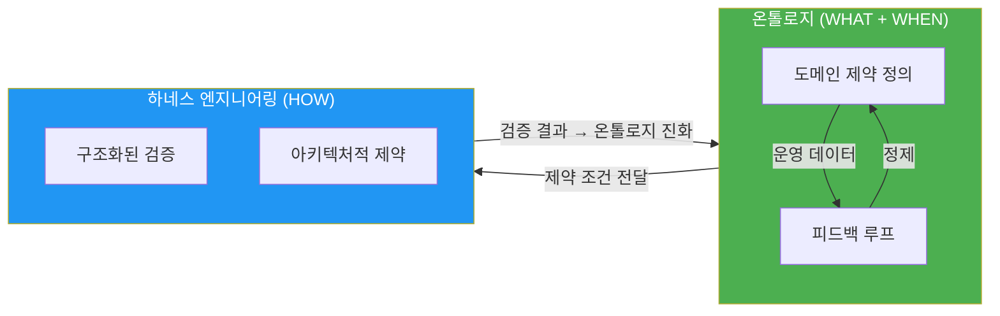
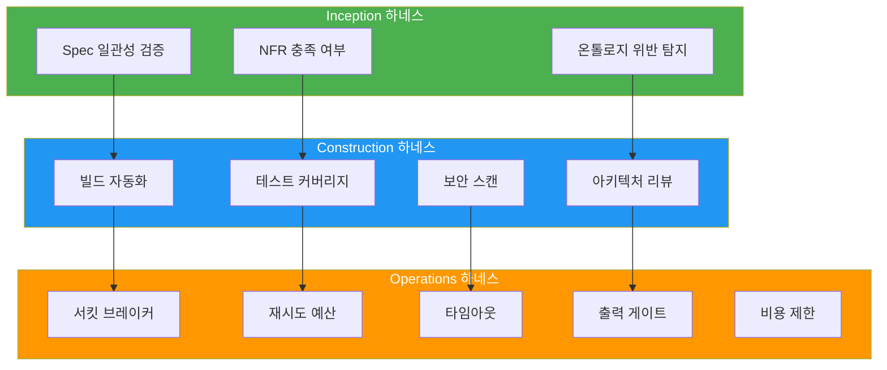
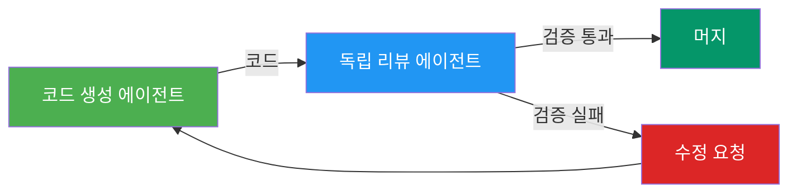

import { QualityGates } from '@site/src/components/AidlcTables';

# 하네스 엔지니어링

> "에이전트가 어려운 게 아니라, 하네스가 어렵다" — NxCode, 2026

## 개요

**하네스 엔지니어링(Harness Engineering)**은 AIDLC 신뢰성 듀얼 축의 두 번째 축으로, 온톨로지가 정의한 제약을 **아키텍처적으로 검증하고 강제**하는 구조입니다. 2026년 AI 개발의 핵심 교훈은 다음과 같습니다:

> OpenAI Codex가 100만 줄의 코드를 생성할 때, 인간 엔지니어가 작성한 코드는 0줄이었습니다. 엔지니어의 역할은 **코드를 쓰는 것이 아니라 하네스를 설계하는 것**으로 전환되었습니다.



**하네스의 역할:**
- 온톨로지가 정의한 제약을 아키텍처적으로 검증
- 재시도 예산, 타임아웃, 출력 게이트, 서킷 브레이커 설계
- 독립적 검증 보장 (코드 생성 에이전트 ≠ 검증 에이전트)
- 검증 결과를 온톨로지 진화로 피드백

---

## 하네스 vs 가드레일

많은 팀이 "가드레일"과 "하네스"를 혼용하지만, 이 둘은 **범위와 시점이 근본적으로 다릅니다**.

| 구분 | 가드레일(Guardrails) | 하네스(Harness) |
|------|---------------------|----------------|
| **범위** | 런타임 입출력 필터링 | 아키텍처 전체 설계 |
| **역할** | PII 마스킹, 프롬프트 인젝션 방어 | 재시도 예산, 타임아웃, 출력 게이트, 서킷 브레이커 |
| **시점** | 실행 중 | 설계 시점부터 |
| **실패 모드** | 개별 요청 차단 | 시스템 전체 보호 |
| **예시** | Bedrock Guardrails, NeMo Guardrails | AIDLC Quality Gates, 독립 검증 에이전트 |

**핵심 차이:**
- **가드레일**은 "나쁜 입력을 막는 필터" — 예: 프롬프트 인젝션 탐지, PII 마스킹
- **하네스**는 "AI가 안전하게 동작하도록 제약하는 아키텍처" — 예: 재시도 847번 방지, 비용 폭주 차단

---

## Fintech Runaway 사례: 하네스 없는 AI의 실패

:::danger 실제 사례: $2,200 손실 사건

한 핀테크 스타트업의 AI 에이전트가 하나의 루프에서 **847번의 API 재시도**를 실행하여:
- **$2,200의 LLM API 비용** 발생
- **14개의 불완전한 이메일** 고객에게 전송
- **3시간 동안 서비스 정지** (수동 개입 필요)

**원인 분석:**
- ❌ 모델 문제가 아님 (GPT-4를 사용)
- ❌ 프롬프트 문제가 아님 (프롬프트는 명확했음)
- ✅ **아키텍처적 실패** — 하네스 부재

**부재한 하네스 패턴:**
1. 재시도 예산 없음 (무제한 재시도)
2. 타임아웃 없음 (루프 무한 실행 가능)
3. 출력 게이트 없음 (불완전 이메일 전송 차단 실패)
4. 서킷 브레이커 없음 (847번 실패 후에도 계속 시도)
5. 비용 제한 없음 ($2,200 청구 전까지 알림 없음)

:::

**교훈:** AI 시스템의 실패는 대부분 모델이나 프롬프트가 아니라 **아키텍처 설계 부재**에서 발생합니다.

---

## AIDLC 3단계별 하네스 패턴

| 단계 | 하네스 유형 | 검증 대상 | 구현 방법 |
|------|-----------|----------|----------|
| **Inception** | Spec 검증 하네스 | 요구사항 완전성, 상충 여부, NFR 충족 | 온톨로지 기반 Spec 일관성 자동 검증 |
| **Construction** | 빌드/테스트 하네스 | 코드 정확성, 보안, 아키텍처 준수 | 독립 에이전트 리뷰 + 온톨로지 위반 탐지 |
| **Operations** | 런타임 하네스 | AI Agent 행동 제약, 비용 제한 | 서킷 브레이커, 재시도 예산, 출력 게이트 |



---

## 하네스 패턴 카탈로그

### 1. 서킷 브레이커(Circuit Breaker)

**목적:** 반복적 실패 시 추가 시도를 차단하여 시스템 전체 보호

**패턴:**
```yaml
circuit_breaker:
  failure_threshold: 5        # 5번 실패 시 Open
  timeout: 60s               # 60초 후 Half-Open
  success_threshold: 2       # 2번 성공 시 Closed
```

**적용 사례:**
- LLM API 호출 (Bedrock, OpenAI)
- 외부 서비스 연동 (결제, 이메일)
- Agent 간 통신 (다중 에이전트 시스템)

---

### 2. 재시도 예산(Retry Budget)

**목적:** 무제한 재시도 방지, 전체 비용 제어

**패턴:**
```yaml
retry_budget:
  max_attempts: 3            # 최대 3회 재시도
  backoff: exponential       # 지수 백오프
  max_backoff: 30s          # 최대 30초 대기
  budget_limit: 10          # 시간당 10회 재시도 허용
```

**Fintech Runaway 방지:**
- ✅ 847번 재시도 → 3번으로 제한
- ✅ 즉시 재시도 → 지수 백오프 (1s, 2s, 4s)
- ✅ $2,200 비용 → 최대 $50 제한

---

### 3. 타임아웃(Timeout)

**목적:** 무한 루프 방지, 응답 시간 보장

**패턴:**
```yaml
timeout:
  request: 30s              # 단일 요청 타임아웃
  total: 300s               # 전체 작업 타임아웃
  idle: 60s                 # 무응답 시 타임아웃
```

**적용 사례:**
- LLM 추론 (30초 초과 시 중단)
- 코드 생성 (전체 5분 제한)
- 테스트 실행 (Idle 1분 초과 시 종료)

---

### 4. 출력 게이트(Output Gate)

**목적:** 불완전하거나 유해한 출력 차단

**패턴:**
```yaml
output_gate:
  validators:
    - syntax_check          # 코드 구문 검증
    - schema_validation     # JSON 스키마 검증
    - pii_detection        # PII 탐지 및 마스킹
    - toxicity_filter      # 유해 콘텐츠 필터
  action_on_failure: reject # 실패 시 출력 거부
```

**Fintech Runaway 방지:**
- ✅ 불완전 이메일 14개 → 출력 게이트에서 차단
- ✅ PII 노출 방지
- ✅ 유해 콘텐츠 필터링

---

### 5. PII 마스킹(PII Masking)

**목적:** 민감 정보 보호 (입출력 모두)

**패턴:**
```yaml
pii_masking:
  patterns:
    - email: "***@***.***"
    - ssn: "***-**-****"
    - credit_card: "****-****-****-****"
  redact_in_logs: true      # 로그에서도 마스킹
```

---

### 6. 프롬프트 인젝션 방어(Prompt Injection Defense)

**목적:** 악의적 프롬프트 차단

**패턴:**
```yaml
prompt_injection_defense:
  techniques:
    - instruction_hierarchy  # 시스템 프롬프트 우선순위
    - delimiter_isolation    # 구분자로 사용자 입력 격리
    - output_validation     # 출력 스키마 검증
```

---

### 7. 비용 제한(Cost Limit)

**목적:** LLM API 비용 폭주 방지

**패턴:**
```yaml
cost_limit:
  per_request: 0.50         # 요청당 $0.50 제한
  per_hour: 10.00          # 시간당 $10 제한
  per_day: 100.00          # 일일 $100 제한
  alert_threshold: 0.80    # 80% 도달 시 알림
```

---

## Quality Gates — 전 단계 품질 보증

AI-DLC에서 사람 검증은 **Loss Function**입니다 — 각 단계에서 오류를 조기에 포착하여 하류 전파를 방지합니다. Quality Gates는 이 Loss Function을 체계화한 것입니다.

```
Inception          Construction          Operations
    │                   │                    │
    ▼                   ▼                    ▼
[Mob Elaboration    [DDD Model         [배포 전 검증]
 산출물 검증]        검증]
    │                   │                    │
    ▼                   ▼                    ▼
[Spec 정합성]      [코드 + 보안 스캔]    [SLO 기반 모니터링]
    │                   │                    │
    ▼                   ▼                    ▼
[NFR 충족 여부]    [테스트 커버리지]     [AI Agent 대응 검증]
```

<QualityGates />

---

## AI 기반 PR 리뷰 자동화

전통적 코드 리뷰는 린트 규칙과 정적 분석에 의존하지만, **AI 기반 리뷰는 아키텍처 패턴, 보안 모범 사례, 비즈니스 로직 정합성**까지 검증합니다.

### 검증 항목

**1. DDD 패턴 준수**
- Aggregate 캡슐화 위반 탐지
- Entity 직접 수정 방지
- Value Object 불변성 검증

**예시:**
```go
// ❌ 위반: Aggregate 외부에서 Entity 직접 수정
func UpdateUserEmail(userID string, email string) error {
    user, _ := userRepo.FindByID(userID)
    user.Email = email  // ❌ Entity 직접 수정
    return userRepo.Save(user)
}

// ✅ 권장: Aggregate 메서드를 통한 수정
func UpdateUserEmail(userID string, email string) error {
    user, _ := userRepo.FindByID(userID)
    return user.ChangeEmail(email)  // ✅ Aggregate 메서드 사용
}
```

**2. 마이크로서비스 통신**
- 동기 호출: gRPC 사용
- 비동기 이벤트: SQS/SNS 사용
- 외부 API: HTTP REST (OpenAPI spec 필수)

**3. 관찰성**
- 모든 핸들러에 OpenTelemetry 계측
- 비즈니스 메트릭은 Prometheus 커스텀 메트릭으로 노출
- 구조화된 로깅 (JSON 형식, contextual fields 포함)

**4. 보안**
- 인증: JWT (HS256 금지, RS256 사용)
- 민감 정보: AWS Secrets Manager에서 조회
- SQL 쿼리: Prepared Statement 사용 (문자열 연결 금지)

---

## 독립 검증 원칙

:::caution 같은 에이전트의 테스트 함정

"같은 AI 에이전트가 작성한 테스트는 같은 에이전트의 오류를 잡지 못한다" — 이는 AI가 숙제를 스스로 채점하는 것과 같습니다.

**증상:**
- 테스트가 통과 ✅
- CI가 녹색 ✅
- PR 머지 완료 ✅
- **3일 후 기능이 반만 동작** ❌

**원인:**
- 테스트가 '완료'에 최적화되었지 '정확성'에 최적화되지 않음
- 코드 생성 에이전트와 테스트 생성 에이전트가 동일
- 같은 편향(bias)을 공유

:::

**해결: 독립적 검증 하네스**



**구현 원칙:**
1. **다른 에이전트 사용** — 코드 생성 ≠ 테스트 생성
2. **다른 모델 사용** — GPT-4 생성 → Claude 검증
3. **사람 검증** — 핵심 로직은 사람이 최종 승인

---

## 하네스 설계 체크리스트

AIDLC 3단계별 하네스 패턴 체크리스트:

### Inception 하네스
- [ ] Spec 일관성 자동 검증
- [ ] NFR 충족 여부 확인
- [ ] 온톨로지 위반 탐지
- [ ] 요구사항 상충 검사

### Construction 하네스
- [ ] 빌드 자동화 (CI/CD)
- [ ] 테스트 커버리지 80% 이상
- [ ] 보안 스캔 (SAST, SCA)
- [ ] 아키텍처 패턴 검증
- [ ] 독립 에이전트 리뷰
- [ ] Quality Gates 통과

### Operations 하네스
- [ ] 서킷 브레이커 구현
- [ ] 재시도 예산 설정
- [ ] 타임아웃 정의
- [ ] 출력 게이트 활성화
- [ ] PII 마스킹
- [ ] 프롬프트 인젝션 방어
- [ ] 비용 제한 설정
- [ ] SLO 기반 알림

---

## 참고 자료

- **[온톨로지 엔지니어링](./ontology-engineering.md)** — 하네스가 검증하는 제약의 정의 (WHAT 축)
- **[역할 재정의](../enterprise/role-composition.md)** — 하네스 엔지니어 역할
- **[비용 효과](../enterprise/cost-estimation.md)** — 하네스 ROI 계산
- **[MSA 복잡도](../enterprise/msa-complexity.md)** — MSA별 하네스 패턴

### 외부 참조
- [Harness Engineering: Governing AI Agents through Architectural Rigor](https://harness-engineering.ai/blog/harness-engineering-governing-ai-agents-through-architectural-rigor/) — Kai Renner, 2026.03
- [Harness Engineering Complete Guide](https://www.nxcode.io/resources/news/harness-engineering-complete-guide-ai-agent-codex-2026) — NxCode, 2026.03
- [Specwright: Closes the Loop](https://obsidian-owl.github.io/engineering-blog/posts/specwright-spec-driven-development-that-closes-the-loop/) — Obsidian Owl, 2026.02
- [EleutherAI LM Evaluation Harness](https://github.com/EleutherAI/lm-evaluation-harness) — GitHub 11.7k+ stars
