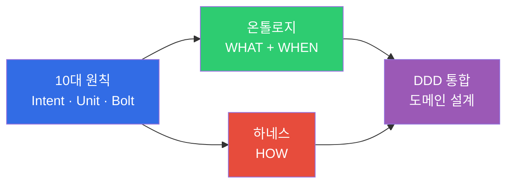

# AIDLC 방법론

> **읽는 시간**: 약 2분

:::info 공식 AIDLC 레퍼런스
본 섹션은 [AWS Labs AIDLC Workflows](https://github.com/awslabs/aidlc-workflows) (v0.1.7, 2026-04-02) 를 기반으로 DDD·Ontology·Harness 확장을 덧붙였습니다. 공식 5대 원칙·11개 Common Rules·7 stage Adaptive Execution 은 그대로 준수하되, engineering-playbook 은 **엔터프라이즈 신뢰성** 을 위한 온톨로지·하네스 축을 독자 확장했습니다.
:::

AIDLC 방법론은 AI 주도 개발의 **이론적 기반**을 제공합니다. 전통적 SDLC가 사람 중심의 장기 반복 주기를 전제로 설계되었다면, AIDLC는 AI를 첫 원칙(First Principles)에서 재구성하여 개발 라이프사이클의 핵심 협력자로 통합합니다.

**AIDLC 정의 & SDLC 비교**: [10대 원칙과 실행 모델](./principles-and-model.md#11-sdlc-vs-aidlc-비교) 참조

## 구성

방법론 트랙은 4개의 핵심 문서로 구성되며, 순서대로 읽으면 AIDLC의 전체 이론 체계를 이해할 수 있습니다.

| 순서 | 문서 | 핵심 질문 |
|------|------|----------|
| 1 | [10대 원칙과 실행 모델](./principles-and-model.md) | AIDLC는 무엇이고, 어떻게 동작하는가? (공식 5대 원칙 + Intent/Unit/Bolt 매핑) |
| 2 | [온톨로지 엔지니어링](./ontology-engineering.md) 🧩 | AI가 생성하는 코드의 **정확성**을 어떻게 보장하는가? (확장) |
| 3 | [하네스 엔지니어링](./harness-engineering.md) 🧩 | AI 실행의 **안전성**을 어떻게 아키텍처로 강제하는가? (확장) |
| 4 | [DDD 통합](./ddd-integration.md) | 비즈니스 도메인을 AI가 이해하는 설계로 어떻게 변환하는가? |
| 5 | [Common Rules](./common-rules.md) ⭐ | 공식 AIDLC 11개 공통 규칙은 무엇이며 어떻게 적용하는가? |
| 6 | [Adaptive Execution](./adaptive-execution.md) ⭐ | 공식 Inception 7 stage 와 Construction per-Unit 루프는 언제·어떻게 실행되는가? |

> ⭐ AWS Labs 공식 AIDLC 정합성 문서  
> 🧩 engineering-playbook 독자 확장 (엔터프라이즈 신뢰성)

## 다른 트랙과의 관계

- **[엔터프라이즈 도입](/docs/aidlc/enterprise)**: 방법론의 개념(온톨로지, 하네스)을 조직 변환과 비용 효과로 해석합니다.
- **[도구 & 구현](/docs/aidlc/toolchain)**: 방법론을 실현하는 구체적 도구(Kiro, Q Developer, EKS)를 다룹니다.
- **[AgenticOps](/docs/aidlc/operations)**: 운영 데이터가 온톨로지 Outer Loop로 피드백되는 순환 구조를 구축합니다.
