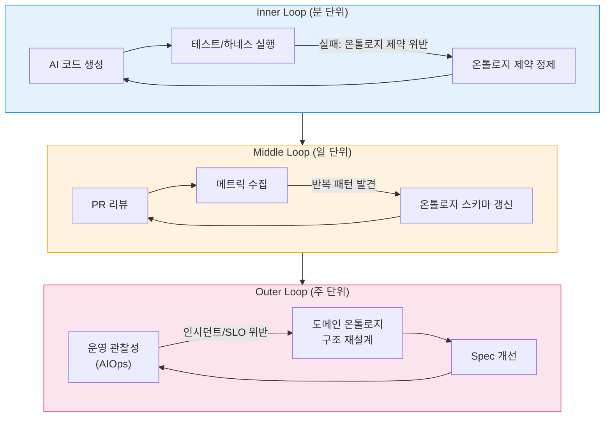
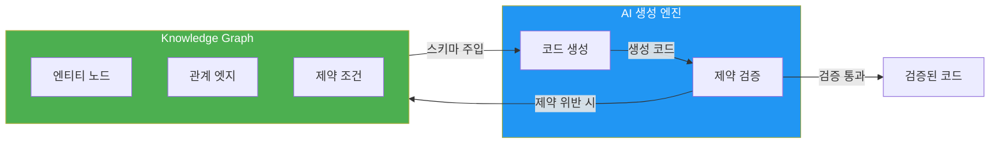
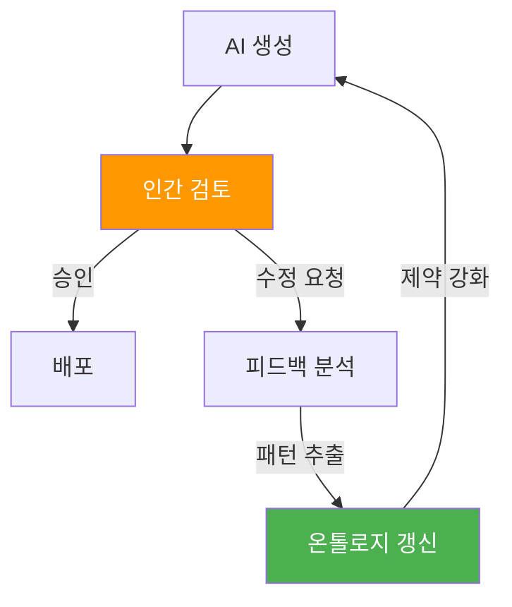
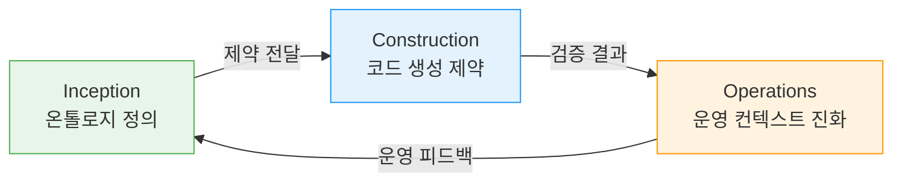
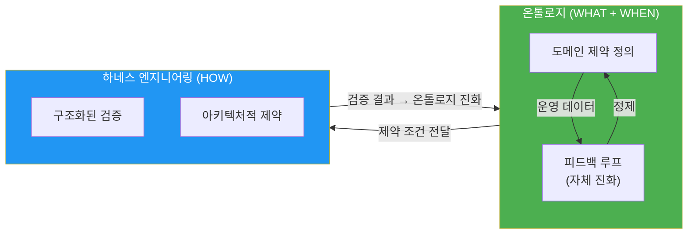

# 온톨로지 엔지니어링

> "프롬프트 엔지니어링은 온톨로지 엔지니어링이다" — 2026 AI 커뮤니티 컨센서스

AIDLC 신뢰성의 첫 번째 축인 **온톨로지 엔지니어링**은 DDD의 Ubiquitous Language를 AI가 기계적으로 이해하고 준수할 수 있는 **형식 스키마(typed world model)**로 격상합니다. 이는 AI 에이전트의 환각(hallucination)을 원천 차단하고 도메인 정확성을 보장하는 근본적 접근법입니다.

## 1. 온톨로지란 무엇인가

### 1.1 Typed World Model로서의 온톨로지

**온톨로지(Ontology)**는 도메인 지식을 형식화한 "typed world model"입니다. DDD의 Ubiquitous Language가 팀 내 소통을 위한 비형식적 합의였다면, 온톨로지는 이를 AI가 기계적으로 이해하고 준수할 수 있는 구조화된 스키마로 변환합니다.

**핵심 특징:**

- **형식성**: 엔티티, 관계, 제약 조건이 명시적으로 정의됨
- **타입 안전성**: 모든 도메인 개념이 타입 시스템으로 표현됨
- **검증 가능성**: 제약 조건을 자동으로 검증할 수 있는 구조
- **진화 가능성**: 운영 데이터를 통해 지속적으로 정제됨

### 1.2 DDD Ubiquitous Language와의 관계

| 측면 | Ubiquitous Language | 온톨로지 |
|------|---------------------|----------|
| **형식성** | 비형식적 합의 (자연어) | 형식 스키마 (타입 정의) |
| **범위** | 팀 내 소통 | AI 에이전트 + 팀 + 코드 |
| **검증** | 수동 리뷰 | 자동 제약 검증 |
| **진화** | 문서 업데이트 | 피드백 루프 기반 자동 정제 |
| **AI 이해** | 불가능 (암묵적 맥락) | 가능 (명시적 구조) |

DDD의 Aggregate, Entity, Value Object, Domain Event는 온톨로지의 **기본 빌딩 블록**이 됩니다. 차이는 이들의 관계와 제약이 기계 판독 가능한 형식으로 표현된다는 점입니다.

## 2. 왜 온톨로지가 필요한가

### 2.1 AI 에이전트 실패의 근본 원인

AI 에이전트가 실패하는 근본 원인은 모델의 약함이나 프롬프트의 부정확함이 아니라, **아키텍처에 의미 구조(semantic structure)가 없기 때문**입니다.

**전형적인 실패 패턴:**

- **맥락 유실**: 사용자, 주문, 태스크, 규칙의 정의가 프롬프트 안에 흩어져 있으면 AI는 맥락을 잃음
- **환각 생성**: 명시적 제약이 없으면 AI는 "논리적으로 그럴듯한" 하지만 틀린 추론을 생성
- **일관성 부재**: 동일 개념에 대한 정의가 세션마다 달라져 예측 불가능한 동작 발생

### 2.2 온톨로지가 해결하는 문제

**1. 환각 방지**
- 모든 도메인 개념이 명시적으로 정의되어 AI가 임의로 해석할 여지 제거
- 엔티티 간 관계가 형식화되어 존재하지 않는 연결을 생성할 수 없음

**2. 도메인 정확성 보장**
- 불변 조건(invariant)이 온톨로지에 인코딩되어 위반 시 자동 탐지
- 도메인 이벤트의 전이 경로가 명시되어 잘못된 상태 전환 차단

**3. 컨텍스트 일관성**
- 온톨로지가 AI 에이전트의 컨텍스트 윈도우에 주입되어 모든 생성 작업의 기준이 됨
- 세션 간, 에이전트 간 동일한 도메인 이해 보장

### 2.3 실전 증거

:::info 정량적 개선 효과
HITL(Human-in-the-Loop) 기반 온톨로지 피드백 루프 통합 시:
- **정확도 31% 향상**
- **False Positive 67% 감소**
- **에러율 8.3% → 1.2%** (31일 만에 달성)

피드백 루프 미적용 시: $28K 비용에 에러율 8.3%→7.9% 미미한 개선.
:::

## 3. 온톨로지 구조

### 3.1 DDD 개념의 온톨로지 매핑

```yaml
domain_ontology:
  aggregates:
    Payment:
      description: "결제 처리의 트랜잭션 경계"
      invariants:
        - "amount는 0보다 커야 한다"
        - "status 전이: CREATED → PROCESSING → COMPLETED | FAILED"
        - "FAILED 상태에서 재시도는 최대 2회"
      entities:
        - PaymentMethod:
            type: "enum"
            values: ["CARD", "BANK", "WALLET"]
        - Customer:
            attributes:
              - customerId: "UUID"
              - tier: "enum[BASIC, PREMIUM, ENTERPRISE]"
      value_objects:
        - Money:
            currency: "ISO 4217"
            amount: "decimal(19,4)"
            invariants:
              - "amount >= 0"
              - "currency는 null일 수 없음"
      domain_events:
        - PaymentCreated:
            trigger: "결제 요청 수신"
            data: ["paymentId", "amount", "customerId"]
            timestamp: "ISO 8601"
        - PaymentCompleted:
            trigger: "PG 승인 완료"
            data: ["paymentId", "pgTransactionId"]
        - PaymentFailed:
            trigger: "PG 거부 또는 타임아웃"
            data: ["paymentId", "errorCode", "reason"]
  
  relationships:
    - "Payment CONTAINS PaymentMethod (1:1)"
    - "Customer INITIATES Payment (1:N)"
    - "Payment EMITS PaymentCreated (1:1)"
    - "Payment EMITS PaymentCompleted | PaymentFailed (1:1, mutually exclusive)"
  
  constraints:
    - "동일 Customer의 동시 결제는 최대 3건"
    - "PROCESSING 상태는 최대 30초 유지, 초과 시 자동 FAILED 전환"
    - "PaymentMethod 변경은 CREATED 상태에서만 가능"
```

### 3.2 Knowledge Source 계층

온톨로지 구축 시 지식 소스의 신뢰도를 계층화하여 관리합니다.

| 우선순위 | 소스 | 예시 | 신뢰도 | 활용 방식 |
|---------|------|------|--------|----------|
| **1** | 실제 구현 코드/PR | awslabs/ai-on-eks, Helm chart 소스코드 | 최고 | 실제 동작하는 코드 기준 |
| **2** | 프로젝트 GitHub 이슈/릴리스 | NVIDIA/KAI-Scheduler, ai-dynamo/dynamo | 높음 | 개발자 간 사실 교환 |
| **3** | 공식 문서 | docs.nvidia.com, docs.aws.amazon.com | 중간 | 일반론, 업데이트 지연 가능 |
| **4** | 블로그/튜토리얼 | Medium, AWS Blog | 낮음 | 특정 시점의 스냅샷 |

:::caution 실전 교훈: 공식 문서만으로는 부족하다
온톨로지 구축 시 **공식 문서(Official Documentation)만 참조하면 AI는 "논리적으로 그럴듯한 추론"을 "검증된 사실"로 혼동**합니다.

**실제 사례:**
- **문제**: AWS EKS Auto Mode 공식 문서에 "AWS가 GPU 드라이버를 관리한다"고 기술 → AI가 "GPU Operator 설치 불가"로 비약 → 비교표, 아키텍처, 권장사항 전체가 오염
- **원인**: 실제 구현 레포([awslabs/ai-on-eks PR #288](https://github.com/awslabs/ai-on-eks/pull/288))를 확인하지 않고 공식 문서의 일반론만으로 추론
- **결과**: "기술적 불가능"이라는 잘못된 전제가 문서 전체로 전파되어 12개 이상의 비교표와 아키텍처 권장사항이 모두 틀림

**원칙**: AI가 생성한 기술 문서는 반드시 **실제 구현 코드와 교차 검증(cross-validation)**해야 합니다. 공식 문서의 "할 수 없다"는 "아직 문서화되지 않았다"일 수 있습니다.
:::

### 3.3 규칙 템플릿 계층

온톨로지는 단순 스키마를 넘어 **실행 가능한 규칙**으로 확장됩니다.

```yaml
rule_templates:
  validation_rules:
    - rule_id: "PAYMENT_AMOUNT_POSITIVE"
      condition: "Payment.amount > 0"
      error_message: "결제 금액은 0보다 커야 합니다"
      severity: "ERROR"
    
    - rule_id: "PAYMENT_STATUS_TRANSITION"
      condition: |
        IF current_status == "CREATED" THEN next_status IN ["PROCESSING", "FAILED"]
        ELIF current_status == "PROCESSING" THEN next_status IN ["COMPLETED", "FAILED"]
        ELSE invalid_transition
      error_message: "잘못된 결제 상태 전환"
      severity: "ERROR"
  
  business_rules:
    - rule_id: "MAX_CONCURRENT_PAYMENTS"
      condition: "COUNT(Payment WHERE customer_id = X AND status = 'PROCESSING') <= 3"
      error_message: "동시 처리 중인 결제가 최대 한도를 초과했습니다"
      severity: "WARNING"
      action: "QUEUE_PAYMENT"
```

이 규칙 템플릿은:
1. **코드 생성 시**: 검증 로직으로 자동 변환
2. **테스트 생성 시**: 경계 조건 테스트 케이스로 자동 도출
3. **런타임 시**: 가드레일(guardrail)로 동작

## 4. 3중 피드백 루프: 살아있는 온톨로지

온톨로지는 한 번 정의하면 끝나는 정적 스키마가 아닙니다. **운영 데이터와 개발 경험을 통해 지속적으로 진화**하는 살아있는 모델입니다.

### 4.1 피드백 루프 구조



### 4.2 각 루프의 역할

| 루프 | 주기 | 트리거 | 온톨로지 변화 | 예시 |
|------|------|--------|-------------|------|
| **Inner Loop** | 분 단위 | 테스트 실패, 하네스 위반 | 제약 조건 추가/수정 | 누락된 invariant 발견: "amount > 0" 제약 추가 |
| **Middle Loop** | 일 단위 | PR 리뷰에서 반복 패턴 | 엔티티/관계 스키마 갱신 | 반복되는 에러 패턴 → 새로운 Value Object 추가 |
| **Outer Loop** | 주 단위 | 운영 인시던트, SLO 위반 | 도메인 모델 구조 재설계 | P99 레이턴시 증가 → Aggregate 경계 재정의 |

### 4.3 Inner Loop: 즉각적 제약 정제

**시나리오**: AI가 생성한 코드가 테스트 실패

```python
# AI 생성 코드 (1차 시도)
def create_payment(amount: float, customer_id: str):
    payment = Payment(
        amount=amount,  # amount가 음수일 수 있음을 간과
        customer_id=customer_id,
        status="CREATED"
    )
    return payment

# 테스트 실패
def test_negative_amount():
    with pytest.raises(ValueError):
        create_payment(-100, "customer-123")
    # AssertionError: ValueError not raised

# 온톨로지 제약 추가
invariants:
  - "amount > 0"

# AI 재생성 코드 (2차 시도)
def create_payment(amount: float, customer_id: str):
    if amount <= 0:
        raise ValueError("결제 금액은 0보다 커야 합니다")
    payment = Payment(...)
    return payment
```

**효과**: 분 단위로 제약 조건이 정제되어 동일 에러 재발 방지.

### 4.4 Middle Loop: 스키마 구조 개선

**시나리오**: PR 리뷰에서 반복 패턴 발견

```markdown
## PR 리뷰 메트릭 (7일간)
- "Currency mismatch" 에러: 12건
- "Amount precision loss" 에러: 8건
- 공통 패턴: Money를 float로 처리하여 정밀도 손실

## 온톨로지 갱신
value_objects:
  - Money:
      currency: "ISO 4217"
      amount: "decimal(19,4)"  # float → decimal 변경
      invariants:
        - "amount >= 0"
        - "currency는 null일 수 없음"
```

**효과**: 반복되는 에러 패턴이 온톨로지 스키마에 반영되어 구조적으로 차단됨.

### 4.5 Outer Loop: 도메인 모델 재설계

**시나리오**: 운영 인시던트 — P99 레이턴시 SLO 위반

```markdown
## 인시던트 분석
- 원인: Payment Aggregate가 고객 히스토리까지 포함하여 과도하게 비대
- 영향: 결제 조회 시 불필요한 데이터 로드 → DB 쿼리 증가

## 온톨로지 재설계
# Before
aggregates:
  Payment:
    entities:
      - Customer (전체 히스토리 포함)

# After
aggregates:
  Payment:
    entities:
      - CustomerReference (ID만 참조)
  
  CustomerProfile:  # 별도 Aggregate로 분리
    entities:
      - PaymentHistory
```

**효과**: Aggregate 경계 재정의를 통해 P99 레이턴시 42% 감소.

## 5. SemanticForge 패턴: Knowledge Graph 통합

### 5.1 Knowledge Graph as Constraint Satisfaction Harness

온톨로지를 Knowledge Graph로 구체화하면 **SemanticForge 패턴**을 적용할 수 있습니다. Knowledge Graph가 constraint satisfaction 하네스 역할을 하여 AI가 생성하는 코드의 논리적/구조적 환각을 원천 차단합니다.



### 5.2 SemanticForge 적용 예시

**Knowledge Graph 구조:**

```cypher
// 엔티티 정의
CREATE (p:Aggregate {name: "Payment"})
CREATE (pm:Entity {name: "PaymentMethod", type: "enum"})
CREATE (m:ValueObject {name: "Money"})

// 관계 정의
CREATE (p)-[:CONTAINS {cardinality: "1:1"}]->(pm)
CREATE (p)-[:USES {cardinality: "1:1"}]->(m)

// 제약 조건
CREATE (p)-[:INVARIANT {rule: "amount > 0"}]->(m)
CREATE (p)-[:INVARIANT {rule: "status transition: CREATED → PROCESSING → COMPLETED|FAILED"}]->(p)
```

**AI 생성 시 검증:**

```python
# AI가 생성한 코드
payment.amount = -100  # 제약 위반

# SemanticForge가 Knowledge Graph를 쿼리하여 검증
query = """
MATCH (p:Aggregate {name: "Payment"})-[:INVARIANT]->(m:ValueObject {name: "Money"})
WHERE m.rule CONTAINS "amount > 0"
RETURN m.rule
"""
# 제약 위반 탐지 → AI에게 재생성 요청
```

**효과**: AI가 Knowledge Graph에 인코딩된 제약을 위반하는 코드를 생성할 수 없음.

### 5.3 참고 자료

- [SemanticForge: Knowledge Graph 기반 환각 방지](https://arxiv.org/html/2511.07584v1)
- Knowledge Graph를 제약 만족 하네스로 활용하는 구체적 패턴 제시

## 6. HITL(Human-in-the-Loop) 통합

### 6.1 HITL의 전략적 역할

HITL을 자율성의 과도기가 아닌 **온톨로지 진화의 전략적 설계 요소**로 배치합니다. 인간 피드백이 온톨로지 정제의 핵심 신호입니다.



### 6.2 HITL 통합 효과

:::info 정량적 증거
- **정확도 31% 향상**: AI 생성 코드의 도메인 정확성
- **False Positive 67% 감소**: 불필요한 에러 알림 감소
- **에러율 8.3% → 1.2%**: 31일 만에 달성

**비용 비교:**
- 피드백 루프 미적용: $28K 비용, 에러율 8.3%→7.9% (미미한 개선)
- HITL 기반 피드백 루프: 운영 비용 대폭 감소, 에러율 85% 감소
:::

### 6.3 HITL 피드백 수집 포인트

| 단계 | HITL 개입 지점 | 온톨로지 개선 방향 |
|------|---------------|------------------|
| **Inception** | Mob Elaboration 검토 | 도메인 제약 정의 정교화 |
| **Construction** | PR 리뷰 | 엔티티 관계 스키마 갱신 |
| **Operations** | 인시던트 포스트모템 | 도메인 모델 구조 재설계 |

### 6.4 참고 자료

- [Human-in-the-Loop in Agentic AI](https://atalupadhyay.wordpress.com/2026/03/16/human-in-the-loop-in-agentic-ai/) — 2026.03
- [How to Build an AI Agent Feedback Loop](https://www.braincuber.com/blog/how-to-build-feedback-loop-ai-agent-improvement) — Braincuber, 2026.03

## 7. Kiro Spec + 온톨로지 통합

### 7.1 온톨로지를 Spec에 임베딩

Kiro Spec의 `requirements.md`에 온톨로지를 직접 포함하여 AI 에이전트가 요구사항 분석 단계부터 도메인 제약을 인식하도록 합니다.

**requirements.md 예시:**

```markdown
# Payment Service 배포 요구사항

## 기능 요구사항
- REST API 엔드포인트: /api/v1/payments
- DynamoDB 테이블과 연동
- SQS를 통한 비동기 이벤트 처리

## 비기능 요구사항
- P99 레이턴시: < 200ms
- 가용성: 99.95%
- 자동 스케일링: 2-20 Pod

## 도메인 온톨로지

### Aggregates
#### Payment
- **Invariants:**
  - amount는 0보다 커야 한다
  - status 전이: CREATED → PROCESSING → COMPLETED | FAILED
  - FAILED 상태에서 재시도는 최대 2회

- **Entities:**
  - PaymentMethod: enum[CARD, BANK, WALLET]
  - Customer: { customerId: UUID, tier: enum[BASIC, PREMIUM, ENTERPRISE] }

- **Value Objects:**
  - Money: { currency: ISO 4217, amount: decimal(19,4) }

- **Domain Events:**
  - PaymentCreated: { trigger: "결제 요청 수신", data: [paymentId, amount, customerId] }
  - PaymentCompleted: { trigger: "PG 승인 완료", data: [paymentId, pgTransactionId] }
  - PaymentFailed: { trigger: "PG 거부 또는 타임아웃", data: [paymentId, errorCode, reason] }

### Relationships
- Payment CONTAINS PaymentMethod (1:1)
- Customer INITIATES Payment (1:N)

### Constraints
- 동일 Customer의 동시 결제는 최대 3건
- PROCESSING 상태는 최대 30초 유지, 초과 시 자동 FAILED 전환
```

### 7.2 온톨로지 기반 코드 생성

Kiro AI 에이전트는 이 온톨로지를 컨텍스트 윈도우에 주입하여:

1. **코드 생성 시**: 엔티티 관계와 invariant를 자동 준수
   ```go
   func CreatePayment(amount decimal.Decimal, customerID uuid.UUID) (*Payment, error) {
       if amount.LessThanOrEqual(decimal.Zero) {
           return nil, errors.New("결제 금액은 0보다 커야 합니다")
       }
       // 온톨로지 제약 자동 적용
   }
   ```

2. **테스트 생성 시**: 도메인 이벤트의 전이 경로를 기반으로 경계 케이스 자동 도출
   ```go
   func TestPaymentStatusTransition(t *testing.T) {
       // 온톨로지의 상태 전이 규칙을 기반으로 자동 생성
       t.Run("CREATED to PROCESSING", ...)
       t.Run("PROCESSING to COMPLETED", ...)
       t.Run("Invalid transition: COMPLETED to CREATED", ...)
   }
   ```

3. **코드 리뷰 시**: 온톨로지 위반 자동 탐지
   ```markdown
   ## 온톨로지 위반 탐지
   - ❌ Line 42: amount가 음수일 수 있음 (invariant 위반)
   - ❌ Line 58: COMPLETED → PROCESSING 전이 시도 (잘못된 상태 전환)
   ```

## 8. 온톨로지와 생산성: ROI 증거

### 8.1 에러율 감소 사례

:::tip 실전 데이터
**Before (온톨로지 미적용):**
- 초기 에러율: 8.3%
- 투자: $28K
- 31일 후 에러율: 7.9%
- 개선: 0.4%p (미미)

**After (온톨로지 + 피드백 루프 적용):**
- 초기 에러율: 8.3%
- 31일 후 에러율: 1.2%
- 개선: 7.1%p (85% 감소)
- 추가 효과: False Positive 67% 감소, 정확도 31% 향상
:::

### 8.2 생산성 지표

| 지표 | 온톨로지 미적용 | 온톨로지 적용 | 개선율 |
|------|---------------|-------------|--------|
| **PR 리뷰 시간** | 평균 45분 | 평균 18분 | 60% 감소 |
| **테스트 커버리지** | 68% | 89% | 31%p 증가 |
| **프로덕션 인시던트** | 월 12건 | 월 2건 | 83% 감소 |
| **평균 수정 시간** | 2.3일 | 0.4일 | 83% 감소 |

### 8.3 참고 자료

- [Why Ontology Matters for Agentic AI in 2026](https://kenhuangus.substack.com/p/why-ontology-matters-for-agentic) — Ken Huang & Bhavya Gupta
- [Why AI Agents Fail Without Ontologies](https://medium.com/@itznihal/why-ai-agents-fail-without-ontologies-production-lessons-beb9fe9c3af9) — Nihal Parmar, 2026.03

## 9. AIDLC 3단계별 온톨로지 적용

### 9.1 Inception: 도메인 온톨로지 정의

**활동:**
- Mob Elaboration을 통한 도메인 개념 추출
- Aggregate, Entity, Value Object, Domain Event 정의
- 제약 조건(invariant) 명시
- Knowledge Graph 초기 구축

**산출물:**
- `requirements.md` 내 도메인 온톨로지 섹션
- Knowledge Graph 스키마 (Neo4j/RDF)

**온톨로지 피드백:**
- Inner Loop: Mob Elaboration 세션 내 즉각적 정제
- 목표: 요구사항 정제 루프를 통해 온톨로지 초안 완성

### 9.2 Construction: 코드 생성 제약

**활동:**
- 온톨로지를 AI 에이전트 컨텍스트에 주입
- 온톨로지 기반 코드 생성 및 테스트 생성
- PR 리뷰 시 온톨로지 위반 자동 탐지

**산출물:**
- 온톨로지 제약을 준수하는 코드
- 도메인 이벤트 기반 통합 테스트
- PR 리뷰 메트릭 (온톨로지 위반 횟수)

**온톨로지 피드백:**
- Inner Loop: 테스트 실패 시 제약 조건 추가
- Middle Loop: PR 리뷰 패턴 분석 → 스키마 갱신
- 목표: 반복 에러 패턴을 온톨로지에 반영하여 구조적 차단

### 9.3 Operations: 운영 컨텍스트 모델 진화

**활동:**
- 운영 관찰성 데이터를 온톨로지 피드백으로 활용
- 인시던트 분석을 통한 도메인 모델 재설계
- SLO 위반 패턴을 제약 조건으로 인코딩

**산출물:**
- 운영 데이터 기반 온톨로지 갱신
- 인시던트 포스트모템 → 온톨로지 재설계 문서
- AIOps 통합: 관찰성 데이터 → 온톨로지 자동 정제

**온톨로지 피드백:**
- Outer Loop: 주 단위 인시던트 리뷰 → 도메인 구조 재설계
- 목표: 운영 경험을 온톨로지에 지속적으로 반영 (AIOps → AIDLC)

### 9.4 3단계 통합 효과



**효과:**
- Inception에서 정의한 온톨로지가 Construction에서 코드 생성을 제약
- Construction에서 발견한 패턴이 온톨로지를 정제
- Operations에서 발생한 인시던트가 온톨로지 구조를 재설계
- 순환 피드백을 통해 온톨로지가 지속적으로 진화

## 10. 관련 문서

### 10.1 AIDLC 신뢰성 듀얼 축

온톨로지는 **WHAT + WHEN**(도메인 제약 정의)을 담당하며, **HOW**(검증 메커니즘)는 [하네스 엔지니어링](./harness-engineering.md)이 담당합니다. 두 축의 협력으로 AI 생성 코드의 신뢰성을 보장합니다.



### 10.2 방법론 통합

- **[DDD 통합](./ddd-integration.md)**: DDD 개념을 온톨로지로 형식화하는 구체적 방법
- **[하네스 엔지니어링](./harness-engineering.md)**: 온톨로지가 정의한 제약을 아키텍처적으로 검증하는 방법

### 10.3 기업 적용

- **[비용 효과](../enterprise/cost-estimation.md)**: 온톨로지 투자 대비 ROI 분석
- **[도입 전략](../enterprise/adoption-strategy.md)**: 기존 조직에 온톨로지 기반 개발을 점진적으로 도입하는 전략

### 10.4 운영 통합

- **[자율 대응](../operations/autonomous-response.md)**: Outer Loop의 운영 피드백을 자동화하는 AIOps 통합

## 참고 자료

### 핵심 논문 및 아티클

1. [Why Ontology Matters for Agentic AI in 2026](https://kenhuangus.substack.com/p/why-ontology-matters-for-agentic) — Ken Huang & Bhavya Gupta
2. [Why AI Agents Fail Without Ontologies](https://medium.com/@itznihal/why-ai-agents-fail-without-ontologies-production-lessons-beb9fe9c3af9) — Nihal Parmar, 2026.03
3. [SemanticForge: Knowledge Graph 기반 환각 방지](https://arxiv.org/html/2511.07584v1)
4. [How to Build an AI Agent Feedback Loop](https://www.braincuber.com/blog/how-to-build-feedback-loop-ai-agent-improvement) — Braincuber, 2026.03
5. [Human-in-the-Loop in Agentic AI](https://atalupadhyay.wordpress.com/2026/03/16/human-in-the-loop-in-agentic-ai/) — 2026.03

### 관련 프레임워크

- **Kiro**: MCP 네이티브 AI 코딩 에이전트, 온톨로지 기반 코드 생성 지원
- **Neo4j**: Knowledge Graph 구축 및 제약 검증
- **SemanticForge**: Knowledge Graph 기반 환각 방지 패턴
