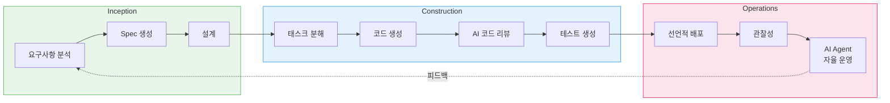
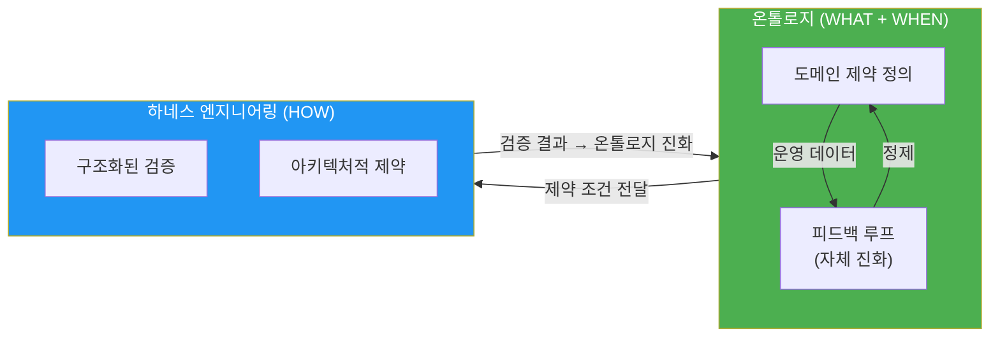

import { AidlcPrinciples, AidlcArtifacts, AidlcPhaseMapping, AidlcPhaseActivities } from '@site/src/components/AidlcTables';

# AIDLC 10대 원칙과 실행 모델

> 📅 **작성일**: 2026-04-07 | ⏱️ **읽는 시간**: 약 15분

---

## 1. 왜 AIDLC인가

전통적 소프트웨어 개발 라이프사이클(SDLC)은 사람 중심의 장기 반복 주기(주/월 단위)를 전제로 설계되었습니다. 데일리 스탠드업, 스프린트 리뷰, 회고 같은 리추얼은 이 긴 주기에 최적화된 것입니다. AI의 등장으로 이 전제가 무너집니다.

AI는 요구사항 분석, 태스크 분해, 코드 생성, 테스트까지 **시간/일 단위**로 수행합니다. 기존 SDLC에 AI를 끼워 넣는(Retrofit) 접근은 이 잠재력을 제한합니다 — 마치 자동차 시대에 더 빠른 마차를 만드는 것과 같습니다.

**AIDLC(AI-Driven Development Lifecycle)**는 AWS Labs가 제시한 방법론으로, AI를 **첫 원칙(First Principles)**에서 재구성하여 개발 라이프사이클의 핵심 협력자로 통합합니다.

### 1.1 SDLC vs AIDLC 비교

```
전통적 SDLC                          AIDLC
━━━━━━━━━━━━━━                      ━━━━━━━━━━━━━━━━━━━
사람이 계획하고 실행                    AI가 제안하고, 사람이 검증
주/월 단위 반복 (Sprint)               시간/일 단위 반복 (Bolt)
설계 기법은 팀 선택                     DDD/BDD/TDD를 방법론에 내장
역할 사일로 (FE/BE/DevOps)            AI로 역할 경계 초월
수동 요구사항 분석                      AI가 Intent를 Unit으로 분해
순차적 핸드오프                         연속 흐름 + Loss Function 검증
```

### 1.2 AWS Labs AIDLC 공식 용어 매핑

engineering-playbook 은 독자 확장 용어(Intent · Unit · Bolt)를 사용합니다. 이는 AWS Labs 의 [AIDLC Workflows](https://github.com/awslabs/aidlc-workflows) 공식 용어와 다음과 같이 매핑됩니다:

| engineering-playbook 용어 | AWS Labs 공식 용어 | 비고 |
|---------------------------|------------------|------|
| **Intent** | User Request / Requirements | 비즈니스 목적. 공식 저장소는 자연어 형태 User Request 를 Requirements Document 로 정제함. 동일 개념 |
| **Unit** | Unit of Work | DDD Subdomain 단위 작업. 공식 저장소는 `construction/` 단계에서 여러 Unit of Work 를 병렬·순차 실행 — 동일 개념 |
| **Bolt** | Phase Execution | Sprint 대체 개념으로 **engineering-playbook 독자 용어**. 공식 저장소에는 동치어가 없고 Phase 별 stage 실행으로 표현됨 |

:::info 용어 선택 이유
engineering-playbook 은 한국 엔터프라이즈 컨텍스트(워터폴→하이브리드 전환, RFP 고정가 입찰 등)에서 **팀 내 소통 효율**을 위해 짧고 의미가 명확한 용어(Intent · Unit · Bolt)를 채택했습니다. 공식 AWS Labs 저장소와 협업하거나 원문을 참조할 때는 위 매핑 표로 용어를 번역해 사용하세요.
:::

### 1.3 AWS Labs AIDLC 공식 5대 원칙

AWS Labs 저장소의 `aws-aidlc-rule-details/common/` 디렉터리는 AIDLC 동작의 기초가 되는 공식 5대 원칙을 정의합니다. engineering-playbook 의 10대 원칙은 이 5대 원칙을 기반으로 확장·심화한 것입니다.

:::note AWS Labs AIDLC 공식 5대 원칙
1. **No duplication** — 단일 진실 원천(SSOT) 유지. 동일 정보를 여러 문서·도구에 중복 생성하지 않음
2. **Methodology first** — AIDLC 방법론이 도구·플랫폼에 선행. 7개 지원 플랫폼(Kiro · Q Developer · Cursor · Cline · Claude Code · GitHub Copilot · AGENTS.md) 어디서든 동일하게 동작
3. **Reproducible** — 동일 입력(User Request, Workspace 상태)에 대해 **동일 모델이면 동일 산출물** 생산. 모델 교체 시 결과가 크게 변하지 않도록 구조화된 질문/응답 포맷 강제
4. **Agnostic** — 특정 언어·프레임워크·클라우드에 종속되지 않음. 산출물은 평문 Markdown + 표준화된 섹션 구조로 작성
5. **Human in the loop** — Checkpoint Approval 게이트로 각 stage 전환마다 명시적 승인 필요. AI 자율성과 인간 통제의 균형 유지
:::

engineering-playbook 의 10대 원칙 (§2) 은 공식 5대 원칙에 DDD/BDD/TDD 내장, 연속 흐름(Loss Function), 온톨로지·하네스 엔지니어링 등 **엔터프라이즈 특화 축**을 덧붙인 확장입니다.

### 1.4 핵심 전환: 대화의 방향을 역전

전통적 개발에서 사람은 컴퓨터에게 명령합니다("이 기능을 구현해"). AIDLC에서는 **AI가 먼저 계획을 제안**하고 사람이 검증합니다. 이는 단순한 역할 교환이 아니라, **AI의 탐색 능력과 사람의 판단력을 최적으로 결합**하는 구조입니다.

Google Maps 비유가 적절합니다. 운전자는 목적지(Intent)를 설정하고, AI가 경로를 제안하면, 운전자는 경로를 검증하고 필요시 수정합니다. AI는 실시간으로 교통 상황(코드베이스, 기술 부채, 의존성)을 분석하여 최적 경로를 찾고, 운전자는 비즈니스 맥락(우선순위, 리스크 허용도)을 반영하여 최종 결정합니다.

:::info 원문 참조
AIDLC의 핵심 개념은 AWS Labs의 [AI-DLC Method Definition](https://prod.d13rzhkk8cj2z0.amplifyapp.com/)에서 정의됩니다. 이 문서는 해당 방법론의 철학과 실행 모델을 정리한 개념 가이드입니다.
:::

---

## 2. AIDLC 10대 원칙

<AidlcPrinciples />

### 2.1 핵심 3원칙 심화

#### 1. Reverse the Conversation Direction (대화 방향 역전)

**전통적 접근:**
```
개발자: "API 엔드포인트 /users를 추가해줘"
AI: "네, 만들었습니다"
개발자: "아니야, 인증이 필요해"
AI: "수정했습니다"
```

**AIDLC 접근:**
```
개발자: "사용자 관리 기능이 필요해" (Intent)
AI: "분석 결과, 다음 3가지 Unit이 필요합니다:
     1. User Authentication Service (OAuth2 + JWT)
     2. User CRUD API (REST + GraphQL)
     3. User Profile Storage (DynamoDB)
     각 Unit의 Domain Design과 Logical Design을 제안합니다..."
개발자: "GraphQL은 제외하고, RDS로 변경해"
AI: "수정된 계획을 생성합니다..."
```

AI는 코드를 생성하기 전에 **전체 아키텍처를 제안**하고, 개발자는 비즈니스 맥락을 반영하여 검증합니다. 이는 코드 레벨이 아닌 **설계 레벨에서의 협업**입니다.

#### 2. Integration of Design Techniques (설계 기법 내장)

Scrum에서 DDD/BDD/TDD는 "팀이 알아서 선택"하는 옵션이었습니다. AIDLC는 이들을 **방법론의 필수 코어**로 내장합니다.

- **DDD (Domain-Driven Design)** — AI가 비즈니스 로직을 Aggregate, Entity, Value Object로 자동 모델링합니다. [온톨로지 엔지니어링](./ontology-engineering.md)과 결합하여 도메인 지식을 구조화합니다.
- **BDD (Behavior-Driven Development)** — AI가 Given-When-Then 시나리오를 생성하여 비즈니스 행동을 명확히 합니다.
- **TDD (Test-Driven Development)** — AI가 테스트를 먼저 작성하고, 테스트를 통과하는 최소 코드를 생성합니다.

이들은 선택이 아닌 **AI가 코드를 생성하는 표준 워크플로우**입니다.

#### 3. Minimize Stages, Maximize Flow (단계 최소화, 흐름 극대화)

전통적 SDLC의 핸드오프(기획 → 설계 → 개발 → 테스트 → 배포)는 각 단계마다 지식 손실과 지연을 초래합니다. AIDLC는 **연속 흐름(Continuous Flow)**을 추구합니다.

각 단계의 사람 검증은 **Loss Function** 역할을 합니다. 머신러닝에서 Loss Function이 모델의 오류를 측정하고 학습을 유도하듯, AIDLC에서 사람 검증은 AI 생성 산출물의 오류를 조기에 포착하여 하류 전파를 방지합니다.

```
Intent 검증 (사람) → Unit 분해 검증 (사람) → Design 검증 (사람) → 코드 검증 (사람)
     ↓                    ↓                      ↓                    ↓
  Loss 1              Loss 2                 Loss 3               Loss 4
```

Loss가 작을수록 다음 단계로 진행하고, Loss가 크면 AI가 재생성합니다. 이는 **적응형 워크플로우**로, 상황에 따라 필요한 단계만 실행합니다.

---

## 3. Intent → Unit → Bolt 실행 모델

AIDLC는 전통적 SDLC의 용어를 AI 시대에 맞게 재정의합니다.

```
┌─────────┐    ┌─────────┐    ┌─────────┐
│  Intent  │───▶│  Unit   │───▶│  Bolt   │
│ 고수준 목적│    │독립 작업단위│   │빠른 반복 │
│          │    │(DDD Sub- │   │(Sprint  │
│비즈니스 목표│   │ domain)  │   │ 대체)   │
└─────────┘    └─────────┘    └─────────┘
                    │
              ┌─────┴─────┐
              ▼           ▼
        ┌──────────┐ ┌──────────┐
        │ Domain   │ │ Logical  │
        │ Design   │ │ Design   │
        │비즈니스 로직│ │NFR+패턴  │
        └──────────┘ └──────────┘
              │           │
              └─────┬─────┘
                    ▼
            ┌──────────────┐
            │ Deployment   │
            │    Unit      │
            │컨테이너+Helm+ │
            │  Terraform   │
            └──────────────┘
```

<AidlcArtifacts />

### 3.1 Intent (의도)

**Epic/Feature의 AI 재정의**

전통적 Epic은 "큰 User Story 묶음"이었습니다. AIDLC에서 Intent는 **비즈니스 목적을 명시한 고수준 목표**입니다.

**예시:**
```
전통적 Epic: "사용자 인증 기능 구현"
            → 모호함, 범위 불명확, 기술적 세부사항 포함

AIDLC Intent: "고객이 소셜 로그인(Google, GitHub)으로 
               플랫폼에 접근하여 개인화된 대시보드를 사용할 수 있다"
            → 비즈니스 가치 명확, AI가 기술 선택 제안
```

Intent는 **WHAT(무엇을)과 WHY(왜)**를 명시하고, **HOW(어떻게)**는 AI에게 위임합니다.

### 3.2 Unit (단위)

**User Story의 AI 재정의**

전통적 User Story는 "As a X, I want Y, so that Z" 템플릿으로 사람이 수동 작성했습니다. AIDLC에서 Unit은 **AI가 Intent를 DDD Subdomain으로 자동 분해한 독립 작업 단위**입니다.

**Intent → Unit 분해 예시:**
```
Intent: "고객이 소셜 로그인으로 플랫폼에 접근하여 개인화된 대시보드를 사용할 수 있다"

AI가 생성한 Units:
1. Authentication Service (Core Subdomain)
   - OAuth2 통합 (Google, GitHub)
   - JWT 토큰 발급/검증
   - Refresh Token 관리

2. User Profile Management (Core Subdomain)
   - 사용자 프로필 CRUD
   - 프로필 이미지 업로드 (S3)
   - 프로필 데이터 저장 (RDS)

3. Dashboard Service (Supporting Subdomain)
   - 사용자별 위젯 구성
   - 대시보드 레이아웃 저장
   - 실시간 데이터 집계

4. IAM Integration (Generic Subdomain)
   - AWS Cognito 연동
   - 권한 관리
   - 감사 로그
```

각 Unit은 다음을 포함합니다:
- **Domain Design** — DDD Aggregate, Entity, Value Object
- **Logical Design** — NFR(비기능 요구사항), 아키텍처 패턴, 기술 스택
- **Deployment Unit** — 컨테이너, Helm Chart, Terraform 모듈

### 3.3 Bolt (반복)

**Sprint의 AI 재정의**

전통적 Sprint는 2-4주 단위의 고정 주기였습니다. AIDLC에서 Bolt는 **AI의 빠른 실행 속도에 맞춘 시간/일 단위의 짧은 반복**입니다.

**Sprint vs Bolt 비교:**
```
Sprint (전통적)                   Bolt (AIDLC)
━━━━━━━━━━━━━━                  ━━━━━━━━━━━━━━
2-4주 고정 주기                    시간/일 단위 유연 주기
Planning → Daily → Review         AI 제안 → 검증 → 실행 → 검증
사람이 태스크 분해                 AI가 태스크 자동 분해
수동 코드 작성                     AI 코드 생성 + 사람 검증
Sprint 끝에 배포                   완료 즉시 배포 (GitOps)
```

Bolt는 **완료 조건이 명확한 최소 배포 단위**입니다. Kubernetes Deployment, Helm Release, Terraform Module 등 실제 인프라 구성 요소와 1:1 매핑됩니다.

:::tip Context Memory와 추적성
모든 산출물(Intent, Unit, Domain Design, Logical Design, Deployment Unit)은 **Context Memory**로 저장되어 AI가 라이프사이클 전체에서 참조합니다. 산출물 간 양방향 추적(Domain Model ↔ User Story ↔ 테스트 계획)이 보장되어, AI가 항상 정확한 맥락에서 작업합니다.
:::

---

## 4. AI 주도 재귀적 워크플로우

AIDLC의 핵심은 **AI가 계획을 제안하고 사람이 검증하는 재귀적 정제** 과정입니다.

```
Intent (비즈니스 목적)
  │
  ▼
AI: Level 1 Plan 생성 ◀──── 사람: 검증 · 수정
  │
  ├─▶ Step 1 ──▶ AI: Level 2 분해 ◀── 사람: 검증
  │                 ├─▶ Sub-task 1.1 ──▶ AI 실행 ◀── 사람: 검증
  │                 └─▶ Sub-task 1.2 ──▶ AI 실행 ◀── 사람: 검증
  │
  ├─▶ Step 2 ──▶ AI: Level 2 분해 ◀── 사람: 검증
  │                 └─▶ ...
  └─▶ Step N ──▶ ...

[모든 산출물 → Context Memory → 양방향 추적성]
```

### 4.1 Loss Function으로서의 사람 검증

머신러닝에서 Loss Function은 모델의 예측과 실제 값의 차이를 측정하여 학습을 유도합니다. AIDLC에서 사람 검증은 동일한 역할을 합니다.

**Loss Function 계층:**

```
┌─────────────────────────────────────────────┐
│ Intent Loss                                 │
│ "비즈니스 목적이 명확한가?"                 │
│ Loss 크면 → Intent 재작성                    │
└─────────────────────────────────────────────┘
              ▼
┌─────────────────────────────────────────────┐
│ Unit Decomposition Loss                     │
│ "Unit 분해가 적절한가? 누락/중복 없는가?"    │
│ Loss 크면 → Unit 재분해                      │
└─────────────────────────────────────────────┘
              ▼
┌─────────────────────────────────────────────┐
│ Design Loss                                 │
│ "DDD 모델이 도메인을 정확히 반영하는가?"    │
│ Loss 크면 → Design 재생성                    │
└─────────────────────────────────────────────┘
              ▼
┌─────────────────────────────────────────────┐
│ Code Loss                                   │
│ "생성된 코드가 설계를 정확히 구현하는가?"   │
│ Loss 크면 → 코드 재생성                      │
└─────────────────────────────────────────────┘
```

각 단계의 Loss가 작으면 다음 단계로 진행하고, Loss가 크면 해당 단계를 재실행합니다. 이는 **오류의 하류 전파를 방지**하여 전체 품질을 보장합니다.

### 4.2 적응형 워크플로우

AI는 상황에 따라 **필요한 단계만 실행**하는 적응형 워크플로우를 제공합니다.

**시나리오별 워크플로우:**

```
신규 기능 개발:
  Intent → Unit 분해 → Domain Design → Logical Design → 코드 생성 → 테스트

버그 수정:
  Intent → 기존 코드 분석 → 수정 코드 생성 → 테스트

리팩터링:
  Intent → 기존 Design 분석 → 개선된 Design → 코드 재생성 → 테스트

기술 부채 해소:
  Intent → 부채 영역 식별 → 리팩터링 계획 → 단계별 실행
```

AI가 경로별 고정 워크플로우를 강제하지 않고, **상황에 맞는 Level 1 Plan을 제안**하는 유연한 접근입니다.

---

## 5. AIDLC 3단계 개관

AIDLC는 **Inception**, **Construction**, **Operations** 3단계로 구성됩니다.

### 5.0 AWS Labs 공식 3단계와 engineering-playbook 확장 매핑

AWS Labs 공식 저장소는 Inception → Construction → Operations 3단계를 정의하되, Operations 는 현재 **플레이스홀더(기본 stage 정의만 존재, 자세한 워크플로는 추후 공개)** 상태입니다. engineering-playbook 은 이 공백을 **AgenticOps 트랙**으로 확장했습니다.

| 공식 단계 | 공식 정의 상태 (v0.1.7, 2026-04-02) | engineering-playbook 확장 | 주요 문서 |
|-----------|--------------------------------------|---------------------------|----------|
| **Inception** | Workspace Detection · Reverse Engineering · Requirements Analysis · User Stories · Workflow Planning · Application Design · Units Generation (7 stage) | Intent 정의 + 온톨로지 구축 + DDD Strategic Design | [10대 원칙](./principles-and-model.md) · [온톨로지 엔지니어링](./ontology-engineering.md) · [DDD 통합](./ddd-integration.md) |
| **Construction** | Functional Design → NFR → Infrastructure → Code Generation → Build & Test (per Unit loop) | Bolt 실행 + 하네스 엔지니어링 + Quality Gate | [하네스 엔지니어링](./harness-engineering.md) · [AI 코딩 에이전트](../toolchain/ai-coding-agents.md) · [EKS 선언적 자동화](../toolchain/eks-declarative-automation.md) |
| **Operations** | Placeholder (stage 정의만 존재) | **AgenticOps 트랙** — AI 에이전트 기반 자율 운영, 관찰성·예측·자동 대응, 온톨로지 Outer Loop 피드백 | [AgenticOps](../operations/index.md) · [관찰성 스택](../operations/observability-stack.md) · [예측 운영](../operations/predictive-operations.md) · [자율 대응](../operations/autonomous-response.md) |

:::tip AgenticOps 확장의 가치
공식 AIDLC 가 Operations 단계를 플레이스홀더로 둔 이유는 운영 영역이 **조직별 관찰성 스택·규제 환경·SRE 성숙도에 따라 크게 달라지기 때문**입니다. engineering-playbook 의 AgenticOps 트랙은 AWS 기반 엔터프라이즈 환경(EKS · CloudWatch · ADOT · Application Signals · MCP)을 전제로 한 참조 구현을 제공합니다.
:::

<AidlcPhaseMapping />



<AidlcPhaseActivities />

### 5.1 Inception (착수)

**목표:** Intent를 명확히 하고 Unit으로 분해

**AI 역할:**
- Intent 분석 및 불명확한 부분 질문
- Intent를 DDD Subdomain(Core/Supporting/Generic)으로 분해
- 각 Unit의 Domain Design 초안 생성

**사람 역할:**
- Intent 검증 (비즈니스 목적 명확성)
- Unit 분해 검증 (누락/중복 확인)
- Domain Design 검증 (도메인 지식 반영)

**산출물:**
- Intent Document
- Unit List (DDD Subdomain)
- Domain Design (Aggregate, Entity, Value Object)

### 5.2 Construction (구축)

**목표:** Unit을 실행 가능한 코드와 인프라로 구현

**AI 역할:**
- Logical Design 생성 (NFR, 아키텍처 패턴, 기술 스택)
- 코드 생성 (TDD: 테스트 먼저, 구현 나중)
- 코드 리뷰 (정적 분석, 보안 스캔)
- Deployment Unit 생성 (Dockerfile, Helm Chart, Terraform)

**사람 역할:**
- Logical Design 검증 (NFR 충족 여부)
- 코드 검증 (비즈니스 로직 정확성)
- 보안 검증 (민감한 로직 검토)

**산출물:**
- Logical Design Document
- Source Code + Tests
- Deployment Unit (컨테이너, IaC)

### 5.3 Operations (운영)

**목표:** 배포 후 모니터링, 자동 복구, 지속적 개선

**AI 역할:**
- GitOps 자동 배포 (ArgoCD)
- 실시간 모니터링 (로그, 메트릭, 트레이스 분석)
- 이상 탐지 및 자동 복구
- 피드백을 Intent로 변환하여 Inception으로 전달

**사람 역할:**
- 배포 승인 (프로덕션 환경)
- 인시던트 대응 (AI 제안 검증)
- 비즈니스 피드백 제공

**산출물:**
- 관찰성 대시보드 (Grafana, CloudWatch)
- 인시던트 리포트
- 개선 Intent (다음 사이클)

---

## 6. 신뢰성 보장: 온톨로지 × 하네스

AI 생성 코드의 신뢰성을 체계적으로 보장하기 위해, AIDLC는 **온톨로지**와 **하네스 엔지니어링** 두 축의 신뢰성 프레임워크를 도입합니다.



**두 축의 역할:**

- **[온톨로지](./ontology-engineering.md)** — 도메인 지식을 형식화한 "typed world model". DDD의 Ubiquitous Language를 AI가 이해할 수 있는 구조화된 스키마로 격상합니다. 온톨로지는 정적 스키마가 아니라 **자체 피드백 루프를 통해 지속적으로 진화**하는 살아있는 모델입니다.

- **[하네스 엔지니어링](./harness-engineering.md)** — 온톨로지가 정의한 제약을 아키텍처적으로 검증하고 강제하는 구조. "에이전트가 어려운 게 아니라, 하네스가 어렵다"는 2026년의 핵심 교훈입니다. 하네스의 검증 결과는 온톨로지의 진화를 촉진합니다.

:::tip 신뢰성 프레임워크의 핵심
온톨로지와 하네스는 **독립적으로 동작하지 않습니다**. 온톨로지가 "무엇을 검증할지"를 정의하면, 하네스가 "어떻게 검증할지"를 구현합니다. 하네스의 검증 결과는 다시 온톨로지의 진화를 유도하여, **자기 개선하는 신뢰성 시스템**을 구성합니다.
:::

---

## 7. 도입 로드맵

AIDLC는 단계적으로 도입하여 조직의 성숙도를 점진적으로 높입니다.

```
Phase 1: AI 코딩 도구 도입
  └── Q Developer/Copilot으로 코드 생성·리뷰 시작
      (성숙도 Level 2)

Phase 2: Spec-Driven 개발
  └── AI Agent로 체계적 requirements → 코드 워크플로우
      Mob Elaboration 리추얼 시범 도입
      (성숙도 Level 3)

Phase 3: 선언적 자동화
  └── GitOps로 배포 자동화
      AI/CD 파이프라인 전환
      (성숙도 Level 3→4)

Phase 4: AI Agent 확장
  └── AI Agent로 자율 운영
      Mob Construction 리추얼 확산
      (성숙도 Level 4)
```

### 7.1 Phase 1: AI 코딩 도구 도입 (2-4주)

**목표:** 개발자가 AI 코딩 도구에 익숙해지기

**활동:**
- Amazon Q Developer 또는 GitHub Copilot 설치
- 코드 자동 완성, 함수 생성, 테스트 생성 실습
- AI 생성 코드 검증 프로세스 수립

**성공 지표:**
- 개발자의 80% 이상이 AI 코딩 도구 일상 사용
- 코드 작성 속도 30% 이상 향상

### 7.2 Phase 2: Spec-Driven 개발 (1-2개월)

**목표:** AI가 요구사항을 분석하고 설계를 제안하는 워크플로우 확립

**활동:**
- AI Agent(Q Developer, 오픈소스 Agent)로 Intent → Unit 분해 실습
- Mob Elaboration 리추얼 도입 (주 1회, 전체 팀 참여)
- Context Memory 구축 (프로젝트 문서, 아키텍처, 코드베이스)

**성공 지표:**
- 신규 기능의 50% 이상이 AI 제안 설계로 시작
- 요구사항 분석 시간 40% 이상 단축

### 7.3 Phase 3: 선언적 자동화 (2-3개월)

**목표:** GitOps로 배포를 자동화하고, AI가 인프라 코드를 생성

**활동:**
- ArgoCD 또는 Flux로 GitOps 구축
- AI가 Helm Chart, Terraform 모듈 자동 생성
- AI/CD 파이프라인 전환 (CI/CD → AI/CD)

**성공 지표:**
- 배포 리드타임 50% 이상 단축
- 인프라 코드의 70% 이상이 AI 생성

### 7.4 Phase 4: AI Agent 확장 (3-6개월)

**목표:** AI Agent가 운영을 자율적으로 수행

**활동:**
- AI Agent로 로그/메트릭 분석, 이상 탐지, 자동 복구
- Mob Construction 리추얼 확산 (일상화)
- [온톨로지](./ontology-engineering.md) + [하네스](./harness-engineering.md) 신뢰성 프레임워크 구축

**성공 지표:**
- 인시던트 대응 시간 60% 이상 단축
- 인시던트의 40% 이상이 AI 자동 복구

---

## 8. 다음 단계

AIDLC의 핵심 개념과 실행 모델을 이해했다면, 다음 문서를 참고하세요:

- **[온톨로지 엔지니어링](./ontology-engineering.md)** — 도메인 지식을 AI가 이해할 수 있는 구조화된 스키마로 변환
- **[하네스 엔지니어링](./harness-engineering.md)** — AI Agent의 행동을 아키텍처적으로 검증하고 강제하는 구조
- **[DDD 통합](./ddd-integration.md)** — AIDLC에서 DDD를 실천하는 구체적 방법

---

## 참고 자료

### AIDLC 공식 레퍼런스
- [AWS Labs AIDLC Workflows](https://github.com/awslabs/aidlc-workflows) — **공식 레퍼런스 저장소** (v0.1.7, 2026-04-02). `aws-aidlc-rule-details/common/` 에 11개 공통 규칙과 5대 원칙 정의
- [AWS Labs AIDLC Common Rules](https://github.com/awslabs/aidlc-workflows/tree/main/aws-aidlc-rule-details/common) — 11개 공통 규칙 permalink
- [AWS Labs AIDLC Inception Stages](https://github.com/awslabs/aidlc-workflows/tree/main/aws-aidlc-rule-details/inception) — 7 단계 Decision Tree
- [AWS Labs AIDLC Extensions](https://github.com/awslabs/aidlc-workflows/tree/main/aws-aidlc-rule-details/extensions) — Built-in security/testing extensions + opt-in 메커니즘
- [AWS AI-DLC Method Definition](https://prod.d13rzhkk8cj2z0.amplifyapp.com/) — AIDLC 원문 (Raja SP, AWS)
- [AWS AI-Driven Development Life Cycle Blog](https://aws.amazon.com/blogs/devops/ai-driven-development-life-cycle/)
- [Open-Sourcing Adaptive Workflows for AI-DLC](https://aws.amazon.com/blogs/devops/open-sourcing-adaptive-workflows-for-ai-driven-development-life-cycle-ai-dlc/) — AWS, 2025.11

### 설계 기법
- [Domain-Driven Design Reference](https://domainlanguage.com/ddd/reference/) — Eric Evans
- [Behavior-Driven Development](https://dannorth.net/introducing-bdd/) — Dan North
- [Test-Driven Development: By Example](https://www.amazon.com/Test-Driven-Development-Kent-Beck/dp/0321146530) — Kent Beck
