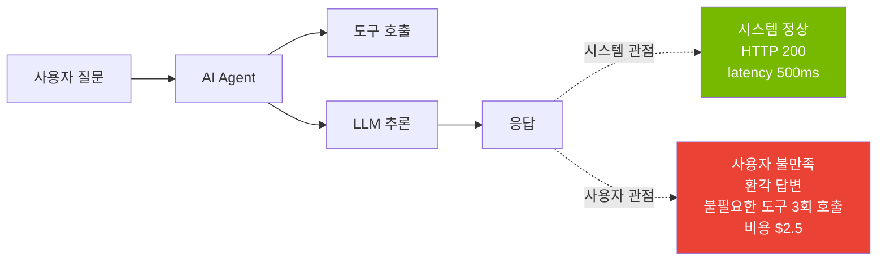
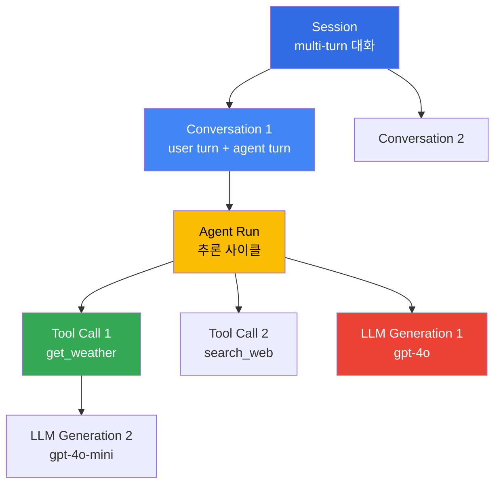

# AgenticOps 메트릭 — 운영 중 관측할 Agent KPI

> **읽는 시간**: 약 5분

AI Agent가 프로덕션에 배포되면, **시스템이 정상 응답하는가**만으로는 품질을 판단할 수 없다. "사용자 의도를 정확히 이해했는가?", "올바른 도구를 호출했는가?", "답변이 충실한가?"와 같은 **사용자 지각 품질(Perceived Quality)**을 측정해야 한다. 이 문서는 Agent 운영에 필수적인 **KPI 카테고리**와 **Langfuse·OTel 기반 계측 방법**을 다룬다.

---

## 1. 왜 Agent 전용 메트릭이 필요한가

### 1.1 전통 APM의 한계

기존 APM(Application Performance Monitoring)은 HTTP 성공률, 응답 시간, 에러율 등 **시스템 지표**를 중심으로 설계되었다. 그러나 Agent는 다음과 같은 이유로 추가 메트릭이 필요하다:

| 전통 APM | Agent 품질 지표 | 격차 |
|---------|----------------|------|
| HTTP 200 OK | 올바른 답변 여부 | 요청 성공 ≠ 결과 품질 |
| 응답 시간 (전체) | Time to First Token | streaming에서 사용자 체감 속도 다름 |
| 에러율 | Hallucination rate | LLM 오류는 HTTP 500이 아닌 정상 응답 |
| CPU/Memory | Token cost | 클라우드 LLM은 토큰 단위 과금 |
| N/A | Tool-call accuracy | 잘못된 도구 호출은 시스템 에러가 아님 |

### 1.2 사용자 지각 품질 vs 시스템 지표



Agent의 실제 품질은 **사용자가 원하는 작업을 정확히 수행했는가**로 판단되며, 이는 시스템 성공 지표와 독립적이다.

---

## 2. 핵심 KPI 카테고리

### 2.1 과제 성공 (Task Success)

사용자가 요청한 작업이 완료되었는가를 측정한다.

| 메트릭 | 정의 | 측정 방법 |
|--------|------|----------|
| **Task success rate** | 성공한 대화 세션 비율 | 자동 평가(goal attainment) + HITL 샘플링(10%) |
| **Completion time (p50/p95)** | 작업 완료까지 소요 시간 | Session duration (초) |
| **Goal attainment scale** | 사용자 목표 달성도 (1-5) | 명시적 피드백(thumbs up/down) 또는 LLM-as-Judge |

**예시 (고객 지원 Agent)**:

```python
# Langfuse 자동 평가 예시
from langfuse import Langfuse
langfuse = Langfuse()

trace = langfuse.trace(
    name="customer-support-session",
    session_id="sess_abc123",
    metadata={"intent": "refund_request", "channel": "web"}
)

# 세션 종료 시 평가
trace.score(
    name="task_success",
    value=1.0,  # 0.0 = 실패, 1.0 = 성공
    comment="Refund processed and confirmation sent"
)
```

### 2.2 Tool Use 정확성

Agent가 올바른 도구를 정확히 호출하는지 측정한다.

| 메트릭 | 정의 | 측정 방법 |
|--------|------|----------|
| **Tool-call accuracy** | 올바른 도구를 호출한 비율 | (정확한 도구 호출 수) / (전체 도구 호출 수) |
| **Tool invocation rate** | 평균 도구 호출 수 / 세션 | span hierarchy 분석 |
| **Tool failure rate** | 도구 호출 실패 비율 | HTTP 5xx, Timeout, JSON parsing error |

**예시**:

```python
# Tool call span 기록
span = trace.span(
    name="tool_call",
    input={"tool": "get_weather", "args": {"location": "Seoul"}},
    metadata={"tool_name": "get_weather", "tool_version": "v1.2"}
)

# 평가 기준: 의도="날씨 질문" → 올바른 도구="get_weather"
# 잘못된 예: "get_weather" 대신 "search_web" 호출 → accuracy 0.0
span.score(
    name="tool_call_accuracy",
    value=1.0,  # 올바른 도구 선택
    comment="Correct tool selected for weather intent"
)
```

### 2.3 품질·안전

답변 품질과 안전 위반 여부를 측정한다.

| 메트릭 | 정의 | 측정 방법 |
|--------|------|----------|
| **Hallucination rate** | 근거 없는 정보 생성 비율 | Ragas Faithfulness / SelfCheckGPT |
| **Guardrails violation rate** | 입출력 차단 발생 비율 | input/output filter block count |
| **Toxicity incidence** | 유해 콘텐츠 생성 비율 | Perspective API / OpenAI Moderation |

**Hallucination 측정 예시 (Ragas Faithfulness)**:

```python
from ragas.metrics import faithfulness
from ragas import evaluate

# RAG Agent 평가
result = evaluate(
    dataset=test_dataset,
    metrics=[faithfulness],
    llm=ChatOpenAI(model="gpt-4o-mini")
)

# Faithfulness 점수 → Langfuse에 기록
trace.score(
    name="faithfulness",
    value=result["faithfulness"],  # 0.0~1.0
    comment=f"Context: {len(context)} chars, Answer: {len(answer)} chars"
)
```

**Guardrails violation 측정**:

```python
# OpenClaw AI Gateway의 PII redaction 차단
if gateway_response.status == "blocked_pii":
    trace.score(
        name="guardrails_violation",
        value=1.0,  # 차단됨
        comment="PII detected: email, phone"
    )
```

### 2.4 비용·효율

Agent 운영 비용과 리소스 효율을 측정한다.

| 메트릭 | 정의 | 측정 방법 |
|--------|------|----------|
| **Cost per interaction** | 세션당 평균 비용 (USD) | Σ(input_tokens × price_in + output_tokens × price_out) |
| **Token efficiency** | 유효 토큰 비율 | (응답 토큰) / (총 소비 토큰) |
| **Cache hit rate** | Semantic cache 적중률 | (cache hits) / (total queries) |

**비용 추적 예시**:

```python
# Generation span에 토큰 및 비용 기록
generation = trace.generation(
    name="llm_call",
    model="gpt-4o-2025-01-31",
    input="What is the weather in Seoul?",
    output="The current weather in Seoul is...",
    usage={
        "input": 1200,
        "output": 80,
        "total": 1280,
        "input_cost": 0.012,   # $10 / 1M tokens
        "output_cost": 0.024,  # $30 / 1M tokens
        "total_cost": 0.036
    }
)
```

**Cache hit rate 측정**:

```python
# Semantic cache 적중 시
if cache_hit:
    trace.event(
        name="cache_hit",
        metadata={"cache_key": cache_key, "latency_saved_ms": 2500}
    )
```

### 2.5 사용자 경험

사용자 체감 품질을 측정한다.

| 메트릭 | 정의 | 측정 방법 |
|--------|------|----------|
| **Time to First Token (TTFT)** | 첫 응답까지 소요 시간 | streaming 시작 시각 - 요청 시각 |
| **Task-length quartiles** | 작업 복잡도 분포 | METR Task Standard 기반 분류 |
| **Escalation rate** | 인간 핸드오프 비율 | (human handoff count) / (total sessions) |

**TTFT 측정 예시**:

```python
import time

request_time = time.time()
# LLM 호출 (streaming)
first_token_time = None

async for chunk in llm_stream():
    if first_token_time is None:
        first_token_time = time.time()
        ttft_ms = (first_token_time - request_time) * 1000
        
        trace.event(
            name="time_to_first_token",
            metadata={"ttft_ms": ttft_ms, "model": "gpt-4o"}
        )
```

**Escalation rate 측정**:

```python
# Agent가 불확실성 감지 시 인간 핸드오프
if confidence_score < 0.7:
    trace.event(
        name="escalation",
        metadata={
            "reason": "low_confidence",
            "confidence": confidence_score,
            "fallback": "human_agent"
        }
    )
```

### 2.6 시스템 신뢰성

Agent 서비스의 안정성을 측정한다.

| 메트릭 | 정의 | 측정 방법 |
|--------|------|----------|
| **Availability** | 서비스 가용 시간 비율 | (uptime) / (total time) |
| **Error budget** | SLO 위반 허용치 소진률 | 1 - (actual SLI / SLO target) |
| **Session continuity rate** | 세션 중단 없이 완료된 비율 | (완료된 세션) / (시작된 세션) |
| **Retry exhaustion rate** | 재시도 한도 초과 비율 | (max retries exceeded) / (total requests) |

**SLO 예시 (Task success rate)**:

```
Target SLO: Task success rate ≥ 95% (30일 기준)
Error budget: 5% → 월 36시간 장애 허용
```

---

## 3. Langfuse Trace 스키마 제안

### 3.1 Span Hierarchy

Agent 실행 흐름을 다음과 같은 계층으로 표현한다:



### 3.2 기본 태그 (Tags)

모든 trace/span에 다음 태그를 부여한다:

- `agent_name`: Agent 식별자 (예: `customer-support-agent`)
- `model`: LLM 모델명 (예: `gpt-4o-2025-01-31`)
- `prompt_version`: 프롬프트 템플릿 버전 (예: `v1.2.3`)
- `tool`: 호출된 도구명 (예: `get_weather`)
- `guardrails`: 적용된 guardrails (예: `pii_redaction,prompt_injection`)

### 3.3 Score 이벤트

품질 평가는 `score` 이벤트로 기록한다:

- `task_success`: 0.0~1.0
- `faithfulness`: 0.0~1.0 (Ragas)
- `cache_hit`: 0.0 (miss) / 1.0 (hit)
- `tool_call_accuracy`: 0.0~1.0
- `guardrails_violation`: 0.0 (pass) / 1.0 (block)

### 3.4 JSON 예시

```json
{
  "id": "trace_abc123",
  "name": "customer-support-session",
  "session_id": "sess_xyz789",
  "user_id": "user_456",
  "tags": ["agent_name:support-agent", "environment:production"],
  "metadata": {
    "channel": "web",
    "intent": "refund_request",
    "customer_tier": "premium"
  },
  "spans": [
    {
      "id": "span_001",
      "name": "agent_run",
      "start_time": "2026-04-18T10:00:00Z",
      "end_time": "2026-04-18T10:00:05Z",
      "input": "I want to request a refund for order #12345",
      "output": "I've processed your refund request...",
      "metadata": {
        "reasoning_steps": 3,
        "tools_called": ["get_order", "process_refund", "send_email"]
      }
    },
    {
      "id": "span_002",
      "parent_span_id": "span_001",
      "name": "tool_call",
      "type": "span",
      "start_time": "2026-04-18T10:00:01Z",
      "end_time": "2026-04-18T10:00:02Z",
      "input": {"tool": "get_order", "args": {"order_id": "12345"}},
      "output": {"status": "delivered", "amount": 129.99},
      "metadata": {
        "tool_name": "get_order",
        "tool_version": "v2.1",
        "latency_ms": 850
      }
    },
    {
      "id": "gen_001",
      "parent_span_id": "span_001",
      "name": "llm_generation",
      "type": "generation",
      "model": "gpt-4o-2025-01-31",
      "input": [{"role": "system", "content": "You are a support agent..."}, {"role": "user", "content": "I want a refund..."}],
      "output": "Based on your order status...",
      "usage": {
        "input": 1200,
        "output": 80,
        "total": 1280,
        "input_cost": 0.012,
        "output_cost": 0.024,
        "total_cost": 0.036
      },
      "metadata": {
        "temperature": 0.7,
        "prompt_version": "v1.2.3"
      }
    }
  ],
  "scores": [
    {
      "name": "task_success",
      "value": 1.0,
      "comment": "Refund processed successfully"
    },
    {
      "name": "faithfulness",
      "value": 0.92,
      "comment": "High context adherence"
    },
    {
      "name": "tool_call_accuracy",
      "value": 1.0,
      "comment": "All tools correctly selected"
    }
  ]
}
```

---

## 4. OpenTelemetry Semantic Conventions

### 4.1 GenAI Semantic Conventions (2026-04 기준)

OpenTelemetry는 **Gen AI Semantic Conventions**를 통해 LLM 계측 표준을 정의한다 ([v1.28.0 experimental](https://opentelemetry.io/docs/specs/semconv/gen-ai/)).

**핵심 attribute**:

| Attribute | 예시 | 설명 |
|-----------|------|------|
| `gen_ai.system` | `openai` | LLM 제공자 |
| `gen_ai.request.model` | `gpt-4o-2025-01-31` | 모델명 |
| `gen_ai.request.temperature` | `0.7` | 샘플링 온도 |
| `gen_ai.request.max_tokens` | `2048` | 최대 출력 토큰 |
| `gen_ai.usage.input_tokens` | `1200` | 입력 토큰 수 |
| `gen_ai.usage.output_tokens` | `80` | 출력 토큰 수 |
| `gen_ai.response.finish_reason` | `stop` | 종료 이유 (stop, length, tool_calls) |

### 4.2 Span Kind

- **client**: Agent → LLM API 호출
- **internal**: Agent 내부 추론 로직

### 4.3 OTel → Langfuse 브리지

```python
# OpenTelemetry instrumentation → Langfuse 자동 전송
from opentelemetry import trace
from opentelemetry.exporter.otlp.proto.grpc.trace_exporter import OTLPSpanExporter
from opentelemetry.sdk.trace import TracerProvider
from opentelemetry.sdk.trace.export import BatchSpanProcessor

# OTLP Exporter → Langfuse OTLP endpoint
exporter = OTLPSpanExporter(
    endpoint="https://langfuse.example.com/api/public/otlp",
    headers={"Authorization": "Bearer <LANGFUSE_API_KEY>"}
)

provider = TracerProvider()
provider.add_span_processor(BatchSpanProcessor(exporter))
trace.set_tracer_provider(provider)

# 이제 모든 OTel trace가 Langfuse로 전송됨
tracer = trace.get_tracer(__name__)

with tracer.start_as_current_span("agent_run") as span:
    span.set_attribute("gen_ai.system", "openai")
    span.set_attribute("gen_ai.request.model", "gpt-4o")
    # ... Agent 실행
```

---

## 5. Grafana/CloudWatch 대시보드 예시

### 5.1 Top-line 메트릭 (경영진용)

```
┌─────────────────────────────────────────────────────────────┐
│ Task Success Rate (30일)           │ 96.2% (↑ 1.2% WoW)    │
│ Avg Cost per Interaction           │ $0.12 (↓ $0.03 WoW)  │
│ Hallucination Rate                 │ 2.1% (↑ 0.3% WoW)    │
│ Escalation Rate                    │ 3.5% (→ 0.0% WoW)    │
└─────────────────────────────────────────────────────────────┘
```

**Grafana Panel 설정**:

```promql
# Task success rate (30일 평균)
sum(rate(langfuse_trace_score_total{name="task_success", value="1"}[30d]))
/
sum(rate(langfuse_trace_score_total{name="task_success"}[30d]))
```

### 5.2 Drill-down 대시보드 (운영팀용)

**Tool Call 분석**:

```
Tool Call Success Rate by Tool
┌──────────────┬──────────┬──────────┐
│ Tool         │ Calls    │ Success  │
├──────────────┼──────────┼──────────┤
│ get_weather  │ 1,234    │ 99.2%    │
│ search_web   │ 892      │ 94.5%    │
│ send_email   │ 456      │ 100%     │
│ get_order    │ 789      │ 98.7%    │
└──────────────┴──────────┴──────────┘
```

**Guardrails Violation 추이**:

```
Guardrails Violation Rate (7일)
┌─────────────────────────────────────────┐
│  5% ┤                                    │
│  4% ┤    ╭╮                              │
│  3% ┤  ╭╯╰╮  ╭╮                          │
│  2% ┤╭╯   ╰╮╭╯╰╮                         │
│  1% ┼╯     ╰╯  ╰─────────────────        │
│  0% ┴────────────────────────────────    │
└─────────────────────────────────────────┘
     Mon  Tue Wed Thu Fri Sat Sun
```

### 5.3 SLO 대시보드

```
Error Budget Burn Rate (Task Success SLO: 95%)
┌────────────────────────────────────────────────────┐
│ Current SLI: 96.2%                                 │
│ Error Budget: 5% → 36h/month                      │
│ Consumed: 12.5h (34.7%)                            │
│ Remaining: 23.5h (65.3%)                           │
│                                                    │
│ ██████████████████░░░░░░░░░░░ 34.7% consumed     │
│                                                    │
│ Status: 🟢 HEALTHY                                 │
│ Estimated Days Until Budget Exhausted: 45 days    │
└────────────────────────────────────────────────────┘
```

---

## 6. 경보·이상 탐지

### 6.1 이상 패턴 예시

| 이상 유형 | 탐지 규칙 | 대응 액션 |
|----------|----------|-----------|
| **Guardrails rate 급증** | 3σ 초과 (rolling 1시간) | PagerDuty P2, 프롬프트 검토 |
| **Cost spike** | 시간당 비용 > $100 (baseline $20) | Slack 알림, rate limit 활성화 |
| **Escalation rate 증가** | 10% 초과 (baseline 3%) | 온콜 엔지니어 알림, Agent 로직 검토 |
| **Tool failure rate** | 특정 도구 > 20% 실패 | 자동 circuit breaker, fallback 활성화 |

### 6.2 Baseline 설정과 탐지 알고리즘

**Rolling window 평균 기반 이상 탐지**:

```python
# 예시: Guardrails violation rate 이상 탐지
import numpy as np

def detect_anomaly(current_rate, historical_rates, threshold_sigma=3):
    """
    Args:
        current_rate: 현재 시간대 violation rate
        historical_rates: 과거 7일 동일 시간대 rates
        threshold_sigma: 표준편차 배수 임계값
    """
    baseline_mean = np.mean(historical_rates)
    baseline_std = np.std(historical_rates)
    
    z_score = (current_rate - baseline_mean) / baseline_std
    
    if z_score > threshold_sigma:
        return {
            "anomaly": True,
            "severity": "high" if z_score > 5 else "medium",
            "z_score": z_score,
            "baseline": baseline_mean,
            "current": current_rate
        }
    return {"anomaly": False}

# 실시간 모니터링 예시
current_rate = 0.08  # 8% violation rate
historical = [0.02, 0.021, 0.019, 0.022, 0.018, 0.023, 0.020]  # 과거 7일

result = detect_anomaly(current_rate, historical)
if result["anomaly"]:
    print(f"🚨 Anomaly detected: {result['current']:.1%} (baseline {result['baseline']:.1%})")
    # PagerDuty 알림 전송
```

### 6.3 PagerDuty/Slack 연동

**CloudWatch Alarm → SNS → Lambda → PagerDuty**:

```python
# Lambda handler: CloudWatch Alarm → PagerDuty
import boto3
import requests

def lambda_handler(event, context):
    alarm_name = event["detail"]["alarmName"]
    metric = event["detail"]["metric"]
    value = event["detail"]["state"]["value"]
    
    # PagerDuty Events API v2
    payload = {
        "routing_key": "PAGERDUTY_ROUTING_KEY",
        "event_action": "trigger",
        "payload": {
            "summary": f"Agent KPI Anomaly: {alarm_name}",
            "severity": "warning",
            "source": "cloudwatch",
            "custom_details": {
                "metric": metric,
                "current_value": value,
                "threshold": event["detail"]["threshold"]
            }
        }
    }
    
    response = requests.post(
        "https://events.pagerduty.com/v2/enqueue",
        json=payload
    )
    return {"statusCode": 200, "body": "Alert sent"}
```

**Slack 알림 예시**:

```
🚨 Agent Metrics Alert

**Cost Spike Detected**
- Current hourly cost: $142.50 (baseline $18.20)
- Time: 2026-04-18 14:30 UTC
- Agent: customer-support-agent
- Model: gpt-4o-2025-01-31

**Probable Cause**: Unusual traffic spike (3.2k requests vs 800 baseline)

Actions:
- Rate limit activated (100 req/min → 50 req/min)
- Fallback to gpt-4o-mini for non-critical queries

📊 Dashboard: https://grafana.example.com/d/agent-cost
📖 Runbook: https://wiki.example.com/agent-cost-spike
```

---

## 7. AIDLC 단계별 활용

### 7.1 Inception: Baseline 정의

프로젝트 초기에 목표 KPI를 정의한다.

| KPI | Target (90일 후) | Baseline (현재) |
|-----|------------------|-----------------|
| Task success rate | ≥ 95% | 88% (사람 기준선) |
| Tool-call accuracy | ≥ 90% | N/A (신규) |
| Hallucination rate | ≤ 3% | 12% (초기 프로토타입) |
| Cost per interaction | ≤ $0.15 | $0.32 |
| Escalation rate | ≤ 5% | 18% |

### 7.2 Construction: CI 회귀 게이트

각 PR에서 메트릭 회귀를 자동 감지한다.

```yaml
# .github/workflows/agent-quality-gate.yml
name: Agent Quality Gate
on: [pull_request]

jobs:
  evaluate:
    runs-on: ubuntu-latest
    steps:
      - uses: actions/checkout@v4
      
      - name: Run Ragas evaluation
        run: |
          pytest tests/test_agent_quality.py --ragas
      
      - name: Check metrics regression
        run: |
          python scripts/check_regression.py \
            --baseline metrics/baseline.json \
            --current metrics/current.json \
            --threshold 0.05  # 5% 이상 하락 시 fail
```

### 7.3 Operations: 실시간 경보

프로덕션 배포 후 실시간 모니터링.

```
Agent KPI SLO (프로덕션)
┌──────────────────────┬──────────┬──────────┬──────────┐
│ Metric               │ SLO      │ Current  │ Status   │
├──────────────────────┼──────────┼──────────┼──────────┤
│ Task success rate    │ ≥ 95%    │ 96.2%    │ 🟢 OK    │
│ Tool-call accuracy   │ ≥ 90%    │ 93.5%    │ 🟢 OK    │
│ Hallucination rate   │ ≤ 3%     │ 2.1%     │ 🟢 OK    │
│ Cost per interaction │ ≤ $0.15  │ $0.12    │ 🟢 OK    │
│ Escalation rate      │ ≤ 5%     │ 3.5%     │ 🟢 OK    │
│ TTFT (p95)           │ ≤ 2s     │ 1.8s     │ 🟢 OK    │
└──────────────────────┴──────────┴──────────┴──────────┘
```

---

## 8. 참고 자료

### 8.1 Langfuse 문서

- [Langfuse Scoring](https://langfuse.com/docs/scores): Trace/span에 품질 점수 부여
- [Langfuse Prompt Management](https://langfuse.com/docs/prompts): 프롬프트 버전 관리 및 A/B 테스트
- [Langfuse OTLP Integration](https://langfuse.com/docs/integrations/opentelemetry): OpenTelemetry 브리지

### 8.2 OpenTelemetry

- [GenAI Semantic Conventions](https://opentelemetry.io/docs/specs/semconv/gen-ai/): LLM 계측 표준 (v1.28.0 experimental)
- [OTel Python SDK](https://opentelemetry.io/docs/languages/python/): Python instrumentation

### 8.3 평가 프레임워크

- [Ragas](https://docs.ragas.io/): RAG 평가 (faithfulness, answer relevancy, context precision)
- [SelfCheckGPT](https://github.com/potsawee/selfcheckgpt): Zero-resource hallucination detection
- [METR Task Standard](https://metr.org/): Agent task 벤치마크

### 8.4 관련 문서

- [LLMOps Observability 비교 가이드](../../agentic-ai-platform/operations-mlops/observability/llmops-observability.md): Langfuse vs LangSmith vs Helicone
- [Ragas RAG 평가 프레임워크](../../agentic-ai-platform/operations-mlops/governance/ragas-evaluation.md): Ragas 메트릭 상세
- [관찰성 스택](./observability-stack.md): AIDLC Operations의 텔레메트리 기반
- [예측 운영](./predictive-operations.md): 메트릭 기반 장애 예측
