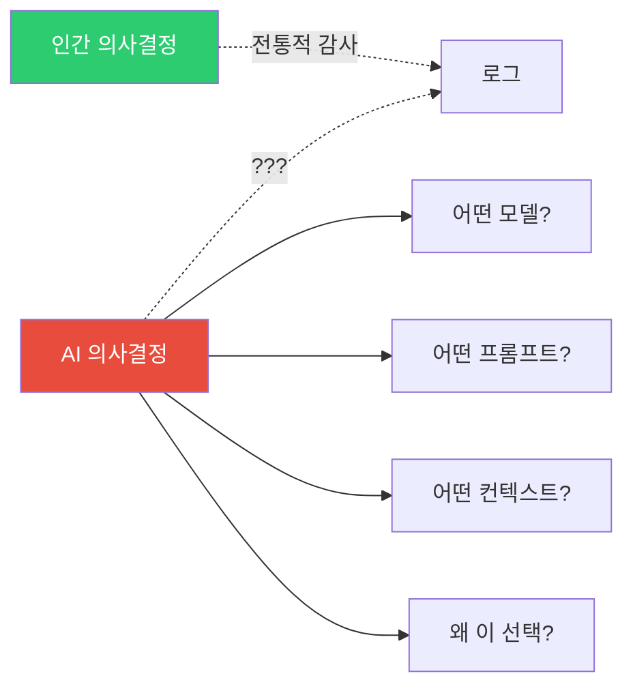
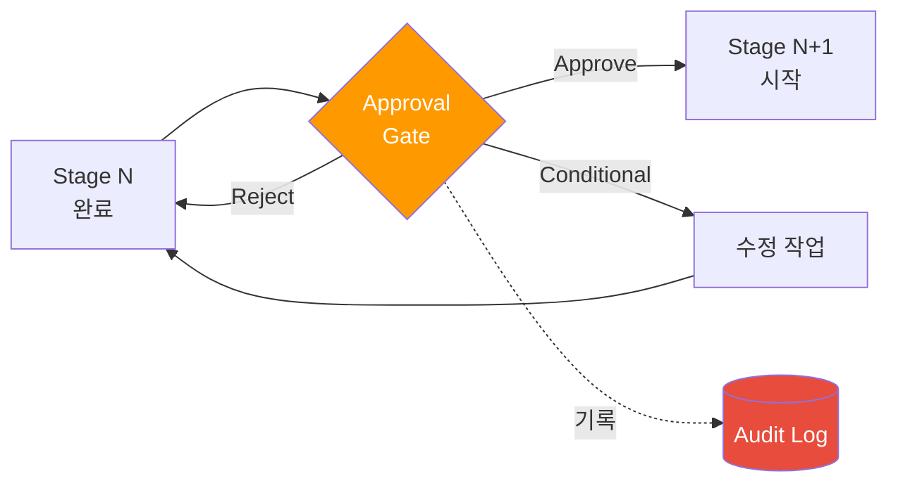
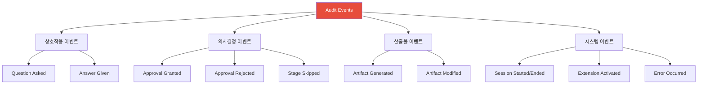
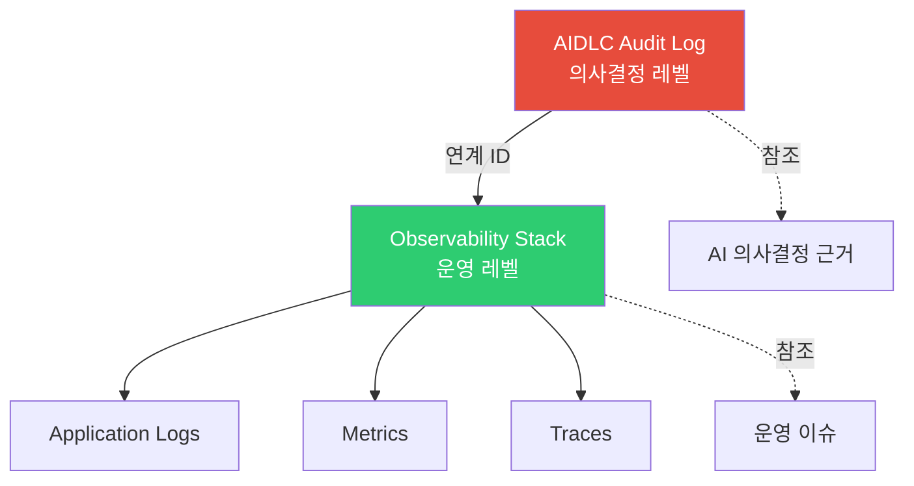
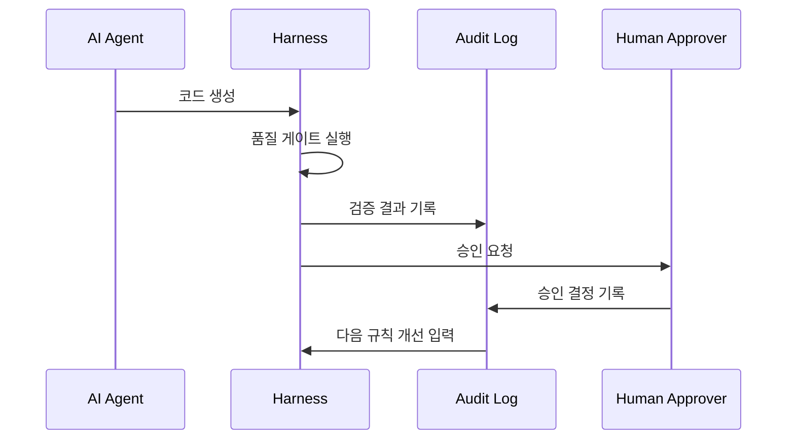

# Audit & Governance Logging

> 📅 **작성일**: 2026-04-18 | ⏱️ **읽는 시간**: 약 17분

AWS Labs [AIDLC Common Rules](https://github.com/awslabs/aidlc-workflows/tree/main/aws-aidlc-rule-details/common) 중 가장 거버넌스 비중이 높은 두 규칙은 **Checkpoint Approval (규칙 7)** 과 **Audit Logging (규칙 8)** 입니다. 본 문서는 이 두 규칙을 운영 환경에서 **규제 산업(금융·의료·공공)** 의 감사 요구를 충족하도록 구현하는 실전 가이드입니다.

---

## 1. 왜 Audit Log 가 필요한가

### 1.1 규제 요구사항

| 규제 | 감사 요구 | 보존 기간 | AIDLC 관련성 |
|------|----------|----------|--------------|
| **전자금융감독규정 (KR)** | IT 변경·접근 이력 완전 기록 | 5년 | AIDLC 전체 stage 승인·결정 이력 |
| **개인정보 보호법 (KR)** | 개인정보 처리 의사결정 이력 | 3년 | Requirements Analysis, Application Design |
| **HIPAA (US)** | PHI 접근·처리 로그 | 6년 | 의료 도메인 모델링 결정 |
| **SOX (US)** | 재무 시스템 변경 통제 | 7년 | Checkpoint Approval, 산출물 해시 |
| **ISMS-P (KR)** | 정보시스템 운영 로그 | 3년 | 전체 Session 이력 |
| **GDPR (EU)** | 개인정보 의사결정 근거 | Case by case | 온톨로지 결정, 데이터 처리 설계 |

### 1.2 AIDLC 특유의 감사 과제



**AIDLC 감사가 전통적 감사보다 어려운 이유:**
1. AI 출력은 **비결정적** 일 수 있음 → 재현성 증명 필요 (Common Rule 11)
2. AI 가 **수많은 작은 결정** 을 내림 → 모든 결정 이력이 필요
3. **모델 버전 변경** 이 결과에 영향 → 버전 정보 기록 필수
4. **프롬프트 인젝션** 공격 가능성 → 입력 원본 보존 필요

### 1.3 재현성(Reproducibility)과 감사의 관계

AIDLC 의 감사는 **단순 이벤트 로깅을 넘어 "의사결정 재현 가능성"** 까지 요구합니다:

```
감사관: "2026-03-15 에 결제 서비스 인증 방식을 왜 Cognito 로 결정했는가?"

전통 시스템: "엔지니어 김00 이 결정했다는 승인 기록"

AIDLC 시스템:
  - User Request 원본
  - AI 가 제시한 5지선다 옵션 원본
  - 사용자 응답 `[Answer]: A` 원본
  - 사용된 모델 (`claude-opus-4-7` 버전, temperature 0, seed 42)
  - 활성화된 Extension 목록
  - 산출물 SHA-256 해시
  → 동일 입력 재실행 시 동일 결과 생성 가능
```

---

## 2. Checkpoint Approval 게이트

### 2.1 Stage 전환 승인 패턴

AIDLC 의 각 stage 간 전환은 **명시적 승인 게이트** 로 보호됩니다.



### 2.2 승인 게이트 템플릿

**표준 승인 문서 포맷:**
```markdown
# Checkpoint Approval: <stage name> → <next stage>

**Gate ID**: gate-2026-04-18-042
**Session ID**: sess-20260418-payment-service
**Timestamp**: 2026-04-18T10:45:12.345Z

## Completing Stage
**Stage**: requirements_analysis
**Duration**: 3h 25min
**Content Validation**: PASSED (0 failed checks)

## Artifacts Produced
| File | Size | SHA-256 |
|------|------|---------|
| `requirements.md` | 1,234 lines | `sha256:abc123...` |
| `.aidlc/validation-report.md` | 87 lines | `sha256:def456...` |
| `.aidlc/audit/stage-req-analysis.md` | 412 lines | `sha256:789abc...` |

## Approvers Required
- [x] Primary: Architect (yjeong@example.com)
- [ ] Secondary: Security Lead (security-lead@example.com)
- [ ] Tertiary: Compliance Officer (compliance@example.com) — 금융 산업 필수

## Decision Options (Common Rule 1: Question Format)

A. **Approve** — 다음 stage 진행
B. **Reject** — 현재 stage 재작업 (피드백 필수)
C. **Conditional Approve** — 조건부 승인 (조건 명시 필수)
D. **Escalate** — 상위 거버넌스 위원회로 에스컬레이트
E. **Defer** — 결정 보류 (기한 명시 필수)

**Primary Approver Decision**:
[Answer]: A

**Approval Rationale**:
모든 NFR 이 측정 가능하며, 주요 리스크가 식별되었음.

**Secondary Approver Decision**:
[Answer]: <pending>

**Tertiary Approver Decision**:
[Answer]: <pending>
```

### 2.3 다중 승인자 패턴 (Multi-Sig)

규제 산업은 **단일 승인으로 stage 전환 불가** 를 요구합니다.

**다중 승인 매트릭스 예시 (금융):**
| Stage 전환 | Primary | Secondary | Tertiary | 추가 요구 |
|-----------|---------|-----------|----------|----------|
| Requirements → User Stories | Architect | - | - | 단순 검토 |
| User Stories → Workflow Planning | Architect | PM | - | - |
| Workflow Planning → Application Design | Architect | Security Lead | - | 위협 모델 필수 |
| Application Design → Units Generation | Architect | Security Lead | Compliance | 규제 매핑 필수 |
| Construction → Production Deploy | Architect | Security Lead | Compliance + SRE | 4인 승인 |

### 2.4 자동 차단 조건

다음 조건에서는 AIDLC 가 **Checkpoint Approval 을 자동 차단** 합니다:

```yaml
auto_block_conditions:
  - condition: content_validation_failed
    reason: "Common Rule 2 위반"
    action: "현재 stage 로 복귀"

  - condition: audit_log_tampered
    reason: "감사 로그 해시 불일치"
    action: "세션 중단, 보안 팀 알림"

  - condition: model_drift_detected
    reason: "모델 응답 재현성 < 80%"
    action: "Common Rule 11 위반, 모델 버전 확인"

  - condition: extension_required_missing
    reason: "opt-in.md 에 필수 Extension 누락"
    action: "Extension 활성화 후 재시도"

  - condition: overconfidence_unchecked
    reason: "Common Rule 4 — Low confidence 응답에 대한 추가 컨텍스트 없음"
    action: "사람 개입 필수"
```

---

## 3. Audit Log 포맷

### 3.1 이벤트 타입 분류



### 3.2 이벤트 공통 스키마

모든 감사 이벤트는 다음 필드를 **필수** 로 포함:

```yaml
event:
  id: evt-2026-04-18-042                     # 유일 ID
  timestamp: 2026-04-18T10:45:12.345Z        # ISO 8601, 밀리초 precision, UTC
  session_id: sess-20260418-payment-service
  stage: requirements_analysis
  event_type: question_asked
  actor:
    type: [human | ai_agent | system]
    id: yjeong@example.com
  sequence_number: 42                         # 세션 내 순서 보장

# 이벤트별 추가 필드는 유형별 정의
```

### 3.3 질문·응답 이벤트

```yaml
event:
  id: evt-2026-04-18-041
  timestamp: 2026-04-18T10:42:00.000Z
  session_id: sess-20260418-payment-service
  stage: requirements_analysis
  event_type: question_asked
  actor:
    type: ai_agent
    id: claude-opus-4-7
    prompt_version: "aidlc-requirements-v1.3.2"

  question:
    text: |                                  # 원본 보존 (Common Rule 8)
      Q15. Payment Service 의 데이터 저장소로 무엇을 선택하시겠습니까?
      A. DynamoDB (NoSQL, Serverless)
      B. Aurora PostgreSQL (관계형, 고가용)
      C. RDS MySQL (관계형, 저비용)
      D. DocumentDB (MongoDB 호환)
      E. Other (please specify)
      [Answer]:
    ai_confidence: high
    ai_recommendation: A
    ai_reasoning: |
      결제 트랜잭션의 쓰기 중심 워크로드 특성상 DynamoDB 가 적합...

---

event:
  id: evt-2026-04-18-042
  timestamp: 2026-04-18T10:45:12.345Z
  session_id: sess-20260418-payment-service
  stage: requirements_analysis
  event_type: answer_given
  actor:
    type: human
    id: yjeong@example.com

  references:
    question_id: evt-2026-04-18-041

  answer:
    raw_text: |                              # 사용자 원본 응답 절대 수정 금지
      [Answer]: B
      
      조직 표준으로 PostgreSQL 을 사용하므로 Aurora 선택.
    parsed_option: B
    user_comment: "조직 표준으로 PostgreSQL 을 사용하므로 Aurora 선택."
```

### 3.4 승인 이벤트

```yaml
event:
  id: evt-2026-04-18-100
  timestamp: 2026-04-18T15:30:00.000Z
  session_id: sess-20260418-payment-service
  stage: checkpoint_gate
  event_type: approval_granted
  actor:
    type: human
    id: architect@example.com

  gate:
    id: gate-2026-04-18-042
    from_stage: requirements_analysis
    to_stage: user_stories
    approval_level: primary

  decision:
    raw_text: "[Answer]: A"
    parsed: approve
    rationale: |
      모든 NFR 이 측정 가능하며, 주요 리스크가 식별되었음.

  artifacts_hash:
    - file: requirements.md
      sha256: abc123...
    - file: validation-report.md
      sha256: def456...

  signatures:
    method: "AWS KMS sign-verify"
    key_id: "arn:aws:kms:us-east-2:...:key/xxx"
    signature: "base64..."
```

### 3.5 산출물 이벤트

```yaml
event:
  id: evt-2026-04-18-075
  timestamp: 2026-04-18T13:15:22.000Z
  session_id: sess-20260418-payment-service
  stage: requirements_analysis
  event_type: artifact_generated
  actor:
    type: ai_agent
    id: claude-opus-4-7

  artifact:
    path: requirements.md
    sha256: abc123...
    size_bytes: 48_231
    line_count: 1_234

  generation_context:
    input_tokens: 8_421
    output_tokens: 12_305
    model_version: claude-opus-4-7
    temperature: 0
    seed: 42
    extensions_active:
      - security@0.1.0
      - testing@0.1.0
      - org-compliance-ismsp@2.1.0
```

---

## 4. Audit 저장소 구조

### 4.1 디렉터리 레이아웃

```
.aidlc/audit/
  audit.md                                  # 사람이 읽을 수 있는 요약
  events/                                   # 원자적 이벤트 로그
    2026-04-18/
      00-session-start.yaml
      01-workspace-detected.yaml
      02-question-asked-ext-opt-in.yaml
      03-answer-given-ext-opt-in.yaml
      ...
      99-session-checkpoint.yaml
  stages/                                   # stage 별 집계
    stage-requirements-analysis.md
    stage-user-stories.md
    stage-workflow-planning.md
  gates/                                    # 승인 게이트 기록
    gate-2026-04-18-042.md
    gate-2026-04-19-015.md
  artifacts/                                # 산출물 스냅샷
    2026-04-18T10:45/
      requirements.md
      validation-report.md
    2026-04-18T14:20/
      user-stories.md
  signatures/                               # 디지털 서명
    evt-2026-04-18-100.sig
  manifest.yaml                             # 전체 메타데이터
```

### 4.2 manifest.yaml 예시

```yaml
audit_manifest:
  session_id: sess-20260418-payment-service
  created: 2026-04-18T09:00:00Z
  last_updated: 2026-04-18T18:30:00Z
  schema_version: "1.0"

  storage:
    primary: s3://company-audit-logs/aidlc/
    backup: glacier://company-audit-archive/
    retention: 7_years              # SOX 준수
    worm_enabled: true              # Object Lock

  integrity:
    hash_algorithm: sha256
    signature_algorithm: rsa-2048
    chain_of_custody: true          # 이벤트 간 해시 체인

  events_count: 1_284
  gates_count: 7
  artifacts_count: 42
  
  compliance_mappings:
    - standard: ISMS-P
      version: "2.1"
      covered_controls: [2.5.1, 2.8.2, 2.9.1]
    - standard: SOX
      version: "2002"
      covered_controls: [Section 404]
```

### 4.3 Hash Chain 구조

각 이벤트는 이전 이벤트의 해시를 포함하여 **변조 방지 체인** 을 구성:

```yaml
event:
  id: evt-2026-04-18-043
  timestamp: 2026-04-18T10:50:00.000Z
  previous_event_hash: sha256:a1b2c3...     # evt-042 의 해시
  content_hash: sha256:f9e8d7...
  # ...

# 무결성 검증:
# 1. event.content_hash == sha256(event 본문)
# 2. next_event.previous_event_hash == this event.content_hash
# 3. 체인이 깨지면 변조 탐지
```

---

## 5. 규제 산업 감사 추적 예시

### 5.1 금융 산업 (전자금융감독규정)

**감사 시나리오**: 금융감독원 IT 점검 시 "2026년 3월 15일 결제 서비스 API 변경의 승인 경로" 요청.

**AIDLC 감사 응답:**
```bash
# 1. 해당 시점 세션 검색
aidlc audit query --date 2026-03-15 --service payment-service

→ Found: sess-20260315-payment-api-v2

# 2. 승인 게이트 추적
aidlc audit gates --session sess-20260315-payment-api-v2

→ Gate 1: requirements_analysis → user_stories
  Approved by: architect@bank.com (2026-03-15T14:20:00Z)
  Signature: verified ✓
  
→ Gate 2: user_stories → workflow_planning  
  Approved by: architect@bank.com, security-lead@bank.com (2026-03-15T16:10:00Z)
  Signatures: all verified ✓
  
→ Gate 3: construction → production_deploy
  Approved by: architect + security + compliance + sre (2026-03-16T09:00:00Z)
  Signatures: all verified ✓
  Regulatory Compliance Check: PASSED (EFSR-8, EFSR-13, EFSR-DR)

# 3. 산출물 해시 검증
aidlc audit verify-artifacts --session sess-20260315-payment-api-v2

→ All 42 artifacts verified ✓
→ No tampering detected
```

### 5.2 의료 산업 (HIPAA)

**감사 시나리오**: HIPAA 감사관이 환자 데이터 처리 로직 결정 근거 요청.

**추적 가능 항목:**
- PHI (Protected Health Information) 필드를 식별한 시점
- 암호화 방식 결정의 옵션·승인자
- 접근 제어(RBAC) 설계 결정 이력
- 데이터 보관 기간(6년) 설정 근거

### 5.3 공공 산업 (ISMS-P)

**감사 시나리오**: ISMS-P 심사위원이 "개인정보 처리 단계별 보호 조치" 결정 이력 요청.

**제공 가능 증거:**
```
✓ 수집 단계: Requirements Analysis 에서 최소 수집 원칙 Q&A 기록
✓ 이용 단계: Application Design 에서 목적 외 이용 제한 설계
✓ 제공 단계: Unit of Work 에서 외부 API 공유 통제
✓ 파기 단계: Infrastructure Design 에서 TTL 정책
✓ 각 단계의 승인자 · 승인 시점 · 서명
```

---

## 6. 기존 시스템과의 관계

### 6.1 observability-stack 과의 통합

AIDLC Audit Log 는 [관찰성 스택](./observability-stack.md) 의 **서브셋** 이 아닌 **상위 거버넌스 레이어** 입니다.



**역할 분담:**
| 항목 | Audit Log | Observability |
|------|-----------|---------------|
| 대상 | AIDLC 의사결정 · 승인 | 런타임 이벤트 |
| 보존 | 5-7년 (WORM) | 30-90일 (일반) |
| 접근자 | 감사관 · 컴플라이언스 | SRE · 개발자 |
| 포맷 | 구조화 YAML + 서명 | JSON / OTel |

### 6.2 하네스 엔지니어링과의 관계

[하네스 엔지니어링](../methodology/harness-engineering.md) 의 **품질 게이트** 는 Audit Log 와 **양방향 통합**:

- 하네스가 검출한 품질 이벤트 → Audit Log 에 기록
- Audit Log 의 Checkpoint Approval 실패 이력 → 하네스 규칙 개선 입력



### 6.3 Common Rules 와의 매핑

본 문서의 구현은 AIDLC [Common Rules](../methodology/common-rules.md) 중 다음을 운영화한 것:

| Common Rule | 본 문서 구현 |
|-------------|--------------|
| 1. Question Format | §2.2 승인 게이트 템플릿 (A-E 옵션) |
| 3. Error Handling | §2.4 자동 차단 조건 |
| 5. Session Continuity | §4.1 `.aidlc/audit/` 디렉터리 구조 |
| 7. Checkpoint Approval | §2 전체 |
| 8. Audit Logging | §3-4 전체 |
| 11. Reproducible | §1.3 재현성 |

---

## 7. 운영 체크리스트

### 7.1 Audit 인프라 구축

- [ ] S3 버킷 + Object Lock (WORM) 활성화
- [ ] KMS 키 생성 (감사 로그 전용, 7년 이상 회전 없음)
- [ ] Glacier Deep Archive 연계 (7년 후 자동 이동)
- [ ] CloudTrail Data Events 로 S3 접근 로깅
- [ ] VPC Endpoint 로 S3 접근 경로 격리

### 7.2 프로세스 체크리스트

- [ ] 감사 이벤트 스키마 문서화 (팀 위키)
- [ ] 승인자 역할·자격 조건 명시
- [ ] 다중 승인 매트릭스 작성 (stage × 산업)
- [ ] 월 1회 무결성 검증 자동 실행
- [ ] 분기 1회 모의 감사 실시

### 7.3 자동화 도구

```bash
# 감사 로그 무결성 검증
aidlc audit verify --session <session-id>

# 특정 이벤트 조회
aidlc audit query --event-type approval_granted --date 2026-03-15

# 규제별 감사 리포트 생성
aidlc audit report --standard ISMS-P --period 2026-Q1

# 산출물 스냅샷 복원
aidlc audit restore-artifact --session <id> --timestamp 2026-03-15T10:00:00Z
```

---

## 8. 참고 자료

### 공식 저장소
- [AWS Labs AIDLC Common Rules](https://github.com/awslabs/aidlc-workflows/tree/main/aws-aidlc-rule-details/common) — Checkpoint Approval, Audit Logging 원문

### 관련 문서
- [Common Rules](../methodology/common-rules.md) — 11개 공통 규칙 전체 해설
- [관찰성 스택](./observability-stack.md) — 운영 관찰성 구현
- [하네스 엔지니어링](../methodology/harness-engineering.md) — 품질 게이트와 Audit 통합
- [Extension System](../enterprise/extension-system.md) — Extension 별 감사 규칙
- [거버넌스 프레임워크](../enterprise/governance-framework.md) — 3층 거버넌스

### 규제·표준 참고
- [ISO 27001:2022 Annex A.8.15 Logging](https://www.iso.org/standard/27001)
- [NIST SP 800-92 Guide to Computer Security Log Management](https://csrc.nist.gov/publications/detail/sp/800-92/final)
- [전자금융감독규정](https://fss.or.kr/) — IT 변경 통제
- [HIPAA Security Rule 164.312(b) Audit Controls](https://www.hhs.gov/hipaa/)
- [SOX Section 404 IT General Controls](https://sarbanes-oxley-101.com/)
