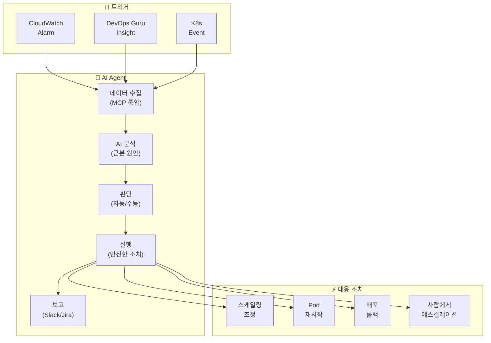
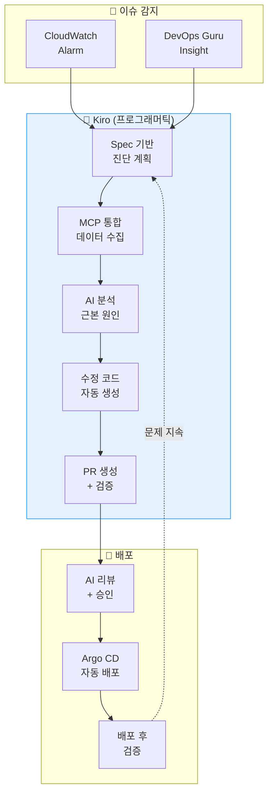
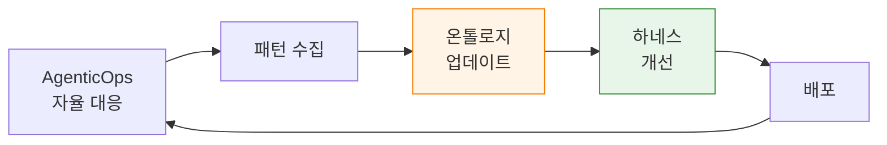

tags: [aidlc, operations, 'scope:ops']
---
title: "자율 대응"
sidebar_label: "자율 대응"
description: "AI Agent 기반 자율 인시던트 대응 — Strands/Kagent 통합, Chaos Engineering + AI, 온톨로지 피드백 루프"
last_update:
  date: 2026-04-18
  author: devfloor9
---

import { ResponsePatterns, ChaosExperiments } from '@site/src/components/PredictiveOpsTables';
import { OperationPatternsComparison, AiopsMaturityModel } from '@site/src/components/AiopsIntroTables';

# 자율 대응

> 📅 **작성일**: 2026-04-07 | ⏱️ **읽는 시간**: 약 12분

---

## 1. 개요

**자율 대응(Autonomous Response)**은 AI Agent가 인시던트를 감지하고, 컨텍스트를 수집·분석하여, 사전 정의된 가드레일 내에서 자율적으로 복구를 실행하는 운영 패러다임입니다.

### 자율 대응의 3단계

```
[감지 (Detection)]
  CloudWatch Alarm · DevOps Guru · K8s Event
         ↓
[판단 (Decision)]
  MCP로 컨텍스트 수집 → AI 근본 원인 분석 → 대응 방안 결정
         ↓
[실행 (Execution)]
  안전한 범위 내 자동 복구 OR 에스컬레이션
```

### 왜 자율 대응이 필요한가

- **MTTR 단축**: 수동 대응 평균 2시간 → AI 자율 대응 평균 5분
- **24/7 무인 운영**: 야간/주말 알림 부담 대폭 감소
- **일관성**: 사람의 판단 편차 제거, 표준화된 대응
- **학습 효과**: 대응 패턴을 지속적으로 학습하여 정확도 향상

---

## 2. 운영 자동화 패턴: Human-Directed, Programmatically-Executed

AIOps의 핵심은 **사람이 의도(Intent)와 가드레일을 정의하고, 시스템이 프로그래머틱하게 실행**하는 모델입니다.

### 2.1 세 가지 패턴 스펙트럼

**Prompt-Driven (Interactive)**
- 각 단계를 사람이 자연어로 지시
- AI가 단일 작업 수행
- 적합: 탐색적 디버깅, 새로운 유형의 장애
- 한계: Human-in-the-Loop, 반복 시나리오에서 비효율적

**Spec-Driven (Codified)**
- 운영 시나리오를 Spec으로 선언적 정의
- 시스템이 프로그래머틱하게 실행
- 적합: 반복적 배포, 정형화된 운영 절차
- 핵심: Spec 한 번 정의 → 반복 실행 무비용

**Agent-Driven (Autonomous)**
- AI Agent가 이벤트 감지 → 컨텍스트 수집 → 자율 대응
- Human-on-the-Loop (사람은 가드레일 설정)
- 적합: 인시던트 자동 대응, 비용 최적화, 예측 스케일링
- 핵심: 초 단위 대응, 컨텍스트 기반 지능형 판단

### 2.2 패턴 비교: EKS Pod CrashLoopBackOff 대응

<OperationPatternsComparison />

:::tip 실전에서의 패턴 조합
세 패턴은 배타적이 아니라 **상호 보완적**입니다. 새로운 장애 유형을 **Prompt-Driven**으로 탐색·분석한 뒤, 반복 가능한 패턴을 **Spec-Driven**으로 코드화하고, 최종적으로 **Agent-Driven**으로 자율화하는 점진적 성숙 과정을 거칩니다.
:::

---

## 3. AI Agent 인시던트 대응

### 3.1 기존 자동화의 한계

EventBridge + Lambda 기반 자동화는 **규칙 기반**이므로 한계가 있습니다:

```
[기존 방식: 규칙 기반 자동화]
CloudWatch Alarm → EventBridge Rule → Lambda → 고정된 조치

문제점:
  ✗ "CPU > 80%이면 스케일아웃" — 원인이 메모리 누수일 수도 있음
  ✗ "Pod 재시작 > 5이면 알림" — 원인별 대응이 다름
  ✗ 복합 장애 대응 불가
  ✗ 새로운 패턴에 적응 불가
```

### 3.2 AI Agent 기반 자율 대응

<ResponsePatterns />

AI Agent는 **컨텍스트 기반 판단**으로 자율적으로 대응합니다.



### 3.3 Kagent 자동 인시던트 대응

**Kagent**는 Kubernetes Native AI Agent로, CRD를 통해 자동 대응을 정의합니다.

```yaml
# Kagent: 자동 인시던트 대응 에이전트
apiVersion: kagent.dev/v1alpha1
kind: Agent
metadata:
  name: incident-responder
  namespace: kagent-system
spec:
  description: "EKS 인시던트 자동 대응 에이전트"
  modelConfig:
    provider: bedrock
    model: anthropic.claude-sonnet
    region: ap-northeast-2
  systemPrompt: |
    당신은 EKS 인시던트 대응 에이전트입니다.

    ## 대응 원칙
    1. 안전 우선: 위험한 변경은 사람에게 에스컬레이션
    2. 근본 원인 우선: 증상이 아닌 원인에 대응
    3. 최소 개입: 필요한 최소한의 조치만 수행
    4. 모든 조치 기록: Slack과 JIRA에 자동 보고

    ## 자동 조치 허용 범위
    - Pod 재시작 (CrashLoopBackOff, 5회 이상)
    - HPA min/max 조정 (현재값의 ±50% 범위)
    - Deployment rollback (이전 버전으로)
    - 노드 drain (MemoryPressure/DiskPressure)

    ## 에스컬레이션 대상
    - 데이터 손실 가능성이 있는 조치
    - 50% 이상의 replicas 영향
    - StatefulSet 관련 변경
    - 네트워크 정책 변경

  tools:
    - name: kubectl
      type: kmcp
      config:
        allowedVerbs: ["get", "describe", "logs", "top", "rollout", "scale", "delete"]
        deniedResources: ["secrets", "configmaps"]
    - name: cloudwatch
      type: kmcp
      config:
        actions: ["GetMetricData", "DescribeAlarms", "GetInsight"]
    - name: slack
      type: mcp
      config:
        webhook_url: "${SLACK_WEBHOOK}"
        channel: "#incidents"

  triggers:
    - type: cloudwatch-alarm
      filter:
        severity: ["CRITICAL", "HIGH"]
    - type: kubernetes-event
      filter:
        reason: ["CrashLoopBackOff", "OOMKilled", "FailedScheduling"]
```

### 3.4 Strands Agent SOP: 복합 장애 대응

**Strands**는 Python 기반 OSS Agent 프레임워크로, SOP(Standard Operating Procedure)를 코드로 정의합니다.

```python
# Strands Agent: 복합 장애 자동 대응
from strands import Agent
from strands.tools import eks_tool, cloudwatch_tool, slack_tool, jira_tool

incident_agent = Agent(
    name="complex-incident-handler",
    model="bedrock/anthropic.claude-sonnet",
    tools=[eks_tool, cloudwatch_tool, slack_tool, jira_tool],
    sop="""
    ## 복합 장애 대응 SOP

    ### Phase 1: 상황 파악 (30초 이내)
    1. CloudWatch 알람 및 DevOps Guru 인사이트 조회
    2. 관련 서비스의 Pod 상태 확인
    3. 노드 상태 및 리소스 사용률 확인
    4. 최근 배포 이력 확인 (10분 이내 변경 사항)

    ### Phase 2: 근본 원인 분석 (2분 이내)
    1. 로그에서 에러 패턴 추출
    2. 메트릭 상관 분석 (CPU, Memory, Network, Disk)
    3. 배포 변경과의 시간적 상관관계 분석
    4. 의존 서비스 상태 확인

    ### Phase 3: 자동 대응
    원인별 자동 조치:

    **배포 관련 장애:**
    - 최근 10분 이내 배포 존재 → 자동 롤백
    - 롤백 후 상태 확인 → 정상화되면 완료

    **리소스 부족:**
    - CPU/Memory > 90% → HPA 조정 또는 Karpenter 노드 추가
    - Disk > 85% → 불필요 로그/이미지 정리

    **의존 서비스 장애:**
    - RDS 연결 실패 → 연결 풀 설정 확인, 필요시 재시작
    - SQS 지연 → DLQ 확인, 소비자 스케일아웃

    **원인 불명:**
    - 사람에게 에스컬레이션
    - 수집된 모든 데이터를 Slack에 공유

    ### Phase 4: 사후 처리
    1. 인시던트 타임라인 생성
    2. JIRA 인시던트 티켓 생성
    3. Slack #incidents 채널에 보고서 게시
    4. 학습 데이터로 저장 (피드백 루프)
    """
)
```

:::info AI Agent의 핵심 가치
EventBridge+Lambda를 넘어 AI 컨텍스트 기반 자율 대응이 가능합니다. **다양한 데이터 소스**(CloudWatch, EKS API, X-Ray, 배포 이력)를 **MCP로 통합 조회**하여, 규칙으로는 대응할 수 없는 복합 장애도 근본 원인을 분석하고 적절한 조치를 자동으로 수행합니다.
:::

### 3.5 Amazon Q Developer 통합

Amazon Q Developer는 자연어 인터페이스로 운영을 단순화합니다:

```
[사용자 질문]
"이 클러스터에서 OOM이 발생하는 Pod를 찾아줘"

[Amazon Q Developer 응답]
발견된 OOM 이벤트:
- payment-service-7d8f9c4b-xyz (namespace: payment)
  └─ 최근 3회 OOMKilled (지난 1시간)
  └─ 메모리 limits: 512Mi, 실제 사용: 520Mi
  └─ 권장: memory limits를 1Gi로 증가

실행된 명령:
$ kubectl get events --all-namespaces --field-selector reason=OOMKilled
$ kubectl top pod -n payment payment-service-7d8f9c4b-xyz

다음 조치를 원하시나요?
1. memory limits 자동 조정 (VPA 적용)
2. 상세 메모리 프로파일링 시작
3. 관련 로그 전체 분석
```

---

## 4. Tribal Knowledge 활용

AI Agent는 팀의 **운영 히스토리(Tribal Knowledge)**를 학습하여 복구를 자동화합니다.

### 4.1 과거 인시던트 학습

```python
# 과거 인시던트 대응 패턴 학습
from strands import Agent

knowledge_base = {
    "incident_patterns": [
        {
            "symptom": "payment-service 500 에러 급증",
            "root_cause": "RDS 연결 풀 고갈",
            "solution": "maxPoolSize 증가 또는 연결 누수 수정",
            "frequency": 5,
            "last_occurrence": "2026-03-15"
        },
        {
            "symptom": "API Gateway 504 타임아웃",
            "root_cause": "Lambda cold start + VPC ENI 할당 지연",
            "solution": "Provisioned Concurrency 활성화",
            "frequency": 3,
            "last_occurrence": "2026-02-20"
        }
    ]
}

# AI Agent가 과거 패턴 참조
tribal_agent = Agent(
    name="tribal-knowledge-responder",
    model="bedrock/anthropic.claude-sonnet",
    tools=[eks_tool, knowledge_base_tool],
    sop="""
    ## Tribal Knowledge 기반 대응

    1. 현재 증상 분석
    2. 과거 유사 패턴 검색
    3. 검증된 해결책 우선 적용
    4. 새로운 패턴이면 탐색 후 Knowledge Base 업데이트
    """
)
```

### 4.2 지식 베이스 자동 업데이트

```yaml
# 인시던트 대응 후 자동 학습
apiVersion: batch/v1
kind: Job
metadata:
  name: update-knowledge-base
spec:
  template:
    spec:
      containers:
        - name: learner
          image: my-registry/incident-learner:latest
          env:
            - name: INCIDENT_ID
              value: "INC-2026-04-07-001"
            - name: KNOWLEDGE_BASE_S3
              value: "s3://my-bucket/tribal-knowledge.json"
```

---

## 5. Kiro 프로그래머틱 디버깅

### 5.1 디렉팅 vs 프로그래머틱 대응 비교

```
[디렉팅 기반 대응] — 수동, 반복적, 비용 높음
━━━━━━━━━━━━━━━━━━━━━━━━━━━━━━━━━━━━━━━━━━
  운영자: "payment-service 500 에러 발생"
  AI:     "어떤 Pod에서 발생하나요?"
  운영자: "payment-xxx Pod"
  AI:     "로그를 보여주세요"
  운영자: (kubectl logs 실행 후 복사-붙여넣기)
  AI:     "DB 연결 오류 같습니다. RDS 상태를 확인해주세요"
  ...반복...

  총 소요: 15-30분, 수동 작업 다수

[프로그래머틱 대응] — 자동, 체계적, 비용 효율적
━━━━━━━━━━━━━━━━━━━━━━━━━━━━━━━━━━━━━━━━━━
  알림: "payment-service 500 에러 발생"

  Kiro Spec:
    1. EKS MCP로 Pod 상태 조회
    2. 에러 로그 수집 및 분석
    3. 관련 AWS 서비스 (RDS, SQS) 상태 확인
    4. 근본 원인 진단
    5. 자동 수정 코드 생성
    6. PR 생성 및 검증

  총 소요: 2-5분, 자동화
```

### 5.2 Kiro + MCP 디버깅 워크플로우



### 5.3 구체적 시나리오: OOMKilled 자동 대응

```
[Kiro 프로그래머틱 디버깅: OOMKilled]

1. 감지: payment-service Pod OOMKilled 이벤트

2. Kiro Spec 실행:
   → EKS MCP: get_events(namespace="payment", reason="OOMKilled")
   → EKS MCP: get_pod_logs(pod="payment-xxx", previous=true)
   → CloudWatch MCP: query_metrics("pod_memory_utilization", last="1h")

3. AI 분석:
   "payment-service의 메모리 사용량이 시작 후 2시간마다
    256Mi씩 증가하는 메모리 누수 패턴 감지.
    로그에서 Redis 연결이 제대로 종료되지 않는 것 확인."

4. 자동 수정:
   - memory limits 256Mi → 512Mi (임시 조치)
   - Redis 연결 풀 정리 코드 패치 생성
   - 메모리 프로파일링 설정 추가

5. PR 생성:
   Title: "fix: payment-service Redis connection leak"
   - deployment.yaml: memory limits 조정
   - redis_client.go: defer conn.Close() 추가
   - monitoring: 메모리 사용량 대시보드 추가
```

:::tip 프로그래머틱 디버깅의 핵심
Kiro + EKS MCP를 통해 이슈를 **프로그래머틱하게 분석·해결**합니다. 디렉팅 방식의 수동 대응 대비 **비용 효율적이고 빠른 자동화**가 가능하며, 동일한 이슈가 반복될 때 학습된 Spec을 재사용할 수 있습니다.
:::

---

## 6. Chaos Engineering + AI

### 6.1 AWS FIS EKS 액션 타입

AWS Fault Injection Service(FIS)는 EKS 전용 장애 주입 액션을 제공합니다:

<ChaosExperiments />

### 6.2 AI 기반 장애 패턴 학습

Chaos Engineering 실험 결과를 AI가 학습하여 대응 능력을 향상시킵니다.

```python
# FIS 실험 후 AI 학습 데이터 수집
from strands import Agent

chaos_analyzer = Agent(
    name="chaos-pattern-analyzer",
    model="bedrock/anthropic.claude-sonnet",
    sop="""
    ## Chaos Engineering 결과 분석

    1. FIS 실험 결과 수집
       - 주입된 장애 유형
       - 시스템 반응 시간
       - 복구 시간
       - 영향 범위

    2. 패턴 분석
       - 장애 전파 경로 맵핑
       - 취약 지점 식별
       - 복구 병목 지점 파악

    3. 대응 규칙 업데이트
       - 기존 SOP에 학습 내용 추가
       - 새로운 패턴에 대한 대응 규칙 생성
       - 에스컬레이션 임계값 조정

    4. 보고서 생성
       - 실험 요약
       - 발견된 취약점
       - 권장 개선 사항
    """
)
```

### 6.3 FIS 실험 예시: Pod 삭제 with SLO 보호

```json
{
  "description": "EKS Pod 장애 주입 with SLO 보호",
  "targets": {
    "eks-payment-pods": {
      "resourceType": "aws:eks:pod",
      "selectionMode": "COUNT(2)",
      "resourceTags": {
        "app": "payment-service"
      },
      "parameters": {
        "clusterIdentifier": "my-cluster",
        "namespace": "payment"
      }
    }
  },
  "actions": {
    "delete-pod-safely": {
      "actionId": "aws:eks:pod-delete",
      "parameters": {
        "kubernetesServiceAccount": "fis-experiment-role",
        "maxPodsToDelete": "2",
        "podDeletionMode": "one-at-a-time"
      },
      "targets": {
        "Pods": "eks-payment-pods"
      }
    }
  },
  "stopConditions": [
    {
      "source": "aws:cloudwatch:alarm",
      "value": "arn:aws:cloudwatch:ap-northeast-2:ACCOUNT_ID:alarm:PaymentService-ErrorRate-SLO"
    },
    {
      "source": "aws:cloudwatch:alarm",
      "value": "arn:aws:cloudwatch:ap-northeast-2:ACCOUNT_ID:alarm:PaymentService-Latency-P99-SLO"
    }
  ]
}
```

**안전 장치**:
- **PodDisruptionBudget** 준수: 최소 가용성 보장
- **stopConditions**: SLO 위반 시 자동 중단
- **점진적 확장**: 1개 → 10% → 25% 단계별 확장

:::tip Chaos Engineering + AI 피드백 루프
FIS로 장애를 주입하고, AI가 시스템 반응 패턴을 학습하면, AI Agent의 자동 대응 능력이 지속적으로 향상됩니다. "장애 주입 → 관찰 → 학습 → 대응 개선"의 피드백 루프가 자율 운영의 핵심입니다.
:::

---

## 7. 피드백 루프 — 운영에서 온톨로지로

### 7.1 Outer Loop: 운영 → 온톨로지

자율 대응 과정에서 학습한 패턴을 **온톨로지**로 피드백하여 지속적으로 개선합니다.

```
[Inner Loop: 실시간 인시던트 대응]
  감지 → 분석 → 복구 (초~분 단위)

[Outer Loop: 온톨로지 피드백]
  운영 패턴 → 온톨로지 업데이트 → 하네스 개선 (일~주 단위)
```

**피드백 항목**:

| 항목 | 수집 데이터 | 온톨로지 반영 |
|------|-----------|-------------|
| **장애 패턴** | 근본 원인, 증상, 복구 방법 | 새로운 대응 규칙 추가 |
| **복구 시간** | MTTR, 자동/수동 대응 비율 | 자동화 우선순위 조정 |
| **취약 지점** | 반복 장애 서비스/컴포넌트 | 아키텍처 개선 권고 |
| **대응 정확도** | AI 판단 정확도, 에스컬레이션율 | 모델 재학습, 임계값 조정 |

### 7.2 AgenticOps → AIDLC 순환



**실전 예시**:

```yaml
# 온톨로지 피드백 자동화
apiVersion: batch/v1
kind: CronJob
metadata:
  name: ontology-feedback
spec:
  schedule: "0 2 * * 0"  # 매주 일요일 02:00
  jobTemplate:
    spec:
      template:
        spec:
          containers:
            - name: feedback-collector
              image: my-registry/ontology-feedback:latest
              env:
                - name: INCIDENT_DB
                  value: "dynamodb://incidents-table"
                - name: ONTOLOGY_REPO
                  value: "git://ontology-repo.git"
                - name: FEEDBACK_THRESHOLD
                  value: "5"  # 5회 이상 반복 시 온톨로지 추가
```

**자세한 내용**: [온톨로지 엔지니어링](../methodology/ontology-engineering.md), [하네스 엔지니어링](../methodology/harness-engineering.md)

---

## 8. AIOps 성숙도 모델

<AiopsMaturityModel />

### 성숙도 레벨과 자율 대응

| 레벨 | 자율 대응 수준 | 구현 방법 |
|------|-------------|----------|
| **Level 0** | 수동 대응 | 사람이 직접 kubectl 실행 |
| **Level 1** | 알림 기반 | CloudWatch Alarm → 사람 호출 |
| **Level 2** | 반응형 자동화 | EventBridge → Lambda → 고정 스크립트 |
| **Level 3** | 예측형 자동화 | ML 예측 + 선제 조치 |
| **Level 4** | 자율 운영 | AI Agent 컨텍스트 기반 자율 대응 |

:::warning 점진적 도입 권장
Level 0에서 Level 4로 한 번에 도약하려 하지 마세요. 각 레벨에서 충분한 운영 경험과 데이터를 축적한 후 다음 레벨로 전환하는 것이 성공 확률이 높습니다. 특히 Level 3 → Level 4 전환은 **AI 자율 복구의 안전성 검증**이 핵심입니다.
:::

---

## 9. 마무리

### 핵심 요약

1. **운영 자동화 패턴**: Prompt-Driven → Spec-Driven → Agent-Driven 점진적 전환
2. **AI Agent 프레임워크**: Kagent (K8s Native), Strands (Python OSS), Q Developer (AWS 관리형)
3. **Tribal Knowledge**: 과거 인시던트 학습으로 대응 자동화
4. **Kiro 프로그래머틱 디버깅**: MCP 기반 자동 진단·수정·PR 생성
5. **Chaos Engineering + AI**: FIS 실험 → AI 학습 → 대응 능력 향상
6. **Outer Loop 피드백**: 운영 패턴 → 온톨로지 업데이트 → 하네스 개선

### 다음 단계

| 단계 | 액션 | 참고 문서 |
|------|------|----------|
| 1 | 관찰성 스택 구축 | [관찰성 스택](./observability-stack.md) |
| 2 | ML 예측 스케일링 도입 | [예측 운영](./predictive-operations.md) |
| 3 | Kagent/Strands Agent 배포 | 본 문서 섹션 3 |
| 4 | Chaos Engineering 실험 | 본 문서 섹션 6 |
| 5 | 온톨로지 피드백 루프 구축 | [온톨로지 엔지니어링](../methodology/ontology-engineering.md) |

### 참고 자료

- [Kagent - Kubernetes AI Agent](https://github.com/kagent-dev/kagent)
- [Strands Agents SDK](https://github.com/strands-agents/sdk-python)
- [AWS Fault Injection Service](https://docs.aws.amazon.com/fis/latest/userguide/what-is.html)
- [Amazon Q Developer for Operations](https://aws.amazon.com/q/developer/operate/)
- [Kiro IDE](https://kiro.dev/)
