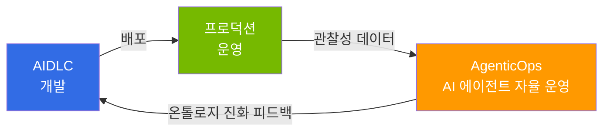

# AgenticOps: AI 에이전트 기반 자율 운영

> **읽는 시간**: 약 2분

AgenticOps는 [AIDLC](/docs/aidlc/methodology)로 소프트웨어를 개발한 이후, **실제 운영 환경에서의 지속적 개선을 위한 피드백 루프를 AI 에이전트를 통해 자율적으로 구축하는 접근 방법**입니다. 기존 AIOps가 AI를 모니터링 보조 도구로 활용했다면, AgenticOps는 AI 에이전트가 관찰성 데이터를 기반으로 **감지 → 판단 → 실행**까지 자율적으로 수행합니다.

## AIDLC와의 관계

AIDLC가 **"어떻게 만들 것인가"**(개발 방법론)에 집중한다면, AgenticOps는 **"어떻게 운영하고 개선할 것인가"**(운영 피드백 루프)에 집중합니다. AIDLC의 [온톨로지](/docs/aidlc/methodology/ontology-engineering)가 정의한 도메인 제약은 AgenticOps의 AI 에이전트가 운영 판단의 기준으로 활용하며, 운영에서 발견된 인사이트는 온톨로지 진화의 Outer Loop로 피드백됩니다.

## 구성

**1 → 2 → 3** 순서로 읽으면 데이터 기반 구축부터 자율 운영 실현까지의 전체 여정을 따라갈 수 있습니다.

| 순서 | 문서 | 핵심 질문 |
|------|------|----------|
| 1 | [관찰성 스택](./observability-stack.md) | 운영 데이터를 어떻게 수집·분석하는가? |
| 2 | [예측 운영](./predictive-operations.md) | 장애를 어떻게 사전에 예측하고 예방하는가? |
| 3 | [자율 대응](./autonomous-response.md) | AI 에이전트가 어떻게 자율적으로 대응하는가? |

## 핵심 기반: AWS 오픈소스 전략

AWS는 Kubernetes 생태계의 핵심 도구들을 Managed Add-on(22+), 관리형 오픈소스 서비스(AMP, AMG, ADOT)로 제공합니다. 이 기반 위에서 **Kiro + MCP(Model Context Protocol)**가 AgenticOps의 핵심 도구로 동작하며, AWS MCP 서버(50+ GA)를 통해 EKS 클러스터 제어, CloudWatch 메트릭 분석, 비용 최적화를 자율적으로 수행합니다.

## 참고 자료

- [Proactive EKS Monitoring with CloudWatch](https://aws.amazon.com/blogs/containers/proactive-amazon-eks-monitoring-with-amazon-cloudwatch-operator-and-aws-control-plane-metrics/)
- [AWS MCP Servers (50+ GA)](https://github.com/awslabs/mcp)
- [Kagent - Kubernetes AI Agent](https://github.com/kagent-dev/kagent)
- [Strands Agents SDK](https://github.com/strands-agents/sdk-python)
