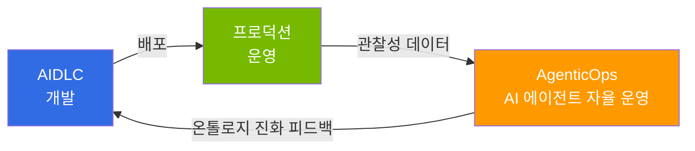

# AgenticOps: AI 에이전트 기반 자율 운영

AgenticOps는 AI 에이전트가 운영 중 수집한 데이터를 바탕으로 조치를 판단하고 실행하는 방식입니다. 이 문서의 **감지 → 판단 → 실행** 흐름에서 에이전트는 근거를 수집하고 대응을 선택한 뒤, 미리 정한 실행 범위 안에서 조치하거나 사람에게 검토를 요청합니다. 그 결과를 [AIDLC](/docs/aidlc/methodology)로 개발한 소프트웨어의 개선에 반영합니다.

## AIDLC와의 관계

AIDLC는 소프트웨어를 개발하는 과정을, AgenticOps는 운영에서 얻은 근거를 유지보수와 개선에 반영하는 과정을 설명합니다. [온톨로지](/docs/aidlc/methodology/ontology-engineering)의 제약은 에이전트의 판단 기준이 됩니다. **Outer Loop**는 운영에서 발견한 문제를 그 제약을 수정하는 사람과 절차에 전달하는 흐름입니다.

```mermaid
flowchart LR
    DEV["AIDLC<br/>개발"] -->|배포| PROD["프로덕션<br/>운영"]
    PROD -->|관찰성 데이터| AGOPS["AgenticOps<br/>AI 에이전트 자율 운영"]
    AGOPS -->|온톨로지 진화 피드백| DEV

    style DEV fill:#326ce5,color:#fff
    style PROD fill:#76b900,color:#fff
    style AGOPS fill:#ff9900,color:#fff
```

## 구성

**1 → 2 → 3** 순서로 읽으면 데이터 기반 구축부터 자율 운영 실현까지의 전체 여정을 따라갈 수 있습니다.

| 순서 | 문서 | 핵심 질문 |
|------|------|----------|
| 1 | [관찰성 스택](./observability-stack.md) | 운영 데이터를 어떻게 수집·분석하는가? |
| 2 | [예측 운영](./predictive-operations.md) | 장애를 어떻게 사전에 예측하고 예방하는가? |
| 3 | [자율 대응](./autonomous-response.md) | AI 에이전트가 어떻게 자율적으로 대응하는가? |

## 핵심 기반: AWS 오픈소스 전략

AWS는 Kubernetes 생태계의 핵심 도구들을 Managed Add-on(22+), 관리형 오픈소스 서비스(AMP, AMG, ADOT)로 제공합니다. 이 기반 위에서 **Kiro + MCP(Model Context Protocol)**가 AgenticOps의 핵심 도구로 동작하며, AWS MCP 서버(50+ GA)를 통해 EKS 클러스터 제어, CloudWatch 메트릭 분석, 비용 최적화를 자율적으로 수행합니다.

## 참고 자료

- [Proactive EKS Monitoring with CloudWatch](https://aws.amazon.com/blogs/containers/proactive-amazon-eks-monitoring-with-amazon-cloudwatch-operator-and-aws-control-plane-metrics/)
- [AWS MCP Servers (50+ GA)](https://github.com/awslabs/mcp)
- [Kagent - Kubernetes AI Agent](https://github.com/kagent-dev/kagent)
- [Strands Agents SDK](https://github.com/strands-agents/sdk-python)
