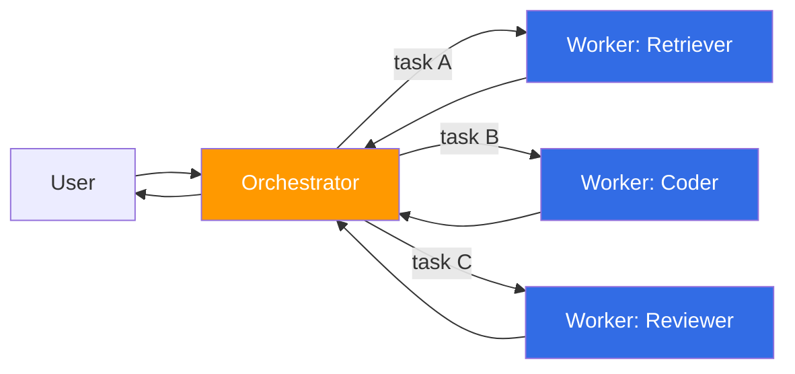
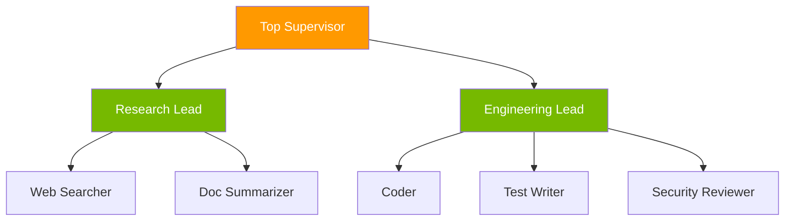
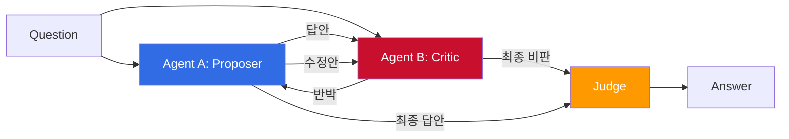
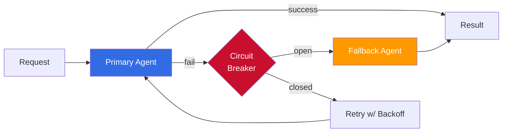
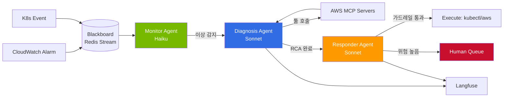

# Multi-Agent Collaboration Patterns

> 📅 **작성일**: 2026-04-18 | ⏱️ **읽는 시간**: 약 15분

---

## 1. 왜 멀티 에이전트인가

단일 LLM 에이전트는 도메인이 넓어지고 툴 사용이 복잡해질수록 빠르게 한계를 드러냅니다. 운영 환경에서 관찰되는 대표적인 한계는 다음과 같습니다.

- **컨텍스트 윈도우 포화**: Claude Opus 4.7의 1M 토큰도 대형 모노레포·장기 세션에서는 빠르게 소진되며, 주요 맥락이 요약 손실로 밀려남.
- **툴 스프롤 (Tool Sprawl)**: 하나의 에이전트에 20개 이상의 MCP 툴을 연결하면 tool-choice 정확도가 급격히 떨어짐 (Anthropic 2024 "Building effective agents" 참조).
- **전문성 범위 제한**: 코드 리뷰·SQL 작성·보안 분석은 시스템 프롬프트와 few-shot 구성이 상이. 하나의 프롬프트로 모두 만족시키기 어려움.
- **비용-정확도 트레이드오프**: Opus 급 모델을 모든 하위 작업에 쓰면 비용이 폭증, Haiku 급만 쓰면 복잡 추론에서 실패율 상승.

멀티 에이전트 시스템은 이러한 한계를 **역할 분리(role decomposition)**, **전용 컨텍스트(scoped context)**, **병렬 실행(parallel execution)**으로 해결합니다. 반면 다음과 같은 **역기능**도 명시적으로 관리해야 합니다.

| 역기능 | 원인 | 완화 방법 |
|--------|------|---------|
| 통신 비용 | 에이전트 간 메시지 직렬화, 서로 재요약 | 구조화된 shared state, 핸드오프 시 필수 필드만 전달 |
| 합의 지연 | Voting/Debate 시 라운드 반복 | 라운드 상한, 타임박스, 조기 종료 조건 |
| 토큰 비용 폭증 | N개 에이전트 × 평균 토큰 × 라운드 수 | 조건부 escalation, 모델 티어링(Haiku → Sonnet → Opus) |
| 실패 전파 | 한 에이전트 실패가 체인 전체 중단 | Circuit breaker, fallback agent, 부분 결과 허용 |
| 관측 복잡도 | 중첩 trace, 원인 추적 난이도 상승 | Langfuse/OTel hierarchy, `agent_name` span tag 필수화 |

:::tip 결정 기준
하위 작업이 **(a) 명확히 분리된 역할** 또는 **(b) 독립 병렬 실행**으로 이득을 볼 때만 멀티 에이전트를 도입합니다. 선형 파이프라인은 단일 에이전트 + tool-use가 거의 항상 더 저렴합니다.
:::

---

## 2. 핵심 협업 패턴

실무에서 반복적으로 관찰되는 6개 패턴을 정리합니다. 대부분의 시스템은 이 중 2-3개를 조합한 하이브리드입니다.

### 2.1 Orchestrator-Worker (Router 패턴)

오케스트레이터 에이전트가 사용자 요청을 받아 sub-task로 분해하고, 전문 워커 에이전트에게 할당합니다. 워커의 결과를 수집해 최종 응답을 합성합니다.



- **대표 구현**: LangGraph Supervisor, Strands Agents Graph, OpenAI Agents SDK Handoff.
- **적합**: 명확히 분류 가능한 도메인 (SQL / 코드 / 검색), 고정된 워커 풀.
- **주의**: 오케스트레이터가 병목이 되기 쉬움. 병렬 실행 가능한 sub-task는 `asyncio.gather` 등으로 fan-out.

### 2.2 Hierarchical Supervisor (Manager-Team)

Orchestrator-Worker를 다층으로 확장한 형태입니다. 최상위 Supervisor가 여러 Team Lead에게 위임하고, 각 Team Lead가 Specialist들을 관리합니다.



- **대표 구현**: LangGraph Multi-Agent Supervisor, CrewAI `Crew(process=Process.hierarchical, manager_agent=...)`.
- **적합**: 3단 이상의 의사결정 깊이가 필요한 대규모 과제 (예: 전체 서비스 리팩터링, 엔터프라이즈 문서 자동 생성).
- **주의**: Supervisor 계층이 깊을수록 지연·비용 증가. 2-3단을 넘기지 않는 것을 권장.

### 2.3 Voting / Ensemble

같은 질문을 N개 에이전트(또는 모델)에게 독립적으로 보내고 다수결 또는 가중 평균으로 결론을 냅니다.

- **기법**: Self-consistency, Mixture-of-Agents (MoA), majority voting, weighted ensemble.
- **적합**: 수학 문제, 분류 태스크, hallucination 리스크가 큰 RAG 답변 검증.
- **비용**: 정확히 N배. Haiku × 5 앙상블이 Opus × 1보다 높은 정확도를 보이는 사례가 다수 보고됨.
- **구현 팁**: 각 에이전트의 temperature를 다르게 설정하거나 서로 다른 프롬프트 템플릿을 사용해 다양성 확보.

### 2.4 Debate / Adversarial

두 에이전트가 서로의 답을 비판하고 반박하는 라운드를 거쳐, 제3의 judge 에이전트가 결론을 선택합니다.



- **적합**: 복잡한 추론, 코드 결함 탐색, 정책·윤리 판단.
- **효과**: Society of Minds, Multi-Agent Debate 논문들에서 단일 에이전트 대비 정확도 상승 보고.
- **한계**: 라운드당 토큰 비용이 누적. 일반적으로 2-3라운드 + Judge 구조로 상한을 둠.

### 2.5 Plan-and-Execute

Planner 에이전트가 전체 실행 계획을 먼저 수립하고, Executor 에이전트(들)가 단계별로 실행합니다. 필요시 Re-Planner가 중간 결과를 받아 계획을 수정합니다.

- **대표 구현**: LangChain Plan-and-Execute, OpenAI Deep Research (Planner + Browser + Writer), Claude Code의 TodoWrite + executor 패턴.
- **적합**: 장기 실행 태스크 (연구 보고서, 대규모 리팩터링, 멀티스텝 데이터 파이프라인).
- **핵심**: 계획 수립을 고성능 모델 (Opus, GPT-5 Reasoning)로, 실행은 중저가 모델로 분리해 비용 효율 확보.

### 2.6 Blackboard / Shared Memory

중앙 저장소(blackboard)에 모든 에이전트가 관찰과 중간 결과를 기록합니다. 각 에이전트는 자신의 전문성에 부합하는 태스크가 보이면 자율적으로 기여합니다.

- **저장소**: Redis, Postgres (LangGraph checkpointer), DynamoDB, 또는 파일 시스템.
- **적합**: 장기 세션(수시간 이상), 비동기 협업, 에이전트 합류·이탈이 빈번한 환경.
- **주의**: 경쟁 조건(race condition) — 낙관적 잠금, 버전 번호, 또는 이벤트 소싱으로 일관성 보장.

---

## 3. 구현 프레임워크 비교 (2026-04 기준)

| 프레임워크 | 주요 추상화 | 언어 | 주요 패턴 | 라이선스 |
|----------|-----------|------|---------|---------|
| **LangGraph** | StateGraph + Node | Python/JS | Supervisor, Swarm, Conditional routing | MIT |
| **CrewAI** | Crew + Agent + Task | Python | Sequential / Hierarchical / Consensus | MIT |
| **AutoGen (v0.4+)** | ConversableAgent + GroupChat | Python | Conversation + Workflow | Apache 2.0 |
| **Strands Agents SDK** | Agent + Graph (Python) | Python | Orchestrator, Handoff | Apache 2.0 |
| **OpenAI Agents SDK** | Agent + Handoff | Python/TS | Orchestrator-Worker, Handoff | Apache 2.0 |
| **Amazon Bedrock AgentCore** | Agent + Action Group | AWS SDK | Managed, MCP native | AWS managed |

### 3.1 LangGraph

StateGraph 기반으로 노드 간 상태 전이를 그래프로 정의합니다. `create_react_agent`, `create_supervisor`, swarm 헬퍼로 대부분의 패턴을 10-50줄에 구현할 수 있습니다. LangGraph Platform (유료) 또는 self-host로 배포하며, Postgres/Redis checkpointer로 장기 실행 복구를 지원합니다.

### 3.2 CrewAI

역할 기반 협업을 자연어 선언으로 표현합니다. `Process.sequential`, `Process.hierarchical`, `Process.consensual` 3가지 모드를 제공하며, `manager_agent`로 계층형 감독 구조를 구성합니다. 실무에서는 "role / goal / backstory"를 명확히 작성하는 것이 품질을 좌우합니다.

### 3.3 AutoGen (v0.4+)

Microsoft Research의 프레임워크로, v0.4에서 actor-model 기반으로 재설계되었습니다. `GroupChat`, `SelectorGroupChat`, `MagenticOne` 등으로 대화형 멀티 에이전트를 구성하며, 코드 실행 환경(Docker, Jupyter)과의 통합이 강점입니다.

### 3.4 Strands Agents SDK

AWS에서 2025년 공개한 오픈소스 SDK로, Bedrock과 밀접하게 통합되지만 OpenAI·Anthropic 직접 호출도 지원합니다. `Agent` + `Graph` 추상화가 LangGraph와 유사하며, MCP 툴을 1-급 시민(first-class)으로 취급합니다. Strands Agents Handoff는 OpenAI Agents SDK의 핸드오프와 설계 의도가 유사합니다.

### 3.5 OpenAI Agents SDK

OpenAI가 2025년 3월 Swarm 후속으로 공개한 GA 수준 SDK입니다. `Agent`, `Runner`, `handoff`, `guardrail` 4가지 프리미티브로 거의 모든 패턴을 조합할 수 있습니다. 트레이싱이 OpenAI Dashboard와 통합되어 있어 관측성 셋업이 빠릅니다.

### 3.6 Amazon Bedrock AgentCore

Agents for Bedrock 위에 Action Group, Knowledge Base, Guardrails, Memory를 관리형으로 제공합니다. MCP native 지원으로 외부 툴 통합이 용이하며, IAM·VPC 경계 안에서 멀티 에이전트 실행이 가능해 규제 산업에 적합합니다.

:::tip 프레임워크 선택 가이드
- **빠른 프로토타입**: CrewAI 또는 OpenAI Agents SDK
- **복잡한 상태 전이·복구**: LangGraph + Postgres checkpointer
- **AWS 생태계 고정**: Strands Agents SDK 또는 Bedrock AgentCore
- **연구·실험**: AutoGen v0.4 (다양한 대화 패턴 탐색 용이)
:::

### 3.7 최소 구현 예시: Supervisor 패턴

```python
# LangGraph — Supervisor가 Researcher/Coder 중 하나로 라우팅
from langgraph.graph import StateGraph, END
from langgraph.prebuilt import create_react_agent
from langchain_anthropic import ChatAnthropic

llm = ChatAnthropic(model="claude-sonnet-4-5")
researcher = create_react_agent(llm, tools=[web_search], name="researcher")
coder = create_react_agent(llm, tools=[execute_python], name="coder")

def supervisor(state):
    decision = llm.invoke([
        {"role": "system", "content": "Route to 'researcher' or 'coder'. Reply with one word."},
        {"role": "user", "content": state["input"]},
    ]).content.strip().lower()
    return {"next": decision}

graph = StateGraph(dict)
graph.add_node("supervisor", supervisor)
graph.add_node("researcher", researcher)
graph.add_node("coder", coder)
graph.set_entry_point("supervisor")
graph.add_conditional_edges("supervisor", lambda s: s["next"],
                             {"researcher": "researcher", "coder": "coder"})
graph.add_edge("researcher", END)
graph.add_edge("coder", END)
app = graph.compile()
```

```python
# CrewAI — Hierarchical Crew
from crewai import Agent, Task, Crew, Process

manager = Agent(role="Engineering Manager",
                goal="분배, 검수, 최종 승인",
                backstory="10년차 플랫폼 리드")
coder = Agent(role="Coder", goal="기능 구현", backstory="...")
reviewer = Agent(role="Reviewer", goal="코드 리뷰", backstory="...")

crew = Crew(agents=[coder, reviewer],
            tasks=[Task(description="인증 엔드포인트 구현", agent=coder),
                   Task(description="리뷰 및 피드백", agent=reviewer)],
            manager_agent=manager,
            process=Process.hierarchical)
result = crew.kickoff()
```

```python
# OpenAI Agents SDK — Handoff
from agents import Agent, Runner, handoff

triage = Agent(
    name="Triage",
    instructions="질문을 분류해 적절한 에이전트로 넘긴다.",
    handoffs=[
        handoff(Agent(name="BillingBot", instructions="요금 문의")),
        handoff(Agent(name="TechBot", instructions="기술 문의")),
    ],
)
result = await Runner.run(triage, input="인보이스가 두 번 청구됐어요.")
```

---

## 4. 상태 공유·충돌 해결·실패 복구

### 4.1 상태 공유 모델

| 모델 | 설명 | 대표 구현 |
|------|------|---------|
| Shared Memory | 중앙 저장소를 모두가 읽고 씀 | LangGraph `StateGraph`, Redis/Postgres |
| Message Passing | 에이전트 간 메시지 큐로만 통신 | AutoGen GroupChat, AWS SQS |
| Blackboard | 이벤트 소싱 + 구독 | Kafka, EventBridge |
| Handoff Context | 호출 시점에 컨텍스트 전달, 이후 분리 | OpenAI Agents SDK, Strands Handoff |

실무에서는 **Shared Memory + Handoff Context**를 조합하는 방식이 가장 흔합니다. 공통 상태(사용자 요청, 누적 결과)는 shared state에, 에이전트별 작업 지시는 handoff payload에 담습니다.

### 4.2 충돌 해결 전략

- **Voting**: 다수결 또는 가중 평균. 동률 시 tiebreaker 에이전트 지정.
- **Referee Agent**: Debate 패턴에서 judge가 최종 결정.
- **Deterministic Winner Rule**: "보안 리뷰어가 거부하면 무조건 재작업" 같은 하드 룰.
- **우선순위 큐**: 긴급 작업이 진행 중이면 다른 에이전트 대기.

### 4.3 실패 복구



- **Retry Budget**: 에이전트별 최대 재시도 횟수와 토큰 예산. 초과 시 상위로 escalate.
- **Per-Agent Circuit Breaker**: 특정 에이전트의 연속 실패율이 임계치 초과 시 일시 차단.
- **Fallback Agent**: 더 단순한 프롬프트 + 저가 모델로 우회. 품질 저하를 감수하고 가용성 확보.
- **Checkpointer 복구**: LangGraph/Strands의 checkpoint 기능으로 중간 상태부터 재개 (장기 태스크에서 필수).

---

## 5. 관측성 (Langfuse + OpenTelemetry)

멀티 에이전트 시스템의 trace는 자연스럽게 계층 구조를 가집니다. 이를 Langfuse/OTel에서 올바르게 표현하면 디버깅과 성능 분석이 극적으로 쉬워집니다.

### 5.1 Trace 계층 설계

```
Trace: user-request-<uuid>
└── Span: orchestrator.plan
    ├── Span: worker.retriever
    │   ├── Span: tool.vector_search
    │   └── Span: llm.claude-opus-4-7
    ├── Span: worker.coder
    │   └── Span: llm.sonnet-4-5
    └── Span: judge.reviewer
        └── Span: llm.opus-4-7
```

### 5.2 필수 Span 속성

각 span에 다음 속성을 일관되게 부여합니다. 운영 시 대시보드 필터링·알람의 기반이 됩니다.

- `agent.name`: 에이전트 식별자 (예: `retriever`, `coder`, `judge`)
- `agent.role`: 역할 (예: `worker`, `supervisor`, `critic`)
- `agent.model`: 사용 모델 (예: `claude-opus-4-7`, `gpt-5-reasoning`)
- `handoff.reason`: 핸드오프 사유 (다른 에이전트로 전환된 경우)
- `handoff.from` / `handoff.to`
- `round.index`: Voting/Debate 라운드 번호
- `tokens.input` / `tokens.output` / `cost.usd`

### 5.3 Langfuse 대시보드 예시

- **에이전트별 레이턴시 p95**: `agent.name` 그룹핑으로 병목 식별
- **핸드오프 히트맵**: `handoff.from` × `handoff.to` 매트릭스
- **라운드별 비용**: Debate/Voting 패턴의 비용 수렴성 검증
- **실패율**: `status=error` span을 `agent.name`으로 집계

:::tip OpenTelemetry 연동
Langfuse v3.x는 OTel native 수집기로 동작합니다. 앱에서 `traceparent` W3C 표준을 사용하면 AWS X-Ray, Datadog, Grafana Tempo와도 단일 trace로 연결됩니다.
:::

---

## 6. 비용·레이턴시 패턴

### 6.1 비용 증가 요인

- **에이전트 수 N**: 비용은 N에 선형. Voting은 정확히 N배.
- **라운드 수 R**: Debate 2-3라운드 기준 비용 × 2~3배.
- **컨텍스트 누적**: 라운드가 지날수록 이전 응답이 컨텍스트에 쌓여 input token 비용 비선형 증가.
- **툴 호출 체인**: tool-use 응답도 다시 LLM에 들어가 비용 발생.

### 6.2 비용 최적화 체크리스트

| 항목 | 기법 |
|------|------|
| 모델 티어링 | Planner=Opus, Worker=Sonnet, Summarizer=Haiku |
| 프롬프트 캐싱 | Claude prompt caching, OpenAI prompt caching으로 시스템 프롬프트 재사용 |
| 조건부 escalation | 단순 태스크는 Haiku로 시작, confidence 낮으면 상위 모델 호출 |
| 병렬 실행 | 독립 sub-task는 `asyncio.gather`/`Promise.all`로 레이턴시 단축 |
| 중간 결과 요약 | 긴 대화 히스토리를 주기적으로 요약해 컨텍스트 압축 |
| 조기 종료 | Voting에서 과반 확보 시 나머지 취소 |

### 6.3 레이턴시 최적화

- **Streaming 핸드오프**: 첫 토큰부터 다음 에이전트가 처리 시작 (speculative execution).
- **Fan-out 후 first-wins**: N개 에이전트에 동시 요청, 가장 먼저 도착한 신뢰 가능한 응답 사용.
- **Prewarming**: 자주 쓰는 에이전트는 idle 상태로 유지 (세션 캐시).

---

## 7. AIDLC 단계별 활용

AIDLC의 각 단계에서 멀티 에이전트 패턴이 어떻게 적용되는지 정리합니다.

### 7.1 Inception (구상·기획)

- **Planner Agent**: 모호한 요구사항을 구조화된 백로그로 변환.
- **Critic Agent**: 플래너 산출물을 비판적으로 검토해 누락·모순 식별.
- 조합: Plan-and-Execute + Debate 하이브리드.

### 7.2 Construction (개발·검증)

- **Coder Agent**: 기능 구현 (Sonnet).
- **Reviewer Agent**: 코드 리뷰 (Opus, 보안·품질 분리 가능).
- **Test Writer Agent**: 테스트 생성 및 실행.
- 조합: Orchestrator-Worker, Hierarchical Supervisor.

### 7.3 Operations (AgenticOps)

- **Monitor Agent**: 관찰성 데이터 상시 분석 (Haiku).
- **Diagnosis Agent**: 이상 징후 발견 시 근본 원인 분석 (Sonnet).
- **Responder Agent**: 사전 정의 가드레일 내 자동 복구 (Sonnet/Opus).
- **Human Escalation Agent**: 위험 변경은 승인 큐로 라우팅.
- 조합: [자율 대응](./autonomous-response.md)에서 상세 기술. Blackboard + Orchestrator-Worker.

:::tip AIDLC 전반에 걸친 공통 원칙
- 모든 단계의 에이전트 출력을 [온톨로지](/docs/aidlc/methodology/ontology-engineering)에 매핑해 일관된 어휘 사용.
- 단계 간 핸드오프는 artifact(PRD, ADR, RCA 문서)를 매개로 — 에이전트 세션이 종료되어도 컨텍스트 유실되지 않음.
:::

---

## 8. 케이스 스터디: AgenticOps 자율 대응 파이프라인

실제 EKS 인시던트 대응에 멀티 에이전트 패턴을 적용한 예시입니다. [자율 대응](./autonomous-response.md) 문서의 3단계(감지 → 판단 → 실행)를 에이전트로 구현합니다.

### 8.1 아키텍처



### 8.2 역할 및 모델 티어링

| 에이전트 | 모델 | 평균 호출/시간 | 월 비용(추정) |
|---------|------|-------------|------------|
| Monitor | claude-haiku-4-5 | 3,600 | ~$20 |
| Diagnosis | claude-sonnet-4-5 | 50 | ~$30 |
| Responder | claude-sonnet-4-5 + Opus escalation | 30 | ~$40 |
| Judge (위험 행동 승인) | claude-opus-4-7 | 5 | ~$15 |

Opus를 Monitor에 썼다면 월 $1,000+ 로 급증. 티어링만으로 95% 비용 절감.

### 8.3 핸드오프 계약 (Handoff Contract)

각 에이전트 간 전달되는 payload는 JSON Schema로 엄격히 정의합니다.

```json
{
  "incident_id": "inc-20260418-0042",
  "from_agent": "diagnosis",
  "to_agent": "responder",
  "severity": "P2",
  "root_cause": "Pod OOMKilled — memory limit 512Mi, actual peak 780Mi",
  "evidence": {
    "metrics": ["container_memory_working_set_bytes"],
    "logs": ["OOMKilled at 2026-04-18T10:32:15Z"],
    "affected_resources": ["deploy/api-gateway", "ns/prod"]
  },
  "proposed_action": {
    "type": "patch_deployment",
    "changes": {"spec.template.spec.containers[0].resources.limits.memory": "1Gi"}
  },
  "risk_level": "low",
  "requires_human_approval": false
}
```

이 스키마는 [온톨로지](/docs/aidlc/methodology/ontology-engineering)의 `Incident`, `Resource`, `Action` 엔티티와 1:1 매핑되어, 에이전트 간 어휘 일관성을 보장합니다.

### 8.4 결과 (3개월 운영)

- **MTTR**: 112분 → 6분 (95% 감소)
- **자율 해결 비율**: 전체 인시던트 중 68%
- **Human escalation**: 32% (위험도 높음 + 신규 패턴)
- **False positive**: 3% 이하 (가드레일 + Judge 조합 효과)

---

## 9. 안티패턴: 실패 사례에서 배우기

### 9.1 God Agent

모든 툴과 지식을 하나의 에이전트에 몰아넣는 패턴. 초기에는 편해 보이지만 툴이 15개를 넘어가면 tool-choice 정확도가 급락합니다.

- **징후**: 시스템 프롬프트가 2,000 토큰 초과, 툴 20개 이상.
- **해결**: 도메인별로 에이전트 분리 + Orchestrator-Worker 도입.

### 9.2 무한 핸드오프 루프

A → B → A → B → ... 핑퐁. 각 에이전트가 자신의 역할이 아니라 판단해 계속 떠넘김.

- **징후**: 동일 trace에서 같은 핸드오프 쌍이 3회 이상 반복.
- **해결**: 핸드오프 홉(hop) 상한 설정, 루프 감지 시 escalation.

### 9.3 합의 없는 Voting

짝수 에이전트로 Voting 구성 → 동률 → 처리 불가.

- **해결**: 홀수 에이전트 구성, 또는 tiebreaker 에이전트 별도 지정.

### 9.4 공유 상태 레이스 컨디션

두 에이전트가 동시에 같은 blackboard 필드를 갱신해 한쪽 결과 유실.

- **해결**: 낙관적 잠금(version number), CRDT, 또는 이벤트 소싱.

### 9.5 관측성 공백

에이전트 내부 LLM 호출은 trace에 찍히지만 에이전트 간 핸드오프는 별도 trace로 분리되어 원인 추적 불가.

- **해결**: `traceparent` 헤더 전파, 모든 에이전트가 동일 root trace에 span 추가.

### 9.6 Prompt Injection 전파

사용자 입력에 포함된 injection이 한 에이전트에서 다음 에이전트로 그대로 전달되며 시스템 명령으로 해석됨.

- **해결**: Gateway 레이어에서 입력 sanitize, 에이전트 간 핸드오프 payload는 system 역할이 아닌 user/tool 역할로만 전달.

---

## 10. 운영 모범 사례 체크리스트

멀티 에이전트 시스템을 프로덕션에 올리기 전 점검 항목입니다.

- [ ] **역할 경계 명확**: 각 에이전트의 책임 범위와 "하지 않을 일"을 시스템 프롬프트에 명시.
- [ ] **Handoff 조건 문서화**: 어떤 상황에서 누구에게 넘기는지 결정 트리로 기록.
- [ ] **Guardrails 공통 레이어**: PII 마스킹, prompt injection 방어, 출력 스키마 검증을 각 에이전트가 아닌 gateway 레이어에서 수행.
- [ ] **비용·레이턴시 상한**: 요청당 최대 토큰, 최대 라운드, 최대 실행 시간 하드 리밋.
- [ ] **관측성 속성 표준화**: `agent.name`, `agent.role`, `handoff.reason`을 모든 span에 강제.
- [ ] **실패 경로 정의**: 에이전트 실패 시 사용자에게 무엇을 보여줄지 (부분 결과 / 에러 / 재시도 안내).
- [ ] **모델 버전 고정**: 모델 업데이트 시 회귀 방지를 위해 pinned version + canary 롤아웃.
- [ ] **테스트 스위트**: 각 에이전트를 개별 테스트, 시스템 전체 E2E 테스트 (LangSmith, Langfuse experiments).
- [ ] **Human-on-the-Loop 진입점**: 자율 실행 중에도 사람이 개입할 수 있는 취소·수정 API.
- [ ] **감사 로그 불변성**: 모든 에이전트 결정 근거(prompt + response + tool call)를 write-once 저장소에 보존.

---

## 11. 참고 자료

### 프레임워크 공식 문서

- [LangGraph](https://langchain-ai.github.io/langgraph/) — StateGraph, Supervisor, Swarm 튜토리얼
- [CrewAI](https://docs.crewai.com/) — Sequential/Hierarchical 프로세스 가이드
- [AutoGen](https://microsoft.github.io/autogen/) — v0.4 actor model, GroupChat
- [Strands Agents SDK](https://github.com/strands-agents/sdk-python) — AWS 오픈소스 SDK
- [OpenAI Agents SDK](https://openai.github.io/openai-agents-python/) — Handoff, Guardrails
- [Amazon Bedrock Agents](https://docs.aws.amazon.com/bedrock/latest/userguide/agents.html) — Action Group, Knowledge Base

### 논문·블로그

- Anthropic, ["Building effective agents"](https://www.anthropic.com/research/building-effective-agents) (2024) — 패턴 원전
- OpenAI, ["Introducing Deep Research"](https://openai.com/index/introducing-deep-research/) (2025) — Plan-and-Execute 사례
- OpenAI, ["Swarm: experimental framework"](https://github.com/openai/swarm) (2024) — Agents SDK 전신
- Du et al., ["Improving Factuality and Reasoning in Language Models through Multiagent Debate"](https://arxiv.org/abs/2305.14325) (2023)
- Wang et al., ["Mixture-of-Agents Enhances Large Language Model Capabilities"](https://arxiv.org/abs/2406.04692) (2024)

### 관련 문서

- [자율 대응](./autonomous-response.md) — AgenticOps의 Agent-Driven 패턴 실전
- [관찰성 스택](./observability-stack.md) — Langfuse + OTel 상세
- [온톨로지 엔지니어링](/docs/aidlc/methodology/ontology-engineering) — 에이전트 공통 어휘
