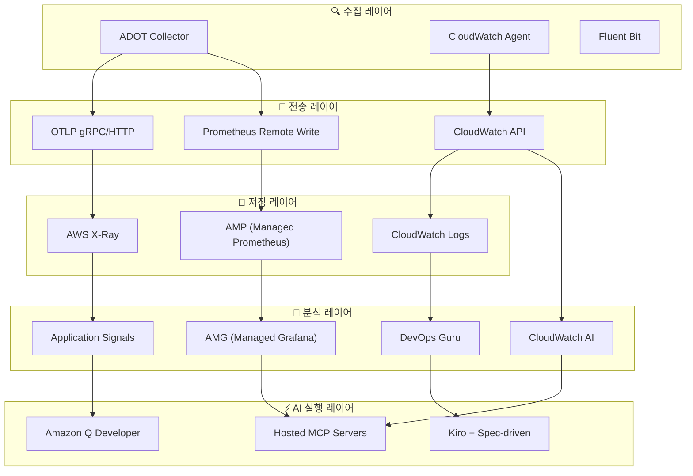
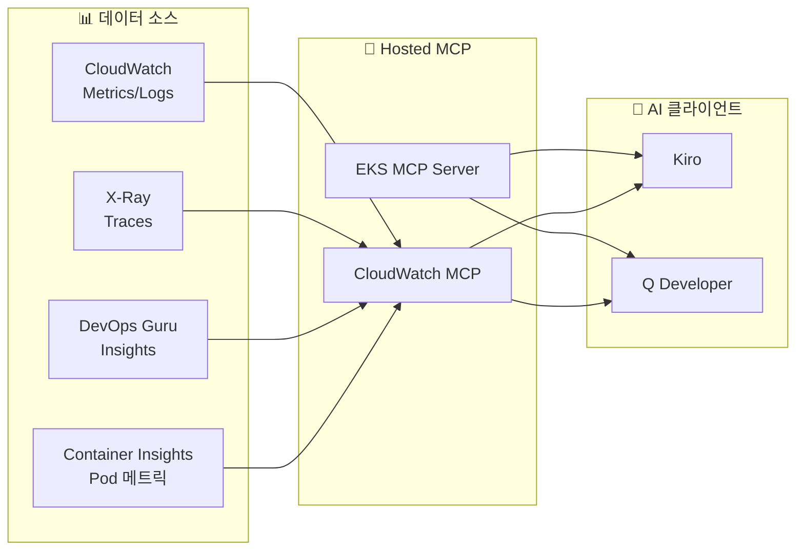
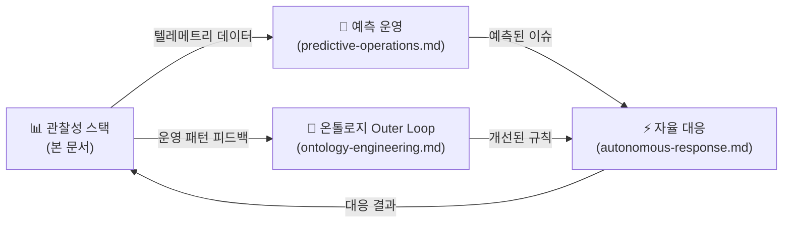

import { ObservabilityPillars, ArchitectureLayers, StackSelectionPatterns } from '@site/src/components/ObservabilityStackTables';

# 관찰성 스택

> **AIDLC Operations의 데이터 기반** — 3-Pillar 텔레메트리 + AI 분석 레이어를 통한 운영 인텔리전스 구축

---

## 1. 개요

### 1.1 관찰성이 AgenticOps의 데이터 기반인 이유

**관찰성(Observability)**은 시스템의 내부 상태를 외부 출력(메트릭·로그·트레이스)을 통해 이해하는 능력이다. EKS 환경에서 수백 개의 Pod, 복잡한 서비스 메시, 동적 스케일링이 결합되면 전통적 모니터링만으로는 근본 원인을 파악하기 어렵다.

**AgenticOps 맥락에서 관찰성의 역할**:

- **[예측 운영](./predictive-operations.md)**: 과거 텔레메트리 패턴 학습 → 미래 이슈 예측
- **[자율 대응](./autonomous-response.md)**: 실시간 메트릭 기반 자동 스케일링 및 자가 치유
- **[온톨로지 엔지니어링](../methodology/ontology-engineering.md) Outer Loop**: 운영 데이터를 피드백하여 온톨로지 지속 개선

:::tip AIDLC 신뢰성 듀얼 축
관찰성 스택은 **AIDLC 신뢰성의 하네스(Harness)** 역할을 한다. 온톨로지가 "무엇이 옳은 행동인가"를 정의한다면, 관찰성은 "실제로 옳게 작동하는가"를 검증한다. 이 둘이 결합되어 신뢰성 듀얼 축(Ontology × Harness)을 형성한다.
:::

### 1.2 3-Pillar 관찰성 + AI 분석 레이어

<ObservabilityPillars />

**AI 분석 레이어 추가**:
- **CloudWatch AI 자연어 쿼리**: PromQL/Logs Insights 구문 없이 자연어로 분석
- **CloudWatch Investigations**: 알림 발생 시 AI 기반 근본 원인 분석 자동화
- **DevOps Guru**: ML 기반 이상 탐지 및 인사이트 제공
- **MCP 통합**: AI Agent(Kiro/Q Dev)가 관찰성 데이터를 직접 조회·분석

### 1.3 EKS 관찰성의 핵심 도전과제

- **동적 인프라**: Pod가 수시로 생성/삭제, Karpenter에 의한 노드 동적 프로비저닝
- **마이크로서비스 복잡성**: 서비스 간 호출 체인이 복잡하여 장애 전파 경로 추적 어려움
- **멀티 레이어 문제**: 애플리케이션·컨테이너·노드·네트워크·AWS 서비스 등 다층 구조
- **비용 최적화**: 리소스 사용 패턴 분석을 통한 Right-sizing 필요
- **규정 준수**: 감사 로그, 접근 기록 등 컴플라이언스 요구사항

---

## 2. 5-Layer 관찰성 아키텍처

### 2.1 레이어 구조

<ArchitectureLayers />

**데이터 흐름**:



### 2.2 레이어별 핵심 역할

**1. 수집 레이어 (Collection)**:
- **ADOT (OpenTelemetry)**: 메트릭·로그·트레이스 통합 수집, CNCF 표준
- **CloudWatch Agent**: Container Insights Enhanced, Application Signals
- **Fluent Bit**: 고성능 로그 포워딩

**2. 전송 레이어 (Transport)**:
- **OTLP (OpenTelemetry Protocol)**: 벤더 중립 표준 프로토콜
- **Prometheus Remote Write**: 장기 메트릭 저장
- **CloudWatch API**: AWS 네이티브 통합

**3. 저장 레이어 (Storage)**:
- **AMP**: 장기 메트릭 저장 (150일), PromQL 지원
- **CloudWatch Logs**: 로그 집중화, Insights 쿼리
- **X-Ray**: 분산 트레이싱 저장

**4. 분석 레이어 (AI Analysis)**:
- **AMG**: Grafana 대시보드 (AMP/CW/XRay 통합)
- **CloudWatch AI**: 자연어 쿼리 + Investigations (근본 원인 분석)
- **DevOps Guru**: ML 기반 이상 탐지
- **Application Signals**: Zero-code 계측 서비스 맵

**5. AI 실행 레이어 (Action)**:
- **MCP 서버**: AI Agent에 관찰성 데이터 공급
- **Kiro**: Spec-driven 자율 대응 (IaC 코드 생성)
- **Q Developer**: 대화형 운영 지원

### 2.3 관찰성 스택 선택 패턴

<StackSelectionPatterns />

:::tip ADOT (OpenTelemetry) 수집 레이어
어떤 백엔드를 선택하든, **ADOT를 수집 레이어로 사용하면 백엔드 교체가 자유롭다**. OpenTelemetry는 CNCF 표준이므로 Prometheus, Datadog, Sumo Logic 등 대부분의 백엔드로 데이터를 내보낼 수 있다. 이것이 AWS가 자체 에이전트 대신 OpenTelemetry를 Managed Add-on(ADOT)으로 제공하는 이유다.
:::

---

## 3. AWS 관리형 관찰성 스택

### 3.1 Managed Add-ons 기반 구축

**EKS Managed Add-ons**는 AWS가 관찰성 에이전트의 설치·업그레이드·패치를 관리하여 운영 복잡성을 제거한다.

| Add-on | 역할 | 버전 예시 |
|--------|------|----------|
| **adot** | ADOT Collector (OpenTelemetry) | v0.40.0-eksbuild.1 |
| **amazon-cloudwatch-observability** | Container Insights + Application Signals | v2.2.0-eksbuild.1 |

**설치 예시**:

```bash
# ADOT Add-on
aws eks create-addon \
  --cluster-name my-cluster \
  --addon-name adot \
  --addon-version v0.40.0-eksbuild.1 \
  --service-account-role-arn arn:aws:iam::ACCOUNT_ID:role/adot-collector-role

# CloudWatch Observability Add-on
aws eks create-addon \
  --cluster-name my-cluster \
  --addon-name amazon-cloudwatch-observability \
  --service-account-role-arn arn:aws:iam::ACCOUNT_ID:role/cloudwatch-agent-role
```

:::info ADOT vs 자체 OpenTelemetry 배포
ADOT Add-on 사용 시:
- OpenTelemetry Operator 자동 설치
- AWS 서비스 인증(SigV4) 내장
- EKS 버전 호환성 AWS 보장
- 자체 배포 대비 운영 부담 80% 감소
:::

### 3.2 AMP + AMG 통합

**Amazon Managed Prometheus (AMP)**:
- 150일 메트릭 장기 보관 (자체 구축 대비 60% 비용 절감)
- PromQL 완전 호환
- 자동 스케일링 (처리량 무제한)

**Amazon Managed Grafana (AMG)**:
- Grafana v11.x 최신 버전 자동 관리
- AMP/CloudWatch/X-Ray 데이터소스 통합
- SAML/SSO 인증 내장

**데이터 흐름**:

```
ADOT Collector → Prometheus Remote Write → AMP
                                            ↓
AMG ← PromQL 쿼리 ← Grafana 대시보드
```

### 3.3 관찰성 백엔드 비교

| 백엔드 | 장점 | 단점 | 적합 시나리오 |
|--------|------|------|--------------|
| **AWS 네이티브 (AMP+AMG+CW)** | EKS 통합 최적화, IAM 인증, 관리 부담 최소 | 멀티 클라우드 불리 | AWS 중심 인프라 |
| **OSS (Prometheus+Grafana)** | 완전한 제어, 비용 투명성 | 운영 부담 (HA, 스토리지 관리) | 자체 운영 역량 보유 시 |
| **3rd Party (Datadog)** | 통합 플랫폼, 풍부한 대시보드 | 높은 비용, 벤더 종속 | 멀티 클라우드 환경 |

---

## 4. Container Insights Enhanced + Application Signals

### 4.1 Container Insights Enhanced

**EKS 1.28+**에서 Enhanced Container Insights는 **Control Plane 메트릭**을 포함한 심층 관찰성을 제공한다.

**수집 메트릭 범위**:
- **Pod 메트릭**: CPU, 메모리, 네트워크, 디스크 I/O
- **노드 메트릭**: 리소스 사용률, Kubelet 상태
- **Control Plane 메트릭** (EKS 1.28+):
  - **API Server**: `apiserver_request_total`, `apiserver_request_duration_seconds`
  - **etcd**: `etcd_db_total_size_in_bytes`, `etcd_server_slow_apply_total`
  - **Scheduler**: `scheduler_schedule_attempts_total`, `scheduler_scheduling_duration_seconds`
  - **Controller Manager**: `workqueue_depth`, `workqueue_adds_total`

:::warning 비용 고려사항
Enhanced Container Insights는 월 $50-200 수준의 추가 비용 발생. 개발/스테이징에서는 기본 Container Insights, 프로덕션에서만 Enhanced 활성화 권장.
:::

### 4.2 Application Signals

**Zero-code 계측**으로 애플리케이션의 서비스 맵, SLI/SLO, 호출 그래프를 자동 생성한다.

**지원 언어**:
- **Java**: Spring Boot, Tomcat, Jetty (자동 계측)
- **Python**: Django, Flask, FastAPI (자동 계측)
- **.NET**: ASP.NET Core (자동 계측)
- **Node.js**: Express, Nest.js (수동 계측)

**자동 생성 항목**:
- **Service Map**: 서비스 간 호출 관계 시각화 (에러율·레이턴시 표시)
- **SLI 자동 설정**: 가용성(에러율), 레이턴시(P99), 처리량 자동 측정
- **SLO 구성**: SLI 기반 목표 설정 (예: 가용성 99.9%, P99 < 500ms)

**활성화 방법**:

```yaml
# Pod에 annotation 추가만으로 자동 계측
apiVersion: apps/v1
kind: Deployment
metadata:
  name: my-java-app
spec:
  template:
    metadata:
      annotations:
        instrumentation.opentelemetry.io/inject-java: "app-signals"
    spec:
      containers:
        - name: app
          image: my-java-app:latest
```

---

## 5. CloudWatch AI 자연어 쿼리 + Investigations

### 5.1 CloudWatch AI 자연어 쿼리

**PromQL이나 Logs Insights 구문 없이 자연어로 분석**할 수 있는 기능이다.

**실제 쿼리 예시**:

```
질문: "지난 1시간 동안 CPU 사용률이 80%를 초과한 EKS 노드는?"
→ CloudWatch Metrics Insights 쿼리 자동 생성

질문: "payment-service에서 5xx 에러가 가장 많이 발생한 시간대는?"
→ CloudWatch Logs Insights 쿼리 자동 생성

질문: "어제 대비 오늘 API 응답 시간이 느려진 서비스는?"
→ 비교 분석 쿼리 자동 생성
```

**리전 가용성 (2025년 8월 GA)**:
- **로컬 처리**: us-east-1, us-east-2, us-west-2, ap-northeast-1, ap-southeast-1/2, eu-central-1, eu-west-1, eu-north-1
- **Cross-Region 처리**: ap-east-1 (Hong Kong) → US 리전으로 프롬프트 전송

### 5.2 CloudWatch Investigations

**AI 기반 근본 원인 분석 도구**로, 알림 발생 시 자동으로 관련 메트릭·로그·트레이스를 수집하여 분석한다.

**분석 프로세스**:
1. **알림 트리거**: CloudWatch Alarm 또는 DevOps Guru 인사이트 발생
2. **컨텍스트 수집**: 관련 메트릭, 로그, 트레이스, 구성 변경 이력 자동 수집
3. **AI 분석**: 수집된 데이터를 AI가 분석하여 근본 원인 추론
4. **타임라인 생성**: 이벤트 발생 순서를 시간대별로 정리
5. **권장 조치**: 구체적인 해결 방안 제시

**출력 예시**:

```
[CloudWatch Investigation 결과]
━━━━━━━━━━━━━━━━━━━━━━━━━━━━━━━━━━
📋 조사 요약: payment-service 레이턴시 증가

⏱️ 타임라인:
  14:23 - RDS 연결 풀 사용률 급증 (70% → 95%)
  14:25 - payment-service P99 레이턴시 500ms → 2.3s
  14:27 - 다운스트림 order-service도 영향 받기 시작
  14:30 - CloudWatch Alarm 트리거

🔍 근본 원인:
  RDS 인스턴스(db.r5.large)의 연결 수가 max_connections에
  근접하여 새 연결 생성이 지연됨

📌 권장 조치:
  1. RDS 인스턴스 클래스 업그레이드 또는 max_connections 조정
  2. 연결 풀링 라이브러리(HikariCP/PgBouncer) 설정 최적화
  3. RDS Proxy 도입 검토
━━━━━━━━━━━━━━━━━━━━━━━━━━━━━━━━━━
```

:::tip Investigation + Hosted MCP
CloudWatch Investigations 결과를 **Hosted MCP 서버**를 통해 Kiro에서 직접 조회할 수 있다. "현재 진행 중인 Investigation이 있어?" → MCP가 Investigation 상태 반환 → Kiro가 자동으로 대응 코드 생성. 이것이 **AI 분석 → 자동 대응**의 완전한 루프다.
:::

---

## 6. MCP 서버 기반 통합 분석

### 6.1 MCP가 관찰성에 가져오는 변화

기존에는 CloudWatch 콘솔, Grafana 대시보드, X-Ray 콘솔을 각각 열어 문제를 진단했다. **AWS MCP 서버**(개별 로컬 50+ GA 또는 Fully Managed Preview)를 사용하면 **Kiro/Q Developer에서 모든 관찰성 데이터를 통합 조회**할 수 있다.



### 6.2 EKS MCP 서버 주요 도구

| 도구 | 기능 | 사용 예시 |
|------|------|----------|
| **list_pods** | 네임스페이스별 Pod 목록 조회 | "payment namespace의 Pod 상태는?" |
| **get_pod_logs** | Pod 로그 조회 (tail 지원) | "payment-xxx Pod의 최근 100줄 로그는?" |
| **describe_node** | 노드 상세 정보 및 리소스 사용률 | "i-0abc123 노드의 CPU/메모리 상태는?" |
| **query_metrics** | CloudWatch 메트릭 쿼리 | "RDS 연결 수 추이는?" |
| **get_insights** | DevOps Guru 인사이트 조회 | "현재 활성 인사이트는?" |
| **get_investigation** | CloudWatch Investigation 결과 | "INV-xxxx 조사 결과는?" |

### 6.3 통합 분석 시나리오

**시나리오: "payment-service가 느리다"는 보고**

Kiro에서 MCP를 통해 통합 분석하는 과정:

```
[Kiro + MCP 통합 분석]

1. EKS MCP: list_pods(namespace="payment") → 3/3 Running, 0 Restarts ✓
2. EKS MCP: get_pod_logs(pod="payment-xxx", tail=100) → DB timeout 에러 다수
3. CloudWatch MCP: query_metrics("RDSConnections") → 연결 수 98% 도달
4. CloudWatch MCP: get_insights(service="payment") → DevOps Guru 인사이트 존재
5. CloudWatch MCP: get_investigation("INV-xxxx") → RDS 연결 풀 포화 확인

→ Kiro가 자동으로:
   - RDS Proxy 도입 IaC 코드 생성
   - HikariCP 연결 풀 설정 최적화 PR 생성
   - Karpenter NodePool 조정 (memory 기반 스케일링)
```

:::info 프로그래머틱 관찰성 자동화
MCP의 핵심 가치는 **여러 데이터 소스를 단일 인터페이스로 통합**하는 것이다. CloudWatch 메트릭, X-Ray 트레이스, EKS API, DevOps Guru 인사이트를 AI Agent가 한 번에 접근하여, 사람이 수동으로 여러 콘솔을 오가며 분석하는 것보다 빠르고 정확한 진단이 가능하다.
:::

---

## 7. SLO/SLI + 알림 최적화

### 7.1 Alert Fatigue 문제

EKS 환경에서 알림 피로는 심각한 운영 문제다:

- **평균적인 EKS 클러스터**: 일 50-200개의 알림 발생
- **실제 조치 필요한 알림**: 전체의 10-15%
- **Alert Fatigue 결과**: 중요 알림 무시, 장애 대응 지연

### 7.2 SLO 기반 알림 전략

**SLO(Service Level Objectives)** 기반으로 알림을 구성하면 Alert Fatigue를 크게 줄일 수 있다.

**Error Budget 개념**:

| 항목 | 설명 | 예시 (SLO 99.9%) |
|------|------|------------------|
| **SLO (목표)** | 서비스가 달성해야 할 가용성 목표 | 99.9% (월 43분 다운타임 허용) |
| **SLI (지표)** | 실제 측정되는 가용성 | 99.95% (현재 측정값) |
| **Error Budget** | 허용 가능한 실패 예산 | 0.1% (월 43분) |
| **Error Budget 소진율** | Error Budget이 소진되는 속도 | 2시간 내 50% 소진 → 빠른 개입 필요 |

**SLO 기반 알림 예시**:

```yaml
# Error Budget 소진율 기반 알림
apiVersion: monitoring.coreos.com/v1
kind: PrometheusRule
metadata:
  name: payment-service-slo
spec:
  groups:
    - name: slo.payment-service
      rules:
        # SLI: 에러율
        - record: sli:payment_error_rate:5m
          expr: |
            sum(rate(http_requests_total{service="payment",status=~"5.."}[5m]))
            / sum(rate(http_requests_total{service="payment"}[5m]))

        # Error Budget 소진율 (1시간 윈도우)
        - alert: PaymentErrorBudgetBurn
          expr: |
            sli:payment_error_rate:5m > (1 - 0.999) * 14.4
          for: 5m
          labels:
            severity: critical
            service: payment
          annotations:
            summary: "Payment 서비스 Error Budget 빠르게 소진 중"
            description: "현재 에러율이 Error Budget의 14.4배 속도로 소진 중"
```

### 7.3 CloudWatch Composite Alarms

여러 알람을 논리적으로 결합하여 노이즈를 줄인다.

```bash
# CPU AND Memory 동시 높을 때만 알림
aws cloudwatch put-composite-alarm \
  --alarm-name "EKS-Node-Resource-Pressure" \
  --alarm-rule 'ALARM("EKS-Node-HighCPU") AND ALARM("EKS-Node-HighMemory")' \
  --alarm-actions "arn:aws:sns:ap-northeast-2:ACCOUNT_ID:ops-team"
```

### 7.4 알림 최적화 체크리스트

| 항목 | 현재 문제 | 최적화 후 |
|------|----------|----------|
| **알림 빈도** | 일 200개 | 일 20-30개 (90% 감소) |
| **False Positive** | 85% | 15% (정확도 85%) |
| **평균 대응 시간** | 45분 | 5분 (90% 단축) |
| **알림 피로도** | 높음 (중요 알림 무시) | 낮음 (즉시 대응) |

**최적화 전략**:
- ✅ SLO 기반 알림으로 전환 (리소스 임계값 알림 최소화)
- ✅ Composite Alarm 활용 (다중 조건 결합)
- ✅ 알림 집계 (5분 윈도우 내 동일 알림 1건으로 통합)
- ✅ 심각도 레벨 재정의 (Critical: Error Budget 50% 소진, Warning: 20% 소진)
- ✅ 무음 시간대 설정 (유지보수 윈도우, 배포 시간대)

### 7.5 로그 비용 최적화

**CloudWatch Logs 비용 구조** (ap-northeast-2):
- **수집(Ingestion)**: $0.50/GB
- **저장(Standard)**: $0.03/GB/월
- **저장(Infrequent Access)**: $0.01/GB/월 (70% 절감)
- **분석(Insights 쿼리)**: $0.005/GB 스캔

**비용 최적화 전략**:

```bash
# 로그 그룹을 Infrequent Access로 변경
aws logs put-log-group-policy \
  --log-group-name /eks/my-cluster/application \
  --policy-name InfrequentAccessPolicy

# S3 Export 자동화 (7일 후 S3로 이동)
aws logs create-export-task \
  --log-group-name /eks/my-cluster/application \
  --destination-bucket eks-logs-archive \
  --destination-prefix logs/
```

**50 노드 클러스터 비용 비교**:
- **최적화 전**: 월 $1,500-3,000 (CloudWatch Logs 전량)
- **최적화 후**: 월 $400-600 (7일 CW + 장기 S3)
- **절감액**: 월 $1,100-2,400 (70% 이상 절감)

---

## 8. 마무리

### 8.1 AIDLC Operations 통합 흐름



**핵심 통합 지점**:
- **관찰성 → 예측**: 과거 텔레메트리 패턴 학습 → 미래 이슈 예측
- **예측 → 자율**: 예측된 이슈를 자동으로 처리 (스케일링, 자가 치유)
- **자율 → 관찰성**: 대응 결과를 다시 관찰성 스택으로 피드백
- **관찰성 → 온톨로지**: 운영 데이터를 분석하여 온톨로지 지속 개선

### 8.2 다음 단계

1. **[예측 운영](./predictive-operations.md)**: DevOps Guru ML 기반 이상 탐지 및 예측 스케일링
2. **[자율 대응](./autonomous-response.md)**: Kiro + Spec-driven 자율 대응 패턴
3. **[온톨로지 엔지니어링](../methodology/ontology-engineering.md)**: 운영 피드백을 온톨로지로 통합

### 8.3 참고 자료

**AWS 공식 문서**:
- [Amazon EKS Observability Best Practices Guide](https://aws-observability.github.io/observability-best-practices/)
- [ADOT (AWS Distro for OpenTelemetry) Documentation](https://aws-otel.github.io/docs/introduction)
- [CloudWatch Container Insights for EKS](https://docs.aws.amazon.com/AmazonCloudWatch/latest/monitoring/ContainerInsights.html)
- [CloudWatch Application Signals](https://docs.aws.amazon.com/AmazonCloudWatch/latest/monitoring/CloudWatch-Application-Signals.html)
- [AWS MCP Servers](https://github.com/aws/mcp-servers)

**커뮤니티 리소스**:
- [OpenTelemetry Operator for Kubernetes](https://opentelemetry.io/docs/kubernetes/operator/)
- [Prometheus Operator Documentation](https://prometheus-operator.dev/)
- [SLO Calculator (Google SRE)](https://sre.google/workbook/implementing-slos/)

---

> **다음**: [예측 운영](./predictive-operations.md) — DevOps Guru ML 기반 이상 탐지 및 예측 스케일링 전략
