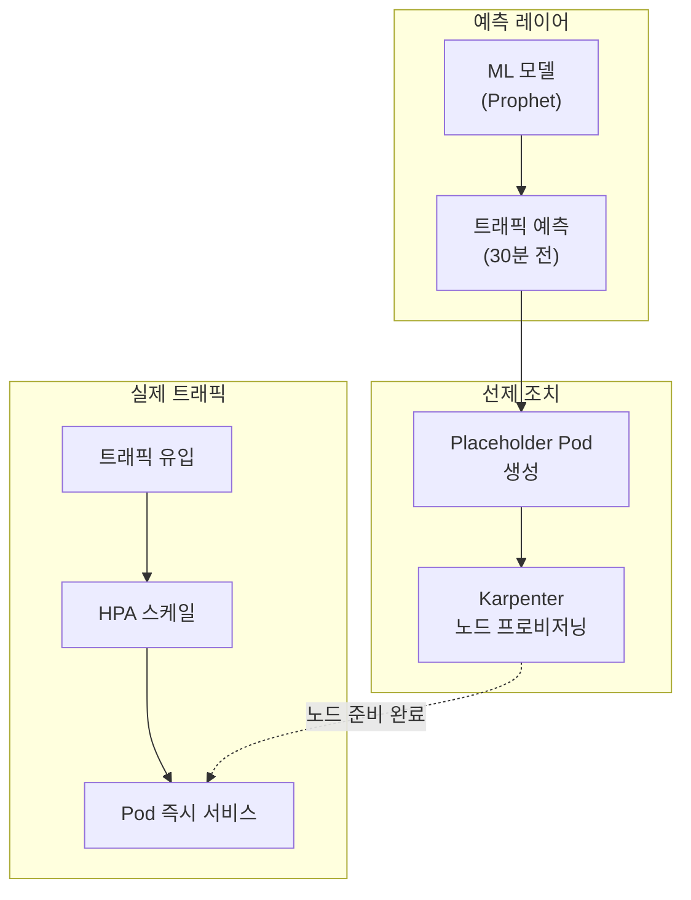
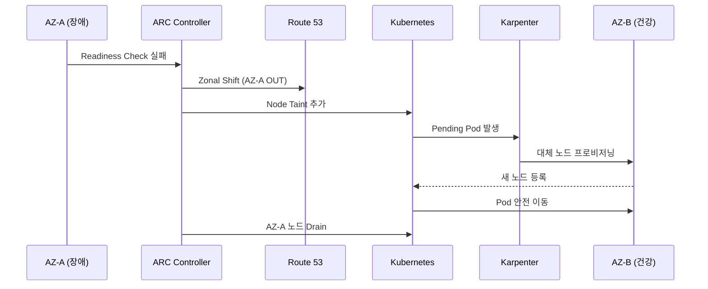
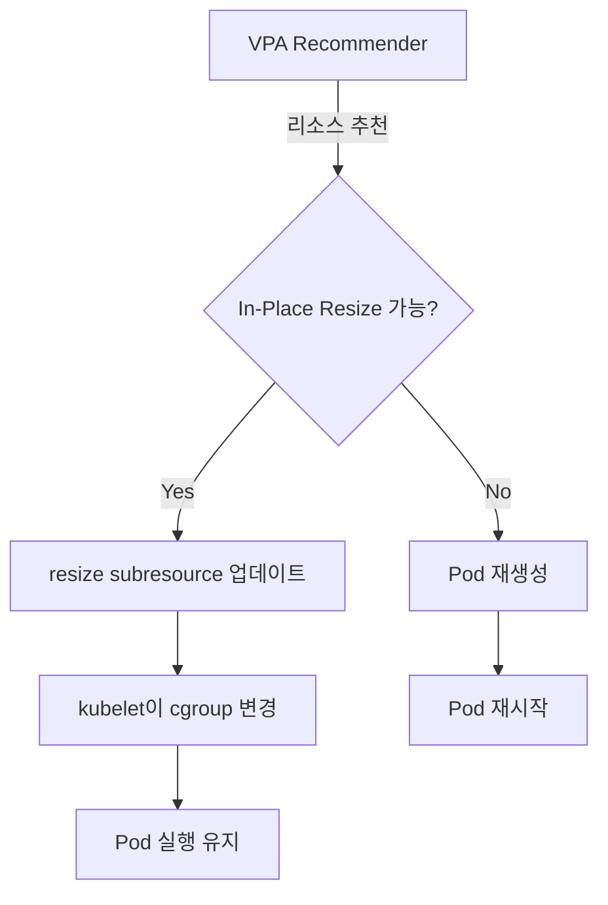

import { ScalingComparison, MLModelComparison, MaturityTable } from '@site/src/components/PredictiveOpsTables';

# 예측 운영

> **핵심**: 반응형 운영에서 예측형 운영으로 — ML 기반 예측 스케일링, 이상 감지, 자동 최적화

---

## 1. 개요

### 반응형에서 예측형으로

전통적인 EKS 운영은 **반응형**입니다. HPA는 CPU/메모리가 임계값을 초과한 **후** 스케일링을 시작하므로, 트래픽 급증 시 사용자에게 이미 영향이 발생합니다.

**예측 운영**은 ML 모델을 통해 트래픽 패턴을 학습하고, **증가 전에 미리 스케일아웃**하여 서비스 품질을 유지합니다.

```
반응형 스케일링의 문제:
  HPA 임계값 초과 → 스케일아웃 시작 → Pod 시작 30초-2분
  Karpenter 노드 프로비저닝 → 1-3분 추가 지연
  → 성능 저하 구간 발생 → 사용자 영향

예측 스케일링의 해결:
  ML 예측 (30분 전) → 사전 스케일아웃 → 실제 트래픽 도착
  → 노드/Pod 준비 완료 → 성능 저하 없음
```

### 핵심 가치

- **사용자 영향 최소화**: Cold Start 지연 제거
- **비용 효율**: 과도한 여유 리소스 확보 불필요, 필요한 시점에만 확장
- **복합 장애 대응**: 단일 메트릭이 아닌 다차원 이상 감지
- **자동 최적화**: VPA + AI로 리소스 Right-Sizing 자동화

---

## 2. ML 기반 예측 스케일링

### 2.1 HPA의 한계

HPA(Horizontal Pod Autoscaler)는 **현재 메트릭**에만 반응하므로 구조적 한계가 있습니다.

<ScalingComparison />

```
[HPA 반응형]
트래픽 ████████████████████████░░░░░░░░░
                      ↑ 임계값 초과
Pod 수  ██████████░░░░████████████████████
                  ↑ 스케일아웃 시작 (지연)
사용자   ✓✓✓✓✓✓✓✓✗✗✗✓✓✓✓✓✓✓✓✓✓✓✓✓✓✓
경험              ↑ 성능 저하 구간

[ML 예측형]
트래픽 ████████████████████████░░░░░░░░░
             ↑ 예측 시점 (30분 전)
Pod 수  ██████████████████████████████████
             ↑ 사전 스케일아웃
사용자   ✓✓✓✓✓✓✓✓✓✓✓✓✓✓✓✓✓✓✓✓✓✓✓✓✓✓
경험     (성능 저하 없음)
```

### 2.2 시계열 예측 모델

EKS 워크로드의 트래픽 패턴을 예측하는 대표적 ML 모델:

<MLModelComparison />

**모델 선택 가이드**:
- **주기성이 강한 워크로드** (일일/주간 패턴): Prophet
- **트렌드 중심**: ARIMA
- **복잡한 비선형 패턴**: LSTM

### 2.3 구현 패턴

```python
# Prophet 기반 트래픽 예측 예시
from prophet import Prophet
import pandas as pd

def predict_scaling(metrics_df, forecast_hours=2):
    """Prophet으로 향후 트래픽 예측"""
    df = metrics_df.rename(columns={'timestamp': 'ds', 'value': 'y'})
    
    model = Prophet(
        changepoint_prior_scale=0.05,
        seasonality_mode='multiplicative',
        daily_seasonality=True,
        weekly_seasonality=True
    )
    model.fit(df)
    
    future = model.make_future_dataframe(periods=forecast_hours * 12, freq='5min')
    forecast = model.predict(future)
    
    return forecast[['ds', 'yhat', 'yhat_upper', 'yhat_lower']]

def calculate_required_pods(predicted_rps, pod_capacity_rps=100):
    """예측 RPS 기반 필요 Pod 수 계산"""
    # 상한값(yhat_upper) 사용으로 안전 마진 확보
    required = int(predicted_rps / pod_capacity_rps) + 1
    return max(required, 2)
```

**자동화 패턴**:
- CronJob으로 15분마다 예측 실행
- AMP에서 최근 7일 메트릭 수집
- 예측 결과를 Prometheus Custom Metric으로 노출
- HPA 또는 KEDA가 Custom Metric 기반 스케일링

---

## 3. Karpenter + AI 예측

### 3.1 Karpenter 기본 동작

Karpenter는 Pending Pod를 감지하여 **Just-in-Time** 노드 프로비저닝을 수행합니다. 그러나 노드 시작까지 1-3분 소요됩니다.

### 3.2 AI 예측 기반 선제 프로비저닝

ML 예측과 결합하면 **노드를 미리 준비**할 수 있습니다.



**선제 프로비저닝 패턴**:

```yaml
# Placeholder Pod로 노드 선제 확보
apiVersion: apps/v1
kind: Deployment
metadata:
  name: capacity-reservation
  namespace: scaling
spec:
  replicas: 0  # 예측 스케일러가 동적 조정
  selector:
    matchLabels:
      app: capacity-reservation
  template:
    metadata:
      labels:
        app: capacity-reservation
    spec:
      priorityClassName: capacity-reservation  # 낮은 우선순위
      terminationGracePeriodSeconds: 0
      containers:
        - name: pause
          image: registry.k8s.io/pause:3.9
          resources:
            requests:
              cpu: "1"
              memory: 2Gi
---
apiVersion: scheduling.k8s.io/v1
kind: PriorityClass
metadata:
  name: capacity-reservation
value: -10  # 실제 워크로드에 의해 축출됨
globalDefault: false
description: "Karpenter 노드 선제 프로비저닝용"
```

**동작 원리**:
1. ML 모델이 30분 후 트래픽 증가를 예측
2. Placeholder Pod의 replicas를 늘림
3. Karpenter가 Pending Pod를 감지하여 노드 프로비저닝
4. 실제 트래픽 도착 시 HPA가 실제 Pod 생성
5. Placeholder Pod는 낮은 우선순위로 즉시 축출
6. 노드가 이미 준비되어 있으므로 Pod 즉시 스케줄링

### 3.3 ARC + Karpenter 통합 (AZ 장애 자동 대피)

**ARC(Application Recovery Controller)**는 AZ 장애를 자동 감지하고 트래픽을 건강한 AZ로 이동시킵니다. Karpenter와 통합하면 **노드 레벨 자동 복구**까지 가능합니다.



---

## 4. CloudWatch Anomaly Detection

### 4.1 이상 탐지 밴드

CloudWatch Anomaly Detection은 ML을 사용하여 메트릭의 **정상 범위 밴드**를 자동 학습하고, 밴드를 벗어나는 이상을 탐지합니다.

```bash
# Anomaly Detection 모델 생성
aws cloudwatch put-anomaly-detector \
  --namespace "ContainerInsights" \
  --metric-name "pod_cpu_utilization" \
  --dimensions Name=ClusterName,Value=my-cluster \
  --stat "Average"
```

### 4.2 EKS 적용 패턴

**핵심 메트릭**:
- `pod_cpu_utilization`: CPU 사용률 (정상 패턴 벗어나는 스파이크 감지)
- `pod_memory_utilization`: 메모리 누수 조기 감지
- `pod_network_rx_bytes`: 네트워크 이상 트래픽 감지
- `pod_restart_count`: 재시작 패턴 이상 감지
- `node_cpu_utilization`: 노드 레벨 병목 감지

### 4.3 Anomaly Detection 기반 알람

```bash
# Anomaly Detection 기반 CloudWatch Alarm
aws cloudwatch put-metric-alarm \
  --alarm-name "EKS-CPU-Anomaly" \
  --comparison-operator GreaterThanUpperThreshold \
  --threshold-metric-id ad1 \
  --evaluation-periods 3 \
  --metrics '[
    {
      "Id": "m1",
      "MetricStat": {
        "Metric": {
          "Namespace": "ContainerInsights",
          "MetricName": "pod_cpu_utilization",
          "Dimensions": [{"Name": "ClusterName", "Value": "my-cluster"}]
        },
        "Period": 300,
        "Stat": "Average"
      }
    },
    {
      "Id": "ad1",
      "Expression": "ANOMALY_DETECTION_BAND(m1, 2)"
    }
  ]' \
  --alarm-actions "arn:aws:sns:ap-northeast-2:ACCOUNT_ID:ops-alerts"
```

**장점**:
- 고정 임계값 대비 False Positive 대폭 감소
- 주기성 자동 학습 (일일/주간 패턴)
- 계절성 변화 자동 적응

---

## 5. AI Right-Sizing

### 5.1 Container Insights 기반 추천

CloudWatch Container Insights는 Pod의 실제 리소스 사용 패턴을 분석하여 적정 크기를 추천합니다.

```promql
# 실제 CPU 사용량 vs requests 비교
avg(rate(container_cpu_usage_seconds_total{namespace="payment"}[1h]))
  by (pod)
/ avg(kube_pod_container_resource_requests{resource="cpu", namespace="payment"})
  by (pod)
* 100

# 실제 Memory 사용량 vs requests 비교
avg(container_memory_working_set_bytes{namespace="payment"})
  by (pod)
/ avg(kube_pod_container_resource_requests{resource="memory", namespace="payment"})
  by (pod)
* 100
```

### 5.2 VPA + ML 기반 자동 Right-Sizing

```yaml
# VPA (Vertical Pod Autoscaler) 설정
apiVersion: autoscaling.k8s.io/v1
kind: VerticalPodAutoscaler
metadata:
  name: payment-service-vpa
  namespace: payment
spec:
  targetRef:
    apiVersion: apps/v1
    kind: Deployment
    name: payment-service
  updatePolicy:
    updateMode: "Auto"  # Off, Initial, Auto
  resourcePolicy:
    containerPolicies:
      - containerName: app
        minAllowed:
          cpu: 100m
          memory: 128Mi
        maxAllowed:
          cpu: "2"
          memory: 4Gi
        controlledResources: ["cpu", "memory"]
```

### 5.3 In-Place Pod Vertical Scaling (K8s 1.33+)

Kubernetes 1.33부터 **In-Place Pod Vertical Scaling**이 Beta로 진입하면서, VPA의 가장 큰 단점이었던 **Pod 재시작 문제**가 해결되었습니다.

**기존 VPA 문제**:
- Pod 리소스 변경 시 반드시 재시작 필요
- StatefulSet, DB, 캐시 등 상태 유지 워크로드에서 사용 어려움
- 재시작 중 서비스 중단 가능성

**In-Place Resize 해결**:
- 실행 중인 Pod의 리소스를 동적으로 조정
- cgroup 제한을 실시간으로 변경
- 재시작 없이 리소스 증가/감소
- QoS Class 유지 시 재시작 불필요

| Kubernetes 버전 | 상태 | Feature Gate | 비고 |
|----------------|------|--------------|------|
| 1.27 | Alpha | `InPlacePodVerticalScaling` | 실험적 |
| 1.33 | Beta | 기본 활성화 | 프로덕션 테스트 권장 |
| 1.35+ | Stable (예상) | 기본 활성화 | 프로덕션 안전 사용 |

**EKS 지원**:
- **EKS 1.33** (2026년 4월 예상): Beta 활성화 가능
- **EKS 1.35** (2026년 11월 예상): Stable 지원

**VPA 자동 In-Place Resize**:

```yaml
apiVersion: autoscaling.k8s.io/v1
kind: VerticalPodAutoscaler
metadata:
  name: payment-service-vpa
spec:
  targetRef:
    apiVersion: apps/v1
    kind: Deployment
    name: payment-service
  updatePolicy:
    updateMode: "Auto"  # In-Place Resize 지원 시 재시작 없이 조정
  resourcePolicy:
    containerPolicies:
      - containerName: app
        minAllowed:
          cpu: 100m
          memory: 128Mi
        maxAllowed:
          cpu: "4"
          memory: 8Gi
        controlledResources: ["cpu", "memory"]
        mode: Auto
```

**동작 흐름**:



**제약사항**:
- CPU는 자유롭게 resize 가능
- Memory 증가는 가능, 감소는 QoS Class 변경 시 재시작 필요
- QoS Class 변경 (Guaranteed ↔ Burstable ↔ BestEffort)은 재시작 필요

:::warning VPA 주의사항 (K8s 1.34 이하)
K8s 1.34 이하에서 VPA `Auto` 모드는 Pod를 재시작하여 리소스를 조정합니다. StatefulSet이나 재시작에 민감한 워크로드에는 `Off` 모드로 추천값만 확인하고 수동 적용을 권장합니다. VPA와 HPA를 동일 메트릭(CPU/Memory)으로 동시 사용하면 충돌이 발생할 수 있습니다.
:::

### 5.4 Right-Sizing 효과

**예상 비용 절감**:
- Over-provisioning 40-60% → 20-30%로 감소
- 연간 클러스터 비용 30-50% 절감
- 노드 Consolidation 효율 증가

---

## 6. 성숙도 모델

<MaturityTable />

**Level 0: 반응형**
- HPA/VPA 기본 설정
- 고정 임계값 기반 알람
- 수동 스케일링

**Level 1: 예측 준비**
- Container Insights 활성화
- Anomaly Detection 도입
- 메트릭 수집 7일+ 이력

**Level 2: 예측 스케일링**
- Prophet/ARIMA 기반 트래픽 예측
- Karpenter 선제 프로비저닝
- CronJob 기반 자동화

**Level 3: 자동 최적화**
- VPA Auto 모드 적용
- In-Place Resize 활용 (K8s 1.33+)
- CloudWatch Anomaly Detection 기반 자동 조치

**Level 4: 자율 운영**
- AI Agent 기반 자동 인시던트 대응
- Chaos Engineering + AI 피드백 루프
- 자율 학습 및 개선

---

## 7. 참고 자료

**관련 문서**:
- [관찰성 스택](./observability-stack.md) — 메트릭 수집 및 분석 기반
- [자율 대응](./autonomous-response.md) — AI Agent 기반 인시던트 대응
- [EKS 선언적 자동화](../toolchain/eks-declarative-automation.md) — GitOps 기반 자동화

**AWS 공식 문서**:
- [CloudWatch Anomaly Detection](https://docs.aws.amazon.com/AmazonCloudWatch/latest/monitoring/CloudWatch_Anomaly_Detection.html)
- [Karpenter Best Practices](https://aws.github.io/aws-eks-best-practices/karpenter/)
- [Container Insights](https://docs.aws.amazon.com/AmazonCloudWatch/latest/monitoring/ContainerInsights.html)
- [Application Recovery Controller](https://docs.aws.amazon.com/r53recovery/latest/dg/what-is-route53-recovery.html)

**Kubernetes 공식 문서**:
- [In-Place Pod Vertical Scaling (KEP-1287)](https://github.com/kubernetes/enhancements/tree/master/keps/sig-node/1287-in-place-update-pod-resources)
- [VPA](https://github.com/kubernetes/autoscaler/tree/master/vertical-pod-autoscaler)
