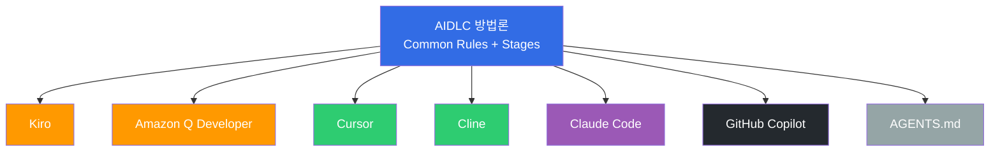

import { AiCodingAgentComparison } from '@site/src/components/AidlcTables';

# AI 코딩 에이전트

AIDLC Construction 단계에서 설계를 코드로 구현하는 AI 코딩 에이전트 전략을 다룹니다. 본 문서는 먼저 **AWS Labs AIDLC 공식 지원 7개 플랫폼**을 요약한 뒤, Kiro의 Spec-Driven 접근과 Amazon Q Developer의 실시간 빌드·테스트를 심화합니다. 그리고 MCP 기반 컨텍스트 수집, CI/CD 통합 패턴, 에이전트 선택 가이드로 마무리합니다.

## 0. 공식 AIDLC 지원 플랫폼 7종

AWS Labs [AIDLC Workflows](https://github.com/awslabs/aidlc-workflows) 는 AIDLC 방법론이 동작하는 **7개 공식 지원 플랫폼** 을 정의합니다. 각 플랫폼은 Common Rules 와 Inception/Construction 워크플로를 구현해야 하며, 산출물 포맷은 공통 규약을 따릅니다.



### 0.1 Kiro
- **AIDLC 적용**: Spec-Driven 기본 탑재. `requirements.md → design.md → tasks.md` 파일 구조가 Inception 산출물과 거의 1:1 매핑. MCP 네이티브로 AWS Hosted MCP 서버와 즉시 연동
- **강점**: Common Rules 11개 모두 Full 지원. 조직 Extension(opt-in.md) 인식. AWS 서비스(EKS, DynamoDB 등)와의 밀착 통합
- **한계**: AWS 생태계 중심이라 멀티클라우드 팀에는 제약. IDE 선택지 제한적

### 0.2 Amazon Q Developer
- **AIDLC 적용**: Construction 단계의 실시간 빌드·테스트·보안 스캔 중심. Inception 은 별도 Kiro/Claude Code 등과 조합
- **강점**: 빌드·테스트 자동 실행으로 Loss Function 즉시 작동. CodeCatalyst·GitHub Actions 통합 우수. `/transform` 으로 레거시 마이그레이션(Java, .NET) 지원
- **한계**: Inception(요구사항·설계) 단계는 다른 도구 병행 필요. 자유도 높은 실험·프로토타이핑은 Cursor 등이 더 유연

### 0.3 Cursor
- **AIDLC 적용**: 코드 컨텍스트 기반 Spec-Driven. `.cursor/rules/` 디렉터리로 Common Rules 일부 표현 가능. Composer 기능으로 multi-file 편집
- **강점**: 대규모 리팩터링·코드 이해에 강함. Apply 기능으로 제안 코드 검증 후 병합. 에디터 UX 완성도 높음
- **한계**: AIDLC Extension System 미지원 → 조직 규정은 수동 프롬프트로 보완. Audit Log 자동 생성 제한

### 0.4 Cline
- **AIDLC 적용**: VS Code Extension 기반 Autonomous Agent. CLI 중심 워크플로에 적합. Plan Mode / Act Mode 분리가 Adaptive Execution 과 잘 맞음
- **강점**: 완전 오픈소스, Bring Your Own Key(BYOK). 로컬 파일시스템·터미널 제어 자유로움. AIDLC 산출물 파일 생성·수정이 자연스러움
- **한계**: IDE 통합 UX 가 Cursor 대비 낮음. 상용 지원 부재 (커뮤니티 의존)

### 0.5 Claude Code
- **AIDLC 적용**: CLI + IDE 통합 양쪽 지원. Sub-agent 기반 복잡 태스크 분해. AGENTS.md / CLAUDE.md 로 Common Rules 표현
- **강점**: Anthropic Claude 모델 기본값. Sub-agent 로 Inception(planner) + Construction(executor) 분리 가능. MCP 생태계와 매끄러운 연동
- **한계**: Opus 모델 사용 시 비용 부담. 팀 전체 도입 시 라이선스·레이트리밋 관리 필요

### 0.6 GitHub Copilot
- **AIDLC 적용**: 코드 자동완성 중심. Copilot Chat + Workspace 로 Spec-Driven 일부 지원. Copilot Enterprise 에서 AGENTS.md 인식 확장 중
- **강점**: 가장 광범위한 IDE 지원(VS Code · JetBrains · Neovim). 대부분 개발자에게 이미 익숙. GitHub 네이티브 통합
- **한계**: AIDLC Stage Transition 이나 Checkpoint Approval 개념은 Copilot 기본 기능에 없음 — 수동 운영 필요. 프롬프트 커스터마이징 제약

### 0.7 AGENTS.md
- **AIDLC 적용**: 플랫폼이라기보다 **도구 독립 문서 규격**. `AGENTS.md` 파일로 Common Rules·Extension·Stage 규약을 평문으로 서술
- **강점**: 어떤 AI 에이전트라도 `AGENTS.md` 를 읽으면 AIDLC 규칙을 따르게 할 수 있음 (Claude Code, Cursor, Cline 모두 지원). Git 추적·Review 용이
- **한계**: 자동 실행·강제가 불가능 → 에이전트가 파일을 무시할 여지 존재. Audit/Checkpoint 는 별도 도구 필요

### 0.8 플랫폼 선택 요약표

| 플랫폼 | AIDLC Common Rules | Inception | Construction | Audit | 라이선스 | 추천 케이스 |
|--------|-------------------|-----------|--------------|-------|---------|-----------|
| Kiro | Full | Full | Full | Full | Commercial (AWS) | AWS 엔터프라이즈, 보안 민감 |
| Amazon Q Developer | Full | Partial | Full | Full | Commercial (AWS) | AWS + CI/CD 실시간 검증 |
| Cursor | Partial | Partial | Full | Manual | Commercial | 대규모 리팩터링·탐색적 개발 |
| Cline | Partial | Partial | Full | Manual | OSS (BYOK) | 비용 절감·커스터마이징 |
| Claude Code | Full | Full | Full | Partial | Commercial (Anthropic) | Sub-agent 기반 복잡 태스크 |
| GitHub Copilot | Partial | Limited | Full | Limited | Commercial (GitHub) | 폭넓은 IDE 지원·낮은 학습곡선 |
| AGENTS.md | Full (문서) | Full (문서) | Full (문서) | Manual | OSS | 도구 독립 규약 관리 |

:::tip 하이브리드 전략 권장
단일 플랫폼만 쓰는 대신, **Kiro (Inception) + Q Developer (Construction) + GitHub Copilot (개별 자동완성)** 처럼 stage 별로 최적 도구를 조합하는 **하이브리드** 가 실전에서 가장 효율적입니다. 산출물이 Markdown + YAML 로 표준화되어 있어 플랫폼 간 이동 비용이 낮습니다.
:::

## 1. AI 코딩 에이전트 개관

AIDLC Construction 단계는 Inception 단계의 산출물(요구사항, 설계, 온톨로지)을 **실행 가능한 코드와 인프라**로 변환하는 과정입니다. AI 코딩 에이전트는 이 변환을 자동화하며, 다음 역할을 수행합니다:

1. **요구사항 → 코드 변환** — 자연어 요구사항을 구조화된 명세(Spec)로 전환 후 코드 생성
2. **실시간 빌드·테스트** — 코드 생성 즉시 자동 빌드 및 테스트로 오류 조기 발견 (Loss Function)
3. **보안 스캔** — Kubernetes manifest, 애플리케이션 코드의 보안 취약점 자동 탐지 및 수정 제안
4. **CI/CD 통합** — GitHub Actions, Argo CD 등 GitOps 파이프라인과 자동 연동
5. **실시간 컨텍스트 수집** — MCP 서버를 통해 현재 인프라 상태·비용·워크로드 정보 반영

Amazon Q Developer와 Kiro는 **Anthropic Claude** 모델을 기본으로 사용하며, Kiro는 [오픈 웨이트 모델](./open-weight-models.md)도 지원하여 비용 최적화와 특수 도메인 확장이 가능합니다.

## 2. Kiro — Spec-Driven 개발

### 2.1 Spec-Driven Inception

Kiro는 Inception 단계의 산출물을 **Spec 파일**로 체계화하여, 자연어 요구사항에서 코드까지의 전체 과정을 구조화합니다.

```
requirements.md → design.md → tasks.md → 코드 생성 → 검증
```

#### EKS 예시: Payment Service 배포

**requirements.md**

```markdown
# Payment Service 배포 요구사항

## 기능 요구사항
- REST API 엔드포인트: /api/v1/payments
- DynamoDB 테이블과 연동
- SQS를 통한 비동기 이벤트 처리

## 비기능 요구사항
- P99 레이턴시: < 200ms
- 가용성: 99.95%
- 자동 스케일링: 2-20 Pod
- EKS 1.35+ 호환
```

**design.md**

```markdown
# Payment Service 아키텍처

## 인프라 구성
- EKS Deployment (3 replicas min)
- ACK DynamoDB Table (on-demand)
- ACK SQS Queue (FIFO)
- HPA (CPU 70%, Memory 80%)
- Karpenter NodePool (graviton, spot)

## 관찰성
- ADOT sidecar (traces → X-Ray)
- Application Signals (SLI/SLO 자동)
- CloudWatch Logs (/eks/payment-service)

## 보안
- Pod Identity (IRSA 대체)
- NetworkPolicy (namespace 격리)
- Secrets Manager CSI Driver
```

**tasks.md**

```markdown
# 구현 태스크

## Bolt 1: 인프라
- [ ] ACK DynamoDB Table CRD 작성
- [ ] ACK SQS Queue CRD 작성
- [ ] KRO ResourceGroup 정의 (DynamoDB + SQS 통합)
- [ ] Karpenter NodePool 설정 (graviton, spot)

## Bolt 2: 애플리케이션
- [ ] Go REST API 구현
- [ ] DynamoDB SDK 연동
- [ ] SQS consumer 구현
- [ ] Dockerfile + multi-stage build

## Bolt 3: 배포
- [ ] Helm chart 작성
- [ ] Argo CD Application 정의
- [ ] HPA manifest 작성
- [ ] NetworkPolicy 작성

## Bolt 4: 관찰성
- [ ] ADOT sidecar 설정
- [ ] Application Signals annotation
- [ ] CloudWatch 대시보드
- [ ] SLO 알림 설정
```

### 2.2 Spec-Driven vs. 디렉팅 방식

:::tip Spec-Driven의 핵심 가치
**디렉팅 방식**: "DynamoDB 만들어줘" → "SQS도 필요해" → "이제 배포해줘" → 매번 수동 지시, 맥락 유실 위험

**Spec-Driven**: Kiro가 `requirements.md`를 분석 → `design.md` 생성 → `tasks.md` 분해 → 코드 자동 생성 → 검증까지 일관된 Context Memory로 연결
:::

Spec-Driven 방식은 전체 맥락을 유지하며 요구사항 변경 시 영향 범위를 자동으로 추적할 수 있습니다. DDD(Domain-Driven Design) 통합 패턴은 [DDD 통합](../methodology/ddd-integration.md)을 참조하세요.

### 2.3 MCP 네이티브 아키텍처

Kiro는 MCP(Model Context Protocol) 네이티브로 설계되어, Inception 단계에서 AWS Hosted MCP 서버를 통해 **실시간 인프라 상태를 수집**합니다.

```
[Kiro + MCP 상호작용]

Kiro: "EKS 클러스터 상태 확인"
  → EKS MCP Server: get_cluster_status()
  → 응답: { version: "1.35", nodes: 5, status: "ACTIVE" }

Kiro: "비용 분석"
  → Cost Analysis MCP Server: analyze_cost(service="EKS")
  → 응답: { monthly: "$450", recommendations: [...] }

Kiro: "현재 워크로드 분석"
  → EKS MCP Server: list_deployments(namespace="payment")
  → 응답: { deployments: [...], resource_usage: {...} }
```

이를 통해 `design.md` 생성 시 **현재 클러스터 상태와 비용을 반영한 설계**가 가능합니다. MCP 통합 아키텍처의 상세는 AIDLC MCP 전략 문서를 참조하세요.

### 2.4 오픈 웨이트 모델 지원

Kiro는 Claude 외에 오픈 웨이트 모델(Llama 3.1 405B, Mixtral 8x22B, DeepSeek R1 등)을 지원하여 다음 이점을 제공합니다:

- **비용 최적화** — 단순 코드 생성 태스크는 소형 모델로 처리 (토큰 비용 1/10)
- **특수 도메인 확장** — 금융, 의료 등 도메인별 파인튜닝 모델 활용
- **온프레미스 배포** — 민감 데이터를 외부로 전송하지 않고 EKS 클러스터 내에서 추론

오픈 웨이트 모델 배포 전략은 [오픈 웨이트 모델](./open-weight-models.md)을 참조하세요.

## 3. Amazon Q Developer — 실시간 빌드 및 테스트

AWS는 2025년 2월 **Amazon Q Developer의 실시간 코드 실행 기능**을 발표했습니다. 이는 AI가 코드를 생성한 후 **자동으로 빌드하고 테스트를 실행하여 결과를 검증**한 뒤 개발자에게 제시하는 혁신적 접근입니다.

AIDLC Construction 단계에서 **Loss Function을 조기에 작동**시켜 오류를 하류로 전파하지 않는 핵심 메커니즘입니다.

### 3.1 실시간 코드 실행 메커니즘

전통적인 AI 코딩 도구는 코드를 생성한 후 개발자가 수동으로 빌드·테스트해야 했습니다. Q Developer는 이 과정을 자동화합니다.

```
기존 방식:
  AI 코드 생성 → 개발자 수동 빌드 → 개발자 수동 테스트 → 오류 발견 → AI에게 피드백 → 재생성
  (반복 주기: 5-10분)

Q Developer 실시간 실행:
  AI 코드 생성 → 자동 빌드 → 자동 테스트 → 결과 검증 → (오류 시 자동 수정 재시도) → 개발자 리뷰
  (반복 주기: 1-2분, 개발자 개입 최소화)
```

**핵심 메커니즘**

1. **자동 빌드 파이프라인**
   - 프로젝트의 빌드 도구(Maven, Gradle, npm, pip 등)를 자동 실행
   - 컴파일 오류, 의존성 충돌을 즉시 감지
   - 빌드 실패 시 오류 메시지를 분석하여 자동으로 코드 수정 재시도

2. **테스트 자동 실행**
   - 유닛 테스트, 통합 테스트를 자동으로 실행
   - 테스트 실패 시 실패 원인을 분석하여 코드 또는 테스트를 수정
   - 기존 테스트 커버리지를 유지하며 새 코드 추가

3. **개발자 리뷰 전 검증**
   - 개발자가 코드를 받을 때 **이미 빌드와 테스트가 통과한 상태**
   - 개발자는 비즈니스 로직과 설계 검토에 집중 (Loss Function 역할)
   - "코드가 작동하는가?"가 아닌 "올바른 코드인가?"를 검증

### 3.2 보안 스캔 자동 수정

Q Developer는 Kubernetes YAML 및 애플리케이션 코드의 보안 취약점을 자동으로 스캔하고 수정 제안을 제공합니다.

**Kubernetes YAML 보안 스캔**

1. **Root 권한 감지** — `runAsUser: 0` 또는 `runAsNonRoot: false` 탐지, `runAsUser: 1000`, `runAsNonRoot: true` 제안
2. **Privileged 컨테이너 감지** — `securityContext.privileged: true` 탐지, 필요한 capabilities만 명시적으로 추가 제안
3. **미설정 securityContext 감지** — Pod/Container에 `securityContext`가 없는 경우 최소 권한 원칙에 따른 설정 제안

**자동 수정 제안 예시**

```yaml
# Q Developer가 감지한 문제
apiVersion: v1
kind: Pod
metadata:
  name: payment-pod
spec:
  containers:
    - name: payment
      image: payment:v1
      securityContext:
        runAsUser: 0  # ⚠️ Root 권한 사용
        privileged: true  # ⚠️ Privileged 모드

# Q Developer가 제안하는 수정
apiVersion: v1
kind: Pod
metadata:
  name: payment-pod
spec:
  securityContext:
    runAsNonRoot: true
    runAsUser: 1000
    fsGroup: 1000
    seccompProfile:
      type: RuntimeDefault
  containers:
    - name: payment
      image: payment:v1
      securityContext:
        allowPrivilegeEscalation: false
        readOnlyRootFilesystem: true
        capabilities:
          drop:
            - ALL
          add:
            - NET_BIND_SERVICE  # 필요한 capabilities만 추가
```

### 3.3 피드백 루프 단축 효과

```
전통적 Construction 단계:
  [개발자] 코드 작성 (30분)
    → [개발자] 수동 빌드 (2분)
    → [개발자] 수동 테스트 (5분)
    → [개발자] 오류 발견 (10분 디버깅)
    → [개발자] 코드 수정 (20분)
    → 반복...
  총 소요 시간: 2-3시간

Q Developer 실시간 실행:
  [AI] 코드 생성 (1분)
    → [AI] 자동 빌드·테스트 (30초)
    → [AI] 오류 감지 및 자동 수정 (1분)
    → [개발자] Loss Function 검증 (10분)
    → [Argo CD] 자동 배포
  총 소요 시간: 15-20분
```

:::tip AIDLC에서 Q Developer의 가치
Q Developer의 실시간 실행은 AIDLC의 핵심 원칙인 **"Minimize Stages, Maximize Flow"**를 구현합니다. 코드 생성 → 빌드 → 테스트 → 검증의 각 단계를 자동화하여 핸드오프를 제거하고, 개발자는 **의사결정(Loss Function)**에만 집중합니다. 이것이 기존 SDLC의 주/월 단위 주기를 AIDLC의 시간/일 단위 주기로 단축하는 핵심 메커니즘입니다.
:::

## 4. AI 코딩 에이전트 비교

<AiCodingAgentComparison />

## 5. MCP 기반 실시간 컨텍스트 수집

Kiro는 MCP 네이티브 아키텍처로, Construction 단계에서 AWS Hosted MCP 서버를 통해 **실시간 인프라 상태를 수집**하여 설계에 반영합니다.

### 5.1 AWS Hosted MCP 서버 활용

**EKS MCP Server**

```typescript
// Kiro가 EKS 클러스터 상태를 실시간 조회
const cluster = await mcp.call('eks-mcp-server', 'get_cluster_status', {
  clusterName: 'prod-eks'
});

// 응답: { version: "1.35", nodes: 5, status: "ACTIVE", capacityType: "SPOT" }
// → design.md 생성 시 현재 클러스터 버전 반영
```

**Cost Analysis MCP Server**

```typescript
// 비용 분석으로 설계 최적화
const cost = await mcp.call('cost-analysis-mcp', 'analyze_cost', {
  service: 'EKS',
  timeRange: 'last_30_days'
});

// 응답: { monthly: "$450", recommendations: ["Use Spot for dev clusters", "Enable Karpenter consolidation"] }
// → design.md에 비용 최적화 전략 반영
```

**Workload MCP Server**

```typescript
// 현재 워크로드 분석으로 리소스 할당 결정
const workload = await mcp.call('eks-mcp-server', 'list_deployments', {
  namespace: 'payment'
});

// 응답: { deployments: [...], resource_usage: { cpu: "60%", memory: "75%" } }
// → HPA 임계값과 NodePool 설정 결정에 활용
```

### 5.2 MCP 통합 이점

1. **맥락 기반 설계** — 현재 인프라 상태를 반영한 현실적인 설계 생성
2. **비용 최적화** — 실제 사용 패턴을 분석하여 Spot, Graviton 등 비용 절감 전략 자동 제안
3. **리소스 효율** — 현재 워크로드 상태를 기반으로 HPA, Karpenter 설정 최적화
4. **일관성 보장** — 실시간 데이터로 설계와 현실 간 괴리 최소화

## 6. CI/CD 통합

AI 코딩 에이전트를 CI/CD 파이프라인에 통합하여 **Quality Gate 자동화**를 구현합니다.

### 6.1 GitHub Actions 통합

```yaml
# .github/workflows/aidlc-construction.yml
name: AIDLC Construction Quality Gate
on:
  pull_request:
    types: [opened, synchronize]

jobs:
  q-developer-validation:
    runs-on: ubuntu-latest
    steps:
      - uses: actions/checkout@v4

      # 1. Q Developer 보안 스캔
      - name: Q Developer Security Scan
        uses: aws/amazon-q-developer-action@v1
        with:
          scan-type: security
          source-path: .
          auto-fix: true  # 자동 수정 제안 적용

      # 2. 실시간 빌드 및 테스트
      - name: Q Developer Build & Test
        uses: aws/amazon-q-developer-action@v1
        with:
          action: build-and-test
          test-coverage-threshold: 80

      # 3. Kubernetes manifest 검증
      - name: K8s Manifest Security Check
        run: |
          kube-linter lint deploy/ --config .kube-linter.yaml

      # 4. 통과 시에만 Argo CD 동기화 허용
      - name: Approve for GitOps
        if: success()
        run: echo "Quality Gate passed. Ready for Argo CD sync."
```

### 6.2 Argo CD 통합

```yaml
apiVersion: argoproj.io/v1alpha1
kind: Application
metadata:
  name: payment-service
  namespace: argocd
spec:
  project: default
  source:
    repoURL: https://github.com/org/payment-service
    targetRevision: main
    path: deploy/
  destination:
    server: https://kubernetes.default.svc
    namespace: payment
  syncPolicy:
    automated:
      prune: true
      selfHeal: true
    syncOptions:
      - CreateNamespace=true
    # Quality Gate 통과 시에만 동기화
    retry:
      limit: 3
      backoff:
        duration: 5s
        factor: 2
        maxDuration: 3m
```

### 6.3 Quality Gate 워크플로우

1. **PR 생성** — 개발자가 Kiro 생성 코드를 PR로 제출
2. **보안 스캔** — Q Developer가 Kubernetes manifest, 애플리케이션 코드 스캔
3. **빌드·테스트** — Q Developer가 자동 빌드 및 테스트 실행
4. **검증 통과** — 모든 검사 통과 시 Argo CD가 자동 동기화
5. **배포 완료** — EKS 클러스터에 배포, Application Signals 자동 활성화

이 워크플로우는 [하네스 엔지니어링](../methodology/harness-engineering.md)의 핵심 구현 패턴입니다.

## 7. 에이전트 선택 가이드

프로젝트 특성별 AI 코딩 에이전트 선택 기준입니다.

### 7.1 프로젝트 규모별

| 프로젝트 규모 | 권장 에이전트 | 이유 |
|--------------|--------------|------|
| 소규모 (1-5 마이크로서비스) | Amazon Q Developer | IDE 통합, 빠른 피드백, 보안 스캔 |
| 중규모 (5-20 마이크로서비스) | Kiro + Q Developer | Spec-Driven 일관성, Q Developer 실시간 검증 |
| 대규모 (20+ 마이크로서비스) | Kiro + 오픈 웨이트 모델 | 비용 최적화, 도메인 특화 모델 활용 |

### 7.2 도메인별

| 도메인 | 권장 에이전트 | 이유 |
|--------|--------------|------|
| 일반 웹 애플리케이션 | Amazon Q Developer | 범용 언어·프레임워크 지원, 빠른 프로토타이핑 |
| EKS 인프라 자동화 | Kiro + MCP | 실시간 클러스터 상태 반영, ACK/KRO 통합 |
| 금융·의료 특수 도메인 | Kiro + 파인튜닝 오픈 모델 | 도메인 규제 준수, 온프레미스 배포 |
| 레거시 마이그레이션 | Amazon Q Developer `/transform` | Java 8→17, .NET Framework→Core 자동 변환 |

### 7.3 팀 성숙도별

| 팀 성숙도 | 권장 에이전트 | 이유 |
|----------|--------------|------|
| AI 도구 첫 도입 | Amazon Q Developer | IDE 통합, 낮은 학습 곡선, AWS 공식 지원 |
| DevOps 숙련 팀 | Kiro + Q Developer | Spec-Driven 구조화, CI/CD 자동화, MCP 활용 |
| AI 플랫폼 운영 팀 | Kiro + 오픈 웨이트 모델 | 맞춤형 모델 배포, 비용 최적화, 특수 요구사항 대응 |

### 7.4 비용 고려사항

| 월 요청량 | 권장 전략 | 예상 비용 |
|----------|----------|----------|
| < 10,000 요청 | Amazon Q Developer 단독 | ~$50-100 |
| 10,000 - 100,000 요청 | Kiro + Claude (단순 태스크는 소형 모델) | ~$200-500 |
| > 100,000 요청 | Kiro + 오픈 웨이트 모델 (EKS 자체 호스팅) | ~$100-300 (인프라 비용) |

## 8. 실전 적용 패턴

### 8.1 하이브리드 전략

대부분의 팀은 **Amazon Q Developer + Kiro 하이브리드**가 최적입니다:

1. **개발 초기** — Q Developer로 빠른 프로토타이핑, 실시간 피드백
2. **설계 확정 후** — Kiro Spec-Driven으로 일관성 있는 구현
3. **보안 검증** — Q Developer 자동 스캔으로 취약점 조기 발견
4. **배포 자동화** — Kiro MCP로 현재 클러스터 상태 반영한 배포 설정

### 8.2 온톨로지 기반 코드 생성

Inception 단계에서 구축한 온톨로지를 Kiro에게 제공하면, **도메인 용어와 관계를 반영한 코드**를 생성합니다:

```markdown
# ontology.md (Kiro에게 제공)

## 도메인 모델
- Payment (결제) → Order (주문) → Customer (고객)
- Payment.status: [pending, completed, failed]
- Payment.method: [card, bank_transfer, wallet]

## 비즈니스 규칙
- Payment 생성 시 Order.status가 "confirmed"여야 함
- Payment.amount는 Order.total_amount와 일치해야 함
- Payment 실패 시 SQS 재시도 큐로 전송 (max 3회)
```

Kiro는 이 온톨로지를 기반으로 `design.md`와 코드를 생성하며, 도메인 용어의 일관성을 보장합니다.

### 8.3 지속적 학습

AI 코딩 에이전트는 팀의 코드 리뷰 피드백을 학습하여 점진적으로 개선됩니다:

1. **코드 리뷰 피드백** — PR 코멘트를 통해 팀의 코딩 컨벤션 학습
2. **온톨로지 업데이트** — 새로운 도메인 개념이 추가되면 `ontology.md` 갱신
3. **MCP 서버 확장** — 새로운 인프라 서비스가 추가되면 MCP 서버 통합
4. **파인튜닝** — 팀 코드베이스로 오픈 웨이트 모델 파인튜닝 (선택적)

## 참고 자료

- [AWS DevOps Blog: Enhancing Code Generation with Real-Time Execution in Amazon Q Developer](https://aws.amazon.com/blogs/devops/enhancing-code-generation-with-real-time-execution-in-amazon-q-developer/) (2025-02-06)
- [Amazon Q Developer 공식 문서](https://docs.aws.amazon.com/amazonq/latest/qdeveloper-ug/)
- [Model Context Protocol (MCP) 명세](https://modelcontextprotocol.io/)
- [오픈 웨이트 모델 배포 가이드](./open-weight-models.md)
- [DDD 통합](../methodology/ddd-integration.md)
- [하네스 엔지니어링](../methodology/harness-engineering.md)
