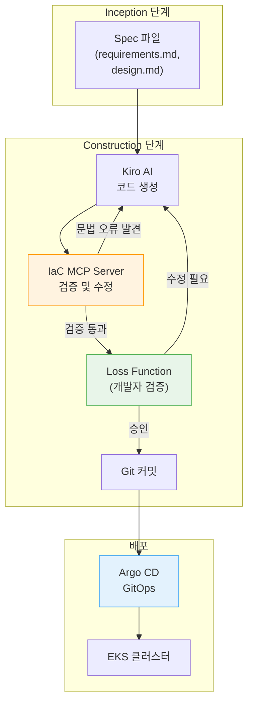

import { EksCapabilities, AidlcPipeline } from '@site/src/components/AidlcTables';

# EKS 선언적 자동화

EKS Capabilities(2025.11)는 인기 있는 오픈소스 도구를 AWS 관리형으로 제공하여, AIDLC Construction 단계의 산출물을 선언적으로 배포하고 Operations 단계에서 지속적으로 관리하는 핵심 인프라입니다.

<EksCapabilities />

## 1. EKS Capabilities 개관

EKS Capabilities는 다음 5가지 관리형 서비스로 구성됩니다:

1. **Managed Argo CD** — GitOps 기반 지속적 배포
2. **ACK (AWS Controllers for Kubernetes)** — AWS 리소스를 K8s CRD로 관리
3. **KRO (Kubernetes Resource Orchestrator)** — 복합 리소스를 단일 배포 단위로 오케스트레이션
4. **Gateway API (LBC v3)** — L4/L7 트래픽 라우팅 및 고급 네트워킹
5. **Node Readiness Controller** — 선언적 노드 준비 상태 관리

이들 도구는 Kiro가 생성한 코드를 Git에 푸시하면 자동으로 EKS에 배포되고, Operations 단계에서 AI Agent가 모니터링·자동 대응하는 전체 파이프라인을 구성합니다.

---

## 2. Managed Argo CD — GitOps 패턴

Managed Argo CD는 GitOps를 AWS 인프라에서 관리형으로 운영합니다. Kiro가 생성한 코드를 Git에 푸시하면 자동으로 EKS에 배포됩니다.

### 핵심 개념

- **Application CRD**: 단일 환경(예: production) 배포 선언
- **ApplicationSet**: 멀티 환경(dev/staging/production) 자동 생성
- **Self-healing**: Git 상태와 클러스터 상태 불일치 시 자동 동기화
- **Progressive Delivery**: 카나리/블루-그린 배포 자동화

### AIDLC 통합

| 단계 | 역할 |
|------|------|
| **Construction** | Kiro가 생성한 Helm chart/Kustomize를 Git 커밋 → Argo CD 자동 배포 |
| **Operations** | AI Agent가 배포 상태 모니터링, SLO 위반 시 자동 롤백 트리거 |

### 참고 자료

- [EKS User Guide: Managed Argo CD](https://docs.aws.amazon.com/eks/latest/userguide/eks-capabilities-argocd.html)
- [Argo CD Best Practices](https://argo-cd.readthedocs.io/en/stable/operator-manual/declarative-setup/)

---

## 3. ACK — AWS 리소스 CRD 관리

ACK는 50+ AWS 서비스를 K8s CRD로 선언적으로 관리합니다. Kiro가 생성한 Domain Design의 인프라 요소(DynamoDB, SQS, S3 등)를 `kubectl apply`로 배포하며, Argo CD의 GitOps 워크플로우에 자연스럽게 통합됩니다.

### 핵심 가치

ACK를 사용하면 **클러스터 외부의 AWS 리소스도 K8s 선언적 모델로 관리**할 수 있습니다. DynamoDB, SQS, S3, RDS 등을 K8s CRD로 생성/수정/삭제하며, 이것이 "K8s를 중심으로 모든 인프라를 선언적으로 관리"하는 전략입니다.

### AIDLC 통합

- **Inception**: [DDD 통합](../methodology/ddd-integration.md)에서 도메인 경계 분석 → ACK 리소스 필요성 식별
- **Construction**: Kiro가 ACK CRD manifest 자동 생성
- **Operations**: [관찰성 스택](../operations/observability-stack.md)에서 ACK 리소스 상태 모니터링

### 참고 자료

- [AWS Controllers for Kubernetes (ACK)](https://aws-controllers-k8s.github.io/community/)
- [EKS Best Practices: ACK](https://aws.github.io/aws-eks-best-practices/security/docs/ack/)

---

## 4. KRO — ResourceGroup 오케스트레이션

KRO는 여러 K8s 리소스를 **단일 배포 단위(ResourceGroup)**로 묶습니다. AIDLC의 Deployment Unit 개념과 직접 매핑되어, Deployment + Service + HPA + ACK 리소스를 하나의 Custom Resource로 생성합니다.

### 핵심 개념

- **ResourceGroup**: 논리적 배포 단위 정의 (예: Payment Service = Deployment + Service + DynamoDB Table)
- **Dependencies**: 리소스 간 종속성 자동 관리 (예: Deployment는 DynamoDB Table 생성 후 시작)
- **Rollback**: ResourceGroup 단위로 원자적 롤백

### DDD Aggregate와의 매핑

| DDD 개념 | KRO 구현 |
|----------|----------|
| Aggregate Root | ResourceGroup CRD |
| Entity | Deployment, StatefulSet |
| Value Object | ConfigMap, Secret |
| Repository | ACK DynamoDB/RDS CRD |

### 참고 자료

- [Kubernetes Resource Orchestrator (KRO)](https://github.com/awslabs/kro)
- [EKS Best Practices: KRO](https://aws.github.io/aws-eks-best-practices/scalability/docs/kro/)

---

## 5. Gateway API — L4/L7 트래픽 라우팅

AWS Load Balancer Controller v3는 Gateway API를 GA로 전환하며 L4(NLB) + L7(ALB) 라우팅, QUIC/HTTP3, JWT 검증, 헤더 변환을 제공합니다.

### Gateway API 설계 철학

Gateway API는 역할 지향적(role-oriented) 설계로 인프라 운영자, 클러스터 운영자, 애플리케이션 개발자가 각자의 책임 범위에서 트래픽을 관리할 수 있게 합니다.

| 리소스 | 소유자 | 책임 |
|--------|--------|------|
| **GatewayClass** | 인프라 운영자 | 로드밸런서 유형(ALB/NLB) 정의 |
| **Gateway** | 클러스터 운영자 | 리스너(포트, TLS) 정의, 네임스페이스 접근 제어 |
| **HTTPRoute/GRPCRoute** | 애플리케이션 개발자 | 경로 기반 라우팅, 카나리 배포, 헤더 변환 |

### 지원 기능 (LBC v2.14+)

1. **L4 Routes** (NLB, v2.13.3+)
   - TCPRoute, UDPRoute, TLSRoute
   - SNI 기반 TLS 라우팅, QUIC/HTTP3 지원

2. **L7 Routes** (ALB, v2.14.0+)
   - HTTPRoute: 경로/헤더/쿼리 기반 라우팅
   - GRPCRoute: gRPC 메서드 기반 라우팅

3. **고급 기능** (Gateway API v1.4)
   - JWT 검증 (Gateway 레벨)
   - 헤더 변환 (RequestHeaderModifier, ResponseHeaderModifier)
   - 가중치 기반 카나리 배포

### YAML 예시 (3-resource 분리 패턴)

```yaml
# GatewayClass — 인프라 운영자가 정의
apiVersion: gateway.networking.k8s.io/v1
kind: GatewayClass
metadata:
  name: aws-alb
spec:
  controllerName: gateway.alb.aws.amazon.com/controller
---
# Gateway — 클러스터 운영자가 정의
apiVersion: gateway.networking.k8s.io/v1
kind: Gateway
metadata:
  name: payment-gateway
  namespace: production
spec:
  gatewayClassName: aws-alb
  listeners:
    - name: https
      protocol: HTTPS
      port: 443
---
# HTTPRoute — 애플리케이션 개발자가 정의
apiVersion: gateway.networking.k8s.io/v1
kind: HTTPRoute
metadata:
  name: payment-api-route
  namespace: production
spec:
  parentRefs:
    - name: payment-gateway
  rules:
    - matches:
        - path:
            type: PathPrefix
            value: /api/v1/payments
      backendRefs:
        - name: payment-service-v1
          port: 8080
          weight: 90  # 카나리 배포: v1 90%
        - name: payment-service-v2
          port: 8080
          weight: 10  # v2 10%
```

### AIDLC Construction 단계에서의 활용

1. **Kiro Spec에서 API 라우팅 요구사항 정의**
   - `requirements.md`에서 "카나리 배포로 10% 트래픽을 v2로 라우팅" 같은 요구사항 명시
   - Kiro가 HTTPRoute manifest를 자동 생성

2. **GitOps 워크플로우로 선언적 배포**
   - Git 커밋 한 번으로 Gateway, HTTPRoute를 배포
   - Argo CD가 변경 사항을 자동으로 EKS에 동기화
   - LBC가 ALB/NLB를 프로비저닝하고 라우팅 규칙 적용

3. **Operations 단계와의 통합**
   - CloudWatch Application Signals로 각 버전의 SLO 모니터링
   - AI Agent가 SLO 위반 시 자동으로 HTTPRoute weight를 조정하여 롤백

### Gateway API vs Ingress

**Ingress**는 단일 리소스에 모든 라우팅 규칙을 정의하여, 인프라 운영자와 개발자의 책임이 혼재됩니다. **Gateway API**는 GatewayClass(인프라), Gateway(클러스터), HTTPRoute(애플리케이션)로 역할을 분리하여, 각 팀이 독립적으로 작업할 수 있습니다. AIDLC의 **Loss Function** 개념과 일치 — 각 레이어에서 검증하여 오류 전파를 방지합니다.

### 참고 자료

- [Kubernetes Gateway API v1.4 Release](https://kubernetes.io/blog/2025/11/06/gateway-api-v1-4/) (2025-11-06)
- [AWS Load Balancer Controller — Gateway API Docs](https://kubernetes-sigs.github.io/aws-load-balancer-controller/latest/guide/gateway/gateway/)
- [Kubernetes Gateway API in Action (AWS Blog)](https://aws.amazon.com/blogs/containers/kubernetes-gateway-api-in-action/)

---

## 6. Node Readiness Controller — 선언적 노드 준비 관리

**Node Readiness Controller(NRC)**는 Kubernetes 노드가 워크로드를 수용하기 전에 충족해야 할 조건을 선언적으로 정의하는 컨트롤러입니다. 이는 AIDLC Construction 단계에서 인프라 요구사항을 코드로 표현하고, GitOps를 통해 자동으로 적용하는 핵심 도구입니다.

### 핵심 개념

NRC는 `NodeReadinessRule` CRD를 통해 노드가 "Ready" 상태로 전환되기 전에 만족해야 할 조건을 정의합니다. 전통적으로 노드 준비 상태는 kubelet이 자동으로 결정했지만, NRC를 사용하면 **애플리케이션별 요구사항을 인프라 레이어에 선언적으로 주입**할 수 있습니다.

- **선언적 정책**: `NodeReadinessRule`로 노드 준비 조건을 YAML로 정의
- **GitOps 호환**: Argo CD를 통해 노드 readiness 정책을 버전 관리하고 자동 배포
- **워크로드 보호**: 필수 데몬셋(CNI, CSI, 보안 에이전트)이 준비될 때까지 스케줄링 차단

### AIDLC 각 단계에서의 활용

| 단계 | NRC 역할 | 예시 |
|------|----------|------|
| **Inception** | AI가 워크로드 요구사항 분석 → 필요한 NodeReadinessRule 자동 정의 | "GPU 워크로드는 NVIDIA device plugin이 준비된 후에만 스케줄링" |
| **Construction** | NRC 규칙을 Helm chart에 포함, Terraform EKS Blueprints AddOn으로 배포 | Kiro가 `NodeReadinessRule` manifest 자동 생성 |
| **Operations** | NRC가 런타임에 노드 readiness를 자동 관리, AI가 규칙 효과 분석 | CloudWatch Application Signals로 노드 준비 지연 시간 추적 |

### Infrastructure as Code 관점

NRC는 AIDLC의 "인프라를 코드로, 인프라도 테스트" 원칙을 노드 수준까지 확장합니다.

1. **GitOps 기반 정책 관리**
   - `NodeReadinessRule` CRD를 Git 리포지토리에 저장
   - Argo CD가 자동으로 EKS 클러스터에 동기화
   - 정책 변경 시 Git 커밋 한 번으로 전체 클러스터에 적용

2. **Kiro + MCP 자동화**
   - Kiro가 Inception 단계의 `design.md`에서 워크로드 요구사항 파싱
   - [AI 코딩 에이전트](./ai-coding-agents.md)가 현재 클러스터의 데몬셋 상태 확인
   - 필요한 `NodeReadinessRule`을 자동 생성하여 IaC 리포지토리에 추가

### YAML 예시: GPU 워크로드용 NodeReadinessRule

```yaml
apiVersion: node.k8s.io/v1alpha1
kind: NodeReadinessRule
metadata:
  name: gpu-node-readiness
  namespace: kube-system
spec:
  # GPU 노드에만 적용
  nodeSelector:
    matchLabels:
      node.kubernetes.io/instance-type: p4d.24xlarge
  # 다음 데몬셋이 모두 Ready 상태일 때까지 노드를 Ready로 전환하지 않음
  requiredDaemonSets:
    - name: nvidia-device-plugin-daemonset
      namespace: kube-system
    - name: gpu-feature-discovery
      namespace: kube-system
    - name: dcgm-exporter
      namespace: monitoring
  # 타임아웃: 10분 내에 조건이 충족되지 않으면 노드를 NotReady로 유지
  timeout: 10m
```

### 실전 사용 사례

| 시나리오 | NRC 규칙 | 효과 |
|----------|----------|------|
| **Cilium CNI 클러스터** | Cilium agent가 Ready일 때까지 대기 | 네트워크 초기화 전 Pod 스케줄링 방지 |
| **GPU 클러스터** | NVIDIA device plugin + DCGM exporter 준비 대기 | GPU 리소스 노출 전 워크로드 스케줄링 차단 |
| **보안 강화 환경** | Falco, OPA Gatekeeper 준비 대기 | 보안 정책 적용 전 워크로드 실행 방지 |
| **스토리지 워크로드** | EBS CSI driver + snapshot controller 준비 대기 | 볼륨 마운트 실패 방지 |

### 참고 자료

- [Kubernetes Blog: Introducing Node Readiness Controller](https://kubernetes.io/blog/2026/02/03/introducing-node-readiness-controller/) (2026-02-03)
- [Node Readiness Controller GitHub Repository](https://github.com/kubernetes-sigs/node-readiness-controller)

---

## 7. MCP 기반 IaC 자동화

AWS는 2025년 11월 28일 **AWS Infrastructure as Code (IaC) MCP Server**를 발표했습니다. 이는 Kiro CLI와 같은 AI 도구에서 CloudFormation 및 CDK 문서를 검색하고, 템플릿을 자동 검증하며, 배포 트러블슈팅을 AI가 지원하는 프로그래머틱 인터페이스입니다.

### AWS IaC MCP Server 개요

AWS IaC MCP Server는 Model Context Protocol을 통해 다음 기능을 제공합니다:

- **문서 검색**: CloudFormation 리소스 타입, CDK 구문, 모범 사례를 실시간으로 검색
- **템플릿 검증**: IaC 템플릿의 문법 오류를 자동으로 탐지하고 수정 제안
- **배포 트러블슈팅**: 스택 배포 실패 시 근본 원인을 분석하고 해결 방법 제시
- **프로그래머틱 접근**: Kiro, Amazon Q Developer 등 AI 도구와 네이티브 통합

### AIDLC Construction 단계 통합

1. **Kiro Spec → IaC 코드 생성 검증**
   - Inception 단계에서 생성된 `design.md`를 기반으로 Kiro가 CDK/Terraform/Helm 코드를 생성
   - IaC MCP Server가 생성된 코드의 문법, 리소스 제약, 보안 정책 준수를 자동 검증
   - CloudFormation 템플릿의 경우 리소스 타입 오타, 순환 종속성, 잘못된 속성을 사전 감지

2. **기존 인프라와의 호환성 사전 검증**
   - EKS MCP Server, Cost Analysis MCP와 통합하여 현재 클러스터 상태를 분석
   - 새로운 IaC 코드가 기존 리소스(VPC, 서브넷, 보안 그룹)와 충돌하지 않는지 검증

3. **Loss Function으로서의 역할**
   - 잘못된 IaC 코드가 프로덕션에 배포되기 전에 차단
   - [DDD 통합](../methodology/ddd-integration.md)에서 정의한 도메인 경계와 인프라 요구사항 일치성 검증

### 참고 자료

- [AWS DevOps Blog: Introducing the AWS IaC MCP Server](https://aws.amazon.com/blogs/devops/introducing-the-aws-infrastructure-as-code-mcp-server-ai-powered-cdk-and-cloudformation-assistance/) (2025-11-28)

---

## 8. AIDLC 파이프라인 통합

EKS Capabilities가 결합되면, Kiro가 Spec에서 생성한 모든 산출물을 **Git Push 한 번으로 전체 스택 배포**가 가능합니다. 이것이 Construction → Operations 전환의 핵심입니다.

<AidlcPipeline />

### 통합 흐름



### 핵심 원칙

1. **선언적**: 모든 인프라·애플리케이션·네트워킹 설정을 YAML/HCL로 정의
2. **GitOps**: Git을 단일 진실 공급원(Single Source of Truth)으로 사용
3. **자동화**: Kiro + MCP + Argo CD로 수동 개입 최소화
4. **검증**: Loss Function이 각 단계에서 오류 조기 포착

---

## 요약

EKS Capabilities는 AIDLC의 Construction/Operations 단계를 선언적으로 자동화하는 핵심 인프라입니다:

- **Managed Argo CD**: GitOps 기반 지속적 배포
- **ACK**: AWS 리소스를 K8s CRD로 관리
- **KRO**: 복합 리소스를 단일 배포 단위로 오케스트레이션
- **Gateway API**: 역할 분리 기반 트래픽 라우팅, AIDLC Loss Function과 일치
- **Node Readiness Controller**: 선언적 노드 준비 상태 관리
- **IaC MCP Server**: AI 기반 IaC 코드 검증 및 트러블슈팅

이들 도구는 Kiro가 생성한 코드를 Git Push 한 번으로 전체 스택 배포하고, AI Agent가 Operations 단계에서 자동으로 모니터링·대응하는 전체 파이프라인을 구성합니다.
