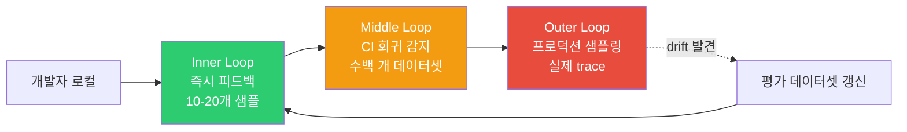
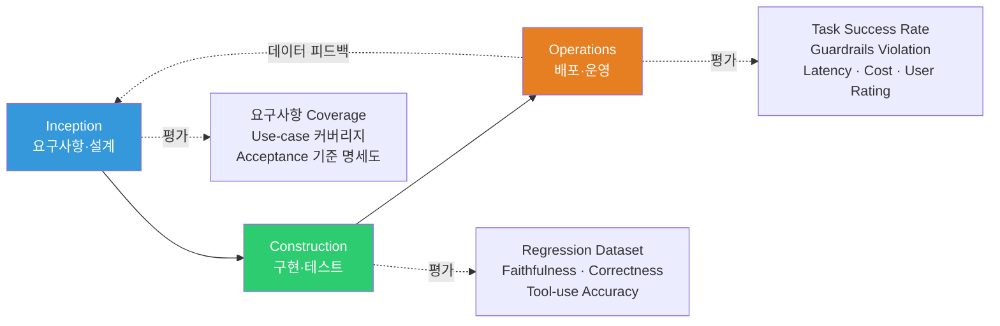
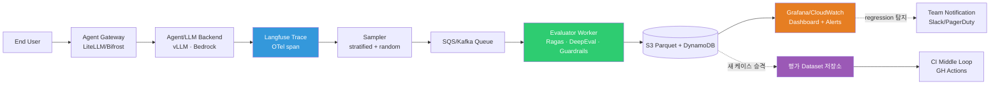

# AIDLC Evaluation Framework

> **읽는 시간**: 약 12분

AIDLC (AI Development Life Cycle) 는 기존 SDLC 와 달리 **확률적(stochastic) 산출물** 을 다룹니다. 같은 입력에도 LLM/Agent 의 응답이 달라지고, 한 번의 단위 테스트 통과가 "항상 맞다"를 보장하지 않습니다. 본 문서는 AIDLC 의 세 루프(Inner/Middle/Outer) 에 평가(Evaluation) 를 어떻게 심어야 하는지, 2026-04 기준 실전에서 사용되는 벤치마크·도구·아키텍처를 정리합니다.

---

## 1. 왜 Evaluation-driven Loop 인가

### 1.1 SDLC TDD vs AIDLC Evaluation-driven

| 구분 | 기존 SDLC (TDD) | AIDLC (Evaluation-driven) |
|------|-----------------|--------------------------|
| 산출물 성격 | Deterministic (동일 입력 → 동일 출력) | Stochastic (동일 입력 → 분포) |
| 정답 정의 | 단일 expected value | 허용 구간 + 품질 지표 분포 |
| 실패 신호 | Assertion 실패 = 버그 | 지표 하락 = drift · regression · 품질 저하 후보 |
| 재현성 | 100% 재현 | seed/temperature 고정 시 근사 재현 |
| 게이트 조건 | 모든 테스트 green | 평가 지표 임계값 충족 (예: Faithfulness ≥ 0.90) |
| 반복 주기 | 커밋 단위 | 커밋 + 데이터셋 교체 + 프로덕션 샘플링 |

TDD 가 "실패하는 테스트 → 구현 → 리팩터" 루프였다면, AIDLC 의 Evaluation-driven Loop 는 "**평가 데이터셋 → 에이전트/프롬프트/모델 변경 → 지표 비교 → 게이트 통과**" 의 루프입니다. 한 번의 기능 추가가 10개 지표 중 2개를 떨어뜨릴 수 있으므로, 단순 pass/fail 이 아닌 **다차원 지표 대시보드** 가 기본이 됩니다.

### 1.2 학습 → 배포 흐름의 CI 역할

전통 SDLC 에서 CI 는 "빌드 + 단위 테스트" 였습니다. AIDLC 에서는 CI 가 수행해야 할 일이 확장됩니다.

1. 프롬프트/에이전트/모델 변경이 커밋되면, 평가 데이터셋 기준선과 비교
2. 핵심 지표(faithfulness, task success rate, tool-use accuracy 등) 가 허용 범위인지 확인
3. 비용 지표(토큰·레이턴시) 역시 회귀가 없는지 측정
4. 프로덕션 샘플 대비 drift 여부 판정
5. 게이트 통과 시에만 배포 파이프라인 진행

즉, CI 는 **"코드가 컴파일되는가"** 에서 **"에이전트가 여전히 제 품질을 내는가"** 로 의미가 바뀝니다.

### 1.3 Inner / Middle / Outer Loop 과의 관계

AIDLC 는 평가를 세 계층으로 나눠 비용·속도·정확도를 조합합니다.



- **Inner Loop (수 초 ~ 수 분)**: 개발자가 프롬프트·함수 하나 고쳤을 때, 10-20개 샘플로 국소 회귀를 즉시 확인. promptfoo·pytest 기반 도구가 적합
- **Middle Loop (수 분 ~ 수십 분)**: Pull Request 단위 CI. 수백 개 데이터셋으로 Ragas/DeepEval 실행, 기준선 대비 허용 오차 내 여부를 게이트. GitHub Actions/CodeBuild 에서 실행
- **Outer Loop (지속)**: 프로덕션 trace 를 샘플링해 비동기 평가. drift·regression·safety violation 을 대시보드로 감시하고, 평가 데이터셋을 주기적으로 갱신

---

## 2. 공식 벤치마크 (2026-04 기준)

AIDLC 에서 팀별 데이터셋만으로는 전체 역량을 비교하기 어렵습니다. **공개 벤치마크** 는 외부 레퍼런스 역할을 합니다.

### 2.1 코딩 Agent 전문 벤치마크

| 벤치마크 | 규모 | 초점 | 2026-04 SOTA 영역 | URL |
|---------|------|------|------------------|-----|
| **SWE-bench Verified** | 500개 human-verified GitHub issue | 실제 PR 스타일 버그 수정 | 70%+ pass@1 (상위 Agent) | [swebench.com](https://www.swebench.com/) |
| **SWE-bench Multimodal** | 웹 UI 버그 수정 (스크린샷 포함) | 시각 + 코드 결합 | 초기 단계 | [swebench.com/multimodal](https://www.swebench.com/multimodal.html) |
| **TerminalBench** | 실제 shell/CLI 작업 | 터미널 조작·파일시스템 | ~50% 성공률 | [tbench.ai](https://www.tbench.ai/) |
| **AgentBench** | 8개 환경(OS, DB, KG, Web 등) | Multi-turn tool use | 모델별 편차 큼 | [github.com/THUDM/AgentBench](https://github.com/THUDM/AgentBench) |
| **MLE-bench** | 75개 Kaggle 스타일 ML 과제 | End-to-end ML 엔지니어링 | 메달 획득률 지표 | [github.com/openai/mle-bench](https://github.com/openai/mle-bench) |

- **SWE-bench Verified** 는 Princeton + OpenAI 가 2024 년 500개 이슈를 사람이 재검증한 세트로, 2026-04 기준 Agent 성능 비교의 사실상 표준 기준점입니다.
- **MLE-bench** 는 OpenAI 가 공개한 ML 엔지니어링 능력 평가로, 모델이 Kaggle 스타일 과제에서 메달을 얼마나 획득하는지를 측정합니다.

#### SWE-bench Verified 의 구조

SWE-bench 원본(2,294개) 은 난이도·재현성 편차가 커서, Verified 500개는 다음 기준으로 걸러졌습니다.

1. **Specification 명료성**: 이슈 설명·재현 절차가 사람이 읽어 이해 가능
2. **Test 신뢰성**: 평가 테스트가 해당 버그를 정확히 포착 (flaky 테스트 제외)
3. **환경 재현성**: 컨테이너 이미지가 결정적으로 재현
4. **범위 적절성**: 너무 광범위하거나 실현 불가능한 케이스 제외

AIDLC 관점에서는 Agent 가 "명세 → 설계 → 구현 → 검증" 사이클을 **실제 PR 단위** 로 완결할 수 있는지를 보는 단 하나의 공개 기준점이라는 점에서 중요합니다.

#### 벤치마크 사용 시 유의점

- **훈련 오염(Training Contamination)**: 공개 벤치마크가 사전학습 데이터에 포함되었을 가능성 → LiveCodeBench 처럼 주기적으로 새 문제를 추가하는 벤치마크를 병행
- **샘플 수와 유의성**: 500개 이슈에서 Agent A 68%, B 70% 차이가 통계적으로 유의하지 않을 수 있음 → bootstrap CI 로 판단
- **비용 대비 판별력**: 벤치마크 1회 평가가 상위 모델 기준 수천 달러 규모 — CI 매 PR 에서 돌릴 만한 규모는 아님. 주간/릴리스 단위로 실행

### 2.2 일반 LLM/추론 벤치마크 (참고용)

코딩 Agent 에는 직접 쓰기 어렵지만, 모델 선정 시 1차 필터로 사용됩니다.

| 벤치마크 | 초점 | 주의사항 |
|---------|------|---------|
| **MMLU-Pro** | 14개 분야 5지선다 전문 지식 (MMLU 개선판) | 2026-04 상위 모델은 80%+ 수렴 — 변별력 감소 |
| **GPQA Diamond** | 대학원 수준 과학 문제 (198개) | 구글/오픈AI 추론 전용 모델 평가 빈번 |
| **MATH** | 고등학교 경시 수학 | 포화 임박 |
| **HumanEval / HumanEval+** | Python 함수 생성 | 거의 포화, LiveCodeBench 로 대체 권장 |
| **LiveCodeBench** | 실시간 업데이트되는 코딩 문제 | 훈련 오염 방지용, 월단위 추가 |

> **주의**: 벤치마크 수치만으로 서비스 품질을 판정하지 말 것. **도메인 데이터셋 + 공개 벤치마크 조합** 이 실무 기준입니다.

### 2.3 METR task-length doubling

METR(Model Evaluation & Threat Research) 의 "Measuring AI Ability to Complete Long Tasks" 연구는 중요한 관측을 제시했습니다.

- 모델이 성공적으로 완료할 수 있는 **연속 작업 길이가 약 7개월마다 2배** 로 증가하는 트렌드
- 2019년 수 초 수준 → 2024-2025년 수십 분 수준 → 추세 유지 시 2027-2028년 수 시간 수준 예상
- 측정 방법: HCAST (Human-Calibrated Autonomy Software Tasks) 등 사람이 수행한 시간을 기준으로 "이 Agent 가 50% 성공률로 끝낼 수 있는 작업 길이" 를 추정

엔터프라이즈 관점의 함의:

1. 오늘 "사람이 한 시간 걸리는 업무" 가 자동화 대상이 아니더라도, 1-2년 내 임계점을 넘을 가능성이 높음
2. Evaluation 데이터셋은 **점점 긴 작업(long-horizon task)** 을 포함하도록 주기적으로 확장해야 함
3. Guardrails · Audit · HITL 체계가 task-length 증가와 함께 강화되어야 함

URL: [metr.org/blog/2025-03-19-measuring-ai-ability-to-complete-long-tasks](https://metr.org/blog/2025-03-19-measuring-ai-ability-to-complete-long-tasks/)

---

## 3. 평가 도구 비교 (2026-04 기준)

상세 비교는 AIDLC Middle Loop 관점(CI 통합, 프로덕션 연계) 에서 정리합니다.

| 도구 | 라이선스 | 주요 메트릭 | CI 통합 방식 | 프로덕션 샘플링 | 강점 | 한계 |
|------|---------|-----------|-------------|----------------|------|------|
| **Ragas v0.2+** | Apache 2.0 | faithfulness, context_precision, context_recall, answer_relevancy, noise_sensitivity | Python SDK, GH Actions, CodeBuild | 공식 지원 (Langfuse/Phoenix 연동) | RAG 평가에서 가장 성숙, 레퍼런스 풍부 | LLM-as-judge 호출 비용 |
| **DeepEval** | Apache 2.0 | 30+ (G-Eval, Toxicity, PII, Hallucination, Bias, Correctness 등) | PyTest-like DSL (`@pytest.mark.llm_eval`) | 자체 Confident AI 연동 | PyTest 사용자에게 가장 친숙, 커스텀 메트릭 DSL | 생태계 성숙도 중간, 일부 메트릭 validation 필요 |
| **LangSmith** | SaaS + self-host beta | Trace, Dataset, Auto/Custom Evaluator, LLM-as-judge | `langsmith evaluate` CLI, GH Actions | Managed (LangChain 네이티브) | LangChain/LangGraph 통합, A/B 실험 관리 | SaaS 의존, 데이터 거버넌스 이슈 |
| **Braintrust** | SaaS + self-host Enterprise | Dataset, Grading, Replay, Playground | `braintrust eval` CLI | Managed, log SDK | 개발자 경험 탁월, Playground UX 우수 | 벤더 락인, 온프레미스 제약 |
| **AWS Labs aidlc-evaluator** | Apache 2.0 (early, v0.1.6+) | AIDLC phase 산출물 준수도 · Common Rules 적합성 · Stage Transition 지표 | `scripts/` 실행 (Python) | - | AIDLC 방법론 적합성 평가 자체를 대상으로 함 | 범용 품질 메트릭 부족 → Ragas/DeepEval 과 병행 |
| **Promptfoo** | MIT | Assertions, LLM-as-judge, classifiers | YAML 구성 + `promptfoo eval` + GH Actions | 일부 | 경량·선언적, prompt 비교에 강함 | Agent 평가·복잡 워크플로 제약 |
| **Inspect AI (UK AISI)** | Apache 2.0 | Agent safety/capability (solver + scorer) | Python/CLI, GH Actions | - | 정부기관 기준, sandbox 실행 지원 | 학습곡선 있음, 커뮤니티 크지 않음 |

### 3.1 도구 선택 가이드

- **RAG 파이프라인 중심** → Ragas + Langfuse (오픈소스 조합)
- **Python/PyTest 중심 팀** → DeepEval
- **LangChain/LangGraph 사용** → LangSmith (네이티브)
- **최고 수준 DX + 팀 실험 관리** → Braintrust
- **AIDLC 방법론 준수 자체 감사** → AWS Labs aidlc-evaluator
- **단순 prompt A/B 비교** → Promptfoo
- **Agent safety/capability 평가** → Inspect AI

> 실무에서는 **Ragas(품질) + Inspect AI(safety) + aidlc-evaluator(방법론 준수)** 또는 **Braintrust(실험) + Langfuse(관찰)** 처럼 2-3개 조합을 쓰는 사례가 일반적입니다.

### 3.2 Ragas v0.2+ 핵심 메트릭

| 메트릭 | 의미 | 계산 방식 요약 |
|-------|------|-------------|
| Faithfulness | 응답이 retrieved context 에 근거하는가 | 응답을 claim 으로 분해 → 각 claim 이 context 에서 지지되는 비율 |
| Context Precision | 검색된 문서 중 실제 정답 관련 문서 비율 | top-k 순서를 반영한 MAP 스타일 계산 |
| Context Recall | 정답에 필요한 모든 정보가 검색되었는가 | ground truth 를 문장 단위로 분해 → context 가 커버하는 비율 |
| Answer Relevancy | 응답이 질문 의도에 맞는가 | 응답에서 생성된 역질문과 원 질문의 임베딩 유사도 |
| Noise Sensitivity | 관련 없는 문서 주입 시 응답이 바뀌는가 | RAG 파이프라인의 robustness 지표 |

RAG 파이프라인은 "검색 품질" 과 "생성 품질" 이 얽혀 문제를 진단하기 어려운데, Ragas 의 지표 조합이 문제를 분해해 줍니다. 예: Faithfulness↓ · Context Precision↑ 이면 **생성 단계 환각**, Context Precision↓ 이면 **검색 단계 실패** 로 판정 가능.

### 3.3 DeepEval 의 PyTest 통합

DeepEval 은 `@pytest.mark.llm_eval` 마커와 `assert_test()` 헬퍼로 기존 PyTest 파이프라인에 평가 케이스를 그대로 끼워 넣을 수 있습니다. 결과는 Confident AI 대시보드에 전송되거나 로컬 JSON 으로 저장됩니다.

- **G-Eval**: 임의 기준(rubric) 을 자연어로 기술하면 LLM-as-judge 로 점수화
- **Hallucination / Bias / Toxicity**: 안전성 관련 메트릭 내장
- **Custom Metric DSL**: `BaseMetric` 을 상속해 팀 고유 기준 구현

### 3.4 LangSmith / Braintrust — SaaS 실험 관리

대규모 팀에서 10-20개 프롬프트 조합 · 3-5개 모델 조합을 체계적으로 실험할 때 필요합니다. 공통 기능:

- Dataset 버전 관리 (Git 유사)
- Run 단위 trace 저장과 side-by-side 비교
- A/B 실험 그룹 분리
- Playground 에서 실패 trace 를 바로 편집·재실행
- Evaluator 결과를 과거 run 과 시계열로 비교

**차이점**: LangSmith 는 LangChain/LangGraph 네이티브, Braintrust 는 프레임워크 독립적이고 DX(developer experience) 에 집중. 온프레미스 요구가 강하면 self-host 옵션이나 Langfuse(오픈소스) 로 대체를 검토합니다.

### 3.5 AWS Labs aidlc-evaluator — 방법론 적합성 감사

범용 품질 메트릭이 아닌, **"이 프로젝트가 AIDLC 방법론을 실제로 따르는가"** 를 감사합니다.

- Common Rules 적용 여부 (산출물 파일명 · 구조 · 승인 체크포인트)
- Stage Transition 기준 충족 여부 (Inception → Construction 전환 전 산출물 완결성)
- Extension(opt-in.md) 준수 여부
- 조직별 커스텀 규정 위반 감지

v0.1.x 단계라 범용성·안정성은 제한적이지만, AIDLC 를 조직 표준으로 채택한 경우 **Ragas/DeepEval 과 병행** 해 방법론 준수도까지 CI 로 감시할 수 있는 유일한 도구입니다.

---

## 4. CI/CD 통합 패턴

### 4.1 Inner Loop — 개발자 로컬

- 도구: `pytest-deepeval`, `promptfoo`, `ragas.evaluate()` 인 라인 호출
- 데이터: 10-20개 고정 샘플 (smoke set)
- 주기: 코드 저장 시 pre-commit 또는 `make eval-fast`
- 목적: 치명적 회귀 즉시 차단, 초 단위 피드백

```python
# Inner Loop 예시 — DeepEval smoke test
import pytest
from deepeval import evaluate
from deepeval.metrics import FaithfulnessMetric, AnswerRelevancyMetric
from deepeval.test_case import LLMTestCase

@pytest.mark.llm_eval
def test_rag_smoke():
    cases = [LLMTestCase(input=q, actual_output=run_pipeline(q), retrieval_context=ctx)
             for q, ctx in smoke_dataset]
    metrics = [FaithfulnessMetric(threshold=0.85), AnswerRelevancyMetric(threshold=0.80)]
    evaluate(cases, metrics)
```

### 4.2 Middle Loop — CI (GitHub Actions)

- 도구: Ragas + DeepEval + 허용 임계값 게이트
- 데이터: 200-500개 regression dataset (도메인 특화 + 공개 벤치마크 부분집합)
- 주기: Pull Request, main 병합 시
- 목적: 회귀 감지, 변경 영향 시각화, 배포 게이트

```yaml
# .github/workflows/eval.yml (발췌)
name: LLM Regression Eval
on: [pull_request]
jobs:
  eval:
    runs-on: ubuntu-latest
    steps:
      - uses: actions/checkout@v5
      - uses: actions/setup-python@v6
        with: {python-version: '3.12'}
      - run: pip install -r requirements-eval.txt
      - name: Run Ragas regression
        env:
          OPENAI_API_KEY: ${{ secrets.OPENAI_API_KEY }}
        run: python eval/run_ragas.py --dataset eval/datasets/regression.jsonl --out results.json
      - name: Gate on thresholds
        run: python eval/gate.py results.json \
               --faithfulness 0.90 --context-precision 0.85 --answer-relevancy 0.85
      - uses: actions/upload-artifact@v4
        with: {name: eval-results, path: results.json}
```

- `gate.py` 는 임계값 미달 시 `exit 1`, PR 블록 처리
- 결과는 아티팩트로 업로드하고 Langfuse/Braintrust 대시보드에 push

### 4.3 Outer Loop — 프로덕션 샘플링

- 도구: Langfuse trace → SQS/Queue → 비동기 evaluator → S3/DB → Grafana
- 데이터: 프로덕션 trace 의 통계적 샘플 (랜덤 + 계층 샘플링)
- 주기: 지속 실행 (시간 단위 aggregation)
- 목적: drift 감지, safety violation 조기 경보, 평가 데이터셋 갱신

> 오프라인 CI 는 "과거 데이터셋 기준의 회귀" 를 잡고, 프로덕션 샘플링은 "현실 분포의 변화" 를 잡습니다. 두 가지를 분리해서 운영해야 **Concept drift vs Code regression** 을 구분할 수 있습니다.

---

## 5. AIDLC 단계별 평가 배치



### 5.1 Inception

- **요구사항 Coverage Evaluation**: `requirements.md` 에 정의된 use-case 를 평가 데이터셋이 몇 % 커버하는지 측정
- **AIDLC Common Rules 적합성**: `aidlc-evaluator` 로 산출물 포맷·Extension 준수 여부 점검
- **Acceptance Criteria 명세도**: 모호한 "잘 동작한다" 식 기준을 측정 가능한 지표(예: "faithfulness ≥ 0.90, 응답 지연 p95 ≤ 3 s") 로 변환

### 5.2 Construction

- **Regression Dataset 유지**: 커밋 단위로 실행되는 200-500개 케이스
- **Ground-truth 기반 메트릭**: Correctness, Exact-match, Tool-use precision/recall
- **LLM-as-judge 메트릭**: Faithfulness, Relevancy, Toxicity
- **Budget/Cost 지표**: 토큰·레이턴시 회귀도 동일 dataset 으로 측정
- **Stage Transition Gate**: Construction → Operations 이동 전 핵심 지표 Green

### 5.3 Operations

- **프로덕션 관찰성**: Langfuse/Phoenix trace, OTel span attributes (model, tokens, latency)
- **Guardrails Violation Rate**: PII 노출·Prompt injection 탐지·Toxicity threshold 위반 비율
- **Task Success Rate**: 종단간 작업 성공률 (사용자 확인 또는 heuristic)
- **Feedback Loop**: 실패 trace 를 새로운 평가 케이스로 승격 (Dataset 갱신 파이프라인)

### 5.4 Stage Transition Gate 체크리스트

| 전환 | 필수 조건 | 평가 도구 |
|------|----------|---------|
| Inception → Construction | 요구사항 coverage ≥ 95 % · Acceptance 기준 측정 가능 · AIDLC Common Rules 적합 | aidlc-evaluator + 수동 리뷰 |
| Construction → Operations | Regression dataset 주요 지표 baseline 이상 · p95 latency 목표 충족 · 보안 스캔 통과 | Ragas/DeepEval + CI gate |
| Operations 지속 운영 | 프로덕션 지표 drift 없음 · Guardrails violation rate 임계 이하 | Langfuse + 비동기 evaluator |

각 전환 게이트에서 **자동 게이트(지표 임계값) + 사람 승인(Checkpoint Approval)** 을 둘 다 요구하는 것이 AIDLC 기본 패턴입니다. 자동 게이트만으로는 "지표는 통과했지만 실질 품질이 부족한" 경우를 거를 수 없기 때문입니다.

---

## 6. 회귀 감지·알람 전략

### 6.1 Baseline 설정

- 특정 git tag 또는 월간 스냅샷을 "golden baseline" 으로 지정
- 각 메트릭의 mean/std/95th percentile 을 기록
- 새 실행은 baseline 대비 상대 변화로 보고

### 6.2 통계적 유의성

- 200개 이하 샘플에서는 **bootstrap confidence interval** 이 현실적 (정규성 가정 불안)
- p-value 는 보조 지표로만 사용. 작은 데이터셋에서는 **효과 크기(Cohen's d, Δmean/σ)** 병행
- Multiple comparisons 문제: 여러 지표를 한꺼번에 볼 때 Bonferroni 또는 BH 보정 적용

### 6.3 임계값 게이트 예시

| 지표 | 하한 | 동작 |
|------|------|------|
| Faithfulness | < 0.90 | PR 블록 |
| Context Precision | < 0.85 | PR 블록 |
| Toxicity | > 0.01 | PR 블록 + 보안 팀 알림 |
| PII Leak Rate | > 0 | 즉시 롤백 |
| Task Success Rate | baseline-5 %p | 경고, 수동 검토 |
| p95 Latency | +20 % | 경고 |
| Cost per task | +15 % | 경고 |

### 6.4 알람 Noise 관리

- **지수 가중 이동평균(EWMA)** 으로 일회성 spike 완화
- 같은 알람은 30분 내 중복 전송 억제
- Severity 분리: Blocker / Warning / Info 를 각각 다른 채널로
- 주간 리뷰에 False Positive 비율을 확인하고 임계값 튜닝

### 6.5 Drift 유형 구분

프로덕션에서 관측되는 품질 저하는 크게 세 종류이며, 대응 경로가 다릅니다.

| Drift 유형 | 신호 | 원인 예 | 1차 대응 |
|-----------|------|--------|---------|
| Data Drift | 입력 분포 변화, 토픽 변동 | 신규 상품 카테고리 유입, 계절성 | 평가 데이터셋 갱신 |
| Concept Drift | 같은 질문의 정답 자체가 바뀜 | 정책 변경, 버전 업데이트 | Ground truth 재라벨링 |
| Model Drift | 외부 API 모델 업데이트로 동작 변화 | OpenAI/Anthropic 버전 silent update | 모델 핀닝 + shadow 평가 |

Data Drift 는 coverage 보강으로, Concept Drift 는 ground truth 재작성으로, Model Drift 는 고정 버전 사용과 새 버전 shadow 실행으로 대응합니다.

---

## 7. 비용 고려

### 7.1 LLM-as-judge 비용 구조

- 1케이스당 평가 호출 2-5회 (메트릭 수만큼) × judge 모델 토큰 × 데이터셋 크기
- 데이터셋 500개 × 메트릭 5개 × GPT-4.1 기준: **1회 실행 수천 ~ 수만 토큰** 규모
- CI 에서 매 PR 돌리면 월간 비용이 상당 — 비용 상한 필요

### 7.2 비용 절감 전략

1. **Judge 모델 다운그레이드**: GPT-4.1 → GPT-4.1-mini 또는 Claude 4.5 Haiku 로 1차 판정 후 경계 케이스만 상위 모델로 재검증
2. **로컬 Evaluator 모델**: Prometheus-Eval, Ragas 내장 경량 모델로 Inner/Middle Loop 대체
3. **샘플링 전략**: 500개 대신 계층 샘플링된 100개로 Middle Loop, 월 1회 500개 풀 스윕
4. **캐시 활용**: 동일 prompt + response 쌍에 대한 judge 결과 캐시 (입력 변동 없으면 재계산 생략)
5. **비동기 평가**: PR 블록이 아닌 "Advisory" 평가로 일부 메트릭 전환

### 7.3 Cost-effective 조합 패턴

| 팀 규모 | 조합 | 예상 월 비용 범위 |
|--------|------|----------------|
| 소규모 (&lt;5명) | Ragas 로컬 + Langfuse OSS + Haiku judge | $50-200 |
| 중간 (5-20명) | Ragas + DeepEval + Langfuse + Haiku/4o-mini | $300-1,500 |
| 대규모 (20+명) | Braintrust SaaS 또는 LangSmith + 4o judge | $2,000-10,000+ |

### 7.4 비용 추정 워크시트

비용 예산을 수립할 때 아래 수식을 사용하면 조직별 상황에 맞는 규모 감각을 잡을 수 있습니다.

```
월 평가 비용 ≈
  (CI 실행 수/월 × 데이터셋 크기 × 메트릭 수 × judge 토큰 단가)
+ (프로덕션 trace 수/월 × 샘플링 비율 × 메트릭 수 × judge 토큰 단가)
+ (주간 공개 벤치마크 실행 비용)
```

예: PR 50회/월, 200-case dataset, 5 metrics, judge 당 평균 2k 토큰, GPT-4o-mini 단가 기준 → CI 부분만 약 50 × 200 × 5 × 2,000 tokens = 100M tokens/월. 이 규모부터는 judge 모델 다운그레이드와 샘플링 전략이 필수입니다.

---

## 8. 프로덕션 샘플링 아키텍처

실제 운영 환경에서 **trace → 비동기 평가 → 대시보드** 흐름을 권장 참조 아키텍처로 정리합니다.



### 8.1 핵심 설계 포인트

- **샘플링 계층화**: 랜덤 5% + 오류/저평점 trace 100% + 고비용 trace 100% 로 구성 — 중요한 trace 는 놓치지 않음
- **비동기 분리**: 평가 호출이 프로덕션 레이턴시에 영향을 주지 않도록 Queue 로 분리
- **데이터 거버넌스**: PII 필터링 후 S3 에 저장, KMS 암호화, 접근 로그 기록
- **피드백 루프**: 실패 trace 를 **Dataset 저장소** 로 승격 → 다음 CI 사이클에 regression case 로 합류
- **관찰성 일원화**: Langfuse trace ID 를 CI 평가 결과와 공유 키로 사용해 온·오프라인 상관 분석 가능

### 8.2 배포 위치

- **EKS 기반**: Langfuse (Helm), Evaluator Worker (Karpenter 스케일 아웃), Grafana Operator
- **AWS Native**: Bedrock Agent + CloudWatch + SQS + Lambda Evaluator (소규모)
- **하이브리드**: Edge 에 filter/sampler, 중앙 EKS 에 Evaluator 와 Dashboard

### 8.3 샘플링·평가 Worker 의사코드

```python
# sampler.py — 계층 샘플링
def should_sample(trace):
    if trace.error or trace.user_rating is not None and trace.user_rating <= 2:
        return True  # 부정적 신호는 100%
    if trace.estimated_cost_usd > 0.50:
        return True  # 고비용 trace 100%
    return random.random() < 0.05  # 나머지 5% 랜덤

# worker.py — 비동기 evaluator
def evaluate_trace(trace_id):
    trace = langfuse.fetch_trace(trace_id)
    cases = [LLMTestCase(input=trace.input, actual_output=trace.output,
                         retrieval_context=trace.retrieved_docs)]
    result = ragas.evaluate(cases, metrics=[faithfulness, answer_relevancy])
    store_result(trace_id, result, target="s3://eval-results/")
    if result.faithfulness < 0.85:
        promote_to_dataset(trace, dataset="regression_v2")
        alert_team(trace_id, severity="warning")
```

### 8.4 보안과 거버넌스

- **PII 마스킹**: 샘플러 단계에서 이메일·주민번호·카드번호 패턴 필터, 필요 시 Microsoft Presidio 같은 PII 엔진 사용
- **암호화**: trace payload 는 KMS CMK 로 server-side 암호화, 전송은 TLS 1.3
- **접근 제어**: 평가 결과 대시보드는 IAM + SSO 뒤에 배치, 감사 로그(CloudTrail) 활성화
- **보존 기간**: 원본 trace 는 30-90일, 집계된 지표는 장기 보존 (Parquet 파티셔닝)
- **데이터 유출 방지**: 외부 LLM judge 호출 시 PII 제거된 요약본만 전송하도록 전처리 단계 삽입

### 8.5 확장 패턴

1. **멀티 테넌트 분리**: 팀별 trace 네임스페이스와 대시보드 분리, 공통 evaluator 공유
2. **비용-성능 Pareto 모니터링**: 지표 품질뿐 아니라 비용·레이턴시를 같은 대시보드에서 Pareto front 로 추적
3. **Human-in-the-Loop 통합**: 경계선 trace 를 주기적으로 사람이 라벨링하도록 큐에 적재, 라벨 결과를 재훈련/파인튜닝 데이터로 활용
4. **Shadow Traffic**: 새 모델/프롬프트를 production 트래픽의 X% 에 병행 실행하고 지표 비교, 게이트 통과 시 점진 승격

---

## 9. 참고 자료

### 공식 문서 · 프로젝트

- AWS Labs AIDLC Workflows — [github.com/awslabs/aidlc-workflows](https://github.com/awslabs/aidlc-workflows)
- AWS Labs AIDLC Evaluator (scripts) — [github.com/awslabs/aidlc-workflows/tree/main/scripts](https://github.com/awslabs/aidlc-workflows/tree/main/scripts)
- Ragas 공식 문서 — [docs.ragas.io](https://docs.ragas.io/)
- DeepEval — [github.com/confident-ai/deepeval](https://github.com/confident-ai/deepeval)
- LangSmith — [docs.smith.langchain.com](https://docs.smith.langchain.com/)
- Braintrust — [braintrust.dev/docs](https://www.braintrust.dev/docs)
- Promptfoo — [promptfoo.dev](https://www.promptfoo.dev/)
- Inspect AI (UK AISI) — [inspect.ai-safety-institute.org.uk](https://inspect.ai-safety-institute.org.uk/)

### 벤치마크

- SWE-bench Verified — [swebench.com](https://www.swebench.com/)
- SWE-bench Multimodal — [swebench.com/multimodal](https://www.swebench.com/multimodal.html)
- TerminalBench — [tbench.ai](https://www.tbench.ai/)
- AgentBench — [github.com/THUDM/AgentBench](https://github.com/THUDM/AgentBench)
- MLE-bench — [github.com/openai/mle-bench](https://github.com/openai/mle-bench)
- LiveCodeBench — [livecodebench.github.io](https://livecodebench.github.io/)
- GPQA — [github.com/idavidrein/gpqa](https://github.com/idavidrein/gpqa)
- MMLU-Pro — [github.com/TIGER-AI-Lab/MMLU-Pro](https://github.com/TIGER-AI-Lab/MMLU-Pro)

### 연구 보고서

- METR — Measuring AI Ability to Complete Long Tasks — [metr.org/blog/2025-03-19-measuring-ai-ability-to-complete-long-tasks](https://metr.org/blog/2025-03-19-measuring-ai-ability-to-complete-long-tasks/)
- METR HCAST — [metr.org/blog/2025-01-27-hcast](https://metr.org/blog/2025-01-27-hcast/)

### 내부 문서

- [AIDLC 방법론](/docs/aidlc/methodology)
- [AI 코딩 에이전트](./ai-coding-agents.md)
- [기술 로드맵](./technology-roadmap.md)
- [LLMOps Observability](/docs/agentic-ai-platform/operations-mlops/llmops-observability)
- [Ragas Evaluation](/docs/agentic-ai-platform/operations-mlops/ragas-evaluation)
