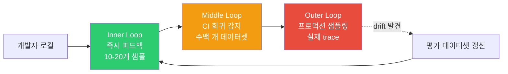
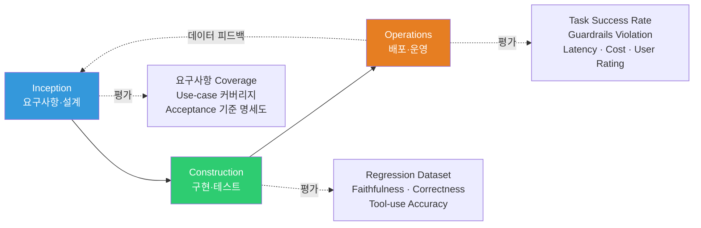
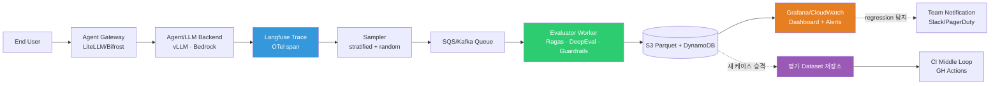

AI-DLC(AI-Driven Development Lifecycle)에서는 일반 소프트웨어 테스트와 LLM·에이전트 평가를 함께 사용합니다. 코드의 예상 동작은 단위·통합·보안 테스트로 확인하고, 같은 입력에도 달라질 수 있는 모델 응답은 반복 평가로 확인합니다.

이 문서는 개발 중 빠른 확인, CI 회귀 검사, 운영 데이터 평가를 Inner/Middle/Outer Loop로 나누는 구성을 제안합니다. 벤치마크·도구 비교는 2026년 4월 범위이며, 별도로 표시한 v0.1.7 규칙과 평가기 동작은 2026년 9월 19일에 확인한 버전을 기준으로 합니다.

---

## 1. 왜 Evaluation-driven Loop 인가

### 1.1 SDLC TDD vs AIDLC Evaluation-driven

| 구분 | 결정적 구성요소 테스트 | 확률적 구성요소 평가 |
|------|----------------------|-----------------------|
| 산출물 성격 | 통제된 상태·입력의 함수 결과 | 동일 입력에도 달라질 수 있는 응답 분포 |
| 정답 정의 | 명시적 expected value·불변식 | 참조 답변·rubric·품질 분포와 허용 범위 |
| 실패 신호 | assertion·불변식 위반 | 품질 저하·drift·회귀 후보, case 검토 필요 |
| 재현성 | 의존성·동시성·환경까지 통제해야 함 | seed/temperature 고정만으로 동일 응답 보장 불가 |
| 게이트 조건 | 관련 테스트 통과 | 평가 임계값과 관련 코드·보안 테스트 및 승인 |
| 반복 주기 | 커밋·환경 변경 | 커밋·데이터셋·모델·judge 변경과 운영 샘플링 |

두 접근은 SDLC와 AI-DLC 모두에 적용할 수 있습니다. TDD의 실패 테스트 → 구현 → 리팩터 루프에 **평가 데이터셋 → 변경 → 지표 비교 → 승인 검토**를 추가합니다. 여러 지표를 함께 보되 대시보드는 자동 통과·실패 판정과 근거 검토를 보완합니다.

### 1.2 학습 → 배포 흐름의 CI 역할

CI는 기존의 빌드·단위·통합·보안 테스트를 유지하면서 평가 책임을 추가합니다.

1. 프롬프트/에이전트/모델 변경이 커밋되면, 평가 데이터셋 기준선과 비교
2. 핵심 지표(faithfulness, task success rate, tool-use accuracy 등) 가 허용 범위인지 확인
3. 비용 지표(토큰·레이턴시) 역시 회귀가 없는지 측정
4. 프로덕션 샘플 대비 drift 여부 판정
5. 게이트 통과 시에만 배포 파이프라인 진행

코드 검증과 Agent 품질 평가는 함께 필요합니다. 생성한 코드의 실패를 judge 점수로 상쇄하지 않습니다.

### 1.3 Inner / Middle / Outer Loop 과의 관계

아래 세 계층은 비용·속도·coverage를 조절하는 **저장소의 설계 제안**이며 공식 Inception/Construction/Operations 단계와 다릅니다. 10–20개나 수백 개라는 수치는 출발점 예시이며 데이터 분포·실패 비용·통계적 목표로 조정합니다.


```mermaid
flowchart LR
    Dev[개발자 로컬] --> Inner[Inner Loop<br/>즉시 피드백<br/>10-20개 샘플]
    Inner --> CI[Middle Loop<br/>CI 회귀 감지<br/>수백 개 데이터셋]
    CI --> Prod[Outer Loop<br/>프로덕션 샘플링<br/>실제 trace]
    Prod -. drift 발견 .-> Dataset[평가 데이터셋 갱신]
    Dataset --> Inner

    style Inner fill:#2ecc71,color:#fff
    style CI fill:#f39c12,color:#fff
    style Prod fill:#e74c3c,color:#fff
```

- **Inner Loop (수 초 ~ 수 분)**: 개발자가 프롬프트·함수 하나 고쳤을 때, 10-20개 샘플로 국소 회귀를 즉시 확인. promptfoo·pytest 기반 도구가 적합
- **Middle Loop (수 분 ~ 수십 분)**: Pull Request 단위 CI. 수백 개 데이터셋으로 Ragas/DeepEval 실행, 기준선 대비 허용 오차 내 여부를 게이트. GitHub Actions/CodeBuild 에서 실행
- **Outer Loop (지속)**: 프로덕션 trace 를 샘플링해 비동기 평가. drift·regression·safety violation 을 대시보드로 감시하고, 평가 데이터셋을 주기적으로 갱신

---

## 2. 공식 벤치마크 (2026-04 기준)

AIDLC 에서 팀별 데이터셋만으로는 전체 역량을 비교하기 어렵습니다. **공개 벤치마크** 는 외부 레퍼런스 역할을 합니다.

### 2.1 코딩 Agent 전문 벤치마크

| 벤치마크 | 규모 | 초점 | 2026-04 SOTA 영역 | URL |
|---------|------|------|------------------|-----|
| **SWE-bench Verified** | 500개 human-verified GitHub issue | 실제 PR 스타일 버그 수정 | 70%+ pass@1 (상위 Agent) | [swebench.com](https://www.swebench.com/) |
| **SWE-bench Multimodal** | 웹 UI 버그 수정 (스크린샷 포함) | 시각 + 코드 결합 | 초기 단계 | [swebench.com/multimodal](https://www.swebench.com/multimodal.html) |
| **TerminalBench** | 실제 shell/CLI 작업 | 터미널 조작·파일시스템 | ~50% 성공률 | [tbench.ai](https://www.tbench.ai/) |
| **AgentBench** | 8개 환경(OS, DB, KG, Web 등) | Multi-turn tool use | 모델별 편차 큼 | [github.com/THUDM/AgentBench](https://github.com/THUDM/AgentBench) |
| **MLE-bench** | 75개 Kaggle 스타일 ML 과제 | End-to-end ML 엔지니어링 | 메달 획득률 지표 | [github.com/openai/mle-bench](https://github.com/openai/mle-bench) |

- **SWE-bench Verified** 는 Princeton + OpenAI 가 2024 년 500개 이슈를 사람이 재검증한 세트로, 2026-04 기준 Agent 성능 비교의 사실상 표준 기준점입니다.
- **MLE-bench** 는 OpenAI 가 공개한 ML 엔지니어링 능력 평가로, 모델이 Kaggle 스타일 과제에서 메달을 얼마나 획득하는지를 측정합니다.

#### SWE-bench Verified 의 구조

SWE-bench 원본(2,294개) 은 난이도·재현성 편차가 커서, Verified 500개는 다음 기준으로 걸러졌습니다.

1. **Specification 명료성**: 이슈 설명·재현 절차가 사람이 읽어 이해 가능
2. **Test 신뢰성**: 평가 테스트가 해당 버그를 정확히 포착 (flaky 테스트 제외)
3. **환경 재현성**: 컨테이너·의존성·harness revision을 고정해 재현성을 높이되 flaky 실행과 환경 차이를 별도로 확인
4. **범위 적절성**: 너무 광범위하거나 실현 불가능한 케이스 제외

SWE-bench Verified의 통과율은 선택한 500개 issue, harness revision, 생성 patch와 테스트 조건에서의 issue 해결 성능을 나타냅니다. 명세·설계 품질이나 전체 PR lifecycle을 인증하지 않으며 다른 공개·도메인 평가와 함께 사용합니다.

#### 벤치마크 사용 시 유의점

- **훈련 오염(Training Contamination)**: 공개 벤치마크가 사전학습 데이터에 포함되었을 가능성 → LiveCodeBench 처럼 주기적으로 새 문제를 추가하는 벤치마크를 병행
- **샘플 수와 유의성**: 500개 이슈에서 Agent A 68%, B 70% 차이가 통계적으로 유의하지 않을 수 있음 → bootstrap CI 로 판단
- **비용 대비 판별력**: 수천 달러는 모델·retry·harness·토큰량이 명시되지 않은 보편적 비용으로 사용할 수 없습니다. 실행별 견적과 소규모 측정을 먼저 확보해 CI·주간·릴리스 실행 주기를 정합니다.

### 2.2 일반 LLM/추론 벤치마크 (참고용)

코딩 Agent 에는 직접 쓰기 어렵지만, 모델 선정 시 1차 필터로 사용됩니다.

| 벤치마크 | 초점 | 주의사항 |
|---------|------|---------|
| **MMLU-Pro** | 14개 분야, 최대 10개 선택지의 전문 지식·추론 문제 | 80%+ 수렴 주장은 날짜·모델·prompt·평가 revision 증거가 필요하며 여기서는 미검증 |
| **GPQA Diamond** | 대학원 수준 과학 문제 (198개) | 구글/오픈AI 추론 전용 모델 평가 빈번 |
| **MATH** | 고등학교 경시 수학 | 포화 임박 |
| **HumanEval / HumanEval+** | Python 함수 생성 | 거의 포화, LiveCodeBench 로 대체 권장 |
| **LiveCodeBench** | 실시간 업데이트되는 코딩 문제 | 훈련 오염 방지용, 월단위 추가 |

> **주의**: 벤치마크 수치만으로 서비스 품질을 판정하지 말 것. **도메인 데이터셋 + 공개 벤치마크 조합** 이 실무 기준입니다.

### 2.3 METR task-length doubling

METR(Model Evaluation & Threat Research)의 **2025-03-19 연구**에서 약 7개월 doubling은 Agent가 연속 실행되는 시간이 아니라 **50% 성공 확률로 완료하는 과제의 인간 전문가 수행 시간** 추세입니다. HCAST 등 해당 과제 분포에서 추정한 값이며 최신 모든 모델의 현재 doubling 주기로 일반화하지 않습니다.

- 역사적 관측에서는 인간 수행 시간이 초 단위인 과제에서 수십 분인 과제까지의 변화가 포함됩니다. 장래 수 시간·일 단위 과제에 관한 외삽은 추세와 과제 분포가 유지된다는 가정에 의존합니다.
- 임의의 기업 업무가 1–2년 안에 안전하게 자동화된다는 결론은 이 연구로 확인할 수 없습니다. 50% 성공률은 운영 신뢰성 기준이 아닙니다.
- 긴 과제·재시도·실패 복구를 도메인 평가에 추가하고, Guardrails·Audit·HITL 요구는 실제 위험과 필요한 성공률에 맞춰 검증합니다.

URL: [metr.org/blog/2025-03-19-measuring-ai-ability-to-complete-long-tasks](https://metr.org/blog/2025-03-19-measuring-ai-ability-to-complete-long-tasks/)

---

## 3. 평가 도구 비교 (2026-04 기준)

상세 비교는 AIDLC Middle Loop 관점(CI 통합, 프로덕션 연계) 에서 정리합니다.

| 도구 | 라이선스 | 주요 메트릭 | CI 통합 방식 | 프로덕션 샘플링 | 강점 | 한계 |
|------|---------|-----------|-------------|----------------|------|------|
| **Ragas v0.2+** | Apache 2.0 | faithfulness, context_precision, context_recall, answer_relevancy, noise_sensitivity | Python SDK, GH Actions, CodeBuild | 공식 지원 (Langfuse/Phoenix 연동) | RAG 평가에서 가장 성숙, 레퍼런스 풍부 | LLM-as-judge 호출 비용 |
| **DeepEval** | Apache 2.0 | 30+ (G-Eval, Toxicity, PII, Hallucination, Bias, Correctness 등) | PyTest 통합 (`assert_test()`) | 자체 Confident AI 연동 | PyTest 사용자에게 가장 친숙, 커스텀 메트릭 DSL | 생태계 성숙도 중간, 일부 메트릭 validation 필요 |
| **LangSmith** | SaaS + self-host beta | Trace, Dataset, Auto/Custom Evaluator, LLM-as-judge | `langsmith evaluate` CLI, GH Actions | Managed (LangChain 네이티브) | LangChain/LangGraph 통합, A/B 실험 관리 | SaaS 의존, 데이터 거버넌스 이슈 |
| **Braintrust** | SaaS + self-host Enterprise | Dataset, Grading, Replay, Playground | `braintrust eval` CLI | Managed, log SDK | 개발자 경험 탁월, Playground UX 우수 | 벤더 락인, 온프레미스 제약 |
| **AWS Labs aidlc-evaluator** | Apache 2.0, workflow tag v0.1.7의 snapshot | 실행·테스트·코드 검사·API 계약·문서 비교·보고 | `scripts/aidlc-evaluator/run.py` | 별도 통합 | workflow 변경을 golden test case와 비교 | 실행 의존성·judge·선택적 검사 조건 확인, 도메인 평가는 별도 |
| **Promptfoo** | MIT | Assertions, LLM-as-judge, classifiers | YAML 구성 + `promptfoo eval` + GH Actions | 일부 | 경량·선언적, prompt 비교에 강함 | Agent 평가·복잡 워크플로 제약 |
| **Inspect AI (UK AISI)** | MIT (조회한 프로젝트 LICENSE 기준) | Agent safety/capability (solver + scorer) | Python/CLI, GH Actions | - | 평가 라이브러리·sandbox 통합, 정부 인증 기준 자체는 아님 | 환경·도구·모델별 검증 필요 |

### 3.1 도구 선택 가이드

- **RAG 파이프라인 중심** → Ragas + Langfuse (오픈소스 조합)
- **Python/PyTest 중심 팀** → DeepEval
- **LangChain/LangGraph 사용** → LangSmith (네이티브)
- **최고 수준 DX + 팀 실험 관리** → Braintrust
- **AI-DLC workflow 변경과 golden 산출물 비교** → 버전을 고정한 AWS Labs evaluator
- **단순 prompt A/B 비교** → Promptfoo
- **Agent safety/capability 평가** → Inspect AI

> 조합 예: Ragas(도메인 RAG 품질) + Inspect AI(선택한 safety/capability 과제) + aidlc-evaluator(workflow·산출물 비교). Braintrust와 Langfuse는 별도 실험·관찰 도구 조합으로 검토할 수 있습니다. 조합 자체는 검증이나 보편적 채택률의 증거가 아닙니다.

### 3.2 Ragas v0.2+ 핵심 메트릭

| 메트릭 | 의미 | 계산 방식 요약 |
|-------|------|-------------|
| Faithfulness | 응답이 retrieved context 에 근거하는가 | 응답을 claim 으로 분해 → 각 claim 이 context 에서 지지되는 비율 |
| Context Precision | 관련 chunk가 검색 순위 상단에 배치되는가 | 선택한 reference 기반 변형에서 관련 위치의 precision@k를 집계; 관련 문서의 단순 비율이 아님 |
| Context Recall | 정답에 필요한 모든 정보가 검색되었는가 | ground truth 를 문장 단위로 분해 → context 가 커버하는 비율 |
| Answer Relevancy | 응답이 질문 의도에 맞는가 | 응답에서 생성된 역질문과 원 질문의 임베딩 유사도 |
| Noise Sensitivity | 관련/비관련 context에 기인한 잘못된 응답 claim의 비율 | user_input·reference·response·retrieved_contexts 사용, 0–1 중 낮을수록 좋음 |

Ragas의 metric class·라이브러리 revision과 reference 유무를 고정합니다. [Context Precision](https://docs.ragas.io/en/stable/concepts/metrics/available_metrics/context_precision/)과 [Noise Sensitivity](https://docs.ragas.io/en/stable/concepts/metrics/available_metrics/noise_sensitivity/)의 현재 collections API와 legacy v0.2 계열 API를 섞지 않습니다. Faithfulness↓·Context Precision↑는 생성 문제를 조사할 단서이지 환각의 단일 원인을 확정하지 않습니다. 실제 case·reference 품질·judge 일관성·검색 순서를 함께 확인합니다.

### 3.3 DeepEval 의 PyTest 통합

DeepEval 은 `assert_test()` 헬퍼와 `deepeval test run` 명령으로 PyTest 파이프라인에 평가 케이스를 통합합니다. `assert_test()` 는 임계값 미달을 테스트 실패로 처리합니다. 대시보드 전송과 결과 저장은 실행 환경에서 별도로 구성합니다. [공식 CI/CD 가이드](https://deepeval.com/docs/evaluation-unit-testing-in-ci-cd)

- **G-Eval**: 임의 기준(rubric) 을 자연어로 기술하면 LLM-as-judge 로 점수화
- **Hallucination / Bias / Toxicity**: 안전성 관련 메트릭 내장
- **Custom Metric DSL**: `BaseMetric` 을 상속해 팀 고유 기준 구현

### 3.4 LangSmith / Braintrust — SaaS 실험 관리

대규모 팀에서 10-20개 프롬프트 조합 · 3-5개 모델 조합을 체계적으로 실험할 때 필요합니다. 공통 기능:

- Dataset 버전 관리 (Git 유사)
- Run 단위 trace 저장과 side-by-side 비교
- A/B 실험 그룹 분리
- Playground 에서 실패 trace 를 바로 편집·재실행
- Evaluator 결과를 과거 run 과 시계열로 비교

**차이점**: LangSmith 는 LangChain/LangGraph 네이티브, Braintrust 는 프레임워크 독립적이고 DX(developer experience) 에 집중. 온프레미스 요구가 강하면 self-host 옵션이나 Langfuse(오픈소스) 로 대체를 검토합니다.

### 3.5 AWS Labs aidlc-evaluator — 방법론 적합성 감사

[workflow tag v0.1.7의 evaluator README](https://raw.githubusercontent.com/awslabs/aidlc-workflows/v0.1.7/scripts/aidlc-evaluator/README.md)는 workflow 변경을 비교하는 여섯 실행 단계를 설명합니다. tag는 workflow 저장소 snapshot이며 별도 evaluator 패키지의 안정성 인증이 아닙니다.

1. **Execution**: 두 Agent workflow로 문서와 코드를 생성
2. **Post-Run**: 생성 프로젝트의 의존성 설치와 테스트 실행
3. **Quantitative**: lint·보안·중복 코드 검사
4. **Contract**: 생성 앱을 실행해 API 계약 확인
5. **Qualitative**: Bedrock judge로 golden 문서와 비교
6. **Report**: Markdown·HTML 보고서 생성

vision/tech-env/golden 문서/OpenAPI 입력과 모델·실행 설정을 고정하고, skip된 검사·오류·토큰·시간을 결과에 보존합니다. PMD 같은 선택적 도구 누락 시 일부 검사가 생략될 수 있으며, sandbox를 사용하지 못하면 host 실행 경로가 있으므로 격리가 자동 보장되지 않습니다. 이 문서 검증에서는 앱·컨테이너·모델을 실행하지 않았습니다.

[동일 tag의 core-workflow](https://raw.githubusercontent.com/awslabs/aidlc-workflows/v0.1.7/aidlc-rules/aws-aidlc-rules/core-workflow.md)는 `*.opt-in.md`에서 선택 질문을 로드하고 활성화된 규칙과 `aidlc-docs/aidlc-state.md`의 Extension Configuration을 사용합니다. 설정이 없는 규칙과 opt-in 없는 extension의 기본 처리도 확인해야 합니다. 이 workflow 규칙이 모든 조직 정책을 evaluator가 자동 검사한다는 뜻은 아니므로, 해당 정책 검사는 명시적으로 구현·연결합니다.

---

## 4. CI/CD 통합 패턴

### 4.1 Inner Loop — 개발자 로컬

- 도구: `deepeval` 의 PyTest 통합, `promptfoo`, `ragas.evaluate()` 인 라인 호출
- 데이터: 10-20개 고정 샘플 (smoke set)
- 주기: 코드 저장 시 pre-commit 또는 `make eval-fast`
- 목적: 치명적 회귀 즉시 차단, 초 단위 피드백

아래 코드는 **프로젝트에 연결해야 하는 scaffold** 입니다. `deepeval` 과 PyTest 외에 세 fixture 가 필요합니다: `smoke_questions` 는 비어 있지 않은 질문 목록, `run_pipeline(q)` 는 같은 실행의 `(응답 문자열, 실제 검색 문서 문자열 목록)` 을 반환하는 함수, `judge_model` 은 명시적으로 선택한 모델 ID 또는 `DeepEvalBaseLLM` 구현입니다. 검증한 라이브러리 버전을 고정하고 모델 접근 설정과 비용 예산을 마련한 뒤 실행해야 하며, 이 문서에 fixture 구현은 포함하지 않습니다.

```python
# Inner Loop scaffold — DeepEval smoke test
from deepeval import assert_test
from deepeval.metrics import FaithfulnessMetric, AnswerRelevancyMetric
from deepeval.test_case import LLMTestCase

def test_rag_smoke(run_pipeline, smoke_questions, judge_model):
    assert smoke_questions, "Smoke dataset must not be empty"
    for question in smoke_questions:
        response, contexts = run_pipeline(question)
        case = LLMTestCase(
            input=question, actual_output=response, retrieval_context=contexts
        )
        metrics = [
            FaithfulnessMetric(threshold=0.85, model=judge_model),
            AnswerRelevancyMetric(threshold=0.80, model=judge_model),
        ]
        assert_test(test_case=case, metrics=metrics)
```

### 4.2 Middle Loop — CI (GitHub Actions)

- 도구: Ragas + DeepEval + 허용 임계값 게이트
- 데이터: 200-500개 regression dataset (도메인 특화 + 공개 벤치마크 부분집합)
- 주기: Pull Request, main 병합 시
- 목적: 회귀 감지, 변경 영향 시각화, 배포 게이트

아래 YAML 도 **통합 scaffold** 입니다. `requirements-eval.txt`, 데이터셋, `run_ragas.py`, `gate.py` 는 프로젝트가 제공해야 합니다. Ragas 를 선택하면 [공식 `evaluate()` 계약](https://docs.ragas.io/en/stable/references/evaluate/)에 맞는 `EvaluationDataset` 과 judge/embedding 설정을 사용하고, 결과를 `gate.py` 가 읽는 스키마로 변환해야 합니다. DeepEval 의 `LLMTestCase` 를 Ragas 에 직접 전달하지 않습니다.

```yaml
# .github/workflows/eval.yml (발췌)
name: LLM Regression Eval
on: [pull_request]
jobs:
  eval:
    runs-on: ubuntu-latest
    steps:
      - uses: actions/checkout@v5
      - uses: actions/setup-python@v6
        with: {python-version: '3.12'}
      - run: pip install -r requirements-eval.txt
      - name: Run Ragas regression
        env:
          OPENAI_API_KEY: ${{ secrets.OPENAI_API_KEY }}
        run: python eval/run_ragas.py --dataset eval/datasets/regression.jsonl --out results.json
      - name: Gate on thresholds
        run: |
          python eval/gate.py results.json \
            --faithfulness 0.90 --context-precision 0.85 --answer-relevancy 0.85
      - uses: actions/upload-artifact@v4
        if: ${{ always() }}
        with:
          name: eval-results
          path: results.json
          if-no-files-found: error
```

- `gate.py` 는 임계값 미달, 누락/비유한 점수, 평가 오류 시 `exit 1` 을 반환하도록 구현합니다. Ragas 의 기본 오류 결과인 `NaN` 을 통과로 처리하지 않아야 합니다.
- `always()`는 평가나 gate 실패 후에도 남아 있는 결과를 업로드합니다. 파일이 없으면 업로드도 실패하며 평가 성공으로 바꾸지 않습니다. 평가기 자체 실패의 진단 로그·부분 결과는 별도 오류 artifact 계약으로 보존해야 합니다. Langfuse/Braintrust 대시보드 전송은 별도 어댑터가 필요합니다.

### 4.3 Outer Loop — 프로덕션 샘플링

- 도구: Langfuse trace → SQS/Queue → 비동기 evaluator → S3/DB → Grafana
- 데이터: 프로덕션 trace 의 통계적 샘플 (랜덤 + 계층 샘플링)
- 주기: 지속 실행 (시간 단위 aggregation)
- 목적: drift 감지, safety violation 조기 경보, 평가 데이터셋 갱신

> 오프라인 CI 는 "과거 데이터셋 기준의 회귀" 를 잡고, 프로덕션 샘플링은 "현실 분포의 변화" 를 잡습니다. 두 가지를 분리해서 운영해야 **Concept drift vs Code regression** 을 구분할 수 있습니다.

---

## 5. AIDLC 단계별 평가 배치


```mermaid
flowchart LR
    INC[Inception<br/>요구사항·설계] --> CON[Construction<br/>구현·테스트]
    CON --> OPS[Operations<br/>배포·운영]
    OPS -. 데이터 피드백 .-> INC

    INC -. 평가 .-> E1[요구사항 Coverage<br/>Use-case 커버리지<br/>Acceptance 기준 명세도]
    CON -. 평가 .-> E2[Regression Dataset<br/>Faithfulness · Correctness<br/>Tool-use Accuracy]
    OPS -. 평가 .-> E3[Task Success Rate<br/>Guardrails Violation<br/>Latency · Cost · User Rating]

    style INC fill:#3498db,color:#fff
    style CON fill:#2ecc71,color:#fff
    style OPS fill:#e67e22,color:#fff
```

### 5.1 Inception

- **요구사항 Coverage Evaluation**: `requirements.md` 에 정의된 use-case 를 평가 데이터셋이 몇 % 커버하는지 측정
- **AIDLC Common Rules 적합성**: 버전별 규칙·extension 상태와 산출물 근거를 사람이 확인하고, 자동화한 검사는 evaluator 결과에 명시
- **Acceptance Criteria 명세도**: 모호한 "잘 동작한다" 식 기준을 측정 가능한 지표(예: "faithfulness ≥ 0.90, 응답 지연 p95 ≤ 3 s") 로 변환

### 5.2 Construction

- **Regression Dataset 유지**: 커밋 단위로 실행되는 200-500개 케이스
- **Ground-truth 기반 메트릭**: Correctness, Exact-match, Tool-use precision/recall
- **LLM-as-judge 메트릭**: Faithfulness, Relevancy, Toxicity
- **Budget/Cost 지표**: 토큰·레이턴시 회귀도 동일 dataset 으로 측정
- **Stage Transition Gate**: Construction → Operations 이동 전 핵심 지표 Green

### 5.3 Operations

- **프로덕션 관찰성**: Langfuse/Phoenix trace, OTel span attributes (model, tokens, latency)
- **Guardrails Violation Rate**: PII 노출·Prompt injection 탐지·Toxicity threshold 위반 비율
- **Task Success Rate**: 종단간 작업 성공률 (사용자 확인 또는 heuristic)
- **Feedback Loop**: 실패 trace 를 새로운 평가 케이스로 승격 (Dataset 갱신 파이프라인)

### 5.4 Stage Transition Gate 체크리스트

| 전환 | 필수 조건 | 평가 도구 |
|------|----------|---------|
| Inception → Construction | 요구사항 coverage ≥ 95 % · Acceptance 기준 측정 가능 · AIDLC Common Rules 적합 | aidlc-evaluator + 수동 리뷰 |
| Construction → Operations | Regression dataset 주요 지표 baseline 이상 · p95 latency 목표 충족 · 보안 스캔 통과 | Ragas/DeepEval + CI gate |
| Operations 지속 운영 | 프로덕션 지표 drift 없음 · Guardrails violation rate 임계 이하 | Langfuse + 비동기 evaluator |

표의 95% coverage 등은 공식 AI-DLC의 보편적 수치가 아닌 **조직 정책 예시**입니다. Coverage의 분모는 승인된 in-scope 요구사항 목록으로 정의하고, 각 항목에 평가 case와 근거를 연결합니다. 자동 지표와 사람 승인 조합을 적용할 단계·실패 처리·예외 승인자도 조직이 명시합니다. 공식 checkpoint 승인 의무는 해당 workflow revision에 따라 별도로 유지합니다.

---

## 6. 회귀 감지·알람 전략

### 6.1 Baseline 설정

- 특정 git tag 또는 월간 스냅샷을 "golden baseline" 으로 지정
- 각 메트릭의 mean/std/95th percentile 을 기록
- 새 실행은 baseline 대비 상대 변화로 보고

### 6.2 통계적 유의성

- 200개는 방법 선택의 유효성 경계가 아닙니다. 신뢰수준·검출할 최소 효과·과제 분포로 표본 수를 계획하고, 동일 case를 재평가한 쌍체 설계인지 독립 표본인지 명시합니다. 반복 실행이나 관련 trace는 task-family 등 적절한 cluster 단위로 resampling합니다.
- 점수 차이·성공률의 %p 차이와 신뢰구간을 보고합니다. Cohen's d를 쓰면 독립 집단의 pooled SD인지 쌍체 차이의 SD인지 분모를 명시하고, 분산이 0인 경우를 별도로 처리합니다. p-value 하나로 배포를 승인하지 않습니다.
- 다중 비교에서 Bonferroni는 family-wise error rate, Benjamini–Hochberg는 전제 조건하의 false discovery rate를 제어합니다. 비교 family와 오류 목표·의존성 가정을 분석 전에 정합니다.

### 6.3 임계값 게이트 예시

| 지표 | 하한 | 동작 |
|------|------|------|
| Faithfulness | < 0.90 | PR 블록 |
| Context Precision | < 0.85 | PR 블록 |
| Toxicity | > 0.01 | PR 블록 + 보안 팀 알림 |
| PII Leak Rate | > 0 | 즉시 롤백 |
| Task Success Rate | baseline-5 %p | 경고, 수동 검토 |
| p95 Latency | +20 % | 경고 |
| Cost per task | +15 % | 경고 |

### 6.4 알람 Noise 관리

- **지수 가중 이동평균(EWMA)** 으로 일회성 spike 완화
- 같은 알람은 30분 내 중복 전송 억제
- Severity 분리: Blocker / Warning / Info 를 각각 다른 채널로
- 주간 리뷰에 False Positive 비율을 확인하고 임계값 튜닝

### 6.5 Drift 유형 구분

프로덕션에서 관측되는 품질 저하는 크게 세 종류이며, 대응 경로가 다릅니다.

| Drift 유형 | 신호 | 원인 예 | 1차 대응 |
|-----------|------|--------|---------|
| Data Drift | 입력 분포 변화, 토픽 변동 | 신규 상품 카테고리 유입, 계절성 | 평가 데이터셋 갱신 |
| Concept Drift | 같은 질문의 정답 자체가 바뀜 | 정책 변경, 버전 업데이트 | Ground truth 재라벨링 |
| Model Drift | 외부 API 모델 업데이트로 동작 변화 | OpenAI/Anthropic 버전 silent update | 모델 핀닝 + shadow 평가 |

Data Drift 는 coverage 보강으로, Concept Drift 는 ground truth 재작성으로, Model Drift 는 고정 버전 사용과 새 버전 shadow 실행으로 대응합니다.

---

## 7. 비용 고려

### 7.1 LLM-as-judge 비용 구조

- 메트릭 수와 judge 호출 수는 다릅니다. 한 메트릭이 여러 단계로 LLM 을 호출할 수 있으므로, 재시도를 포함한 실제 호출 수와 호출당 입력·출력 토큰을 측정합니다. [DeepEval Faithfulness 계산 과정](https://deepeval.com/docs/metrics-faithfulness)
- 예를 들어 500케이스 × 5메트릭 × 메트릭당 1회 호출 × 호출당 입력·출력 합계 2,000토큰을 가정하면 **1회 실행 5,000,000토큰(5M)** 입니다. 실제 호출 수와 토큰 길이에 따라 달라집니다.
- CI 에서 매 PR 돌리면 월간 비용이 상당 — 비용 상한 필요

### 7.2 비용 절감 전략

1. **Judge 모델 다운그레이드**: GPT-4.1 → GPT-4.1-mini 또는 Claude Haiku 4.5 로 1차 판정 후 경계 케이스만 상위 모델로 재검증
2. **로컬 Evaluator 모델**: 별도로 호스팅한 judge 를 Inner/Middle Loop 에 연결하고, 모델 품질과 로컬 추론 인프라 비용을 함께 검증
3. **샘플링 전략**: 500개 대신 계층 샘플링된 100개로 Middle Loop, 월 1회 500개 풀 스윕
4. **캐시 활용**: prompt/response뿐 아니라 ordered context·reference·데이터셋·pipeline·prompt·모델·retriever·judge·metric·rubric·변환 버전 및 유효 설정을 모두 포함한 tenant별 key 사용
5. **비동기 평가**: PR 블록이 아닌 "Advisory" 평가로 일부 메트릭 전환

다음 key 함수는 동일 평가를 식별하는 예시입니다. `spec`는 실행에 실제 적용한 설정을 기록하며 metric parameter·judge sampling 설정·evaluator 코드 revision도 포함해야 합니다. reference가 필요 없는 metric은 `None`을 명시합니다. 공급자가 불변 judge revision을 제공하지 않으면 공유 캐시를 끄거나 검증된 유효 범위를 별도로 정합니다. 캐시 재사용은 새로운 반복 측정으로 세지 않습니다. Hash는 익명화가 아니므로 원문·key·결과의 접근 통제를 유지합니다.

```python
# cache-key.py — all values describe the effective evaluation, not defaults
import hashlib
import json
import math

def evaluation_cache_key(*, tenant_id, trace, spec):
    if not isinstance(tenant_id, str) or not tenant_id:
        raise ValueError("A tenant-scoped identity is required")
    if not isinstance(trace, dict) or not isinstance(spec, dict):
        raise ValueError("Trace and effective specification must be objects")
    for field in ("input", "output"):
        if not isinstance(trace.get(field), str):
            raise ValueError(f"Invalid {field}")
    contexts = trace.get("retrieved_docs")
    if not isinstance(contexts, list) or not all(isinstance(x, str) for x in contexts):
        raise ValueError("Ordered retrieved documents are required")
    if "reference" not in trace or trace["reference"] is not None and not isinstance(trace["reference"], str):
        raise ValueError("Reference must be explicit; use None for reference-free metrics")
    for field in ("dataset_revision", "pipeline_revision", "prompt_version",
                  "model_revision", "retriever_revision", "judge_revision",
                  "rubric_revision", "evaluator_revision", "transformation_revision"):
        if not isinstance(spec.get(field), str) or not spec[field]:
            raise ValueError(f"Missing effective version: {field}")
    for field in ("judge_configuration", "metric_versions", "metric_configuration"):
        if not isinstance(spec.get(field), dict) or not spec[field]:
            raise ValueError(f"Missing effective configuration: {field}")
    if (set(spec["metric_versions"]) != set(spec["metric_configuration"])
            or not all(isinstance(v, str) and v for v in spec["metric_versions"].values())):
        raise ValueError("Each configured metric needs an explicit implementation version")
    judge = spec["judge_configuration"]
    if (not all(isinstance(judge.get(k), str) and judge[k] for k in ("provider", "model"))
            or not isinstance(judge.get("parameters"), dict)):
        raise ValueError("Judge provider, model and effective parameters are required")

    def json_value(value):
        if value is None or type(value) in (str, bool, int):
            return
        if type(value) is float and math.isfinite(value):
            return
        if type(value) is list:
            for item in value:
                json_value(item)
            return
        if type(value) is dict and all(type(key) is str for key in value):
            for item in value.values():
                json_value(item)
            return
        raise ValueError("Cache identity accepts only finite JSON data")

    payload = {"schema": "evaluation-cache/v1", "tenant_id": tenant_id,
               "input": trace["input"], "output": trace["output"],
               "retrieved_docs": contexts, "reference": trace["reference"],
               "spec": spec}
    json_value(payload)
    encoded = json.dumps(payload, sort_keys=True, separators=(",", ":"),
                         ensure_ascii=False, allow_nan=False).encode("utf-8")
    return hashlib.sha256(encoded).hexdigest()
```

### 7.3 Cost-effective 조합 패턴

팀 규모만으로 월 비용을 정할 수 없습니다. 아래 조합별 비용 항목을 7.4 의 실제 호출량과 함께 계산합니다.

| 팀 규모 | 조합 | 비용 산정 항목 |
|--------|------|----------------|
| 소규모 (&lt;5명) | Ragas 로컬 실행 + Langfuse OSS + 소형 judge | Judge/embedding 호출 + 자체 호스팅 |
| 중간 (5-20명) | Ragas + DeepEval + Langfuse + judge 라우팅 | 메트릭별 호출·재시도 + 추적 데이터 보관 |
| 대규모 (20+명) | Braintrust SaaS 또는 LangSmith + judge | Judge 호출 + SaaS 계약·사용량 + 저장 비용 |

### 7.4 비용 추정 워크시트

동일한 메트릭·모델·토큰 길이 가정을 사용하는 평가 작업에 아래 수식을 적용합니다. `T_in`, `T_out` 은 judge 호출당 평균 입력·출력 토큰 수이고, `P_in`, `P_out` 은 각각 **USD/100만 토큰** 단가입니다. CI 와 프로덕션의 가정이 다르면 따로 계산해 합산합니다.

```text
평가 케이스 수/월 =
  CI 실행 수/월 × 케이스 수/실행 + 프로덕션 trace 수/월 × 샘플링 비율
Judge 호출 수/월 =
  평가 케이스 수/월 × 메트릭 수 × 메트릭당 평균 judge 호출 수
Judge 비용(USD/월) ≈
  Judge 호출 수/월 × (T_in × P_in + T_out × P_out) / 1,000,000
전체 평가 비용(USD/월) ≈
  Judge 비용 + 별도 벤치마크 실행 수/월 × 비용(USD/실행)
  + 파이프라인 생성·embedding·인프라·SaaS·저장 비용(USD/월)
```

예: CI 50회/월 × 200케이스 × 5메트릭 × 메트릭당 1회 호출 = **50,000 judge 호출/월**. 호출당 입력 1,600토큰 + 출력 400토큰이면 **입력 80M + 출력 20M = 합계 100M 토큰/월** 입니다. 계산 연습용 가상 단가 `P_in = $0.20/1M`, `P_out = $0.80/1M` 을 적용하면 judge 비용은 `80 × $0.20 + 20 × $0.80 = $32/월` 입니다. 이는 특정 모델의 현재 요금이 아니며, 프로덕션 평가와 위의 기타 비용은 제외한 CI judge 예시입니다.

실제 예산에는 공급자의 청구 토큰 구분과 단가를 적용하고, 캐시·재시도·메트릭별 호출 차이를 반영합니다. 벤치마크 비용은 앞에서 계산한 호출과 중복 합산하지 않습니다.

---

## 8. 프로덕션 샘플링 아키텍처

실제 운영 환경에서 **trace → 비동기 평가 → 대시보드** 흐름을 권장 참조 아키텍처로 정리합니다.


```mermaid
flowchart LR
    U[End User] --> AGW[Agent Gateway<br/>LiteLLM/Bifrost]
    AGW --> AG[Agent/LLM Backend<br/>vLLM · Bedrock]
    AG --> TR[Langfuse Trace<br/>OTel span]
    TR --> SMP[Sampler<br/>stratified + random]
    SMP --> Q[SQS/Kafka Queue]
    Q --> EVW[Evaluator Worker<br/>Ragas · DeepEval · Guardrails]
    EVW --> S3[(S3 Parquet + DynamoDB)]
    S3 --> GRAF[Grafana/CloudWatch<br/>Dashboard + Alerts]
    GRAF -. regression 탐지 .-> TEAM[Team Notification<br/>Slack/PagerDuty]
    S3 -. 새 케이스 승격 .-> DS[평가 Dataset 저장소]
    DS --> CI[CI Middle Loop<br/>GH Actions]

    style TR fill:#3498db,color:#fff
    style EVW fill:#2ecc71,color:#fff
    style GRAF fill:#e67e22,color:#fff
    style DS fill:#9b59b6,color:#fff
```

### 8.1 핵심 설계 포인트

- **샘플링 계층화**: 일반 trace 5%와 오류/저평점/고비용 trace의 합집합 100%를 표집하는 정책 예시입니다. 우선 집단 내 중복을 제거하고 stratum·포함 확률·전체 모집단 수를 보존합니다. 섞인 표본의 단순 평균을 전체 오류율로 보고하지 말고 층별 결과 또는 설계에 맞는 가중 추정과 불확실성을 사용합니다.
- **비동기 분리**: 평가 호출이 프로덕션 레이턴시에 영향을 주지 않도록 Queue 로 분리
- **데이터 거버넌스**: PII 필터링 후 S3 에 저장, KMS 암호화, 접근 로그 기록
- **피드백 루프**: 실패 trace는 검토 큐로 보내고, 개인정보·중복·예상 결과를 검토한 라벨만 Dataset 저장소에 승인 반영합니다. 실패한 응답을 정답으로 사용하지 않습니다.
- **관찰성 일원화**: trace ID는 원본 연결에 사용하고, 별도 evaluation run ID와 tenant·dataset/judge/metric/rubric/pipeline revision을 함께 저장해 재평가를 구분합니다.

### 8.2 배포 위치

- **EKS 기반**: Langfuse(Helm), Queue 수요에 따라 replica 수를 조절하는 HPA/KEDA 등 worker scaler, 필요한 node를 공급하는 Karpenter, Grafana Operator. 동시성·backpressure·최대 replica/node 예산을 별도로 제한합니다.
- **AWS Native**: Bedrock Agent + CloudWatch + SQS + Lambda Evaluator (소규모)
- **하이브리드**: Edge 에 filter/sampler, 중앙 EKS 에 Evaluator 와 Dashboard

### 8.3 샘플링·평가 Worker 의사코드

아래는 **프로젝트 어댑터가 필요한 동기 worker scaffold**입니다. 인증된 Queue 경계가 `tenant_id`, `trace_id`, 재시도에서 유지할 `run_id`를 전달합니다. `authorize_trace`와 `fetch_trace(tenant_id, trace_id)`는 server-side tenant 경계를 강제합니다. `prepare_for_judge`는 신뢰하는 정책 구현으로, judge에 전달할 input/output/context/reference의 변환을 승인하고 불변 transformation revision을 반환해야 합니다. 원본을 마스킹해 저장했다는 사실만으로 재조회·추론 경계가 보호되지는 않습니다.

`spec`는 7.2 key 함수의 유효 설정이며 `resolve_judge`는 실제 provider/model revision·설정·허용 endpoint와 설치한 metric 버전을 검증합니다. 변환된 context로 구한 faithfulness는 그 변환된 근거에 관한 점수이므로 원본 평가와 섞지 않습니다. 아래 metric 설정은 faithfulness 0.85, answer_relevancy 0.80으로 고정하며 다른 설정은 별도 worker revision으로 관리합니다.

반환·저장 record에는 두 유한한 0–1 점수, tenant·trace·run ID, cache key, spec, sampling provenance가 포함됩니다. `authorize_run`은 인증된 Queue 문맥에 대해 tenant·trace·run의 접근 권한을 확인합니다. 현재 trace 접근·변환 승인과 입력 identity를 검증한 뒤, judge를 생성하기 전에 `load_result`로 완료된 record를 읽습니다. 저장된 identity와 두 점수를 검증하고 같은 입력이면 원래 점수를 재사용합니다. 조회 실패나 잘못된 record를 cache miss로 취급하지 않습니다.

`store_result`는 `(tenant_id, run_id)`에 대한 원자적 insert-or-read를 구현해 영속 저장된 승자 record를 반환해야 합니다. 기존 record의 cache key·spec·sampling 등 고정 입력 identity가 다르면 거부하되, 경쟁 실행에서 새로 나온 확률적 점수와 저장 점수를 비교해 충돌로 처리하지 않습니다. 완료 record는 불변이며 adapter는 저장소 내부 metadata를 제외한 이 schema의 payload를 반환합니다. 새 평가 입력에는 새 run ID가 필요합니다.

`resume_outbox`는 검증된 저장 승자만 사용해 누락된 durable event를 생성·복구하고 미확인 전달을 재개합니다. 저장된 faithfulness가 0.85 미만일 때만 label-review와 warning 알림을 만들며, `(tenant_id, run_id, effect_kind)` 같은 안정된 event ID와 동일 payload를 유지합니다. 수신 측도 멱등 처리를 해야 전송 후 ACK 전 중단을 복구할 수 있습니다. 저장 직후 outbox 생성 전에 중단된 경우도 다음 재시도에서 복구해야 합니다. 평가·조회·전달 오류는 Queue 재시도 경로로 전파하며 모델·저장소·outbox adapter 구현과 실제 분산 동시성 검증은 별도입니다.

```python
# sampling-worker.py — inject project adapters; no tools are replayed here
from copy import deepcopy
import json
import math
import random
from deepeval.metrics import FaithfulnessMetric, AnswerRelevancyMetric
from deepeval.test_case import LLMTestCase
# Import evaluation_cache_key from the project module implementing section 7.2.

def sampling_decision(trace, *, draw=random.random):
    if type(trace.error) is not bool:
        raise ValueError("error must be boolean")
    for value in (trace.user_rating, trace.estimated_cost_usd):
        if value is not None and (type(value) not in (int, float) or not math.isfinite(value)):
            raise ValueError("Invalid sampling input")
    if trace.estimated_cost_usd is None or trace.estimated_cost_usd < 0:
        raise ValueError("Cost must be finite and nonnegative")
    priority = (trace.error or trace.user_rating is not None and trace.user_rating <= 2
                or trace.estimated_cost_usd > 0.50)
    probability = 1.0 if priority else 0.05
    if priority:
        selected = True
    else:
        value = draw()
        if type(value) not in (int, float) or not math.isfinite(value) or not 0 <= value < 1:
            raise ValueError("Random draw must be in [0, 1)")
        selected = value < probability
    return {"selected": selected, "inclusion_probability": probability,
            "stratum": "priority_union" if priority else "ordinary"}

def evaluate_trace(trace_id, *, tenant_id, run_id, spec, sampling,
                   authorize_trace, authorize_run, fetch_trace, prepare_for_judge,
                   resolve_judge, load_result, store_result, resume_outbox):
    if (not isinstance(trace_id, str) or not trace_id
            or not isinstance(tenant_id, str) or not tenant_id
            or not isinstance(run_id, str) or not run_id):
        raise ValueError("Tenant, trace and evaluation-run identities are required")
    if authorize_trace(tenant_id, trace_id) is not True:
        raise PermissionError("Trace access denied")
    if authorize_run(tenant_id, trace_id, run_id) is not True:
        raise PermissionError("Evaluation-run access denied")
    if (not isinstance(sampling, dict) or sampling.get("selected") is not True
            or sampling.get("stratum") not in ("priority_union", "ordinary")
            or type(sampling.get("inclusion_probability")) not in (int, float)
            or sampling["inclusion_probability"] !=
               (1.0 if sampling["stratum"] == "priority_union" else 0.05)):
        raise ValueError("Missing or inconsistent sampling provenance")
    spec, sampling = deepcopy(spec), deepcopy(sampling)
    raw = fetch_trace(tenant_id, trace_id)
    if raw.get("tenant_id") != tenant_id or raw.get("trace_id") != trace_id:
        raise PermissionError("Trace identity mismatch")
    prepared = prepare_for_judge(raw, tenant_id=tenant_id, spec=deepcopy(spec))
    if (not isinstance(prepared, dict) or prepared.get("approved") is not True
            or prepared.get("tenant_id") != tenant_id
            or prepared.get("trace_id") != trace_id
            or prepared.get("transformation_revision") != spec.get("transformation_revision")):
        raise PermissionError("Judge-bound payload is not approved")
    trace = deepcopy(prepared["trace"])
    key = evaluation_cache_key(tenant_id=tenant_id, trace=trace, spec=spec)
    if spec["metric_configuration"] != {
            "faithfulness": {"threshold": 0.85},
            "answer_relevancy": {"threshold": 0.80}}:
        raise ValueError("This worker's metric configuration is fixed")
    identity = {
        "schema_version": 1, "tenant_id": tenant_id, "trace_id": trace_id,
        "evaluation_run_id": run_id, "cache_key": key,
        "spec": spec, "sampling": sampling,
    }

    def canonical_json(value):
        return json.dumps(value, sort_keys=True, separators=(",", ":"),
                          ensure_ascii=False, allow_nan=False)

    expected_identity = canonical_json(identity)

    def checked_record(record):
        if (not isinstance(record, dict)
                or set(record) != set(identity) | {"scores"}
                or type(record.get("schema_version")) is not int
                or canonical_json({field: record[field] for field in identity})
                   != expected_identity):
            raise ValueError("Stored run does not match the authenticated input identity")
        scores = record["scores"]
        if (not isinstance(scores, dict)
                or set(scores) != {"faithfulness", "answer_relevancy"}):
            raise ValueError("A completed run needs exactly both metric scores")
        validated = {}
        for name, score in scores.items():
            if (isinstance(score, bool) or not isinstance(score, (int, float))
                    or not math.isfinite(score) or not 0 <= score <= 1):
                raise ValueError(f"Invalid {name} score: {score!r}")
            validated[name] = float(score)
        return {**deepcopy(identity), "scores": validated}

    # The adapter must scope access by the authenticated tenant/trace/run.
    # None means absent. Lookup errors or malformed records are not cache misses.
    existing = load_result(tenant_id=tenant_id, trace_id=trace_id, run_id=run_id)
    if existing is not None:
        record = checked_record(existing)
    else:
        # Resolve/construct/invoke a judge only when no completed run exists.
        judge_model = resolve_judge(tenant_id=tenant_id, spec=deepcopy(spec))
        case = LLMTestCase(input=trace["input"], actual_output=trace["output"],
                          retrieval_context=deepcopy(trace["retrieved_docs"]))
        metrics = {
            "faithfulness": FaithfulnessMetric(threshold=0.85, model=judge_model),
            "answer_relevancy": AnswerRelevancyMetric(threshold=0.80, model=judge_model),
        }
        scores = {}
        for name, metric in metrics.items():
            metric.measure(case)
            score = metric.score
            if (isinstance(score, bool) or not isinstance(score, (int, float))
                    or not math.isfinite(score) or not 0 <= score <= 1):
                raise ValueError(f"Invalid {name} score: {score!r}")
            scores[name] = float(score)
        candidate = checked_record({**identity, "scores": scores})
        # Atomic insert-or-read on (tenant_id, run_id). Return the durable winner;
        # reject conflicting INPUT identity, not a loser's stochastic scores.
        record = checked_record(store_result(deepcopy(candidate)))
    # Repair/create missing durable events and resume delivery from this record.
    # Stable event IDs and idempotent recipients cover a crash after send/before ACK.
    resume_outbox(deepcopy(record))
    return record
```

### 8.4 보안과 거버넌스

- **PII 마스킹**: 샘플러 단계에서 이메일·주민번호·카드번호 패턴 필터, 필요 시 Microsoft Presidio 같은 PII 엔진 사용
- **암호화**: trace payload 는 KMS CMK 로 server-side 암호화, 전송은 TLS 1.3
- **접근 제어**: 평가 결과 대시보드는 IAM + SSO 뒤에 배치, 감사 로그(CloudTrail) 활성화
- **보존 기간**: 원본 trace 는 30-90일, 집계된 지표는 장기 보존 (Parquet 파티셔닝)
- **데이터 유출 방지**: judge 생성·호출 전에 승인된 변환과 endpoint 정책을 강제합니다. 거부·변환 실패 시 호출하지 않고, 변환 revision과 실제 평가한 payload hash를 run에 연결합니다.

### 8.5 확장 패턴

1. **멀티 테넌트 분리**: 인증한 tenant를 Queue·조회·캐시·저장·judge 자격 증명·알림에 끝까지 전달하고 권한을 각각 검사합니다. 대시보드·namespace 분리만으로 공유 worker의 접근이 통제되지는 않습니다.
2. **비용-성능 Pareto 모니터링**: 지표 품질뿐 아니라 비용·레이턴시를 같은 대시보드에서 Pareto front 로 추적
3. **Human-in-the-Loop 통합**: 경계선 trace 를 주기적으로 사람이 라벨링하도록 큐에 적재, 라벨 결과를 재훈련/파인튜닝 데이터로 활용
4. **Shadow Traffic**: production 요청의 X%를 복제할 때 live write tool·결제·메시지 발송을 다시 실행하지 않습니다. 기록한 tool 결과를 replay하거나 별도 read-only/sandbox adapter를 사용하고, 외부 효과가 차단됨을 검증한 뒤 품질·비용·안전 gate와 사람 승인으로 승격합니다.

---

## 9. 참고 자료

### 공식 문서 · 프로젝트

- AWS Labs AIDLC Workflows — [github.com/awslabs/aidlc-workflows](https://github.com/awslabs/aidlc-workflows)
- AWS Labs AIDLC Evaluator (scripts) — [github.com/awslabs/aidlc-workflows/tree/main/scripts](https://github.com/awslabs/aidlc-workflows/tree/main/scripts)
- Ragas 공식 문서 — [docs.ragas.io](https://docs.ragas.io/)
- DeepEval — [github.com/confident-ai/deepeval](https://github.com/confident-ai/deepeval)
- LangSmith — [docs.smith.langchain.com](https://docs.smith.langchain.com/)
- Braintrust — [braintrust.dev/docs](https://www.braintrust.dev/docs)
- Promptfoo — [promptfoo.dev](https://www.promptfoo.dev/)
- Inspect AI (UK AISI) — [inspect.ai-safety-institute.org.uk](https://inspect.ai-safety-institute.org.uk/)

### 벤치마크

- SWE-bench Verified — [swebench.com](https://www.swebench.com/)
- SWE-bench Multimodal — [swebench.com/multimodal](https://www.swebench.com/multimodal.html)
- TerminalBench — [tbench.ai](https://www.tbench.ai/)
- AgentBench — [github.com/THUDM/AgentBench](https://github.com/THUDM/AgentBench)
- MLE-bench — [github.com/openai/mle-bench](https://github.com/openai/mle-bench)
- LiveCodeBench — [livecodebench.github.io](https://livecodebench.github.io/)
- GPQA — [github.com/idavidrein/gpqa](https://github.com/idavidrein/gpqa)
- MMLU-Pro — [github.com/TIGER-AI-Lab/MMLU-Pro](https://github.com/TIGER-AI-Lab/MMLU-Pro)

### 연구 보고서

- METR — Measuring AI Ability to Complete Long Tasks — [metr.org/blog/2025-03-19-measuring-ai-ability-to-complete-long-tasks](https://metr.org/blog/2025-03-19-measuring-ai-ability-to-complete-long-tasks/)
- METR HCAST — [HCAST paper](https://metr.org/hcast.pdf)

### 내부 문서

- [AIDLC 방법론](/docs/aidlc/methodology)
- [AI 코딩 에이전트](./ai-coding-agents.md)
- [기술 로드맵](./technology-roadmap.md)
- [LLMOps Observability](/docs/agentic-ai-platform/operations-mlops/observability/llmops-observability)
- [Ragas Evaluation](/docs/agentic-ai-platform/operations-mlops/governance/ragas-evaluation)
