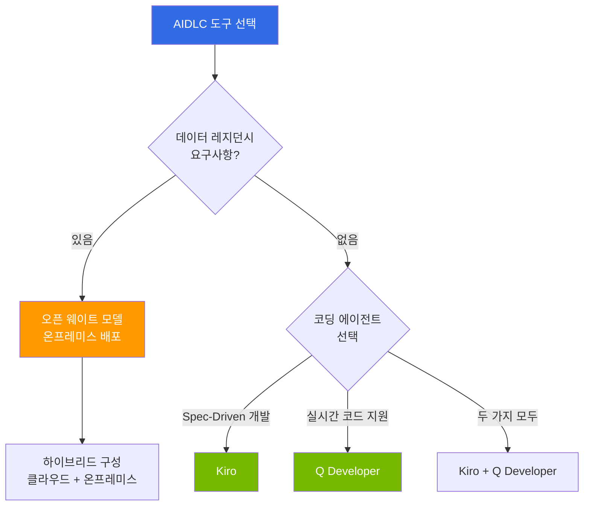

# AIDLC 도구 & 구현

> **읽는 시간**: 약 2분

AIDLC [방법론](/docs/aidlc/methodology)을 실제 프로젝트에서 구현하기 위한 도구와 기술 스택을 다룹니다. AI 코딩 에이전트부터 오픈 웨이트 모델 활용, EKS 기반 선언적 자동화, 기술 투자 로드맵까지 실무 수준의 가이드를 제공합니다.

## 구성

| 문서 | 핵심 내용 | 대상 독자 |
|------|----------|----------|
| [AI 코딩 에이전트](./ai-coding-agents.md) | Kiro Spec-Driven 개발, Q Developer, 에이전트 비교 | 개발자, 테크 리드 |
| [오픈 웨이트 모델](./open-weight-models.md) | 온프레미스 배포, 클라우드 vs 자체 호스팅 TCO, 데이터 레지던시 | 아키텍트, 보안 담당자 |
| [EKS 선언적 자동화](./eks-declarative-automation.md) | Managed Argo CD, ACK, KRO, Gateway API | 개발자, DevOps |
| [기술 로드맵](./technology-roadmap.md) | Build-vs-Wait 결정 매트릭스, 투자 계획 | CTO, 엔터프라이즈 아키텍트 |

## 도구 선택 의사결정

