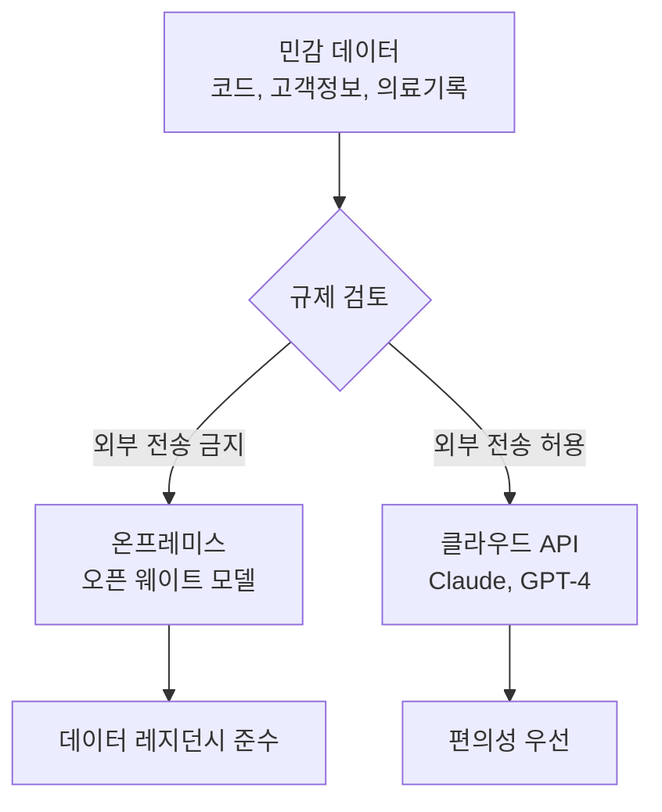
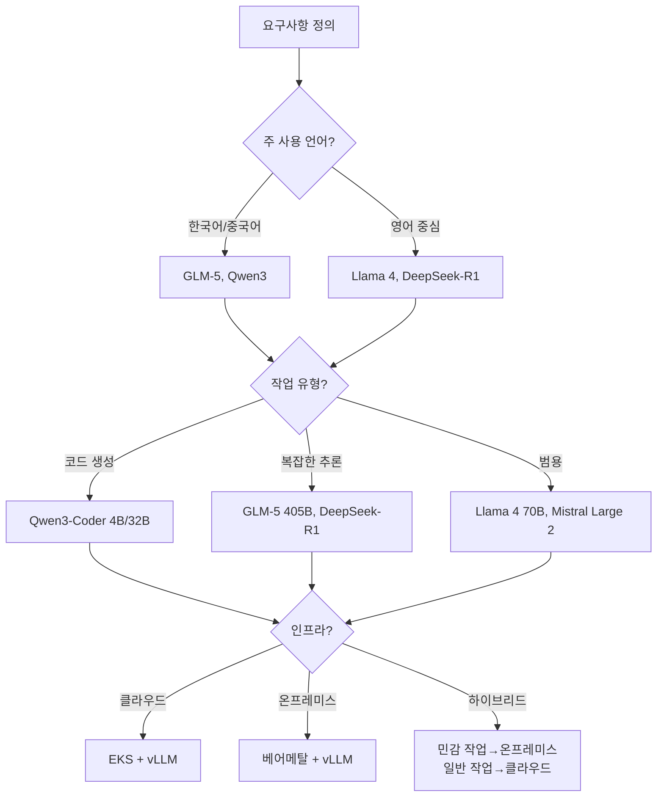
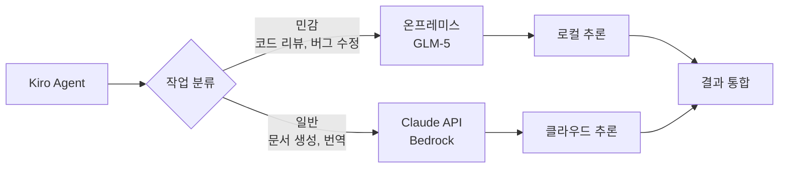
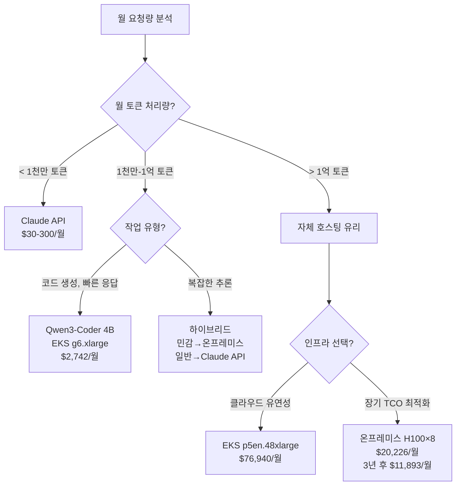

# 오픈 웨이트 모델

엔터프라이즈 환경에서 AI 개발 라이프사이클(AIDLC)을 운영할 때, 데이터 레지던시와 비용 효율성은 핵심 의사결정 요소입니다. 오픈 웨이트 모델은 클라우드 API(Claude, GPT-4) 대비 세 가지 차별화된 가치를 제공합니다: **데이터 주권 확보**, **예측 가능한 TCO**, **도메인 특화 커스터마이징**.

## 왜 오픈 웨이트 모델인가

### 세 가지 핵심 동인

#### 1. 데이터 레지던시 요구사항

금융, 의료, 공공 부문에서는 민감 데이터의 외부 전송이 규제로 제한됩니다.

- **컴플라이언스 의무**: GDPR, HIPAA, 금융권 개인정보보호법은 데이터 처리 위치를 엄격히 제한
- **내부 코드베이스 보호**: 소스 코드를 외부 API로 전송하지 않고 온프레미스에서 처리
- **주권 AI(Sovereign AI)**: 국가/기업이 AI 추론 인프라를 직접 통제



#### 2. 비용 최적화

월 수백만 토큰 이상 처리 시, 자체 호스팅 오픈 모델이 클라우드 API보다 저렴할 수 있습니다.

- **종량제 탈피**: API 호출당 과금 없이 고정 인프라 비용으로 전환
- **GPU 활용도 극대화**: 24시간 운영 환경에서 유휴 시간 최소화
- **손익 분기점**: 월 1억 토큰 이상 처리 시 자체 호스팅이 유리(GPU 타입에 따라 변동)

#### 3. 도메인 커스터마이징

오픈 웨이트 모델은 파인튜닝, 프롬프트 엔지니어링, 온톨로지 주입을 통해 특정 도메인에 최적화할 수 있습니다.

- **전문 용어 정확도 향상**: 의료, 법률, 금융 용어 처리 강화
- **출력 형식 제어**: JSON 스키마, 코드 스타일 가이드 준수
- **온톨로지 통합**: [온톨로지 엔지니어링](../methodology/ontology-engineering.md)과 결합하여 도메인 지식 주입

## 모델 랜드스케이프 (2026년 4월 기준)

| 모델 | 제공사 | 파라미터 | 주요 특징 | 라이선스 | 권장 배포 |
|------|--------|---------|----------|---------|----------|
| **GLM-5** | THUDM | 405B | 다국어(한/중/영) 강점, 수학/추론 성능 우수 | Apache 2.0 | p5en.48xlarge (H200×8) |
| **Qwen3-Coder** | Alibaba | 4B-32B | 코딩 특화, 빠른 추론 속도 | Apache 2.0 | g6.xlarge (L4×1) |
| **Qwen3-235B** | Alibaba | 235B | MoE 아키텍처, 멀티모달 | Apache 2.0 | p5.48xlarge (H100×8) |
| **DeepSeek-R1** | DeepSeek | 671B | CoT 추론 특화, RL 기반 학습 | MIT | p5en.48xlarge (H200×8) |
| **Llama 4** | Meta | 70B-405B | 넓은 생태계, 안정적 성능 | Llama 4 License | p4d.24xlarge (A100×8) |
| **Mistral Large 2** | Mistral | 123B | 유럽 데이터 주권 고려 설계 | Mistral License | p4d.24xlarge (A100×8) |

### 선택 기준



## 배포 패턴

### 패턴 1: EKS + vLLM 서빙 (클라우드)

클라우드 환경에서 오픈 모델을 서빙하여 데이터 레지던시는 유지하되 인프라 관리는 AWS에 위임합니다.

```yaml
# GLM-5 405B 배포 예시 (EKS Standard Mode)
apiVersion: apps/v1
kind: Deployment
metadata:
  name: glm5-vllm
spec:
  replicas: 1
  template:
    spec:
      nodeSelector:
        node.kubernetes.io/instance-type: p5en.48xlarge
      containers:
      - name: vllm
        image: vllm/vllm-openai:v0.18.2
        args:
        - --model
        - THUDM/glm-5-405b
        - --served-model-name
        - glm5
        - --tensor-parallel-size
        - "8"
        - --max-model-len
        - "8192"
        - --trust-remote-code
        resources:
          limits:
            nvidia.com/gpu: "8"
```

**장점**:
- Auto Scaling, Spot 인스턴스 활용으로 비용 절감
- Karpenter를 통한 동적 노드 프로비저닝
- CloudWatch, Prometheus 통합 모니터링

**단점**:
- GPU 인스턴스 시간당 비용 발생 (p5en.48xlarge: ~$98/h)
- 데이터는 VPC 내부에 머물지만 인프라는 클라우드 의존

### 패턴 2: 온프레미스 베어메탈 + vLLM

완전한 데이터 주권이 필요하거나 클라우드 송신이 금지된 환경에서 사용합니다.

```bash
# NVIDIA H100×8 서버에 vLLM 배포
docker run --gpus all \
  -p 8000:8000 \
  -v /data/models:/models \
  vllm/vllm-openai:v0.18.2 \
  --model /models/glm-5-405b \
  --served-model-name glm5 \
  --tensor-parallel-size 8 \
  --max-model-len 8192 \
  --trust-remote-code
```

**인프라 요구사항**:
- GLM-5 405B: H100 8장 or H200 8장 (FP16 ~810GB VRAM)
- Qwen3-Coder 4B: L4 1장 (FP16 ~8GB VRAM)
- 네트워크: 내부망 전용 엔드포인트, 외부 인터넷 불필요

**장점**:
- 절대적 데이터 통제
- 네트워크 레이턴시 최소화 (사내 10G 네트워크)
- 장기적으로 클라우드 비용 절감

**단점**:
- CapEx 부담 (H100 서버 ~$300K)
- 운영 인력 필요 (GPU 관리, 모델 업데이트)
- 유휴 시간에도 전력 소비

### 패턴 3: 하이브리드 구성

작업 민감도에 따라 온프레미스와 클라우드 API를 혼용합니다.



**구현 예시 (LiteLLM 라우팅)**:

```yaml
# litellm-config.yaml
model_list:
  - model_name: sensitive-tasks
    litellm_params:
      model: openai/glm5
      api_base: http://on-prem-vllm.internal:8000/v1
      api_key: dummy
  - model_name: general-tasks
    litellm_params:
      model: bedrock/anthropic.claude-sonnet-4-20250514
      aws_region_name: us-east-1

router_settings:
  routing_strategy: simple-shuffle
  fallbacks:
    - sensitive-tasks: []  # 폴백 없음 (외부 전송 금지)
    - general-tasks: [openai/gpt-4o]
```

## TCO 비교 프레임워크

### 비용 항목

#### 클라우드 API (Claude, GPT-4)

| 항목 | Claude Sonnet 4.5 | 비고 |
|------|-------------------|------|
| 입력 토큰 | $3/1M tokens | Bedrock 기준 |
| 출력 토큰 | $15/1M tokens | 출력이 입력보다 5배 비쌈 |
| 운영 인력 | $0 | 관리 불필요 |
| 초기 투자 | $0 | 종량제 |

**월 비용 계산 예시**:
- 월 5천만 입력 토큰, 1천만 출력 토큰 처리
- 입력: 50M × $3/1M = $150
- 출력: 10M × $15/1M = $150
- 합계: **$300/월**

#### 자체 호스팅 오픈 모델 (EKS + vLLM)

| 항목 | Qwen3-Coder 4B (g6.xlarge) | GLM-5 405B (p5en.48xlarge) |
|------|---------------------------|----------------------------|
| GPU 인스턴스 | $1.01/h × 730h = $737/월 | $98/h × 730h = $71,540/월 |
| 스토리지 (모델) | ~$5/월 (8GB) | ~$400/월 (810GB) |
| 네트워크 송신 | 내부 트래픽 무료 | 내부 트래픽 무료 |
| 운영 인력 | 0.2 FTE (~$2,000/월) | 0.5 FTE (~$5,000/월) |
| 합계 | **~$2,742/월** | **~$76,940/월** |

**온프레미스 베어메탈 (3년 상각)**:

| 항목 | H100×8 서버 | 비고 |
|------|------------|------|
| 하드웨어 | $300,000 / 36개월 = $8,333/월 | 초기 CapEx |
| 전력 | 10.2kW × $0.12/kWh × 730h = $893/월 | 지역별 전기료 변동 |
| 데이터센터 | ~$1,000/월 | 냉각, 공간 |
| 운영 인력 | 1 FTE (~$10,000/월) | 24/7 대응 |
| 합계 | **~$20,226/월** | 3년 후 하드웨어 비용 제외 시 ~$11,893/월 |

### 손익 분기점 가이드



**의사결정 기준**:

1. **월 1천만 토큰 미만**: Claude API 또는 GPT-4 사용 (관리 오버헤드 없음)
2. **월 1천만-1억 토큰**: 작업 유형과 민감도에 따라 하이브리드 구성
3. **월 1억 토큰 이상**: 자체 호스팅 검토 (EKS 또는 온프레미스)
4. **CapEx 투자 가능 + 3년 이상 운영 예정**: 온프레미스 베어메탈이 가장 저렴

## AIDLC 통합

### Kiro + 오픈 웨이트 모델

[AI 코딩 에이전트 Kiro](./ai-coding-agents.md)는 오픈 웨이트 모델을 백엔드로 사용하여 Spec-Driven 개발을 수행할 수 있습니다.

```typescript
// kiro-config.ts
export const kiroConfig = {
  models: {
    sensitive: {
      provider: 'vllm',
      endpoint: 'http://on-prem-vllm.internal:8000/v1',
      model: 'glm5',
      use_cases: ['code-review', 'security-audit', 'refactoring']
    },
    general: {
      provider: 'bedrock',
      model: 'anthropic.claude-sonnet-4-20250514',
      region: 'us-east-1',
      use_cases: ['documentation', 'translation', 'test-generation']
    }
  },
  routing: {
    strategy: 'by-file-path',
    rules: [
      { pattern: 'src/core/**', model: 'sensitive' },
      { pattern: 'docs/**', model: 'general' }
    ]
  }
};
```

### 스티어링 파일: 모델별 프롬프트 최적화

오픈 웨이트 모델은 훈련 데이터와 아키텍처가 다르므로, 동일한 프롬프트에도 다른 반응을 보일 수 있습니다.

**GLM-5용 스티어링 파일**:

```yaml
# .aider.glm5.yml
model: glm5
edit_format: diff
use_git: true
auto_commits: false
stream: true

# GLM-5는 중국어/한국어 혼용 시 더 나은 성능
prompts:
  system: |
    당신은 전문 소프트웨어 엔지니어입니다.
    코드 수정 시 반드시 unified diff 형식으로 응답하세요.
    변경 사항에 대한 설명은 한국어로 작성하되, 기술 용어는 영문 유지.
```

**Qwen3-Coder용 스티어링 파일**:

```yaml
# .aider.qwen3.yml
model: qwen3-coder
edit_format: whole
use_git: true

# Qwen3-Coder는 전체 파일 교체 방식이 더 안정적
prompts:
  system: |
    You are a coding assistant specialized in Python and TypeScript.
    Always return the complete modified file.
    Use type hints and follow PEP 8 style guide.
```

### 온톨로지 주입

[온톨로지 엔지니어링](../methodology/ontology-engineering.md)에서 구축한 도메인 온톨로지를 오픈 모델의 컨텍스트에 주입하여 정확도를 높입니다.

```python
# ontology_injection.py
from typing import Dict, List

class OntologyInjector:
    def __init__(self, ontology_path: str):
        self.ontology = self.load_ontology(ontology_path)
    
    def inject_context(self, prompt: str, domain: str) -> str:
        """도메인 온톨로지를 프롬프트에 추가"""
        domain_terms = self.ontology.get(domain, {})
        
        context = "# Domain Knowledge\n"
        for term, definition in domain_terms.items():
            context += f"- {term}: {definition}\n"
        
        return f"{context}\n# Task\n{prompt}"
    
    def load_ontology(self, path: str) -> Dict[str, Dict[str, str]]:
        # JSON/YAML 형식의 온톨로지 파일 로드
        pass

# 사용 예시
injector = OntologyInjector("/data/ontology/finance.yaml")
prompt = injector.inject_context(
    "다음 거래 기록을 분석하여 이상 패턴을 찾아주세요.",
    domain="finance"
)
```

**효과**:
- 금융 용어(예: 차익거래, 공매도) 해석 정확도 향상
- 도메인 특화 규칙(예: KYC, AML) 준수 강화
- Few-shot 예시 대신 온톨로지로 대체하여 토큰 절약

## 보안 및 컴플라이언스

### 모델 라이선스 검토

오픈 웨이트 모델이라도 라이선스에 따라 상업적 사용이 제한될 수 있습니다.

| 라이선스 | 상업적 사용 | 파생 모델 배포 | 주의사항 |
|---------|-----------|--------------|---------|
| **Apache 2.0** | ✅ 허용 | ✅ 허용 | 특허 보호 조항 포함 |
| **MIT** | ✅ 허용 | ✅ 허용 | 면책 고지 필수 |
| **Llama 4 License** | ✅ 허용 (MAU < 700M) | ⚠️ 제한적 | 대규모 서비스는 별도 협의 |
| **Mistral License** | ✅ 허용 | ⚠️ 제한적 | 파인튜닝 모델 배포 시 고지 |

**권장 프로세스**:
1. 법무팀과 라이선스 리뷰 (특히 Llama, Mistral)
2. 모델 출처 추적 (Hugging Face Model Card 확인)
3. 파인튜닝 시 데이터셋 라이선스도 함께 검토

### 출력 감사

오픈 모델은 훈련 데이터에 민감 정보가 포함되었을 가능성이 있으므로 출력 필터링이 필요합니다.

```python
# output_filter.py
import re
from typing import List

class OutputFilter:
    def __init__(self):
        self.patterns = [
            (r'\b\d{3}-\d{2}-\d{4}\b', '[SSN-REDACTED]'),  # 주민번호
            (r'\b[\w\.-]+@[\w\.-]+\.\w+\b', '[EMAIL-REDACTED]'),  # 이메일
            (r'\b\d{4}-\d{4}-\d{4}-\d{4}\b', '[CARD-REDACTED]')  # 카드번호
        ]
    
    def filter(self, text: str) -> str:
        """민감 정보 자동 제거"""
        for pattern, replacement in self.patterns:
            text = re.sub(pattern, replacement, text)
        return text
    
    def audit_log(self, text: str, redacted_count: int) -> None:
        """필터링 이력 기록"""
        # CloudWatch Logs 또는 S3로 전송
        pass
```

### AI 기본법 대응

유럽 AI Act, 한국 AI 기본법 등 규제에서는 고위험 AI 시스템(의료, 금융, 채용)의 경우 다음을 요구합니다:

1. **설명 가능성**: 모델 결정 근거 제공 (attention weights, RAG 출처)
2. **인간 감독**: 최종 의사결정은 사람이 수행
3. **편향 모니터링**: 인종, 성별, 연령별 출력 공정성 측정
4. **사고 대응 절차**: 모델 오작동 시 롤백 프로세스

**AIDLC 적용**:
- [거버넌스 프레임워크](../enterprise/governance-framework.md)에서 모델 거버넌스 정책 수립
- Langfuse를 통해 모든 추론 요청/응답 로깅
- 매 분기 편향 감사 수행 (예: [RAGAS](../../agentic-ai-platform/operations-mlops/ragas-evaluation.md) 평가)

## 참고 자료

### 내부 문서
- [거버넌스 프레임워크](../enterprise/governance-framework.md) — 데이터 주권 정책
- [비용 효과](../enterprise/cost-estimation.md) — TCO 계산 상세
- [AI 코딩 에이전트](./ai-coding-agents.md) — Kiro 통합 가이드
- [온톨로지 엔지니어링](../methodology/ontology-engineering.md) — 온톨로지 주입 패턴

### 모델 공식 문서
- [GLM-5 GitHub](https://github.com/THUDM/GLM-5) — Apache 2.0 라이선스
- [Qwen3 Model Card](https://huggingface.co/Qwen/Qwen3-235B) — MoE 아키텍처 상세
- [DeepSeek-R1 Paper](https://arxiv.org/abs/2501.12948) — RL 훈련 방법론
- [vLLM Documentation](https://docs.vllm.ai/en/v0.18.2/) — 서빙 최적화

### 비용 분석 도구
- [AWS Pricing Calculator](https://calculator.aws/) — EKS GPU 인스턴스 비용
- [Hugging Face LLM Leaderboard](https://huggingface.co/spaces/open-llm-leaderboard/open_llm_leaderboard) — 모델 성능 비교
- [LLM TCO Calculator](https://github.com/anthropics/llm-tco-calculator) — 자체 호스팅 vs API 비교

## 다음 단계

1. **Pilot 프로젝트**: 소규모 프로젝트에 Qwen3-Coder 4B 배포 (g6.xlarge 1대)
2. **비용 추적**: 2개월간 클라우드 API vs 자체 호스팅 TCO 비교
3. **민감도 분류**: 코드베이스를 민감/일반으로 분류하여 하이브리드 구성 설계
4. **거버넌스 정책**: [거버넌스 프레임워크](../enterprise/governance-framework.md)에 오픈 모델 사용 규칙 명시
5. **스케일 업**: Pilot 성공 시 GLM-5 405B 또는 DeepSeek-R1로 확장
