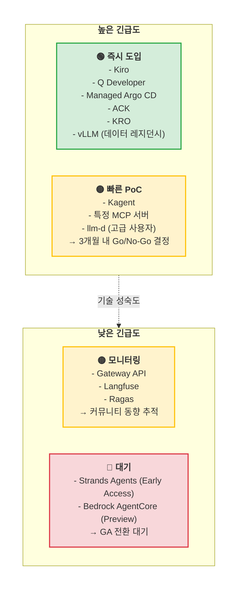
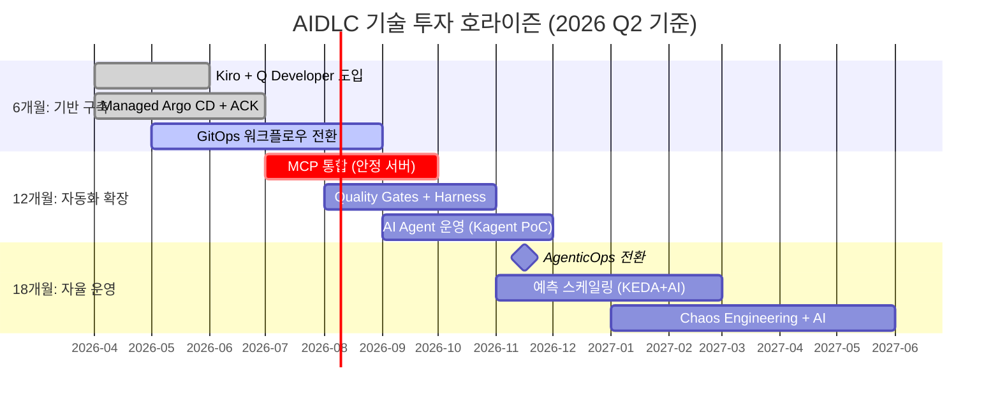

# 기술 로드맵

AIDLC를 지원하는 도구 생태계는 빠르게 진화하고 있습니다. **"지금 당장 구축할 것인가, 기술이 더 성숙할 때까지 기다릴 것인가"**는 매 분기 내려야 하는 핵심 의사결정입니다. 이 문서는 2026년 2분기 기준으로 AWS 및 오픈소스 AIDLC 도구의 성숙도를 평가하고, 투자 우선순위를 제시합니다.

## 1. 기술 투자의 딜레마

### 1.1 "지금 구축" vs "기다렸다가 도입"

AIDLC 구현 시 조직이 직면하는 대표적인 질문들:

**지금 구축해야 하는 경우:**
- 비즈니스 긴급도가 높고 기술이 이미 GA(General Availability) 상태
- 경쟁사 대비 개발 속도에서 뒤처지고 있는 상황
- 규제(데이터 레지던시, 컴플라이언스) 요구사항이 즉각 적용되어야 함
- 레거시 시스템 부채로 인해 수동 운영 비용이 급증 중

**기다려야 하는 경우:**
- 도구가 Early Access/Preview 단계로 API 변경 가능성 높음
- 벤더 종속 리스크가 크고 대안이 없는 상태
- 현재 팀의 기술 역량이 해당 도구 운영을 감당하기 어려움
- PoC 결과 ROI가 불명확하거나 기술 부채 증가 우려

:::tip 투자 결정 프레임워크
**긴급도 × 성숙도 매트릭스**(섹션 3 참조)를 활용하여 각 도구의 도입 시점을 결정합니다. **즉시 도입**(High 긴급도 + Stable 성숙도) 사분면에 속한 도구부터 시작하세요.
:::

### 1.2 2026년 기술 환경 특징

**성숙한 기술:**
- Kubernetes (v1.35 GA, DRA 포함)
- vLLM (v0.18+, PagedAttention v2)
- GitOps (Argo CD, Flux CD)
- ACK (50+ AWS 서비스 GA)
- Gateway API (v1.2 GA)

**빠르게 진화 중:**
- MCP (Model Context Protocol) 서버 생태계 (50+ 오픈소스 서버)
- AI 코딩 에이전트 (Kiro, Q Developer, Cursor, Windsurf)
- Kubernetes 오퍼레이터 (KRO, Kagent)
- 분산 추론 엔진 (llm-d v0.5, Dynamo v1.x)

**초기 단계:**
- Strands Agents SDK (Early Access)
- Bedrock AgentCore (Preview)
- Kagent (Early, 커뮤니티 주도)

---

## 2. 현재 도구 성숙도 평가 (2026 Q2 기준)

다음 표는 AIDLC 워크플로우를 지원하는 핵심 도구의 성숙도, 권장 사항, 대안 존재 여부를 정리한 것입니다.

| 도구 | 성숙도 | 권장 사항 | 비고 |
|------|--------|-----------|------|
| **Kiro** | GA | ✅ 즉시 도입 | Spec-driven 개발의 핵심. MCP 통합. 대안: Cursor Composer, Windsurf Flows |
| **Q Developer** | GA | ✅ 즉시 도입 | AWS 네이티브, 실시간 코드 생성. 대안: GitHub Copilot, Cursor |
| **Managed Argo CD** | GA | ✅ 즉시 도입 | EKS 네이티브 GitOps. 대안: Flux CD (자체 호스팅) |
| **ACK (AWS Controllers for Kubernetes)** | GA (50+ services) | ✅ 즉시 도입 | 선언적 AWS 리소스 관리. 대안: Crossplane |
| **KRO (Kubernetes Resource Orchestrator)** | GA | ✅ 즉시 도입 | 복잡한 Kubernetes 리소스 그래프 자동화. 대안: Helm, Kustomize |
| **Gateway API + LBC v3** | GA | ✅ 즉시 도입 | ExtProc 지원, AI Gateway 구축 기반. 대안: Istio + EnvoyFilter |
| **MCP Servers** | 50+ GA | 🟡 선택적 도입 | 도구별 성숙도 차이 큼. 실험 후 안정화된 것만 도입. [mcp.run](https://mcp.run) 참조 |
| **Kagent** | Early | 🟠 실험 단계 | K8s AI Agent 자동화. 프로덕션 적용 전 충분한 테스트 필요. 대안: kubectl + 스크립트 |
| **Strands Agents SDK** | GA | ✅ 커스텀 에이전트 시 | Bedrock Agents + CDK 기반. 대안: LangGraph, CrewAI |
| **vLLM** | v0.18+ (Mature) | ✅ 데이터 레지던시 시 | 오픈 웨이트 모델 서빙. 대안: TensorRT-LLM, SGLang |
| **llm-d** | v0.5+ (GA) | 🟡 고급 사용자 | Disaggregated Serving, NIXL KV 전송. 대안: Ray Serve, vLLM multi-instance |
| **Dynamo** | v1.x (GA) | 🟡 고급 사용자 | NVIDIA 엔터프라이즈 추론 플랫폼. 대안: vLLM, TensorRT-LLM |
| **Langfuse** | v3.x (GA) | ✅ 즉시 도입 | Self-hosted 관찰성. 대안: LangSmith (SaaS), Helicone |
| **Ragas** | v0.2+ (GA) | ✅ 즉시 도입 | AI Agent 평가 프레임워크. 대안: PromptFoo, TruLens |

:::info 성숙도 범례
- **GA**: 프로덕션 사용 가능, API 안정성 보장
- **Early**: 기능은 작동하나 API 변경 가능성 있음
- **Preview**: AWS 프리뷰 서비스, 실험 용도
:::

### 2.1 도구별 세부 평가

#### Kiro (Spec-Driven 개발)
- **성숙도**: GA (2025년 11월 정식 출시)
- **강점**: 요구사항 → 코드 자동 생성, MCP 통합, Git 커밋까지 완전 자동화
- **약점**: 벤더 종속(AWS 전용), 초기 학습 곡선
- **권장**: 신규 마이크로서비스 개발부터 시작, Mob Elaboration 리추얼과 결합
- **대안**: Cursor Composer(멀티 클라우드), Windsurf Flows(IDE 독립)

자세한 내용은 **[AI 코딩 에이전트](./ai-coding-agents.md)** 참조.

#### Q Developer
- **성숙도**: GA (2024년 출시, 지속 업데이트)
- **강점**: AWS 서비스 코드 생성 최적화, IDE 통합 우수, 무료 티어 제공
- **약점**: 비AWS 환경에서는 GitHub Copilot보다 약함
- **권장**: AWS 중심 조직은 표준 도구로 도입
- **대안**: GitHub Copilot(범용), Cursor(AI-first IDE)

#### Managed Argo CD
- **성숙도**: GA (2024년 re:Invent 발표)
- **강점**: EKS 네이티브, AWS 관리형, IAM 통합
- **약점**: 벤더 종속(AWS 전용), 커뮤니티 플러그인 일부 미지원
- **권장**: 신규 EKS 클러스터는 Managed Argo CD 우선 검토
- **대안**: Flux CD(자체 호스팅), Jenkins X(레거시)

#### MCP Servers
- **성숙도**: 서버별 차이 큼 (50+ 서버 중 20여 개 안정)
- **강점**: 표준화된 컨텍스트 전달, 50+ 오픈소스 서버
- **약점**: 서버 품질 편차 큼, 프로덕션 보안 검증 필요
- **권장**: 안정성 검증된 서버만 도입 (예: `@modelcontextprotocol/server-filesystem`, `@modelcontextprotocol/server-github`)
- **대안**: 직접 API 통합 (MCP 없이)

MCP 서버 목록 및 평가: [mcp.run](https://mcp.run)

#### Kagent
- **성숙도**: Early (2025년 오픈소스 공개)
- **강점**: K8s AI Agent 자동화, Mob Construction 워크플로우 실험
- **약점**: 커뮤니티 주도 프로젝트, 엔터프라이즈 지원 없음
- **권장**: 샌드박스 환경에서 실험, 프로덕션 도입 전 충분한 검증 필요
- **대안**: kubectl + bash 스크립트, Helm hooks

---

## 3. Build-vs-Wait 결정 매트릭스

다음 2x2 매트릭스는 **비즈니스 긴급도**와 **기술 성숙도**를 기준으로 도구 도입 전략을 제시합니다.

### 3.1 사분면별 전략

#### 🟢 즉시 도입 (높은 긴급도 + 안정 기술)
- **특징**: GA 상태, API 안정성 보장, 레퍼런스 아키텍처 존재
- **접근법**: 신규 프로젝트부터 적용, 3개월 내 전사 확산 로드맵 수립
- **리스크**: 낮음 (벤더 지원 보장, 커뮤니티 활성화)
- **예시 도구**: Kiro, Q Developer, Managed Argo CD, ACK, KRO

#### 🟡 빠른 PoC (높은 긴급도 + 초기 기술)
- **특징**: 기능은 작동하나 API 변경 가능성, 엔터프라이즈 지원 미흡
- **접근법**: 샌드박스에서 3개월 PoC → Go/No-Go 결정
- **리스크**: 중간 (기술 부채 가능성, API 마이그레이션 필요할 수 있음)
- **예시 도구**: Kagent, 특정 MCP 서버, llm-d (고급 사용자)

#### 🟡 모니터링 (낮은 긴급도 + 안정 기술)
- **특징**: GA 상태이나 현재 비즈니스 우선순위가 낮음
- **접근법**: 커뮤니티 동향 추적, 분기별 재평가
- **리스크**: 낮음 (경쟁사 격차 발생 시 빠르게 따라잡기 가능)
- **예시 도구**: Gateway API, Langfuse, Ragas

#### 🔴 대기 (낮은 긴급도 + 초기 기술)
- **특징**: Preview/Early Access 단계, 비즈니스 긴급도 낮음
- **접근법**: GA 전환 시점까지 대기, 벤치마킹만 진행
- **리스크**: 낮음 (대기 비용 < 조기 도입 리스크)
- **예시 도구**: Strands Agents (Early Access), Bedrock AgentCore (Preview)

---

## 4. 투자 호라이즌: 6개월 / 12개월 / 18개월

다음 타임라인은 AIDLC 도입의 **단계별 투자 우선순위**를 보여줍니다.

### 4.1 Phase 1: 기반 구축 (6개월)

**목표**: AI 코딩 도구 + GitOps 기반 구축, AIOps 성숙도 Level 2 → 3

| 주요 활동 | 도구 | 산출물 |
|----------|------|--------|
| AI 코딩 에이전트 도입 | Q Developer, Kiro | 개발 속도 30% 향상 |
| Spec-Driven 워크플로우 시범 운영 | Kiro + MCP | Mob Elaboration 리추얼 정착 |
| GitOps 전환 | Managed Argo CD + ACK | 배포 자동화율 80%+ |
| 선언적 인프라 관리 | KRO + ACK | Terraform 의존도 50% 감소 |

**성공 지표:**
- 코드 생성 자동화율 30%+ (Q Developer)
- 배포 리드 타임 50% 감소 (GitOps)
- 수동 인프라 변경 건수 70% 감소 (ACK)

### 4.2 Phase 2: 자동화 확장 (12개월)

**목표**: AI/CD 파이프라인 전환, AIOps 성숙도 Level 3 → 4

| 주요 활동 | 도구 | 산출물 |
|----------|------|--------|
| MCP 통합 확대 | 안정화된 MCP 서버 5+ | AI Agent 컨텍스트 자동 주입 |
| Quality Gates 구축 | Ragas + Harness | AI 출력 품질 자동 검증 |
| AI Agent 자동화 PoC | Kagent, Strands Agents | Mob Construction 실험 |
| 관찰성 AI 통합 | Langfuse + ADOT | LLMOps 메트릭 자동 수집 |

**성공 지표:**
- AI Agent 자율 작업 비율 15%+ (Kagent)
- Quality Gate 통과율 90%+ (Ragas)
- 인시던트 감지 시간 70% 단축 (AI 관찰성)

### 4.3 Phase 3: 자율 운영 (18개월)

**목표**: AgenticOps 전환, AIOps 성숙도 Level 4+ (자율 운영)

| 주요 활동 | 도구 | 산출물 |
|----------|------|--------|
| AgenticOps 전환 | Kagent + Strands Agents | 운영 자동화율 60%+ |
| 예측 스케일링 | KEDA + AI 예측 모델 | 리소스 낭비 30% 감소 |
| Chaos Engineering + AI | Chaos Mesh + AI Agent | 장애 자동 복구 시나리오 |
| 지속적 개선 루프 | Langfuse + Ragas | 주간 자동 성능 리포트 |

**성공 지표:**
- 운영 자동화율 60%+ (AI Agent)
- 예측 스케일링 정확도 85%+ (KEDA + AI)
- 장애 자동 복구율 40%+ (Chaos + AI)

:::tip 호라이즌별 투자 우선순위
- **6개월**: 즉시 ROI 가능한 도구 (Kiro, Q Developer, Argo CD)
- **12개월**: 자동화 확장 (MCP, Quality Gates)
- **18개월**: 자율 운영 (AgenticOps, 예측 스케일링)
:::

---

## 5. 벤더 종속 리스크 평가

AIDLC 도구 선택 시 **벤더 종속 리스크**와 **이식성(Portability)**을 함께 고려해야 합니다.

| 도구 | 벤더 종속 리스크 | 대안 존재 여부 | 이식성 |
|------|-----------------|----------------|--------|
| **Kiro** | 🔴 높음 (AWS 전용) | ✅ Cursor, Windsurf | 낮음 (spec → code 재작성 필요) |
| **Q Developer** | 🔴 높음 (AWS 전용) | ✅ GitHub Copilot, Cursor | 중간 (IDE 교체 가능) |
| **Managed Argo CD** | 🟡 중간 (EKS 전용) | ✅ Flux CD, 자체 Argo CD | 높음 (Git 기반, K8s 표준) |
| **ACK** | 🟡 중간 (AWS 전용) | ✅ Crossplane, Terraform | 낮음 (CRD → 다른 IaC 마이그레이션 필요) |
| **KRO** | 🟢 낮음 (K8s 표준) | ✅ Helm, Kustomize | 높음 (K8s 표준 CRD) |
| **Gateway API** | 🟢 낮음 (K8s 표준) | ✅ Istio, Envoy | 높음 (K8s 표준 API) |
| **vLLM** | 🟢 낮음 (오픈소스) | ✅ TensorRT-LLM, SGLang | 높음 (OpenAI 호환 API) |
| **Langfuse** | 🟢 낮음 (오픈소스) | ✅ LangSmith, Helicone | 높음 (OTel 표준) |

### 5.1 벤더 종속 완화 전략

#### 멀티 클라우드 준비 (Multi-Cloud Ready)
- **Kiro 대신 Cursor**: 멀티 클라우드 환경에서는 Cursor Composer 고려
- **ACK 대신 Crossplane**: AWS 외 클라우드도 지원해야 하면 Crossplane 검토
- **GitOps 기반 유지**: Argo CD/Flux CD 모두 Git을 단일 진실 소스로 사용하여 이식성 확보

#### 오픈소스 우선 원칙
- **vLLM, Langfuse, Ragas**: 오픈소스 도구는 벤더 종속 없음
- **MCP**: 표준 프로토콜로 멀티 벤더 지원

#### 점진적 전환 계획
- **Phase 1**: AWS 네이티브 도구로 빠르게 시작 (Kiro, Q Developer, Managed Argo CD)
- **Phase 2**: 벤더 중립 도구로 점진 교체 (필요 시)
- **Phase 3**: 멀티 클라우드 아키텍처 전환 (비즈니스 필요 시)

:::warning 벤더 종속 리스크 주의
**Kiro + Q Developer + Managed Argo CD** 조합은 강력하지만, **AWS 종속**이 높습니다. 멀티 클라우드 전략이 필요하면 초기부터 **Cursor + GitHub Copilot + Flux CD** 조합을 고려하세요.
:::

---

## 6. 투자 계획 템플릿

프로젝트 규모와 조직 성숙도에 따라 권장하는 도구 조합입니다.

### 6.1 소규모 팀 (5~20명, 마이크로서비스 3~10개)

**핵심 도구:**
- Q Developer (AI 코딩)
- Managed Argo CD (GitOps)
- ACK (AWS 리소스 자동화)
- Langfuse (Self-hosted 관찰성)

**예상 투자:**
- 초기 구축: 2~3개월
- 연간 라이선스: $0 (오픈소스 + AWS 관리형)
- 인프라 비용: ~$500/월 (Langfuse 호스팅)

**ROI 예상:**
- 개발 속도 30% 향상 (Q Developer)
- 배포 리드 타임 50% 감소 (GitOps)

### 6.2 중규모 조직 (50~200명, 마이크로서비스 20~100개)

**핵심 도구:**
- Kiro + Q Developer (Spec-driven + AI 코딩)
- Managed Argo CD + ACK + KRO (GitOps + 리소스 오케스트레이션)
- vLLM (오픈 웨이트 모델 서빙, 데이터 레지던시)
- Langfuse + Ragas (LLMOps + 평가)
- MCP 서버 5+ (안정화된 것만)

**예상 투자:**
- 초기 구축: 6~9개월
- 연간 라이선스: $0~50k (엔터프라이즈 지원 선택 시)
- 인프라 비용: ~$5k/월 (GPU 추론, Langfuse, MCP)

**ROI 예상:**
- 개발 속도 50% 향상 (Kiro + Q Developer)
- 배포 자동화율 80%+ (GitOps + ACK)
- 운영 비용 30% 감소 (AI Agent 자동화)

### 6.3 대규모 엔터프라이즈 (200명+, 마이크로서비스 100개+)

**핵심 도구:**
- Kiro + Q Developer + Cursor (하이브리드 AI 코딩)
- Managed Argo CD + ACK + KRO (GitOps + 리소스 오케스트레이션)
- vLLM + llm-d (분산 추론)
- Kagent + Strands Agents (AI Agent 자동화)
- Langfuse + Ragas + Harness (LLMOps + Quality Gates)
- MCP 서버 10+ (커스텀 서버 포함)
- Gateway API + LBC v3 (AI Gateway)

**예상 투자:**
- 초기 구축: 12~18개월
- 연간 라이선스: $100k~500k (엔터프라이즈 지원, 커스텀 MCP)
- 인프라 비용: ~$50k/월 (멀티 리전 GPU, 고가용성)

**ROI 예상:**
- 개발 속도 70% 향상 (AI 코딩 + Spec-driven)
- 배포 자동화율 90%+ (GitOps + AI Agent)
- 운영 비용 50% 감소 (AgenticOps)
- 인시던트 감지 시간 80% 단축 (AI 관찰성)

---

## 7. 투자 의사결정 체크리스트

도구 도입 전 다음 질문에 답하세요:

### 7.1 비즈니스 정합성
- [ ] 이 도구가 해결하는 문제가 현재 조직의 Top 3 우선순위에 포함되는가?
- [ ] 도입하지 않을 경우 비즈니스 임팩트는? (경쟁사 격차, 규제 위반 등)
- [ ] 예상 ROI 회수 기간은? (6개월 이내 권장)

### 7.2 기술 성숙도
- [ ] 도구가 GA(General Availability) 상태인가?
- [ ] 레퍼런스 아키텍처가 존재하는가?
- [ ] 커뮤니티가 활성화되어 있는가? (GitHub Stars, 포럼 활동)
- [ ] 벤더 지원이 보장되는가?

### 7.3 조직 준비도
- [ ] 팀이 해당 도구를 운영할 기술 역량을 보유하는가?
- [ ] 3개월 내 PoC를 완료할 리소스가 있는가?
- [ ] 도구 도입 후 유지보수 책임자가 명확한가?

### 7.4 리스크 평가
- [ ] 벤더 종속 리스크가 수용 가능한가?
- [ ] 대안이 존재하는가? (Exit 전략)
- [ ] 보안/컴플라이언스 요구사항을 충족하는가?

:::tip 의사결정 프레임워크
위 체크리스트에서 **80% 이상 Yes**면 즉시 도입, **50~80%**면 PoC 후 결정, **50% 미만**이면 대기 권장.
:::

---

## 8. 다음 단계

### 8.1 관련 문서

- **[AI 코딩 에이전트](./ai-coding-agents.md)** — Kiro, Q Developer, Cursor 비교 및 도입 전략
- **[오픈 웨이트 모델 서빙](./open-weight-models.md)** — vLLM, llm-d, 데이터 레지던시 고려사항
- **[도입 전략](../enterprise/adoption-strategy.md)** — 조직별 단계적 도입 로드맵
- **[비용 효과 분석](../enterprise/cost-estimation.md)** — AIDLC 도구 투자 ROI 계산

### 8.2 실천 가이드

1. **현재 상태 평가**: [섹션 2](#2-현재-도구-성숙도-평가-2026-q2-기준)의 도구 목록에서 조직이 이미 사용 중인 것 체크
2. **긴급도 × 성숙도 매트릭스 작성**: [섹션 3](#3-build-vs-wait-결정-매트릭스)의 템플릿을 활용하여 조직별 맞춤 매트릭스 작성
3. **6개월 투자 계획 수립**: [섹션 4.1](#41-phase-1-기반-구축-6개월)의 Phase 1 활동을 조직 우선순위에 맞게 조정
4. **PoC 실행**: 즉시 도입 사분면에 속한 도구부터 3개월 PoC 시작

:::info 분기별 재평가
AIDLC 도구 생태계는 빠르게 변화합니다. **분기마다 이 문서를 재검토**하여 성숙도 평가를 업데이트하세요.
:::

---

## 참고 자료

**AIDLC 공식 문서:**
- [AWS AI-DLC Method Definition](https://prod.d13rzhkk8cj2z0.amplifyapp.com/)
- [AWS Labs AIDLC Workflows (GitHub)](https://github.com/awslabs/aidlc-workflows)

**도구 평가 참고:**
- [MCP Servers 목록](https://mcp.run)
- [CNCF Technology Radar](https://radar.cncf.io/)
- [ThoughtWorks Technology Radar](https://www.thoughtworks.com/radar)

**ROI 계산 도구:**
- [AWS Pricing Calculator](https://calculator.aws/)
- [Managed Argo CD Pricing](https://aws.amazon.com/eks/pricing/)
