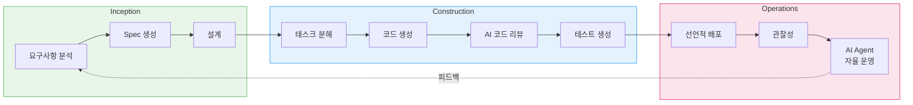
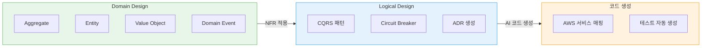

import { AidlcPhaseMapping, EksCapabilities, ProductivityMetrics, AidlcPrinciples, AidlcPhaseActivities, AiCodingAgentComparison, QualityGates, AiAgentEcosystem, DetailedMetrics, AidlcPipeline, AidlcArtifacts } from '@site/src/components/AidlcTables';

# AIDLC 프레임워크 — EKS 환경에서의 AI 주도 개발·운영 고도화

> 📅 **작성일**: 2026-02-12 | ⏱️ **읽는 시간**: 약 30분 | 📌 **기준 환경**: EKS 1.35+, Kiro, Managed Argo CD

---

## 1. 개요

### 1.1 왜 AIDLC인가

전통적 소프트웨어 개발 라이프사이클(SDLC)은 사람 중심의 장기 반복 주기(주/월 단위)를 전제로 설계되었습니다. 데일리 스탠드업, 스프린트 리뷰, 회고 같은 리추얼은 이 긴 주기에 최적화된 것입니다. AI의 등장으로 이 전제가 무너집니다.

AI는 요구사항 분석, 태스크 분해, 코드 생성, 테스트까지 **시간/일 단위**로 수행합니다. 기존 SDLC에 AI를 끼워 넣는(Retrofit) 접근은 이 잠재력을 제한합니다 — 마치 자동차 시대에 더 빠른 마차를 만드는 것과 같습니다.

**AIDLC(AI-Driven Development Lifecycle)**는 AWS Labs가 제시한 방법론으로, AI를 **첫 원칙(First Principles)**에서 재구성하여 개발 라이프사이클의 핵심 협력자로 통합합니다.

```
전통적 SDLC                          AIDLC
━━━━━━━━━━━━━━                      ━━━━━━━━━━━━━━━━━━━
사람이 계획하고 실행                    AI가 제안하고, 사람이 검증
주/월 단위 반복 (Sprint)               시간/일 단위 반복 (Bolt)
설계 기법은 팀 선택                     DDD/BDD/TDD를 방법론에 내장
역할 사일로 (FE/BE/DevOps)            AI로 역할 경계 초월
수동 요구사항 분석                      AI가 Intent를 Unit으로 분해
순차적 핸드오프                         연속 흐름 + Loss Function 검증
```

### 1.2 AIOps 전략과의 연결

[AIOps 전략 가이드](./aiops-introduction.md)에서 다룬 AWS 오픈소스 전략 → MCP 통합 → AI 도구 → Kiro 오케스트레이션은 AIDLC를 실현하는 **기술 기반**입니다. [지능형 관찰성 스택](./aiops-observability-stack.md)에서 구축한 3-Pillar + AI 분석 레이어는 Operations 단계의 **데이터 기반**입니다. 이 문서는 그 기술·데이터 기반 위에서 **개발과 운영을 체계적으로 고도화하는 방법론**을 제시합니다.

```
[Doc 1] AIOps 전략 ──── 기술 기반 (MCP, Kiro, AI Agent)
           │
[Doc 2] 관찰성 스택 ──── 데이터 기반 (ADOT, AMP/AMG, CloudWatch AI)
           │
[Doc 3] AIDLC 프레임워크 ── 방법론 (이 문서)
           │
[Doc 4] 예측 운영 ──────── 심화 (ML 예측, 자동 복구, Chaos)
```

:::info 원문 참조
AIDLC의 핵심 개념은 AWS Labs의 [AI-DLC Method Definition](https://prod.d13rzhkk8cj2z0.amplifyapp.com/)에서 정의됩니다. 이 문서는 해당 방법론을 EKS 환경에서 실용적으로 구현하는 가이드입니다.
:::

---

## 2. AIDLC 핵심 개념

### 2.1 10대 원칙

<AidlcPrinciples />

이 중 EKS 환경에서 특히 중요한 3가지:

- **Reverse the Conversation Direction** — AI가 EKS 클러스터 상태를 MCP로 수집하고, 배포 계획을 먼저 제안합니다. 개발자는 Google Maps의 운전자처럼 목적지(Intent)를 설정하고, AI가 제시하는 경로를 검증합니다.
- **Integration of Design Techniques** — DDD를 방법론 핵심에 내장하여, AI가 비즈니스 로직을 Aggregate, Entity, Value Object로 자동 모델링합니다. Scrum에서 "팀이 알아서 선택"하던 설계 기법이 AI-DLC에서는 필수 코어입니다.
- **Minimize Stages, Maximize Flow** — 핸드오프를 최소화하고 연속 흐름을 구현합니다. 각 단계의 사람 검증은 **Loss Function** 역할로, 하류에 전파될 오류를 조기에 차단합니다.

### 2.2 핵심 산출물 (Artifacts)

AI-DLC는 전통적 SDLC의 용어를 AI 시대에 맞게 재정의합니다.

```
┌─────────┐    ┌─────────┐    ┌─────────┐
│  Intent  │───▶│  Unit   │───▶│  Bolt   │
│ 고수준 목적│    │독립 작업단위│   │빠른 반복 │
│          │    │(DDD Sub- │   │(Sprint  │
│비즈니스 목표│   │ domain)  │   │ 대체)   │
└─────────┘    └─────────┘    └─────────┘
                    │
              ┌─────┴─────┐
              ▼           ▼
        ┌──────────┐ ┌──────────┐
        │ Domain   │ │ Logical  │
        │ Design   │ │ Design   │
        │비즈니스 로직│ │NFR+패턴  │
        └──────────┘ └──────────┘
              │           │
              └─────┬─────┘
                    ▼
            ┌──────────────┐
            │ Deployment   │
            │    Unit      │
            │컨테이너+Helm+ │
            │  Terraform   │
            └──────────────┘
```

<AidlcArtifacts />

:::tip Context Memory와 추적성
모든 산출물은 **Context Memory**로 저장되어 AI가 라이프사이클 전체에서 참조합니다. 산출물 간 양방향 추적(Domain Model ↔ User Story ↔ 테스트 계획)이 보장되어, AI가 항상 정확한 맥락에서 작업합니다.
:::

### 2.3 AI 주도 재귀적 워크플로우

AI-DLC의 핵심은 **AI가 계획을 제안하고 사람이 검증하는 재귀적 정제** 과정입니다.

```
Intent (비즈니스 목적)
  │
  ▼
AI: Level 1 Plan 생성 ◀──── 사람: 검증 · 수정
  │
  ├─▶ Step 1 ──▶ AI: Level 2 분해 ◀── 사람: 검증
  │                 ├─▶ Sub-task 1.1 ──▶ AI 실행 ◀── 사람: 검증
  │                 └─▶ Sub-task 1.2 ──▶ AI 실행 ◀── 사람: 검증
  │
  ├─▶ Step 2 ──▶ AI: Level 2 분해 ◀── 사람: 검증
  │                 └─▶ ...
  └─▶ Step N ──▶ ...

[모든 산출물 → Context Memory → 양방향 추적성]
```

각 단계의 사람 검증은 **Loss Function**입니다 — 오류를 조기에 포착하여 하류 전파를 방지합니다. AI가 경로별(신규 개발, 리팩터링, 결함 수정) 고정 워크플로우를 규정하지 않고, 상황에 맞는 Level 1 Plan을 제안하는 유연한 접근입니다.

### 2.4 AIDLC 3단계 개관

AIDLC는 **Inception**, **Construction**, **Operations** 3단계로 구성됩니다.

<AidlcPhaseMapping />



<AidlcPhaseActivities />

---

## 3. Inception 단계 — 요구사항에서 설계까지

### 3.1 Mob Elaboration

Inception의 핵심 리추얼은 **Mob Elaboration**입니다 — Product Owner, 개발자, QA가 한 방에 모여 AI와 협업하는 요구사항 정제 세션입니다.

```
┌──────────────────────────────────────────────────┐
│              Mob Elaboration 리추얼                │
├──────────────────────────────────────────────────┤
│                                                   │
│  [AI] Intent를 User Story + Unit으로 분해 제안     │
│    ↓                                              │
│  [PO + Dev + QA] 검토 · 과잉/부족 설계 조정        │
│    ↓                                              │
│  [AI] 수정 반영 → NFR · Risk 추가 생성             │
│    ↓                                              │
│  [팀] 최종 검증 → Bolt 계획 확정                    │
│                                                   │
├──────────────────────────────────────────────────┤
│  산출물:                                          │
│  PRFAQ · User Stories · NFR 정의                  │
│  Risk Register · 측정 기준 · Bolt 계획             │
└──────────────────────────────────────────────────┘
```

기존 방법론에서 **수 주~수 개월** 걸리던 순차적 요구사항 분석을 AI가 초안을 생성하고 팀이 동시에 검토함으로써 **수 시간**으로 압축합니다.

### 3.2 Kiro Spec-Driven Inception

Kiro는 Mob Elaboration의 산출물을 **Spec 파일**로 체계화합니다. 자연어 요구사항에서 코드까지의 전체 과정을 구조화합니다.

```
requirements.md → design.md → tasks.md → 코드 생성 → 검증
```

**EKS 예시: Payment Service 배포**

`requirements.md`:

```markdown
# Payment Service 배포 요구사항

## 기능 요구사항
- REST API 엔드포인트: /api/v1/payments
- DynamoDB 테이블과 연동
- SQS를 통한 비동기 이벤트 처리

## 비기능 요구사항
- P99 레이턴시: < 200ms
- 가용성: 99.95%
- 자동 스케일링: 2-20 Pod
- EKS 1.35+ 호환
```

`design.md`:

```markdown
# Payment Service 아키텍처

## 인프라 구성
- EKS Deployment (3 replicas min)
- ACK DynamoDB Table (on-demand)
- ACK SQS Queue (FIFO)
- HPA (CPU 70%, Memory 80%)
- Karpenter NodePool (graviton, spot)

## 관찰성
- ADOT sidecar (traces → X-Ray)
- Application Signals (SLI/SLO 자동)
- CloudWatch Logs (/eks/payment-service)

## 보안
- Pod Identity (IRSA 대체)
- NetworkPolicy (namespace 격리)
- Secrets Manager CSI Driver
```

`tasks.md`:

```markdown
# 구현 태스크

## Bolt 1: 인프라
- [ ] ACK DynamoDB Table CRD 작성
- [ ] ACK SQS Queue CRD 작성
- [ ] KRO ResourceGroup 정의 (DynamoDB + SQS 통합)
- [ ] Karpenter NodePool 설정 (graviton, spot)

## Bolt 2: 애플리케이션
- [ ] Go REST API 구현
- [ ] DynamoDB SDK 연동
- [ ] SQS consumer 구현
- [ ] Dockerfile + multi-stage build

## Bolt 3: 배포
- [ ] Helm chart 작성
- [ ] Argo CD Application 정의
- [ ] HPA manifest 작성
- [ ] NetworkPolicy 작성

## Bolt 4: 관찰성
- [ ] ADOT sidecar 설정
- [ ] Application Signals annotation
- [ ] CloudWatch 대시보드
- [ ] SLO 알림 설정
```

:::tip Spec-Driven의 핵심 가치
**디렉팅 방식**: "DynamoDB 만들어줘" → "SQS도 필요해" → "이제 배포해줘" → 매번 수동 지시, 맥락 유실 위험
**Spec-Driven**: Kiro가 requirements.md를 분석 → design.md 생성 → tasks.md 분해 → 코드 자동 생성 → 검증까지 일관된 Context Memory로 연결
:::

### 3.3 MCP 기반 실시간 컨텍스트 수집

Kiro는 MCP 네이티브로, Inception 단계에서 AWS Hosted MCP 서버를 통해 실시간 인프라 상태를 수집합니다.

```
[Kiro + MCP 상호작용]

Kiro: "EKS 클러스터 상태 확인"
  → EKS MCP Server: get_cluster_status()
  → 응답: { version: "1.35", nodes: 5, status: "ACTIVE" }

Kiro: "비용 분석"
  → Cost Analysis MCP Server: analyze_cost(service="EKS")
  → 응답: { monthly: "$450", recommendations: [...] }

Kiro: "현재 워크로드 분석"
  → EKS MCP Server: list_deployments(namespace="payment")
  → 응답: { deployments: [...], resource_usage: {...} }
```

이를 통해 design.md 생성 시 **현재 클러스터 상태와 비용을 반영한 설계**가 가능합니다. MCP 통합 아키텍처의 상세는 [AIOps 전략 가이드 — MCP 통합 인터페이스](./aiops-introduction.md)를 참조하세요.

---

## 4. Construction 단계 — 설계에서 코드까지

### 4.1 DDD 통합: Domain Design에서 Logical Design까지

AI-DLC에서 DDD는 **선택사항이 아닌 방법론의 내장 요소**입니다. AI가 비즈니스 로직을 자동으로 DDD 원칙에 따라 모델링합니다.



**Payment Service 예시**:

1. **Domain Design** — AI가 비즈니스 로직 모델링
   - Aggregate: `Payment` (transactionId, amount, status)
   - Entity: `PaymentMethod`, `Customer`
   - Value Object: `Money`, `Currency`
   - Domain Event: `PaymentCreated`, `PaymentCompleted`, `PaymentFailed`

2. **Logical Design** — NFR 적용 + 아키텍처 패턴 선택
   - CQRS: 결제 생성(Command) / 조회(Query) 분리
   - Circuit Breaker: 외부 결제 게이트웨이 호출
   - ADR: "DynamoDB on-demand vs provisioned" 의사결정 기록

3. **코드 생성** — AWS 서비스 매핑
   - Aggregate → EKS Deployment + DynamoDB Table
   - Domain Event → SQS FIFO Queue
   - Circuit Breaker → Envoy sidecar + Istio

개발자는 각 단계에서 AI가 생성한 모델을 **검증·조정**합니다. 이 검증이 Loss Function 역할을 합니다.

### 4.2 Mob Construction

Construction의 핵심 리추얼은 **Mob Construction**입니다. 팀이 한 방에 모여 각자의 Unit을 개발하며, Domain Design 단계에서 생성한 통합 사양(Integration Specification)을 교환합니다.

```
[Mob Construction 흐름]

Team A: Payment Unit        Team B: Notification Unit
  │                            │
  ├─ Domain Design 완료        ├─ Domain Design 완료
  │                            │
  └────── 통합 사양 교환 ──────┘
          (Domain Event 계약)
  │                            │
  ├─ Logical Design            ├─ Logical Design
  ├─ 코드 생성                  ├─ 코드 생성
  ├─ 테스트                    ├─ 테스트
  └─ Bolt 전달                 └─ Bolt 전달
```

각 Unit은 느슨하게 결합되어 **병렬 개발**이 가능하며, Domain Event를 통해 통합됩니다. AI가 통합 테스트도 자동 생성합니다.

:::warning Brown-field (기존 시스템) 접근
기존 시스템에 기능 추가나 리팩터링을 수행하는 경우, Construction 단계에 **추가 스텝**이 필요합니다:

1. AI가 기존 코드를 **시맨틱 모델로 역공학** (코드 → 모델 승격)
   - **Static Model**: 컴포넌트, 책임, 관계
   - **Dynamic Model**: 주요 유스케이스의 컴포넌트 상호작용
2. 개발자가 역공학된 모델을 검증·수정
3. 이후 Green-field와 동일한 Construction 흐름 진행

이를 통해 AI가 기존 시스템의 맥락을 정확히 파악한 상태에서 변경을 수행합니다.
:::

### 4.3 AI 코딩 에이전트

AIDLC Construction 단계에서 활용하는 AI 코딩 에이전트들입니다. Amazon Q Developer와 Kiro는 **Anthropic Claude** 모델을 사용하며, Kiro는 오픈 웨이트 모델도 지원하여 비용 최적화와 특수 도메인 확장이 가능합니다.

<AiCodingAgentComparison />

### 4.4 EKS Capabilities 기반 선언적 자동화

EKS Capabilities(2025.11)는 인기 있는 오픈소스 도구를 AWS 관리형으로 제공하여, Construction 단계의 산출물을 선언적으로 배포합니다.

<EksCapabilities />

#### 4.4.1 Managed Argo CD — GitOps

Managed Argo CD는 GitOps를 AWS 인프라에서 관리형으로 운영합니다. Kiro가 생성한 코드를 Git에 푸시하면 자동으로 EKS에 배포됩니다. Application CRD로 단일 환경을, ApplicationSet으로 멀티 환경(dev/staging/production)을 선언적으로 관리합니다.

#### 4.4.2 ACK — AWS 리소스 선언적 관리

ACK는 50+ AWS 서비스를 K8s CRD로 선언적으로 관리합니다. Kiro가 생성한 Domain Design의 인프라 요소(DynamoDB, SQS, S3 등)를 `kubectl apply`로 배포하며, Argo CD의 GitOps 워크플로우에 자연스럽게 통합됩니다.

:::info ACK의 핵심 가치
ACK를 사용하면 **클러스터 외부의 AWS 리소스도 K8s 선언적 모델로 관리**할 수 있습니다. DynamoDB, SQS, S3, RDS 등을 K8s CRD로 생성/수정/삭제하며, 이것이 "K8s를 중심으로 모든 인프라를 선언적으로 관리"하는 전략입니다.
:::

#### 4.4.3 KRO — 복합 리소스 오케스트레이션

KRO는 여러 K8s 리소스를 **단일 배포 단위(ResourceGroup)**로 묶습니다. AIDLC의 Deployment Unit 개념과 직접 매핑되어, Deployment + Service + HPA + ACK 리소스를 하나의 Custom Resource로 생성합니다.

#### 4.4.4 LBC v3 Gateway API

AWS Load Balancer Controller v3는 Gateway API를 GA로 전환하며 L4(NLB) + L7(ALB) 라우팅, QUIC/HTTP3, JWT 검증, 헤더 변환을 제공합니다. Gateway + HTTPRoute CRD로 트래픽을 선언적으로 관리합니다.

:::tip EKS Capabilities + AIDLC 시너지
Managed Argo CD(배포) + ACK(인프라) + KRO(오케스트레이션) + LBC v3(네트워킹)이 결합되면, Kiro가 Spec에서 생성한 모든 산출물을 **Git Push 한 번으로 전체 스택 배포**가 가능합니다. 이것이 Construction → Operations 전환의 핵심입니다.
:::

### 4.5 MCP 기반 IaC 자동화 파이프라인

Kiro와 AWS Hosted MCP 서버를 결합하면, Inception의 Spec에서 Construction의 IaC까지 자동으로 생성하고 Argo CD로 배포합니다.

<AidlcPipeline />

---

## 5. Operations 단계 — 배포에서 자율 운영까지

### 5.1 관찰성 기반 — Doc 2 연결

Operations 단계의 데이터 기반은 [지능형 관찰성 스택](./aiops-observability-stack.md)에서 구축한 5-Layer 아키텍처입니다.

```
[관찰성 스택 → Operations 연결]

Collection Layer (ADOT, CloudWatch Agent, NFM Agent)
      ↓
Transport Layer (OTLP, Prometheus Remote Write)
      ↓
Storage Layer (AMP, CloudWatch, X-Ray)
      ↓
Analysis Layer (AMG, CloudWatch AI, DevOps Guru)
      ↓
Action Layer ← AIDLC Operations가 여기에 위치
  ├── MCP 기반 통합 분석
  ├── AI Agent 자동 대응
  └── 예측 스케일링
```

관찰성 스택에서 수집한 메트릭·로그·트레이스가 MCP를 통해 AI 도구와 Agent에 전달되어, Operations 단계의 의사결정 기반이 됩니다.

### 5.2 AI Agent 운영 자동화

<AiAgentEcosystem />

#### 5.2.1 Amazon Q Developer (GA)

가장 성숙한 프로덕션 패턴입니다. CloudWatch Investigations와 EKS 트러블슈팅에서 즉시 활용 가능합니다.

- **CloudWatch Investigations**: AI가 메트릭 이상을 감지하고 근본 원인을 분석
- **EKS 트러블슈팅**: 클러스터 상태, Pod 장애, 노드 문제를 자연어로 진단
- **보안 스캔**: 코드 취약점 탐지 + 자동 수정 제안

#### 5.2.2 Strands Agents (OSS)

AWS 프로덕션 검증을 거친 에이전트 SDK로, **Agent SOPs(Standard Operating Procedures)**를 자연어로 정의합니다.

```python
# Strands Agent SOP: Pod CrashLoopBackOff 대응
from strands import Agent
from strands.tools import eks_tool, cloudwatch_tool, slack_tool

ops_agent = Agent(
    name="eks-incident-responder",
    model="bedrock/anthropic.claude-sonnet",
    tools=[eks_tool, cloudwatch_tool, slack_tool],
    sop="""
    ## Pod CrashLoopBackOff 대응 SOP

    1. 장애 Pod 식별
       - kubectl get pods --field-selector=status.phase!=Running
       - 네임스페이스, Pod 이름, 재시작 횟수 기록

    2. 로그 분석
       - kubectl logs <pod> --previous
       - 에러 패턴 분류: OOM, ConfigError, DependencyFailure

    3. 근본 원인 진단
       - OOM → 메모리 limits 확인
       - ConfigError → ConfigMap/Secret 확인
       - DependencyFailure → 의존 서비스 상태 확인

    4. 자동 대응
       - OOM이고 limits < 2Gi → limits를 1.5배로 패치 (자동)
       - ConfigError → Slack 알림 + 담당자 멘션 (수동)
       - DependencyFailure → 의존 서비스 재시작 시도 (자동)

    5. 사후 보고
       - Slack #incidents 채널에 인시던트 보고서 게시
    """
)
```

#### 5.2.3 Kagent (K8s Native)

K8s CRD로 AI 에이전트를 선언적으로 관리합니다. MCP 통합(kmcp)을 지원하지만 아직 초기 단계입니다.

```yaml
# Kagent Agent 정의
apiVersion: kagent.dev/v1alpha1
kind: Agent
metadata:
  name: eks-ops-agent
  namespace: kagent-system
spec:
  description: "EKS 운영 자동화 에이전트"
  modelConfig:
    provider: bedrock
    model: anthropic.claude-sonnet
    region: ap-northeast-2
  systemPrompt: |
    EKS 클러스터 운영 에이전트입니다.
    Pod 장애, 노드 문제, 스케일링 이슈를 자동으로 진단하고 대응합니다.
    항상 안전한 조치만 수행하며, 위험한 변경은 승인을 요청합니다.
  tools:
    - name: kubectl
      type: kmcp
      config:
        server: kubernetes.default.svc
        namespace: "*"
        allowedVerbs: ["get", "describe", "logs", "top"]
    - name: cloudwatch
      type: kmcp
      config:
        region: ap-northeast-2
        actions: ["GetMetricData", "DescribeAlarms"]
```

:::tip 도입 순서
Q Developer(GA)의 완전 관리형 분석을 **먼저 도입**하고, Strands(OSS)의 SOP 기반 워크플로우를 추가한 후, Kagent(초기 단계)의 K8s 네이티브 접근을 점진적으로 확장하세요. [AIOps 전략 가이드](./aiops-introduction.md)의 성숙도 모델 Level 3→4 전환과 연계됩니다.
:::

### 5.3 CI/CD에서 AI/CD로

AIDLC에서 배포 파이프라인은 기존 CI/CD를 AI가 강화하는 **AI/CD**로 진화합니다.

```
[CI/CD → AI/CD 전환]

기존 CI/CD:
  코드 커밋 → 빌드 → 테스트 → 수동 승인 → 배포

AI/CD:
  Spec 커밋 → AI 코드 생성 → AI 보안 스캔 → AI 리뷰
     → Loss Function 검증 (사람) → Argo CD 자동 배포
     → AI 관찰성 모니터링 → AI Agent 자동 대응
```

핵심 전환점:
- **코드 커밋** → **Spec 커밋** (requirements.md가 트리거)
- **수동 승인** → **AI 리뷰 + Loss Function 검증** (사람은 의사결정에 집중)
- **수동 모니터링** → **AI Agent 자율 대응** (MCP 기반 통합 분석)

:::info Operations 심화
ML 기반 예측 스케일링, Karpenter + AI 예측, Chaos Engineering + AI 학습 등 Operations 단계의 심화 패턴은 [예측 스케일링 및 자동 복구](./aiops-predictive-operations.md)에서 다룹니다.
:::

---

## 6. Quality Gates — 전 단계 품질 보증

AI-DLC에서 사람 검증은 **Loss Function**입니다 — 각 단계에서 오류를 조기에 포착하여 하류 전파를 방지합니다. Quality Gates는 이 Loss Function을 체계화한 것입니다.

```
Inception          Construction          Operations
    │                   │                    │
    ▼                   ▼                    ▼
[Mob Elaboration    [DDD Model         [배포 전 검증]
 산출물 검증]        검증]
    │                   │                    │
    ▼                   ▼                    ▼
[Spec 정합성]      [코드 + 보안 스캔]    [SLO 기반 모니터링]
    │                   │                    │
    ▼                   ▼                    ▼
[NFR 충족 여부]    [테스트 커버리지]     [AI Agent 대응 검증]
```

<QualityGates />

### 6.1 AI 기반 PR 리뷰 자동화

```yaml
# .github/workflows/ai-review.yml
name: AI Code Review
on:
  pull_request:
    types: [opened, synchronize]

jobs:
  ai-review:
    runs-on: ubuntu-latest
    steps:
      - uses: actions/checkout@v4
        with:
          fetch-depth: 0

      - name: Q Developer Security Scan
        uses: aws/amazon-q-developer-action@v1
        with:
          scan-type: security
          source-path: .

      - name: K8s Manifest Validation
        run: |
          kube-linter lint deploy/ --config .kube-linter.yaml

      - name: Terraform Validation
        if: contains(github.event.pull_request.changed_files, 'terraform/')
        run: |
          cd terraform/
          terraform init -backend=false
          terraform validate
          tflint --recursive
```

---

## 7. 측정 지표

### 7.1 AIDLC 생산성 메트릭

AIDLC 도입 효과를 측정하기 위한 핵심 지표입니다.

<ProductivityMetrics />

### 7.2 상세 측정 항목 및 DORA 매핑

<DetailedMetrics />

---

## 8. 마무리

### 8.1 도입 로드맵

```
Phase 1: AI 코딩 도구 도입
  └── Q Developer/Copilot으로 코드 생성·리뷰 시작
      (AIOps 성숙도 Level 2)

Phase 2: Spec-Driven 개발
  └── Kiro + MCP로 체계적 requirements → 코드 워크플로우
      Mob Elaboration 리추얼 시범 도입
      (AIOps 성숙도 Level 3)

Phase 3: 선언적 자동화
  └── Managed Argo CD + ACK + KRO로 GitOps 완성
      AI/CD 파이프라인 전환
      (AIOps 성숙도 Level 3→4)

Phase 4: AI Agent 확장
  └── Q Developer + Strands + Kagent로 자율 운영
      Mob Construction 리추얼 확산
      (AIOps 성숙도 Level 4)
```

### 8.2 다음 단계

- **[예측 스케일링 및 자동 복구](./aiops-predictive-operations.md)** — Operations 단계 심화: ML 기반 예측 스케일링, AI Agent 자동 인시던트 대응, Chaos Engineering
- **[지능형 관찰성 스택](./aiops-observability-stack.md)** — Operations 단계의 데이터 기반: ADOT, AMP/AMG, CloudWatch AI 구축
- **[AIOps 전략 가이드](./aiops-introduction.md)** — AIDLC의 기술 기반: AWS 오픈소스 전략, MCP 통합, AI 도구 생태계

### 8.3 학습 경로

```
[이전] AIOps 전략 가이드 — 기술 기반 이해 (MCP, Kiro, AI Agent)
     ↓
[이전] 지능형 관찰성 스택 — 데이터 기반 구축 (ADOT, AMP/AMG)
     ↓
[현재] AIDLC 프레임워크 — 방법론 실천 (이 문서)
     ↓
[다음] 예측 스케일링 및 자동 복구 — 자율 운영 심화
```

:::info 참고 자료
- [AWS AI-DLC Method Definition](https://prod.d13rzhkk8cj2z0.amplifyapp.com/) — AIDLC 원문 (Raja SP, AWS)
- [AWS AI-Driven Development Life Cycle Blog](https://aws.amazon.com/blogs/devops/ai-driven-development-life-cycle/)
- [AWS Labs AIDLC Workflows (GitHub)](https://github.com/awslabs/aidlc-workflows)
- [EKS Capabilities (2025.11)](https://aws.amazon.com/blogs/containers/)
- [Strands Agents SDK](https://github.com/strands-agents/sdk-python)
- [Kagent - Kubernetes AI Agent](https://github.com/kagent-dev/kagent)
:::
