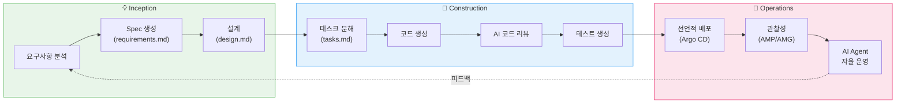
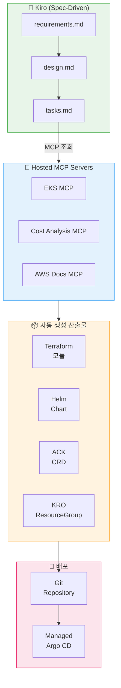

import { AidlcPhaseMapping, EksCapabilities, ProductivityMetrics } from '@site/src/components/AidlcTables';

# AIDLC 프레임워크 - AI 주도 개발 라이프사이클

> 📅 **작성일**: 2026-02-12 | ⏱️ **읽는 시간**: 약 30분 | 📌 **기준 환경**: EKS 1.35+, Kiro, Managed Argo CD

---

## 1. 개요

### 1.1 SDLC에서 AIDLC로

전통적 소프트웨어 개발 라이프사이클(SDLC)은 요구사항 → 설계 → 구현 → 테스트 → 배포 → 운영의 선형적 흐름을 따릅니다. AI 도구의 등장으로 이 과정은 근본적으로 변화합니다.

**AIDLC(AI-Driven Development Lifecycle)**는 AWS Labs가 제시한 방법론으로, AI 에이전트가 개발 라이프사이클의 각 단계에 깊이 통합되어 생산성과 품질을 동시에 향상시킵니다.

```
SDLC (전통적)                    AIDLC (AI 주도)
━━━━━━━━━━━━━━                  ━━━━━━━━━━━━━━━━
요구사항 (수동)          →        Inception (AI 분석 + Spec 생성)
설계 (수동)             →        Construction (AI 코드 생성 + 리뷰)
구현 (수동)             →        Construction (Kiro Spec → 코드)
테스트 (수동/CI)        →        Quality Gates (AI 검증)
배포 (CI/CD)           →        Operations (Managed Argo CD + MCP)
운영 (수동 모니터링)     →        Operations (AI Agent 자율 운영)
```

### 1.2 AIDLC의 핵심 원칙

| 원칙 | 설명 |
|------|------|
| **Spec-Driven** | 자연어 스펙에서 코드가 자동 생성됨 |
| **AI-Augmented** | 모든 단계에서 AI가 보조하거나 주도함 |
| **Programmatic** | 디렉팅(수동 지시) 대신 프로그래머틱 자동화 |
| **Continuous** | 개발-배포-운영이 끊김 없이 연결됨 |
| **Observable** | 모든 단계의 결과가 측정되고 피드백됨 |

:::info 이 문서의 범위
AIDLC 3단계(Inception → Construction → Operations)를 EKS 환경에서 구현하는 방법을 다룹니다. Kiro의 Spec-driven 개발, EKS Capabilities(Managed Argo CD, ACK, KRO)를 활용한 선언적 자동화, AI Agent를 통한 운영 자동화 확장을 중심으로 설명합니다.
:::

---

## 2. AIDLC 3단계

AIDLC는 **Inception**, **Construction**, **Operations** 3단계로 구성됩니다.

<AidlcPhaseMapping />



### 2.1 Inception 단계

| 활동 | AI 도구 | 산출물 |
|------|---------|--------|
| 요구사항 분석 | Kiro, Q Developer | `requirements.md` |
| 아키텍처 설계 | Kiro, Claude | `design.md` |
| 기술 스택 결정 | Kiro (MCP 기반 AWS 서비스 탐색) | 기술 스택 문서 |
| 비용 추정 | Cost Analysis MCP | 비용 산정서 |

### 2.2 Construction 단계

| 활동 | AI 도구 | 산출물 |
|------|---------|--------|
| 태스크 분해 | Kiro | `tasks.md` |
| 코드 생성 | Kiro, Q Developer, Copilot | 소스 코드 |
| 코드 리뷰 | Q Developer (Security Scan) | 리뷰 코멘트 |
| 테스트 생성 | Kiro, Q Developer | 테스트 코드 |
| IaC 생성 | Kiro + AWS MCP | Terraform, Helm |

### 2.3 Operations 단계

| 활동 | AI 도구 | 산출물 |
|------|---------|--------|
| GitOps 배포 | Managed Argo CD | 자동 배포 |
| 관찰성 분석 | AMP/AMG + CloudWatch AI | 대시보드, 알림 |
| 이상 탐지 | DevOps Guru, CloudWatch | 인사이트 |
| 자동 대응 | Kagent, Strands, Q Developer | 자동 복구 |
| 인프라 관리 | ACK + KRO | K8s CRD 기반 관리 |

---

## 3. Kiro: Spec-Driven 개발

### 3.1 Kiro의 핵심 워크플로우

Kiro는 **Spec-driven 개발**을 통해 자연어 요구사항에서 코드까지의 전체 과정을 체계화합니다.

```
requirements.md → design.md → tasks.md → 코드 생성 → 검증
```

이 워크플로우의 각 단계는 명확한 산출물을 가지며, AI가 각 단계를 자동화합니다.

### 3.2 Spec 예시: EKS 서비스 배포

**`requirements.md`** (요구사항):

```markdown
# Payment Service 배포 요구사항

## 기능 요구사항
- REST API 엔드포인트: /api/v1/payments
- DynamoDB 테이블과 연동
- SQS를 통한 비동기 이벤트 처리

## 비기능 요구사항
- P99 레이턴시: < 200ms
- 가용성: 99.95%
- 자동 스케일링: 2-20 Pod
- EKS 1.35+ 호환
```

**`design.md`** (설계):

```markdown
# Payment Service 아키텍처

## 인프라 구성
- EKS Deployment (3 replicas min)
- ACK DynamoDB Table (on-demand)
- ACK SQS Queue (FIFO)
- HPA (CPU 70%, Memory 80%)
- Karpenter NodePool (graviton, spot)

## 관찰성
- ADOT sidecar (traces → X-Ray)
- Application Signals (SLI/SLO 자동)
- CloudWatch Logs (/eks/payment-service)

## 보안
- Pod Identity (IRSA 대체)
- NetworkPolicy (namespace 격리)
- Secrets Manager CSI Driver
```

**`tasks.md`** (태스크):

```markdown
# 구현 태스크

## Phase 1: 인프라
- [ ] ACK DynamoDB Table CRD 작성
- [ ] ACK SQS Queue CRD 작성
- [ ] KRO ResourceGroup 정의 (DynamoDB + SQS 통합)
- [ ] Karpenter NodePool 설정 (graviton, spot)

## Phase 2: 애플리케이션
- [ ] Go REST API 구현
- [ ] DynamoDB SDK 연동
- [ ] SQS consumer 구현
- [ ] Dockerfile + multi-stage build

## Phase 3: 배포
- [ ] Helm chart 작성
- [ ] Argo CD Application 정의
- [ ] HPA manifest 작성
- [ ] NetworkPolicy 작성

## Phase 4: 관찰성
- [ ] ADOT sidecar 설정
- [ ] Application Signals annotation
- [ ] CloudWatch 대시보드
- [ ] SLO 알림 설정
```

:::tip 프로그래머틱 vs 디렉팅
**디렉팅 방식**: "DynamoDB 테이블 만들어줘" → "SQS도 필요해" → "이제 배포해줘" → 매번 수동 지시
**프로그래머틱 방식**: Kiro가 requirements.md를 분석 → design.md 생성 → tasks.md 분해 → 코드 자동 생성 → 검증까지 자동. **비용 효율적이고 빠른 대응이 가능합니다.**
:::

### 3.3 MCP 네이티브 통합

Kiro는 MCP(Model Context Protocol) 네이티브로, AWS Hosted MCP 서버를 통해 실시간으로 AWS 서비스와 상호작용합니다.

```
[Kiro + MCP 상호작용]

Kiro: "EKS 클러스터 상태 확인"
  → EKS MCP Server: get_cluster_status()
  → 응답: { version: "1.35", nodes: 5, status: "ACTIVE" }

Kiro: "비용 분석"
  → Cost Analysis MCP Server: analyze_cost(service="EKS")
  → 응답: { monthly: "$450", recommendations: [...] }

Kiro: "Terraform 코드 생성"
  → AWS Docs MCP Server: get_terraform_examples(resource="dynamodb")
  → Kiro: Terraform 코드 자동 생성 + 검증
```

---

## 4. AI 코딩 에이전트

### 4.1 Amazon Q Developer

Amazon Q Developer는 AWS에 최적화된 AI 코딩 에이전트입니다.

| 기능 | 설명 |
|------|------|
| **코드 생성** | AWS SDK, CDK, Terraform 코드 자동 생성 |
| **Security Scan** | 코드 보안 취약점 자동 탐지 |
| **코드 변환** | Java 8→17, .NET Framework→.NET Core 등 |
| **CloudWatch Investigations** | 운영 이슈 AI 분석 |
| **EKS 트러블슈팅** | kubectl 명령어 제안, YAML 오류 수정 |

### 4.2 GitHub Copilot

```yaml
# .github/copilot-instructions.md - EKS 프로젝트 가이드
# Copilot에게 EKS 관련 코딩 컨벤션을 알려줍니다

project_context:
  platform: EKS 1.35+
  language: Go 1.22
  infrastructure: Terraform + ACK
  deployment: Argo CD
  observability: ADOT + AMP

conventions:
  - Use structured logging (slog)
  - All HTTP handlers return proper status codes
  - Use context.Context for cancellation
  - Kubernetes resources use labels: app, version, team
```

### 4.3 AI 코딩 에이전트 비교

| 기능 | Amazon Q Developer | GitHub Copilot | Kiro |
|------|-------------------|----------------|------|
| **AWS 서비스 이해** | ★★★★★ | ★★★ | ★★★★ (MCP) |
| **Spec-driven 개발** | ★★ | ★★ | ★★★★★ |
| **보안 스캔** | ★★★★★ | ★★★ | ★★★ |
| **MCP 통합** | ★★★★ | ★★ | ★★★★★ |
| **EKS 운영** | ★★★★★ | ★★ | ★★★★ |
| **비용** | Pro $19/월 | Business $19/월 | 별도 |

---

## 5. EKS Capabilities + GitOps

### 5.1 EKS Capabilities (2025.11)

EKS Capabilities는 인기 있는 오픈소스 도구를 AWS 관리형으로 제공합니다.

<EksCapabilities />

### 5.2 Managed Argo CD

Managed Argo CD는 GitOps를 AWS 인프라에서 관리형으로 운영합니다.

```yaml
# Argo CD Application 정의
apiVersion: argoproj.io/v1alpha1
kind: Application
metadata:
  name: payment-service
  namespace: argocd
spec:
  project: default
  source:
    repoURL: https://github.com/my-org/payment-service
    targetRevision: main
    path: deploy/overlays/production
  destination:
    server: https://kubernetes.default.svc
    namespace: payment
  syncPolicy:
    automated:
      prune: true
      selfHeal: true
    syncOptions:
      - CreateNamespace=true
      - PrunePropagationPolicy=foreground
    retry:
      limit: 5
      backoff:
        duration: 5s
        factor: 2
        maxDuration: 3m
```

**ApplicationSet으로 멀티 환경 관리**:

```yaml
apiVersion: argoproj.io/v1alpha1
kind: ApplicationSet
metadata:
  name: payment-service-set
spec:
  generators:
    - list:
        elements:
          - cluster: dev
            namespace: payment-dev
            values:
              replicas: "1"
          - cluster: staging
            namespace: payment-staging
            values:
              replicas: "2"
          - cluster: production
            namespace: payment-prod
            values:
              replicas: "3"
  template:
    metadata:
      name: 'payment-{{cluster}}'
    spec:
      source:
        repoURL: https://github.com/my-org/payment-service
        targetRevision: main
        path: 'deploy/overlays/{{cluster}}'
      destination:
        server: https://kubernetes.default.svc
        namespace: '{{namespace}}'
      syncPolicy:
        automated:
          prune: true
          selfHeal: true
```

### 5.3 ACK (AWS Controllers for Kubernetes)

ACK는 50+ AWS 서비스를 K8s CRD로 선언적으로 관리합니다.

```yaml
# ACK로 DynamoDB 테이블 생성
apiVersion: dynamodb.services.k8s.aws/v1alpha1
kind: Table
metadata:
  name: payment-transactions
  namespace: payment
spec:
  tableName: payment-transactions
  billingMode: PAY_PER_REQUEST
  attributeDefinitions:
    - attributeName: transactionId
      attributeType: S
    - attributeName: createdAt
      attributeType: N
  keySchema:
    - attributeName: transactionId
      keyType: HASH
    - attributeName: createdAt
      keyType: RANGE
  tags:
    - key: Environment
      value: production
    - key: ManagedBy
      value: ACK
```

```yaml
# ACK로 SQS 큐 생성
apiVersion: sqs.services.k8s.aws/v1alpha1
kind: Queue
metadata:
  name: payment-events
  namespace: payment
spec:
  queueName: payment-events.fifo
  fifoQueue: true
  contentBasedDeduplication: true
  visibilityTimeout: 60
  messageRetentionPeriod: 1209600
  tags:
    Environment: production
    ManagedBy: ACK
```

:::info ACK의 핵심 가치
ACK를 사용하면 **클러스터 외부의 AWS 리소스도 K8s 선언적 모델로 관리**할 수 있습니다. DynamoDB, SQS, S3, RDS 등을 `kubectl apply`로 생성/수정/삭제하며, Argo CD의 GitOps 워크플로우에 자연스럽게 통합됩니다. 이것이 "K8s를 중심으로 모든 인프라를 선언적으로 관리"하는 전략입니다.
:::

### 5.4 KRO (Kubernetes Resource Orchestrator)

KRO는 여러 K8s 리소스를 **단일 배포 단위(ResourceGroup)**로 묶어 관리합니다.

```yaml
# KRO ResourceGroup: 애플리케이션 + 인프라를 하나로
apiVersion: kro.run/v1alpha1
kind: ResourceGroup
metadata:
  name: payment-service
spec:
  schema:
    apiVersion: v1alpha1
    kind: PaymentService
    spec:
      name:
        type: string
      replicas:
        type: integer
        default: 3
      environment:
        type: string
        default: production
  resources:
    # 1. Deployment
    - id: deployment
      template:
        apiVersion: apps/v1
        kind: Deployment
        metadata:
          name: ${schema.spec.name}
        spec:
          replicas: ${schema.spec.replicas}
          selector:
            matchLabels:
              app: ${schema.spec.name}
          template:
            metadata:
              labels:
                app: ${schema.spec.name}
            spec:
              containers:
                - name: app
                  image: my-registry/${schema.spec.name}:latest

    # 2. Service
    - id: service
      template:
        apiVersion: v1
        kind: Service
        metadata:
          name: ${schema.spec.name}
        spec:
          selector:
            app: ${schema.spec.name}
          ports:
            - port: 80
              targetPort: 8080

    # 3. HPA
    - id: hpa
      template:
        apiVersion: autoscaling/v2
        kind: HorizontalPodAutoscaler
        metadata:
          name: ${schema.spec.name}
        spec:
          scaleTargetRef:
            apiVersion: apps/v1
            kind: Deployment
            name: ${schema.spec.name}
          minReplicas: ${schema.spec.replicas}
          maxReplicas: 20
          metrics:
            - type: Resource
              resource:
                name: cpu
                target:
                  type: Utilization
                  averageUtilization: 70

    # 4. ACK DynamoDB Table
    - id: dynamodb
      template:
        apiVersion: dynamodb.services.k8s.aws/v1alpha1
        kind: Table
        metadata:
          name: ${schema.spec.name}-data
        spec:
          tableName: ${schema.spec.name}-data
          billingMode: PAY_PER_REQUEST
          attributeDefinitions:
            - attributeName: id
              attributeType: S
          keySchema:
            - attributeName: id
              keyType: HASH
```

사용 시:

```yaml
# 이 한 줄로 Deployment + Service + HPA + DynamoDB 전체 생성
apiVersion: v1alpha1
kind: PaymentService
metadata:
  name: payment-v2
spec:
  name: payment-v2
  replicas: 3
  environment: production
```

### 5.5 LBC v3 Gateway API GA (2025.01)

AWS Load Balancer Controller v3는 Gateway API를 GA로 전환하며 L4(NLB: TCPRoute, UDPRoute, TLSRoute) + L7(ALB: HTTPRoute, GRPCRoute) 라우팅, QUIC/HTTP3, JWT 검증 등을 제공합니다.

```yaml
# Gateway API 기반 라우팅
apiVersion: gateway.networking.k8s.io/v1
kind: Gateway
metadata:
  name: payment-gateway
  annotations:
    alb.ingress.kubernetes.io/scheme: internet-facing
    alb.ingress.kubernetes.io/target-type: ip
spec:
  gatewayClassName: aws-alb
  listeners:
    - name: https
      protocol: HTTPS
      port: 443
      tls:
        mode: Terminate
        certificateRefs:
          - name: payment-cert
---
apiVersion: gateway.networking.k8s.io/v1
kind: HTTPRoute
metadata:
  name: payment-routes
spec:
  parentRefs:
    - name: payment-gateway
  rules:
    - matches:
        - path:
            type: PathPrefix
            value: /api/v1/payments
      backendRefs:
        - name: payment-service
          port: 80
```

---

## 6. Hosted MCP 기반 IaC 자동화

### 6.1 Kiro + MCP → IaC 자동 생성

Kiro와 AWS Hosted MCP 서버를 결합하면 IaC(Infrastructure as Code)를 자동으로 생성할 수 있습니다.



### 6.2 자동화 파이프라인 예시

```yaml
# GitHub Actions - AIDLC 파이프라인
name: AIDLC Pipeline
on:
  push:
    branches: [main]
    paths: ['specs/**']

jobs:
  inception:
    runs-on: ubuntu-latest
    steps:
      - uses: actions/checkout@v4
      - name: Validate Specs
        run: |
          # Kiro가 생성한 specs 검증
          kiro validate specs/requirements.md
          kiro validate specs/design.md

  construction:
    needs: inception
    runs-on: ubuntu-latest
    steps:
      - uses: actions/checkout@v4
      - name: Generate Code from Specs
        run: |
          kiro generate --spec specs/tasks.md --output src/
      - name: Security Scan
        uses: aws/amazon-q-developer-action@v1
        with:
          scan-type: security
          source-path: src/
      - name: Run Tests
        run: |
          go test ./... -v -cover

  deploy:
    needs: construction
    runs-on: ubuntu-latest
    steps:
      - name: Build and Push Image
        run: |
          docker build -t $ECR_REPO:$GITHUB_SHA .
          docker push $ECR_REPO:$GITHUB_SHA
      - name: Update Argo CD
        run: |
          # Kustomize 이미지 태그 업데이트
          cd deploy/overlays/production
          kustomize edit set image app=$ECR_REPO:$GITHUB_SHA
          git commit -am "chore: update image to $GITHUB_SHA"
          git push
```

---

## 7. Quality Gates

### 7.1 AI 코드 리뷰

AIDLC에서 Quality Gates는 AI가 주도하는 다중 검증 레이어입니다.

| Gate | 도구 | 검증 항목 |
|------|------|----------|
| **코드 품질** | Q Developer, Copilot | 코딩 표준, 복잡도, 중복 |
| **보안 스캔** | Q Developer Security | OWASP Top 10, 시크릿 탐지 |
| **IaC 검증** | tflint, OPA | Terraform 모범사례, 정책 준수 |
| **K8s 검증** | Kube-linter, Datree | 보안 컨텍스트, 리소스 제한 |
| **테스트 커버리지** | Go test, pytest | 최소 80% 커버리지 |
| **성능 회귀** | k6, Artillery | 레이턴시, 처리량 기준 |

### 7.2 AI 기반 PR 리뷰 자동화

```yaml
# .github/workflows/ai-review.yml
name: AI Code Review
on:
  pull_request:
    types: [opened, synchronize]

jobs:
  ai-review:
    runs-on: ubuntu-latest
    steps:
      - uses: actions/checkout@v4
        with:
          fetch-depth: 0

      - name: Q Developer Security Scan
        uses: aws/amazon-q-developer-action@v1
        with:
          scan-type: security
          source-path: .

      - name: K8s Manifest Validation
        run: |
          # Kube-linter로 K8s manifest 검증
          kube-linter lint deploy/ --config .kube-linter.yaml

      - name: Terraform Validation
        if: contains(github.event.pull_request.changed_files, 'terraform/')
        run: |
          cd terraform/
          terraform init -backend=false
          terraform validate
          tflint --recursive
```

### 7.3 자동 승인 기준

| 조건 | 자동 승인 | 수동 리뷰 필요 |
|------|----------|--------------|
| 보안 스캔 결과 | Critical/High 0건 | Critical/High 1건 이상 |
| 테스트 커버리지 | ≥ 80% | < 80% |
| K8s 검증 | 경고 0건 | 경고 1건 이상 |
| 성능 회귀 | P99 < SLO 목표 | P99 > SLO 목표 |
| 변경 범위 | < 500줄 | ≥ 500줄 |

:::warning AI 리뷰의 한계
AI 코드 리뷰는 패턴 기반 문제를 잘 탐지하지만, 비즈니스 로직의 정확성이나 아키텍처 적합성은 사람의 판단이 필요합니다. AI 리뷰를 **1차 필터**로 활용하고, 핵심 변경사항은 사람이 최종 검토하는 하이브리드 접근을 권장합니다.
:::

---

## 8. AI Agent 운영 자동화 확장

### 8.1 AI Agent 생태계

Kiro + MCP를 핵심으로, AI Agent를 점진적으로 도입하여 운영 자동화를 확장합니다.

| Agent | 특성 | 핵심 기능 |
|-------|------|----------|
| **Kagent** | K8s 네이티브 | CRD로 관리, kmcp 통합, 클러스터 내 실행 |
| **Strands Agents** | AWS 프로덕션 검증 | Agent SOPs, 자연어 워크플로우, AWS SDK 통합 |
| **Amazon Q Developer** | 완전 관리형 | CloudWatch Investigations, EKS 트러블슈팅 |

### 8.2 Kagent (K8s 네이티브 AI Agent)

Kagent은 K8s CRD로 AI 에이전트를 선언적으로 관리합니다.

```yaml
# Kagent Agent 정의
apiVersion: kagent.dev/v1alpha1
kind: Agent
metadata:
  name: eks-ops-agent
  namespace: kagent-system
spec:
  description: "EKS 운영 자동화 에이전트"
  modelConfig:
    provider: bedrock
    model: anthropic.claude-sonnet
    region: ap-northeast-2
  systemPrompt: |
    EKS 클러스터 운영 에이전트입니다.
    Pod 장애, 노드 문제, 스케일링 이슈를 자동으로 진단하고 대응합니다.
    항상 안전한 조치만 수행하며, 위험한 변경은 승인을 요청합니다.
  tools:
    - name: kubectl
      type: kmcp
      config:
        server: kubernetes.default.svc
        namespace: "*"
        allowedVerbs: ["get", "describe", "logs", "top"]
    - name: cloudwatch
      type: kmcp
      config:
        region: ap-northeast-2
        actions: ["GetMetricData", "DescribeAlarms"]
```

### 8.3 Strands Agents (Agent SOPs)

Strands Agents는 **Agent SOPs(Standard Operating Procedures)**를 자연어로 정의합니다.

```python
# Strands Agent SOP: Pod CrashLoopBackOff 대응
from strands import Agent
from strands.tools import eks_tool, cloudwatch_tool, slack_tool

ops_agent = Agent(
    name="eks-incident-responder",
    model="bedrock/anthropic.claude-sonnet",
    tools=[eks_tool, cloudwatch_tool, slack_tool],
    sop="""
    ## Pod CrashLoopBackOff 대응 SOP

    1. 장애 Pod 식별
       - kubectl get pods --field-selector=status.phase!=Running
       - 네임스페이스, Pod 이름, 재시작 횟수 기록

    2. 로그 분석
       - kubectl logs <pod> --previous (이전 컨테이너 로그)
       - 에러 패턴 분류: OOM, ConfigError, DependencyFailure

    3. 근본 원인 진단
       - OOM → 메모리 limits 확인, 메모리 프로파일링 제안
       - ConfigError → ConfigMap/Secret 확인
       - DependencyFailure → 의존 서비스 상태 확인

    4. 자동 대응
       - OOM이고 limits < 2Gi → limits을 1.5배로 패치 (자동)
       - ConfigError → Slack 알림 + 담당자 멘션 (수동)
       - DependencyFailure → 의존 서비스 재시작 시도 (자동)

    5. 사후 보고
       - Slack #incidents 채널에 인시던트 보고서 게시
    """
)
```

:::info AI Agent 운영 자동화의 핵심
**다양한 데이터 소스(CloudWatch, EKS API, X-Ray)를 MCP로 통합**하여 운영 인사이트를 도출하고, **세부적이면서도 광범위한 컨트롤**을 제공합니다. Q Developer(GA)의 완전 관리형 분석을 먼저 도입하고, Strands(OSS)의 SOP 기반 워크플로우, Kagent(초기 단계)의 K8s 네이티브 접근을 점진적으로 확장합니다.
:::

---

## 9. 측정 지표

### 9.1 AIDLC 생산성 메트릭

AIDLC 도입 효과를 측정하기 위한 핵심 지표입니다.

<ProductivityMetrics />

### 9.2 주요 측정 항목

| 지표 | 설명 | AIDLC 이전 | AIDLC 이후 | 개선율 |
|------|------|-----------|-----------|--------|
| **코드 생성 속도** | 기능당 코드 작성 시간 | 8시간 | 2시간 | 75% ↓ |
| **PR 리뷰 시간** | PR 제출→승인 소요 시간 | 24시간 | 4시간 | 83% ↓ |
| **배포 빈도** | 프로덕션 배포 횟수/주 | 2회 | 10회 | 5x ↑ |
| **MTTR** | 장애 평균 복구 시간 | 45분 | 12분 | 73% ↓ |
| **Change Failure Rate** | 배포 실패율 | 15% | 3% | 80% ↓ |
| **테스트 커버리지** | 코드 테스트 범위 | 45% | 85% | 89% ↑ |
| **보안 취약점** | 프로덕션 보안 이슈/분기 | 8건 | 1건 | 87% ↓ |

### 9.3 DORA 메트릭 매핑

| DORA 메트릭 | AIDLC 기여 | 개선 방법 |
|------------|-----------|----------|
| **배포 빈도** | Managed Argo CD + AI 자동 승인 | 수동 게이트 제거 |
| **변경 리드 타임** | Kiro Spec → 코드 자동 생성 | 개발 단계 가속 |
| **변경 실패율** | AI Quality Gates | 배포 전 다중 검증 |
| **서비스 복구 시간** | AI Agent 자동 대응 | 수동 진단 제거 |

---

## 10. 마무리

### 10.1 AIDLC 도입 로드맵

```
Phase 1: AI 코딩 도구 도입
  └── Q Developer/Copilot으로 코드 생성·리뷰 시작

Phase 2: Spec-Driven 개발
  └── Kiro + MCP로 체계적 요구사항→코드 워크플로우

Phase 3: 선언적 자동화
  └── Managed Argo CD + ACK + KRO로 GitOps 완성

Phase 4: AI Agent 확장
  └── Q Developer + Strands + Kagent로 자율 운영 확장
```

### 10.2 다음 단계

- **[예측 스케일링 및 자동 복구](./aiops-predictive-operations.md)**: AIDLC Operations 단계의 심화 — ML 기반 예측 운영
- **[지능형 관찰성 스택](./aiops-observability-stack.md)**: Operations 단계의 기반 — 관찰성 데이터 수집·분석
- **[AIOps 소개](./aiops-introduction.md)**: AIDLC의 상위 전략 — AIOps 전체 맥락

### 10.3 학습 경로

```
[이전] AIOps 소개 — 전략과 방향성 이해
     ↓
[이전] 지능형 관찰성 스택 — 데이터 수집·분석 기반 구축
     ↓
[현재 문서] AIDLC 프레임워크 — AI 주도 개발 방법론 실천
     ↓
[다음] 예측 스케일링 및 자동 복구 — 자율 운영으로 진화
```

:::info 관련 문서

- [AIOps 전략 가이드](./aiops-introduction.md) — AIOps 전체 전략
- [지능형 관찰성 스택 구축](./aiops-observability-stack.md) — 관찰성 기반 인프라
- [예측 스케일링 및 자동 복구](./aiops-predictive-operations.md) — 예측 운영 패턴
:::
