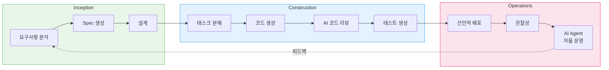
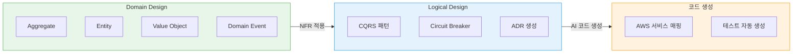
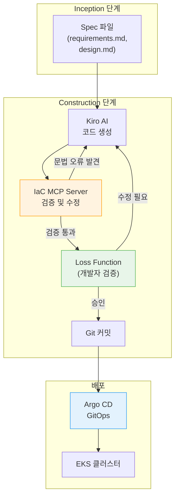
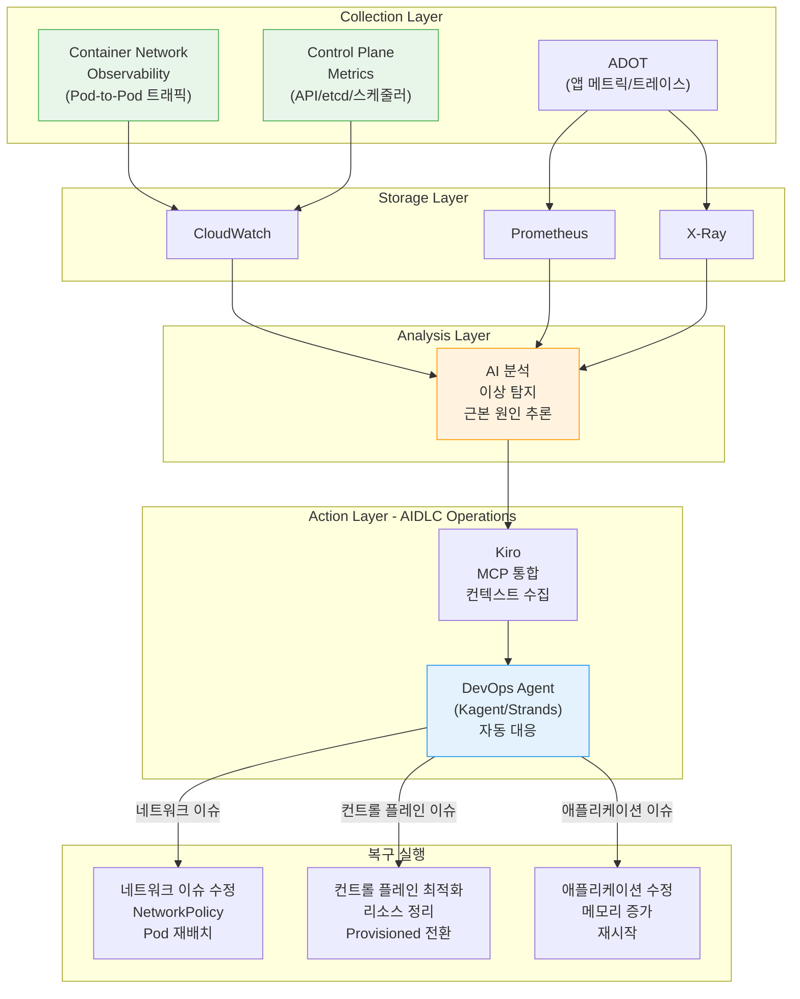
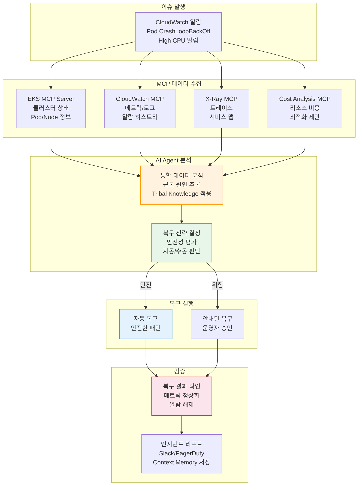
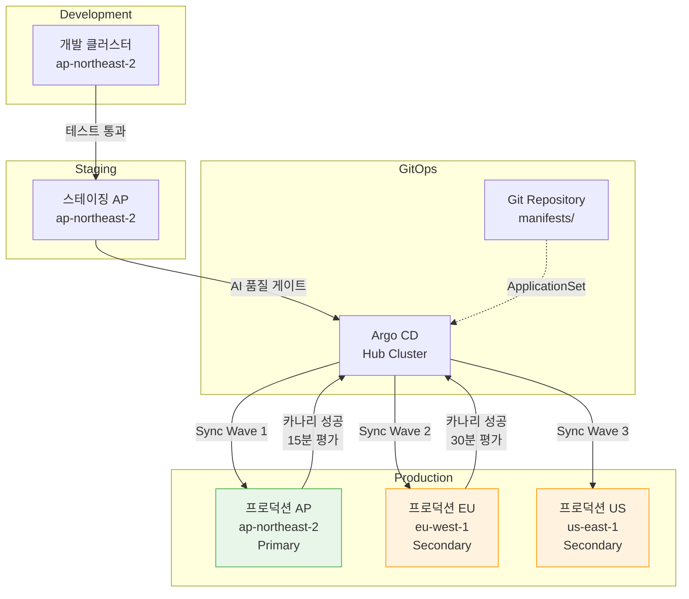

import { AidlcPhaseMapping, EksCapabilities, ProductivityMetrics, AidlcPrinciples, AidlcPhaseActivities, AiCodingAgentComparison, QualityGates, AiAgentEcosystem, DetailedMetrics, AidlcPipeline, AidlcArtifacts } from '@site/src/components/AidlcTables';

# AIDLC 프레임워크 — EKS 환경에서의 AI 주도 개발·운영 고도화

> 📅 **작성일**: 2026-02-12 | **수정일**: 2026-02-14 | ⏱️ **읽는 시간**: 약 39분

---

## 1. 개요

### 1.1 왜 AIDLC인가

전통적 소프트웨어 개발 라이프사이클(SDLC)은 사람 중심의 장기 반복 주기(주/월 단위)를 전제로 설계되었습니다. 데일리 스탠드업, 스프린트 리뷰, 회고 같은 리추얼은 이 긴 주기에 최적화된 것입니다. AI의 등장으로 이 전제가 무너집니다.

AI는 요구사항 분석, 태스크 분해, 코드 생성, 테스트까지 **시간/일 단위**로 수행합니다. 기존 SDLC에 AI를 끼워 넣는(Retrofit) 접근은 이 잠재력을 제한합니다 — 마치 자동차 시대에 더 빠른 마차를 만드는 것과 같습니다.

**AIDLC(AI-Driven Development Lifecycle)**는 AWS Labs가 제시한 방법론으로, AI를 **첫 원칙(First Principles)**에서 재구성하여 개발 라이프사이클의 핵심 협력자로 통합합니다.

```
전통적 SDLC                          AIDLC
━━━━━━━━━━━━━━                      ━━━━━━━━━━━━━━━━━━━
사람이 계획하고 실행                    AI가 제안하고, 사람이 검증
주/월 단위 반복 (Sprint)               시간/일 단위 반복 (Bolt)
설계 기법은 팀 선택                     DDD/BDD/TDD를 방법론에 내장
역할 사일로 (FE/BE/DevOps)            AI로 역할 경계 초월
수동 요구사항 분석                      AI가 Intent를 Unit으로 분해
순차적 핸드오프                         연속 흐름 + Loss Function 검증
```

### 1.2 AIOps 전략과의 연결

[1. AIOps 전략 가이드](./aiops-introduction.md)에서 다룬 AWS 오픈소스 전략 → MCP 통합 → AI 도구 → Kiro 오케스트레이션은 AIDLC를 실현하는 **기술 기반**입니다. [2. 지능형 관찰성 스택](./aiops-observability-stack.md)에서 구축한 3-Pillar + AI 분석 레이어는 Operations 단계의 **데이터 기반**입니다. 이 문서는 그 기술·데이터 기반 위에서 **개발과 운영을 체계적으로 고도화하는 방법론**을 제시합니다.

```
[1] AIOps 전략 가이드 ──── 기술 기반 (MCP, Kiro, AI Agent)
           │
[2] 지능형 관찰성 스택 ──── 데이터 기반 (ADOT, AMP/AMG, CloudWatch AI)
           │
[3] AIDLC 프레임워크 ── 방법론 (이 문서)
           │
[4] 예측 스케일링 및 자동 복구 ──────── 심화 (ML 예측, 자동 복구, Chaos)
```

:::info 원문 참조
AIDLC의 핵심 개념은 AWS Labs의 [AI-DLC Method Definition](https://prod.d13rzhkk8cj2z0.amplifyapp.com/)에서 정의됩니다. 이 문서는 해당 방법론을 EKS 환경에서 실용적으로 구현하는 가이드입니다.
:::

---

## 2. AIDLC 핵심 개념

### 2.1 10대 원칙

<AidlcPrinciples />

이 중 EKS 환경에서 특히 중요한 3가지:

- **Reverse the Conversation Direction** — AI가 EKS 클러스터 상태를 MCP로 수집하고, 배포 계획을 먼저 제안합니다. 개발자는 Google Maps의 운전자처럼 목적지(Intent)를 설정하고, AI가 제시하는 경로를 검증합니다.
- **Integration of Design Techniques** — DDD를 방법론 핵심에 내장하여, AI가 비즈니스 로직을 Aggregate, Entity, Value Object로 자동 모델링합니다. Scrum에서 "팀이 알아서 선택"하던 설계 기법이 AI-DLC에서는 필수 코어입니다.
- **Minimize Stages, Maximize Flow** — 핸드오프를 최소화하고 연속 흐름을 구현합니다. 각 단계의 사람 검증은 **Loss Function** 역할로, 하류에 전파될 오류를 조기에 차단합니다.

### 2.2 핵심 산출물 (Artifacts)

AI-DLC는 전통적 SDLC의 용어를 AI 시대에 맞게 재정의합니다.

```
┌─────────┐    ┌─────────┐    ┌─────────┐
│  Intent  │───▶│  Unit   │───▶│  Bolt   │
│ 고수준 목적│    │독립 작업단위│   │빠른 반복 │
│          │    │(DDD Sub- │   │(Sprint  │
│비즈니스 목표│   │ domain)  │   │ 대체)   │
└─────────┘    └─────────┘    └─────────┘
                    │
              ┌─────┴─────┐
              ▼           ▼
        ┌──────────┐ ┌──────────┐
        │ Domain   │ │ Logical  │
        │ Design   │ │ Design   │
        │비즈니스 로직│ │NFR+패턴  │
        └──────────┘ └──────────┘
              │           │
              └─────┬─────┘
                    ▼
            ┌──────────────┐
            │ Deployment   │
            │    Unit      │
            │컨테이너+Helm+ │
            │  Terraform   │
            └──────────────┘
```

<AidlcArtifacts />

:::tip Context Memory와 추적성
모든 산출물은 **Context Memory**로 저장되어 AI가 라이프사이클 전체에서 참조합니다. 산출물 간 양방향 추적(Domain Model ↔ User Story ↔ 테스트 계획)이 보장되어, AI가 항상 정확한 맥락에서 작업합니다.
:::

### 2.3 AI 주도 재귀적 워크플로우

AI-DLC의 핵심은 **AI가 계획을 제안하고 사람이 검증하는 재귀적 정제** 과정입니다.

```
Intent (비즈니스 목적)
  │
  ▼
AI: Level 1 Plan 생성 ◀──── 사람: 검증 · 수정
  │
  ├─▶ Step 1 ──▶ AI: Level 2 분해 ◀── 사람: 검증
  │                 ├─▶ Sub-task 1.1 ──▶ AI 실행 ◀── 사람: 검증
  │                 └─▶ Sub-task 1.2 ──▶ AI 실행 ◀── 사람: 검증
  │
  ├─▶ Step 2 ──▶ AI: Level 2 분해 ◀── 사람: 검증
  │                 └─▶ ...
  └─▶ Step N ──▶ ...

[모든 산출물 → Context Memory → 양방향 추적성]
```

각 단계의 사람 검증은 **Loss Function**입니다 — 오류를 조기에 포착하여 하류 전파를 방지합니다. AI가 경로별(신규 개발, 리팩터링, 결함 수정) 고정 워크플로우를 규정하지 않고, 상황에 맞는 Level 1 Plan을 제안하는 유연한 접근입니다.

### 2.4 AIDLC 3단계 개관

AIDLC는 **Inception**, **Construction**, **Operations** 3단계로 구성됩니다.

<AidlcPhaseMapping />



<AidlcPhaseActivities />

---

## 3. Inception 단계 — 요구사항에서 설계까지

### 3.1 Mob Elaboration

Inception의 핵심 리추얼은 **Mob Elaboration**입니다 — Product Owner, 개발자, QA가 한 방에 모여 AI와 협업하는 요구사항 정제 세션입니다.

```
┌──────────────────────────────────────────────────┐
│              Mob Elaboration 리추얼                │
├──────────────────────────────────────────────────┤
│                                                   │
│  [AI] Intent를 User Story + Unit으로 분해 제안     │
│    ↓                                              │
│  [PO + Dev + QA] 검토 · 과잉/부족 설계 조정        │
│    ↓                                              │
│  [AI] 수정 반영 → NFR · Risk 추가 생성             │
│    ↓                                              │
│  [팀] 최종 검증 → Bolt 계획 확정                    │
│                                                   │
├──────────────────────────────────────────────────┤
│  산출물:                                          │
│  PRFAQ · User Stories · NFR 정의                  │
│  Risk Register · 측정 기준 · Bolt 계획             │
└──────────────────────────────────────────────────┘
```

기존 방법론에서 **수 주~수 개월** 걸리던 순차적 요구사항 분석을 AI가 초안을 생성하고 팀이 동시에 검토함으로써 **수 시간**으로 압축합니다.

### 3.2 Kiro Spec-Driven Inception

Kiro는 Mob Elaboration의 산출물을 **Spec 파일**로 체계화합니다. 자연어 요구사항에서 코드까지의 전체 과정을 구조화합니다.

```
requirements.md → design.md → tasks.md → 코드 생성 → 검증
```

**EKS 예시: Payment Service 배포**

`requirements.md`:

```markdown
# Payment Service 배포 요구사항

## 기능 요구사항
- REST API 엔드포인트: /api/v1/payments
- DynamoDB 테이블과 연동
- SQS를 통한 비동기 이벤트 처리

## 비기능 요구사항
- P99 레이턴시: < 200ms
- 가용성: 99.95%
- 자동 스케일링: 2-20 Pod
- EKS 1.35+ 호환
```

`design.md`:

```markdown
# Payment Service 아키텍처

## 인프라 구성
- EKS Deployment (3 replicas min)
- ACK DynamoDB Table (on-demand)
- ACK SQS Queue (FIFO)
- HPA (CPU 70%, Memory 80%)
- Karpenter NodePool (graviton, spot)

## 관찰성
- ADOT sidecar (traces → X-Ray)
- Application Signals (SLI/SLO 자동)
- CloudWatch Logs (/eks/payment-service)

## 보안
- Pod Identity (IRSA 대체)
- NetworkPolicy (namespace 격리)
- Secrets Manager CSI Driver
```

`tasks.md`:

```markdown
# 구현 태스크

## Bolt 1: 인프라
- [ ] ACK DynamoDB Table CRD 작성
- [ ] ACK SQS Queue CRD 작성
- [ ] KRO ResourceGroup 정의 (DynamoDB + SQS 통합)
- [ ] Karpenter NodePool 설정 (graviton, spot)

## Bolt 2: 애플리케이션
- [ ] Go REST API 구현
- [ ] DynamoDB SDK 연동
- [ ] SQS consumer 구현
- [ ] Dockerfile + multi-stage build

## Bolt 3: 배포
- [ ] Helm chart 작성
- [ ] Argo CD Application 정의
- [ ] HPA manifest 작성
- [ ] NetworkPolicy 작성

## Bolt 4: 관찰성
- [ ] ADOT sidecar 설정
- [ ] Application Signals annotation
- [ ] CloudWatch 대시보드
- [ ] SLO 알림 설정
```

:::tip Spec-Driven의 핵심 가치
**디렉팅 방식**: "DynamoDB 만들어줘" → "SQS도 필요해" → "이제 배포해줘" → 매번 수동 지시, 맥락 유실 위험
**Spec-Driven**: Kiro가 requirements.md를 분석 → design.md 생성 → tasks.md 분해 → 코드 자동 생성 → 검증까지 일관된 Context Memory로 연결
:::

### 3.3 MCP 기반 실시간 컨텍스트 수집

Kiro는 MCP 네이티브로, Inception 단계에서 AWS Hosted MCP 서버를 통해 실시간 인프라 상태를 수집합니다.

```
[Kiro + MCP 상호작용]

Kiro: "EKS 클러스터 상태 확인"
  → EKS MCP Server: get_cluster_status()
  → 응답: { version: "1.35", nodes: 5, status: "ACTIVE" }

Kiro: "비용 분석"
  → Cost Analysis MCP Server: analyze_cost(service="EKS")
  → 응답: { monthly: "$450", recommendations: [...] }

Kiro: "현재 워크로드 분석"
  → EKS MCP Server: list_deployments(namespace="payment")
  → 응답: { deployments: [...], resource_usage: {...} }
```

이를 통해 design.md 생성 시 **현재 클러스터 상태와 비용을 반영한 설계**가 가능합니다. MCP 통합 아키텍처의 상세는 [1. AIOps 전략 가이드](./aiops-introduction.md)를 참조하세요.

---

## 4. Construction 단계 — 설계에서 코드까지

### 4.1 DDD 통합: Domain Design에서 Logical Design까지

AI-DLC에서 DDD는 **선택사항이 아닌 방법론의 내장 요소**입니다. AI가 비즈니스 로직을 자동으로 DDD 원칙에 따라 모델링합니다.



**Payment Service 예시**:

1. **Domain Design** — AI가 비즈니스 로직 모델링
   - Aggregate: `Payment` (transactionId, amount, status)
   - Entity: `PaymentMethod`, `Customer`
   - Value Object: `Money`, `Currency`
   - Domain Event: `PaymentCreated`, `PaymentCompleted`, `PaymentFailed`

2. **Logical Design** — NFR 적용 + 아키텍처 패턴 선택
   - CQRS: 결제 생성(Command) / 조회(Query) 분리
   - Circuit Breaker: 외부 결제 게이트웨이 호출
   - ADR: "DynamoDB on-demand vs provisioned" 의사결정 기록

3. **코드 생성** — AWS 서비스 매핑
   - Aggregate → EKS Deployment + DynamoDB Table
   - Domain Event → SQS FIFO Queue
   - Circuit Breaker → Envoy sidecar + Istio

개발자는 각 단계에서 AI가 생성한 모델을 **검증·조정**합니다. 이 검증이 Loss Function 역할을 합니다.

### 4.2 Mob Construction

Construction의 핵심 리추얼은 **Mob Construction**입니다. 팀이 한 방에 모여 각자의 Unit을 개발하며, Domain Design 단계에서 생성한 통합 사양(Integration Specification)을 교환합니다.

```
[Mob Construction 흐름]

Team A: Payment Unit        Team B: Notification Unit
  │                            │
  ├─ Domain Design 완료        ├─ Domain Design 완료
  │                            │
  └────── 통합 사양 교환 ──────┘
          (Domain Event 계약)
  │                            │
  ├─ Logical Design            ├─ Logical Design
  ├─ 코드 생성                  ├─ 코드 생성
  ├─ 테스트                    ├─ 테스트
  └─ Bolt 전달                 └─ Bolt 전달
```

각 Unit은 느슨하게 결합되어 **병렬 개발**이 가능하며, Domain Event를 통해 통합됩니다. AI가 통합 테스트도 자동 생성합니다.

:::warning Brown-field (기존 시스템) 접근
기존 시스템에 기능 추가나 리팩터링을 수행하는 경우, Construction 단계에 **추가 스텝**이 필요합니다:

1. AI가 기존 코드를 **시맨틱 모델로 역공학** (코드 → 모델 승격)
   - **Static Model**: 컴포넌트, 책임, 관계
   - **Dynamic Model**: 주요 유스케이스의 컴포넌트 상호작용
2. 개발자가 역공학된 모델을 검증·수정
3. 이후 Green-field와 동일한 Construction 흐름 진행

이를 통해 AI가 기존 시스템의 맥락을 정확히 파악한 상태에서 변경을 수행합니다.
:::

### 4.3 AI 코딩 에이전트

AIDLC Construction 단계에서 활용하는 AI 코딩 에이전트들입니다. Amazon Q Developer와 Kiro는 **Anthropic Claude** 모델을 사용하며, Kiro는 오픈 웨이트 모델도 지원하여 비용 최적화와 특수 도메인 확장이 가능합니다.

<AiCodingAgentComparison />

#### 4.3.4 Amazon Q Developer — 실시간 코드 빌드 및 테스트 (2025)

AWS는 2025년 2월 **Amazon Q Developer의 실시간 코드 실행 기능**을 발표했습니다. 이는 AI가 코드를 생성한 후 **자동으로 빌드하고 테스트를 실행하여 결과를 검증**한 뒤 개발자에게 제시하는 혁신적 접근입니다. AIDLC Construction 단계에서 **Loss Function을 조기에 작동**시켜 오류를 하류로 전파하지 않는 핵심 메커니즘입니다.

**실시간 코드 실행 기능**

전통적인 AI 코딩 도구는 코드를 생성한 후 개발자가 수동으로 빌드·테스트해야 했습니다. Q Developer는 이 과정을 자동화하여 **코드 생성 → 자동 빌드 → 테스트 실행 → 결과 검증 → 개발자 리뷰**의 폐쇄 루프를 구현합니다.

```
기존 방식:
  AI 코드 생성 → 개발자 수동 빌드 → 개발자 수동 테스트 → 오류 발견 → AI에게 피드백 → 재생성
  (반복 주기: 5-10분)

Q Developer 실시간 실행:
  AI 코드 생성 → 자동 빌드 → 자동 테스트 → 결과 검증 → (오류 시 자동 수정 재시도) → 개발자 리뷰
  (반복 주기: 1-2분, 개발자 개입 최소화)
```

**핵심 메커니즘**

1. **자동 빌드 파이프라인**
   - Q Developer가 코드 변경 후 프로젝트의 빌드 도구(Maven, Gradle, npm, pip 등)를 자동 실행
   - 컴파일 오류, 의존성 충돌을 즉시 감지
   - 빌드 실패 시 오류 메시지를 분석하여 자동으로 코드 수정 재시도

2. **테스트 자동 실행**
   - 유닛 테스트, 통합 테스트를 자동으로 실행
   - 테스트 실패 시 실패 원인을 분석하여 코드 또는 테스트를 수정
   - 기존 테스트 커버리지를 유지하며 새 코드 추가

3. **개발자 리뷰 전 검증**
   - 개발자가 코드를 받을 때 **이미 빌드와 테스트가 통과한 상태**
   - 개발자는 비즈니스 로직과 설계 검토에 집중 (Loss Function 역할)
   - "코드가 작동하는가?"가 아닌 "올바른 코드인가?"를 검증

**보안 스캔 자동 수정 제안**

Q Developer는 Kubernetes YAML 및 애플리케이션 코드의 보안 취약점을 자동으로 스캔하고 수정 제안을 제공합니다.

**Kubernetes YAML 보안 스캔**

1. **Root 권한 감지**
   - `runAsUser: 0` 또는 `runAsNonRoot: false` 탐지
   - 제안: `runAsUser: 1000`, `runAsNonRoot: true`

2. **Privileged 컨테이너 감지**
   - `securityContext.privileged: true` 탐지
   - 제안: 필요한 capabilities만 명시적으로 추가 (예: `NET_ADMIN`)

3. **미설정 securityContext 감지**
   - Pod/Container에 `securityContext`가 없는 경우 경고
   - 제안: 최소 권한 원칙에 따른 securityContext 추가

**자동 수정 제안 예시**

```yaml
# Q Developer가 감지한 문제
apiVersion: v1
kind: Pod
metadata:
  name: payment-pod
spec:
  containers:
    - name: payment
      image: payment:v1
      securityContext:
        runAsUser: 0  # ⚠️ Root 권한 사용
        privileged: true  # ⚠️ Privileged 모드

# Q Developer가 제안하는 수정
apiVersion: v1
kind: Pod
metadata:
  name: payment-pod
spec:
  securityContext:
    runAsNonRoot: true
    runAsUser: 1000
    fsGroup: 1000
    seccompProfile:
      type: RuntimeDefault
  containers:
    - name: payment
      image: payment:v1
      securityContext:
        allowPrivilegeEscalation: false
        readOnlyRootFilesystem: true
        capabilities:
          drop:
            - ALL
          add:
            - NET_BIND_SERVICE  # 필요한 capabilities만 추가
```

**AIDLC Construction 단계 통합**

Q Developer의 실시간 실행과 보안 스캔은 Construction 단계의 **Quality Gate를 자동화**하여 AIDLC의 빠른 반복 주기(Bolt)를 실현합니다.

1. **Quality Gate에서 Q Developer 보안 스캔 자동 실행**
   - Kiro가 코드를 생성할 때 Q Developer 보안 스캔을 파이프라인에 통합
   - Kubernetes manifest, Dockerfile, 애플리케이션 코드를 자동 스캔
   - 취약점 발견 시 수정 제안을 개발자에게 제시 (Loss Function)

2. **CI/CD 파이프라인에 Q Developer 검증 단계 추가**
   - PR 생성 시 GitHub Actions/GitLab CI에서 Q Developer 스캔 실행
   - 빌드·테스트 자동 실행으로 "코드가 작동함"을 보장
   - 보안 스캔으로 "코드가 안전함"을 보장
   - 개발자는 "코드가 올바름"만 검증 (역할 분리)

**통합 워크플로우 예시**

```yaml
# .github/workflows/aidlc-construction.yml
name: AIDLC Construction Quality Gate
on:
  pull_request:
    types: [opened, synchronize]

jobs:
  q-developer-validation:
    runs-on: ubuntu-latest
    steps:
      - uses: actions/checkout@v4

      # 1. Q Developer 보안 스캔
      - name: Q Developer Security Scan
        uses: aws/amazon-q-developer-action@v1
        with:
          scan-type: security
          source-path: .
          auto-fix: true  # 자동 수정 제안 적용

      # 2. 실시간 빌드 및 테스트
      - name: Q Developer Build & Test
        uses: aws/amazon-q-developer-action@v1
        with:
          action: build-and-test
          test-coverage-threshold: 80

      # 3. Kubernetes manifest 검증
      - name: K8s Manifest Security Check
        run: |
          # Q Developer가 제안한 수정이 적용되었는지 확인
          kube-linter lint deploy/ --config .kube-linter.yaml

      # 4. 통과 시에만 Argo CD 동기화 허용
      - name: Approve for GitOps
        if: success()
        run: echo "Quality Gate passed. Ready for Argo CD sync."
```

**실제 효과 — 피드백 루프 단축**

```
전통적 Construction 단계:
  [개발자] 코드 작성 (30분)
    → [개발자] 수동 빌드 (2분)
    → [개발자] 수동 테스트 (5분)
    → [개발자] 오류 발견 (10분 디버깅)
    → [개발자] 코드 수정 (20분)
    → 반복...
  총 소요 시간: 2-3시간

Q Developer 실시간 실행:
  [AI] 코드 생성 (1분)
    → [AI] 자동 빌드·테스트 (30초)
    → [AI] 오류 감지 및 자동 수정 (1분)
    → [개발자] Loss Function 검증 (10분)
    → [Argo CD] 자동 배포
  총 소요 시간: 15-20분
```

:::tip AIDLC에서 Q Developer의 가치
Q Developer의 실시간 실행은 AIDLC의 핵심 원칙인 **"Minimize Stages, Maximize Flow"**를 구현합니다. 코드 생성 → 빌드 → 테스트 → 검증의 각 단계를 자동화하여 핸드오프를 제거하고, 개발자는 **의사결정(Loss Function)**에만 집중합니다. 이것이 기존 SDLC의 주/월 단위 주기를 AIDLC의 시간/일 단위 주기로 단축하는 핵심 메커니즘입니다.
:::

**참고 자료**

- [AWS DevOps Blog: Enhancing Code Generation with Real-Time Execution in Amazon Q Developer](https://aws.amazon.com/blogs/devops/enhancing-code-generation-with-real-time-execution-in-amazon-q-developer/) (2025-02-06)
- AWS re:Invent 2025 EKS Research — Section 13.4 참조

### 4.4 EKS Capabilities 기반 선언적 자동화

EKS Capabilities(2025.11)는 인기 있는 오픈소스 도구를 AWS 관리형으로 제공하여, Construction 단계의 산출물을 선언적으로 배포합니다.

<EksCapabilities />

#### 4.4.1 Managed Argo CD — GitOps

Managed Argo CD는 GitOps를 AWS 인프라에서 관리형으로 운영합니다. Kiro가 생성한 코드를 Git에 푸시하면 자동으로 EKS에 배포됩니다. Application CRD로 단일 환경을, ApplicationSet으로 멀티 환경(dev/staging/production)을 선언적으로 관리합니다.

#### 4.4.2 ACK — AWS 리소스 선언적 관리

ACK는 50+ AWS 서비스를 K8s CRD로 선언적으로 관리합니다. Kiro가 생성한 Domain Design의 인프라 요소(DynamoDB, SQS, S3 등)를 `kubectl apply`로 배포하며, Argo CD의 GitOps 워크플로우에 자연스럽게 통합됩니다.

:::info ACK의 핵심 가치
ACK를 사용하면 **클러스터 외부의 AWS 리소스도 K8s 선언적 모델로 관리**할 수 있습니다. DynamoDB, SQS, S3, RDS 등을 K8s CRD로 생성/수정/삭제하며, 이것이 "K8s를 중심으로 모든 인프라를 선언적으로 관리"하는 전략입니다.
:::

#### 4.4.3 KRO — 복합 리소스 오케스트레이션

KRO는 여러 K8s 리소스를 **단일 배포 단위(ResourceGroup)**로 묶습니다. AIDLC의 Deployment Unit 개념과 직접 매핑되어, Deployment + Service + HPA + ACK 리소스를 하나의 Custom Resource로 생성합니다.

#### 4.4.4 LBC v3 Gateway API

AWS Load Balancer Controller v3는 Gateway API를 GA로 전환하며 L4(NLB) + L7(ALB) 라우팅, QUIC/HTTP3, JWT 검증, 헤더 변환을 제공합니다. Gateway + HTTPRoute CRD로 트래픽을 선언적으로 관리합니다.

#### 4.4.5 LBC v3 Gateway API — 고급 기능 상세

AWS Load Balancer Controller v3의 Gateway API 지원은 Kubernetes 표준 트래픽 관리 API를 통해 강력한 L4/L7 라우팅 기능을 제공합니다. 이는 AIDLC Construction 단계에서 Kiro Spec의 네트워킹 요구사항을 선언적으로 구현하는 핵심 도구입니다.

**Gateway API v1.4 + LBC v2.14+ 지원 범위**

Gateway API는 역할 지향적(role-oriented) 설계로 인프라 운영자, 클러스터 운영자, 애플리케이션 개발자가 각자의 책임 범위에서 트래픽을 관리할 수 있게 합니다.

1. **L4 Routes — TCPRoute, UDPRoute, TLSRoute (NLB, v2.13.3+)**
   - **TCPRoute**: TCP 기반 애플리케이션 라우팅 (예: PostgreSQL, Redis, gRPC with TCP)
   - **UDPRoute**: UDP 기반 프로토콜 라우팅 (예: DNS, QUIC, 게임 서버)
   - **TLSRoute**: SNI(Server Name Indication) 기반 TLS 라우팅
   - Network Load Balancer(NLB)로 프로비저닝되며, 높은 처리량과 낮은 지연 시간 보장
   - 예: 멀티 테넌트 데이터베이스 클러스터에서 SNI 기반 샤드 라우팅

2. **L7 Routes — HTTPRoute, GRPCRoute (ALB, v2.14.0+)**
   - **HTTPRoute**: 경로, 헤더, 쿼리 파라미터 기반 HTTP/HTTPS 라우팅
   - **GRPCRoute**: gRPC 메서드 이름 기반 라우팅, gRPC-specific 헤더 관리
   - Application Load Balancer(ALB)로 프로비저닝되며, 콘텐츠 기반 라우팅 지원
   - 예: `/api/v1/*` → v1 서비스, `/api/v2/*` → v2 서비스 (카나리 배포)

3. **QUIC 프로토콜 지원 (HTTP/3 on NLB)**
   - HTTP/3(QUIC) 프로토콜을 NLB에서 네이티브 지원
   - UDP 기반으로 TCP head-of-line blocking 문제 해결
   - 모바일 네트워크 환경에서 연결 마이그레이션(connection migration) 지원
   - 예: 실시간 비디오 스트리밍, 게임 서버, 저지연 API

**JWT 검증 기능**

Gateway API v1.4는 **Gateway 레벨에서 JWT(JSON Web Token) 검증**을 지원합니다. 이를 통해 인증 로직을 백엔드 서비스에서 분리하여 부하를 감소시킵니다.

- **인증 정책 정의**: Gateway에 JWT 검증 규칙을 선언 (발급자, 공개 키, 클레임 검증)
- **백엔드 부하 감소**: ALB/NLB에서 JWT를 검증하여 유효하지 않은 요청을 조기에 차단
- **중앙화된 인증**: 여러 서비스가 공통 인증 정책을 재사용
- **예시**: Payment Service가 `/api/v1/payments` 경로에서 `iss=https://auth.example.com`, `aud=payment-api` 검증

**헤더 변환**

HTTPRoute는 요청과 응답 헤더를 동적으로 추가·수정·삭제할 수 있습니다.

- **RequestHeaderModifier**: 백엔드로 전달되기 전 요청 헤더 조작
  - 예: `X-User-ID` 헤더 추가 (JWT 클레임에서 추출한 사용자 ID)
  - 예: `X-Forwarded-Proto: https` 강제 (백엔드가 프록시 뒤에 있을 때)
- **ResponseHeaderModifier**: 클라이언트로 응답하기 전 응답 헤더 조작
  - 예: `X-Frame-Options: DENY` 추가 (보안 헤더)
  - 예: `Server` 헤더 제거 (정보 노출 방지)

**AIDLC Construction 단계에서의 활용**

Gateway API는 Kiro Spec에서 정의한 네트워킹 요구사항을 GitOps 워크플로우로 자동 배포하는 핵심 도구입니다.

1. **Kiro Spec에서 API 라우팅 요구사항 정의**
   - `requirements.md`에서 "카나리 배포로 10% 트래픽을 v2로 라우팅" 같은 요구사항 명시
   - `design.md`에서 Gateway API를 사용한 라우팅 전략 설계
   - Kiro가 HTTPRoute manifest를 자동 생성

2. **Gateway API CRD로 선언적 트래픽 관리**
   - Git 커밋 한 번으로 Gateway, GatewayClass, HTTPRoute를 배포
   - Argo CD가 변경 사항을 자동으로 EKS에 동기화
   - LBC가 ALB/NLB를 프로비저닝하고 라우팅 규칙 적용

3. **카나리/블루-그린 배포 전략 자동화**
   - HTTPRoute의 `weight` 필드로 트래픽 분산 비율 조정
   - 예: v1 서비스 90%, v2 서비스 10% → 점진적으로 v2를 100%로 증가
   - CloudWatch Application Signals로 각 버전의 SLO 모니터링
   - AI Agent가 SLO 위반 시 자동으로 롤백 (Operations 단계 통합)

**Gateway, GatewayClass, HTTPRoute YAML 예시**

```yaml
# gatewayclass.yaml — 인프라 운영자가 정의
apiVersion: gateway.networking.k8s.io/v1
kind: GatewayClass
metadata:
  name: aws-alb
spec:
  controllerName: gateway.alb.aws.amazon.com/controller
  description: "AWS Application Load Balancer"
---
# gateway.yaml — 클러스터 운영자가 정의
apiVersion: gateway.networking.k8s.io/v1
kind: Gateway
metadata:
  name: payment-gateway
  namespace: production
  annotations:
    gateway.alb.aws.amazon.com/scheme: internet-facing
    gateway.alb.aws.amazon.com/tags: Environment=production,Service=payment
spec:
  gatewayClassName: aws-alb
  listeners:
    - name: https
      protocol: HTTPS
      port: 443
      tls:
        mode: Terminate
        certificateRefs:
          - name: payment-tls-cert
            kind: Secret
      allowedRoutes:
        namespaces:
          from: Selector
          selector:
            matchLabels:
              gateway-access: enabled
---
# httproute.yaml — 애플리케이션 개발자가 정의
apiVersion: gateway.networking.k8s.io/v1
kind: HTTPRoute
metadata:
  name: payment-api-route
  namespace: production
spec:
  parentRefs:
    - name: payment-gateway
      namespace: production
      sectionName: https
  rules:
    # 카나리 배포: v1 90%, v2 10%
    - matches:
        - path:
            type: PathPrefix
            value: /api/v1/payments
      backendRefs:
        - name: payment-service-v1
          port: 8080
          weight: 90
        - name: payment-service-v2
          port: 8080
          weight: 10
      filters:
        # JWT 검증 (Gateway API v1.4)
        - type: RequestHeaderModifier
          requestHeaderModifier:
            add:
              - name: X-User-ID
                value: "{jwt.sub}"  # JWT 클레임에서 추출
        # 보안 헤더 추가
        - type: ResponseHeaderModifier
          responseHeaderModifier:
            add:
              - name: X-Frame-Options
                value: DENY
              - name: X-Content-Type-Options
                value: nosniff
            remove:
              - Server  # 서버 정보 노출 방지
---
# grpcroute.yaml — gRPC 서비스 라우팅
apiVersion: gateway.networking.k8s.io/v1alpha2
kind: GRPCRoute
metadata:
  name: payment-grpc-route
  namespace: production
spec:
  parentRefs:
    - name: payment-gateway
  rules:
    - matches:
        - method:
            service: payment.v1.PaymentService
            method: CreatePayment
      backendRefs:
        - name: payment-grpc-service
          port: 9090
```

:::tip Gateway API와 Ingress 비교
**Ingress**는 단일 리소스에 모든 라우팅 규칙을 정의하여, 인프라 운영자와 개발자의 책임이 혼재됩니다. **Gateway API**는 GatewayClass(인프라), Gateway(클러스터), HTTPRoute(애플리케이션)로 역할을 분리하여, 각 팀이 독립적으로 작업할 수 있습니다. AIDLC의 **Loss Function** 개념과 일치 — 각 레이어에서 검증하여 오류 전파를 방지합니다.
:::

**참고 자료**

- [Kubernetes Gateway API v1.4 Release](https://kubernetes.io/blog/2025/11/06/gateway-api-v1-4/) (2025-11-06)
- [AWS Load Balancer Controller — Gateway API Docs](https://kubernetes-sigs.github.io/aws-load-balancer-controller/latest/guide/gateway/gateway/)
- [Kubernetes Gateway API in Action (AWS Blog)](https://aws.amazon.com/blogs/containers/kubernetes-gateway-api-in-action/)
- AWS re:Invent 2025 EKS Research — Section 3.5 참조

#### 4.4.6 Node Readiness Controller — 선언적 노드 준비 상태 관리

**Node Readiness Controller(NRC)**는 Kubernetes 노드가 워크로드를 수용하기 전에 충족해야 할 조건을 선언적으로 정의하는 컨트롤러입니다. 이는 AIDLC Construction 단계에서 인프라 요구사항을 코드로 표현하고, GitOps를 통해 자동으로 적용하는 핵심 도구입니다.

**핵심 개념**

NRC는 `NodeReadinessRule` CRD를 통해 노드가 "Ready" 상태로 전환되기 전에 만족해야 할 조건을 정의합니다. 전통적으로 노드 준비 상태는 kubelet이 자동으로 결정했지만, NRC를 사용하면 **애플리케이션별 요구사항을 인프라 레이어에 선언적으로 주입**할 수 있습니다.

- **선언적 정책**: `NodeReadinessRule`로 노드 준비 조건을 YAML로 정의
- **GitOps 호환**: Argo CD를 통해 노드 readiness 정책을 버전 관리하고 자동 배포
- **워크로드 보호**: 필수 데몬셋(CNI, CSI, 보안 에이전트)이 준비될 때까지 스케줄링 차단

**AIDLC 각 단계에서의 활용**

| 단계 | NRC 역할 | 예시 |
|------|----------|------|
| **Inception** | AI가 워크로드 요구사항 분석 → 필요한 NodeReadinessRule 자동 정의 | "GPU 워크로드는 NVIDIA device plugin이 준비된 후에만 스케줄링" |
| **Construction** | NRC 규칙을 Helm chart에 포함, Terraform EKS Blueprints AddOn으로 배포 | Kiro가 `NodeReadinessRule` manifest 자동 생성 |
| **Operations** | NRC가 런타임에 노드 readiness를 자동 관리, AI가 규칙 효과 분석 | CloudWatch Application Signals로 노드 준비 지연 시간 추적 |

**Infrastructure as Code 관점**

NRC는 AIDLC의 "인프라를 코드로, 인프라도 테스트" 원칙을 노드 수준까지 확장합니다.

1. **GitOps 기반 정책 관리**
   - `NodeReadinessRule` CRD를 Git 리포지토리에 저장
   - Argo CD가 자동으로 EKS 클러스터에 동기화
   - 정책 변경 시 Git 커밋 한 번으로 전체 클러스터에 적용

2. **Kiro + MCP 자동화**
   - Kiro가 Inception 단계의 `design.md`에서 워크로드 요구사항 파싱
   - EKS MCP Server를 통해 현재 클러스터의 데몬셋 상태 확인
   - 필요한 `NodeReadinessRule`을 자동 생성하여 IaC 리포지토리에 추가

3. **Terraform EKS Blueprints 통합**
   - NRC 컨트롤러를 EKS Blueprints AddOn으로 선언적 설치
   - Helm values를 통해 기본 정책 설정 자동화
   - 멀티 클러스터 환경에서 일관된 노드 준비 정책 적용

**Quality Gate 통합**

AIDLC의 Quality Gate 단계에서 NRC는 배포 전 노드 준비 상태를 검증하는 도구로 활용됩니다.

- **배포 전 Dry-run**: NRC 규칙을 적용했을 때 기존 워크로드에 미치는 영향 시뮬레이션
- **CI/CD 파이프라인 검증**: GitHub Actions/GitLab CI에서 `kubectl apply --dry-run` + NRC 규칙 유효성 검사
- **Loss Function으로서의 역할**: 잘못된 노드 준비 정책이 프로덕션에 배포되기 전에 차단

**YAML 예시: GPU 워크로드용 NodeReadinessRule**

```yaml
apiVersion: node.k8s.io/v1alpha1
kind: NodeReadinessRule
metadata:
  name: gpu-node-readiness
  namespace: kube-system
spec:
  # GPU 노드에만 적용
  nodeSelector:
    matchLabels:
      node.kubernetes.io/instance-type: p4d.24xlarge
  # 다음 데몬셋이 모두 Ready 상태일 때까지 노드를 Ready로 전환하지 않음
  requiredDaemonSets:
    - name: nvidia-device-plugin-daemonset
      namespace: kube-system
    - name: gpu-feature-discovery
      namespace: kube-system
    - name: dcgm-exporter
      namespace: monitoring
  # 타임아웃: 10분 내에 조건이 충족되지 않으면 노드를 NotReady로 유지
  timeout: 10m
```

**실전 사용 사례**

| 시나리오 | NRC 규칙 | 효과 |
|----------|----------|------|
| **Cilium CNI 클러스터** | Cilium agent가 Ready일 때까지 대기 | 네트워크 초기화 전 Pod 스케줄링 방지 |
| **GPU 클러스터** | NVIDIA device plugin + DCGM exporter 준비 대기 | GPU 리소스 노출 전 워크로드 스케줄링 차단 |
| **보안 강화 환경** | Falco, OPA Gatekeeper 준비 대기 | 보안 정책 적용 전 워크로드 실행 방지 |
| **스토리지 워크로드** | EBS CSI driver + snapshot controller 준비 대기 | 볼륨 마운트 실패 방지 |

**Terraform EKS Blueprints AddOn 예시**

```hcl
module "eks_blueprints_addons" {
  source = "aws-ia/eks-blueprints-addons/aws"

  cluster_name      = module.eks.cluster_name
  cluster_endpoint  = module.eks.cluster_endpoint

  enable_node_readiness_controller = true
  node_readiness_controller = {
    namespace = "kube-system"
    values = [
      yamlencode({
        defaultRules = {
          cilium = {
            enabled = true
            daemonSets = ["cilium"]
          }
          gpuNodes = {
            enabled = true
            nodeSelector = {
              "node.kubernetes.io/instance-type" = "p4d.24xlarge"
            }
            daemonSets = ["nvidia-device-plugin-daemonset", "dcgm-exporter"]
          }
        }
      })
    ]
  }
}
```

:::tip NRC + AIDLC 시너지
Node Readiness Controller는 AIDLC의 **"인프라 요구사항을 선언적으로 표현하고 자동으로 검증"**하는 원칙을 노드 수준까지 확장합니다. Kiro가 Inception 단계에서 워크로드 요구사항을 분석하여 자동으로 `NodeReadinessRule`을 생성하고, Argo CD가 이를 GitOps로 배포하며, Operations 단계에서 AI Agent가 노드 준비 상태 이상을 자동으로 탐지·대응합니다.
:::

**참고 자료**

- [Kubernetes Blog: Introducing Node Readiness Controller](https://kubernetes.io/blog/2026/02/03/introducing-node-readiness-controller/) (2026-02-03)
- [Node Readiness Controller GitHub Repository](https://github.com/kubernetes-sigs/node-readiness-controller)

:::tip EKS Capabilities + AIDLC 시너지
Managed Argo CD(배포) + ACK(인프라) + KRO(오케스트레이션) + LBC v3(네트워킹) + NRC(노드 준비)가 결합되면, Kiro가 Spec에서 생성한 모든 산출물을 **Git Push 한 번으로 전체 스택 배포**가 가능합니다. 이것이 Construction → Operations 전환의 핵심입니다.
:::

### 4.5 MCP 기반 IaC 자동화 파이프라인

Kiro와 AWS Hosted MCP 서버를 결합하면, Inception의 Spec에서 Construction의 IaC까지 자동으로 생성하고 Argo CD로 배포합니다.

<AidlcPipeline />

#### 4.5.3 AWS IaC MCP Server — CDK/CloudFormation AI 지원

AWS는 2025년 11월 28일 **AWS Infrastructure as Code (IaC) MCP Server**를 발표했습니다. 이는 Kiro CLI와 같은 AI 도구에서 CloudFormation 및 CDK 문서를 검색하고, 템플릿을 자동 검증하며, 배포 트러블슈팅을 AI가 지원하는 프로그래머틱 인터페이스입니다.

**AWS IaC MCP Server 개요**

AWS IaC MCP Server는 Model Context Protocol을 통해 다음 기능을 제공합니다:

- **문서 검색**: CloudFormation 리소스 타입, CDK 구문, 모범 사례를 실시간으로 검색
- **템플릿 검증**: IaC 템플릿의 문법 오류를 자동으로 탐지하고 수정 제안
- **배포 트러블슈팅**: 스택 배포 실패 시 근본 원인을 분석하고 해결 방법 제시
- **프로그래머틱 접근**: Kiro, Amazon Q Developer 등 AI 도구와 네이티브 통합

**AIDLC Construction 단계 통합**

AIDLC의 Construction 단계에서 IaC MCP Server는 다음과 같이 활용됩니다:

1. **Kiro Spec → IaC 코드 생성 검증**
   - Inception 단계에서 생성된 `design.md`를 기반으로 Kiro가 CDK/Terraform/Helm 코드를 생성
   - IaC MCP Server가 생성된 코드의 문법, 리소스 제약, 보안 정책 준수를 자동 검증
   - CloudFormation 템플릿의 경우 리소스 타입 오타, 순환 종속성, 잘못된 속성을 사전 감지

2. **CloudFormation 템플릭 문법 오류 자동 수정**
   - 배포 전 템플릿을 정적 분석하여 오류 패턴 식별
   - 예: `Properties` 오타 → `Properties`, 잘못된 인트린직 함수 → 올바른 함수 제안
   - 수정 제안을 Kiro가 자동으로 적용하거나 개발자에게 Loss Function 검증 요청

3. **기존 인프라와의 호환성 사전 검증**
   - EKS MCP Server, Cost Analysis MCP와 통합하여 현재 클러스터 상태를 분석
   - 새로운 IaC 코드가 기존 리소스(VPC, 서브넷, 보안 그룹)와 충돌하지 않는지 검증
   - 예: DynamoDB 테이블 생성 시 기존 테이블과 이름 중복 체크, VPC 엔드포인트 재사용 가능 여부 확인

**코드 예시: Kiro에서 IaC MCP Server 활용 워크플로우**

```bash
# 1. IaC MCP Server 활성화
kiro mcp add aws-iac

# 2. Spec 파일에서 IaC 코드 생성
kiro generate --spec requirements.md --output infra/

# 3. IaC MCP Server가 자동으로 실행되는 검증 과정
# - CloudFormation 템플릿 문법 체크
# - CDK construct 호환성 검증
# - 리소스 제약 조건 확인 (예: DynamoDB on-demand vs provisioned)

# 4. 검증 결과 확인
kiro verify --target infra/

# 출력 예시:
# ✓ CloudFormation syntax valid
# ⚠ Warning: DynamoDB table 'payments' uses on-demand billing (estimated $150/month)
# ✓ VPC endpoint 'vpce-dynamodb' already exists, reusing
# ✗ Error: Security group 'sg-app' conflicts with existing rule

# 5. 오류 자동 수정
kiro fix --interactive

# IaC MCP Server가 제안하는 수정 사항:
# - Security group rule conflict → 새로운 규칙 ID로 변경
# - 개발자 승인 후 자동 적용

# 6. Argo CD로 배포
git add infra/ && git commit -m "Add Payment Service infrastructure"
git push origin main
# Argo CD가 자동으로 synced → EKS에 배포
```

**Construction 단계에서의 통합 흐름**



:::tip IaC MCP Server와 Kiro의 시너지
AWS IaC MCP Server는 Kiro의 Spec-driven 개발과 결합하여 인프라 코드의 품질을 자동으로 검증합니다. `kiro mcp add aws-iac` 명령으로 활성화할 수 있으며, 생성된 CloudFormation/CDK 코드가 AWS 모범 사례를 자동으로 따르도록 보장합니다. 이는 Construction 단계에서 **IaC 오류를 조기에 포착하는 Loss Function** 역할을 합니다.
:::

**참고 자료**

- [AWS DevOps Blog: Introducing the AWS IaC MCP Server](https://aws.amazon.com/blogs/devops/introducing-the-aws-infrastructure-as-code-mcp-server-ai-powered-cdk-and-cloudformation-assistance/) (2025-11-28)

---

## 5. Operations 단계 — 배포에서 자율 운영까지

### 5.1 관찰성 기반

Operations 단계의 데이터 기반은 [2. 지능형 관찰성 스택](./aiops-observability-stack.md)에서 구축한 5-Layer 아키텍처입니다.

```
[관찰성 스택 → Operations 연결]

Collection Layer (ADOT, CloudWatch Agent, NFM Agent)
      ↓
Transport Layer (OTLP, Prometheus Remote Write)
      ↓
Storage Layer (AMP, CloudWatch, X-Ray)
      ↓
Analysis Layer (AMG, CloudWatch AI, DevOps Guru)
      ↓
Action Layer ← AIDLC Operations가 여기에 위치
  ├── MCP 기반 통합 분석
  ├── AI Agent 자동 대응
  └── 예측 스케일링
```

[2. 지능형 관찰성 스택](./aiops-observability-stack.md)에서 수집한 메트릭·로그·트레이스가 MCP를 통해 AI 도구와 Agent에 전달되어, Operations 단계의 의사결정 기반이 됩니다.

#### 5.1.3 2025-2026 관찰성 혁신 — AIDLC Operations 강화

AWS는 2025년 11월부터 2026년 초까지 EKS 관찰성 영역에서 **두 가지 주요 혁신**을 발표했습니다. 이는 AIDLC Operations 단계의 **데이터 기반을 크게 강화**하며, AI Agent가 네트워크 이슈와 컨트롤 플레인 문제를 선제적으로 탐지하고 대응할 수 있게 합니다.

**Container Network Observability (2025년 11월 19일)**

AWS는 **Container Network Observability**를 발표하여 EKS 클러스터의 네트워크 계층에 대한 세분화된 가시성을 제공합니다. 이는 기존 CloudWatch Container Insights가 애플리케이션·컨테이너 계층에 집중했던 것을 보완하여, **네트워크 트래픽 패턴을 Kubernetes 컨텍스트와 결합**합니다.

**핵심 기능**

1. **Pod-to-Pod 통신 패턴 분석**
   - 네임스페이스 간, 서비스 간 트래픽 흐름을 실시간으로 시각화
   - 마이크로서비스 아키텍처의 의존성 맵을 자동 생성
   - 예: Payment Service → DynamoDB 호출 패턴, Notification Service와의 통신 빈도

2. **Cross-AZ 트래픽 가시성**
   - Availability Zone 간 데이터 전송량과 비용 추적
   - Cross-AZ 트래픽이 많은 서비스를 식별하여 비용 최적화 기회 제공
   - 예: AZ-a의 Pod가 AZ-b의 DynamoDB 엔드포인트를 호출 → 월 $200 불필요한 비용

3. **네트워크 이상 탐지**
   - AI 기반으로 평소와 다른 트래픽 패턴을 자동 감지
   - 예: 갑작스러운 외부 IP로의 대량 트래픽 → 잠재적 데이터 유출 의심
   - 예: 특정 Pod의 연결 시도 실패율 급증 → NetworkPolicy 오류 또는 서비스 장애

**AIDLC Operations 단계에서의 활용**

Container Network Observability는 Operations 단계의 **Collection Layer를 강화**하여, AI Agent가 네트워크 이슈를 자동으로 식별하고 대응할 수 있게 합니다:

- **자동 근본 원인 분석**: Pod가 응답하지 않을 때, AI Agent가 네트워크 메트릭을 분석하여 "NetworkPolicy로 인한 트래픽 차단"인지 "대상 서비스 장애"인지 자동 판단
- **비용 최적화 제안**: Cross-AZ 트래픽 패턴을 분석하여 "Pod Topology Spread Constraints 수정으로 월 $500 절감 가능" 같은 구체적 제안
- **보안 이상 탐지**: GuardDuty Extended Threat Detection과 연계하여 네트워크 레벨의 공격 패턴을 조기 탐지

**구현 예시: Kiro + MCP를 통한 네트워크 이슈 분석**

```bash
# Container Network Observability 메트릭을 CloudWatch MCP를 통해 조회
kiro diagnose --issue "payment-service high latency"

# AI Agent의 분석 과정 (내부 동작):
# 1. CloudWatch MCP → Container Network Observability 메트릭 조회
#    - payment-service → dynamodb-endpoint: P99 latency 500ms (평소 50ms)
#    - Cross-AZ 트래픽 비율: 80% (평소 20%)
#
# 2. EKS MCP → Pod 배치 상태 확인
#    - payment-service Pods: 5개 모두 AZ-a에 배치
#    - DynamoDB endpoint: AZ-b, AZ-c에만 존재
#
# 3. 근본 원인 추론
#    - Pod Topology Spread가 제대로 작동하지 않음
#    - 모든 트래픽이 Cross-AZ로 전송 → 네트워크 지연 + 비용 증가
#
# 4. 복구 제안
#    - Pod Topology Spread Constraints 수정
#    - Karpenter NodePool에 AZ 분산 강제
#    - 예상 효과: P99 latency 50ms 회복, 월 $400 비용 절감

# 출력 예시:
# 🔍 네트워크 이슈 탐지: Cross-AZ 트래픽 과다
# 📊 현재 상태: payment-service Pods 100% AZ-a 집중
# 💡 제안: Pod Topology Spread + Karpenter AZ 분산
# 💰 예상 효과: P99 latency 90% 개선, 월 $400 절감
# ❓ 자동 수정을 진행할까요? [Y/n]
```

**CloudWatch Control Plane Metrics (2025년 12월 19일)**

AWS는 **CloudWatch Observability Operator**와 함께 **EKS Control Plane 메트릭**을 발표했습니다. 이는 Kubernetes API 서버, etcd, 스케줄러, 컨트롤러 매니저의 헬스와 성능을 선제적으로 모니터링할 수 있게 합니다.

**핵심 기능**

1. **API 서버 지연 모니터링**
   - `kubectl` 명령, Deployment 업데이트, HPA 스케일링 등의 API 요청 지연 시간을 추적
   - 예: API 서버 P99 latency가 500ms를 초과하면 → 클러스터가 과부하 상태임을 조기 감지

2. **etcd 성능 추적**
   - etcd 디스크 동기화 지연, 리더 선출 시간, 데이터베이스 크기를 모니터링
   - 예: etcd 디스크 지연이 증가하면 → 클러스터 리소스(ConfigMap, Secret) 과다 생성 의심

3. **스케줄러 상태 모니터링**
   - Pending Pod 수, 스케줄링 지연 시간, 스케줄링 실패 이유를 추적
   - 예: 스케줄링 실패가 급증하면 → 노드 용량 부족 또는 Affinity 제약 오류

**AIDLC Operations 단계에서의 활용**

CloudWatch Control Plane Metrics는 **Analysis Layer를 강화**하여, AI Agent가 인프라 레벨의 문제를 선제적으로 대응할 수 있게 합니다:

- **선제적 스케일링**: API 서버 지연이 증가 추세를 보이면, AI Agent가 Provisioned Control Plane으로 업그레이드 제안
- **리소스 정리 자동화**: etcd 데이터베이스 크기가 임계값에 도달하면, 사용되지 않는 ConfigMap/Secret을 자동 식별하고 정리 제안
- **스케줄링 최적화**: Pending Pod 원인을 분석하여 "NodeSelector 제약이 너무 엄격함" 같은 구체적 개선 제안

**구현 예시: CloudWatch Observability Operator 설정**

```yaml
# cloudwatch-operator-config.yaml
apiVersion: v1
kind: ConfigMap
metadata:
  name: cloudwatch-operator-config
  namespace: amazon-cloudwatch
data:
  config.yaml: |
    enableControlPlaneMetrics: true
    controlPlaneMetrics:
      - apiserver_request_duration_seconds
      - apiserver_request_total
      - etcd_disk_backend_commit_duration_seconds
      - etcd_disk_wal_fsync_duration_seconds
      - scheduler_pending_pods
      - scheduler_schedule_attempts_total

    # AI Agent 통합 설정
    alerting:
      - metric: apiserver_request_duration_seconds_p99
        threshold: 500ms
        action: trigger_ai_agent_analysis
        context: |
          API 서버 지연이 증가하고 있습니다.
          AI Agent가 근본 원인을 분석하고 대응 방안을 제안합니다.

      - metric: etcd_mvcc_db_total_size_in_bytes
        threshold: 8GB
        action: trigger_ai_agent_cleanup
        context: |
          etcd 데이터베이스 크기가 임계값에 근접했습니다.
          AI Agent가 정리 가능한 리소스를 식별합니다.
```

**Operations 단계에서의 통합: Kiro + DevOps Agent 자동 대응**

Container Network Observability와 Control Plane Metrics는 **Kiro + DevOps Agent(Kagent/Strands)**가 관찰성 데이터를 기반으로 자동 대응하는 패턴을 가능하게 합니다:



**실제 시나리오: 통합 대응 워크플로우**

```bash
# 시나리오 1: 네트워크 이슈 자동 탐지 및 수정
# [15:00] Container Network Observability: Cross-AZ 트래픽 급증
# [15:01] Kiro + EKS MCP: Pod 배치 상태 분석
# [15:02] AI Agent 판단: Pod Topology Spread 오류
# [15:03] 자동 수정: Deployment에 topologySpreadConstraints 추가
# [15:10] 검증: Cross-AZ 트래픽 80% → 20% 감소, P99 latency 90% 개선

# 시나리오 2: 컨트롤 플레인 성능 저하 선제 대응
# [09:00] Control Plane Metrics: API 서버 P99 latency 증가 추세
# [09:05] Kiro 분석: 현재 300ms, 10분 후 500ms 도달 예상
# [09:10] AI Agent 제안: Provisioned Control Plane(XL tier)로 전환
# [09:11] 운영자 승인 (Slack 버튼 클릭)
# [09:30] 전환 완료: API 서버 latency 50ms로 안정화

# 시나리오 3: etcd 용량 관리 자동화
# [18:00] Control Plane Metrics: etcd DB 크기 7.5GB (임계값 8GB)
# [18:05] Kiro + EKS MCP: 미사용 리소스 스캔
#         - 90일 이상 사용 안 한 ConfigMap: 250개
#         - 삭제된 Namespace의 Secret: 120개
# [18:10] AI Agent 제안: 370개 리소스 정리로 1.2GB 확보 가능
# [18:11] 자동 실행 (안전 패턴): 백업 후 정리
# [18:20] 완료: etcd DB 크기 6.3GB, 여유 공간 확보
```

:::warning 프로덕션 도입 시 고려사항
Container Network Observability와 Control Plane Metrics는 **추가 비용**이 발생합니다:
- Container Network Observability: VPC Flow Logs 기반으로 로그 수집 비용 발생
- Control Plane Metrics: CloudWatch 사용자 정의 메트릭 요금 적용

프로덕션 도입 전 비용 영향을 평가하고, 중요한 클러스터부터 점진적으로 활성화하세요. AWS Cost Calculator를 사용하여 예상 비용을 계산할 수 있습니다.
:::

**참고 자료**

- [AWS News Blog: Monitor network performance with Container Network Observability](https://aws.amazon.com/blogs/aws/monitor-network-performance-and-traffic-across-your-eks-clusters-with-container-network-observability/) (2025-11-19)
- [Container Blog: Proactive EKS monitoring with CloudWatch Operator](https://aws.amazon.com/blogs/containers/proactive-amazon-eks-monitoring-with-amazon-cloudwatch-operator-and-aws-control-plane-metrics/) (2025-12-19)
- AWS re:Invent 2025 EKS Research — Section 1.1(Network Obs), 1.3(Control Plane) 참조

### 5.2 AI Agent 운영 자동화

<AiAgentEcosystem />

#### 5.2.1 Amazon Q Developer (GA)

가장 성숙한 프로덕션 패턴입니다. CloudWatch Investigations와 EKS 트러블슈팅에서 즉시 활용 가능합니다.

- **CloudWatch Investigations**: AI가 메트릭 이상을 감지하고 근본 원인을 분석
- **EKS 트러블슈팅**: 클러스터 상태, Pod 장애, 노드 문제를 자연어로 진단
- **보안 스캔**: 코드 취약점 탐지 + 자동 수정 제안

#### 5.2.2 Strands Agents (OSS)

AWS 프로덕션 검증을 거친 에이전트 SDK로, **Agent SOPs(Standard Operating Procedures)**를 자연어로 정의합니다.

```python
# Strands Agent SOP: Pod CrashLoopBackOff 대응
from strands import Agent
from strands.tools import eks_tool, cloudwatch_tool, slack_tool

ops_agent = Agent(
    name="eks-incident-responder",
    model="bedrock/anthropic.claude-sonnet",
    tools=[eks_tool, cloudwatch_tool, slack_tool],
    sop="""
    ## Pod CrashLoopBackOff 대응 SOP

    1. 장애 Pod 식별
       - kubectl get pods --field-selector=status.phase!=Running
       - 네임스페이스, Pod 이름, 재시작 횟수 기록

    2. 로그 분석
       - kubectl logs <pod> --previous
       - 에러 패턴 분류: OOM, ConfigError, DependencyFailure

    3. 근본 원인 진단
       - OOM → 메모리 limits 확인
       - ConfigError → ConfigMap/Secret 확인
       - DependencyFailure → 의존 서비스 상태 확인

    4. 자동 대응
       - OOM이고 limits < 2Gi → limits를 1.5배로 패치 (자동)
       - ConfigError → Slack 알림 + 담당자 멘션 (수동)
       - DependencyFailure → 의존 서비스 재시작 시도 (자동)

    5. 사후 보고
       - Slack #incidents 채널에 인시던트 보고서 게시
    """
)
```

#### 5.2.3 Kagent (K8s Native)

K8s CRD로 AI 에이전트를 선언적으로 관리합니다. MCP 통합(kmcp)을 지원하지만 아직 초기 단계입니다.

```yaml
# Kagent Agent 정의
apiVersion: kagent.dev/v1alpha1
kind: Agent
metadata:
  name: eks-ops-agent
  namespace: kagent-system
spec:
  description: "EKS 운영 자동화 에이전트"
  modelConfig:
    provider: bedrock
    model: anthropic.claude-sonnet
    region: ap-northeast-2
  systemPrompt: |
    EKS 클러스터 운영 에이전트입니다.
    Pod 장애, 노드 문제, 스케일링 이슈를 자동으로 진단하고 대응합니다.
    항상 안전한 조치만 수행하며, 위험한 변경은 승인을 요청합니다.
  tools:
    - name: kubectl
      type: kmcp
      config:
        server: kubernetes.default.svc
        namespace: "*"
        allowedVerbs: ["get", "describe", "logs", "top"]
    - name: cloudwatch
      type: kmcp
      config:
        region: ap-northeast-2
        actions: ["GetMetricData", "DescribeAlarms"]
```

#### 5.2.5 Kagent 성숙도 재평가 및 최신 기능 (2025-2026)

Kagent는 2024년 초기 단계로 시작했으나, 2025-2026년 동안 **프로덕션 준비 기능을 다수 확보**하여 성숙도가 크게 향상되었습니다. Kubernetes 네이티브 선언적 AI Agent 관리라는 독보적 가치와 함께, MCP 통합 및 멀티 에이전트 오케스트레이션 기능이 추가되었습니다.

**현재 성숙도 평가**

| 평가 영역 | 2024 초기 | 2025-2026 현재 | 변화 |
|----------|----------|---------------|------|
| **CRD 안정성** | Alpha (v1alpha1) | Alpha (v1alpha1, 안정적 API) | CRD 스키마 안정화 |
| **MCP 통합** | 실험적 | kmcp 프로덕션 지원 | kubectl, CloudWatch, Prometheus 네이티브 |
| **Custom Tool** | 미지원 | CRD에서 선언적 정의 가능 | 확장성 대폭 향상 |
| **Multi-Agent** | 단일 Agent | 여러 Agent 협력 패턴 | 복합 이슈 해결 가능 |
| **프로덕션 사용** | 권장하지 않음 | 파일럿 가능 (체크리스트 준수 시) | 점진적 도입 경로 제시 |

**최신 기능 업데이트**

1. **kmcp (Kubernetes MCP) 통합**

Kagent는 **Kubernetes MCP (kmcp)** 를 통해 kubectl 명령 없이 자연어로 클러스터를 관리할 수 있습니다.

```yaml
# kmcp를 통한 자연어 클러스터 관리
apiVersion: kagent.dev/v1alpha1
kind: Agent
metadata:
  name: cluster-manager
spec:
  tools:
    - name: kubernetes
      type: kmcp
      config:
        # kubectl get pods, kubectl describe, kubectl logs 등을
        # 자연어 요청으로 변환
        operations:
          - get
          - describe
          - logs
          - top
          - events
        # 쓰기 작업은 명시적 승인 필요
        writeOperations:
          - patch
          - delete
          - scale
        approvalRequired: true  # 위험한 작업은 승인 요청
```

**kmcp 활용 예시**:
- Agent 요청: "payment-service의 최근 로그 확인"
- kmcp 변환: `kubectl logs -l app=payment-service --tail=100`
- Agent 분석: 로그에서 OOM 패턴 탐지 → 메모리 limits 증가 제안

2. **Custom Tool 정의**

Kagent CRD에서 커스텀 도구를 선언적으로 정의할 수 있습니다. 팀의 고유한 운영 스크립트를 AI Agent에 통합하는 핵심 기능입니다.

```yaml
# Custom Tool 예시: DynamoDB 테이블 분석 도구
apiVersion: kagent.dev/v1alpha1
kind: Tool
metadata:
  name: dynamodb-analyzer
  namespace: kagent-system
spec:
  description: "DynamoDB 테이블의 용량, 스로틀링, 비용을 분석"
  type: script
  script:
    language: python
    code: |
      import boto3
      import json

      def analyze_table(table_name):
          dynamodb = boto3.client('dynamodb')
          cloudwatch = boto3.client('cloudwatch')

          # 테이블 메트릭 조회
          response = dynamodb.describe_table(TableName=table_name)
          table = response['Table']

          # CloudWatch 메트릭: ThrottledRequests
          metrics = cloudwatch.get_metric_statistics(
              Namespace='AWS/DynamoDB',
              MetricName='ThrottledRequests',
              Dimensions=[{'Name': 'TableName', 'Value': table_name}],
              StartTime=datetime.now() - timedelta(hours=1),
              EndTime=datetime.now(),
              Period=300,
              Statistics=['Sum']
          )

          return {
              'table_name': table_name,
              'billing_mode': table['BillingModeSummary']['BillingMode'],
              'item_count': table['ItemCount'],
              'size_bytes': table['TableSizeBytes'],
              'throttled_requests': sum(m['Sum'] for m in metrics['Datapoints'])
          }
---
# Agent가 Custom Tool 사용
apiVersion: kagent.dev/v1alpha1
kind: Agent
metadata:
  name: dynamodb-ops-agent
spec:
  tools:
    - name: dynamodb-analyzer
      type: custom
      ref:
        name: dynamodb-analyzer
        namespace: kagent-system
  systemPrompt: |
    DynamoDB 운영 에이전트입니다.
    테이블 성능 문제를 자동으로 진단하고 최적화 제안을 제공합니다.
```

3. **Multi-Agent 오케스트레이션**

여러 Kagent가 협력하여 복합 이슈를 해결합니다. 각 Agent는 전문 영역에 집중하며, 상위 Orchestrator Agent가 워크플로우를 조정합니다.

```yaml
# Orchestrator Agent: 인시던트 대응 총괄
apiVersion: kagent.dev/v1alpha1
kind: Agent
metadata:
  name: incident-orchestrator
spec:
  description: "인시던트 대응을 여러 전문 Agent에게 위임"
  systemPrompt: |
    인시던트를 분석하고, 전문 Agent에게 작업을 위임합니다.
    - network-agent: 네트워크 문제
    - resource-agent: CPU/메모리 문제
    - storage-agent: 스토리지 문제
  delegates:
    - name: network-agent
      namespace: kagent-system
    - name: resource-agent
      namespace: kagent-system
    - name: storage-agent
      namespace: kagent-system
---
# Network 전문 Agent
apiVersion: kagent.dev/v1alpha1
kind: Agent
metadata:
  name: network-agent
spec:
  description: "네트워크 문제 전문 Agent"
  tools:
    - name: kubernetes
      type: kmcp
    - name: network-troubleshoot
      type: custom
      ref:
        name: network-troubleshoot-tool
  systemPrompt: |
    네트워크 문제를 진단합니다:
    - Pod 간 통신 장애
    - NetworkPolicy 오류
    - DNS 해석 문제
```

**Multi-Agent 워크플로우 예시**:
1. **Orchestrator**: "payment-service Pod가 응답하지 않음"
2. **Orchestrator → Resource Agent**: CPU/메모리 상태 확인
3. **Resource Agent**: "리소스 정상"
4. **Orchestrator → Network Agent**: 네트워크 연결 확인
5. **Network Agent**: "NetworkPolicy에서 egress 차단 발견" → 수정 제안
6. **Orchestrator**: 운영자에게 승인 요청 → 적용 → 검증

4. **Prometheus 메트릭 직접 조회 기능**

Kagent는 Prometheus를 MCP로 통합하여 자연어 쿼리를 PromQL로 자동 변환합니다.

```yaml
apiVersion: kagent.dev/v1alpha1
kind: Agent
metadata:
  name: metrics-analyst
spec:
  tools:
    - name: prometheus
      type: kmcp
      config:
        endpoint: http://prometheus.monitoring.svc:9090
        queryLanguage: promql
        autoTranslate: true  # 자연어 → PromQL 자동 변환
```

**사용 예시**:
- Agent 요청: "payment-service의 지난 1시간 P99 레이턴시"
- kmcp 변환: `histogram_quantile(0.99, rate(http_request_duration_seconds_bucket{service="payment-service"}[1h]))`
- Agent 분석: P99가 200ms 임계값 초과 → 근본 원인 분석 시작

**프로덕션 사용 체크리스트**

Kagent를 프로덕션에 도입하기 전 다음 사항을 확인하세요:

| 체크리스트 | 설명 | 예시 |
|-----------|------|------|
| **RBAC 최소 권한** | Agent의 ServiceAccount에 필요한 최소 권한만 부여 | `get`, `list`, `watch`만 허용, `delete`는 승인 필요 |
| **자동 조치 범위 제한** | `allowedActions` 필드로 안전한 조치만 자동 실행 | `patch` (메모리 증가) 허용, `delete` (Pod 삭제) 금지 |
| **감사 로그 활성화** | 모든 Agent 조치를 Kubernetes Audit Log에 기록 | `auditPolicy`에서 Kagent 네임스페이스 로깅 |
| **Dry-run 모드 시작** | 초기 배포는 읽기 전용 모드로 시작 | `dryRun: true` 설정, 제안만 생성 |
| **점진적 자동화 확대** | 안전한 패턴 검증 후 자동 조치 범위 점진적 확대 | 1주일 dry-run → 메모리 패치 자동화 → 스케일링 자동화 |

**예시: 프로덕션 준비 Kagent 설정**

```yaml
apiVersion: kagent.dev/v1alpha1
kind: Agent
metadata:
  name: production-ops-agent
  namespace: kagent-system
spec:
  description: "프로덕션 EKS 클러스터 운영 에이전트"
  modelConfig:
    provider: bedrock
    model: anthropic.claude-sonnet

  # 최소 권한 원칙
  rbac:
    serviceAccount: kagent-ops-sa
    permissions:
      - apiGroups: [""]
        resources: ["pods", "services"]
        verbs: ["get", "list", "watch"]
      - apiGroups: ["apps"]
        resources: ["deployments"]
        verbs: ["get", "list", "watch", "patch"]  # patch만 허용

  # 자동 조치 범위 제한
  allowedActions:
    automatic:
      - name: increase_memory
        description: "메모리 limits 1.5배 증가 (최대 4Gi)"
        condition: "OOMKilled && limits < 4Gi"
      - name: scale_up
        description: "HPA 없는 경우 replicas +1 (최대 10)"
        condition: "HighCPU && replicas < 10"
    requiresApproval:
      - name: delete_pod
        description: "Pod 강제 삭제"
      - name: restart_deployment
        description: "Deployment 재시작"

  # 감사 로그
  audit:
    enabled: true
    logLevel: detailed
    destinations:
      - cloudwatch
      - s3

  # 초기 배포는 dry-run
  dryRun: true  # 승인 후 false로 변경
```

**Kagent vs Strands vs Q Developer 비교 업데이트**

| 항목 | Kagent (2025-2026) | Strands | Q Developer |
|------|-------------------|---------|-------------|
| **배포 방식** | K8s CRD (선언적) | Python SDK (코드) | AWS 관리형 |
| **MCP 통합** | kmcp 네이티브 | MCP 서버 연동 | AWS Hosted MCP |
| **Custom Tool** | CRD로 선언 | Python 함수 | Q API 확장 |
| **Multi-Agent** | Orchestrator + 전문 Agent | SOP 체인 | 단일 Agent |
| **Prometheus** | kmcp 자연어 쿼리 | Python client | CloudWatch 통합 |
| **프로덕션 성숙도** | 파일럿 가능 (체크리스트 준수) | 프로덕션 검증됨 | GA |
| **학습 곡선** | K8s CRD 지식 필요 | Python 개발 지식 | 없음 (완전 관리형) |
| **확장성** | 높음 (CRD 무한 확장) | 중간 (Python 생태계) | 제한적 (AWS 제공 기능) |

:::tip Kagent 도입 시나리오
**파일럿 단계**: Q Developer(GA)로 시작 → Strands(프로덕션)로 확장 → Kagent(K8s Native)로 전환

**Kagent가 적합한 경우**:
- GitOps 워크플로우에 Agent 정의를 통합하고 싶을 때
- 여러 전문 Agent를 오케스트레이션해야 할 때
- 팀의 고유한 운영 도구를 Agent에 통합하고 싶을 때
- Kubernetes 네이티브 방식을 선호하는 플랫폼 팀

**주의사항**: 아직 Alpha 단계이므로 프로덕션 도입 전 철저한 테스트와 점진적 롤아웃 필요
:::

**참고 자료**

- [Kagent GitHub Repository](https://github.com/kagent-dev/kagent)
- AWS re:Invent 2025 EKS Research — Section 2.1(CNS421) 참조

#### 5.2.4 Agentic AI for EKS Operations — re:Invent 2025 CNS421

AWS re:Invent 2025의 **CNS421 세션**은 "Streamline Amazon EKS Operations with Agentic AI"라는 제목으로, 실제 동작하는 코드와 함께 AI Agent 기반 EKS 운영 자동화의 실용적 패턴을 시연했습니다. 이 세션은 AIDLC Operations 단계의 **Level 3(예측형) → Level 4(자율형)** 전환의 핵심 기술을 제시합니다.

**CNS421 세션 핵심 내용: 3단계 자동화 패턴**

CNS421은 EKS 운영 자동화를 **단계적으로 진화**시키는 접근 방식을 제안합니다:

1. **실시간 이슈 진단 (Real-Time Issue Diagnosis)**
   - AI Agent가 CloudWatch, EKS API, Prometheus 메트릭을 통합 분석
   - 이상 징후를 자동으로 탐지하고, 근본 원인을 추론
   - 예: Pod CrashLoopBackOff 발생 시 → 로그 패턴 분석 → OOM/ConfigError/DependencyFailure 분류

2. **안내된 복구 (Guided Remediation)**
   - AI가 진단 결과를 기반으로 **복구 단계를 명확히 제시**
   - 운영자가 각 단계를 검토하고 승인하면서 실행
   - 예: "1) 메모리 limits를 1Gi → 1.5Gi로 증가, 2) Deployment 재시작, 3) 5분간 모니터링"

3. **자동 복구 (Auto-Remediation)**
   - 안전한 패턴은 AI가 **사람 개입 없이 자동 실행**
   - 위험한 변경(프로덕션 노드 종료 등)은 여전히 승인 요청
   - 예: OOM 감지 → limits 자동 패치 → Deployment 롤링 업데이트 → Slack 알림

이 3단계 패턴은 AIDLC의 **Loss Function 개념**과 정확히 일치합니다 — 안전한 조치는 자동화하고, 위험한 조치는 사람이 검증하여 오류 전파를 방지합니다.

**MCP 기반 통합 아키텍처**

CNS421에서 시연된 아키텍처는 **여러 MCP 서버를 통합**하여 AI Agent에 컨텍스트를 제공합니다:



**Tribal Knowledge 활용: 팀 운영 노하우를 AI에 전달**

CNS421의 핵심 혁신 중 하나는 **Tribal Knowledge(팀 암묵지)를 AI Agent에 컨텍스트로 제공**하는 방법입니다. 팀이 오랜 시간에 걸쳐 축적한 운영 노하우를 AI가 활용하여 **맞춤형 트러블슈팅**을 수행합니다.

**Tribal Knowledge 예시: Payment Service 운영 노하우**

```yaml
# tribal-knowledge/payment-service.yaml
service: payment-service
namespace: production
tribal_knowledge:
  known_issues:
    - pattern: "OOM Killed"
      root_cause: "스파이크 트래픽 시 메모리 누수"
      context: |
        2025년 1월 블랙프라이데이 때 발견.
        결제 요청이 초당 1000건 이상일 때 Redis 커넥션 풀이 해제되지 않음.
      remediation:
        - "메모리 limits를 1.5배로 증가 (임시)"
        - "Redis 커넥션 풀 maxIdle=50으로 설정 (영구)"
        - "배포 후 10분간 메트릭 모니터링"
      safe_to_auto_remediate: false
      requires_approval: true

    - pattern: "DynamoDB ThrottlingException"
      root_cause: "프로모션 기간 쓰기 용량 초과"
      context: |
        매월 1일 프로모션 시작 시 반복 발생.
        DynamoDB 테이블이 on-demand 아닌 provisioned 모드.
      remediation:
        - "DynamoDB 테이블을 on-demand로 전환 (자동)"
        - "Exponential backoff 재시도 로직 확인"
      safe_to_auto_remediate: true
      cost_impact: "월 $50 증가 예상"

  dependencies:
    - service: notification-service
      impact_if_down: "결제 완료 알림 실패, 사용자 경험 저하"
      fallback: "알림 큐에 쌓이며 복구 후 재전송"

    - service: fraud-detection
      impact_if_down: "결제 승인 불가, 비즈니스 중단"
      fallback: "없음 - 즉시 oncall 호출 필요"

  escalation_rules:
    - condition: "Error rate > 10% for 5분"
      action: "Slack #payments-oncall + PagerDuty"
    - condition: "Revenue impact > $10,000"
      action: "Slack #executive-alerts + CTO"
```

AI Agent는 이 Tribal Knowledge를 읽고, 동일한 패턴을 감지하면 팀의 운영 히스토리를 고려한 복구를 수행합니다. 예를 들어, "DynamoDB ThrottlingException"을 감지하면 과거 프로모션 기간의 경험을 기반으로 **자동으로 on-demand 모드로 전환**하고, 비용 영향($50/월)을 Slack에 알립니다.

**AIDLC Operations 단계 매핑: Level 3 → Level 4 전환**

CNS421의 Agentic AI 패턴은 AIDLC Operations 단계의 성숙도를 **Level 3(예측형)에서 Level 4(자율형)**로 끌어올리는 핵심 기술입니다:

| 성숙도 | 특징 | CNS421 패턴 매핑 |
|--------|------|-----------------|
| **Level 2: 반응형** | 알람 발생 → 사람이 수동 대응 | 기존 CloudWatch 알람 기반 운영 |
| **Level 3: 예측형** | AI가 이상 징후 예측 → 사람에게 알림 | **실시간 이슈 진단** — MCP 통합 분석으로 근본 원인 자동 추론 |
| **Level 4: 자율형** | AI가 안전한 조치 자동 실행 + 위험 조치는 승인 요청 | **안내된 복구 + 자동 복구** — Tribal Knowledge 기반 맞춤형 대응 |

AIDLC의 **Loss Function** 개념이 여기서 중요합니다 — Level 4에서도 **모든 것을 자동화하지 않습니다**. 안전성이 검증된 패턴(메모리 limits 증가, on-demand 전환)은 자동 실행하고, 위험한 변경(노드 종료, 데이터베이스 스키마 변경)은 사람이 검증합니다. 이것이 **Guided Remediation**의 핵심입니다.

**Kiro + MCP를 통한 구현 예시**

CNS421에서 시연된 패턴을 Kiro와 MCP로 구현하는 실제 워크플로우:

```bash
# 1. Tribal Knowledge를 Kiro Context Memory에 로드
kiro context add tribal-knowledge/payment-service.yaml

# 2. MCP 서버 활성화
kiro mcp add eks
kiro mcp add cloudwatch
kiro mcp add xray

# 3. Agentic AI 모드로 모니터링 시작
kiro monitor --namespace production --agent-mode enabled

# 실시간 로그 출력 예시:
# [12:05:30] 🔍 CloudWatch 알람: payment-service Pod OOM
# [12:05:31] 📊 MCP 데이터 수집: EKS Pod 상태, CloudWatch 메트릭, X-Ray 트레이스
# [12:05:35] 🧠 AI 분석: Tribal Knowledge 일치 - "스파이크 트래픽 시 메모리 누수"
# [12:05:36] ⚠️  복구 승인 필요 (safe_to_auto_remediate: false)
# [12:05:36] 📝 제안된 복구 단계:
#            1) 메모리 limits를 1Gi → 1.5Gi로 증가
#            2) Deployment 재시작
#            3) Redis 커넥션 풀 maxIdle=50 설정
# [12:05:40] ✅ 승인 받음 (Slack에서 운영자 승인)
# [12:05:45] 🔧 Deployment 패치 적용 중...
# [12:06:00] ✅ 복구 완료. 메트릭 정상화 확인.
# [12:06:01] 📊 인시던트 리포트 → Slack #payments-oncall

# 4. 자동 복구 로그 (DynamoDB Throttling 예시)
# [14:30:00] 🔍 CloudWatch 알람: DynamoDB ThrottlingException
# [14:30:02] 🧠 AI 분석: Tribal Knowledge 일치 - "프로모션 기간 쓰기 용량 초과"
# [14:30:03] ✅ 자동 복구 가능 (safe_to_auto_remediate: true)
# [14:30:05] 🔧 DynamoDB 테이블 → on-demand 모드 전환
# [14:30:20] ✅ 복구 완료. 비용 영향: 월 $50 증가 (Slack 알림 전송)
```

:::info CNS421의 실용성
CNS421은 re:Invent 2025에서 **가장 실용적인 AIOps 세션**으로 평가받았습니다. 이론적 개념이 아닌, **실제 동작하는 코드와 MCP 서버 통합 패턴**을 시연했기 때문입니다. 세션 동영상([YouTube Link](https://www.youtube.com/watch?v=4s-a0jY4kSE))에서는 Terraform, kubectl, AWS CLI 대신 **AI Agent가 자연어 대화로 EKS 클러스터를 진단하고 복구하는 전체 과정**을 볼 수 있습니다.
:::

**참고 자료**

- [CNS421 Session Video: Streamline Amazon EKS Operations with Agentic AI](https://www.youtube.com/watch?v=4s-a0jY4kSE) — re:Invent 2025
- AWS re:Invent 2025 EKS Research — Section 2.1 참조

:::tip 도입 순서
Q Developer(GA)의 완전 관리형 분석을 **먼저 도입**하고, Strands(OSS)의 SOP 기반 워크플로우를 추가한 후, Kagent(초기 단계)의 K8s 네이티브 접근을 점진적으로 확장하세요. CNS421의 Agentic AI 패턴은 **Strands + MCP 조합**으로 구현할 수 있으며, Tribal Knowledge는 Strands의 SOP 파일로 관리합니다. [1. AIOps 전략 가이드](./aiops-introduction.md)의 성숙도 모델 Level 3→4 전환과 연계됩니다.
:::

### 5.3 CI/CD에서 AI/CD로 — Bedrock AgentCore 활용

AIDLC에서 배포 파이프라인은 기존 CI/CD를 AI가 강화하는 **AI/CD**로 진화합니다.

```
[CI/CD → AI/CD 전환]

기존 CI/CD:
  코드 커밋 → 빌드 → 테스트 → 수동 승인 → 배포

AI/CD:
  Spec 커밋 → AI 코드 생성 → AI 보안 스캔 → AI 리뷰
     → Loss Function 검증 (사람) → Argo CD 자동 배포
     → AI 관찰성 모니터링 → AI Agent 자동 대응
```

핵심 전환점:
- **코드 커밋** → **Spec 커밋** (requirements.md가 트리거)
- **수동 승인** → **AI 리뷰 + Loss Function 검증** (사람은 의사결정에 집중)
- **수동 모니터링** → **AI Agent 자율 대응** (MCP 기반 통합 분석)

:::info Operations 심화
ML 기반 예측 스케일링, Karpenter + AI 예측, Chaos Engineering + AI 학습 등 Operations 단계의 심화 패턴은 [4. 예측 스케일링 및 자동 복구](./aiops-predictive-operations.md)에서 다룹니다.
:::

Bedrock AgentCore는 AWS의 관리형 에이전트 프레임워크로, **배포 파이프라인의 의사결정을 AI에 위임**하는 패턴을 가능하게 합니다. 기존 CI/CD는 사전 정의된 규칙에 따라 선형적으로 실행되지만, AgentCore 기반 파이프라인은 **실시간 메트릭을 분석하여 배포 진행/롤백을 자율 판단**합니다.

Bedrock AgentCore는 AWS의 관리형 에이전트 프레임워크로, **배포 파이프라인의 의사결정을 AI에 위임**하는 패턴을 가능하게 합니다. 기존 CI/CD는 사전 정의된 규칙에 따라 선형적으로 실행되지만, AgentCore 기반 파이프라인은 **실시간 메트릭을 분석하여 배포 진행/롤백을 자율 판단**합니다.

#### 5.3.1 에이전트 기반 카나리 배포 판단

전통적 카나리 배포는 고정된 임계값(예: 에러율 > 1%, P99 레이턴시 > 500ms)으로 성공/실패를 판단합니다. AgentCore는 **맥락을 고려한 동적 판단**을 수행합니다.

```yaml
# bedrock-agent-canary-deployment.yaml
apiVersion: bedrock.aws/v1
kind: Agent
metadata:
  name: canary-deployment-agent
  namespace: cicd-system
spec:
  modelArn: arn:aws:bedrock:ap-northeast-2::foundation-model/anthropic.claude-sonnet-3-5-v2
  instruction: |
    당신은 EKS 카나리 배포를 관리하는 AI 에이전트입니다.
    메트릭을 분석하여 배포를 진행(promote)하거나 롤백할지 판단합니다.

    판단 기준:
    1. 에러율: 신규 버전이 기존 대비 20% 이상 증가 → 즉시 롤백
    2. 레이턴시: P99가 임계값 초과 BUT 트래픽 급증이 원인인 경우 → 5분 대기 후 재평가
    3. 비즈니스 메트릭: 결제 성공률 하락 → 기술 메트릭이 정상이어도 롤백
    4. 점진적 위험: 3회 연속 정상 → 트래픽 10% → 25% → 50% → 100% 자동 프로모션

    주의: 금융 서비스는 보수적으로, 내부 도구는 공격적으로 판단하세요.

  actionGroups:
    - name: metrics-analysis
      description: "CloudWatch 메트릭 조회 및 분석"
      tools:
        - name: get_cloudwatch_metrics
          type: aws-service
          service: cloudwatch
          actions:
            - GetMetricData
            - GetMetricStatistics
        - name: get_application_signals
          type: aws-service
          service: application-signals
          actions:
            - GetServiceLevelIndicator

    - name: deployment-control
      description: "Argo Rollouts 제어"
      tools:
        - name: promote_canary
          type: lambda
          functionArn: arn:aws:lambda:ap-northeast-2:123456789012:function:promote-canary
        - name: rollback_canary
          type: lambda
          functionArn: arn:aws:lambda:ap-northeast-2:123456789012:function:rollback-canary

    - name: notification
      description: "Slack 알림"
      tools:
        - name: send_slack
          type: lambda
          functionArn: arn:aws:lambda:ap-northeast-2:123456789012:function:send-slack

  # 자동 실행 워크플로우
  triggers:
    - type: EventBridge
      schedule: rate(2 minutes)  # 2분마다 카나리 상태 평가
      condition: |
        Argo Rollouts가 카나리 배포 진행 중일 때만 실행
```

**실행 흐름**:

```
[카나리 배포 시작]
  ↓
[EventBridge: 2분마다 트리거]
  ↓
[AgentCore 평가 시작]
  ├─→ CloudWatch Metrics 조회
  │   - 에러율: stable 0.1%, canary 0.15% (50% 증가)
  │   - P99 레이턴시: stable 80ms, canary 120ms
  │   - 트래픽: 전체 대비 10%
  │
  ├─→ Application Signals SLI 조회
  │   - 결제 성공률: 99.8% → 99.7% (0.1%p 하락)
  │
  ├─→ AI 판단 (맥락 고려)
  │   "에러율이 50% 증가했지만 절대값은 여전히 낮음(0.15%).
  │    레이턴시 증가는 신규 버전의 초기화 지연으로 추정.
  │    결제 성공률 하락은 통계적으로 유의미하지 않음.
  │    → 5분 대기 후 재평가 권장"
  │
  └─→ Slack 알림
      "🟡 카나리 배포 진행 중 - 5분 후 재평가"

[5분 후]
  ↓
[AgentCore 재평가]
  ├─→ 메트릭 조회
  │   - 에러율: stable 0.1%, canary 0.12% (20% 증가)
  │   - P99 레이턴시: stable 80ms, canary 85ms (안정화)
  │
  ├─→ AI 판단
  │   "레이턴시가 안정화되고 에러율도 허용 범위 내.
  │    → 트래픽 25%로 증가 승인"
  │
  └─→ promote_canary 실행
      Argo Rollouts setWeight 25%

[10분 후: 트래픽 25% 평가 → 50% 프로모션]
[15분 후: 트래픽 50% 평가 → 100% 프로모션]
```

#### 5.3.2 CodePipeline + Bedrock Agent 통합 패턴

CodePipeline에서 Bedrock Agent를 호출하여 **배포 승인 여부를 AI가 결정**하도록 구성할 수 있습니다.

```yaml
# codepipeline-with-bedrock-agent.yaml
AWSTemplateFormatVersion: '2010-09-09'
Resources:
  DeploymentPipeline:
    Type: AWS::CodePipeline::Pipeline
    Properties:
      Name: ai-controlled-deployment
      Stages:
        - Name: Source
          Actions:
            - Name: GitHubSource
              ActionTypeId:
                Category: Source
                Owner: ThirdParty
                Provider: GitHub
                Version: 1
              Configuration:
                Repo: payment-service
                Branch: main

        - Name: Build
          Actions:
            - Name: BuildImage
              ActionTypeId:
                Category: Build
                Owner: AWS
                Provider: CodeBuild
                Version: 1

        - Name: DeployToStaging
          Actions:
            - Name: DeployStaging
              ActionTypeId:
                Category: Deploy
                Owner: AWS
                Provider: ECS  # 또는 EKS
                Version: 1

        - Name: AIGatekeeper
          Actions:
            - Name: BedrockAgentApproval
              ActionTypeId:
                Category: Invoke
                Owner: AWS
                Provider: Lambda
                Version: 1
              Configuration:
                FunctionName: !Ref BedrockAgentInvoker
                UserParameters: |
                  {
                    "agentId": "AGENT_ID",
                    "agentAliasId": "ALIAS_ID",
                    "decision": "approve_production_deployment",
                    "context": {
                      "service": "payment-service",
                      "environment": "staging",
                      "evaluationPeriod": "15m"
                    }
                  }

        - Name: DeployToProduction
          Actions:
            - Name: DeployProd
              ActionTypeId:
                Category: Deploy
                Owner: AWS
                Provider: EKS
                Version: 1

  BedrockAgentInvoker:
    Type: AWS::Lambda::Function
    Properties:
      Runtime: python3.12
      Handler: index.handler
      Code:
        ZipFile: |
          import json
          import boto3

          bedrock_agent = boto3.client('bedrock-agent-runtime')
          codepipeline = boto3.client('codepipeline')

          def handler(event, context):
              # CodePipeline job 정보
              job_id = event['CodePipeline.job']['id']
              user_params = json.loads(
                  event['CodePipeline.job']['data']['actionConfiguration']['configuration']['UserParameters']
              )

              # Bedrock Agent 호출
              response = bedrock_agent.invoke_agent(
                  agentId=user_params['agentId'],
                  agentAliasId=user_params['agentAliasId'],
                  sessionId=job_id,
                  inputText=f"""
                  스테이징 환경에 배포된 {user_params['context']['service']}를
                  {user_params['context']['evaluationPeriod']} 동안 평가하여
                  프로덕션 배포를 승인할지 판단하세요.

                  평가 항목:
                  1. 에러율이 기존 대비 증가했는가?
                  2. 레이턴시가 SLO를 위반하는가?
                  3. 비즈니스 메트릭(결제 성공률 등)이 하락했는가?
                  4. 보안 취약점이 발견되었는가?

                  승인 기준을 충족하면 "APPROVE", 그렇지 않으면 "REJECT"를 반환하고 이유를 설명하세요.
                  """
              )

              # Agent 응답 파싱
              decision = parse_agent_response(response)

              if decision['action'] == 'APPROVE':
                  codepipeline.put_job_success_result(jobId=job_id)
              else:
                  codepipeline.put_job_failure_result(
                      jobId=job_id,
                      failureDetails={
                          'type': 'JobFailed',
                          'message': decision['reason']
                      }
                  )
```

#### 5.3.3 AgentCore vs Strands SOPs 비교 (CI/CD 관점)

| 비교 항목 | Bedrock AgentCore | Strands SOPs |
|----------|-------------------|--------------|
| **배포 방식** | AWS 관리형 (서버리스) | 자체 호스팅 (컨테이너/Lambda) |
| **비용 모델** | Agent 호출당 과금 | 컴퓨팅 리소스 기반 |
| **CI/CD 통합** | CodePipeline 네이티브 | 커스텀 Lambda/Webhook |
| **상태 관리** | Agent 세션 자동 관리 | 외부 저장소 필요 (DynamoDB 등) |
| **도구 확장성** | ActionGroups로 선언 | Python 함수로 구현 |
| **멀티 스텝 워크플로우** | 내장 지원 | SOP 체인으로 구현 |
| **관찰성** | CloudWatch Logs 자동 | 직접 구현 필요 |
| **프로덕션 성숙도** | GA (2024.11 출시) | 프로덕션 검증됨 |
| **학습 곡선** | 낮음 (선언적 YAML) | 중간 (Python + 프레임워크) |

:::tip CI/CD 자동화 선택 가이드
**AgentCore 추천**:
- CodePipeline을 주력으로 사용하는 팀
- 서버리스 아키텍처 선호
- 빠른 프로토타입과 실험이 중요

**Strands 추천**:
- 복잡한 커스텀 로직 필요
- 기존 Python 기반 자동화 인프라 보유
- 세밀한 비용 최적화 필요 (Agent 호출 비용 vs 컴퓨팅 비용)

**조합 패턴**:
- AgentCore: 배포 승인 게이트 (고수준 판단)
- Strands: 세부 복구 자동화 (저수준 실행)
:::

### 5.4 멀티 리전 AIDLC 패턴

멀티 리전 EKS 환경에서 AIDLC는 **점진적 배포 전략**과 **리전별 자동화 제어**의 균형을 맞춰야 합니다. GitOps(Argo CD)를 기반으로 리전 간 일관성을 보장하면서, 각 리전의 특성(트래픽 패턴, 규정 준수)에 맞게 배포를 조정합니다.

#### 5.4.1 멀티 리전 EKS AIDLC 워크플로우



#### 5.4.2 GitOps 멀티 리전 점진적 배포

Argo CD ApplicationSet을 사용하여 **리전별 순차 배포**를 자동화하고, 각 리전의 카나리 평가 결과에 따라 다음 리전 배포를 제어합니다.

```yaml
# argocd-multi-region-applicationset.yaml
apiVersion: argoproj.io/v1alpha1
kind: ApplicationSet
metadata:
  name: payment-service-multi-region
  namespace: argocd
spec:
  generators:
    - list:
        elements:
          - region: ap-northeast-2
            cluster: prod-ap-cluster
            syncWave: "1"
            canaryDuration: "15m"
            trafficWeight: "10,25,50,100"
            primary: "true"
          - region: eu-west-1
            cluster: prod-eu-cluster
            syncWave: "2"
            canaryDuration: "30m"
            trafficWeight: "20,50,100"
            primary: "false"
          - region: us-east-1
            cluster: prod-us-cluster
            syncWave: "3"
            canaryDuration: "30m"
            trafficWeight: "20,50,100"
            primary: "false"

  template:
    metadata:
      name: payment-service-{{region}}
      annotations:
        # Sync Wave로 리전 간 순서 보장
        argocd.argoproj.io/sync-wave: "{{syncWave}}"
        # 이전 Wave 성공 후에만 진행
        argocd.argoproj.io/sync-options: SkipDryRunOnMissingResource=true
    spec:
      project: production
      source:
        repoURL: https://github.com/company/k8s-manifests
        targetRevision: HEAD
        path: apps/payment-service/overlays/{{region}}
        helm:
          parameters:
            - name: region
              value: "{{region}}"
            - name: canary.duration
              value: "{{canaryDuration}}"
            - name: canary.trafficWeight
              value: "{{trafficWeight}}"
      destination:
        server: "{{cluster}}"
        namespace: payment-service
      syncPolicy:
        automated:
          prune: true
          selfHeal: true
        syncOptions:
          - CreateNamespace=true
        # 카나리 평가 훅
        postSync:
          - hook: Job
            hookType: PostSync
            manifest: |
              apiVersion: batch/v1
              kind: Job
              metadata:
                name: canary-evaluation-{{region}}
              spec:
                template:
                  spec:
                    containers:
                    - name: bedrock-agent-evaluator
                      image: aws-bedrock-agent-evaluator:latest
                      env:
                      - name: REGION
                        value: "{{region}}"
                      - name: SERVICE
                        value: payment-service
                      - name: DURATION
                        value: "{{canaryDuration}}"
                      - name: IS_PRIMARY
                        value: "{{primary}}"
                      command:
                      - /bin/sh
                      - -c
                      - |
                        # Bedrock Agent 호출하여 카나리 평가
                        DECISION=$(aws bedrock-agent-runtime invoke-agent \
                          --agent-id $AGENT_ID \
                          --agent-alias-id $AGENT_ALIAS_ID \
                          --session-id "argo-$ARGOCD_APP_NAME-$REGION" \
                          --input-text "{{region}} 리전의 payment-service 카나리 배포를 {{canaryDuration}} 동안 평가하세요. Primary 리전: {{primary}}" \
                          | jq -r '.decision')

                        if [ "$DECISION" = "APPROVE" ]; then
                          echo "카나리 평가 성공: {{region}} 리전 배포 완료"
                          exit 0
                        else
                          echo "카나리 평가 실패: {{region}} 리전 롤백 필요"
                          # Argo CD Application을 이전 버전으로 롤백
                          argocd app rollback $ARGOCD_APP_NAME --prune
                          exit 1
                        fi
                    restartPolicy: Never
```

#### 5.4.3 리전별 테스트 전략

멀티 리전 환경에서는 **리전 특성에 맞는 차별화된 테스트**가 필요합니다.

| 테스트 단계 | Primary 리전 (AP) | Secondary 리전 (EU, US) | 목적 |
|------------|-------------------|------------------------|------|
| **Canary** | 10% → 25% → 50% → 100% (15분) | 20% → 50% → 100% (30분) | Primary에서 먼저 검증 |
| **SLO 검증** | P99 < 200ms, 에러율 < 0.1% | P99 < 300ms (Cross-region latency 고려) | 리전별 임계값 차등화 |
| **부하 테스트** | 실제 트래픽 패턴 (peak: 10K rps) | 절반 수준 (peak: 5K rps) | 리전별 트래픽 고려 |
| **장애 주입** | Chaos Mesh 주간 실행 | Chaos Mesh 격주 실행 | Primary 우선 검증 |
| **보안 스캔** | 모든 리전 동일 (Q Developer Security Scan) | 모든 리전 동일 | 일관된 보안 정책 |

**리전별 AI 품질 게이트 예시**:

```yaml
# quality-gate-regional-config.yaml
apiVersion: v1
kind: ConfigMap
metadata:
  name: quality-gate-config
  namespace: cicd-system
data:
  ap-northeast-2: |
    # Primary 리전: 엄격한 기준
    slo:
      p99_latency_ms: 200
      error_rate_pct: 0.1
      availability_pct: 99.95
    canary:
      duration: 15m
      traffic: [10, 25, 50, 100]
      autoPromote: true
    chaos:
      enabled: true
      frequency: weekly

  eu-west-1: |
    # Secondary 리전: Cross-region latency 고려
    slo:
      p99_latency_ms: 300
      error_rate_pct: 0.15
      availability_pct: 99.9
    canary:
      duration: 30m
      traffic: [20, 50, 100]
      autoPromote: true
    chaos:
      enabled: true
      frequency: biweekly

  us-east-1: |
    # Secondary 리전: eu-west-1과 동일
    slo:
      p99_latency_ms: 300
      error_rate_pct: 0.15
      availability_pct: 99.9
    canary:
      duration: 30m
      traffic: [20, 50, 100]
      autoPromote: true
    chaos:
      enabled: true
      frequency: biweekly
```

#### 5.4.4 DR(재해 복구) 시나리오의 AIDLC 통합

멀티 리전 AIDLC는 **재해 복구 시나리오를 정상 배포 프로세스에 통합**하여, DR 전환을 검증된 워크플로우로 만듭니다.

**DR 전환 시나리오**:

```
[정상 상태]
Primary (AP): 100% 트래픽
Secondary (EU, US): 0% 트래픽 (Standby)

[AP 리전 장애 감지]
  ↓
[AI Agent 자동 판단]
  - CloudWatch Synthetics: AP 리전 엔드포인트 3회 연속 실패
  - Container Network Observability: AP 리전 Pod-to-Pod 통신 두절
  - Control Plane Metrics: AP API 서버 응답 없음
  ↓
[DR 전환 결정]
  AI Agent: "AP 리전 컨트롤 플레인 장애 확인. EU 리전으로 페일오버 권장."
  ↓
[자동 실행]
  1. Route 53 Health Check 실패 감지
  2. Route 53 가중치 라우팅 변경: EU 100%, AP 0%
  3. EU 리전 HPA 스케일 아웃: 2 → 10 replicas
  4. EU 리전 Karpenter NodePool 확장
  5. Slack 알림: "DR 전환 완료. EU 리전이 Primary로 승격."
  ↓
[AP 리전 복구 후]
  1. AI Agent가 AP 리전 헬스 체크 정상화 감지
  2. 점진적 트래픽 복귀: EU 100% → EU 50%, AP 50% → AP 100%
  3. 카나리 패턴으로 AP 리전 안정성 검증 (30분)
  4. 정상 상태 복귀
```

**DR 전환 Argo CD 설정**:

```yaml
# argocd-dr-failover-application.yaml
apiVersion: argoproj.io/v1alpha1
kind: Application
metadata:
  name: payment-service-dr-controller
  namespace: argocd
spec:
  project: production
  source:
    repoURL: https://github.com/company/k8s-manifests
    path: dr-controller
    helm:
      parameters:
        - name: primary.region
          value: ap-northeast-2
        - name: secondary.regions
          value: "eu-west-1,us-east-1"
        - name: failover.automatic
          value: "true"
        - name: failover.healthCheckFailureThreshold
          value: "3"
        - name: failback.canaryDuration
          value: "30m"
  destination:
    server: https://kubernetes.default.svc
    namespace: dr-system
  syncPolicy:
    automated:
      prune: true
      selfHeal: true
```

:::warning DR 전환의 프로덕션 고려사항
**자동 DR 전환은 신중하게**:
- 초기 도입 시 자동 전환 비활성화 (`failover.automatic: false`)
- 수동 DR 전환 훈련 반복 (분기별 DR 훈련)
- AI Agent 판단에 대한 사람 승인 단계 추가 (Slack Approval Workflow)
- 전환 후 데이터 일관성 검증 (RDS Cross-Region Replication Lag 확인)

**데이터베이스 DR**:
- RDS Aurora Global Database: 자동 페일오버 지원 (RPO < 1초)
- DynamoDB Global Tables: 멀티 리전 자동 복제
- ElastiCache Global Datastore: Redis 멀티 리전 복제
:::

---

## 6. Quality Gates — 전 단계 품질 보증

AI-DLC에서 사람 검증은 **Loss Function**입니다 — 각 단계에서 오류를 조기에 포착하여 하류 전파를 방지합니다. Quality Gates는 이 Loss Function을 체계화한 것입니다.

```
Inception          Construction          Operations
    │                   │                    │
    ▼                   ▼                    ▼
[Mob Elaboration    [DDD Model         [배포 전 검증]
 산출물 검증]        검증]
    │                   │                    │
    ▼                   ▼                    ▼
[Spec 정합성]      [코드 + 보안 스캔]    [SLO 기반 모니터링]
    │                   │                    │
    ▼                   ▼                    ▼
[NFR 충족 여부]    [테스트 커버리지]     [AI Agent 대응 검증]
```

<QualityGates />

### 6.1 AI 기반 PR 리뷰 자동화

전통적 코드 리뷰는 린트 규칙과 정적 분석에 의존하지만, **AI 기반 리뷰는 아키텍처 패턴, 보안 모범 사례, 비즈니스 로직 정합성**까지 검증합니다.

```yaml
# .github/workflows/ai-review.yml
name: AI Code Review
on:
  pull_request:
    types: [opened, synchronize]

jobs:
  ai-review:
    runs-on: ubuntu-latest
    steps:
      - uses: actions/checkout@v4
        with:
          fetch-depth: 0

      - name: Q Developer Security Scan
        uses: aws/amazon-q-developer-action@v1
        with:
          scan-type: security
          source-path: .

      - name: K8s Manifest Validation
        run: |
          kube-linter lint deploy/ --config .kube-linter.yaml

      - name: Terraform Validation
        if: contains(github.event.pull_request.changed_files, 'terraform/')
        run: |
          cd terraform/
          terraform init -backend=false
          terraform validate
          tflint --recursive
```

### 6.2 LLM 기반 코드 리뷰 자동화 (Beyond Lint)

린트 도구를 넘어 **LLM이 아키텍처 패턴과 비즈니스 로직을 검증**하는 고급 품질 게이트입니다.

#### 6.2.1 아키텍처 패턴 검증

Q Developer를 활용하여 코드가 팀의 아키텍처 원칙을 준수하는지 자동 검증합니다.

```yaml
# .github/workflows/architecture-review.yml
name: AI Architecture Review
on:
  pull_request:
    types: [opened, synchronize]

jobs:
  architecture-review:
    runs-on: ubuntu-latest
    steps:
      - uses: actions/checkout@v4
        with:
          fetch-depth: 0

      - name: Extract Changed Files
        id: changed-files
        run: |
          git diff --name-only origin/${{ github.base_ref }}..HEAD > changed_files.txt
          echo "files=$(cat changed_files.txt | tr '\n' ' ')" >> $GITHUB_OUTPUT

      - name: Q Developer Architecture Review
        id: q-review
        run: |
          # Q Developer CLI를 사용하여 아키텍처 검증
          aws q-developer review \
            --files "${{ steps.changed-files.outputs.files }}" \
            --review-type architecture \
            --context-file ARCHITECTURE.md \
            --output review-result.json

          # 검증 기준
          VIOLATIONS=$(jq -r '.violations | length' review-result.json)
          if [ "$VIOLATIONS" -gt 0 ]; then
            echo "❌ 아키텍처 위반 발견: $VIOLATIONS 건"
            jq -r '.violations[] | "- [\(.severity)] \(.file):\(.line) - \(.message)"' review-result.json
            exit 1
          fi

      - name: Post Review Comments
        if: failure()
        uses: actions/github-script@v7
        with:
          script: |
            const fs = require('fs');
            const review = JSON.parse(fs.readFileSync('review-result.json', 'utf8'));

            for (const violation of review.violations) {
              await github.rest.pulls.createReviewComment({
                owner: context.repo.owner,
                repo: context.repo.repo,
                pull_number: context.issue.number,
                body: `**${violation.severity}**: ${violation.message}\n\n**제안**: ${violation.suggestion}`,
                commit_id: context.payload.pull_request.head.sha,
                path: violation.file,
                line: violation.line
              });
            }
```

**검증 예시 (ARCHITECTURE.md)**:

```markdown
# 아키텍처 원칙

## DDD 패턴 준수
- Aggregate는 단일 파일로 정의 (예: `user_aggregate.go`)
- Entity는 Aggregate 내부에서만 수정 가능
- Value Object는 불변 객체로 구현

## 마이크로서비스 통신
- 동기 호출: gRPC 사용
- 비동기 이벤트: SQS/SNS 사용
- 외부 API: HTTP REST (OpenAPI spec 필수)

## 관찰성
- 모든 핸들러에 OpenTelemetry 계측
- 비즈니스 메트릭은 Prometheus 커스텀 메트릭으로 노출
- 구조화된 로깅 (JSON 형식, contextual fields 포함)

## 보안
- 인증: JWT (HS256 금지, RS256 사용)
- 민감 정보: AWS Secrets Manager에서 조회
- SQL 쿼리: Prepared Statement 사용 (문자열 연결 금지)
```

**Q Developer 검출 예시**:

```go
// ❌ 위반: Aggregate 외부에서 Entity 직접 수정
func UpdateUserEmail(userID string, email string) error {
    user, _ := userRepo.FindByID(userID)
    user.Email = email  // ❌ Entity 직접 수정
    return userRepo.Save(user)
}

// ✅ 권장: Aggregate 메서드를 통한 수정
func UpdateUserEmail(userID string, email string) error {
    user, _ := userRepo.FindByID(userID)
    return user.ChangeEmail(email)  // ✅ Aggregate 메서드 사용
}
```

**AI 리뷰 코멘트**:

> **MEDIUM**: `user.Email = email`는 Aggregate 캡슐화를 위반합니다.
>
> **제안**: `User` Aggregate에 `ChangeEmail(email string) error` 메서드를 추가하고, 이메일 형식 검증 로직을 Aggregate 내부로 이동하세요.
>
> **참조**: ARCHITECTURE.md - DDD 패턴 준수

#### 6.2.2 AI 기반 테스트 케이스 자동 생성

Q Developer를 활용하여 **코드 변경 시 테스트 케이스를 자동 생성**하고, 커버리지 부족을 방지합니다.

```yaml
# .github/workflows/test-generation.yml
name: AI Test Generation
on:
  pull_request:
    types: [opened, synchronize]

jobs:
  generate-tests:
    runs-on: ubuntu-latest
    steps:
      - uses: actions/checkout@v4

      - name: Q Developer Test Generation
        run: |
          # 변경된 파일에 대한 테스트 자동 생성
          for file in $(git diff --name-only origin/${{ github.base_ref }}..HEAD | grep '\.go$'); do
            # 기존 테스트 파일이 없으면 생성
            test_file="${file%.*}_test.go"
            if [ ! -f "$test_file" ]; then
              aws q-developer generate-tests \
                --source-file "$file" \
                --output "$test_file" \
                --framework "testify" \
                --coverage-target 80
            fi

            # 기존 테스트에 누락된 케이스 추가
            aws q-developer augment-tests \
              --source-file "$file" \
              --test-file "$test_file" \
              --coverage-analysis
          done

      - name: Run Tests and Check Coverage
        run: |
          go test ./... -coverprofile=coverage.out
          COVERAGE=$(go tool cover -func=coverage.out | grep total | awk '{print $3}' | sed 's/%//')

          if (( $(echo "$COVERAGE < 80" | bc -l) )); then
            echo "❌ 테스트 커버리지 부족: $COVERAGE% (목표: 80%)"

            # 커버되지 않은 함수 분석
            aws q-developer analyze-coverage \
              --coverage-file coverage.out \
              --recommend-tests

            exit 1
          fi

      - name: Commit Generated Tests
        if: success()
        run: |
          git config user.name "Q Developer Bot"
          git config user.email "q-developer@aws.amazon.com"
          git add "*_test.go"
          git commit -m "chore: add AI-generated tests [skip ci]" || true
          git push
```

**생성된 테스트 예시**:

```go
// user_service_test.go (AI 생성)
package service

import (
    "testing"
    "github.com/stretchr/testify/assert"
    "github.com/stretchr/testify/mock"
)

func TestUserService_ChangeEmail_Success(t *testing.T) {
    // Arrange
    mockRepo := new(MockUserRepository)
    service := NewUserService(mockRepo)

    user := &User{ID: "user-123", Email: "old@example.com"}
    mockRepo.On("FindByID", "user-123").Return(user, nil)
    mockRepo.On("Save", mock.Anything).Return(nil)

    // Act
    err := service.ChangeEmail("user-123", "new@example.com")

    // Assert
    assert.NoError(t, err)
    assert.Equal(t, "new@example.com", user.Email)
    mockRepo.AssertExpectations(t)
}

func TestUserService_ChangeEmail_InvalidFormat(t *testing.T) {
    // Arrange
    mockRepo := new(MockUserRepository)
    service := NewUserService(mockRepo)

    user := &User{ID: "user-123", Email: "old@example.com"}
    mockRepo.On("FindByID", "user-123").Return(user, nil)

    // Act
    err := service.ChangeEmail("user-123", "invalid-email")

    // Assert
    assert.Error(t, err)
    assert.Contains(t, err.Error(), "invalid email format")
}

func TestUserService_ChangeEmail_UserNotFound(t *testing.T) {
    // Arrange
    mockRepo := new(MockUserRepository)
    service := NewUserService(mockRepo)

    mockRepo.On("FindByID", "nonexistent").Return(nil, ErrUserNotFound)

    // Act
    err := service.ChangeEmail("nonexistent", "new@example.com")

    // Assert
    assert.ErrorIs(t, err, ErrUserNotFound)
}
```

### 6.3 보안 취약점 AI 분석

Q Developer Security Scan과 CodeGuru를 결합하여 **다층 보안 검증**을 수행합니다.

```yaml
# .github/workflows/security-scan.yml
name: Multi-Layer Security Scan
on:
  pull_request:
    types: [opened, synchronize]
  schedule:
    - cron: '0 2 * * *'  # 매일 02:00 전체 스캔

jobs:
  security-scan:
    runs-on: ubuntu-latest
    steps:
      - uses: actions/checkout@v4

      - name: Q Developer Security Scan
        id: q-security
        run: |
          aws q-developer scan \
            --scan-type security \
            --source-path . \
            --output q-security-report.json \
            --severity-threshold MEDIUM

          CRITICAL=$(jq -r '.findings[] | select(.severity=="CRITICAL") | .id' q-security-report.json | wc -l)
          HIGH=$(jq -r '.findings[] | select(.severity=="HIGH") | .id' q-security-report.json | wc -l)

          echo "critical=$CRITICAL" >> $GITHUB_OUTPUT
          echo "high=$HIGH" >> $GITHUB_OUTPUT

      - name: CodeGuru Reviewer
        run: |
          # CodeGuru Reviewer 연동
          aws codeguru-reviewer create-code-review \
            --name "${{ github.event.pull_request.title }}" \
            --repository-association-arn $CODEGURU_ARN \
            --type '{"RepositoryAnalysis":{"RepositoryHead":{"BranchName":"${{ github.head_ref }}"}}}'

      - name: Container Image Scan (ECR)
        if: contains(github.event.pull_request.changed_files, 'Dockerfile')
        run: |
          # Docker 이미지 빌드
          docker build -t ${{ github.repository }}:${{ github.sha }} .

          # ECR로 푸시 및 스캔
          aws ecr get-login-password | docker login --username AWS --password-stdin $ECR_REGISTRY
          docker push $ECR_REGISTRY/${{ github.repository }}:${{ github.sha }}

          # 스캔 결과 대기 및 검증
          aws ecr wait image-scan-complete \
            --repository-name ${{ github.repository }} \
            --image-id imageTag=${{ github.sha }}

          FINDINGS=$(aws ecr describe-image-scan-findings \
            --repository-name ${{ github.repository }} \
            --image-id imageTag=${{ github.sha }} \
            --query 'imageScanFindings.findingSeverityCounts')

          CRITICAL=$(echo $FINDINGS | jq -r '.CRITICAL // 0')
          if [ "$CRITICAL" -gt 0 ]; then
            echo "❌ 컨테이너 이미지에서 Critical 취약점 발견"
            exit 1
          fi

      - name: Security Gate Decision
        run: |
          CRITICAL=${{ steps.q-security.outputs.critical }}
          HIGH=${{ steps.q-security.outputs.high }}

          if [ "$CRITICAL" -gt 0 ]; then
            echo "❌ CRITICAL 취약점 발견 - PR 병합 불가"
            exit 1
          elif [ "$HIGH" -gt 3 ]; then
            echo "⚠️  HIGH 취약점 3개 초과 - 보안팀 승인 필요"
            # Slack 알림
            curl -X POST $SLACK_WEBHOOK_URL -d '{
              "text": "🔒 보안 승인 필요: PR #${{ github.event.pull_request.number }}\nHIGH 취약점: '"$HIGH"'개",
              "channel": "#security-approvals"
            }'
            exit 1
          else
            echo "✅ 보안 검증 통과"
          fi
```

### 6.4 Quality Gate 점수 체계

AI 신뢰도 기반으로 **자동 승인 임계값**을 설정하여, 고품질 변경은 즉시 병합하고 위험한 변경은 수동 리뷰를 요구합니다.

```yaml
# quality-gate-scoring.yaml
apiVersion: v1
kind: ConfigMap
metadata:
  name: quality-gate-config
  namespace: cicd-system
data:
  scoring-rules: |
    # Quality Gate 점수 체계 (0-100)

    ## 1. 코드 품질 (40점)
    - 린트 위반 없음: +10
    - 테스트 커버리지 80% 이상: +15
    - AI 아키텍처 리뷰 통과: +15

    ## 2. 보안 (30점)
    - Critical 취약점 0개: +15
    - High 취약점 3개 이하: +10
    - 민감 정보 노출 없음: +5

    ## 3. 성능 (20점)
    - 빌드 시간 < 5분: +10
    - 이미지 크기 증가 < 10%: +5
    - 메모리 사용량 증가 < 20%: +5

    ## 4. 문서화 (10점)
    - README 업데이트: +5
    - API 변경 시 OpenAPI spec 업데이트: +5

  auto-approval-threshold: "85"  # 85점 이상 자동 승인
  manual-review-threshold: "70"  # 70점 미만 수동 리뷰 필수
```

**GitHub Actions 통합**:

```yaml
# .github/workflows/quality-gate.yml
name: Quality Gate Scoring
on:
  pull_request:
    types: [opened, synchronize]

jobs:
  quality-gate:
    runs-on: ubuntu-latest
    steps:
      - uses: actions/checkout@v4

      - name: Calculate Quality Score
        id: score
        run: |
          SCORE=0

          # 코드 품질 (40점)
          LINT_VIOLATIONS=$(golangci-lint run --out-format json | jq '.Issues | length')
          [ "$LINT_VIOLATIONS" -eq 0 ] && SCORE=$((SCORE + 10))

          COVERAGE=$(go test ./... -coverprofile=coverage.out | grep coverage | awk '{print $2}' | sed 's/%//')
          (( $(echo "$COVERAGE >= 80" | bc -l) )) && SCORE=$((SCORE + 15))

          ARCH_REVIEW=$(jq -r '.violations | length' architecture-review.json)
          [ "$ARCH_REVIEW" -eq 0 ] && SCORE=$((SCORE + 15))

          # 보안 (30점)
          CRITICAL=$(jq -r '[.findings[] | select(.severity=="CRITICAL")] | length' q-security-report.json)
          [ "$CRITICAL" -eq 0 ] && SCORE=$((SCORE + 15))

          HIGH=$(jq -r '[.findings[] | select(.severity=="HIGH")] | length' q-security-report.json)
          [ "$HIGH" -le 3 ] && SCORE=$((SCORE + 10))

          SECRETS=$(gitleaks detect --no-git --report-format json | jq '.findings | length')
          [ "$SECRETS" -eq 0 ] && SCORE=$((SCORE + 5))

          # 성능 (20점)
          BUILD_TIME=$(cat build-metrics.json | jq -r '.duration_seconds')
          (( $(echo "$BUILD_TIME < 300" | bc -l) )) && SCORE=$((SCORE + 10))

          # 문서화 (10점)
          README_UPDATED=$(git diff --name-only origin/${{ github.base_ref }}..HEAD | grep -c README.md)
          [ "$README_UPDATED" -gt 0 ] && SCORE=$((SCORE + 5))

          echo "score=$SCORE" >> $GITHUB_OUTPUT

      - name: Quality Gate Decision
        run: |
          SCORE=${{ steps.score.outputs.score }}

          if [ "$SCORE" -ge 85 ]; then
            echo "✅ Quality Score: $SCORE/100 - 자동 승인"
            gh pr review ${{ github.event.pull_request.number }} --approve --body "AI Quality Gate 자동 승인 (점수: $SCORE/100)"
          elif [ "$SCORE" -ge 70 ]; then
            echo "⚠️  Quality Score: $SCORE/100 - 수동 리뷰 권장"
            gh pr comment ${{ github.event.pull_request.number }} --body "Quality Score: $SCORE/100\n팀 리뷰 후 병합하세요."
          else
            echo "❌ Quality Score: $SCORE/100 - 수동 리뷰 필수"
            gh pr review ${{ github.event.pull_request.number }} --request-changes --body "Quality Score가 낮습니다 ($SCORE/100). 개선 후 재검토하세요."
            exit 1
          fi
```

:::tip Quality Gate 점수 활용
**자동 승인 (85점 이상)**:
- 린트, 테스트, 보안 모두 통과
- 문서화 완료
- 성능 저하 없음
- 병합 후 자동 배포 가능

**수동 리뷰 권장 (70-84점)**:
- 대부분 통과했지만 일부 개선 필요
- 팀 리뷰 후 병합 결정
- 배포는 수동 승인 필요

**수동 리뷰 필수 (70점 미만)**:
- 품질 기준 미달
- 코드 개선 후 재검토
- 병합 불가 상태
:::

---

---

## 7. 측정 지표

### 7.1 AIDLC 생산성 메트릭

AIDLC 도입 효과를 측정하기 위한 핵심 지표입니다.

<ProductivityMetrics />

### 7.2 상세 측정 항목 및 DORA 매핑

<DetailedMetrics />

---

## 8. 마무리

### 8.1 도입 로드맵

```
Phase 1: AI 코딩 도구 도입
  └── Q Developer/Copilot으로 코드 생성·리뷰 시작
      (AIOps 성숙도 Level 2)

Phase 2: Spec-Driven 개발
  └── Kiro + MCP로 체계적 requirements → 코드 워크플로우
      Mob Elaboration 리추얼 시범 도입
      (AIOps 성숙도 Level 3)

Phase 3: 선언적 자동화
  └── Managed Argo CD + ACK + KRO로 GitOps 완성
      AI/CD 파이프라인 전환
      (AIOps 성숙도 Level 3→4)

Phase 4: AI Agent 확장
  └── Q Developer + Strands + Kagent로 자율 운영
      Mob Construction 리추얼 확산
      (AIOps 성숙도 Level 4)
```

### 8.2 다음 단계

- **[4. 예측 스케일링 및 자동 복구](./aiops-predictive-operations.md)** — Operations 단계 심화: ML 기반 예측 스케일링, AI Agent 자동 인시던트 대응, Chaos Engineering
- **[2. 지능형 관찰성 스택](./aiops-observability-stack.md)** — Operations 단계의 데이터 기반: ADOT, AMP/AMG, CloudWatch AI 구축
- **[1. AIOps 전략 가이드](./aiops-introduction.md)** — AIDLC의 기술 기반: AWS 오픈소스 전략, MCP 통합, AI 도구 생태계

### 8.3 학습 경로

```
[이전] 1. AIOps 전략 가이드 — 기술 기반 이해 (MCP, Kiro, AI Agent)
     ↓
[이전] 2. 지능형 관찰성 스택 — 데이터 기반 구축 (ADOT, AMP/AMG)
     ↓
[현재] 3. AIDLC 프레임워크 — 방법론 실천 (이 문서)
     ↓
[다음] 4. 예측 스케일링 및 자동 복구 — 자율 운영 심화
```

:::info 참고 자료
- [AWS AI-DLC Method Definition](https://prod.d13rzhkk8cj2z0.amplifyapp.com/) — AIDLC 원문 (Raja SP, AWS)
- [AWS AI-Driven Development Life Cycle Blog](https://aws.amazon.com/blogs/devops/ai-driven-development-life-cycle/)
- [AWS Labs AIDLC Workflows (GitHub)](https://github.com/awslabs/aidlc-workflows)
- [EKS Capabilities (2025.11)](https://aws.amazon.com/blogs/containers/)
- [Strands Agents SDK](https://github.com/strands-agents/sdk-python)
- [Kagent - Kubernetes AI Agent](https://github.com/kagent-dev/kagent)
:::
