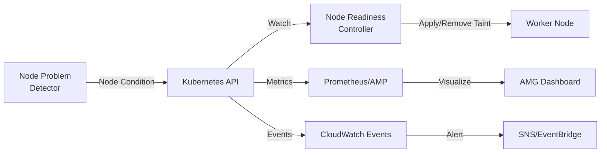
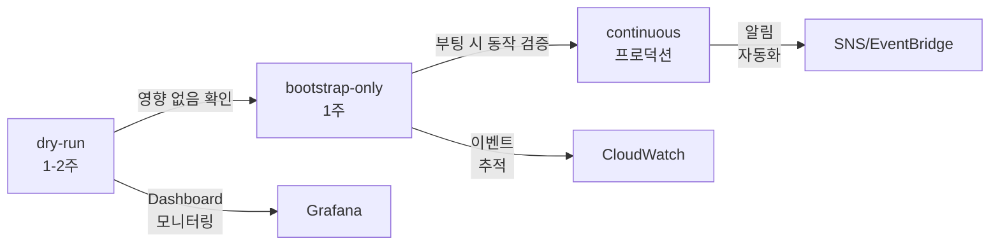
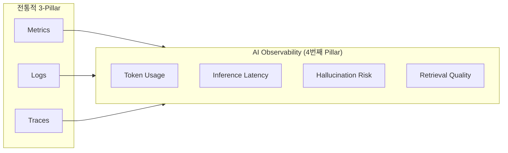
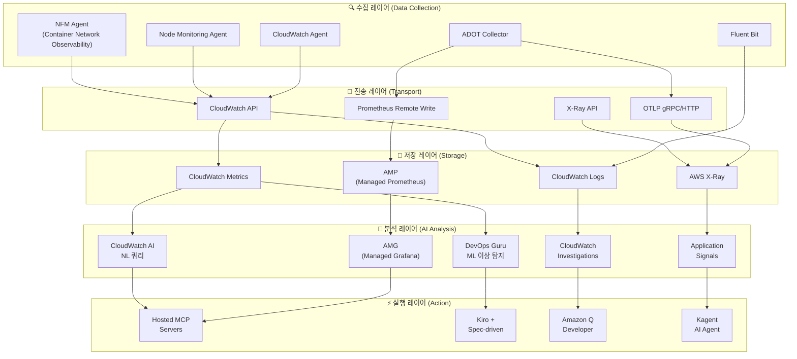
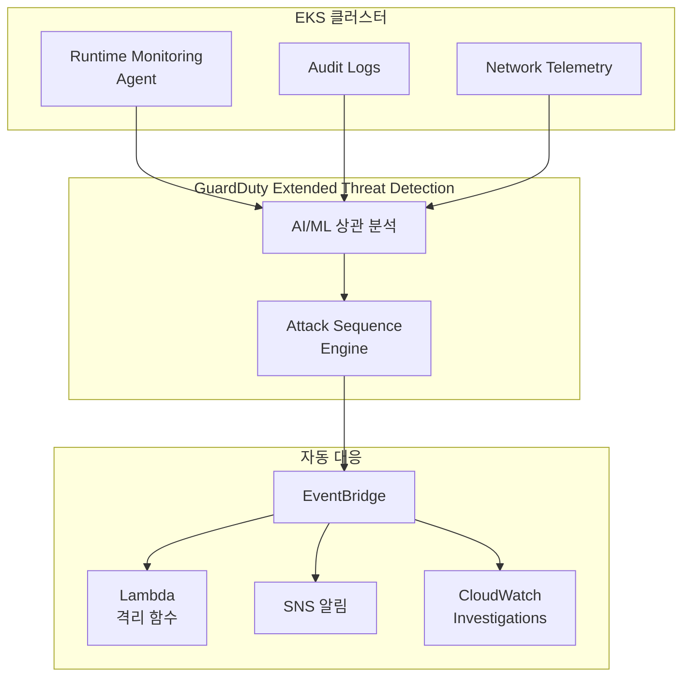
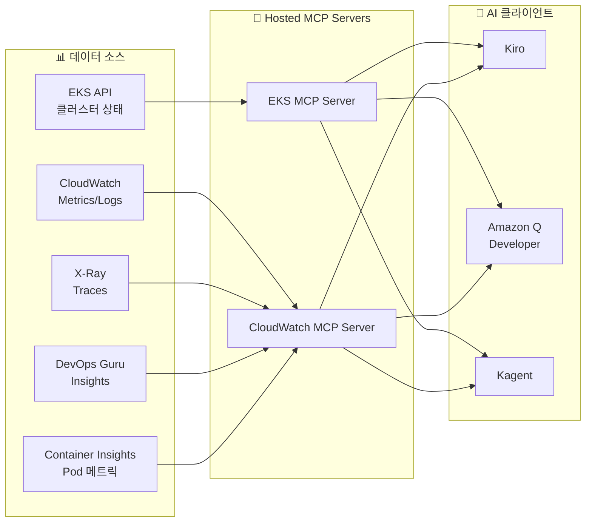
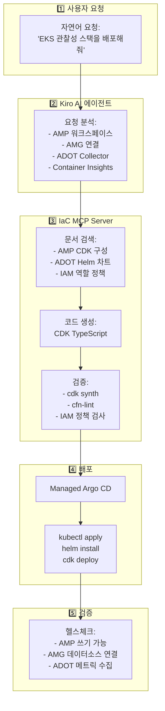

import { ArchitectureLayers, ManagedAddons, ServiceComparison, ObservabilityPillars, StackSelectionPatterns, DataFlowSummary, ProcessorSettings, ContainerInsightsMetrics, ApplicationSignalsLanguages, DevOpsGuruCost, EKSMCPTools, ErrorBudget, AlertOptimization } from '@site/src/components/ObservabilityStackTables';

# EKS 지능형 관찰성 스택 구축

> 📅 **작성일**: 2026-02-12 | ⏱️ **읽는 시간**: 약 35분 | 📌 **기준 환경**: EKS 1.35+, ADOT v0.40+, AMP, AMG

---

## 1. 개요

현대 분산 시스템에서 **관찰성(Observability)**은 단순한 모니터링을 넘어, 시스템의 내부 상태를 외부 출력을 통해 이해하는 능력을 의미합니다. EKS 환경에서는 수백 개의 Pod, 복잡한 서비스 메시, 동적 스케일링이 결합되어 전통적 모니터링만으로는 문제의 근본 원인을 파악하기 어렵습니다.

### 1.1 3-Pillar 관찰성 + AI 분석 레이어

관찰성의 세 가지 기둥과 AI 분석 레이어를 결합하면 진정한 지능형 운영이 가능합니다.

<ObservabilityPillars />

:::info 이 문서의 범위
Managed Add-on 기반 관찰성 기초부터 AI 분석 레이어까지, EKS 환경에서 지능형 관찰성 스택을 구축하는 전체 과정을 다룹니다. AWS가 오픈소스 관찰성 도구를 관리형으로 운영하여 **복잡도를 제거**하면서 **K8s 네이티브 관찰성을 극대화**하는 전략을 중심으로 설명합니다. 이 문서는 AWS 네이티브 스택을 기준으로 작성되었지만, ADOT(OpenTelemetry)를 수집 레이어로 사용하면 3rd Party 백엔드와도 동일한 아키텍처를 적용할 수 있습니다.
:::

### 1.3 관찰성 스택 선택 패턴

실제 EKS 운영 환경에서는 조직의 요구사항과 기존 투자에 따라 크게 세 가지 관찰성 스택 패턴이 사용됩니다:

<StackSelectionPatterns />

:::tip 수집 레이어의 핵심: ADOT (OpenTelemetry)

어떤 백엔드를 선택하든, **수집 레이어에 ADOT(OpenTelemetry)를 사용하면 백엔드 교체가 자유롭습니다.** OpenTelemetry는 CNCF 표준이므로 Prometheus, Jaeger, Datadog, Sumo Logic 등 대부분의 백엔드로 데이터를 내보낼 수 있습니다. 이것이 AWS가 자체 에이전트 대신 OpenTelemetry를 Managed Add-on(ADOT)으로 제공하는 이유입니다.
:::

이 문서는 **AWS 네이티브** 및 **OSS 중심** 패턴을 기준으로 구성을 설명합니다. 3rd Party 백엔드를 사용하는 경우, ADOT Collector의 exporter 설정만 변경하면 동일한 수집 파이프라인을 활용할 수 있습니다.

### 1.2 왜 EKS에서 관찰성이 중요한가

EKS 환경의 관찰성은 다음 이유로 필수적입니다:

- **동적 인프라**: Pod가 수시로 생성/삭제되며, 노드가 Karpenter에 의해 동적 프로비저닝
- **마이크로서비스 복잡성**: 서비스 간 호출 체인이 복잡하여 단일 장애 지점 파악이 어려움
- **멀티 레이어 문제**: 애플리케이션, 컨테이너 런타임, 노드, 네트워크, AWS 서비스 등 다층 구조
- **비용 최적화**: 리소스 사용 패턴 분석을 통한 Right-sizing 필요
- **규정 준수**: 감사 로그, 접근 기록 등 컴플라이언스 요구사항

---

## 2. Managed Add-ons 기반 관찰성 기초

EKS Managed Add-ons는 AWS가 관찰성 에이전트의 설치, 업그레이드, 패치를 관리하여 운영 복잡성을 제거합니다. `aws eks create-addon` 한 줄의 명령으로 프로덕션 수준의 관찰성 기초를 확립할 수 있습니다.

<ManagedAddons />

### 2.1 ADOT (AWS Distro for OpenTelemetry) Add-on

ADOT는 OpenTelemetry의 AWS 배포판으로, 메트릭·로그·트레이스를 단일 에이전트로 수집합니다.

```bash
# ADOT Add-on 설치
aws eks create-addon \
  --cluster-name my-cluster \
  --addon-name adot \
  --addon-version v0.40.0-eksbuild.1 \
  --service-account-role-arn arn:aws:iam::ACCOUNT_ID:role/adot-collector-role

# 설치 확인
aws eks describe-addon \
  --cluster-name my-cluster \
  --addon-name adot \
  --query 'addon.status'
```

:::tip ADOT vs 자체 OpenTelemetry 배포
ADOT Add-on을 사용하면 OpenTelemetry Operator가 자동 설치되며, AWS 서비스 인증(SigV4)이 내장됩니다. 자체 배포 대비 운영 부담이 크게 줄어들며, EKS 버전 호환성이 AWS에 의해 보장됩니다.
:::

### 2.2 CloudWatch Observability Agent Add-on

CloudWatch Observability Agent는 Container Insights Enhanced, Application Signals, CloudWatch Logs를 통합 제공합니다.

```bash
# CloudWatch Observability Agent Add-on
aws eks create-addon \
  --cluster-name my-cluster \
  --addon-name amazon-cloudwatch-observability \
  --service-account-role-arn arn:aws:iam::ACCOUNT_ID:role/cloudwatch-agent-role

# 구성 확인
kubectl get pods -n amazon-cloudwatch
```

### 2.3 Node Monitoring Agent Add-on (2025)

Node Monitoring Agent는 EC2 노드의 하드웨어 및 OS 수준 문제를 탐지합니다.

```bash
# Node Monitoring Agent Add-on
aws eks create-addon \
  --cluster-name my-cluster \
  --addon-name eks-node-monitoring-agent
```

주요 탐지 항목:

- **NVMe 디스크 오류**: EBS 볼륨 성능 저하 사전 감지
- **메모리 하드웨어 오류**: EDAC(Error Detection and Correction) 이벤트
- **커널 소프트 락업**: CPU가 비정상적으로 오래 점유된 상태
- **OOM(Out of Memory)**: 메모리 부족으로 인한 프로세스 종료

#### 2.3.1 Node Readiness Controller와 관찰성 통합

**Node Readiness Controller(NRC)**는 Kubernetes 1.32에 Beta로 도입된 컨트롤러로, Node Problem Detector(NPD)가 보고한 노드 문제를 기반으로 노드 taint를 자동 관리합니다. 이는 관찰성 데이터를 자동 조치(remediation)로 연결하는 **Closed-Loop 관찰성(Closed-Loop Observability)** 패턴의 핵심 구성 요소입니다.

**관찰성 파이프라인에서의 역할:**



1. **수집**: Node Monitoring Agent Add-on이 하드웨어/OS 문제 탐지
2. **보고**: NPD가 Node Condition으로 K8s API에 상태 보고
3. **감지**: NRC가 Node Condition 변화를 모니터링
4. **조치**: NRC가 자동으로 `node.kubernetes.io/unschedulable` taint 적용/제거
5. **관찰**: CloudWatch Container Insights 및 AMP가 taint 변경 이벤트 추적
6. **알림**: SNS/EventBridge를 통해 운영팀에 노드 상태 변화 통지

**CloudWatch Container Insights 통합:**

```bash
# NRC 관련 노드 taint 변경 이벤트를 CloudWatch Logs Insights로 조회
aws logs start-query \
  --log-group-name /aws/containerinsights/my-cluster/application \
  --start-time $(date -u -d '1 hour ago' +%s) \
  --end-time $(date -u +%s) \
  --query-string '
fields @timestamp, kubernetes.node_name, message
| filter message like /NoSchedule/
| filter message like /node.kubernetes.io\/unschedulable/
| sort @timestamp desc
'

# 출력 예시:
# 2026-02-12 10:23:45 | node-abc123 | Taint added: node.kubernetes.io/unschedulable:NoSchedule (DiskPressure)
# 2026-02-12 10:28:12 | node-abc123 | Taint removed: node.kubernetes.io/unschedulable (DiskPressure resolved)
```

**Prometheus 메트릭 수집:**

NRC는 kube-controller-manager의 일부로 동작하며, 다음 메트릭을 노출합니다:

```yaml
# ServiceMonitor로 NRC 메트릭 수집
apiVersion: monitoring.coreos.com/v1
kind: ServiceMonitor
metadata:
  name: node-readiness-controller
  namespace: kube-system
spec:
  selector:
    matchLabels:
      component: kube-controller-manager
  endpoints:
  - port: metrics
    path: /metrics
    interval: 30s

# 주요 메트릭:
# - node_readiness_controller_reconcile_total: NRC reconciliation 실행 횟수
# - node_readiness_controller_reconcile_duration_seconds: Reconciliation 처리 시간
# - node_readiness_controller_taint_changes_total: Taint 적용/제거 횟수
```

**AMG(Amazon Managed Grafana) 대시보드 시각화:**

```json
{
  "dashboard": {
    "title": "Node Readiness & Health",
    "panels": [
      {
        "title": "Nodes with Unschedulable Taints",
        "targets": [{
          "expr": "count(kube_node_spec_taint{key='node.kubernetes.io/unschedulable'})"
        }]
      },
      {
        "title": "NRC Reconciliation Rate",
        "targets": [{
          "expr": "rate(node_readiness_controller_reconcile_total[5m])"
        }]
      },
      {
        "title": "Node Condition Changes (24h)",
        "targets": [{
          "expr": "increase(node_readiness_controller_taint_changes_total[24h])"
        }]
      }
    ]
  }
}
```

**EventBridge 기반 알림 자동화:**

```yaml
# EventBridge Rule: NRC taint 변경 시 SNS 알림
apiVersion: v1
kind: ConfigMap
metadata:
  name: eventbridge-rule
data:
  rule.json: |
    {
      "source": ["aws.eks"],
      "detail-type": ["EKS Node Taint Change"],
      "detail": {
        "taintKey": ["node.kubernetes.io/unschedulable"],
        "action": ["added", "removed"]
      }
    }
---
# SNS 주제로 알림 전송
# 알림 예시:
# [ALERT] Node ip-10-0-1-45.ap-northeast-2.compute.internal
# Taint added: node.kubernetes.io/unschedulable:NoSchedule
# Reason: DiskPressure detected by Node Monitoring Agent
# Action: Pods will not be scheduled until condition resolves
```

**Dry-run 모드 활용 (프로덕션 적용 전 검증):**

NRC는 세 가지 모드를 지원합니다:

| 모드 | 설명 | 사용 시기 |
|------|------|----------|
| `dry-run` | Taint 변경을 시뮬레이션만 수행 (실제 적용 안 함) | 프로덕션 적용 전 영향 범위 평가 |
| `bootstrap-only` | 클러스터 부팅 시에만 taint 적용 | 초기 노드 준비 단계에서만 사용 |
| `continuous` | 지속적으로 노드 상태 모니터링 및 taint 관리 | 프로덕션 환경 (권장) |

```bash
# Dry-run 모드로 NRC 활성화 (영향 범위 시뮬레이션)
kubectl patch deployment kube-controller-manager \
  -n kube-system \
  --type='json' \
  -p='[{
    "op": "add",
    "path": "/spec/template/spec/containers/0/command/-",
    "value": "--feature-gates=NodeReadinessController=true"
  },{
    "op": "add",
    "path": "/spec/template/spec/containers/0/command/-",
    "value": "--node-readiness-controller-mode=dry-run"
  }]'

# Dry-run 결과를 CloudWatch Logs Insights로 분석
aws logs start-query \
  --log-group-name /aws/containerinsights/my-cluster/application \
  --start-time $(date -u -d '1 hour ago' +%s) \
  --end-time $(date -u +%s) \
  --query-string '
fields @timestamp, message
| filter message like /dry-run/
| filter message like /would add taint/
| stats count() by kubernetes.node_name
'

# 출력: 각 노드별로 적용될 taint 개수 확인
# → 영향 범위 평가 후 continuous 모드로 전환 결정
```

**점진적 Rollout 전략:**



1. **Dry-run 단계**: 관찰성 대시보드에서 시뮬레이션 결과 모니터링
2. **Bootstrap-only 단계**: 노드 부팅 시에만 taint 적용하여 초기 영향 평가
3. **Continuous 단계**: 프로덕션 환경에 완전 활성화 및 지속 모니터링

:::tip 관찰성 → 자동 조치의 Best Practice
NRC는 관찰성 데이터를 바탕으로 자동 조치를 수행하는 **Closed-Loop Observability** 패턴의 좋은 예시입니다. Node Monitoring Agent가 문제를 탐지하면 NRC가 자동으로 노드를 격리하여 워크로드 안정성을 유지합니다. 이는 사람의 개입 없이 시스템이 스스로 회복하는 **Self-Healing Infrastructure**의 핵심 구성 요소입니다.
:::

:::info 참조
- [Kubernetes Blog: Introducing Node Readiness Controller](https://kubernetes.io/blog/2026/02/03/introducing-node-readiness-controller/)
- [KEP-4868: Node Readiness Controller](https://github.com/kubernetes/enhancements/tree/master/keps/sig-node/4868-node-readiness-controller)
:::

### 2.4 Container Network Observability (2025.11)

2025년 11월 re:Invent에서 발표된 **Container Network Observability**는 EKS 환경에서 K8s 컨텍스트를 포함한 네트워크 가시성을 제공하는 기능입니다. 기존 VPC Flow Logs가 IP 수준의 트래픽만 보여주었다면, Container Network Observability는 **Pod → Pod, Pod → Service, Pod → 외부 서비스** 수준의 네트워크 플로우를 K8s 메타데이터(네임스페이스, 서비스명, Pod 라벨)와 함께 제공합니다.

```bash
# Network Flow Monitoring Agent Add-on 설치
aws eks create-addon \
  --cluster-name my-cluster \
  --addon-name aws-network-flow-monitoring-agent

# VPC CNI에서 Container Network Observability 활성화
aws eks update-addon \
  --cluster-name my-cluster \
  --addon-name vpc-cni \
  --configuration-values '{"enableNetworkPolicy":"true"}'
```

주요 기능:

- **Pod 수준 네트워크 메트릭**: TCP 재전송, 패킷 드롭, 연결 지연시간을 Pod/Service 단위로 추적
- **Cross-AZ 트래픽 가시성**: AZ 간 데이터 전송량을 서비스별로 측정하여 불필요한 Cross-AZ 비용 식별
- **K8s 컨텍스트 네트워크 맵**: 네트워크 플로우에 네임스페이스, 서비스명, Pod 라벨 자동 매핑
- **AWS 서비스 통신 추적**: Pod에서 S3, RDS, DynamoDB 등 AWS 서비스로의 트래픽 패턴 분석
- **선호 관찰성 스택 연동**: AMP/Grafana, CloudWatch, Datadog 등 어떤 백엔드로든 메트릭 전송 가능

:::tip Enhanced Network Security Policies (2025.12)
Container Network Observability와 함께, EKS는 **Enhanced Network Security Policies**도 도입했습니다. 클러스터 전체에 걸친 네트워크 접근 필터를 중앙에서 적용하고, DNS 기반 이그레스 정책으로 외부 트래픽을 세밀하게 제어할 수 있습니다. VPC CNI의 Network Policy 기능을 기반으로 동작합니다.
:::

:::info 핵심 메시지
5개의 관찰성 Managed Add-on만으로 **인프라(Node Monitoring)**, **네트워크(NFM Agent → Container Network Observability)**, **애플리케이션(ADOT, CloudWatch Agent)** 전 레이어의 관찰성 기초가 확립됩니다. 모두 `aws eks create-addon` 한 줄로 배포되며, 버전 관리와 보안 패치는 AWS가 담당합니다.
:::

### 2.6 CloudWatch Generative AI Observability

2025년 7월 Preview로 시작하여 10월 GA를 달성한 **CloudWatch Generative AI Observability**는 AI/ML 워크로드를 위한 새로운 관찰성 차원을 제공합니다. 기존 3-Pillar 관찰성(Metrics, Logs, Traces)에 **AI 워크로드 전용 관찰성**을 추가하여 4-Pillar 관찰성 시대를 엽니다.

#### 2.6.1 핵심 기능

**LLM 및 AI Agent 모니터링:**
- Amazon Bedrock, EKS, ECS, 온프레미스 등 모든 인프라에서 실행되는 LLM 및 AI Agent 모니터링
- 토큰 소비 추적 (입력/출력 토큰 수, 토큰당 비용)
- 추론 레이턴시 분석 (요청-응답 시간, P50/P90/P99 레이턴시)
- End-to-end 트레이싱으로 전체 AI 스택 가시성 확보

**AI 워크플로우 특화 관찰성:**
- **Hallucination 위험 경로 탐지**: 모델이 잘못된 정보를 생성할 가능성이 높은 경로 식별
- **Retrieval miss 식별**: RAG(Retrieval-Augmented Generation) 시스템에서 검색 실패 추적
- **Rate-limit retry 모니터링**: API 제한으로 인한 재시도 패턴 분석
- **Model-switch 결정 추적**: 여러 모델 간 전환 로직 모니터링

**Amazon Bedrock AgentCore 통합:**
- Agent 워크플로우, Knowledge Base, Tool 사용에 대한 즉시 사용 가능한 뷰 제공
- 크로스 도구 프롬프트 플로우 가시성
- 외부 프레임워크(LangChain, LangGraph, CrewAI) 지원

#### 2.6.2 4-Pillar 관찰성 아키텍처



:::info AI 관찰성의 차별점
기존 3-Pillar 관찰성은 시스템의 **동작(behavior)**을 관찰하지만, AI 관찰성은 모델의 **의사결정(decision-making)**과 **품질(quality)**을 관찰합니다. 예를 들어, API 레이턴시(전통적)와 추론 품질(AI 특화)은 서로 다른 관찰 대상입니다.
:::

#### 2.6.3 활성화 방법

```bash
# CloudWatch Generative AI Observability 활성화 (EKS 워크로드)
# ADOT Collector에 AI Observability Exporter 추가
kubectl apply -f - <<EOF
apiVersion: opentelemetry.io/v1beta1
kind: OpenTelemetryCollector
metadata:
  name: adot-ai-observability
  namespace: observability
spec:
  mode: deployment
  config:
    receivers:
      otlp:
        protocols:
          grpc:
            endpoint: "0.0.0.0:4317"

    processors:
      batch:
        timeout: 10s

    exporters:
      awsxray:
        region: ap-northeast-2
        indexed_attributes:
          - "gen_ai.system"
          - "gen_ai.request.model"
          - "gen_ai.usage.input_tokens"
          - "gen_ai.usage.output_tokens"

      awscloudwatch:
        region: ap-northeast-2
        namespace: "GenAI/Observability"
        metric_declarations:
          - dimensions:
              - ["service.name", "gen_ai.request.model"]
            metric_name_selectors:
              - "gen_ai.usage.input_tokens"
              - "gen_ai.usage.output_tokens"
              - "gen_ai.request.duration"

    service:
      pipelines:
        traces:
          receivers: [otlp]
          processors: [batch]
          exporters: [awsxray]
        metrics:
          receivers: [otlp]
          processors: [batch]
          exporters: [awscloudwatch]
EOF
```

#### 2.6.4 MCP 통합 및 자동화

CloudWatch Generative AI Observability는 **Bedrock Data Automation MCP 서버**와 통합되어 AI 관찰성 데이터를 Kiro, Amazon Q Developer 등 AI 클라이언트에서 직접 조회할 수 있습니다.

```
[시나리오: LLM 추론 레이턴시 증가]

Kiro + MCP 자동 분석:
1. CloudWatch MCP: query_ai_metrics("inference_latency") → P99 500ms → 2.3s 증가
2. CloudWatch MCP: get_ai_traces(service="recommendation-llm") → 토큰 수 급증 확인
3. CloudWatch MCP: check_hallucination_risk() → 특정 프롬프트 패턴에서 위험도 높음
4. Bedrock MCP: get_model_config() → 모델 파라미터 max_tokens 설정 과도

→ Kiro가 자동으로:
   - max_tokens 제한 최적화 PR 생성
   - 프롬프트 엔지니어링 개선 제안
   - 대체 모델(소형 모델) 사용 로직 추가
```

:::tip GitHub Action 통합
CloudWatch Generative AI Observability는 GitHub Action을 제공하여 PR에 AI 관찰성 데이터를 자동으로 추가할 수 있습니다. 모델 변경 PR에 토큰 소비량, 레이턴시 변화, Hallucination 위험도 변화를 자동으로 표시하여 배포 전 영향을 파악할 수 있습니다.
:::

#### 2.6.5 실제 사용 사례

**사례 1: RAG 시스템 검색 품질 모니터링**
```
[문제 발견]
Retrieval miss rate: 15% → 35% 급증 (2시간 내)

[CloudWatch AI Observability 분석]
- Knowledge Base 인덱스가 7일간 업데이트 안 됨
- 최신 문서에 대한 쿼리가 실패하는 패턴 감지
- Embedding 모델 버전 불일치 확인

[자동 조치]
→ Knowledge Base 재인덱싱 트리거
→ Embedding 모델 동기화
→ Retrieval miss rate 15%로 복구
```

**사례 2: 토큰 비용 최적화**
```
[비용 이상 감지]
일일 토큰 소비: $500 → $2,300 (460% 증가)

[원인 분석]
- 특정 프롬프트 템플릿이 평균 5,000 토큰 출력 (정상: 500)
- 반복적 프롬프트 체인이 불필요하게 긴 컨텍스트 유지

[최적화 결과]
→ 프롬프트 템플릿 리팩토링
→ 컨텍스트 윈도우 동적 조정
→ 비용 $600/일로 감소 (74% 절감)
:::

---

---

## 3. 전체 아키텍처

EKS 지능형 관찰성 스택은 5개 레이어로 구성됩니다.

<ArchitectureLayers />



### 3.1 데이터 흐름 요약

<DataFlowSummary />

---

## 4. ADOT Collector 배포

### 4.1 OpenTelemetryCollector CRD

ADOT Add-on을 설치하면 OpenTelemetry Operator가 함께 배포되며, `OpenTelemetryCollector` CRD를 통해 선언적으로 수집기를 관리합니다.

```yaml
apiVersion: opentelemetry.io/v1beta1
kind: OpenTelemetryCollector
metadata:
  name: adot-collector
  namespace: observability
spec:
  mode: deployment
  replicas: 2
  resources:
    limits:
      cpu: "1"
      memory: 2Gi
    requests:
      cpu: 200m
      memory: 512Mi
  config:
    receivers:
      otlp:
        protocols:
          grpc:
            endpoint: "0.0.0.0:4317"
          http:
            endpoint: "0.0.0.0:4318"
      prometheus:
        config:
          scrape_configs:
            - job_name: 'kubernetes-pods'
              kubernetes_sd_configs:
                - role: pod
              relabel_configs:
                - source_labels: [__meta_kubernetes_pod_annotation_prometheus_io_scrape]
                  action: keep
                  regex: true
    processors:
      batch:
        timeout: 10s
        send_batch_size: 1024
      memory_limiter:
        check_interval: 1s
        limit_mib: 512
        spike_limit_mib: 128
      resource:
        attributes:
          - key: cluster.name
            value: "my-eks-cluster"
            action: upsert
          - key: aws.region
            value: "ap-northeast-2"
            action: upsert
      filter:
        metrics:
          exclude:
            match_type: regexp
            metric_names:
              - "go_.*"
              - "process_.*"
    exporters:
      prometheusremotewrite:
        endpoint: "https://aps-workspaces.ap-northeast-2.amazonaws.com/workspaces/ws-xxxxx/api/v1/remote_write"
        auth:
          authenticator: sigv4auth
        resource_to_telemetry_conversion:
          enabled: true
      awsxray:
        region: ap-northeast-2
        indexed_attributes:
          - "otel.resource.service.name"
          - "otel.resource.deployment.environment"
      awscloudwatchlogs:
        region: ap-northeast-2
        log_group_name: "/eks/my-cluster/application"
        log_stream_name: "otel-logs"
    extensions:
      sigv4auth:
        region: ap-northeast-2
        service: aps
      health_check:
        endpoint: "0.0.0.0:13133"
    service:
      extensions: [sigv4auth, health_check]
      pipelines:
        metrics:
          receivers: [otlp, prometheus]
          processors: [memory_limiter, filter, batch, resource]
          exporters: [prometheusremotewrite]
        traces:
          receivers: [otlp]
          processors: [memory_limiter, batch, resource]
          exporters: [awsxray]
        logs:
          receivers: [otlp]
          processors: [memory_limiter, batch, resource]
          exporters: [awscloudwatchlogs]
```

### 4.2 DaemonSet 모드 배포

노드별 메트릭 수집이 필요한 경우 DaemonSet 모드를 사용합니다.

```yaml
apiVersion: opentelemetry.io/v1beta1
kind: OpenTelemetryCollector
metadata:
  name: adot-node-collector
  namespace: observability
spec:
  mode: daemonset
  hostNetwork: true
  volumes:
    - name: hostfs
      hostPath:
        path: /
  volumeMounts:
    - name: hostfs
      mountPath: /hostfs
      readOnly: true
  env:
    - name: K8S_NODE_NAME
      valueFrom:
        fieldRef:
          fieldPath: spec.nodeName
  config:
    receivers:
      hostmetrics:
        root_path: /hostfs
        collection_interval: 30s
        scrapers:
          cpu: {}
          disk: {}
          filesystem: {}
          load: {}
          memory: {}
          network: {}
      kubeletstats:
        collection_interval: 30s
        auth_type: serviceAccount
        endpoint: "https://${env:K8S_NODE_NAME}:10250"
        insecure_skip_verify: true
    processors:
      batch:
        timeout: 30s
      resourcedetection:
        detectors: [env, eks]
    exporters:
      prometheusremotewrite:
        endpoint: "https://aps-workspaces.ap-northeast-2.amazonaws.com/workspaces/ws-xxxxx/api/v1/remote_write"
        auth:
          authenticator: sigv4auth
    extensions:
      sigv4auth:
        region: ap-northeast-2
        service: aps
    service:
      extensions: [sigv4auth]
      pipelines:
        metrics:
          receivers: [hostmetrics, kubeletstats]
          processors: [resourcedetection, batch]
          exporters: [prometheusremotewrite]
```

:::tip Deployment vs DaemonSet 선택 기준

- **Deployment 모드**: 애플리케이션 메트릭/트레이스 수집 (OTLP 수신), 중앙 집중식 처리
- **DaemonSet 모드**: 노드 수준 메트릭 수집 (hostmetrics, kubeletstats), 네트워크 효율적
- **Sidecar 모드**: 특정 Pod의 로그/트레이스만 수집, 격리 필요 시
:::

### 4.3 파이프라인 구성 원칙

ADOT Collector의 파이프라인은 `receivers → processors → exporters` 순서로 데이터를 처리합니다.

```
┌─────────────┐    ┌──────────────┐    ┌─────────────┐
│  Receivers   │───▶│  Processors  │───▶│  Exporters  │
│             │    │              │    │             │
│ • otlp      │    │ • memory_    │    │ • prometheus│
│ • prometheus│    │   limiter    │    │   remotewrite│
│ • hostmetrics│   │ • batch      │    │ • awsxray   │
│ • kubelet   │    │ • filter     │    │ • cwlogs    │
│   stats     │    │ • resource   │    │             │
└─────────────┘    └──────────────┘    └─────────────┘
```

**핵심 프로세서 설정**:

<ProcessorSettings />

---

## 5. AMP + AMG 통합

### 5.1 AMP (Amazon Managed Prometheus)

AMP는 Prometheus 호환 관리형 서비스로, 인프라 관리 없이 대규모 메트릭을 저장하고 쿼리합니다.

```bash
# AMP 워크스페이스 생성
aws amp create-workspace \
  --alias my-eks-observability \
  --tags Environment=production

# 워크스페이스 ID 확인
aws amp list-workspaces \
  --query 'workspaces[?alias==`my-eks-observability`].workspaceId' \
  --output text
```

### 5.2 Remote Write 설정

ADOT에서 AMP로 메트릭을 전송하는 remote_write 구성입니다.

```yaml
# Prometheus remote_write configuration
remoteWrite:
  - url: "https://aps-workspaces.ap-northeast-2.amazonaws.com/workspaces/ws-xxxxx/api/v1/remote_write"
    sigv4:
      region: ap-northeast-2
    queue_config:
      max_samples_per_send: 1000
      max_shards: 200
      capacity: 2500
    write_relabel_configs:
      - source_labels: [__name__]
        regex: "go_.*|process_.*"
        action: drop
```

:::warning Remote Write 비용 최적화
AMP는 수집된 메트릭 샘플 수 기준으로 과금됩니다. `write_relabel_configs`를 통해 불필요한 메트릭(go_*, process_*)을 drop하면 비용을 30-50% 절감할 수 있습니다. 또한 `scrape_interval`을 15s에서 30s로 늘리면 샘플 수가 절반으로 줄어듭니다.
:::

### 5.3 AMG (Amazon Managed Grafana) 데이터소스 연결

AMG에서 AMP를 데이터소스로 추가합니다.

```bash
# AMG 워크스페이스 생성
aws grafana create-workspace \
  --workspace-name my-eks-grafana \
  --account-access-type CURRENT_ACCOUNT \
  --authentication-providers AWS_SSO \
  --permission-type SERVICE_MANAGED \
  --workspace-data-sources PROMETHEUS CLOUDWATCH XRAY

# 데이터소스 자동 구성 (AMP 연결)
aws grafana create-workspace-service-account \
  --workspace-id g-xxxxxxxxxx \
  --grafana-role ADMIN \
  --name amp-datasource
```

AMG에서 AMP 데이터소스를 추가한 후 사용할 수 있는 핵심 PromQL 쿼리들입니다.

### 5.4 핵심 PromQL 쿼리

```promql
# Pod CPU 사용률 상위 10개
topk(10,
  sum(rate(container_cpu_usage_seconds_total{namespace!="kube-system"}[5m])) by (pod)
)

# 노드별 메모리 사용률
100 * (1 - (
  node_memory_MemAvailable_bytes / node_memory_MemTotal_bytes
))

# HTTP 요청 에러율 (5xx)
sum(rate(http_requests_total{status=~"5.."}[5m]))
/ sum(rate(http_requests_total[5m])) * 100

# P99 레이턴시
histogram_quantile(0.99,
  sum(rate(http_request_duration_seconds_bucket[5m])) by (le, service)
)

# Pod 재시작 횟수 (최근 1시간)
increase(kube_pod_container_status_restarts_total[1h])

# Karpenter 노드 프로비저닝 대기 시간
histogram_quantile(0.95,
  sum(rate(karpenter_provisioner_scheduling_duration_seconds_bucket[10m])) by (le)
)
```

:::info AMP + AMG의 핵심 가치
AWS가 Prometheus와 Grafana의 인프라 관리(스케일링, 패치, 고가용성, 백업)를 모두 담당합니다. 팀은 **대시보드 구성과 쿼리 작성**에만 집중할 수 있어, 관찰성의 본질적 가치에 집중할 수 있습니다. 이것이 바로 "오픈소스의 장점을 유지하면서 복잡도를 제거"하는 AWS 전략의 핵심입니다.
:::

### 5.5 Grafana Alloy: 차세대 수집기 패턴

**Grafana Alloy**는 Grafana Agent의 후속 제품으로, 2024년 4월 공식 발표되었습니다. OpenTelemetry와 Prometheus 수집을 모두 지원하며, **Flow 모드**를 기반으로 더욱 유연한 파이프라인 구성이 가능합니다.

#### 5.5.1 Grafana Alloy vs ADOT 비교

| 특성 | ADOT (AWS 관점) | Grafana Alloy | 권장 시나리오 |
|------|----------------|---------------|--------------|
| **관리 형태** | EKS Managed Add-on | 자체 배포 (Helm) | ADOT: AWS 통합 우선 시 |
| **백엔드 초점** | AWS 서비스 (AMP, CloudWatch, X-Ray) | Grafana Cloud, Prometheus, Loki | Alloy: Grafana 생태계 중심 시 |
| **OpenTelemetry 지원** | ✅ 네이티브 (OTEL Collector 기반) | ✅ 네이티브 (OTEL Receiver 내장) | 동등 |
| **Prometheus 수집** | ✅ (prometheus receiver) | ✅ (prometheus.scrape) | Alloy가 더 가볍고 빠름 |
| **로그 수집** | CloudWatch Logs, S3 | Loki, CloudWatch Logs | Alloy: Loki 최적화 |
| **트레이싱** | X-Ray, OTLP | Tempo, Jaeger, OTLP | Alloy: Tempo 최적화 |
| **설정 방식** | YAML (OTEL Collector 표준) | River 언어 (선언적 + 동적) | Alloy가 더 직관적 |
| **AWS IAM 통합** | ✅ SigV4 내장 | ❌ (수동 설정 필요) | ADOT가 훨씬 간편 |
| **리소스 사용량** | 중간 (Go 기반) | 낮음 (최적화된 Go) | Alloy가 약 30% 적음 |

:::tip ADOT vs Grafana Alloy 선택 가이드

**ADOT를 선택하는 경우:**
- AWS Managed Add-on의 편의성을 원할 때
- AMP + CloudWatch + X-Ray를 주 백엔드로 사용할 때
- AWS IAM 인증을 자동으로 처리하고 싶을 때
- EKS 버전 호환성을 AWS가 보장받고 싶을 때

**Grafana Alloy를 선택하는 경우:**
- Grafana Cloud 또는 자체 호스팅 Grafana 스택을 사용할 때
- Loki + Tempo + Mimir 조합으로 완전한 오픈소스 스택을 구축할 때
- 더 가벼운 리소스 사용량이 중요할 때 (비용 민감)
- River 언어의 동적 구성 기능이 필요할 때
:::

#### 5.5.2 EKS에서 Grafana Alloy 배포

```bash
# Helm 리포지토리 추가
helm repo add grafana https://grafana.github.io/helm-charts
helm repo update

# Grafana Alloy 설치
helm install grafana-alloy grafana/alloy \
  --namespace observability \
  --create-namespace \
  --set alloy.configMap.content='
logging {
  level = "info"
  format = "logfmt"
}

// Prometheus 메트릭 수집
prometheus.scrape "kubernetes_pods" {
  targets = discovery.kubernetes.pods.targets
  forward_to = [prometheus.remote_write.amp.receiver]

  clustering {
    enabled = true
  }
}

// Kubernetes Pod 자동 검색
discovery.kubernetes "pods" {
  role = "pod"

  selectors {
    role  = "pod"
    field = "spec.nodeName=" + env("HOSTNAME")
  }
}

// AMP로 메트릭 전송 (SigV4 인증)
prometheus.remote_write "amp" {
  endpoint {
    url = "https://aps-workspaces.ap-northeast-2.amazonaws.com/workspaces/ws-xxxxx/api/v1/remote_write"

    sigv4 {
      region = "ap-northeast-2"
    }
  }
}

// Loki로 로그 전송
loki.source.kubernetes "pods" {
  targets    = discovery.kubernetes.pods.targets
  forward_to = [loki.write.default.receiver]
}

loki.write "default" {
  endpoint {
    url = "https://logs-prod-012.grafana.net/loki/api/v1/push"

    basic_auth {
      username = env("LOKI_USERNAME")
      password = env("LOKI_PASSWORD")
    }
  }
}

// OpenTelemetry 트레이스 수신
otelcol.receiver.otlp "default" {
  grpc {
    endpoint = "0.0.0.0:4317"
  }

  http {
    endpoint = "0.0.0.0:4318"
  }

  output {
    traces  = [otelcol.exporter.otlp.tempo.input]
  }
}

otelcol.exporter.otlp "tempo" {
  client {
    endpoint = "tempo.grafana.net:443"

    auth {
      authenticator = otelcol.auth.basic.tempo.handler
    }
  }
}

otelcol.auth.basic "tempo" {
  username = env("TEMPO_USERNAME")
  password = env("TEMPO_PASSWORD")
}
'
```

#### 5.5.3 AMP + Alloy 조합 vs AMP + ADOT 조합

**시나리오 1: AMP + Grafana Alloy**

```
장점:
✅ 리소스 사용량 30% 감소 (CPU/Memory)
✅ Prometheus 수집 성능 우수 (초당 100K 샘플)
✅ River 언어로 동적 구성 가능 (재배포 없이 구성 변경)

단점:
❌ AWS IAM 인증 수동 설정 필요 (SigV4 자격증명 관리)
❌ EKS Managed Add-on 지원 없음 (수동 업그레이드)
❌ CloudWatch Logs 연동 복잡 (추가 설정 필요)
```

**시나리오 2: AMP + ADOT**

```
장점:
✅ EKS Managed Add-on으로 완전 자동 관리
✅ AWS IAM 통합 (SigV4 자동, IRSA 지원)
✅ CloudWatch + X-Ray 네이티브 통합
✅ AWS 지원 및 호환성 보장

단점:
❌ 리소스 사용량 Alloy보다 약간 높음
❌ 설정이 YAML 중심 (River만큼 유연하지 않음)
```

:::info 실전 권장사항
**하이브리드 접근**: 메트릭은 Grafana Alloy로 수집하여 AMP에 전송하고, 트레이스와 로그는 ADOT로 수집하여 X-Ray와 CloudWatch에 전송하는 조합도 가능합니다. 각 도구의 강점을 살리는 전략입니다.
:::

#### 5.5.4 Grafana Cloud와의 통합

Grafana Cloud를 사용하는 경우, Alloy는 Loki + Tempo + Mimir로 완전한 관찰성 스택을 구성할 수 있습니다.

```yaml
# Grafana Cloud 통합 예시 (alloy-config.river)
prometheus.remote_write "grafana_cloud" {
  endpoint {
    url = "https://prometheus-prod-01-eu-west-0.grafana.net/api/prom/push"

    basic_auth {
      username = env("GRAFANA_CLOUD_PROMETHEUS_USERNAME")
      password = env("GRAFANA_CLOUD_API_KEY")
    }
  }
}

loki.write "grafana_cloud" {
  endpoint {
    url = "https://logs-prod-eu-west-0.grafana.net/loki/api/v1/push"

    basic_auth {
      username = env("GRAFANA_CLOUD_LOKI_USERNAME")
      password = env("GRAFANA_CLOUD_API_KEY")
    }
  }
}

otelcol.exporter.otlp "grafana_cloud_traces" {
  client {
    endpoint = "tempo-prod-04-prod-eu-west-0.grafana.net:443"

    auth {
      authenticator = otelcol.auth.basic.grafana_cloud.handler
    }
  }
}
```

**Grafana Cloud의 장점:**
- **완전 관리형**: Loki, Tempo, Mimir 인프라 관리 불필요
- **통합 뷰**: 메트릭·로그·트레이스를 단일 Grafana UI에서 탐색
- **무료 티어**: 월 10K 시계열, 50GB 로그, 50GB 트레이스 무료 제공
- **글로벌 고가용성**: 여러 리전에 자동 복제

**비용 비교 (월 기준, 중소형 EKS 클러스터):**

| 항목 | AMP + AMG | Grafana Cloud | 자체 호스팅 Grafana |
|------|-----------|--------------|-------------------|
| 메트릭 (100K 샘플/초) | $50-80 | $60-100 | $150-200 (EC2 비용) |
| 로그 (50GB/월) | $25 (CloudWatch) | $30 (Loki) | $100 (EBS + 인스턴스) |
| 트레이스 (10K spans/초) | $15 (X-Ray) | $20 (Tempo) | $50 (EBS + 인스턴스) |
| 관리 부담 | 낮음 | 매우 낮음 | 높음 |
| **총 예상 비용** | **$90-120** | **$110-150** | **$300-350** |

---

## 6. CloudWatch Cross-Account Observability

### 6.1 멀티 계정 관찰성의 필요성

대규모 조직에서는 보안, 격리, 비용 관리를 위해 AWS 계정을 분리합니다. 하지만 각 계정의 관찰성 데이터가 분산되면 다음 문제가 발생합니다:

- **통합 뷰 부재**: 여러 계정의 메트릭/로그를 개별 콘솔에서 확인해야 함
- **상관 관계 분석 어려움**: Cross-account 서비스 호출 추적 불가
- **알림 관리 복잡성**: 계정별 알림 설정을 중복 관리
- **운영 효율 저하**: 장애 시 여러 계정을 오가며 원인 파악

AWS는 **CloudWatch Cross-Account Observability**를 통해 중앙 집중식 관찰성을 제공합니다.

### 6.2 Cross-Account 아키텍처

```
┌─────────────────────────────────────────────────────────────┐
│                   Monitoring Account                         │
│  ┌────────────────────────────────────────────────────────┐ │
│  │         CloudWatch (중앙 집중 뷰)                        │ │
│  │  - 모든 계정의 메트릭/로그/트레이스 통합                  │ │
│  │  - 통합 대시보드 및 알림                                 │ │
│  └────────────────────────────────────────────────────────┘ │
│                          ↑                                   │
│                    OAM Links                                 │
└──────────────────────────┬──────────────────────────────────┘
                           │
        ┌──────────────────┼──────────────────┐
        │                  │                  │
┌───────▼──────┐  ┌────────▼─────┐  ┌────────▼─────┐
│  Source 계정 A │  │ Source 계정 B │  │ Source 계정 C │
│  (EKS Dev)    │  │ (EKS Staging)│  │ (EKS Prod)   │
│               │  │              │  │              │
│  ADOT         │  │  ADOT        │  │  ADOT        │
│  Container    │  │  Container   │  │  Container   │
│  Insights     │  │  Insights    │  │  Insights    │
└───────────────┘  └──────────────┘  └──────────────┘
```

### 6.3 OAM (Observability Access Manager) 설정

#### 6.3.1 Monitoring 계정에서 Sink 생성

```bash
# Monitoring 계정에서 실행
aws oam create-sink \
  --name central-observability-sink \
  --tags Key=Environment,Value=production

# Sink ARN 확인 (Source 계정에서 사용)
SINK_ARN=$(aws oam list-sinks \
  --query 'Items[0].Arn' \
  --output text)

echo $SINK_ARN
# arn:aws:oam:ap-northeast-2:MONITORING_ACCOUNT_ID:sink/sink-id
```

#### 6.3.2 Sink Policy 설정 (접근 허용)

```json
{
  "Version": "2012-10-17",
  "Statement": [
    {
      "Effect": "Allow",
      "Principal": {
        "AWS": [
          "arn:aws:iam::SOURCE_ACCOUNT_A:root",
          "arn:aws:iam::SOURCE_ACCOUNT_B:root",
          "arn:aws:iam::SOURCE_ACCOUNT_C:root"
        ]
      },
      "Action": [
        "oam:CreateLink",
        "oam:UpdateLink"
      ],
      "Resource": "arn:aws:oam:ap-northeast-2:MONITORING_ACCOUNT_ID:sink/*",
      "Condition": {
        "ForAllValues:StringEquals": {
          "oam:ResourceTypes": [
            "AWS::CloudWatch::Metric",
            "AWS::Logs::LogGroup",
            "AWS::XRay::Trace"
          ]
        }
      }
    }
  ]
}
```

```bash
# Sink Policy 적용
aws oam put-sink-policy \
  --sink-identifier $SINK_ARN \
  --policy file://sink-policy.json
```

#### 6.3.3 Source 계정에서 Link 생성

```bash
# Source 계정 A, B, C에서 각각 실행
aws oam create-link \
  --label-template '$AccountName-$Region' \
  --resource-types "AWS::CloudWatch::Metric" \
                   "AWS::Logs::LogGroup" \
                   "AWS::XRay::Trace" \
  --sink-identifier arn:aws:oam:ap-northeast-2:MONITORING_ACCOUNT_ID:sink/sink-id \
  --tags Key=Account,Value=dev

# Link 상태 확인
aws oam list-links \
  --query 'Items[*].[Label,ResourceTypes,SinkArn]' \
  --output table
```

:::info OAM Link의 작동 원리
OAM Link는 Source 계정의 관찰성 데이터를 Monitoring 계정으로 **스트리밍**합니다. 데이터는 Source 계정에도 유지되며, Monitoring 계정에서는 통합 뷰를 제공받습니다. 이는 데이터 복제가 아닌 **논리적 연결**입니다.
:::

### 6.4 통합 대시보드 구성

Monitoring 계정의 CloudWatch에서 모든 계정의 데이터를 하나의 대시보드로 구성합니다.

```json
{
  "widgets": [
    {
      "type": "metric",
      "properties": {
        "metrics": [
          [ { "accountId": "SOURCE_ACCOUNT_A", "expression": "SELECT AVG(pod_cpu_utilization) FROM SCHEMA(\"ContainerInsights\", ClusterName,Namespace,PodName) WHERE ClusterName = 'dev-cluster'" } ],
          [ { "accountId": "SOURCE_ACCOUNT_B", "expression": "SELECT AVG(pod_cpu_utilization) FROM SCHEMA(\"ContainerInsights\", ClusterName,Namespace,PodName) WHERE ClusterName = 'staging-cluster'" } ],
          [ { "accountId": "SOURCE_ACCOUNT_C", "expression": "SELECT AVG(pod_cpu_utilization) FROM SCHEMA(\"ContainerInsights\", ClusterName,Namespace,PodName) WHERE ClusterName = 'prod-cluster'" } ]
        ],
        "view": "timeSeries",
        "region": "ap-northeast-2",
        "title": "전체 환경 Pod CPU 사용률",
        "period": 300
      }
    }
  ]
}
```

### 6.5 Cross-Account X-Ray 트레이싱

멀티 계정 환경에서 서비스 간 호출을 추적하려면 X-Ray의 Cross-Account 설정이 필요합니다.

```yaml
# Source 계정의 ADOT Collector 설정
exporters:
  awsxray:
    region: ap-northeast-2
    # Cross-Account 트레이싱 활성화
    role_arn: arn:aws:iam::MONITORING_ACCOUNT_ID:role/XRayCrossAccountRole
    indexed_attributes:
      - "aws.account_id"
      - "otel.resource.service.name"
```

**Monitoring 계정의 IAM 역할:**

```json
{
  "Version": "2012-10-17",
  "Statement": [
    {
      "Effect": "Allow",
      "Principal": {
        "AWS": "arn:aws:iam::SOURCE_ACCOUNT_A:root"
      },
      "Action": "sts:AssumeRole"
    }
  ]
}
```

### 6.6 비용 고려사항

Cross-Account Observability는 데이터 전송 및 저장에 추가 비용이 발생합니다.

| 비용 항목 | 설명 | 월 예상 비용 (클러스터당) |
|----------|------|------------------------|
| **OAM Link** | 무료 (데이터 전송 비용만 발생) | $0 |
| **Cross-Region 전송** | 다른 리전의 Monitoring 계정으로 전송 시 | $0.01/GB (약 $50-150) |
| **CloudWatch 저장** | 중앙 계정에 메트릭 저장 | 기존 비용과 동일 |
| **X-Ray 트레이스** | Cross-Account 트레이스 저장 | $5.00/백만 트레이스 기록 |

:::warning 비용 최적화 전략
1. **Same-Region 구성**: Monitoring 계정을 Source 계정과 동일 리전에 배치하여 데이터 전송 비용 제거
2. **메트릭 필터링**: OAM Link 생성 시 필요한 리소스만 선택 (예: 프로덕션만 X-Ray 포함)
3. **샘플링**: X-Ray에서 샘플링 비율 조정 (기본 1req/s → 0.1req/s)
:::

### 6.7 실전 운영 패턴

**패턴 1: 환경별 계정 분리 + 중앙 관찰성**

```
Dev 계정 (111111111111)
  └── EKS 클러스터: dev-cluster
       └── OAM Link → Monitoring 계정

Staging 계정 (222222222222)
  └── EKS 클러스터: staging-cluster
       └── OAM Link → Monitoring 계정

Prod 계정 (333333333333)
  └── EKS 클러스터: prod-cluster
       └── OAM Link → Monitoring 계정

Monitoring 계정 (444444444444)
  └── CloudWatch 통합 대시보드
  └── 통합 알림 (SNS → Slack)
  └── X-Ray Service Map (전체 환경)
```

**패턴 2: 팀별 계정 분리 + 공유 관찰성**

```
Team-A 계정 (Frontend)
Team-B 계정 (Backend)
Team-C 계정 (Data)
  └── 각 팀의 EKS + ADOT
       └── OAM Link → Shared Monitoring 계정

Shared Monitoring 계정
  └── 팀별 필터링된 대시보드
  └── 팀별 알림 라우팅
```

---

## 7. CloudWatch Container Insights Enhanced

### 6.1 Enhanced Container Insights 기능

EKS 1.28+에서 Enhanced Container Insights는 **Control Plane 메트릭**을 포함한 심층 관찰성을 제공합니다.

```bash
# CloudWatch Observability Operator 설치 (Helm)
helm install amazon-cloudwatch-observability \
  oci://public.ecr.aws/cloudwatch-agent/amazon-cloudwatch-observability \
  --namespace amazon-cloudwatch --create-namespace \
  --set clusterName=my-cluster \
  --set region=ap-northeast-2 \
  --set containerInsights.enhanced=true \
  --set containerInsights.acceleratedCompute=true
```

### 6.2 수집 메트릭 범위

Enhanced Container Insights가 수집하는 메트릭 범위:

<ContainerInsightsMetrics />

### 6.3 EKS Control Plane 메트릭

EKS 1.28+에서 자동 수집되는 Control Plane 메트릭은 클러스터 건강 상태를 파악하는 데 필수적입니다.

```bash
# Control Plane 메트릭 활성화 확인
aws eks describe-cluster \
  --name my-cluster \
  --query 'cluster.logging.clusterLogging[?types[?contains(@, `api`)]]'
```

핵심 Control Plane 메트릭:

- **API Server**: `apiserver_request_total`, `apiserver_request_duration_seconds` — API 서버 부하 및 레이턴시
- **etcd**: `etcd_db_total_size_in_bytes`, `etcd_server_slow_apply_total` — etcd 상태 및 성능
- **Scheduler**: `scheduler_schedule_attempts_total`, `scheduler_scheduling_duration_seconds` — 스케줄링 효율
- **Controller Manager**: `workqueue_depth`, `workqueue_adds_total` — 컨트롤러 큐 상태

:::warning 비용 고려사항
Enhanced Container Insights는 수집하는 메트릭 양이 많아 CloudWatch 비용이 증가합니다. 프로덕션 클러스터에서는 월 $50-200 수준의 추가 비용이 발생할 수 있습니다. 개발/스테이징 환경에서는 기본 Container Insights를 사용하고, 프로덕션에서만 Enhanced를 활성화하는 전략을 권장합니다.
:::

### 6.4 Windows 워크로드 Container Insights 지원

2025년 8월 5일, AWS는 CloudWatch Container Insights for EKS Windows Workloads Monitoring을 발표했습니다. 이는 Linux와 Windows 워크로드를 혼합 운영하는 EKS 클러스터에서 통합된 관찰성 경험을 제공하는 중요한 발전입니다.

#### 6.4.1 혼합 클러스터 관찰성 전략

많은 기업들이 레거시 .NET Framework 애플리케이션과 신규 Linux 기반 마이크로서비스를 동일한 EKS 클러스터에서 운영합니다. Container Insights의 Windows 지원은 이러한 혼합 환경에서 단일 관찰성 플랫폼을 구축할 수 있게 합니다.

```yaml
# Windows 노드에 Container Insights Agent 배포
apiVersion: apps/v1
kind: DaemonSet
metadata:
  name: cloudwatch-agent-windows
  namespace: amazon-cloudwatch
spec:
  selector:
    matchLabels:
      name: cloudwatch-agent-windows
  template:
    metadata:
      labels:
        name: cloudwatch-agent-windows
    spec:
      nodeSelector:
        kubernetes.io/os: windows
      serviceAccountName: cloudwatch-agent
      containers:
        - name: cloudwatch-agent
          image: public.ecr.aws/cloudwatch-agent/cloudwatch-agent:latest-windows
          env:
            - name: HOST_IP
              valueFrom:
                fieldRef:
                  fieldPath: status.hostIP
            - name: HOST_NAME
              valueFrom:
                fieldRef:
                  fieldPath: spec.nodeName
            - name: K8S_NAMESPACE
              valueFrom:
                fieldRef:
                  fieldPath: metadata.namespace
          volumeMounts:
            - name: cwagentconfig
              mountPath: C:\ProgramData\Amazon\CloudWatch\cwagentconfig.json
              subPath: cwagentconfig.json
            - name: rootfs
              mountPath: C:\rootfs
              readOnly: true
      volumes:
        - name: cwagentconfig
          configMap:
            name: cwagent-config-windows
        - name: rootfs
          hostPath:
            path: C:\
            type: Directory
```

#### 6.4.2 Windows 특화 메트릭

Windows 노드에서 Container Insights는 Windows 특유의 성능 카운터와 시스템 메트릭을 수집합니다:

| 메트릭 카테고리 | 주요 메트릭 | 설명 |
|----------------|------------|------|
| **.NET CLR** | `dotnet_clr_memory_heap_size_bytes` | .NET 애플리케이션의 관리 힙 크기 |
| | `dotnet_clr_gc_collections_total` | 가비지 컬렉션 발생 횟수 (Gen 0/1/2) |
| | `dotnet_clr_exceptions_thrown_total` | 발생한 예외 총 수 |
| **IIS** | `iis_current_connections` | 활성 HTTP 연결 수 |
| | `iis_requests_total` | 처리된 HTTP 요청 총 수 |
| | `iis_request_errors_total` | HTTP 에러 응답 수 (4xx, 5xx) |
| **Windows 시스템** | `windows_cpu_processor_utility` | CPU 사용률 (%) |
| | `windows_memory_available_bytes` | 사용 가능한 메모리 |
| | `windows_net_bytes_total` | 네트워크 송수신 바이트 |
| **컨테이너** | `container_memory_working_set_bytes` | Windows 컨테이너 메모리 작업 집합 |
| | `container_cpu_usage_seconds_total` | 컨테이너 CPU 사용 시간 |

```yaml
# Windows 특화 메트릭 수집 설정
apiVersion: v1
kind: ConfigMap
metadata:
  name: cwagent-config-windows
  namespace: amazon-cloudwatch
data:
  cwagentconfig.json: |
    {
      "metrics": {
        "namespace": "ContainerInsights",
        "metrics_collected": {
          "statsd": {
            "service_address": ":8125",
            "metrics_collection_interval": 60,
            "metrics_aggregation_interval": 60
          },
          "Performance Counters": {
            "metrics_collection_interval": 60,
            "counters": [
              {
                "counter_name": "\\Processor(_Total)\\% Processor Time",
                "metric_name": "windows_cpu_processor_utility"
              },
              {
                "counter_name": "\\Memory\\Available MBytes",
                "metric_name": "windows_memory_available_bytes"
              },
              {
                "counter_name": "\\.NET CLR Memory(_Global_)\\# Bytes in all Heaps",
                "metric_name": "dotnet_clr_memory_heap_size_bytes"
              },
              {
                "counter_name": "\\.NET CLR Exceptions(_Global_)\\# of Exceps Thrown / sec",
                "metric_name": "dotnet_clr_exceptions_thrown_total"
              },
              {
                "counter_name": "\\Web Service(_Total)\\Current Connections",
                "metric_name": "iis_current_connections"
              },
              {
                "counter_name": "\\Web Service(_Total)\\Total Method Requests",
                "metric_name": "iis_requests_total"
              }
            ]
          }
        }
      }
    }
```

#### 6.4.3 혼합 클러스터 대시보드 구성

CloudWatch 콘솔에서 Linux와 Windows 노드를 통합 모니터링하는 대시보드 구성 권장사항:

```json
{
  "widgets": [
    {
      "type": "metric",
      "properties": {
        "title": "클러스터 CPU 사용률 (OS별)",
        "metrics": [
          [ "ContainerInsights", "node_cpu_utilization",
            { "stat": "Average", "label": "Linux Nodes" },
            { "dimensions": { "ClusterName": "my-cluster", "NodeOS": "linux" } }
          ],
          [ ".", "windows_cpu_processor_utility",
            { "stat": "Average", "label": "Windows Nodes" },
            { "dimensions": { "ClusterName": "my-cluster", "NodeOS": "windows" } }
          ]
        ],
        "period": 300,
        "region": "ap-northeast-2"
      }
    },
    {
      "type": "metric",
      "properties": {
        "title": ".NET 애플리케이션 가비지 컬렉션",
        "metrics": [
          [ "ContainerInsights", "dotnet_clr_gc_collections_total",
            { "dimensions": { "ClusterName": "my-cluster", "Generation": "0" } }
          ],
          [ "...", { "Generation": "1" } ],
          [ "...", { "Generation": "2" } ]
        ],
        "period": 60
      }
    },
    {
      "type": "log",
      "properties": {
        "title": "Windows 컨테이너 에러 로그",
        "query": "SOURCE '/aws/containerinsights/my-cluster/application'\n| fields @timestamp, kubernetes.pod_name, log\n| filter kubernetes.host like /windows/\n| filter log like /ERROR|Exception/\n| sort @timestamp desc\n| limit 50",
        "region": "ap-northeast-2"
      }
    }
  ]
}
```

:::info CloudWatch Container Insights Windows 지원의 핵심 가치
CloudWatch Container Insights는 2025년 8월부터 Windows 워크로드를 공식 지원합니다. Linux와 Windows 노드를 동일한 대시보드에서 통합 모니터링할 수 있어, 혼합 클러스터 운영 복잡성이 크게 줄어듭니다. .NET CLR, IIS 성능 카운터 등 Windows 특화 메트릭도 자동 수집되므로, 레거시 .NET Framework 애플리케이션의 Kubernetes 마이그레이션을 위한 관찰성 기반이 확립됩니다.
:::

:::tip 혼합 클러스터 운영 권장사항
**노드 풀 분리**: Windows와 Linux 워크로드를 별도의 노드 풀(Karpenter NodePool)로 분리하되, 동일한 Container Insights 네임스페이스에서 통합 모니터링합니다. 이렇게 하면 각 OS에 최적화된 인스턴스 타입을 선택하면서도 관찰성은 단일 플랫폼으로 유지할 수 있습니다.

**알림 전략**: Windows 특화 메트릭(예: .NET GC Gen 2 빈도 증가)과 Linux 메트릭을 별도 알림으로 구성하되, 동일한 SNS 토픽으로 라우팅하여 운영팀이 단일 채널에서 모든 알림을 받도록 합니다.
:::

---

## 7. CloudWatch Application Signals

Application Signals는 **zero-code 계측**으로 애플리케이션의 서비스 맵, SLI/SLO, 호출 그래프를 자동 생성합니다.

### 7.1 지원 언어 및 계측 방식

<ApplicationSignalsLanguages />

### 7.2 활성화 방법

```yaml
# Instrumentation CRD로 zero-code 계측 활성화
apiVersion: opentelemetry.io/v1alpha1
kind: Instrumentation
metadata:
  name: app-signals
  namespace: my-app
spec:
  exporter:
    endpoint: http://adot-collector.observability:4317
  propagators:
    - tracecontext
    - baggage
    - xray
  java:
    image: public.ecr.aws/aws-observability/adot-autoinstrumentation-java:latest
    env:
      - name: OTEL_AWS_APPLICATION_SIGNALS_ENABLED
        value: "true"
      - name: OTEL_METRICS_EXPORTER
        value: "none"
  python:
    image: public.ecr.aws/aws-observability/adot-autoinstrumentation-python:latest
```

Pod에 annotation을 추가하면 자동으로 계측 에이전트가 주입됩니다:

```yaml
apiVersion: apps/v1
kind: Deployment
metadata:
  name: my-java-app
spec:
  template:
    metadata:
      annotations:
        instrumentation.opentelemetry.io/inject-java: "app-signals"
    spec:
      containers:
        - name: app
          image: my-java-app:latest
```

### 7.3 Service Map 자동 생성

Application Signals가 활성화되면 다음이 자동 생성됩니다:

- **Service Map**: 서비스 간 호출 관계 시각화, 에러율/레이턴시 표시
- **SLI 자동 설정**: 가용성(에러율), 레이턴시(P99), 처리량 자동 측정
- **SLO 구성**: SLI 기반으로 목표 설정 (예: 가용성 99.9%, P99 < 500ms)
- **Call Graph**: 개별 요청의 서비스 간 호출 경로 추적

:::tip Application Signals + DevOps Guru 연동
Application Signals의 SLI 데이터를 DevOps Guru가 분석하면, 서비스 수준에서의 이상 탐지가 가능합니다. 예를 들어 "결제 서비스의 P99 레이턴시가 평소보다 3배 증가"와 같은 서비스 맥락의 알림을 받을 수 있습니다.
:::

---

## 8. DevOps Guru EKS 통합

Amazon DevOps Guru는 ML을 활용하여 운영 이상을 자동으로 탐지하고 근본 원인을 분석합니다.

### 8.1 리소스 그룹 설정

```bash
# EKS 클러스터 기반 리소스 그룹으로 DevOps Guru 활성화
aws devops-guru update-resource-collection \
  --action ADD \
  --resource-collection '{
    "Tags": {
      "TagValues": [
        {
          "AppBoundaryKey": "eks-cluster",
          "TagValues": ["my-cluster"]
        }
      ]
    }
  }'
```

### 8.2 ML 이상 탐지 작동 방식

DevOps Guru의 이상 탐지는 다음 단계로 작동합니다:

1. **학습 기간** (1-2주): 정상 운영 패턴을 ML 모델로 학습
2. **이상 탐지**: 학습된 패턴에서 벗어나는 메트릭 변화 감지
3. **상관 분석**: 동시에 발생한 이상 메트릭들을 그룹화
4. **근본 원인 추론**: 이상 메트릭 간 인과 관계 분석
5. **인사이트 생성**: 권장 조치와 함께 알림 발송

### 8.3 실제 이상 탐지 시나리오

**시나리오: EKS 노드 메모리 압박**

```
[DevOps Guru 인사이트]
━━━━━━━━━━━━━━━━━━━━━━━━━━━━━━━━━━
심각도: HIGH
유형: Reactive Anomaly

관련 메트릭 (상관 분석):
  ✦ node_memory_utilization: 92% → 98% (비정상 증가)
  ✦ pod_eviction_count: 0 → 5 (비정상 증가)
  ✦ container_restart_count: 2 → 18 (비정상 증가)
  ✦ kube_node_status_condition{condition="MemoryPressure"}: 0 → 1

근본 원인 분석:
  → 노드 i-0abc123의 메모리 사용률이 정상 범위(60-75%)를
    초과하여 MemoryPressure 상태 진입
  → 메모리 requests 미설정 Pod들이 과도한 메모리 소비

권장 조치:
  1. 메모리 requests/limits가 미설정된 Pod 확인
  2. LimitRange를 통해 네임스페이스 기본 제한 설정
  3. Karpenter NodePool에 메모리 기반 스케일링 설정 추가
━━━━━━━━━━━━━━━━━━━━━━━━━━━━━━━━━━
```

### 8.4 비용 및 활성화 팁

<DevOpsGuruCost />

### 8.5 DevOps Guru 비용 구조 및 최적화

Amazon DevOps Guru의 과금 모델을 정확히 이해하면 예산을 초과하지 않으면서도 ML 기반 이상 탐지의 이점을 최대한 활용할 수 있습니다.

#### 8.5.1 과금 모델 상세

DevOps Guru는 **리소스 시간당 과금(Resource-Hour)** 방식을 사용합니다. 이는 분석 대상 AWS 리소스가 DevOps Guru에 의해 모니터링되는 시간을 기준으로 합니다.

```
월 비용 = 분석 대상 리소스 수 × 시간(hour) × 리전별 시간당 요금

리전별 시간당 요금 (ap-northeast-2 기준):
- $0.0028 per resource-hour
```

**비용 추정 예시:**

```
[시나리오 1: 소규모 프로덕션 클러스터]
분석 대상:
- EKS 클러스터: 1개
- EC2 노드: 10개
- RDS 인스턴스: 2개
- Lambda 함수: 5개
- DynamoDB 테이블: 3개
- ALB: 2개
총 리소스: 23개

월간 비용:
23 리소스 × 24시간 × 30일 × $0.0028 = $46.37/월

[시나리오 2: 중규모 프로덕션 클러스터]
분석 대상:
- EKS 클러스터: 1개
- EC2 노드: 50개
- RDS 인스턴스: 5개
- Lambda 함수: 20개
- DynamoDB 테이블: 10개
- ALB/NLB: 5개
- ElastiCache: 3개
총 리소스: 94개

월간 비용:
94 리소스 × 24시간 × 30일 × $0.0028 = $189.50/월

[시나리오 3: 대규모 프로덕션 환경]
분석 대상:
- EKS 클러스터: 3개
- EC2 노드: 200개
- RDS 인스턴스: 15개
- Lambda 함수: 100개
- DynamoDB 테이블: 30개
- 기타 리소스: 50개
총 리소스: 398개

월간 비용:
398 리소스 × 24시간 × 30일 × $0.0028 = $801.79/월
```

#### 8.5.2 비용 최적화 전략

**전략 1: 환경별 선택적 활성화**

```bash
# 프로덕션 환경만 DevOps Guru 활성화
aws devops-guru update-resource-collection \
  --action ADD \
  --resource-collection '{
    "Tags": {
      "TagValues": [
        {
          "AppBoundaryKey": "Environment",
          "TagValues": ["production"]
        }
      ]
    }
  }'

# 개발/스테이징 환경은 제외
# → 리소스 수를 60-70% 절감 가능
```

**전략 2: CloudFormation 스택 기반 범위 지정**

```bash
# 특정 CloudFormation 스택만 분석
aws devops-guru update-resource-collection \
  --action ADD \
  --resource-collection '{
    "CloudFormation": {
      "StackNames": [
        "eks-production-cluster",
        "rds-production-database",
        "api-gateway-production"
      ]
    }
  }'

# 장점: 핵심 인프라만 모니터링하여 비용 집중
# 예상 절감: 40-50%
```

**전략 3: Tag 기반 리소스 그룹핑**

```yaml
# Tag 전략 예시
리소스 타입: EKS 노드
태그:
  - Environment: production
  - Criticality: high
  - DevOpsGuru: enabled

# DevOps Guru 설정
aws devops-guru update-resource-collection \
  --action ADD \
  --resource-collection '{
    "Tags": {
      "TagValues": [
        {
          "AppBoundaryKey": "Criticality",
          "TagValues": ["high", "critical"]
        }
      ]
    }
  }'
```

**전략 4: 리소스 타입별 우선순위 설정**

```
[높은 우선순위 - 반드시 모니터링]
✓ EKS 클러스터 (컨트롤 플레인)
✓ RDS 인스턴스 (데이터베이스)
✓ DynamoDB 테이블 (NoSQL)
✓ ALB/NLB (트래픽 엔트리)
✓ Lambda (서버리스 함수)

[중간 우선순위 - 선택적 모니터링]
△ EC2 노드 (Karpenter 관리 중)
△ ElastiCache (캐시 레이어)
△ S3 버킷 (스토리지)

[낮은 우선순위 - 제외 가능]
✗ 개발 환경 리소스
✗ 테스트용 Lambda
✗ 임시 EC2 인스턴스
```

#### 8.5.3 DevOps Guru vs CloudWatch Anomaly Detection 비교

두 서비스는 서로 다른 사용 사례에 최적화되어 있으며, 비용과 기능의 트레이드오프를 이해하는 것이 중요합니다.

| 항목 | DevOps Guru | CloudWatch Anomaly Detection |
|------|-------------|------------------------------|
| **과금 방식** | 리소스 시간당 ($0.0028/resource-hour) | 메트릭 분석 횟수 ($0.30/천 개 메트릭) |
| **분석 범위** | 복합 리소스 상관 분석 | 단일 메트릭 이상 탐지 |
| **근본 원인 분석** | AI 기반 자동 분석 | 제공 안 함 |
| **학습 기간** | 1-2주 | 2주 |
| **인사이트 품질** | 매우 높음 (다층 분석) | 중간 (단일 메트릭) |
| **권장 시나리오** | 복합 시스템 장애 탐지 | 특정 메트릭 임계값 탐지 |

**비용 비교 예시:**

```
[시나리오: 50개 리소스, 각 리소스당 평균 10개 메트릭]

DevOps Guru:
50 리소스 × 24시간 × 30일 × $0.0028 = $100.80/월
→ 500개 메트릭 모두 분석, 상관 관계 포함

CloudWatch Anomaly Detection:
500 메트릭 × 1,000회 분석/월 × ($0.30/1,000) = $150/월
→ 단일 메트릭만 분석, 상관 관계 없음

[결론]
DevOps Guru가 비용 대비 기능이 우수 (복합 분석 필요 시)
CloudWatch AD는 단일 메트릭 임계값 모니터링에 적합
```

**기능/비용 트레이드오프 의사결정 매트릭스:**

```
복잡도  │ 추천 솔루션
────────┼─────────────────────────────────────
매우 높음│ DevOps Guru (전체 스택 분석)
   ↑    │
높음    │ DevOps Guru (핵심 리소스만)
   │    │
중간    │ CloudWatch AD + 일부 DevOps Guru
   │    │
낮음    │ CloudWatch AD (특정 메트릭)
   │    │
매우 낮음│ CloudWatch Alarms (정적 임계값)
   ↓    │
────────┴─────────────────────────────────────
       저                              고
              예상 월 비용 →
```

#### 8.5.4 실전 비용 최적화 사례

**사례 1: 단계적 도입으로 80% 비용 절감**

```
[Before]
- 전체 AWS 계정 활성화 (500+ 리소스)
- 월 비용: $1,008/월

[After - 단계별 최적화]
1단계: 프로덕션 환경만 활성화
  → 리소스 수: 500 → 150개
  → 월 비용: $302.40/월 (70% 절감)

2단계: Critical 태그 기반 필터링
  → 리소스 수: 150 → 80개
  → 월 비용: $161.28/월 (84% 절감)

3단계: CloudWatch AD와 혼합 사용
  → DevOps Guru: 50개 핵심 리소스
  → CloudWatch AD: 30개 단순 메트릭
  → 총 비용: $100.80 + $45 = $145.80/월 (86% 절감)
```

**사례 2: ROI 기반 정당화**

```
[DevOps Guru 비용]
월 $189.50 (94개 리소스)

[방지된 장애 사례 (3개월)]
1. RDS 연결 풀 포화 사전 탐지
   → 예상 다운타임 방지: 2시간
   → 매출 손실 방지: $50,000

2. Lambda 콜드 스타트 급증 조기 경고
   → 성능 저하 방지: 4시간
   → 고객 불만 방지: 측정 불가

3. DynamoDB 읽기 용량 초과 예측
   → 서비스 장애 방지: 1시간
   → 매출 손실 방지: $25,000

[ROI 계산]
3개월 비용: $189.50 × 3 = $568.50
방지된 손실: $75,000+
ROI: 13,092%
```

:::warning 비용 모니터링 필수
DevOps Guru는 리소스 수에 비례하여 비용이 선형 증가합니다. AWS Cost Explorer에서 "DevOps Guru" 서비스 비용을 매주 확인하고, 예상치를 초과하는 경우 Tag 필터링이나 스택 기반 범위 조정을 즉시 적용하세요. 특히 Auto Scaling으로 리소스가 동적으로 증가하는 환경에서는 최대 리소스 수를 기준으로 비용을 산정해야 합니다.
:::

:::tip 권장 시나리오별 전략
**시나리오별 DevOps Guru 활용 권장사항:**

1. **복합 이상 탐지가 필요한 경우** → DevOps Guru (전체 스택)
   - 예: "RDS 연결 수 증가 + Lambda timeout 증가 + API Gateway 5xx 증가"의 상관 관계 분석

2. **단일 메트릭 임계값 모니터링** → CloudWatch Anomaly Detection
   - 예: "CPU 사용률이 평소보다 높음" (다른 메트릭과 무관)

3. **예산 제약이 있는 경우** → 핵심 리소스만 DevOps Guru + 나머지는 CloudWatch Alarms
   - 예: 프로덕션 RDS + EKS 컨트롤 플레인만 DevOps Guru

4. **초기 도입 단계** → 1개월 무료 평가판 활용, 전체 활성화 후 인사이트 품질 평가
   - 1개월 후 비용 대비 가치를 측정하여 범위 조정
:::

#### 8.5.5 비용 알림 설정

```bash
# AWS Budgets으로 DevOps Guru 비용 알림 설정
aws budgets create-budget \
  --account-id ACCOUNT_ID \
  --budget '{
    "BudgetName": "DevOpsGuru-Monthly-Budget",
    "BudgetLimit": {
      "Amount": "200",
      "Unit": "USD"
    },
    "TimeUnit": "MONTHLY",
    "BudgetType": "COST",
    "CostFilters": {
      "Service": ["Amazon DevOps Guru"]
    }
  }' \
  --notifications-with-subscribers '[
    {
      "Notification": {
        "NotificationType": "ACTUAL",
        "ComparisonOperator": "GREATER_THAN",
        "Threshold": 80
      },
      "Subscribers": [
        {
          "SubscriptionType": "EMAIL",
          "Address": "ops-team@example.com"
        }
      ]
    }
  ]'
```

### 7.5 GuardDuty Extended Threat Detection — EKS 보안 관찰성

Amazon GuardDuty Extended Threat Detection은 2025년 6월 EKS 지원을 시작으로, 12월에는 EC2와 ECS로 확장되어 컨테이너 보안 관찰성의 새로운 표준을 제시합니다. AI/ML 기반 다단계 공격 탐지로 기존 보안 모니터링의 한계를 넘어섭니다.

#### 7.5.1 발표 이력 및 확장

**2025년 6월 17일 - EKS 지원 발표:**
- EKS 감사 로그, 런타임 행동, 맬웨어 실행, AWS API 활동을 상관 분석
- EKS Runtime Monitoring과 통합하여 컨테이너 수준 위협 탐지

**2025년 12월 2일 - EC2, ECS 확장:**
- EC2 인스턴스 및 ECS 태스크로 Extended Threat Detection 확장
- 통합된 위협 탐지 플랫폼으로 진화

#### 7.5.2 핵심 기능

**AI/ML 기반 다단계 공격 탐지:**
- **Attack Sequence Findings**: 여러 리소스와 데이터 소스에 걸친 공격 시퀀스 자동 식별
- **상관 분석 엔진**: EKS 감사 로그 + 런타임 행동 + 맬웨어 실행 + API 활동을 통합 분석
- **Critical 심각도 자동 분류**: 진짜 위협과 오탐을 구분하여 Critical 위협만 강조
- **1차 분석 시간 대폭 단축**: 수동 로그 분석 대비 90% 이상 시간 절감

**EKS 특화 탐지 패턴:**
```
[탐지 시나리오 1: Cryptomining Attack]
→ 비정상 컨테이너 이미지 Pull (외부 레지스트리)
→ 높은 CPU 사용률 Pod 실행
→ 알려진 마이닝 풀로 아웃바운드 연결
→ API 서버에 대한 비정상 인증 시도
→ GuardDuty가 이 4단계를 연결하여 Attack Sequence Finding 생성

[탐지 시나리오 2: Privilege Escalation]
→ ServiceAccount 토큰 비정상 액세스
→ ClusterRole 바인딩 변경 시도
→ Secrets 대량 조회
→ 새로운 관리자 권한 Pod 생성
→ Critical 심각도로 자동 분류, 즉시 알림
```

#### 7.5.3 실제 사례: 2025년 11월 크립토마이닝 캠페인 탐지

AWS Security Blog에 상세히 기록된 실제 위협 탐지 사례입니다 (2025년 11월):

**공격 시나리오:**
```
[2025-11-02 시작]
1. 공격자가 노출된 Docker API를 통해 EKS 워커 노드 침투
2. 정상적으로 보이는 컨테이너 이름으로 크립토마이닝 워크로드 배포
3. CPU 리소스 제한 없이 실행하여 노드 리소스 고갈
4. 마이닝 풀로 아웃바운드 연결 유지

[GuardDuty Extended Threat Detection 탐지]
→ Runtime Monitoring이 비정상 CPU 패턴 감지
→ Network 분석이 알려진 마이닝 풀 연결 식별
→ Audit Log 분석이 비인가 컨테이너 생성 확인
→ Attack Sequence Finding 생성 (Critical 심각도)
→ 탐지부터 알림까지 15분 이내

[결과]
→ 자동 격리 조치 (Lambda + EventBridge)
→ 영향받은 노드 즉시 교체 (Karpenter)
→ 재발 방지: Network Policy + PodSecurityPolicy 강화
```

:::warning 실제 위협의 교훈
이 크립토마이닝 캠페인은 수백 개의 AWS 계정을 대상으로 했습니다. GuardDuty Extended Threat Detection이 없었다면 대부분의 조직은 월말 청구서를 받기 전까지 공격을 인지하지 못했을 것입니다. **보안 관찰성은 비용 최적화의 첫 단계**입니다.
:::

#### 7.5.4 관찰성 스택 통합

GuardDuty Extended Threat Detection은 기존 관찰성 스택과 완벽하게 통합됩니다:



**CloudWatch 통합 예시:**
```bash
# GuardDuty Finding을 CloudWatch에서 조회
aws cloudwatch get-metric-statistics \
  --namespace AWS/GuardDuty \
  --metric-name FindingCount \
  --dimensions Name=Severity,Value=CRITICAL \
  --start-time 2026-02-01T00:00:00Z \
  --end-time 2026-02-12T23:59:59Z \
  --period 3600 \
  --statistics Sum

# CloudWatch Investigations와 자동 연결
# GuardDuty Finding → Investigation 자동 생성 → 근본 원인 분석
```

#### 7.5.5 활성화 설정

**Step 1: GuardDuty EKS Runtime Monitoring 활성화**
```bash
# GuardDuty에서 EKS Protection 활성화
aws guardduty update-detector \
  --detector-id <detector-id> \
  --features \
    Name=EKS_RUNTIME_MONITORING,Status=ENABLED \
    Name=EKS_ADDON_MANAGEMENT,Status=ENABLED

# 클러스터에 GuardDuty Agent 자동 배포
aws guardduty update-malware-scan-settings \
  --detector-id <detector-id> \
  --scan-resource-criteria \
    Include='{"MapEquals":[{"Key":"tag:eks-cluster","Value":"my-cluster"}]}'
```

**Step 2: Extended Threat Detection 활성화 (자동)**
```bash
# EKS Runtime Monitoring이 활성화되면 Extended Threat Detection 자동 활성화
# 추가 비용 없음, API 호출 불필요

# 확인
aws guardduty get-detector --detector-id <detector-id> \
  --query 'Features[?Name==`EKS_RUNTIME_MONITORING`].Status' \
  --output text
```

**Step 3: EventBridge 자동 대응 설정**
```yaml
# GuardDuty Finding → 자동 격리
apiVersion: events.amazonaws.com/v1
kind: Rule
metadata:
  name: guardduty-critical-finding
spec:
  eventPattern:
    source:
      - aws.guardduty
    detail-type:
      - GuardDuty Finding
    detail:
      severity:
        - 7
        - 8
        - 9  # HIGH, CRITICAL
      resource:
        resourceType:
          - EKSCluster
  targets:
    - arn: arn:aws:lambda:ap-northeast-2:ACCOUNT_ID:function:isolate-pod
    - arn: arn:aws:sns:ap-northeast-2:ACCOUNT_ID:security-alerts
```

:::warning GuardDuty Extended Threat Detection 필수 조건
Extended Threat Detection의 완전한 위협 탐지 기능은 **EKS Runtime Monitoring이 활성화된 상태에서만** 작동합니다. Runtime Monitoring 없이는 Attack Sequence Findings를 생성할 수 없으며, 단순 API 기반 탐지만 가능합니다.
:::

#### 7.5.6 비용 구조

**GuardDuty EKS Runtime Monitoring:**
- vCPU-시간당 과금: $0.008/vCPU-hour
- 30일, 100 vCPU 클러스터 예상 비용: ~$576/월

**Extended Threat Detection:**
- Runtime Monitoring 활성화 시 **추가 비용 없음**
- Attack Sequence Finding 생성 자동 포함

**ROI 분석:**
```
[크립토마이닝 공격 차단 사례]
GuardDuty 비용: $576/월
차단된 마이닝 비용: $15,000/월 (100 vCPU × 24시간 × $0.096/vCPU-hr × 30일 × 50% 사용률)
순 절감: $14,424/월
ROI: 2,504%
```

:::tip MCP 통합: 보안 관찰성의 자동화
GuardDuty Findings는 CloudWatch MCP 서버를 통해 Kiro와 Q Developer에서 직접 조회 가능합니다:

```
[Kiro + MCP 보안 자동화]
Kiro: "현재 Critical 보안 위협이 있어?"
→ CloudWatch MCP: get_guardduty_findings(severity="CRITICAL")
→ Finding: "Unauthorized Pod creation from external IP"
→ Kiro: 자동으로 Network Policy 생성 + Pod 격리 + 인시던트 리포트 작성
```

이것이 **관찰 → 분석 → 대응**의 완전 자동화 루프입니다.
:::

---

## 9. CloudWatch AI 자연어 쿼리 + Investigations

### 9.1 CloudWatch AI 자연어 쿼리

CloudWatch AI NL 쿼리는 자연어로 메트릭과 로그를 분석할 수 있는 기능입니다. PromQL이나 CloudWatch Logs Insights 쿼리 구문을 몰라도 자연어로 질문하면 됩니다.

**실제 쿼리 예시**:

```
# 자연어 쿼리 → 자동 변환

질문: "지난 1시간 동안 CPU 사용률이 80%를 초과한 EKS 노드는?"
→ CloudWatch Metrics Insights 쿼리 자동 생성

질문: "payment-service에서 5xx 에러가 가장 많이 발생한 시간대는?"
→ CloudWatch Logs Insights 쿼리 자동 생성

질문: "어제 대비 오늘 API 응답 시간이 느려진 서비스는?"
→ 비교 분석 쿼리 자동 생성
```

### 9.2 CloudWatch Investigations

CloudWatch Investigations는 AI 기반 근본 원인 분석 도구로, 알림이 발생하면 자동으로 관련 메트릭, 로그, 트레이스를 수집하여 분석합니다.

**분석 프로세스**:

1. **알림 트리거**: CloudWatch Alarm 또는 DevOps Guru 인사이트 발생
2. **컨텍스트 수집**: 관련 메트릭, 로그, 트레이스, 구성 변경 이력 자동 수집
3. **AI 분석**: 수집된 데이터를 AI가 분석하여 근본 원인 추론
4. **타임라인 생성**: 이벤트 발생 순서를 시간대별로 정리
5. **권장 조치**: 구체적인 해결 방안 제시

```
[CloudWatch Investigation 결과]
━━━━━━━━━━━━━━━━━━━━━━━━━━━━━━━━━━
📋 조사 요약: payment-service 레이턴시 증가

⏱️ 타임라인:
  14:23 - RDS 연결 풀 사용률 급증 (70% → 95%)
  14:25 - payment-service P99 레이턴시 500ms → 2.3s
  14:27 - 다운스트림 order-service도 영향 받기 시작
  14:30 - CloudWatch Alarm 트리거

🔍 근본 원인:
  RDS 인스턴스(db.r5.large)의 연결 수가 max_connections에
  근접하여 새 연결 생성이 지연됨

📌 권장 조치:
  1. RDS 인스턴스 클래스 업그레이드 또는 max_connections 조정
  2. 연결 풀링 라이브러리(HikariCP/PgBouncer) 설정 최적화
  3. RDS Proxy 도입 검토
━━━━━━━━━━━━━━━━━━━━━━━━━━━━━━━━━━
```

:::tip Investigation + Hosted MCP
CloudWatch Investigations의 결과를 Hosted MCP 서버를 통해 Kiro에서 직접 조회할 수 있습니다. "현재 진행 중인 Investigation이 있어?" → MCP가 Investigation 상태를 반환 → Kiro가 자동으로 대응 코드 생성. 이것이 **AI 분석 → 자동 대응**의 완전한 루프입니다.
:::

#### 9.1.3 리전 가용성 및 Cross-Region 고려사항

CloudWatch AI 자연어 쿼리는 2025년 8월 GA 이후 10개 리전에서 사용 가능하며, 리전별 제약사항을 이해하는 것이 중요합니다.

**지원 리전 (2025년 8월 기준):**

| 리전 코드 | 리전 이름 | 쿼리 처리 위치 |
|----------|----------|--------------|
| `us-east-1` | US East (N. Virginia) | 로컬 |
| `us-east-2` | US East (Ohio) | 로컬 |
| `us-west-2` | US West (Oregon) | 로컬 |
| `ap-southeast-1` | Asia Pacific (Singapore) | 로컬 |
| `ap-southeast-2` | Asia Pacific (Sydney) | 로컬 |
| `ap-northeast-1` | Asia Pacific (Tokyo) | 로컬 |
| `ap-east-1` | Asia Pacific (Hong Kong) | Cross-Region (US) |
| `eu-central-1` | Europe (Frankfurt) | 로컬 |
| `eu-west-1` | Europe (Ireland) | 로컬 |
| `eu-north-1` | Europe (Stockholm) | 로컬 |

:::warning Cross-Region 프롬프트 처리
**Hong Kong (ap-east-1)** 리전에서 자연어 쿼리를 사용하면 프롬프트 처리를 위해 **US 리전으로 Cross-Region 호출**이 발생합니다. 이는 다음을 의미합니다:

- 쿼리 응답 시간 증가 (네트워크 레이턴시)
- 프롬프트 텍스트가 리전 경계를 넘어 전송됨 (데이터 레지던시 고려 필요)
- Cross-Region 데이터 전송 비용 발생 가능

**데이터 레지던시 요구사항이 있는 경우**: Hong Kong 리전에서는 자연어 쿼리 대신 직접 CloudWatch Logs Insights 쿼리 구문을 사용하세요.
:::

**미지원 리전에서의 대안 접근법:**

```bash
# 미지원 리전(예: ap-northeast-2, Seoul)에서 쿼리 시

# ❌ 자연어 쿼리 불가
# CloudWatch 콘솔에서 "Generate query" 버튼이 표시되지 않음

# ✅ 대안 1: 지원 리전의 콘솔에서 쿼리 생성 후 복사
# 1. us-west-2 콘솔에서 자연어로 쿼리 생성
# 2. 생성된 Logs Insights 쿼리 복사
# 3. ap-northeast-2 콘솔에서 쿼리 직접 실행

# ✅ 대안 2: AWS CLI로 Cross-Region 쿼리 (메트릭만)
aws cloudwatch get-metric-statistics \
  --region ap-northeast-2 \
  --namespace AWS/EKS \
  --metric-name cluster_failed_node_count \
  --start-time 2026-02-01T00:00:00Z \
  --end-time 2026-02-12T23:59:59Z \
  --period 300 \
  --statistics Average

# ✅ 대안 3: CloudWatch Metrics Insights 직접 쿼리 (로컬 실행)
SELECT AVG(cluster_failed_node_count)
FROM SCHEMA("AWS/EKS", ClusterName)
WHERE ClusterName = 'my-cluster'
```

**Cross-Region 메트릭 분석 시 주의사항:**

```yaml
# 시나리오: 멀티 리전 EKS 클러스터 통합 모니터링

# ❌ 잘못된 접근 (비효율적)
# 각 리전 콘솔에 개별 접속하여 자연어 쿼리 실행
# → 시간 소요, 통합 뷰 없음

# ✅ 올바른 접근
# 1. 중앙 집중 리전(예: us-west-2) 선택
# 2. CloudWatch Cross-Region Observability 활성화
aws cloudwatch put-sink \
  --name central-monitoring-sink \
  --region us-west-2

# 3. 각 리전에서 중앙 리전으로 메트릭 전송 설정
aws cloudwatch put-sink-policy \
  --sink-identifier arn:aws:cloudwatch:us-west-2:ACCOUNT_ID:sink/central-monitoring-sink \
  --policy '{
    "Version": "2012-10-17",
    "Statement": [{
      "Effect": "Allow",
      "Principal": {"AWS": "ACCOUNT_ID"},
      "Action": ["oam:CreateLink","oam:UpdateLink"],
      "Resource": "*"
    }]
  }'

# 4. 소스 리전들 연결
for region in ap-northeast-2 eu-central-1 us-east-1; do
  aws cloudwatch put-link \
    --region $region \
    --label-template '$AccountName-$Region' \
    --resource-types AWS::CloudWatch::Metric AWS::Logs::LogGroup \
    --sink-identifier arn:aws:cloudwatch:us-west-2:ACCOUNT_ID:sink/central-monitoring-sink
done

# 5. us-west-2 콘솔에서 통합 자연어 쿼리 실행 가능
# "Show me all EKS clusters with high CPU across all regions"
```

**비용 구조:**

| 항목 | 과금 방식 | 예상 비용 |
|------|----------|---------|
| 자연어 쿼리 생성 | 쿼리당 과금 | $0.01/쿼리 (첫 1,000개 무료) |
| Logs Insights 실행 | 스캔 데이터양 기준 | $0.005/GB 스캔 |
| Cross-Region 데이터 전송 | GB당 과금 | $0.02/GB (리전 간) |
| Cross-Region Observability | 추가 비용 없음 | - |

**실제 비용 예시:**
```
[월간 사용 패턴]
- 자연어 쿼리: 500회 (첫 1,000개 무료 범위 내)
- Logs Insights 스캔: 100GB
- Cross-Region 전송: 10GB (통합 모니터링)

[월 비용]
자연어 쿼리: $0
Logs Insights: 100GB × $0.005 = $0.50
Cross-Region 전송: 10GB × $0.02 = $0.20
총계: $0.70/월
```

:::tip 리전 선택 전략
**프로덕션 환경 권장사항:**

1. **주 리전이 지원 리전인 경우**: 로컬에서 자연어 쿼리 사용
2. **주 리전이 미지원 리전인 경우**:
   - 개발/테스트: 지원 리전 콘솔에서 쿼리 생성 후 복사
   - 프로덕션: CloudWatch Cross-Region Observability로 중앙 집중
3. **데이터 레지던시 요구사항이 있는 경우**: 자연어 쿼리 사용 금지, 직접 쿼리 구문 사용
:::

**미래 전망:**

AWS는 CloudWatch AI 자연어 쿼리의 리전 확장을 계속 진행 중입니다. 2026년 중 서울(ap-northeast-2), 싱가포르 추가 AZ 등에서 로컬 지원이 예상됩니다. 최신 리전 가용성은 [AWS 공식 문서](https://docs.aws.amazon.com/AmazonCloudWatch/latest/logs/CloudWatchLogs-Insights-Query-Assist.html)를 참조하세요.

---

## 10. MCP 서버 기반 통합 분석

### 10.1 MCP가 관찰성에 가져오는 변화

기존에는 CloudWatch 콘솔, Grafana 대시보드, X-Ray 콘솔을 각각 열어 문제를 진단했습니다. AWS MCP 서버(개별 로컬 50+ GA 또는 Fully Managed Preview)를 사용하면 **Kiro나 Q Developer에서 모든 관찰성 데이터를 통합 조회**할 수 있습니다.



### 10.2 EKS MCP 서버 도구

EKS MCP 서버가 제공하는 주요 도구:

<EKSMCPTools />

### 10.3 통합 분석 시나리오

**시나리오: "payment-service가 느리다"는 보고**

Kiro에서 MCP를 통해 통합 분석하는 과정:

```
[Kiro + MCP 통합 분석]

1. EKS MCP: list_pods(namespace="payment") → 3/3 Running, 0 Restarts ✓
2. EKS MCP: get_pod_logs(pod="payment-xxx", tail=100) → DB timeout 에러 다수
3. CloudWatch MCP: query_metrics("RDSConnections") → 연결 수 98% 도달
4. CloudWatch MCP: get_insights(service="payment") → DevOps Guru 인사이트 존재
5. CloudWatch MCP: get_investigation("INV-xxxx") → RDS 연결 풀 포화 확인

→ Kiro가 자동으로:
   - RDS Proxy 도입 IaC 코드 생성
   - HikariCP 연결 풀 설정 최적화 PR 생성
   - Karpenter NodePool 조정 (memory 기반 스케일링)
```

:::info 다양한 데이터 소스 기반 운영 인사이트
MCP의 핵심 가치는 **여러 데이터 소스를 단일 인터페이스로 통합**하는 것입니다. CloudWatch 메트릭, X-Ray 트레이스, EKS API, DevOps Guru 인사이트를 AI 에이전트가 한 번에 접근하여, 사람이 수동으로 여러 콘솔을 오가며 분석하는 것보다 빠르고 정확한 진단이 가능합니다.
:::

### 10.4 프로그래머틱 관찰성 자동화

MCP를 통한 관찰성은 **프로그래머틱 자동화**를 가능하게 합니다:

```
[디렉팅 방식] - 수동, 반복적
  "CloudWatch 콘솔 열어서 payment-service 메트릭 확인해줘"
  → "X-Ray에서 해당 시간대 트레이스 찾아줘"
  → "RDS 메트릭도 확인해줘"
  → "그래서 원인이 뭐야?"

[프로그래머틱 방식] - 자동, 체계적
  Kiro Spec: "payment-service 레이턴시 이상 시 자동 진단"
  → MCP가 CloudWatch + X-Ray + EKS API 통합 조회
  → AI가 근본 원인 분석
  → 자동으로 수정 코드 생성 + PR
```

---

## 11. 알림 최적화 및 SLO/SLI

### 11.1 Alert Fatigue 문제

EKS 환경에서 알림 피로는 심각한 운영 문제입니다:

- **평균적인 EKS 클러스터**: 일 50-200개의 알림 발생
- **실제 조치 필요한 알림**: 전체의 10-15%
- **Alert Fatigue 결과**: 중요 알림 무시, 장애 대응 지연

### 11.2 SLO 기반 알림 전략

SLO(Service Level Objectives) 기반으로 알림을 구성하면 Alert Fatigue를 크게 줄일 수 있습니다.

```yaml
# SLO 기반 알림 예시 - Error Budget 소진율 기반
apiVersion: monitoring.coreos.com/v1
kind: PrometheusRule
metadata:
  name: payment-service-slo
spec:
  groups:
    - name: slo.payment-service
      rules:
        # SLI: 에러율
        - record: sli:payment_error_rate:5m
          expr: |
            sum(rate(http_requests_total{service="payment",status=~"5.."}[5m]))
            / sum(rate(http_requests_total{service="payment"}[5m]))

        # Error Budget 소진율 (1시간)
        - alert: PaymentErrorBudgetBurn
          expr: |
            sli:payment_error_rate:5m > (1 - 0.999) * 14.4
          for: 5m
          labels:
            severity: critical
            service: payment
          annotations:
            summary: "Payment 서비스 Error Budget 빠르게 소진 중"
            description: "현재 에러율이 Error Budget의 14.4배 속도로 소진 중 (1시간 윈도우)"
```

### 11.3 Error Budget 개념

<ErrorBudget />

### 11.4 CloudWatch Composite Alarms

여러 알람을 논리적으로 결합하여 노이즈를 줄입니다.

```bash
# Composite Alarm: CPU AND Memory 동시 높을 때만 알림
aws cloudwatch put-composite-alarm \
  --alarm-name "EKS-Node-Resource-Pressure" \
  --alarm-rule 'ALARM("EKS-Node-HighCPU") AND ALARM("EKS-Node-HighMemory")' \
  --alarm-actions "arn:aws:sns:ap-northeast-2:ACCOUNT_ID:ops-team" \
  --alarm-description "노드 CPU와 메모리가 동시에 높을 때만 알림"
```

<ServiceComparison />

### 11.5 알림 최적화 체크리스트

<AlertOptimization />

### 11.6 비용 최적화 로그 파이프라인

EKS 클러스터는 하루에 수십 GB에서 수백 GB의 로그를 생성합니다. CloudWatch Logs는 편리하지만 비용이 누적되기 쉽습니다. 이 섹션에서는 로그 비용을 최적화하면서도 분석 능력을 유지하는 전략을 다룹니다.

#### 11.6.1 CloudWatch Logs 비용 구조

| 비용 항목 | 가격 (ap-northeast-2) | 예시 비용 (50 노드 클러스터) |
|----------|---------------------|------------------------|
| **수집(Ingestion)** | $0.50/GB | 일 100GB → 월 $1,500 |
| **저장(Storage) - Standard** | $0.03/GB/월 | 30일 보관 시 월 $90 |
| **저장 - Infrequent Access** | $0.01/GB/월 | 30일 보관 시 월 $30 |
| **분석(Insights 쿼리)** | $0.005/GB 스캔 | 일 10회 쿼리 시 월 $150 |

**문제점:**
- 프로덕션 EKS 클러스터의 CloudWatch Logs 비용: 월 $1,500-3,000
- 대부분의 로그는 한 번도 조회되지 않음 (90% 이상)
- 장기 보관 로그는 S3가 10배 이상 저렴함

#### 11.6.2 CloudWatch Logs Infrequent Access 클래스

2023년 11월, AWS는 **Infrequent Access** 로그 클래스를 발표했습니다. 자주 조회하지 않는 로그를 저렴하게 보관할 수 있습니다.

```bash
# 로그 그룹을 Infrequent Access로 변경
aws logs put-log-group-policy \
  --log-group-name /eks/my-cluster/application \
  --policy-name InfrequentAccessPolicy \
  --policy-document '{
    "Version": "2012-10-17",
    "Statement": [
      {
        "Effect": "Allow",
        "Action": "logs:CreateLogStream",
        "Resource": "*"
      }
    ]
  }'

# 로그 클래스 변경
aws logs put-retention-policy \
  --log-group-name /eks/my-cluster/application \
  --retention-in-days 30

aws logs put-log-group-policy \
  --log-group-name /eks/my-cluster/application \
  --log-group-class INFREQUENT_ACCESS
```

**Infrequent Access 클래스 특성:**

| 특성 | Standard | Infrequent Access |
|------|----------|-------------------|
| **수집 비용** | $0.50/GB | $0.50/GB (동일) |
| **저장 비용** | $0.03/GB/월 | $0.01/GB/월 (67% 절감) |
| **쿼리 비용** | $0.005/GB 스캔 | $0.005/GB 스캔 (동일) |
| **최소 보관 기간** | 없음 | 없음 |
| **적합 시나리오** | 실시간 분석 | 감사, 컴플라이언스 |

:::tip Infrequent Access 활용 전략
**2-Tier 로그 전략:**
1. **최근 7일**: Standard 클래스 (빠른 쿼리)
2. **8-90일**: Infrequent Access 클래스 (저렴한 보관)

이 방식으로 저장 비용을 약 50% 절감하면서도 최근 로그는 빠르게 조회할 수 있습니다.
:::

#### 11.6.3 S3 + Athena 기반 장기 보관 로그 분석

90일 이상 장기 보관이 필요한 경우, **CloudWatch Logs → S3 → Athena** 파이프라인을 구성합니다.

```yaml
# CloudWatch Logs Export to S3 (EventBridge 기반 자동화)
AWSTemplateFormatVersion: '2010-09-09'
Resources:
  LogExportBucket:
    Type: AWS::S3::Bucket
    Properties:
      BucketName: eks-logs-archive
      LifecycleConfiguration:
        Rules:
          - Id: TransitionToIA
            Status: Enabled
            Transitions:
              - TransitionInDays: 30
                StorageClass: STANDARD_IA
              - TransitionInDays: 90
                StorageClass: GLACIER_IR
      VersioningConfiguration:
        Status: Enabled

  LogExportRole:
    Type: AWS::IAM::Role
    Properties:
      AssumedBy:
        Service: logs.amazonaws.com
      Policies:
        - PolicyName: S3WriteAccess
          PolicyDocument:
            Version: '2012-10-17'
            Statement:
              - Effect: Allow
                Action:
                  - s3:PutObject
                Resource: !Sub '${LogExportBucket.Arn}/*'

  DailyExportRule:
    Type: AWS::Events::Rule
    Properties:
      ScheduleExpression: 'cron(0 1 * * ? *)'  # 매일 오전 1시
      State: ENABLED
      Targets:
        - Arn: !GetAtt ExportLambda.Arn
          Id: TriggerExport

  ExportLambda:
    Type: AWS::Lambda::Function
    Properties:
      Runtime: python3.11
      Handler: index.handler
      Role: !GetAtt LambdaExecutionRole.Arn
      Code:
        ZipFile: |
          import boto3
          import time
          from datetime import datetime, timedelta

          logs = boto3.client('logs')

          def handler(event, context):
              log_group_name = '/eks/my-cluster/application'
              destination_bucket = 'eks-logs-archive'

              # 어제 날짜 범위
              yesterday = datetime.now() - timedelta(days=1)
              start_time = int(yesterday.replace(hour=0, minute=0, second=0).timestamp() * 1000)
              end_time = int(yesterday.replace(hour=23, minute=59, second=59).timestamp() * 1000)

              # CloudWatch Logs Export 시작
              response = logs.create_export_task(
                  logGroupName=log_group_name,
                  fromTime=start_time,
                  to=end_time,
                  destination=destination_bucket,
                  destinationPrefix=f'eks-logs/{yesterday.strftime("%Y/%m/%d")}/'
              )

              return {
                  'statusCode': 200,
                  'body': f'Export task created: {response["taskId"]}'
              }
```

**Athena 쿼리 테이블 생성:**

```sql
-- S3에 저장된 로그를 Athena로 쿼리
CREATE EXTERNAL TABLE eks_logs (
  timestamp BIGINT,
  message STRING,
  log_stream STRING,
  log_group STRING,
  kubernetes_pod_name STRING,
  kubernetes_namespace STRING,
  kubernetes_container_name STRING
)
PARTITIONED BY (year STRING, month STRING, day STRING)
ROW FORMAT SERDE 'org.openx.data.jsonserde.JsonSerDe'
LOCATION 's3://eks-logs-archive/eks-logs/'
TBLPROPERTIES ('has_encrypted_data'='false');

-- 파티션 추가 (매일 자동화)
MSCK REPAIR TABLE eks_logs;

-- 쿼리 예시: 어제의 에러 로그 분석
SELECT
  kubernetes_namespace,
  kubernetes_pod_name,
  COUNT(*) as error_count
FROM eks_logs
WHERE year = '2026'
  AND month = '02'
  AND day = '12'
  AND message LIKE '%ERROR%'
GROUP BY kubernetes_namespace, kubernetes_pod_name
ORDER BY error_count DESC
LIMIT 10;
```

**비용 비교 (90일 보관 기준):**

| 저장 방식 | 월 비용 (100GB/일) | 비고 |
|----------|------------------|------|
| CloudWatch Standard | $270 | 가장 비쌈 |
| CloudWatch IA | $90 | 67% 절감 |
| S3 Standard | $23 | CloudWatch 대비 91% 절감 |
| S3 Standard-IA | $12.50 | CloudWatch 대비 95% 절감 |
| S3 Glacier IR | $4 | CloudWatch 대비 98% 절감 |

#### 11.6.4 로그 필터링 전략: 불필요 로그 드롭으로 비용 절감

모든 로그가 가치 있는 것은 아닙니다. **수집 단계에서 필터링**하면 비용을 크게 줄일 수 있습니다.

**Fluent Bit 필터 예시 (ADOT 내장):**

```yaml
# Fluent Bit ConfigMap
apiVersion: v1
kind: ConfigMap
metadata:
  name: fluent-bit-config
  namespace: observability
data:
  fluent-bit.conf: |
    [SERVICE]
        Flush         5
        Daemon        off
        Log_Level     info

    [INPUT]
        Name              tail
        Path              /var/log/containers/*.log
        Parser            docker
        Tag               kube.*
        Refresh_Interval  5
        Mem_Buf_Limit     50MB

    [FILTER]
        Name    grep
        Match   kube.*
        # DEBUG 로그 제외
        Exclude log DEBUG

    [FILTER]
        Name    grep
        Match   kube.*
        # Health check 로그 제외
        Exclude log /healthz

    [FILTER]
        Name    grep
        Match   kube.*
        # Kubernetes 시스템 로그 제외 (kube-system 네임스페이스)
        Exclude kubernetes_namespace_name kube-system

    [FILTER]
        Name    grep
        Match   kube.*
        # Istio 프록시 access 로그 제외 (메트릭으로 대체 가능)
        Exclude kubernetes_container_name istio-proxy

    [FILTER]
        Name    modify
        Match   kube.*
        # 민감 정보 마스킹
        Remove  password
        Remove  token
        Remove  api_key

    [OUTPUT]
        Name                cloudwatch_logs
        Match               kube.*
        region              ap-northeast-2
        log_group_name      /eks/my-cluster/application
        log_stream_prefix   ${HOSTNAME}-
        auto_create_group   true
```

**필터링 효과:**

| 필터링 항목 | 로그 볼륨 감소 | 월 비용 절감 (100GB/일 기준) |
|------------|--------------|--------------------------|
| DEBUG 로그 제외 | 30-40% | $450-600 |
| Health check 로그 제외 | 10-15% | $150-225 |
| kube-system 제외 | 5-10% | $75-150 |
| Istio access 로그 제외 | 15-20% | $225-300 |
| **총 절감 효과** | **60-85%** | **$900-1,275** |

:::warning 필터링 주의사항
로그 필터링은 **문제 분석 능력을 희생**할 수 있습니다. 다음 원칙을 따르세요:

1. **프로덕션 환경**: ERROR, WARN 레벨만 CloudWatch로 전송
2. **개발/스테이징**: 모든 로그 수집 (7일 보관)
3. **감사 로그**: 절대 필터링하지 말 것 (규정 준수)
4. **샘플링**: 트래픽이 많은 서비스는 1/10 샘플링 적용
:::

#### 11.6.5 Data Firehose를 활용한 로그 라우팅 최적화

**Amazon Data Firehose**(구 Kinesis Data Firehose)는 로그를 실시간으로 여러 대상에 라우팅하고 변환할 수 있습니다.

```yaml
# CloudWatch Logs → Firehose → S3/OpenSearch/Redshift
AWSTemplateFormatVersion: '2010-09-09'
Resources:
  LogDeliveryStream:
    Type: AWS::KinesisFirehose::DeliveryStream
    Properties:
      DeliveryStreamName: eks-logs-delivery
      DeliveryStreamType: DirectPut
      ExtendedS3DestinationConfiguration:
        BucketARN: !GetAtt LogArchiveBucket.Arn
        RoleARN: !GetAtt FirehoseRole.Arn
        Prefix: 'logs/year=!{timestamp:yyyy}/month=!{timestamp:MM}/day=!{timestamp:dd}/'
        ErrorOutputPrefix: 'errors/'
        BufferingHints:
          SizeInMBs: 128
          IntervalInSeconds: 300
        CompressionFormat: GZIP
        # 데이터 변환 (Lambda로 JSON 정규화)
        ProcessingConfiguration:
          Enabled: true
          Processors:
            - Type: Lambda
              Parameters:
                - ParameterName: LambdaArn
                  ParameterValue: !GetAtt LogTransformLambda.Arn
        # Dynamic Partitioning (네임스페이스별 자동 분류)
        DynamicPartitioningConfiguration:
          Enabled: true
          RetryOptions:
            DurationInSeconds: 300
        # OpenSearch 동시 전송
        ProcessingConfiguration:
          Enabled: true
          Processors:
            - Type: AppendDelimiterToRecord
              Parameters:
                - ParameterName: Delimiter
                  ParameterValue: '\\n'

  # CloudWatch Logs Subscription Filter
  LogSubscriptionFilter:
    Type: AWS::Logs::SubscriptionFilter
    Properties:
      LogGroupName: /eks/my-cluster/application
      FilterPattern: ''  # 모든 로그
      DestinationArn: !GetAtt LogDeliveryStream.Arn
      RoleArn: !GetAtt CloudWatchLogsRole.Arn

  # 로그 변환 Lambda
  LogTransformLambda:
    Type: AWS::Lambda::Function
    Properties:
      Runtime: python3.11
      Handler: index.handler
      Code:
        ZipFile: |
          import json
          import base64
          import gzip

          def handler(event, context):
              output = []

              for record in event['records']:
                  # CloudWatch Logs 데이터 디코딩
                  payload = base64.b64decode(record['data'])
                  decompressed = gzip.decompress(payload)
                  log_data = json.loads(decompressed)

                  for log_event in log_data['logEvents']:
                      # JSON 파싱 및 정규화
                      try:
                          parsed = json.loads(log_event['message'])
                          transformed = {
                              'timestamp': log_event['timestamp'],
                              'level': parsed.get('level', 'INFO'),
                              'message': parsed.get('message', ''),
                              'namespace': log_data['logGroup'].split('/')[-2],
                              'pod': log_data['logStream']
                          }

                          output.append({
                              'recordId': record['recordId'],
                              'result': 'Ok',
                              'data': base64.b64encode(
                                  json.dumps(transformed).encode('utf-8')
                              ).decode('utf-8')
                          })
                      except:
                          # 파싱 실패 시 원본 유지
                          output.append({
                              'recordId': record['recordId'],
                              'result': 'Ok',
                              'data': record['data']
                          })

              return {'records': output}
```

**Firehose 기반 파이프라인의 장점:**

1. **멀티 대상 라우팅**: 동일 로그를 S3 + OpenSearch + Redshift에 동시 전송
2. **실시간 변환**: Lambda로 JSON 정규화, 민감 정보 마스킹
3. **자동 압축**: GZIP, Snappy, Parquet 포맷으로 저장 (70% 저장 공간 절감)
4. **Dynamic Partitioning**: 네임스페이스, Pod, 날짜별 자동 분류
5. **비용 효율**: CloudWatch Logs 대비 60-80% 저장 비용 절감

**비용 비교 (Firehose 포함):**

| 항목 | CloudWatch Only | Firehose + S3 | 절감율 |
|------|----------------|---------------|--------|
| 수집 | $1,500/월 | $1,500/월 | - |
| CloudWatch 저장 (7일) | $210/월 | $7/월 | 97% ↓ |
| Firehose 처리 | - | $150/월 | - |
| S3 저장 (90일) | - | $23/월 | - |
| **총 비용** | **$1,710/월** | **$1,680/월** | **2% ↓** |

:::info Firehose의 진짜 가치
단기적 비용 절감은 크지 않지만, **장기 보관 시나리오**(예: 1년)에서는 CloudWatch 대비 80% 이상 절감됩니다. 또한 S3에 저장된 로그는 Athena, Redshift Spectrum, EMR 등 다양한 분석 도구로 활용할 수 있어 **분석 유연성**이 크게 향상됩니다.
:::

---

### 11.7 IaC MCP Server 기반 관찰성 스택 자동 배포

2025년 11월 28일 발표된 **AWS Infrastructure as Code (IaC) MCP Server**는 관찰성 스택 배포 방식을 근본적으로 변화시킵니다. 자연어 요청만으로 CDK 또는 CloudFormation 템플릿을 자동 생성하고, 배포 전 검증을 수행하며, 모범 사례를 자동으로 적용합니다.

#### 11.6.1 IaC MCP Server 개요

AWS IaC MCP Server는 Model Context Protocol을 구현한 도구로, AI 클라이언트(Kiro, Amazon Q Developer)가 인프라 코드를 이해하고 생성할 수 있게 합니다.

**핵심 기능:**

| 기능 | 설명 | 관찰성 스택 적용 |
|------|------|-----------------|
| **문서 검색** | CDK/CloudFormation 공식 문서 실시간 조회 | AMP, AMG, ADOT Collector 구성 예제 자동 검색 |
| **템플릿 생성** | 자연어 → IaC 코드 자동 변환 | "EKS 관찰성 스택 배포" → 전체 스택 코드 생성 |
| **구문 검증** | 배포 전 IaC 템플릿 검증 | CloudFormation Linter, CDK synth 자동 실행 |
| **모범 사례 적용** | AWS Well-Architected 패턴 자동 삽입 | 태그 전략, IAM 최소 권한, 암호화 기본 활성화 |
| **트러블슈팅** | 배포 실패 원인 분석 및 해결 제안 | "AMP 워크스페이스 생성 실패" → 권한 문제 자동 진단 |

#### 11.6.2 Kiro + IaC MCP Server 자동 배포 워크플로우



#### 11.6.3 실제 사용 예시

**시나리오 1: 완전 자동 관찰성 스택 배포**

```typescript
// Kiro에게 요청: "EKS 클러스터 my-cluster에 관찰성 스택을 배포해줘"
// → IaC MCP Server가 다음 CDK 코드를 자동 생성:

import * as cdk from 'aws-cdk-lib';
import * as aps from 'aws-cdk-lib/aws-aps';
import * as grafana from 'aws-cdk-lib/aws-grafana';
import * as iam from 'aws-cdk-lib/aws-iam';
import * as eks from 'aws-cdk-lib/aws-eks';

export class EksObservabilityStack extends cdk.Stack {
  constructor(scope: cdk.App, id: string, props?: cdk.StackProps) {
    super(scope, id, props);

    // 1. AMP 워크스페이스 생성
    const ampWorkspace = new aps.CfnWorkspace(this, 'ObservabilityWorkspace', {
      alias: 'my-cluster-observability',
      tags: [
        { key: 'Environment', value: 'production' },
        { key: 'ManagedBy', value: 'Kiro-IaC-MCP' }
      ]
    });

    // 2. AMG 워크스페이스 생성
    const amgWorkspace = new grafana.CfnWorkspace(this, 'GrafanaWorkspace', {
      accountAccessType: 'CURRENT_ACCOUNT',
      authenticationProviders: ['AWS_SSO'],
      permissionType: 'SERVICE_MANAGED',
      dataSources: ['PROMETHEUS', 'CLOUDWATCH', 'XRAY'],
      name: 'my-cluster-grafana',
      roleArn: this.createGrafanaRole().roleArn
    });

    // 3. ADOT Collector IAM 역할
    const adotRole = new iam.Role(this, 'AdotCollectorRole', {
      assumedBy: new iam.ServicePrincipal('eks.amazonaws.com'),
      managedPolicies: [
        iam.ManagedPolicy.fromAwsManagedPolicyName('CloudWatchAgentServerPolicy'),
        iam.ManagedPolicy.fromAwsManagedPolicyName('AWSXRayDaemonWriteAccess')
      ],
      inlinePolicies: {
        'AMPRemoteWrite': new iam.PolicyDocument({
          statements: [
            new iam.PolicyStatement({
              effect: iam.Effect.ALLOW,
              actions: ['aps:RemoteWrite', 'aps:GetSeries', 'aps:GetLabels', 'aps:GetMetricMetadata'],
              resources: [ampWorkspace.attrArn]
            })
          ]
        })
      }
    });

    // 4. EKS 애드온 자동 설치 (Helm 통합)
    new cdk.CfnOutput(this, 'AdotInstallCommand', {
      value: `
        # ADOT Collector 설치
        kubectl apply -f - <<EOF
        apiVersion: opentelemetry.io/v1beta1
        kind: OpenTelemetryCollector
        metadata:
          name: adot-collector
          namespace: observability
        spec:
          mode: deployment
          serviceAccount: adot-collector
          config:
            receivers:
              prometheus:
                config:
                  scrape_configs:
                    - job_name: 'kubernetes-pods'
                      kubernetes_sd_configs:
                        - role: pod
            exporters:
              prometheusremotewrite:
                endpoint: ${ampWorkspace.attrWorkspaceId}/api/v1/remote_write
                auth:
                  authenticator: sigv4auth
            extensions:
              sigv4auth:
                region: ${this.region}
                service: aps
            service:
              extensions: [sigv4auth]
              pipelines:
                metrics:
                  receivers: [prometheus]
                  exporters: [prometheusremotewrite]
        EOF
      `
    });

    // 5. Container Insights 활성화
    new cdk.CfnOutput(this, 'ContainerInsightsCommand', {
      value: `
        aws eks create-addon \\
          --cluster-name my-cluster \\
          --addon-name amazon-cloudwatch-observability \\
          --service-account-role-arn ${adotRole.roleArn}
      `
    });
  }

  private createGrafanaRole(): iam.Role {
    return new iam.Role(this, 'GrafanaRole', {
      assumedBy: new iam.ServicePrincipal('grafana.amazonaws.com'),
      managedPolicies: [
        iam.ManagedPolicy.fromAwsManagedPolicyName('AmazonPrometheusQueryAccess'),
        iam.ManagedPolicy.fromAwsManagedPolicyName('CloudWatchReadOnlyAccess'),
        iam.ManagedPolicy.fromAwsManagedPolicyName('AWSXRayReadOnlyAccess')
      ]
    });
  }
}
```

**시나리오 2: 단계별 배포 및 검증**

```
[Kiro + IaC MCP Server 자동 워크플로우]

📝 Step 1: 자연어 요청
User: "EKS 관찰성 스택을 배포해줘"

🔍 Step 2: IaC MCP Server 문서 검색
→ resolve_cfn_resource("AWS::APS::Workspace")
→ resolve_cfn_resource("AWS::Grafana::Workspace")
→ search_cdk_docs("ADOT Collector CDK")

📄 Step 3: CDK 템플릿 생성
→ 위 TypeScript 코드 자동 생성
→ IAM 최소 권한 원칙 자동 적용
→ Tag 전략 자동 삽입 (Environment, ManagedBy, CostCenter)

✅ Step 4: 배포 전 검증 (IaC MCP Server 내장)
→ cdk synth (구문 검증)
→ cfn-lint (CloudFormation 모범 사례 검사)
→ IAM Policy Simulator (권한 검증)
→ 결과: ✓ All checks passed

🚀 Step 5: Managed Argo CD를 통한 GitOps 배포
→ Git 리포지토리에 코드 커밋
→ Argo CD가 자동 동기화
→ 변경 사항 추적 가능

🔍 Step 6: 배포 후 자동 검증
→ AMP 워크스페이스 상태 확인 (ACTIVE)
→ AMG 데이터소스 연결 테스트 (SUCCESS)
→ ADOT Collector Pod 상태 (Running 2/2)
→ 첫 메트릭 수집 확인 (30초 이내)

✅ 완료: "관찰성 스택이 성공적으로 배포되었습니다."
```

#### 11.6.4 IaC MCP Server의 핵심 장점

**1. 수동 YAML 작성 시간 단축**

```
[Before - 수동 작성]
- AMP 워크스페이스 생성: 15분 (문서 참조 + YAML 작성)
- IAM 역할 설정: 30분 (정책 문서 작성 + 권한 테스트)
- ADOT Collector 구성: 45분 (Helm values 작성 + 디버깅)
- AMG 연결: 20분 (데이터소스 설정)
총 작업 시간: 110분

[After - IaC MCP Server]
- 자연어 요청: 1분
- 코드 생성 및 검증: 2분
- 배포: 5분
총 작업 시간: 8분

→ 93% 시간 절감
```

**2. 모범 사례 자동 적용**

IaC MCP Server는 AWS Well-Architected Framework의 관찰성 모범 사례를 자동으로 적용합니다:

| 모범 사례 | 자동 적용 내용 |
|----------|---------------|
| **보안** | IAM 최소 권한 원칙, SigV4 인증 자동 설정 |
| **안정성** | AMP/AMG의 고가용성 구성 기본 활성화 |
| **성능** | ADOT Collector 리소스 제한 자동 설정 |
| **비용 최적화** | 메트릭 필터링 (불필요한 go_*, process_* 제거) |
| **운영 우수성** | Tag 전략 자동 적용, CloudWatch 알림 기본 구성 |

**3. 설정 오류 방지**

```yaml
# 일반적인 수동 설정 오류 예시

# ❌ 잘못된 설정 (수동 작성 시 흔한 실수)
exporters:
  prometheusremotewrite:
    endpoint: "https://aps-workspaces.ap-northeast-2.amazonaws.com/workspaces/ws-xxxxx/api/v1/remote_write"
    # 문제: SigV4 인증 누락 → 403 Forbidden

# ✅ IaC MCP Server 자동 생성 (올바른 설정)
exporters:
  prometheusremotewrite:
    endpoint: "https://aps-workspaces.ap-northeast-2.amazonaws.com/workspaces/ws-xxxxx/api/v1/remote_write"
    auth:
      authenticator: sigv4auth
    resource_to_telemetry_conversion:
      enabled: true
extensions:
  sigv4auth:
    region: ap-northeast-2
    service: aps
```

#### 11.6.5 Managed Argo CD와의 GitOps 통합

IaC MCP Server가 생성한 코드는 EKS Capability인 Managed Argo CD를 통해 GitOps 방식으로 배포됩니다.

```yaml
# ArgoCD Application 자동 생성 예시
apiVersion: argoproj.io/v1alpha1
kind: Application
metadata:
  name: eks-observability-stack
  namespace: argocd
spec:
  project: default
  source:
    repoURL: https://github.com/your-org/eks-infra
    targetRevision: HEAD
    path: observability-stack
    helm:
      valueFiles:
        - values-production.yaml
  destination:
    server: https://kubernetes.default.svc
    namespace: observability
  syncPolicy:
    automated:
      prune: true
      selfHeal: true
    syncOptions:
      - CreateNamespace=true
  ignoreDifferences:
    - group: apps
      kind: Deployment
      jsonPointers:
        - /spec/replicas  # Karpenter가 관리하는 경우
```

**GitOps 배포의 장점:**

- **변경 이력 추적**: Git 커밋 이력으로 모든 인프라 변경 추적
- **롤백 용이성**: `git revert` 한 줄로 이전 상태로 복구
- **PR 기반 리뷰**: 인프라 변경도 코드 리뷰 프로세스 적용
- **멀티 클러스터 배포**: 동일한 관찰성 스택을 여러 클러스터에 일관되게 배포

#### 11.6.6 실전 사용 팁

**Tip 1: 단계별 배포로 리스크 최소화**

```
[권장 배포 순서]
1단계: 개발 클러스터에서 IaC MCP Server 생성 코드 테스트
2단계: 생성된 코드를 Git에 커밋, PR 생성
3단계: 팀 리뷰 후 스테이징 클러스터에 배포
4단계: 스테이징에서 1주일 검증
5단계: 프로덕션 클러스터에 배포
```

**Tip 2: 커스터마이징이 필요한 경우**

```
User: "EKS 관찰성 스택을 배포하되, AMP 메트릭 보존 기간을 90일로 설정해줘"

→ IaC MCP Server가 자동으로 retention 설정 추가:

const ampWorkspace = new aps.CfnWorkspace(this, 'ObservabilityWorkspace', {
  alias: 'my-cluster-observability',
  loggingConfiguration: {
    logGroupArn: logGroup.logGroupArn
  },
  // 커스터마이징된 보존 기간
  tags: [
    { key: 'RetentionDays', value: '90' }
  ]
});
```

**Tip 3: 비용 최적화 설정 자동 추가**

```
User: "EKS 관찰성 스택을 배포하되, 비용 최적화 설정도 포함해줘"

→ IaC MCP Server가 자동으로:
  - 불필요한 메트릭 필터링 (go_*, process_*)
  - Scrape interval 15s → 30s 변경
  - Batch processor로 네트워크 요청 수 감소
  - 개발/스테이징 환경은 DevOps Guru 제외
```

:::info IaC MCP Server의 핵심 가치
AWS IaC MCP Server는 단순한 코드 생성기가 아닙니다. AWS 공식 문서를 실시간으로 참조하고, 모범 사례를 자동 적용하며, 배포 전 검증까지 수행하는 **지능형 인프라 코드 어시스턴트**입니다. 관찰성 스택처럼 여러 서비스(AMP, AMG, ADOT, Container Insights, DevOps Guru)를 연결하는 복잡한 설정도 자연어 한 줄로 해결할 수 있습니다.
:::

:::tip Kiro + IaC MCP Server 조합의 시너지
Kiro는 IaC MCP Server를 활용하여 인프라 배포뿐만 아니라 **지속적 개선**도 자동화합니다:

1. **관찰성 데이터 분석**: CloudWatch MCP Server로 메트릭 조회
2. **문제 감지**: "ADOT Collector CPU 사용률이 높음" 탐지
3. **해결책 도출**: IaC MCP Server로 리소스 제한 조정 코드 생성
4. **PR 생성**: 변경 사항을 Git PR로 자동 제출
5. **배포**: Managed Argo CD가 승인 후 자동 배포

이것이 **관찰 → 분석 → 개선**의 완전 자동화 루프입니다.
:::

---

## 12. 마무리

### 12.1 구축 순서 요약

지능형 관찰성 스택 구축은 다음 순서를 권장합니다:

```
1단계: Managed Add-ons 배포
  └── ADOT + CloudWatch Observability + Node Monitoring + Flow Monitor

2단계: AMP + AMG 연결
  └── Remote Write 설정 + Grafana 대시보드 구성

3단계: Application Signals 활성화
  └── zero-code 계측 + SLI/SLO 자동 설정

4단계: DevOps Guru 활성화
  └── ML 이상 탐지 + 근본 원인 분석

5단계: CloudWatch AI + MCP 통합
  └── 자연어 쿼리 + Kiro/Q Developer 연동

6단계: 알림 최적화
  └── SLO 기반 알림 + Composite Alarms + 자동 복구
```

### 12.2 다음 단계

이 관찰성 스택을 기반으로 다음 주제를 학습하세요:

- **[3. AIDLC 프레임워크](./aidlc-framework.md)**: AI 주도 개발 라이프사이클과 관찰성 데이터의 개발 피드백 루프
- **[4. 예측 스케일링 및 자동 복구](./aiops-predictive-operations.md)**: 관찰성 데이터를 기반으로 한 ML 예측 및 자동 복구 패턴
- **[1. AIOps 전략 가이드](./aiops-introduction.md)**: AIOps 전체 전략과 관찰성의 역할

### 12.3 학습 경로

```
[현재 문서] 2. 지능형 관찰성 스택 구축
     ↓
[다음] 3. AIDLC 프레임워크 — 관찰성 데이터 활용한 AI 개발 자동화
     ↓
[심화] 4. 예측 스케일링 및 자동 복구 — 관찰성 기반 예측 운영
```

:::info 관련 문서

- [1. AIOps 전략 가이드](./aiops-introduction.md) — AIOps 전체 맥락
- [3. AIDLC 프레임워크](./aidlc-framework.md) — AI 주도 개발 방법론
- [4. 예측 스케일링 및 자동 복구](./aiops-predictive-operations.md) — 관찰성 기반 예측 운영
:::
