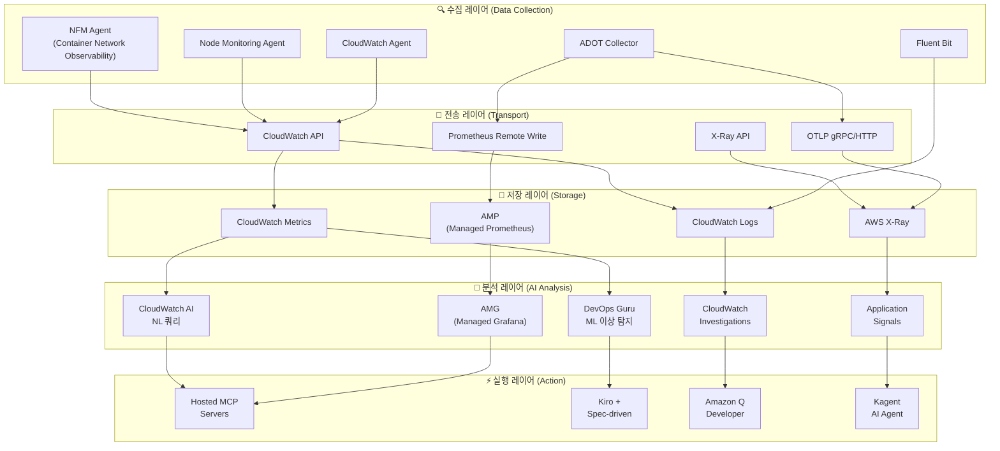
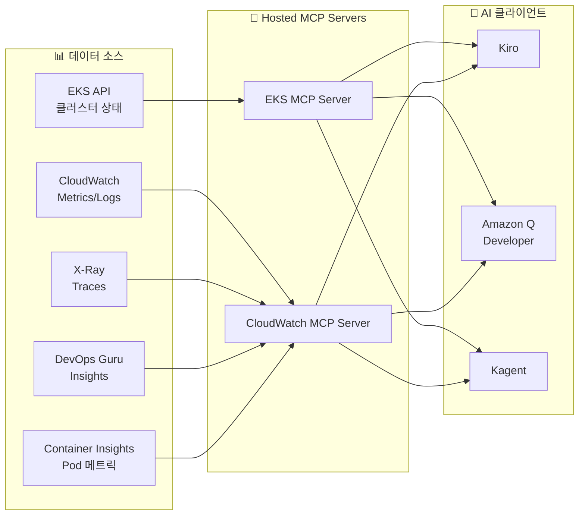

import { ArchitectureLayers, ManagedAddons, ServiceComparison } from '@site/src/components/ObservabilityStackTables';

# EKS 지능형 관찰성 스택 구축

> 📅 **작성일**: 2026-02-12 | ⏱️ **읽는 시간**: 약 35분 | 📌 **기준 환경**: EKS 1.35+, ADOT v0.40+, AMP, AMG

---

## 1. 개요

현대 분산 시스템에서 **관찰성(Observability)**은 단순한 모니터링을 넘어, 시스템의 내부 상태를 외부 출력을 통해 이해하는 능력을 의미합니다. EKS 환경에서는 수백 개의 Pod, 복잡한 서비스 메시, 동적 스케일링이 결합되어 전통적 모니터링만으로는 문제의 근본 원인을 파악하기 어렵습니다.

### 1.1 3-Pillar 관찰성 + AI 분석 레이어

관찰성의 세 가지 기둥과 AI 분석 레이어를 결합하면 진정한 지능형 운영이 가능합니다.

| 필러 | 역할 | AWS 서비스 |
|------|------|-----------|
| **Metrics** | 수치적 시계열 데이터 | AMP (Amazon Managed Prometheus), CloudWatch Metrics |
| **Logs** | 이벤트 기반 텍스트 데이터 | CloudWatch Logs, OpenSearch |
| **Traces** | 분산 요청 추적 | AWS X-Ray, ADOT |
| **AI 분석** | ML 기반 이상 탐지 및 인사이트 | DevOps Guru, CloudWatch AI, Q Developer |

:::info 이 문서의 범위
Managed Add-on 기반 관찰성 기초부터 AI 분석 레이어까지, EKS 환경에서 지능형 관찰성 스택을 구축하는 전체 과정을 다룹니다. AWS가 오픈소스 관찰성 도구를 관리형으로 운영하여 **복잡도를 제거**하면서 **K8s 네이티브 관찰성을 극대화**하는 전략을 중심으로 설명합니다. 이 문서는 AWS 네이티브 스택을 기준으로 작성되었지만, ADOT(OpenTelemetry)를 수집 레이어로 사용하면 3rd Party 백엔드와도 동일한 아키텍처를 적용할 수 있습니다.
:::

### 1.3 관찰성 스택 선택 패턴

실제 EKS 운영 환경에서는 조직의 요구사항과 기존 투자에 따라 크게 세 가지 관찰성 스택 패턴이 사용됩니다:

| 패턴 | 수집 레이어 | 백엔드 | 적합한 환경 |
|------|-----------|--------|-----------|
| **AWS 네이티브** | CloudWatch Observability Agent | CloudWatch Logs/Metrics, X-Ray | AWS 서비스 의존도가 높고, 단일 콘솔 관리를 선호하는 팀 |
| **OSS 중심** | ADOT (OpenTelemetry) | AMP (Prometheus), AMG (Grafana), X-Ray | K8s 네이티브 도구 선호, 멀티클라우드 전략, 벤더 종속 최소화 |
| **3rd Party** | ADOT 또는 벤더 전용 에이전트 | Datadog, Sumo Logic, Splunk, New Relic 등 | 기존 3rd Party 투자가 있거나, 통합 SaaS 대시보드를 선호하는 조직 |

:::tip 수집 레이어의 핵심: ADOT (OpenTelemetry)

어떤 백엔드를 선택하든, **수집 레이어에 ADOT(OpenTelemetry)를 사용하면 백엔드 교체가 자유롭습니다.** OpenTelemetry는 CNCF 표준이므로 Prometheus, Jaeger, Datadog, Sumo Logic 등 대부분의 백엔드로 데이터를 내보낼 수 있습니다. 이것이 AWS가 자체 에이전트 대신 OpenTelemetry를 Managed Add-on(ADOT)으로 제공하는 이유입니다.
:::

이 문서는 **AWS 네이티브** 및 **OSS 중심** 패턴을 기준으로 구성을 설명합니다. 3rd Party 백엔드를 사용하는 경우, ADOT Collector의 exporter 설정만 변경하면 동일한 수집 파이프라인을 활용할 수 있습니다.

### 1.2 왜 EKS에서 관찰성이 중요한가

EKS 환경의 관찰성은 다음 이유로 필수적입니다:

- **동적 인프라**: Pod가 수시로 생성/삭제되며, 노드가 Karpenter에 의해 동적 프로비저닝
- **마이크로서비스 복잡성**: 서비스 간 호출 체인이 복잡하여 단일 장애 지점 파악이 어려움
- **멀티 레이어 문제**: 애플리케이션, 컨테이너 런타임, 노드, 네트워크, AWS 서비스 등 다층 구조
- **비용 최적화**: 리소스 사용 패턴 분석을 통한 Right-sizing 필요
- **규정 준수**: 감사 로그, 접근 기록 등 컴플라이언스 요구사항

---

## 2. Managed Add-ons 기반 관찰성 기초

EKS Managed Add-ons는 AWS가 관찰성 에이전트의 설치, 업그레이드, 패치를 관리하여 운영 복잡성을 제거합니다. `aws eks create-addon` 한 줄의 명령으로 프로덕션 수준의 관찰성 기초를 확립할 수 있습니다.

<ManagedAddons />

### 2.1 ADOT (AWS Distro for OpenTelemetry) Add-on

ADOT는 OpenTelemetry의 AWS 배포판으로, 메트릭·로그·트레이스를 단일 에이전트로 수집합니다.

```bash
# ADOT Add-on 설치
aws eks create-addon \
  --cluster-name my-cluster \
  --addon-name adot \
  --addon-version v0.40.0-eksbuild.1 \
  --service-account-role-arn arn:aws:iam::ACCOUNT_ID:role/adot-collector-role

# 설치 확인
aws eks describe-addon \
  --cluster-name my-cluster \
  --addon-name adot \
  --query 'addon.status'
```

:::tip ADOT vs 자체 OpenTelemetry 배포
ADOT Add-on을 사용하면 OpenTelemetry Operator가 자동 설치되며, AWS 서비스 인증(SigV4)이 내장됩니다. 자체 배포 대비 운영 부담이 크게 줄어들며, EKS 버전 호환성이 AWS에 의해 보장됩니다.
:::

### 2.2 CloudWatch Observability Agent Add-on

CloudWatch Observability Agent는 Container Insights Enhanced, Application Signals, CloudWatch Logs를 통합 제공합니다.

```bash
# CloudWatch Observability Agent Add-on
aws eks create-addon \
  --cluster-name my-cluster \
  --addon-name amazon-cloudwatch-observability \
  --service-account-role-arn arn:aws:iam::ACCOUNT_ID:role/cloudwatch-agent-role

# 구성 확인
kubectl get pods -n amazon-cloudwatch
```

### 2.3 Node Monitoring Agent Add-on (2025)

Node Monitoring Agent는 EC2 노드의 하드웨어 및 OS 수준 문제를 탐지합니다.

```bash
# Node Monitoring Agent Add-on
aws eks create-addon \
  --cluster-name my-cluster \
  --addon-name eks-node-monitoring-agent
```

주요 탐지 항목:

- **NVMe 디스크 오류**: EBS 볼륨 성능 저하 사전 감지
- **메모리 하드웨어 오류**: EDAC(Error Detection and Correction) 이벤트
- **커널 소프트 락업**: CPU가 비정상적으로 오래 점유된 상태
- **OOM(Out of Memory)**: 메모리 부족으로 인한 프로세스 종료

### 2.4 Container Network Observability (2025.11)

2025년 11월 re:Invent에서 발표된 **Container Network Observability**는 EKS 환경에서 K8s 컨텍스트를 포함한 네트워크 가시성을 제공하는 기능입니다. 기존 VPC Flow Logs가 IP 수준의 트래픽만 보여주었다면, Container Network Observability는 **Pod → Pod, Pod → Service, Pod → 외부 서비스** 수준의 네트워크 플로우를 K8s 메타데이터(네임스페이스, 서비스명, Pod 라벨)와 함께 제공합니다.

```bash
# Network Flow Monitoring Agent Add-on 설치
aws eks create-addon \
  --cluster-name my-cluster \
  --addon-name aws-network-flow-monitoring-agent

# VPC CNI에서 Container Network Observability 활성화
aws eks update-addon \
  --cluster-name my-cluster \
  --addon-name vpc-cni \
  --configuration-values '{"enableNetworkPolicy":"true"}'
```

주요 기능:

- **Pod 수준 네트워크 메트릭**: TCP 재전송, 패킷 드롭, 연결 지연시간을 Pod/Service 단위로 추적
- **Cross-AZ 트래픽 가시성**: AZ 간 데이터 전송량을 서비스별로 측정하여 불필요한 Cross-AZ 비용 식별
- **K8s 컨텍스트 네트워크 맵**: 네트워크 플로우에 네임스페이스, 서비스명, Pod 라벨 자동 매핑
- **AWS 서비스 통신 추적**: Pod에서 S3, RDS, DynamoDB 등 AWS 서비스로의 트래픽 패턴 분석
- **선호 관찰성 스택 연동**: AMP/Grafana, CloudWatch, Datadog 등 어떤 백엔드로든 메트릭 전송 가능

:::tip Enhanced Network Security Policies (2025.12)
Container Network Observability와 함께, EKS는 **Enhanced Network Security Policies**도 도입했습니다. 클러스터 전체에 걸친 네트워크 접근 필터를 중앙에서 적용하고, DNS 기반 이그레스 정책으로 외부 트래픽을 세밀하게 제어할 수 있습니다. VPC CNI의 Network Policy 기능을 기반으로 동작합니다.
:::

:::info 핵심 메시지
5개의 관찰성 Managed Add-on만으로 **인프라(Node Monitoring)**, **네트워크(NFM Agent → Container Network Observability)**, **애플리케이션(ADOT, CloudWatch Agent)** 전 레이어의 관찰성 기초가 확립됩니다. 모두 `aws eks create-addon` 한 줄로 배포되며, 버전 관리와 보안 패치는 AWS가 담당합니다.
:::

---

## 3. 전체 아키텍처

EKS 지능형 관찰성 스택은 5개 레이어로 구성됩니다.

<ArchitectureLayers />



### 3.1 데이터 흐름 요약

| 레이어 | 구성 요소 | 역할 |
|--------|----------|------|
| **수집** | ADOT, CW Agent, Fluent Bit, Node Monitor, Flow Monitor | 메트릭/로그/트레이스/이벤트 수집 |
| **전송** | OTLP, Remote Write, CW API, X-Ray API | 표준 프로토콜로 데이터 전달 |
| **저장** | AMP, CloudWatch Logs/Metrics, X-Ray | 시계열 저장 및 인덱싱 |
| **분석** | AMG, CloudWatch AI, DevOps Guru, Application Signals | AI/ML 기반 분석 및 시각화 |
| **실행** | Hosted MCP, Kiro, Q Developer, Kagent | AI 기반 자동 대응 및 복구 |

---

## 4. ADOT Collector 배포

### 4.1 OpenTelemetryCollector CRD

ADOT Add-on을 설치하면 OpenTelemetry Operator가 함께 배포되며, `OpenTelemetryCollector` CRD를 통해 선언적으로 수집기를 관리합니다.

```yaml
apiVersion: opentelemetry.io/v1beta1
kind: OpenTelemetryCollector
metadata:
  name: adot-collector
  namespace: observability
spec:
  mode: deployment
  replicas: 2
  resources:
    limits:
      cpu: "1"
      memory: 2Gi
    requests:
      cpu: 200m
      memory: 512Mi
  config:
    receivers:
      otlp:
        protocols:
          grpc:
            endpoint: "0.0.0.0:4317"
          http:
            endpoint: "0.0.0.0:4318"
      prometheus:
        config:
          scrape_configs:
            - job_name: 'kubernetes-pods'
              kubernetes_sd_configs:
                - role: pod
              relabel_configs:
                - source_labels: [__meta_kubernetes_pod_annotation_prometheus_io_scrape]
                  action: keep
                  regex: true
    processors:
      batch:
        timeout: 10s
        send_batch_size: 1024
      memory_limiter:
        check_interval: 1s
        limit_mib: 512
        spike_limit_mib: 128
      resource:
        attributes:
          - key: cluster.name
            value: "my-eks-cluster"
            action: upsert
          - key: aws.region
            value: "ap-northeast-2"
            action: upsert
      filter:
        metrics:
          exclude:
            match_type: regexp
            metric_names:
              - "go_.*"
              - "process_.*"
    exporters:
      prometheusremotewrite:
        endpoint: "https://aps-workspaces.ap-northeast-2.amazonaws.com/workspaces/ws-xxxxx/api/v1/remote_write"
        auth:
          authenticator: sigv4auth
        resource_to_telemetry_conversion:
          enabled: true
      awsxray:
        region: ap-northeast-2
        indexed_attributes:
          - "otel.resource.service.name"
          - "otel.resource.deployment.environment"
      awscloudwatchlogs:
        region: ap-northeast-2
        log_group_name: "/eks/my-cluster/application"
        log_stream_name: "otel-logs"
    extensions:
      sigv4auth:
        region: ap-northeast-2
        service: aps
      health_check:
        endpoint: "0.0.0.0:13133"
    service:
      extensions: [sigv4auth, health_check]
      pipelines:
        metrics:
          receivers: [otlp, prometheus]
          processors: [memory_limiter, filter, batch, resource]
          exporters: [prometheusremotewrite]
        traces:
          receivers: [otlp]
          processors: [memory_limiter, batch, resource]
          exporters: [awsxray]
        logs:
          receivers: [otlp]
          processors: [memory_limiter, batch, resource]
          exporters: [awscloudwatchlogs]
```

### 4.2 DaemonSet 모드 배포

노드별 메트릭 수집이 필요한 경우 DaemonSet 모드를 사용합니다.

```yaml
apiVersion: opentelemetry.io/v1beta1
kind: OpenTelemetryCollector
metadata:
  name: adot-node-collector
  namespace: observability
spec:
  mode: daemonset
  hostNetwork: true
  volumes:
    - name: hostfs
      hostPath:
        path: /
  volumeMounts:
    - name: hostfs
      mountPath: /hostfs
      readOnly: true
  env:
    - name: K8S_NODE_NAME
      valueFrom:
        fieldRef:
          fieldPath: spec.nodeName
  config:
    receivers:
      hostmetrics:
        root_path: /hostfs
        collection_interval: 30s
        scrapers:
          cpu: {}
          disk: {}
          filesystem: {}
          load: {}
          memory: {}
          network: {}
      kubeletstats:
        collection_interval: 30s
        auth_type: serviceAccount
        endpoint: "https://${env:K8S_NODE_NAME}:10250"
        insecure_skip_verify: true
    processors:
      batch:
        timeout: 30s
      resourcedetection:
        detectors: [env, eks]
    exporters:
      prometheusremotewrite:
        endpoint: "https://aps-workspaces.ap-northeast-2.amazonaws.com/workspaces/ws-xxxxx/api/v1/remote_write"
        auth:
          authenticator: sigv4auth
    extensions:
      sigv4auth:
        region: ap-northeast-2
        service: aps
    service:
      extensions: [sigv4auth]
      pipelines:
        metrics:
          receivers: [hostmetrics, kubeletstats]
          processors: [resourcedetection, batch]
          exporters: [prometheusremotewrite]
```

:::tip Deployment vs DaemonSet 선택 기준

- **Deployment 모드**: 애플리케이션 메트릭/트레이스 수집 (OTLP 수신), 중앙 집중식 처리
- **DaemonSet 모드**: 노드 수준 메트릭 수집 (hostmetrics, kubeletstats), 네트워크 효율적
- **Sidecar 모드**: 특정 Pod의 로그/트레이스만 수집, 격리 필요 시
:::

### 4.3 파이프라인 구성 원칙

ADOT Collector의 파이프라인은 `receivers → processors → exporters` 순서로 데이터를 처리합니다.

```
┌─────────────┐    ┌──────────────┐    ┌─────────────┐
│  Receivers   │───▶│  Processors  │───▶│  Exporters  │
│             │    │              │    │             │
│ • otlp      │    │ • memory_    │    │ • prometheus│
│ • prometheus│    │   limiter    │    │   remotewrite│
│ • hostmetrics│   │ • batch      │    │ • awsxray   │
│ • kubelet   │    │ • filter     │    │ • cwlogs    │
│   stats     │    │ • resource   │    │             │
└─────────────┘    └──────────────┘    └─────────────┘
```

**핵심 프로세서 설정**:

| 프로세서 | 역할 | 권장 설정 |
|---------|------|----------|
| `memory_limiter` | OOM 방지 | limit_mib: 512, spike_limit: 128 |
| `batch` | 네트워크 효율화 | timeout: 10s, batch_size: 1024 |
| `filter` | 불필요 메트릭 제거 | go_*, process_* 제외 |
| `resource` | 메타데이터 추가 | cluster.name, region 부착 |
| `resourcedetection` | 환경 자동 감지 | EKS, EC2 감지기 활성화 |

---

## 5. AMP + AMG 통합

### 5.1 AMP (Amazon Managed Prometheus)

AMP는 Prometheus 호환 관리형 서비스로, 인프라 관리 없이 대규모 메트릭을 저장하고 쿼리합니다.

```bash
# AMP 워크스페이스 생성
aws amp create-workspace \
  --alias my-eks-observability \
  --tags Environment=production

# 워크스페이스 ID 확인
aws amp list-workspaces \
  --query 'workspaces[?alias==`my-eks-observability`].workspaceId' \
  --output text
```

### 5.2 Remote Write 설정

ADOT에서 AMP로 메트릭을 전송하는 remote_write 구성입니다.

```yaml
# Prometheus remote_write configuration
remoteWrite:
  - url: "https://aps-workspaces.ap-northeast-2.amazonaws.com/workspaces/ws-xxxxx/api/v1/remote_write"
    sigv4:
      region: ap-northeast-2
    queue_config:
      max_samples_per_send: 1000
      max_shards: 200
      capacity: 2500
    write_relabel_configs:
      - source_labels: [__name__]
        regex: "go_.*|process_.*"
        action: drop
```

:::warning Remote Write 비용 최적화
AMP는 수집된 메트릭 샘플 수 기준으로 과금됩니다. `write_relabel_configs`를 통해 불필요한 메트릭(go_*, process_*)을 drop하면 비용을 30-50% 절감할 수 있습니다. 또한 `scrape_interval`을 15s에서 30s로 늘리면 샘플 수가 절반으로 줄어듭니다.
:::

### 5.3 AMG (Amazon Managed Grafana) 데이터소스 연결

AMG에서 AMP를 데이터소스로 추가합니다.

```bash
# AMG 워크스페이스 생성
aws grafana create-workspace \
  --workspace-name my-eks-grafana \
  --account-access-type CURRENT_ACCOUNT \
  --authentication-providers AWS_SSO \
  --permission-type SERVICE_MANAGED \
  --workspace-data-sources PROMETHEUS CLOUDWATCH XRAY

# 데이터소스 자동 구성 (AMP 연결)
aws grafana create-workspace-service-account \
  --workspace-id g-xxxxxxxxxx \
  --grafana-role ADMIN \
  --name amp-datasource
```

AMG에서 AMP 데이터소스를 추가한 후 사용할 수 있는 핵심 PromQL 쿼리들입니다.

### 5.4 핵심 PromQL 쿼리

```promql
# Pod CPU 사용률 상위 10개
topk(10,
  sum(rate(container_cpu_usage_seconds_total{namespace!="kube-system"}[5m])) by (pod)
)

# 노드별 메모리 사용률
100 * (1 - (
  node_memory_MemAvailable_bytes / node_memory_MemTotal_bytes
))

# HTTP 요청 에러율 (5xx)
sum(rate(http_requests_total{status=~"5.."}[5m]))
/ sum(rate(http_requests_total[5m])) * 100

# P99 레이턴시
histogram_quantile(0.99,
  sum(rate(http_request_duration_seconds_bucket[5m])) by (le, service)
)

# Pod 재시작 횟수 (최근 1시간)
increase(kube_pod_container_status_restarts_total[1h])

# Karpenter 노드 프로비저닝 대기 시간
histogram_quantile(0.95,
  sum(rate(karpenter_provisioner_scheduling_duration_seconds_bucket[10m])) by (le)
)
```

:::info AMP + AMG의 핵심 가치
AWS가 Prometheus와 Grafana의 인프라 관리(스케일링, 패치, 고가용성, 백업)를 모두 담당합니다. 팀은 **대시보드 구성과 쿼리 작성**에만 집중할 수 있어, 관찰성의 본질적 가치에 집중할 수 있습니다. 이것이 바로 "오픈소스의 장점을 유지하면서 복잡도를 제거"하는 AWS 전략의 핵심입니다.
:::

---

## 6. CloudWatch Container Insights Enhanced

### 6.1 Enhanced Container Insights 기능

EKS 1.28+에서 Enhanced Container Insights는 **Control Plane 메트릭**을 포함한 심층 관찰성을 제공합니다.

```bash
# CloudWatch Observability Operator 설치 (Helm)
helm install amazon-cloudwatch-observability \
  oci://public.ecr.aws/cloudwatch-agent/amazon-cloudwatch-observability \
  --namespace amazon-cloudwatch --create-namespace \
  --set clusterName=my-cluster \
  --set region=ap-northeast-2 \
  --set containerInsights.enhanced=true \
  --set containerInsights.acceleratedCompute=true
```

### 6.2 수집 메트릭 범위

Enhanced Container Insights가 수집하는 메트릭 범위:

| 카테고리 | 메트릭 예시 | 설명 |
|---------|-----------|------|
| **Control Plane** | `apiserver_request_total`, `etcd_db_total_size` | API 서버, etcd, 스케줄러 상태 |
| **Node** | `node_cpu_utilization`, `node_memory_working_set` | 노드 리소스 사용량 |
| **Pod** | `pod_cpu_utilization`, `pod_memory_working_set` | Pod 리소스 사용량 |
| **Container** | `container_cpu_limit`, `container_restart_count` | 컨테이너 수준 상세 |
| **Service** | `service_number_of_running_pods` | 서비스 레벨 집계 |
| **Namespace** | `namespace_number_of_running_pods` | 네임스페이스 레벨 집계 |

### 6.3 EKS Control Plane 메트릭

EKS 1.28+에서 자동 수집되는 Control Plane 메트릭은 클러스터 건강 상태를 파악하는 데 필수적입니다.

```bash
# Control Plane 메트릭 활성화 확인
aws eks describe-cluster \
  --name my-cluster \
  --query 'cluster.logging.clusterLogging[?types[?contains(@, `api`)]]'
```

핵심 Control Plane 메트릭:

- **API Server**: `apiserver_request_total`, `apiserver_request_duration_seconds` — API 서버 부하 및 레이턴시
- **etcd**: `etcd_db_total_size_in_bytes`, `etcd_server_slow_apply_total` — etcd 상태 및 성능
- **Scheduler**: `scheduler_schedule_attempts_total`, `scheduler_scheduling_duration_seconds` — 스케줄링 효율
- **Controller Manager**: `workqueue_depth`, `workqueue_adds_total` — 컨트롤러 큐 상태

:::warning 비용 고려사항
Enhanced Container Insights는 수집하는 메트릭 양이 많아 CloudWatch 비용이 증가합니다. 프로덕션 클러스터에서는 월 $50-200 수준의 추가 비용이 발생할 수 있습니다. 개발/스테이징 환경에서는 기본 Container Insights를 사용하고, 프로덕션에서만 Enhanced를 활성화하는 전략을 권장합니다.
:::

---

## 7. CloudWatch Application Signals

Application Signals는 **zero-code 계측**으로 애플리케이션의 서비스 맵, SLI/SLO, 호출 그래프를 자동 생성합니다.

### 7.1 지원 언어 및 계측 방식

| 언어 | 계측 방식 | 상태 |
|------|----------|------|
| **Java** | ADOT Java Agent 자동 주입 | GA |
| **Python** | ADOT Python Auto-instrumentation | GA |
| **.NET** | ADOT .NET Auto-instrumentation | GA |
| **Node.js** | ADOT Node.js Auto-instrumentation | GA |

### 7.2 활성화 방법

```yaml
# Instrumentation CRD로 zero-code 계측 활성화
apiVersion: opentelemetry.io/v1alpha1
kind: Instrumentation
metadata:
  name: app-signals
  namespace: my-app
spec:
  exporter:
    endpoint: http://adot-collector.observability:4317
  propagators:
    - tracecontext
    - baggage
    - xray
  java:
    image: public.ecr.aws/aws-observability/adot-autoinstrumentation-java:latest
    env:
      - name: OTEL_AWS_APPLICATION_SIGNALS_ENABLED
        value: "true"
      - name: OTEL_METRICS_EXPORTER
        value: "none"
  python:
    image: public.ecr.aws/aws-observability/adot-autoinstrumentation-python:latest
```

Pod에 annotation을 추가하면 자동으로 계측 에이전트가 주입됩니다:

```yaml
apiVersion: apps/v1
kind: Deployment
metadata:
  name: my-java-app
spec:
  template:
    metadata:
      annotations:
        instrumentation.opentelemetry.io/inject-java: "app-signals"
    spec:
      containers:
        - name: app
          image: my-java-app:latest
```

### 7.3 Service Map 자동 생성

Application Signals가 활성화되면 다음이 자동 생성됩니다:

- **Service Map**: 서비스 간 호출 관계 시각화, 에러율/레이턴시 표시
- **SLI 자동 설정**: 가용성(에러율), 레이턴시(P99), 처리량 자동 측정
- **SLO 구성**: SLI 기반으로 목표 설정 (예: 가용성 99.9%, P99 < 500ms)
- **Call Graph**: 개별 요청의 서비스 간 호출 경로 추적

:::tip Application Signals + DevOps Guru 연동
Application Signals의 SLI 데이터를 DevOps Guru가 분석하면, 서비스 수준에서의 이상 탐지가 가능합니다. 예를 들어 "결제 서비스의 P99 레이턴시가 평소보다 3배 증가"와 같은 서비스 맥락의 알림을 받을 수 있습니다.
:::

---

## 8. DevOps Guru EKS 통합

Amazon DevOps Guru는 ML을 활용하여 운영 이상을 자동으로 탐지하고 근본 원인을 분석합니다.

### 8.1 리소스 그룹 설정

```bash
# EKS 클러스터 기반 리소스 그룹으로 DevOps Guru 활성화
aws devops-guru update-resource-collection \
  --action ADD \
  --resource-collection '{
    "Tags": {
      "TagValues": [
        {
          "AppBoundaryKey": "eks-cluster",
          "TagValues": ["my-cluster"]
        }
      ]
    }
  }'
```

### 8.2 ML 이상 탐지 작동 방식

DevOps Guru의 이상 탐지는 다음 단계로 작동합니다:

1. **학습 기간** (1-2주): 정상 운영 패턴을 ML 모델로 학습
2. **이상 탐지**: 학습된 패턴에서 벗어나는 메트릭 변화 감지
3. **상관 분석**: 동시에 발생한 이상 메트릭들을 그룹화
4. **근본 원인 추론**: 이상 메트릭 간 인과 관계 분석
5. **인사이트 생성**: 권장 조치와 함께 알림 발송

### 8.3 실제 이상 탐지 시나리오

**시나리오: EKS 노드 메모리 압박**

```
[DevOps Guru 인사이트]
━━━━━━━━━━━━━━━━━━━━━━━━━━━━━━━━━━
심각도: HIGH
유형: Reactive Anomaly

관련 메트릭 (상관 분석):
  ✦ node_memory_utilization: 92% → 98% (비정상 증가)
  ✦ pod_eviction_count: 0 → 5 (비정상 증가)
  ✦ container_restart_count: 2 → 18 (비정상 증가)
  ✦ kube_node_status_condition{condition="MemoryPressure"}: 0 → 1

근본 원인 분석:
  → 노드 i-0abc123의 메모리 사용률이 정상 범위(60-75%)를
    초과하여 MemoryPressure 상태 진입
  → 메모리 requests 미설정 Pod들이 과도한 메모리 소비

권장 조치:
  1. 메모리 requests/limits가 미설정된 Pod 확인
  2. LimitRange를 통해 네임스페이스 기본 제한 설정
  3. Karpenter NodePool에 메모리 기반 스케일링 설정 추가
━━━━━━━━━━━━━━━━━━━━━━━━━━━━━━━━━━
```

### 8.4 비용 및 활성화 팁

| 항목 | 설명 |
|------|------|
| **과금 기준** | 분석된 AWS 리소스 수 기준 (시간당) |
| **예상 비용** | 리소스 100개 기준 월 ~$50 |
| **무료 티어** | 최초 3개월 무료 체험 |
| **활성화 권장** | 프로덕션 클러스터에만 활성화 |

---

## 9. CloudWatch AI 자연어 쿼리 + Investigations

### 9.1 CloudWatch AI 자연어 쿼리

CloudWatch AI NL 쿼리는 자연어로 메트릭과 로그를 분석할 수 있는 기능입니다. PromQL이나 CloudWatch Logs Insights 쿼리 구문을 몰라도 자연어로 질문하면 됩니다.

**실제 쿼리 예시**:

```
# 자연어 쿼리 → 자동 변환

질문: "지난 1시간 동안 CPU 사용률이 80%를 초과한 EKS 노드는?"
→ CloudWatch Metrics Insights 쿼리 자동 생성

질문: "payment-service에서 5xx 에러가 가장 많이 발생한 시간대는?"
→ CloudWatch Logs Insights 쿼리 자동 생성

질문: "어제 대비 오늘 API 응답 시간이 느려진 서비스는?"
→ 비교 분석 쿼리 자동 생성
```

### 9.2 CloudWatch Investigations

CloudWatch Investigations는 AI 기반 근본 원인 분석 도구로, 알림이 발생하면 자동으로 관련 메트릭, 로그, 트레이스를 수집하여 분석합니다.

**분석 프로세스**:

1. **알림 트리거**: CloudWatch Alarm 또는 DevOps Guru 인사이트 발생
2. **컨텍스트 수집**: 관련 메트릭, 로그, 트레이스, 구성 변경 이력 자동 수집
3. **AI 분석**: 수집된 데이터를 AI가 분석하여 근본 원인 추론
4. **타임라인 생성**: 이벤트 발생 순서를 시간대별로 정리
5. **권장 조치**: 구체적인 해결 방안 제시

```
[CloudWatch Investigation 결과]
━━━━━━━━━━━━━━━━━━━━━━━━━━━━━━━━━━
📋 조사 요약: payment-service 레이턴시 증가

⏱️ 타임라인:
  14:23 - RDS 연결 풀 사용률 급증 (70% → 95%)
  14:25 - payment-service P99 레이턴시 500ms → 2.3s
  14:27 - 다운스트림 order-service도 영향 받기 시작
  14:30 - CloudWatch Alarm 트리거

🔍 근본 원인:
  RDS 인스턴스(db.r5.large)의 연결 수가 max_connections에
  근접하여 새 연결 생성이 지연됨

📌 권장 조치:
  1. RDS 인스턴스 클래스 업그레이드 또는 max_connections 조정
  2. 연결 풀링 라이브러리(HikariCP/PgBouncer) 설정 최적화
  3. RDS Proxy 도입 검토
━━━━━━━━━━━━━━━━━━━━━━━━━━━━━━━━━━
```

:::tip Investigation + Hosted MCP
CloudWatch Investigations의 결과를 Hosted MCP 서버를 통해 Kiro에서 직접 조회할 수 있습니다. "현재 진행 중인 Investigation이 있어?" → MCP가 Investigation 상태를 반환 → Kiro가 자동으로 대응 코드 생성. 이것이 **AI 분석 → 자동 대응**의 완전한 루프입니다.
:::

---

## 10. Hosted MCP 서버 기반 통합 분석

### 10.1 MCP가 관찰성에 가져오는 변화

기존에는 CloudWatch 콘솔, Grafana 대시보드, X-Ray 콘솔을 각각 열어 문제를 진단했습니다. Hosted MCP 서버를 사용하면 **Kiro나 Q Developer에서 모든 관찰성 데이터를 통합 조회**할 수 있습니다.



### 10.2 EKS MCP 서버 도구

EKS MCP 서버가 제공하는 주요 도구:

| 도구 | 기능 | 활용 시나리오 |
|------|------|-------------|
| `get_cluster_status` | 클러스터 전체 상태 조회 | 정기 건강 검진 |
| `list_pods` | Pod 목록 및 상태 | 장애 Pod 식별 |
| `get_pod_logs` | Pod 로그 조회 | 에러 로그 분석 |
| `describe_node` | 노드 상세 정보 | 노드 리소스 문제 진단 |
| `get_events` | K8s 이벤트 조회 | 최근 이벤트 분석 |
| `list_deployments` | Deployment 상태 | 배포 상태 확인 |

### 10.3 통합 분석 시나리오

**시나리오: "payment-service가 느리다"는 보고**

Kiro에서 MCP를 통해 통합 분석하는 과정:

```
[Kiro + MCP 통합 분석]

1. EKS MCP: list_pods(namespace="payment") → 3/3 Running, 0 Restarts ✓
2. EKS MCP: get_pod_logs(pod="payment-xxx", tail=100) → DB timeout 에러 다수
3. CloudWatch MCP: query_metrics("RDSConnections") → 연결 수 98% 도달
4. CloudWatch MCP: get_insights(service="payment") → DevOps Guru 인사이트 존재
5. CloudWatch MCP: get_investigation("INV-xxxx") → RDS 연결 풀 포화 확인

→ Kiro가 자동으로:
   - RDS Proxy 도입 IaC 코드 생성
   - HikariCP 연결 풀 설정 최적화 PR 생성
   - Karpenter NodePool 조정 (memory 기반 스케일링)
```

:::info 다양한 데이터 소스 기반 운영 인사이트
MCP의 핵심 가치는 **여러 데이터 소스를 단일 인터페이스로 통합**하는 것입니다. CloudWatch 메트릭, X-Ray 트레이스, EKS API, DevOps Guru 인사이트를 AI 에이전트가 한 번에 접근하여, 사람이 수동으로 여러 콘솔을 오가며 분석하는 것보다 빠르고 정확한 진단이 가능합니다.
:::

### 10.4 프로그래머틱 관찰성 자동화

MCP를 통한 관찰성은 **프로그래머틱 자동화**를 가능하게 합니다:

```
[디렉팅 방식] - 수동, 반복적
  "CloudWatch 콘솔 열어서 payment-service 메트릭 확인해줘"
  → "X-Ray에서 해당 시간대 트레이스 찾아줘"
  → "RDS 메트릭도 확인해줘"
  → "그래서 원인이 뭐야?"

[프로그래머틱 방식] - 자동, 체계적
  Kiro Spec: "payment-service 레이턴시 이상 시 자동 진단"
  → MCP가 CloudWatch + X-Ray + EKS API 통합 조회
  → AI가 근본 원인 분석
  → 자동으로 수정 코드 생성 + PR
```

---

## 11. 알림 최적화 및 SLO/SLI

### 11.1 Alert Fatigue 문제

EKS 환경에서 알림 피로는 심각한 운영 문제입니다:

- **평균적인 EKS 클러스터**: 일 50-200개의 알림 발생
- **실제 조치 필요한 알림**: 전체의 10-15%
- **Alert Fatigue 결과**: 중요 알림 무시, 장애 대응 지연

### 11.2 SLO 기반 알림 전략

SLO(Service Level Objectives) 기반으로 알림을 구성하면 Alert Fatigue를 크게 줄일 수 있습니다.

```yaml
# SLO 기반 알림 예시 - Error Budget 소진율 기반
apiVersion: monitoring.coreos.com/v1
kind: PrometheusRule
metadata:
  name: payment-service-slo
spec:
  groups:
    - name: slo.payment-service
      rules:
        # SLI: 에러율
        - record: sli:payment_error_rate:5m
          expr: |
            sum(rate(http_requests_total{service="payment",status=~"5.."}[5m]))
            / sum(rate(http_requests_total{service="payment"}[5m]))

        # Error Budget 소진율 (1시간)
        - alert: PaymentErrorBudgetBurn
          expr: |
            sli:payment_error_rate:5m > (1 - 0.999) * 14.4
          for: 5m
          labels:
            severity: critical
            service: payment
          annotations:
            summary: "Payment 서비스 Error Budget 빠르게 소진 중"
            description: "현재 에러율이 Error Budget의 14.4배 속도로 소진 중 (1시간 윈도우)"
```

### 11.3 Error Budget 개념

| SLO | 월간 Error Budget | 허용 다운타임 |
|-----|-------------------|-------------|
| 99.9% | 0.1% | 43.2분 |
| 99.95% | 0.05% | 21.6분 |
| 99.99% | 0.01% | 4.32분 |

### 11.4 CloudWatch Composite Alarms

여러 알람을 논리적으로 결합하여 노이즈를 줄입니다.

```bash
# Composite Alarm: CPU AND Memory 동시 높을 때만 알림
aws cloudwatch put-composite-alarm \
  --alarm-name "EKS-Node-Resource-Pressure" \
  --alarm-rule 'ALARM("EKS-Node-HighCPU") AND ALARM("EKS-Node-HighMemory")' \
  --alarm-actions "arn:aws:sns:ap-northeast-2:ACCOUNT_ID:ops-team" \
  --alarm-description "노드 CPU와 메모리가 동시에 높을 때만 알림"
```

<ServiceComparison />

### 11.5 알림 최적화 체크리스트

| 항목 | 전략 | 기대 효과 |
|------|------|----------|
| **SLO 기반 알림** | Error Budget 소진율 기준 알림 | 알림 수 70% 감소 |
| **Composite Alarms** | 복합 조건으로 노이즈 필터링 | 오탐률 50% 감소 |
| **DevOps Guru** | ML이 정상/비정상 자동 판단 | 학습 후 오탐 80% 감소 |
| **알림 라우팅** | 심각도별 채널 분리 (PagerDuty, Slack) | 대응 속도 40% 향상 |
| **자동 복구** | 알림 → EventBridge → Lambda 자동 대응 | 수동 개입 60% 감소 |

---

## 12. 마무리

### 12.1 구축 순서 요약

지능형 관찰성 스택 구축은 다음 순서를 권장합니다:

```
1단계: Managed Add-ons 배포
  └── ADOT + CloudWatch Observability + Node Monitoring + Flow Monitor

2단계: AMP + AMG 연결
  └── Remote Write 설정 + Grafana 대시보드 구성

3단계: Application Signals 활성화
  └── zero-code 계측 + SLI/SLO 자동 설정

4단계: DevOps Guru 활성화
  └── ML 이상 탐지 + 근본 원인 분석

5단계: CloudWatch AI + MCP 통합
  └── 자연어 쿼리 + Kiro/Q Developer 연동

6단계: 알림 최적화
  └── SLO 기반 알림 + Composite Alarms + 자동 복구
```

### 12.2 다음 단계

이 관찰성 스택을 기반으로 다음 주제를 학습하세요:

- **[AIDLC 프레임워크](./aidlc-framework.md)**: AI 주도 개발 라이프사이클과 관찰성 데이터의 개발 피드백 루프
- **[예측 스케일링 및 자동 복구](./aiops-predictive-operations.md)**: 관찰성 데이터를 기반으로 한 ML 예측 및 자동 복구 패턴
- **[AIOps 소개](./aiops-introduction.md)**: AIOps 전체 전략과 관찰성의 역할

### 12.3 학습 경로

```
[현재 문서] 지능형 관찰성 스택 구축
     ↓
[다음] AIDLC 프레임워크 — 관찰성 데이터 활용한 AI 개발 자동화
     ↓
[심화] 예측 운영 — 관찰성 기반 예측 스케일링 및 자동 복구
```

:::info 관련 문서

- [AIOps 전략 가이드](./aiops-introduction.md) — AIOps 전체 맥락
- [AIDLC 프레임워크](./aidlc-framework.md) — AI 주도 개발 방법론
- [예측 스케일링 및 자동 복구](./aiops-predictive-operations.md) — 관찰성 기반 예측 운영
:::
