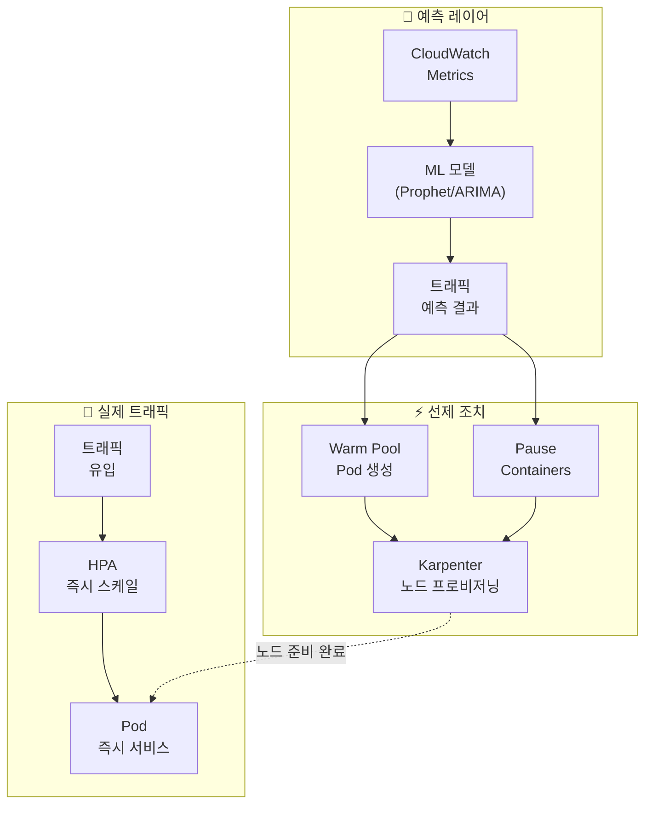
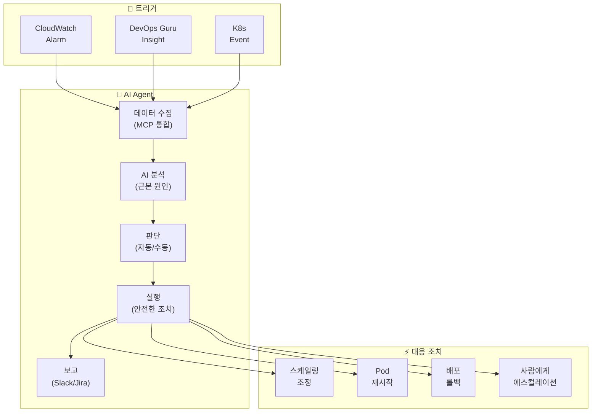
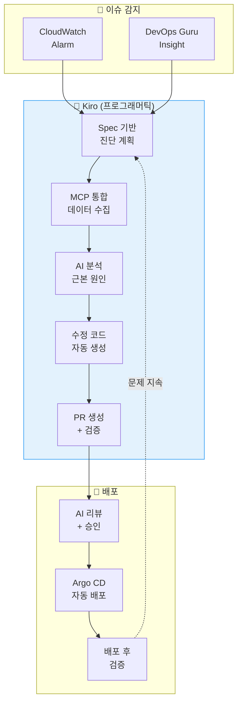

import { ScalingComparison, ResponsePatterns, MaturityTable } from '@site/src/components/PredictiveOpsTables';

# 예측 스케일링 및 자동 복구 패턴

> 📅 **작성일**: 2026-02-12 | ⏱️ **읽는 시간**: 약 30분 | 📌 **기준 환경**: EKS 1.35+, Karpenter v1.1+, CloudWatch, Kiro

---

## 1. 개요

### 1.1 반응형에서 자율형으로

EKS 운영의 진화는 **반응형 → 예측형 → 자율형**의 3단계로 이루어집니다.

| 단계 | 특성 | 도구 |
|------|------|------|
| **반응형** | 문제 발생 후 대응 | HPA, CloudWatch Alarms |
| **예측형** | 패턴 기반 사전 대응 | ML 예측, CloudWatch Anomaly Detection |
| **자율형** | AI가 자율적으로 판단·대응 | Kiro+MCP, Q Developer, Kagent/Strands |

:::info 이 문서의 범위
반응형 스케일링의 한계를 넘어, ML 기반 예측 스케일링과 AI Agent를 통한 자율 복구 패턴을 다룹니다. 특히 Kiro+MCP 기반 **프로그래머틱 디버깅**과 Kagent/Strands 기반 **자동 인시던트 대응**을 중심으로 설명합니다.
:::

### 1.2 왜 예측 운영이 필요한가

- **HPA의 한계**: 메트릭 임계값 초과 후 반응 → 이미 사용자 영향 발생
- **Cold Start 문제**: 새 Pod 시작까지 30초-2분 → 트래픽 급증 시 대응 불가
- **노드 프로비저닝 지연**: Karpenter도 노드 시작에 1-3분 소요
- **복합 장애**: 단일 메트릭으로는 감지 불가한 복합 원인 장애 증가
- **비용 비효율**: 과도한 여유 리소스 확보 → 비용 낭비

---

## 2. ML 기반 예측 스케일링

### 2.1 HPA의 한계

HPA(Horizontal Pod Autoscaler)는 **현재 메트릭**에 반응하므로 구조적 한계가 있습니다.

<ScalingComparison />

```
[HPA의 반응형 스케일링]

트래픽 ████████████████████████░░░░░░░░░
                      ↑ 임계값 초과
                      |
Pod 수  ██████████░░░░████████████████████
                  ↑ 스케일아웃 시작
                  |  (지연 발생)
사용자   ✓✓✓✓✓✓✓✓✗✗✗✓✓✓✓✓✓✓✓✓✓✓✓✓✓✓
경험              ↑ 성능 저하 구간

[ML 예측 스케일링]

트래픽 ████████████████████████░░░░░░░░░
             ↑ 예측 시점 (30분 전)
             |
Pod 수  ██████████████████████████████████
             ↑ 사전 스케일아웃
             |
사용자   ✓✓✓✓✓✓✓✓✓✓✓✓✓✓✓✓✓✓✓✓✓✓✓✓✓✓
경험     (성능 저하 없음)
```

### 2.2 시계열 예측 모델

EKS 워크로드의 트래픽 패턴을 예측하는 대표적 ML 모델:

| 모델 | 특성 | 적합한 패턴 |
|------|------|-----------|
| **ARIMA** | 통계 기반, 계절성 | 규칙적 일/주간 패턴 |
| **Prophet** | Facebook 개발, 휴일 반영 | 비즈니스 트래픽 (이벤트, 휴일) |
| **LSTM** | 딥러닝, 복잡한 패턴 | 불규칙적이지만 반복되는 패턴 |
| **CloudWatch** | AWS 네이티브, 자동 | 범용 (별도 ML 인프라 불필요) |

### 2.3 Prophet 기반 예측 스케일링 구현

```python
# Prophet 기반 EKS 트래픽 예측
import boto3
from prophet import Prophet
import pandas as pd
from datetime import datetime, timedelta

def fetch_metrics_from_amp(workspace_id, query, hours=168):
    """AMP에서 지난 7일간 메트릭 조회"""
    client = boto3.client('amp', region_name='ap-northeast-2')
    end_time = datetime.utcnow()
    start_time = end_time - timedelta(hours=hours)

    response = client.query_range(
        workspaceId=workspace_id,
        query=query,
        startTime=start_time,
        endTime=end_time,
        step='5m'
    )
    return response

def predict_scaling(metrics_df, forecast_hours=2):
    """Prophet으로 향후 트래픽 예측"""
    # Prophet 형식으로 변환
    df = metrics_df.rename(columns={
        'timestamp': 'ds',
        'value': 'y'
    })

    model = Prophet(
        changepoint_prior_scale=0.05,
        seasonality_mode='multiplicative',
        daily_seasonality=True,
        weekly_seasonality=True,
    )
    model.fit(df)

    # 향후 forecast_hours 예측
    future = model.make_future_dataframe(
        periods=forecast_hours * 12,  # 5분 간격
        freq='5min'
    )
    forecast = model.predict(future)

    return forecast[['ds', 'yhat', 'yhat_upper', 'yhat_lower']]

def calculate_required_pods(predicted_rps, pod_capacity_rps=100):
    """예측 RPS 기반 필요 Pod 수 계산"""
    # 상한값(yhat_upper) 사용으로 안전 마진 확보
    required = int(predicted_rps / pod_capacity_rps) + 1
    return max(required, 2)  # 최소 2개 유지

def apply_scaling(namespace, deployment, target_replicas):
    """kubectl을 통해 스케일링 적용"""
    import subprocess
    cmd = f"kubectl scale deployment/{deployment} -n {namespace} --replicas={target_replicas}"
    subprocess.run(cmd.split(), check=True)
    print(f"Scaled {deployment} to {target_replicas} replicas")
```

### 2.4 CronJob 기반 예측 스케일링 자동화

```yaml
# 예측 스케일링을 주기적으로 실행하는 CronJob
apiVersion: batch/v1
kind: CronJob
metadata:
  name: predictive-scaler
  namespace: scaling
spec:
  schedule: "*/15 * * * *"  # 15분마다 실행
  jobTemplate:
    spec:
      template:
        spec:
          serviceAccountName: predictive-scaler
          containers:
            - name: scaler
              image: my-registry/predictive-scaler:latest
              env:
                - name: AMP_WORKSPACE_ID
                  value: "ws-xxxxx"
                - name: TARGET_NAMESPACE
                  value: "payment"
                - name: TARGET_DEPLOYMENT
                  value: "payment-service"
                - name: FORECAST_HOURS
                  value: "2"
              resources:
                requests:
                  cpu: 500m
                  memory: 1Gi
                limits:
                  cpu: "1"
                  memory: 2Gi
          restartPolicy: OnFailure
```

---

## 3. Karpenter + AI 예측

### 3.1 Karpenter 기본 동작

Karpenter는 Pending Pod를 감지하여 **적합한 인스턴스 타입을 자동 선택**하고 프로비저닝합니다.

```yaml
# Karpenter NodePool 설정
apiVersion: karpenter.sh/v1
kind: NodePool
metadata:
  name: default
spec:
  template:
    spec:
      requirements:
        - key: kubernetes.io/arch
          operator: In
          values: ["amd64", "arm64"]
        - key: karpenter.sh/capacity-type
          operator: In
          values: ["on-demand", "spot"]
        - key: karpenter.k8s.aws/instance-family
          operator: In
          values: ["m7g", "m7i", "c7g", "c7i", "r7g"]
        - key: karpenter.k8s.aws/instance-size
          operator: In
          values: ["medium", "large", "xlarge", "2xlarge"]
      nodeClassRef:
        group: karpenter.k8s.aws
        kind: EC2NodeClass
        name: default
  limits:
    cpu: "100"
    memory: 400Gi
  disruption:
    consolidationPolicy: WhenEmptyOrUnderutilized
    consolidateAfter: 30s
---
apiVersion: karpenter.k8s.aws/v1
kind: EC2NodeClass
metadata:
  name: default
spec:
  role: KarpenterNodeRole
  amiSelectorTerms:
    - alias: al2023@latest
  subnetSelectorTerms:
    - tags:
        karpenter.sh/discovery: my-cluster
  securityGroupSelectorTerms:
    - tags:
        karpenter.sh/discovery: my-cluster
  blockDeviceMappings:
    - deviceName: /dev/xvda
      ebs:
        volumeSize: 100Gi
        volumeType: gp3
        iops: 3000
        throughput: 125
```

### 3.2 AI 예측 기반 선제 프로비저닝

Karpenter 자체는 Pending Pod에 반응하지만, **AI 예측과 결합**하면 선제적으로 노드를 프로비저닝할 수 있습니다.



**선제 프로비저닝 전략**:

```yaml
# Placeholder Pod로 노드 선제 확보
apiVersion: apps/v1
kind: Deployment
metadata:
  name: capacity-reservation
  namespace: scaling
spec:
  replicas: 0  # 예측 스케일러가 동적으로 조정
  selector:
    matchLabels:
      app: capacity-reservation
  template:
    metadata:
      labels:
        app: capacity-reservation
    spec:
      priorityClassName: capacity-reservation  # 낮은 우선순위
      terminationGracePeriodSeconds: 0
      containers:
        - name: pause
          image: registry.k8s.io/pause:3.9
          resources:
            requests:
              cpu: "1"
              memory: 2Gi
---
# 낮은 우선순위 클래스 (실제 워크로드에 의해 축출됨)
apiVersion: scheduling.k8s.io/v1
kind: PriorityClass
metadata:
  name: capacity-reservation
value: -10
globalDefault: false
description: "Karpenter 노드 선제 프로비저닝용"
```

:::tip 선제 프로비저닝의 원리

1. ML 모델이 30분 후 트래픽 증가를 예측
2. Placeholder Pod(pause container)의 replicas를 늘림
3. Karpenter가 Pending Pod를 감지하여 노드 프로비저닝
4. 실제 트래픽이 오면 HPA가 실제 Pod를 생성
5. Placeholder Pod는 낮은 우선순위로 즉시 축출됨
6. 노드가 이미 준비되어 있으므로 Pod가 즉시 스케줄링됨
:::

---

## 4. CloudWatch Anomaly Detection

### 4.1 이상 탐지 밴드

CloudWatch Anomaly Detection은 ML을 사용하여 메트릭의 **정상 범위 밴드**를 자동으로 학습하고, 밴드를 벗어나는 이상을 탐지합니다.

```bash
# Anomaly Detection 모델 생성
aws cloudwatch put-anomaly-detector \
  --namespace "ContainerInsights" \
  --metric-name "pod_cpu_utilization" \
  --dimensions Name=ClusterName,Value=my-cluster \
  --stat "Average" \
  --configuration '{
    "ExcludedTimeRanges": [
      {
        "StartTime": "2026-01-01T00:00:00Z",
        "EndTime": "2026-01-02T00:00:00Z"
      }
    ],
    "MetricTimezone": "Asia/Seoul"
  }'
```

### 4.2 EKS 메트릭 적용

Anomaly Detection을 적용할 핵심 EKS 메트릭:

| 메트릭 | 탐지 대상 | 임계값 밴드 |
|--------|----------|-----------|
| `pod_cpu_utilization` | CPU 급증/급감 | 2 표준편차 |
| `pod_memory_utilization` | 메모리 누수 | 2 표준편차 |
| `node_network_rx_bytes` | 네트워크 이상 | 3 표준편차 |
| `apiserver_request_total` | API 서버 부하 | 2 표준편차 |
| `container_restart_count` | Pod 불안정 | 3 표준편차 |

### 4.3 Anomaly Detection 기반 알람

```bash
# Anomaly Detection 기반 CloudWatch Alarm
aws cloudwatch put-metric-alarm \
  --alarm-name "EKS-CPU-Anomaly" \
  --comparison-operator GreaterThanUpperThreshold \
  --threshold-metric-id ad1 \
  --evaluation-periods 3 \
  --datapoints-to-alarm 2 \
  --metrics '[
    {
      "Id": "m1",
      "MetricStat": {
        "Metric": {
          "Namespace": "ContainerInsights",
          "MetricName": "pod_cpu_utilization",
          "Dimensions": [
            {"Name": "ClusterName", "Value": "my-cluster"}
          ]
        },
        "Period": 300,
        "Stat": "Average"
      }
    },
    {
      "Id": "ad1",
      "Expression": "ANOMALY_DETECTION_BAND(m1, 2)"
    }
  ]' \
  --alarm-actions "arn:aws:sns:ap-northeast-2:ACCOUNT_ID:ops-alerts"
```

---

## 5. AI Agent 자동 인시던트 대응

### 5.1 기존 자동화의 한계

EventBridge + Lambda 기반 자동화는 **규칙 기반**이므로 한계가 있습니다:

```
[기존 방식: 규칙 기반 자동화]
CloudWatch Alarm → EventBridge Rule → Lambda → 고정된 조치

문제점:
  ✗ "CPU > 80%이면 스케일아웃" — 원인이 메모리 누수일 수도 있음
  ✗ "Pod 재시작 > 5이면 알림" — 원인별 대응이 다름
  ✗ 복합 장애 대응 불가
  ✗ 새로운 패턴에 적응 불가
```

### 5.2 AI Agent 기반 자율 대응

<ResponsePatterns />

AI Agent는 **컨텍스트 기반 판단**으로 자율적으로 대응합니다.



### 5.3 Kagent 자동 인시던트 대응

```yaml
# Kagent: 자동 인시던트 대응 에이전트
apiVersion: kagent.dev/v1alpha1
kind: Agent
metadata:
  name: incident-responder
  namespace: kagent-system
spec:
  description: "EKS 인시던트 자동 대응 에이전트"
  modelConfig:
    provider: bedrock
    model: anthropic.claude-sonnet
    region: ap-northeast-2
  systemPrompt: |
    당신은 EKS 인시던트 대응 에이전트입니다.

    ## 대응 원칙
    1. 안전 우선: 위험한 변경은 사람에게 에스컬레이션
    2. 근본 원인 우선: 증상이 아닌 원인에 대응
    3. 최소 개입: 필요한 최소한의 조치만 수행
    4. 모든 조치 기록: Slack과 JIRA에 자동 보고

    ## 자동 조치 허용 범위
    - Pod 재시작 (CrashLoopBackOff, 5회 이상)
    - HPA min/max 조정 (현재값의 ±50% 범위)
    - Deployment rollback (이전 버전으로)
    - 노드 drain (MemoryPressure/DiskPressure)

    ## 에스컬레이션 대상
    - 데이터 손실 가능성이 있는 조치
    - 50% 이상의 replicas 영향
    - StatefulSet 관련 변경
    - 네트워크 정책 변경

  tools:
    - name: kubectl
      type: kmcp
      config:
        allowedVerbs: ["get", "describe", "logs", "top", "rollout", "scale", "delete"]
        deniedResources: ["secrets", "configmaps"]
    - name: cloudwatch
      type: kmcp
      config:
        actions: ["GetMetricData", "DescribeAlarms", "GetInsight"]
    - name: slack
      type: mcp
      config:
        webhook_url: "${SLACK_WEBHOOK}"
        channel: "#incidents"

  triggers:
    - type: cloudwatch-alarm
      filter:
        severity: ["CRITICAL", "HIGH"]
    - type: kubernetes-event
      filter:
        reason: ["CrashLoopBackOff", "OOMKilled", "FailedScheduling"]
```

### 5.4 Strands Agent SOP: 복합 장애 대응

```python
# Strands Agent: 복합 장애 자동 대응
from strands import Agent
from strands.tools import eks_tool, cloudwatch_tool, slack_tool, jira_tool

incident_agent = Agent(
    name="complex-incident-handler",
    model="bedrock/anthropic.claude-sonnet",
    tools=[eks_tool, cloudwatch_tool, slack_tool, jira_tool],
    sop="""
    ## 복합 장애 대응 SOP

    ### Phase 1: 상황 파악 (30초 이내)
    1. CloudWatch 알람 및 DevOps Guru 인사이트 조회
    2. 관련 서비스의 Pod 상태 확인
    3. 노드 상태 및 리소스 사용률 확인
    4. 최근 배포 이력 확인 (10분 이내 변경 사항)

    ### Phase 2: 근본 원인 분석 (2분 이내)
    1. 로그에서 에러 패턴 추출
    2. 메트릭 상관 분석 (CPU, Memory, Network, Disk)
    3. 배포 변경과의 시간적 상관관계 분석
    4. 의존 서비스 상태 확인

    ### Phase 3: 자동 대응
    원인별 자동 조치:

    **배포 관련 장애:**
    - 최근 10분 이내 배포 존재 → 자동 롤백
    - 롤백 후 상태 확인 → 정상화되면 완료

    **리소스 부족:**
    - CPU/Memory > 90% → HPA 조정 또는 Karpenter 노드 추가
    - Disk > 85% → 불필요 로그/이미지 정리

    **의존 서비스 장애:**
    - RDS 연결 실패 → 연결 풀 설정 확인, 필요시 재시작
    - SQS 지연 → DLQ 확인, 소비자 스케일아웃

    **원인 불명:**
    - 사람에게 에스컬레이션
    - 수집된 모든 데이터를 Slack에 공유

    ### Phase 4: 사후 처리
    1. 인시던트 타임라인 생성
    2. JIRA 인시던트 티켓 생성
    3. Slack #incidents 채널에 보고서 게시
    4. 학습 데이터로 저장 (피드백 루프)
    """
)
```

:::info AI Agent의 핵심 가치
EventBridge+Lambda를 넘어 AI 컨텍스트 기반 자율 대응이 가능합니다. **다양한 데이터 소스**(CloudWatch, EKS API, X-Ray, 배포 이력)를 **MCP로 통합 조회**하여, 규칙으로는 대응할 수 없는 복합 장애도 근본 원인을 분석하고 적절한 조치를 자동으로 수행합니다.
:::

---

## 6. Kiro 프로그래머틱 디버깅

### 6.1 디렉팅 vs 프로그래머틱 대응 비교

```
[디렉팅 기반 대응] — 수동, 반복적, 비용 높음
━━━━━━━━━━━━━━━━━━━━━━━━━━━━━━━━━━━━━━━━━━
  운영자: "payment-service 500 에러 발생"
  AI:     "어떤 Pod에서 발생하나요?"
  운영자: "payment-xxx Pod"
  AI:     "로그를 보여주세요"
  운영자: (kubectl logs 실행 후 복사-붙여넣기)
  AI:     "DB 연결 오류 같습니다. RDS 상태를 확인해주세요"
  운영자: (AWS 콘솔에서 RDS 확인)
  ...반복...

  총 소요: 15-30분, 수동 작업 다수

[프로그래머틱 대응] — 자동, 체계적, 비용 효율적
━━━━━━━━━━━━━━━━━━━━━━━━━━━━━━━━━━━━━━━━━━
  알림: "payment-service 500 에러 발생"

  Kiro Spec:
    1. EKS MCP로 Pod 상태 조회
    2. 에러 로그 수집 및 분석
    3. 관련 AWS 서비스 (RDS, SQS) 상태 확인
    4. 근본 원인 진단
    5. 자동 수정 코드 생성
    6. PR 생성 및 검증

  총 소요: 2-5분, 자동화
```

### 6.2 Kiro + MCP 디버깅 워크플로우



### 6.3 구체적 시나리오: OOMKilled 자동 대응

```
[Kiro 프로그래머틱 디버깅: OOMKilled]

1. 감지: payment-service Pod OOMKilled 이벤트

2. Kiro Spec 실행:
   → EKS MCP: get_events(namespace="payment", reason="OOMKilled")
   → EKS MCP: get_pod_logs(pod="payment-xxx", previous=true)
   → CloudWatch MCP: query_metrics("pod_memory_utilization", last="1h")

3. AI 분석:
   "payment-service의 메모리 사용량이 시작 후 2시간마다
    256Mi씩 증가하는 메모리 누수 패턴 감지.
    로그에서 Redis 연결이 제대로 종료되지 않는 것 확인."

4. 자동 수정:
   - memory limits 256Mi → 512Mi (임시 조치)
   - Redis 연결 풀 정리 코드 패치 생성
   - 메모리 프로파일링 설정 추가

5. PR 생성:
   Title: "fix: payment-service Redis connection leak"
   - deployment.yaml: memory limits 조정
   - redis_client.go: defer conn.Close() 추가
   - monitoring: 메모리 사용량 대시보드 추가
```

:::tip 프로그래머틱 디버깅의 핵심
Kiro + EKS MCP를 통해 이슈를 **프로그래머틱하게 분석·해결**합니다. 디렉팅 방식의 수동 대응 대비 **비용 효율적이고 빠른 자동화**가 가능하며, 동일한 이슈가 반복될 때 학습된 Spec을 재사용할 수 있습니다.
:::

---

## 7. AI Right-Sizing

### 7.1 Container Insights 기반 추천

CloudWatch Container Insights는 Pod의 실제 리소스 사용 패턴을 분석하여 적정 크기를 추천합니다.

```promql
# 실제 CPU 사용량 vs requests 비교
avg(rate(container_cpu_usage_seconds_total{namespace="payment"}[1h]))
  by (pod)
/ avg(kube_pod_container_resource_requests{resource="cpu", namespace="payment"})
  by (pod)
* 100

# 실제 Memory 사용량 vs requests 비교
avg(container_memory_working_set_bytes{namespace="payment"})
  by (pod)
/ avg(kube_pod_container_resource_requests{resource="memory", namespace="payment"})
  by (pod)
* 100
```

### 7.2 VPA + ML 기반 자동 Right-Sizing

```yaml
# VPA (Vertical Pod Autoscaler) 설정
apiVersion: autoscaling.k8s.io/v1
kind: VerticalPodAutoscaler
metadata:
  name: payment-service-vpa
  namespace: payment
spec:
  targetRef:
    apiVersion: apps/v1
    kind: Deployment
    name: payment-service
  updatePolicy:
    updateMode: "Auto"  # Off, Initial, Auto
  resourcePolicy:
    containerPolicies:
      - containerName: app
        minAllowed:
          cpu: 100m
          memory: 128Mi
        maxAllowed:
          cpu: "2"
          memory: 4Gi
        controlledResources: ["cpu", "memory"]
```

### 7.3 Right-Sizing 효과

| 메트릭 | Right-Sizing 전 | Right-Sizing 후 | 절감 |
|--------|-----------------|-----------------|------|
| CPU requests 합계 | 32 vCPU | 18 vCPU | 44% |
| Memory requests 합계 | 64 GiB | 38 GiB | 41% |
| 노드 수 | 8대 | 5대 | 37% |
| 월간 비용 | $1,200 | $720 | 40% |

:::tip K8s 1.35: In-Place Pod Resource Updates
K8s 1.35(2026.01, EKS 지원)부터 **In-Place Pod Resource Updates** 기능이 도입되어, Pod를 재시작하지 않고도 CPU와 메모리를 동적으로 조정할 수 있습니다. 이는 VPA의 가장 큰 한계였던 "리소스 변경 시 Pod 재시작" 문제를 해결합니다. StatefulSet이나 재시작에 민감한 워크로드에서도 안전하게 수직 스케일링이 가능해졌습니다.
:::

:::warning VPA 주의사항 (K8s 1.34 이하)
K8s 1.34 이하에서 VPA `Auto` 모드는 Pod를 재시작하여 리소스를 조정합니다. StatefulSet이나 재시작에 민감한 워크로드에는 `Off` 모드로 추천값만 확인하고, 수동으로 적용하는 것이 안전합니다. VPA와 HPA를 동일 메트릭(CPU/Memory)으로 동시에 사용하면 충돌이 발생할 수 있습니다.
:::

---

## 8. 피드백 루프

### 8.1 예측 정확도 측정

```python
# 예측 정확도 측정 및 모델 재학습
import numpy as np

def calculate_accuracy(predicted, actual):
    """MAPE (Mean Absolute Percentage Error) 계산"""
    mape = np.mean(np.abs((actual - predicted) / actual)) * 100
    return {
        'mape': mape,
        'accuracy': 100 - mape,
        'over_prediction_rate': np.mean(predicted > actual) * 100,
        'under_prediction_rate': np.mean(predicted < actual) * 100
    }

def should_retrain(accuracy_history, threshold=85):
    """재학습 필요 여부 판단"""
    recent_accuracy = np.mean(accuracy_history[-10:])
    if recent_accuracy < threshold:
        return True, f"최근 정확도 {recent_accuracy:.1f}% < 임계값 {threshold}%"
    return False, f"정확도 양호: {recent_accuracy:.1f}%"
```

### 8.2 자동 재학습 파이프라인

```yaml
# 예측 모델 자동 재학습 CronJob
apiVersion: batch/v1
kind: CronJob
metadata:
  name: model-retrainer
  namespace: scaling
spec:
  schedule: "0 2 * * 0"  # 매주 일요일 02:00
  jobTemplate:
    spec:
      template:
        spec:
          containers:
            - name: retrainer
              image: my-registry/model-retrainer:latest
              env:
                - name: AMP_WORKSPACE_ID
                  value: "ws-xxxxx"
                - name: TRAINING_WEEKS
                  value: "4"
                - name: ACCURACY_THRESHOLD
                  value: "85"
              resources:
                requests:
                  cpu: "2"
                  memory: 4Gi
          restartPolicy: OnFailure
```

### 8.3 A/B 스케일링 테스트

```
[A/B 스케일링]

그룹 A (50% 트래픽): HPA 기반 반응형 스케일링
그룹 B (50% 트래픽): ML 예측 기반 선제 스케일링

비교 지표:
  - P99 레이턴시 차이
  - 스케일 이벤트 횟수
  - 리소스 사용 효율
  - 비용 대비 성능
```

---

## 9. Chaos Engineering + AI

### 9.1 AWS Fault Injection Service (FIS)

```json
{
  "description": "EKS Pod 장애 주입 테스트",
  "targets": {
    "eks-pods": {
      "resourceType": "aws:eks:pod",
      "selectionMode": "COUNT(2)",
      "resourceTags": {
        "app": "payment-service"
      },
      "parameters": {
        "clusterIdentifier": "my-cluster",
        "namespace": "payment"
      }
    }
  },
  "actions": {
    "terminate-pods": {
      "actionId": "aws:eks:terminate-pod",
      "parameters": {},
      "targets": {
        "Pods": "eks-pods"
      }
    }
  },
  "stopConditions": [
    {
      "source": "aws:cloudwatch:alarm",
      "value": "arn:aws:cloudwatch:ap-northeast-2:ACCOUNT_ID:alarm:PaymentServiceSLO"
    }
  ],
  "roleArn": "arn:aws:iam::ACCOUNT_ID:role/FISRole",
  "tags": {
    "Environment": "staging",
    "Team": "platform"
  }
}
```

### 9.2 AI 기반 장애 패턴 학습

Chaos Engineering 실험 결과를 AI가 학습하여 대응 능력을 향상시킵니다.

| 실험 | 주입 장애 | 시스템 반응 | AI 학습 |
|------|----------|-----------|---------|
| Pod 종료 | 2/3 Pod 종료 | HPA 30초 후 복구 | "Pod 종료 → HPA 반응 패턴" |
| 노드 장애 | 노드 1대 drain | Karpenter 2분 후 대체 | "노드 장애 → Karpenter 대응 시간" |
| 네트워크 지연 | 100ms 추가 지연 | 타임아웃 에러 급증 | "네트워크 지연 → 타임아웃 임계값" |
| CPU 스트레스 | 90% CPU 부하 | 스로틀링 발생 | "CPU 스트레스 → 스로틀링 패턴" |
| 메모리 누수 | 점진적 메모리 증가 | OOMKilled 발생 | "메모리 누수 패턴 → 사전 감지 규칙" |

```python
# FIS 실험 후 AI 학습 데이터 수집
from strands import Agent

chaos_analyzer = Agent(
    name="chaos-pattern-analyzer",
    model="bedrock/anthropic.claude-sonnet",
    sop="""
    ## Chaos Engineering 결과 분석

    1. FIS 실험 결과 수집
       - 주입된 장애 유형
       - 시스템 반응 시간
       - 복구 시간
       - 영향 범위

    2. 패턴 분석
       - 장애 전파 경로 맵핑
       - 취약 지점 식별
       - 복구 병목 지점 파악

    3. 대응 규칙 업데이트
       - 기존 SOP에 학습 내용 추가
       - 새로운 패턴에 대한 대응 규칙 생성
       - 에스컬레이션 임계값 조정

    4. 보고서 생성
       - 실험 요약
       - 발견된 취약점
       - 권장 개선 사항
    """
)
```

:::tip Chaos Engineering + AI 피드백 루프
FIS로 장애를 주입하고, AI가 시스템 반응 패턴을 학습하면, AI Agent의 자동 대응 능력이 지속적으로 향상됩니다. "장애 주입 → 관찰 → 학습 → 대응 개선"의 피드백 루프가 자율 운영의 핵심입니다.
:::

---

## 10. 통합 운영 대시보드

### 10.1 AMG 대시보드 구성

<MaturityTable />

통합 운영 대시보드는 예측 데이터와 실제 데이터를 함께 표시합니다.

```json
{
  "dashboard": {
    "title": "EKS 예측 운영 대시보드",
    "panels": [
      {
        "title": "트래픽 예측 vs 실제",
        "type": "timeseries",
        "targets": [
          {
            "expr": "sum(rate(http_requests_total{namespace='payment'}[5m]))",
            "legendFormat": "실제 RPS"
          },
          {
            "expr": "predicted_rps{service='payment'}",
            "legendFormat": "예측 RPS"
          }
        ]
      },
      {
        "title": "스케일링 이벤트",
        "type": "timeseries",
        "targets": [
          {
            "expr": "kube_deployment_spec_replicas{deployment='payment-service'}",
            "legendFormat": "현재 Replicas"
          },
          {
            "expr": "predicted_replicas{deployment='payment-service'}",
            "legendFormat": "예측 필요 Replicas"
          }
        ]
      },
      {
        "title": "SLO 현황",
        "type": "gauge",
        "targets": [
          {
            "expr": "1 - (sum(rate(http_requests_total{status=~'5..'}[30d])) / sum(rate(http_requests_total[30d])))",
            "legendFormat": "가용성 SLO"
          }
        ],
        "thresholds": {
          "steps": [
            {"value": 0.999, "color": "green"},
            {"value": 0.995, "color": "yellow"},
            {"value": 0, "color": "red"}
          ]
        }
      },
      {
        "title": "Error Budget 잔량",
        "type": "stat",
        "targets": [
          {
            "expr": "error_budget_remaining_percent{service='payment'}",
            "legendFormat": "남은 Error Budget"
          }
        ]
      },
      {
        "title": "예측 정확도",
        "type": "stat",
        "targets": [
          {
            "expr": "prediction_accuracy_percent",
            "legendFormat": "정확도"
          }
        ]
      },
      {
        "title": "인시던트 자동 대응률",
        "type": "stat",
        "targets": [
          {
            "expr": "auto_remediation_success_rate",
            "legendFormat": "자동 대응 성공률"
          }
        ]
      }
    ]
  }
}
```

### 10.2 핵심 대시보드 패널

| 패널 | 데이터 소스 | 목적 |
|------|-----------|------|
| 트래픽 예측 vs 실제 | AMP | 예측 정확도 시각화 |
| 스케일링 이벤트 | AMP + K8s | 선제 vs 반응 스케일링 비교 |
| SLO 현황 | AMP | Error Budget 소진 상태 |
| 인시던트 타임라인 | CloudWatch | 장애 발생·대응·복구 추적 |
| 비용 추이 | Cost Explorer | Right-sizing 효과 모니터링 |
| Agent 활동 로그 | Kagent/Strands | AI Agent 조치 이력 |

---

## 11. 마무리

### 11.1 도입 로드맵

```
Phase 1: 관찰성 기반 구축
  └── AMP/AMG + CloudWatch + Anomaly Detection

Phase 2: 예측 스케일링
  └── Prophet/ARIMA + Karpenter 선제 프로비저닝

Phase 3: AI Agent 확장
  └── Q Developer + Strands + Kagent + MCP 통합

Phase 4: Kiro 프로그래머틱 디버깅
  └── Kiro Spec → 자동 진단 → 자동 수정

Phase 5: Chaos Engineering + 피드백 루프
  └── FIS 실험 → AI 학습 → 자율 운영 진화
```

### 11.2 다음 단계

- **[AIOps 소개](./aiops-introduction.md)**: 예측 운영의 상위 전략 — AIOps 전체 맥락
- **[지능형 관찰성 스택](./aiops-observability-stack.md)**: 예측 운영의 데이터 기반 — 관찰성 구축
- **[AIDLC 프레임워크](./aidlc-framework.md)**: 예측 운영을 포함한 AI 개발 라이프사이클

### 11.3 학습 경로

```
[이전] AIOps 소개 — 전략과 방향성 이해
     ↓
[이전] 지능형 관찰성 스택 — 데이터 수집·분석 기반 구축
     ↓
[이전] AIDLC 프레임워크 — AI 주도 개발 방법론
     ↓
[현재 문서] 예측 스케일링 및 자동 복구 — 자율 운영 실현
```

:::info 관련 문서

- [AIOps 전략 가이드](./aiops-introduction.md) — AIOps 전체 전략
- [지능형 관찰성 스택 구축](./aiops-observability-stack.md) — 관찰성 기반 인프라
- [AIDLC 프레임워크](./aidlc-framework.md) — AI 주도 개발 방법론
:::
